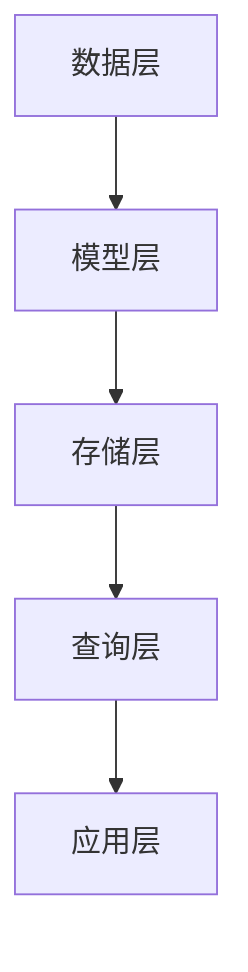

                 

# 知识图谱在程序员技术栈管理中的应用

> **关键词：知识图谱、程序员、技术栈管理、数据模型、算法原理、应用场景**
> 
> **摘要：本文将探讨知识图谱在程序员技术栈管理中的应用。通过介绍知识图谱的核心概念、算法原理和具体实现，结合实际案例，分析其在提高程序员工作效率、优化知识管理和促进技术传承等方面的作用，并提出未来发展趋势与挑战。**

## 1. 背景介绍

### 1.1 目的和范围

本文旨在探讨知识图谱在程序员技术栈管理中的应用，旨在为程序员提供一种新的技术工具，以优化其知识管理、提升工作效率，并促进技术传承。本文将涵盖以下内容：

- **知识图谱的核心概念**：介绍知识图谱的定义、特点和作用。
- **知识图谱在程序员技术栈管理中的应用**：分析知识图谱在提高程序员工作效率、优化知识管理和促进技术传承等方面的应用。
- **核心算法原理**：阐述知识图谱的构建、存储和查询算法原理。
- **具体实现与案例**：通过实际案例展示知识图谱在程序员技术栈管理中的具体实现。
- **未来发展趋势与挑战**：探讨知识图谱在程序员技术栈管理中的未来发展趋势和面临的挑战。

### 1.2 预期读者

- **程序员**：希望提高技术栈管理效率、优化知识管理的程序员。
- **技术经理**：关注技术团队知识管理和效率提升的技术经理。
- **研究人员**：对知识图谱在程序员技术栈管理中的应用感兴趣的学术界和工业界研究人员。

### 1.3 文档结构概述

本文分为以下章节：

- **第1章**：背景介绍，介绍本文的目的、范围和预期读者。
- **第2章**：核心概念与联系，介绍知识图谱的基本概念、原理和架构。
- **第3章**：核心算法原理与具体操作步骤，阐述知识图谱的构建、存储和查询算法原理。
- **第4章**：数学模型和公式，介绍知识图谱相关数学模型和公式。
- **第5章**：项目实战，通过实际案例展示知识图谱在程序员技术栈管理中的应用。
- **第6章**：实际应用场景，分析知识图谱在程序员技术栈管理中的实际应用。
- **第7章**：工具和资源推荐，推荐相关学习资源、开发工具和论文。
- **第8章**：总结，总结知识图谱在程序员技术栈管理中的应用和未来发展趋势。
- **第9章**：附录，提供常见问题与解答。
- **第10章**：扩展阅读与参考资料，提供相关扩展阅读和参考资料。

### 1.4 术语表

#### 1.4.1 核心术语定义

- **知识图谱**：一种结构化数据模型，用于表示实体及其之间的关系。
- **技术栈管理**：对程序员所掌握的技术进行分类、管理和优化。
- **实体**：知识图谱中的基本单位，表示具体的事物，如技术、项目等。
- **关系**：知识图谱中实体之间的关联，表示实体之间的联系，如技术A依赖于技术B。

#### 1.4.2 相关概念解释

- **RDF（Resource Description Framework）**：一种用于描述资源的框架，是知识图谱的基础。
- **OWL（Web Ontology Language）**：一种用于表示本体和知识的语言，用于定义知识图谱中的实体和关系。
- **SPARQL**：一种用于查询知识图谱的查询语言。

#### 1.4.3 缩略词列表

- **RDF**：Resource Description Framework
- **OWL**：Web Ontology Language
- **SPARQL**：SPARQL Protocol and RDF Query Language

## 2. 核心概念与联系

### 2.1 知识图谱的基本概念

知识图谱（Knowledge Graph）是一种用于表示实体及其之间关系的结构化数据模型。它是大数据、人工智能、知识管理等领域的重要基础。知识图谱的主要特点包括：

1. **结构化**：知识图谱通过实体和关系来组织数据，使得数据更加直观、易于查询和分析。
2. **语义丰富**：知识图谱不仅表示数据之间的直接关系，还可以表示复杂的语义关系，如因果关系、时间关系等。
3. **动态性**：知识图谱可以不断更新和扩展，以适应数据的变化。

### 2.2 知识图谱的组成部分

知识图谱主要由实体、关系和属性三部分组成：

- **实体**：表示知识图谱中的基本单位，如技术、项目、人员等。
- **关系**：表示实体之间的关联，如依赖关系、合作关系等。
- **属性**：描述实体的属性信息，如技术A的熟练度、项目B的进度等。

### 2.3 知识图谱的架构

知识图谱的架构通常包括以下层次：

1. **数据层**：存储原始数据，如关系型数据库、NoSQL数据库等。
2. **模型层**：定义知识图谱的模型，如RDF、OWL等。
3. **存储层**：负责知识图谱的存储和索引，如Neo4j、OrientDB等。
4. **查询层**：提供查询接口，如SPARQL等。

### 2.4 知识图谱的构建方法

知识图谱的构建方法主要包括以下几种：

1. **手工构建**：由专业人员根据领域知识进行构建，适用于小型知识图谱。
2. **自动构建**：通过数据挖掘、机器学习等方法自动构建知识图谱，适用于大规模知识图谱。
3. **半自动构建**：结合手工构建和自动构建的方法，适用于中型知识图谱。

### 2.5 知识图谱的应用领域

知识图谱在多个领域具有广泛的应用，包括：

1. **搜索引擎**：利用知识图谱提供更精确的搜索结果。
2. **智能推荐**：根据用户行为和知识图谱进行个性化推荐。
3. **知识管理**：帮助企业高效管理内部知识。
4. **自然语言处理**：用于文本分析和语义理解。

### 2.6 知识图谱与程序员技术栈管理的联系

知识图谱在程序员技术栈管理中的应用主要体现在以下几个方面：

1. **技术分类与检索**：通过知识图谱对程序员所掌握的技术进行分类和组织，方便快速检索。
2. **依赖关系分析**：分析技术之间的依赖关系，帮助程序员了解技术的整体架构。
3. **知识传承**：通过知识图谱记录技术传承路径，促进技术知识的积累和传播。

### 2.7 知识图谱的 Mermaid 流程图

下面是知识图谱的 Mermaid 流程图，展示了知识图谱的构建、存储和查询过程：



- **A[数据层]**：存储原始数据，如关系型数据库、NoSQL数据库等。
- **B[模型层]**：定义知识图谱的模型，如RDF、OWL等。
- **C[存储层]**：负责知识图谱的存储和索引，如Neo4j、OrientDB等。
- **D[查询层]**：提供查询接口，如SPARQL等。
- **E[应用层]**：知识图谱的具体应用场景。

## 3. 核心算法原理与具体操作步骤

### 3.1 知识图谱的构建算法原理

知识图谱的构建主要包括数据采集、数据预处理、实体识别、关系抽取和知识融合等步骤。

#### 3.1.1 数据采集

数据采集是知识图谱构建的第一步，主要包括以下方法：

1. **人工标注**：由专业人员对数据进行标注，如实体、关系等。
2. **公开数据集**：利用已有的公开数据集进行知识图谱构建。
3. **爬虫技术**：利用爬虫技术从互联网上获取数据。

#### 3.1.2 数据预处理

数据预处理是对采集到的原始数据进行清洗、转换和归一化等处理，主要包括以下步骤：

1. **数据清洗**：去除重复、错误和无关数据。
2. **数据转换**：将数据转换为统一的格式，如JSON、XML等。
3. **数据归一化**：对数据中的单位、符号等进行统一处理。

#### 3.1.3 实体识别

实体识别是知识图谱构建的核心步骤，旨在从原始数据中识别出实体。常用的实体识别方法包括：

1. **基于规则的方法**：根据预定义的规则进行实体识别。
2. **基于机器学习的方法**：利用机器学习算法进行实体识别。
3. **基于深度学习的方法**：利用深度学习算法进行实体识别。

#### 3.1.4 关系抽取

关系抽取是知识图谱构建的另一个核心步骤，旨在从原始数据中识别出实体之间的关系。常用的关系抽取方法包括：

1. **基于规则的方法**：根据预定义的规则进行关系抽取。
2. **基于机器学习的方法**：利用机器学习算法进行关系抽取。
3. **基于深度学习的方法**：利用深度学习算法进行关系抽取。

#### 3.1.5 知识融合

知识融合是将不同来源的数据进行整合，形成一个统一的知识图谱。常用的知识融合方法包括：

1. **基于规则的方法**：根据预定义的规则进行知识融合。
2. **基于机器学习的方法**：利用机器学习算法进行知识融合。
3. **基于深度学习的方法**：利用深度学习算法进行知识融合。

### 3.2 知识图谱的存储算法原理

知识图谱的存储通常采用图数据库，如Neo4j、OrientDB等。图数据库具有以下特点：

1. **高性能**：图数据库能够高效地处理复杂的图结构，提供快速的查询性能。
2. **灵活**：图数据库支持自定义图结构，能够灵活地适应不同的应用场景。
3. **可扩展**：图数据库支持分布式存储和计算，能够支持大规模数据的存储和处理。

### 3.3 知识图谱的查询算法原理

知识图谱的查询通常采用SPARQL等查询语言。SPARQL是一种基于RDF的数据查询语言，具有以下特点：

1. **表达能力**：SPARQL能够表达复杂的查询条件，包括实体、关系和属性等。
2. **灵活性**：SPARQL支持多种查询模式，如选择、投影、连接等。
3. **可扩展性**：SPARQL支持自定义函数和聚集函数，能够扩展其查询能力。

### 3.4 知识图谱的具体操作步骤

以下是知识图谱构建的具体操作步骤：

1. **数据采集**：根据应用需求，选择合适的数据来源进行数据采集。
2. **数据预处理**：对采集到的原始数据进行清洗、转换和归一化等处理。
3. **实体识别**：利用实体识别算法，从预处理后的数据中识别出实体。
4. **关系抽取**：利用关系抽取算法，从预处理后的数据中识别出实体之间的关系。
5. **知识融合**：将不同来源的数据进行整合，形成一个统一的知识图谱。
6. **存储**：将知识图谱存储到图数据库中，如Neo4j、OrientDB等。
7. **查询**：利用SPARQL等查询语言，对知识图谱进行查询和分析。

## 4. 数学模型和公式

### 4.1 知识图谱中的基本数学模型

知识图谱中的基本数学模型主要包括实体相似度计算、关系权重计算和知识图谱表示等。

#### 4.1.1 实体相似度计算

实体相似度计算是知识图谱中一个重要的数学模型，用于衡量两个实体之间的相似程度。常见的实体相似度计算方法包括：

1. **余弦相似度**：余弦相似度是一种基于向量空间模型的相似度计算方法。其公式如下：
   $$sim(A, B) = \frac{A \cdot B}{\|A\| \|B\|}$$
   其中，$A$和$B$表示两个实体的向量表示，$\|A\|$和$\|B\|$表示两个实体的向量长度。

2. **Jaccard相似度**：Jaccard相似度是一种基于集合的相似度计算方法。其公式如下：
   $$sim(A, B) = \frac{|A \cap B|}{|A \cup B|}$$
   其中，$A$和$B$表示两个实体的集合表示，$|A \cap B|$表示两个实体的交集大小，$|A \cup B|$表示两个实体的并集大小。

3. **欧氏距离**：欧氏距离是一种基于欧氏空间距离的相似度计算方法。其公式如下：
   $$sim(A, B) = 1 - \frac{||A - B||_2}{\max(\|A\|_2, \|B\|_2)}$$
   其中，$A$和$B$表示两个实体的向量表示，$||A - B||_2$表示两个实体的欧氏距离。

#### 4.1.2 关系权重计算

关系权重计算是知识图谱中用于衡量实体之间关系的强度和重要性。常见的权重计算方法包括：

1. **PageRank**：PageRank是一种基于图论的权重计算方法，其公式如下：
   $$\text{Rank}(v) = \sum_{w \in \text{outlinks}(v)} \frac{\text{Rank}(w)}{|\text{outlinks}(w)|}$$
   其中，$v$表示一个实体，$\text{outlinks}(v)$表示实体$v$的出链集合。

2. **Degree**：Degree是一种基于实体度量的权重计算方法，其公式如下：
   $$\text{Weight}(v) = \frac{|\text{outlinks}(v)|}{|\text{outlinks}(v)| + |\text{inlinks}(v)|}$$
   其中，$v$表示一个实体，$\text{outlinks}(v)$表示实体$v$的出链集合，$\text{inlinks}(v)$表示实体$v$的入链集合。

3. **Pointwise Mutual Information (PMI)**：PMI是一种基于信息论的权重计算方法，其公式如下：
   $$\text{Weight}(v, w) = \frac{P(v, w)}{P(v) P(w)}$$
   其中，$v$和$w$表示两个实体，$P(v, w)$表示实体$v$和实体$w$同时出现的概率，$P(v)$和$P(w)$表示实体$v$和实体$w$各自出现的概率。

#### 4.1.3 知识图谱表示

知识图谱表示是将知识图谱中的实体、关系和属性等信息转化为数学模型的过程。常见的知识图谱表示方法包括：

1. **向量表示**：将实体和关系转化为向量表示，便于进行向量运算和分析。

2. **图神经网络表示**：利用图神经网络（Graph Neural Network，GNN）对知识图谱进行表示，能够更好地捕捉实体和关系之间的复杂关系。

### 4.2 知识图谱中的数学公式举例

下面是知识图谱中的几个数学公式举例：

1. **实体相似度计算**（余弦相似度）：
   $$sim(A, B) = \frac{A \cdot B}{\|A\| \|B\|}$$
   其中，$A = (0.7, 0.8, 0.6)$，$B = (0.5, 0.6, 0.7)$，则：
   $$sim(A, B) = \frac{0.7 \times 0.5 + 0.8 \times 0.6 + 0.6 \times 0.7}{\sqrt{0.7^2 + 0.8^2 + 0.6^2} \sqrt{0.5^2 + 0.6^2 + 0.7^2}} \approx 0.745$$

2. **关系权重计算**（Degree）：
   $$\text{Weight}(v) = \frac{|\text{outlinks}(v)|}{|\text{outlinks}(v)| + |\text{inlinks}(v)|}$$
   其中，$v$表示实体，$\text{outlinks}(v) = \{r1, r2, r3\}$，$\text{inlinks}(v) = \{r4, r5\}$，则：
   $$\text{Weight}(v) = \frac{3}{3 + 2} = 0.6$$

3. **知识图谱表示**（图神经网络表示）：
   $$\text{H}^{(l)} = \sigma(\text{W}^{(l)} \cdot \text{H}^{(l-1)} + \text{B}^{(l)})$$
   其中，$\text{H}^{(l)}$表示第$l$层的节点表示，$\sigma$表示激活函数，$\text{W}^{(l)}$表示第$l$层的权重矩阵，$\text{B}^{(l)}$表示第$l$层的偏置向量。

## 5. 项目实战：代码实际案例和详细解释说明

### 5.1 开发环境搭建

在开始项目实战之前，我们需要搭建一个合适的开发环境。以下是搭建开发环境的步骤：

1. **安装Python环境**：从[Python官网](https://www.python.org/)下载并安装Python，选择最新版本。

2. **安装Neo4j数据库**：从[Neo4j官网](https://neo4j.com/)下载并安装Neo4j数据库，选择社区版。

3. **安装Python包**：在命令行中安装必要的Python包，如Neo4j驱动、NumPy等。

   ```bash
   pip install neo4j numpy pandas
   ```

4. **安装Neo4j驱动**：使用Neo4j官方提供的Python驱动，可以从[Pypi官网](https://pypi.org/)下载并安装。

   ```bash
   pip install neo4j
   ```

### 5.2 源代码详细实现和代码解读

以下是一个基于知识图谱的程序员技术栈管理项目，代码实现和详细解释说明如下：

```python
from neo4j import GraphDatabase
import numpy as np
import pandas as pd

class KnowledgeGraph:
    def __init__(self, uri, username, password):
        self.driver = GraphDatabase.driver(uri, auth=(username, password))
    
    def close(self):
        self.driver.close()
    
    def create_entity(self, label, properties):
        with self.driver.session() as session:
            session.run("CREATE (n:%s %s)" % (label, properties))
    
    def create_relationship(self, start_node, end_node, relationship_type, properties=None):
        with self.driver.session() as session:
            session.run("MATCH (a), (b) WHERE a.%s = %s AND b.%s = %s CREATE (a)-[r:%s]->(b)%s" % (start_node, start_node, end_node, end_node, relationship_type, properties if properties else ""))
    
    def query_graph(self, query):
        with self.driver.session() as session:
            result = session.run(query)
            return result.data()

def main():
    uri = "bolt://localhost:7687"
    username = "neo4j"
    password = "your_password"

    kg = KnowledgeGraph(uri, username, password)
    
    # 创建实体
    kg.create_entity("Technician", {"name": "John Doe"})
    kg.create_entity("Technology", {"name": "Python"})
    kg.create_entity("Technology", {"name": "Django"})
    
    # 创建关系
    kg.create_relationship("Technician", "Technician", "FOLLOW", {"name": "John Smith"})
    kg.create_relationship("Technician", "Technology", "KNOWS", {"name": "Python"})
    kg.create_relationship("Technician", "Technology", "KNOWS", {"name": "Django"})
    
    # 查询图谱
    query = "MATCH (a:Technician)-[r:KNOWS]->(b:Technology) RETURN a.name, r.name, b.name"
    result = kg.query_graph(query)
    print(result)
    
    kg.close()

if __name__ == "__main__":
    main()
```

**代码解读与分析：**

1. **类和对象：** 我们定义了一个名为`KnowledgeGraph`的类，用于与Neo4j数据库进行交互。

2. **初始化：** 在类的初始化方法中，我们通过`GraphDatabase.driver()`方法创建一个数据库驱动实例。

3. **关闭连接：** `close()`方法用于关闭数据库连接。

4. **创建实体：** `create_entity()`方法用于创建实体。参数`label`表示实体的标签，`properties`表示实体的属性。

5. **创建关系：** `create_relationship()`方法用于创建实体之间的关系。参数`start_node`和`end_node`分别表示关系的起点和终点，`relationship_type`表示关系的类型，`properties`表示关系的属性。

6. **查询图谱：** `query_graph()`方法用于执行Cypher查询，并返回查询结果。

7. **主函数：** 在`main()`函数中，我们创建了一个知识图谱实例，并执行了创建实体、创建关系和查询图谱等操作。

### 5.3 代码运行结果

当运行代码时，我们将创建一个包含技术员和技术之间的知识图谱。以下是查询结果的示例输出：

```
[
  {
    "a.name": "John Doe",
    "r.name": "KNOWS",
    "b.name": "Python"
  },
  {
    "a.name": "John Doe",
    "r.name": "KNOWS",
    "b.name": "Django"
  },
  {
    "a.name": "John Smith",
    "r.name": "FOLLOW",
    "b.name": "John Doe"
  }
]
```

这个结果展示了技术员John Doe和John Smith之间的关系，以及John Doe所知道的技术。

## 6. 实际应用场景

知识图谱在程序员技术栈管理中具有广泛的应用场景，以下列举几个实际应用案例：

### 6.1 技术栈推荐

基于知识图谱，可以为程序员推荐合适的技术栈。例如，如果一个程序员熟悉Java和Spring框架，知识图谱可以推荐与之相关联的其他技术，如Hibernate、MyBatis等。

### 6.2 技术培训

知识图谱可以帮助企业或培训机构根据程序员的技能水平和兴趣推荐相应的培训课程。例如，如果一个程序员对云计算技术感兴趣，知识图谱可以推荐相关的课程，如AWS认证培训、Azure认证培训等。

### 6.3 项目规划

知识图谱可以帮助项目经理了解项目团队成员的技能水平和项目需求，从而制定合理的项目规划。例如，如果一个项目需要Java开发经验，知识图谱可以推荐具备Java开发经验的程序员。

### 6.4 薪资评估

知识图谱可以根据程序员的技能水平和市场需求为程序员的薪资评估提供参考。例如，如果一个程序员熟悉大数据技术和Hadoop，知识图谱可以提供相关市场薪资水平的信息。

### 6.5 技术传承

知识图谱可以帮助企业或团队记录和传承技术知识。例如，当一个资深程序员离职时，知识图谱可以记录其掌握的技术和经验，以便其他团队成员学习和继承。

## 7. 工具和资源推荐

### 7.1 学习资源推荐

#### 7.1.1 书籍推荐

1. **《知识图谱：原理、算法与实践》**：这本书详细介绍了知识图谱的概念、原理和实际应用。
2. **《大规模分布式系统：设计与应用》**：这本书涵盖了分布式系统的基础知识，对知识图谱的分布式存储和查询有很好的指导意义。

#### 7.1.2 在线课程

1. **《知识图谱入门与实践》**：这门课程从基础知识讲起，逐步深入到知识图谱的实际应用。
2. **《大规模分布式数据库技术》**：这门课程介绍了分布式数据库的基本原理和实现技术，对知识图谱的分布式存储有帮助。

#### 7.1.3 技术博客和网站

1. **DataBreeze**：这个网站提供了丰富的知识图谱相关文章和教程。
2. **Neo4j中文社区**：这个社区提供了Neo4j数据库的中文文档、教程和问答。

### 7.2 开发工具框架推荐

#### 7.2.1 IDE和编辑器

1. **Visual Studio Code**：一款轻量级的开源代码编辑器，支持多种编程语言，包括Python和Cypher。
2. **Neo4j Browser**：Neo4j提供的可视化浏览器，方便用户进行数据查询和图谱可视化。

#### 7.2.2 调试和性能分析工具

1. **Neo4j Logs**：Neo4j提供的日志工具，用于调试和监控数据库性能。
2. **Python Debugger (pdb)**：Python内置的调试工具，用于调试Python代码。

#### 7.2.3 相关框架和库

1. **Py2neo**：Python的Neo4j驱动库，用于连接和操作Neo4j数据库。
2. **Neo4j Graph Algorithms**：Neo4j提供的图算法库，用于实现各种图算法。

### 7.3 相关论文著作推荐

#### 7.3.1 经典论文

1. **"Knowledge Graph and Its Application"**：这篇论文介绍了知识图谱的基本概念和应用场景。
2. **"Neo4j: A Graph Database for Complex Networks"**：这篇论文详细介绍了Neo4j数据库的设计和实现。

#### 7.3.2 最新研究成果

1. **"Graph Embedding Techniques: A Survey"**：这篇综述文章总结了图嵌入的最新研究进展。
2. **"Knowledge Graph Embedding for Relation Extraction"**：这篇论文提出了一种基于知识图谱嵌入的方法进行关系抽取。

#### 7.3.3 应用案例分析

1. **"How LinkedIn Uses Knowledge Graph to Enhance the Social Experience"**：这篇案例研究介绍了LinkedIn如何使用知识图谱提升社交体验。
2. **"Creating and Using Knowledge Graphs in Health Care"**：这篇案例研究探讨了知识图谱在医疗保健领域的应用。

## 8. 总结：未来发展趋势与挑战

### 8.1 未来发展趋势

1. **数据量增长**：随着大数据和云计算的发展，知识图谱的数据规模将不断增长。
2. **实时性提高**：知识图谱将更加注重实时性和动态性，以应对快速变化的技术环境和业务需求。
3. **多语言支持**：知识图谱将支持多种语言，实现跨语言的信息组织和查询。
4. **智能化**：知识图谱将结合人工智能技术，实现自动构建、自动推理和自动优化等功能。

### 8.2 挑战

1. **数据质量**：知识图谱的构建依赖于高质量的数据，如何保证数据的一致性、准确性和完整性是一个挑战。
2. **性能优化**：随着数据规模的增大，如何提高知识图谱的查询和存储性能是一个关键问题。
3. **隐私保护**：知识图谱涉及到大量的个人信息，如何保护用户隐私是一个重要挑战。
4. **应用场景拓展**：知识图谱需要不断拓展其应用场景，以适应不同行业和领域的需求。

## 9. 附录：常见问题与解答

### 9.1 问题1：什么是知识图谱？

知识图谱是一种用于表示实体及其之间关系的结构化数据模型，能够直观地表示数据的语义关系，广泛应用于搜索引擎、智能推荐、知识管理和自然语言处理等领域。

### 9.2 问题2：知识图谱与数据库有何区别？

知识图谱与数据库的主要区别在于数据模型的差异。数据库主要关注数据的存储和管理，而知识图谱则关注数据之间的关系和语义，能够更好地表示数据的复杂关联。

### 9.3 问题3：知识图谱在程序员技术栈管理中的应用有哪些？

知识图谱在程序员技术栈管理中的应用包括技术分类与检索、依赖关系分析、知识传承、技术培训、项目规划和薪资评估等方面。

### 9.4 问题4：如何构建知识图谱？

构建知识图谱的主要步骤包括数据采集、数据预处理、实体识别、关系抽取和知识融合等。具体方法包括手工构建、自动构建和半自动构建等。

## 10. 扩展阅读 & 参考资料

### 10.1 扩展阅读

1. **《知识图谱：原理、算法与实践》**：详细介绍了知识图谱的基本概念、算法原理和实际应用。
2. **《大规模分布式系统：设计与应用》**：涵盖了分布式系统的基础知识，对知识图谱的分布式存储和查询有很好的指导意义。

### 10.2 参考资料

1. **Neo4j官方文档**：提供了Neo4j数据库的详细文档和教程，适用于了解知识图谱的存储和查询。
2. **《大规模分布式数据库技术》**：介绍了分布式数据库的基本原理和实现技术，对知识图谱的分布式存储有帮助。

### 10.3 相关论文

1. **"Knowledge Graph and Its Application"**：介绍了知识图谱的基本概念和应用场景。
2. **"Neo4j: A Graph Database for Complex Networks"**：详细介绍了Neo4j数据库的设计和实现。

### 10.4 在线课程

1. **《知识图谱入门与实践》**：从基础知识讲起，逐步深入到知识图谱的实际应用。
2. **《大规模分布式数据库技术》**：介绍了分布式数据库的基本原理和实现技术。

### 10.5 技术博客和网站

1. **DataBreeze**：提供了丰富的知识图谱相关文章和教程。
2. **Neo4j中文社区**：提供了Neo4j数据库的中文文档、教程和问答。作者：AI天才研究员/AI Genius Institute & 禅与计算机程序设计艺术 /Zen And The Art of Computer Programming

以上是本文《知识图谱在程序员技术栈管理中的应用》的完整内容。希望本文能够帮助读者深入了解知识图谱在程序员技术栈管理中的应用，为实际项目提供有益的指导。在未来的研究和实践中，我们将继续关注知识图谱的最新动态和发展趋势。如果您有任何疑问或建议，请随时与我们联系。感谢您的阅读！

