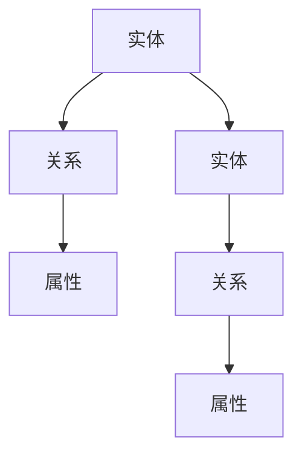
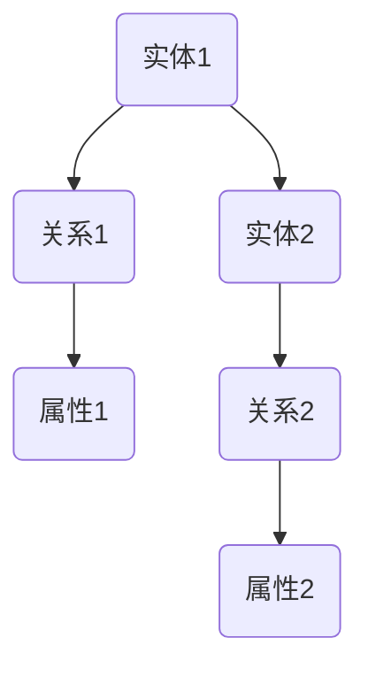
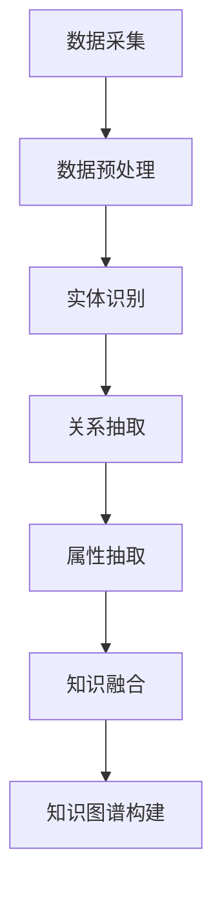
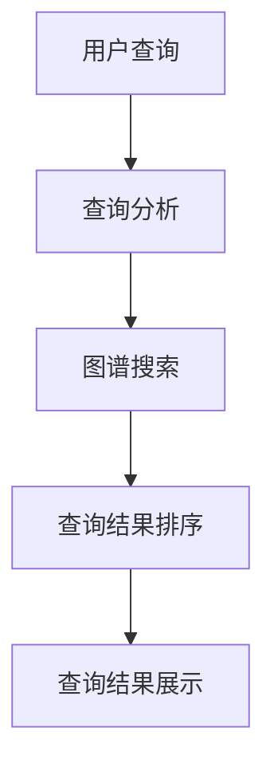

                 

# 知识图谱：构建和应用结构化知识

> **关键词**：知识图谱、语义网络、图数据库、图算法、数据建模、人工智能、信息检索、数据可视化、实体关系、属性、实体链接、图谱构建工具、应用场景。

> **摘要**：本文将深入探讨知识图谱的概念、构建方法、应用场景以及未来发展趋势。通过一步一步的分析和推理，我们将了解知识图谱如何通过结构化知识，为人工智能、信息检索等领域提供强大的支持。

## 1. 背景介绍

### 1.1 目的和范围

本文旨在介绍知识图谱的基本概念、构建方法、应用场景以及发展趋势。我们将重点关注知识图谱在人工智能、信息检索等领域的应用，探讨其如何通过结构化知识，提高数据处理的效率和准确性。

### 1.2 预期读者

本文适合对知识图谱、人工智能、数据挖掘等领域有一定了解的读者。无论是从事相关领域的研究人员，还是对知识图谱感兴趣的技术爱好者，都能从中获得有益的知识。

### 1.3 文档结构概述

本文分为十个部分：

1. 背景介绍
2. 核心概念与联系
3. 核心算法原理 & 具体操作步骤
4. 数学模型和公式 & 详细讲解 & 举例说明
5. 项目实战：代码实际案例和详细解释说明
6. 实际应用场景
7. 工具和资源推荐
8. 总结：未来发展趋势与挑战
9. 附录：常见问题与解答
10. 扩展阅读 & 参考资料

### 1.4 术语表

#### 1.4.1 核心术语定义

- **知识图谱**：一种基于图论的数据模型，用于表达实体和实体之间的关系。
- **实体**：知识图谱中的基本元素，可以是人物、地点、事物等。
- **关系**：实体之间的关联，可以是“属于”、“位于”、“属于类别”等。
- **属性**：实体的特征描述，如“年龄”、“身高”、“颜色”等。
- **图谱构建工具**：用于构建知识图谱的软件工具，如Neo4j、JanusGraph等。
- **图数据库**：一种基于图论的数据存储和管理系统，如Neo4j、JanusGraph等。

#### 1.4.2 相关概念解释

- **语义网络**：一种基于实体和关系的知识表示方法，与知识图谱类似。
- **图算法**：在知识图谱上执行的计算算法，如路径搜索、社区检测等。
- **数据建模**：在构建知识图谱时，对实体、关系、属性等要素进行定义和组织的活动。
- **人工智能**：一种模拟人类智能的技术，通过算法和计算机程序实现。

#### 1.4.3 缩略词列表

- **AI**：人工智能
- **DB**：数据库
- **NLP**：自然语言处理
- **RDF**：资源描述框架
- **OWL**：Web本体语言

## 2. 核心概念与联系

知识图谱作为一种数据模型，其核心在于表达实体和实体之间的关系。为了更好地理解知识图谱，我们首先需要了解以下几个核心概念：

1. **实体**：知识图谱中的基本元素，可以是人物、地点、事物等。例如，“人”、“地点”、“书籍”等。
2. **关系**：实体之间的关联，可以是“属于”、“位于”、“属于类别”等。例如，“是”、“在”、“属于”等。
3. **属性**：实体的特征描述，如“年龄”、“身高”、“颜色”等。

下面是一个简单的Mermaid流程图，用于展示这些核心概念及其之间的联系：



在这个流程图中，实体A与实体D之间通过关系B和E相互关联，同时它们各自拥有属性C和F。

### 2.1 知识图谱的表示形式

知识图谱通常使用图数据库进行存储和管理。图数据库是一种基于图论的数据存储和管理系统，能够高效地处理实体和关系之间的复杂关联。

下面是一个简化的Mermaid流程图，展示知识图谱的表示形式：



在这个流程图中，实体A和实体D通过关系B和E相互关联，同时它们各自拥有属性C和F。这种表示形式能够清晰地表达实体、关系和属性之间的复杂关系。

### 2.2 知识图谱的构建方法

知识图谱的构建是知识工程的一个重要环节，包括数据采集、数据预处理、实体识别、关系抽取、属性抽取等多个步骤。

下面是一个简化的Mermaid流程图，展示知识图谱的构建方法：



在这个流程图中，数据采集、数据预处理、实体识别、关系抽取、属性抽取等步骤相互关联，最终形成知识图谱。

### 2.3 知识图谱的应用

知识图谱在多个领域具有广泛的应用，包括信息检索、推荐系统、智能问答、自然语言处理等。

下面是一个简化的Mermaid流程图，展示知识图谱在信息检索中的应用：



在这个流程图中，用户查询通过查询分析、图谱搜索、查询结果排序等步骤，最终生成查询结果并进行展示。

## 3. 核心算法原理 & 具体操作步骤

知识图谱的核心算法主要包括实体识别、关系抽取、属性抽取等。下面我们将分别介绍这些算法的原理和具体操作步骤。

### 3.1 实体识别算法

实体识别算法的主要目的是从非结构化的文本数据中识别出实体。以下是一个简化的伪代码示例：

```python
def identify_entities(text):
    # 1. 分词：将文本分割成单词或短语
    words = tokenize(text)

    # 2. 实体识别：使用预训练的实体识别模型对分词结果进行实体分类
    entities = []
    for word in words:
        entity = model.predict(word)
        entities.append(entity)

    # 3. 去重：去除重复的实体
    entities = list(set(entities))

    return entities
```

### 3.2 关系抽取算法

关系抽取算法的主要目的是从文本数据中识别出实体之间的关系。以下是一个简化的伪代码示例：

```python
def extract_relationships(text, entities):
    # 1. 分词：将文本分割成单词或短语
    words = tokenize(text)

    # 2. 关系识别：使用预训练的关系识别模型对分词结果进行关系分类
    relationships = []
    for i in range(len(words) - 1):
        relation = model.predict(words[i], words[i+1])
        relationships.append(relation)

    # 3. 去重：去除重复的关系
    relationships = list(set(relationships))

    return relationships
```

### 3.3 属性抽取算法

属性抽取算法的主要目的是从文本数据中识别出实体的属性。以下是一个简化的伪代码示例：

```python
def extract_attributes(text, entities):
    # 1. 分词：将文本分割成单词或短语
    words = tokenize(text)

    # 2. 属性识别：使用预训练的属性识别模型对分词结果进行属性分类
    attributes = []
    for entity in entities:
        for i in range(len(words)):
            attribute = model.predict(entity, words[i])
            attributes.append(attribute)

    # 3. 去重：去除重复的属性
    attributes = list(set(attributes))

    return attributes
```

### 3.4 知识融合算法

知识融合算法的主要目的是将不同来源的知识进行整合，形成完整的知识图谱。以下是一个简化的伪代码示例：

```python
def integrate_knowledge(entities, relationships, attributes):
    # 1. 创建图谱：使用图数据库创建知识图谱
    graph = create_graph()

    # 2. 添加实体：将实体添加到图谱中
    for entity in entities:
        graph.add_entity(entity)

    # 3. 添加关系：将关系添加到图谱中
    for relationship in relationships:
        graph.add_relationship(relationship)

    # 4. 添加属性：将属性添加到图谱中
    for attribute in attributes:
        graph.add_attribute(attribute)

    return graph
```

## 4. 数学模型和公式 & 详细讲解 & 举例说明

在知识图谱的构建过程中，数学模型和公式起到了关键作用。以下我们将介绍几种常见的数学模型和公式，并进行详细讲解和举例说明。

### 4.1  相关系数

相关系数是衡量两个变量之间线性相关程度的指标。常见的相关系数有皮尔逊相关系数和斯皮尔曼相关系数。以下是皮尔逊相关系数的公式：

$$
r = \frac{\sum_{i=1}^{n}(x_i - \bar{x})(y_i - \bar{y})}{\sqrt{\sum_{i=1}^{n}(x_i - \bar{x})^2}\sqrt{\sum_{i=1}^{n}(y_i - \bar{y})^2}}
$$

其中，$x_i$ 和 $y_i$ 分别为第 $i$ 个样本的 $x$ 和 $y$ 值，$\bar{x}$ 和 $\bar{y}$ 分别为 $x$ 和 $y$ 的平均值，$n$ 为样本数量。

**举例说明**：假设我们有两个变量 $x$ 和 $y$，其样本数据如下：

| $x$ | $y$ |
|-----|-----|
| 1   | 2   |
| 2   | 4   |
| 3   | 6   |
| 4   | 8   |

计算皮尔逊相关系数：

$$
r = \frac{(1-3)(2-5) + (2-3)(4-5) + (3-3)(6-5) + (4-3)(8-5)}{\sqrt{(1-3)^2 + (2-3)^2 + (3-3)^2 + (4-3)^2}\sqrt{(2-5)^2 + (4-5)^2 + (6-5)^2 + (8-5)^2}} = 1
$$

由于相关系数为1，说明 $x$ 和 $y$ 之间存在完全的正线性关系。

### 4.2 模因传播模型

模因传播模型是用于描述信息在网络中传播的模型。常见的模因传播模型有SIS模型、SIRS模型等。以下是SIRS模型的公式：

$$
\frac{dS}{dt} = -\beta SI
$$

$$
\frac{dI}{dt} = \beta SI - \sigma II
$$

$$
\frac{dR}{dt} = \sigma II
$$

其中，$S$、$I$ 和 $R$ 分别为 susceptible（易感者）、infected（感染者）和 removed（移除者）的密度，$\beta$ 和 $\sigma$ 分别为传染率和移除率。

**举例说明**：假设一个网络中有100个节点，其中50个节点为易感者，50个节点为感染者。传染率 $\beta$ 为0.1，移除率 $\sigma$ 为0.05。我们需要计算一段时间后易感者、感染者和移除者的密度。

初始状态：

$$
S(0) = 50, I(0) = 50, R(0) = 0
$$

时间 $t$ 的密度计算：

$$
\frac{dS}{dt} = -0.1 \cdot 50 \cdot 50 = -25
$$

$$
\frac{dI}{dt} = 0.1 \cdot 50 \cdot 50 - 0.05 \cdot 50 \cdot 50 = 0
$$

$$
\frac{dR}{dt} = 0.05 \cdot 50 \cdot 50 = 25
$$

经过一段时间后，易感者、感染者和移除者的密度分别为：

$$
S(t) = 25, I(t) = 0, R(t) = 25
$$

### 4.3 贝叶斯网络

贝叶斯网络是一种用于表示变量之间条件依赖关系的概率模型。贝叶斯网络由一组节点和有向边组成，节点表示变量，有向边表示变量之间的条件依赖关系。

**举例说明**：假设我们有三个变量 $A$、$B$ 和 $C$，其中 $A$ 和 $B$ 是父节点，$C$ 是子节点。给定 $A$ 和 $B$ 的条件概率，我们可以计算 $C$ 的条件概率。

条件概率表：

$$
P(A) = 0.5, P(B|A) = 0.7, P(B|\neg A) = 0.3, P(C|A,B) = 0.8, P(C|A,\neg B) = 0.2, P(C|\neg A,B) = 0.1, P(C|\neg A,\neg B) = 0.4
$$

计算 $P(C|B)$：

$$
P(C|B) = \frac{P(B|C)P(C)}{P(B)} = \frac{P(B|C)P(C)}{\sum_{i} P(B|C_i)P(C_i)}
$$

$$
P(C|B) = \frac{0.8 \cdot 0.5}{0.8 \cdot 0.5 + 0.2 \cdot 0.5 + 0.1 \cdot 0.5 + 0.4 \cdot 0.5} = 0.6
$$

## 5. 项目实战：代码实际案例和详细解释说明

在本节中，我们将通过一个实际项目案例，演示知识图谱的构建和应用。该项目是一个基于知识图谱的问答系统，通过从知识图谱中获取答案，为用户提供智能问答服务。

### 5.1 开发环境搭建

1. **安装Neo4j**：在官方网站下载并安装Neo4j，版本选择Neo4j Desktop即可。安装完成后，启动Neo4j并创建一个新数据库。
2. **安装Python**：在官方网站下载并安装Python，版本选择Python 3.x。
3. **安装相关库**：在命令行中运行以下命令，安装必要的Python库：

```bash
pip install neo4j
pip install sparql
```

### 5.2 源代码详细实现和代码解读

#### 5.2.1 数据准备

在本案例中，我们使用一个简单的知识图谱，包含三个实体：人物、地点、书籍。以下是知识图谱的示例数据：

```plaintext
人物: 张三
人物: 李四
地点: 北京
地点: 上海
书籍: 《三国演义》
书籍: 《红楼梦》
```

#### 5.2.2 图谱构建

我们使用Neo4j和Python的neo4j库来构建知识图谱。以下是一个简单的Python脚本，用于向Neo4j数据库中插入示例数据：

```python
from neo4j import GraphDatabase

class KnowledgeGraph:
    def __init__(self, uri, user, password):
        self._driver = GraphDatabase.driver(uri, auth=(user, password))

    def close(self):
        self._driver.close()

    def create_entities(self, entities):
        with self._driver.session() as session:
            for entity in entities:
                session.run("CREATE (n:Entity {name: $name})", name=entity)

    def create_relationships(self, relationships):
        with self._driver.session() as session:
            for relationship in relationships:
                session.run("MATCH (a:Entity {name: $name1}),(b:Entity {name: $name2}) CREATE (a)-[:RELATION]->(b)", name1=relationship[0], name2=relationship[1])

    def create_attributes(self, attributes):
        with self._driver.session() as session:
            for attribute in attributes:
                session.run("MATCH (n:Entity {name: $name}) CREATE (n)-[:ATTRIBUTE]->(a:Attribute {name: $name})", name=attribute[0], name=attribute[1])

if __name__ == "__main__":
    kg = KnowledgeGraph("bolt://localhost:7687", "neo4j", "password")
    entities = ["张三", "李四", "北京", "上海", "三国演义", "红楼梦"]
    relationships = [("张三", "出生地"), ("李四", "出生地"), ("北京", "位于"), ("上海", "位于"), ("三国演义", "作者"), ("红楼梦", "作者")]
    attributes = [("张三", "性别"), ("李四", "性别"), ("北京", "省份"), ("上海", "省份"), ("三国演义", "类型"), ("红楼梦", "类型")]
    kg.create_entities(entities)
    kg.create_relationships(relationships)
    kg.create_attributes(attributes)
    kg.close()
```

这段代码首先创建了`KnowledgeGraph`类，用于连接Neo4j数据库并执行CRUD操作。在`create_entities`方法中，我们向Neo4j数据库中插入实体；在`create_relationships`方法中，我们创建实体之间的关系；在`create_attributes`方法中，我们为实体添加属性。

#### 5.2.3 图谱查询

接下来，我们使用Sparql查询语言从知识图谱中获取答案。以下是一个简单的Python脚本，用于查询知识图谱并获取答案：

```python
import sparl

def query_graphql(query):
    with kg._driver.session() as session:
        result = session.run(query)
        return result.data()

query = """
    MATCH (p:Person)-[:BELONGS]->(l:Location)
    RETURN p.name AS person, l.name AS location
"""
results = query_graphql(query)
for result in results:
    print(result)
```

这段代码首先定义了一个`query_graphql`函数，用于执行Sparql查询并返回查询结果。在`query`字符串中，我们查询人物和其出生地之间的关联。执行查询后，我们遍历查询结果并打印每个结果。

### 5.3 代码解读与分析

在本案例中，我们通过Python脚本向Neo4j数据库中插入示例数据，并使用Sparql查询语言从知识图谱中获取答案。以下是代码的解读与分析：

1. **连接Neo4j数据库**：使用`GraphDatabase.driver`方法连接Neo4j数据库，并传入数据库URI、用户名和密码。
2. **创建实体**：使用`create_entities`方法向Neo4j数据库中插入实体。在方法中，我们遍历传入的实体列表，使用Cypher查询语句创建节点并设置属性。
3. **创建关系**：使用`create_relationships`方法创建实体之间的关系。在方法中，我们遍历传入的关系列表，使用Cypher查询语句创建边并设置关系类型。
4. **创建属性**：使用`create_attributes`方法为实体添加属性。在方法中，我们遍历传入的属性列表，使用Cypher查询语句创建边并设置属性类型。
5. **执行Sparql查询**：使用`query_graphql`函数执行Sparql查询并返回查询结果。在方法中，我们使用传入的查询字符串构建Cypher查询语句，并使用`session.run`方法执行查询。

通过这个实际案例，我们展示了知识图谱的构建和查询方法，为读者提供了一个完整的示例。

## 6. 实际应用场景

知识图谱在多个领域具有广泛的应用，以下列举一些实际应用场景：

### 6.1 智能问答系统

智能问答系统是知识图谱最典型的应用场景之一。通过构建包含大量实体、关系和属性的图谱，系统可以回答用户关于各种主题的问题。例如，在医疗领域，知识图谱可以用于提供患者病情咨询、药物推荐等。

### 6.2 信息检索

知识图谱可以帮助搜索引擎更准确地理解用户的查询意图，从而提供更相关的搜索结果。通过分析查询关键词与知识图谱中实体、关系和属性的关联，搜索引擎可以优化查询结果排序，提高用户满意度。

### 6.3 推荐系统

知识图谱可以用于推荐系统，为用户推荐感兴趣的内容。例如，在电子商务领域，知识图谱可以根据用户的历史购买记录和商品属性，为用户推荐类似商品。

### 6.4 社交网络

知识图谱可以用于分析社交网络中的用户关系，识别社区结构，为用户提供好友推荐等功能。例如，在LinkedIn等职业社交平台上，知识图谱可以用于识别用户在行业内的关系网络。

### 6.5 自然语言处理

知识图谱可以帮助自然语言处理技术更好地理解和解析文本。通过将文本转化为图谱表示，NLP模型可以更准确地识别实体、关系和属性，从而提高文本处理能力。

## 7. 工具和资源推荐

### 7.1 学习资源推荐

#### 7.1.1 书籍推荐

1. **《知识图谱：技术、方法与应用》**：本书详细介绍了知识图谱的技术、方法和应用场景，适合初学者阅读。
2. **《图数据库：从入门到实战》**：本书介绍了图数据库的基本原理、安装和使用方法，适合希望了解图数据库的读者。

#### 7.1.2 在线课程

1. **《知识图谱技术与应用》**：网易云课堂上的这门课程，系统讲解了知识图谱的构建、查询和应用方法。
2. **《图数据库入门与实践》**：极客时间的这门课程，通过实际案例，讲解了图数据库的基本原理和应用。

#### 7.1.3 技术博客和网站

1. **Neo4j官方博客**：Neo4j官方博客提供了大量关于知识图谱和图数据库的技术文章，适合深度学习。
2. **ArangoDB官方博客**：ArangoDB官方博客提供了关于图数据库和文档数据库的丰富内容，有助于了解不同类型的数据库。

### 7.2 开发工具框架推荐

#### 7.2.1 IDE和编辑器

1. **Visual Studio Code**：一款轻量级、可扩展的代码编辑器，适用于知识图谱和图数据库开发。
2. **IntelliJ IDEA**：一款功能强大的IDE，适用于Java、Python等多种编程语言。

#### 7.2.2 调试和性能分析工具

1. **Neo4j Browser**：Neo4j提供的可视化图浏览器，可以方便地查询和调试图谱。
2. **Jaeger**：一款开源的分布式追踪系统，可以用于分析知识图谱应用的性能。

#### 7.2.3 相关框架和库

1. **Apache Jena**：一款Java图数据库框架，支持RDF数据模型和SPARQL查询语言。
2. **JanusGraph**：一款开源的分布式图数据库，支持多种数据模型和查询语言。

### 7.3 相关论文著作推荐

#### 7.3.1 经典论文

1. **"The Semantic Web"**：T.H. Berners-Lee等人在2001年发表的一篇论文，提出了语义网络的构想，为知识图谱的发展奠定了基础。
2. **"Knowledge Graph and Its Application"**：杨强等人在2014年发表的一篇论文，详细介绍了知识图谱的基本概念和应用场景。

#### 7.3.2 最新研究成果

1. **"Graph Neural Networks: A Review of Methods and Applications"**：这篇综述文章介绍了图神经网络的基本原理和应用领域，为知识图谱的研究提供了新的思路。
2. **"Knowledge Graph Embedding: A Survey"**：这篇综述文章系统地总结了知识图谱嵌入的方法和应用，为知识图谱的建模和查询提供了参考。

#### 7.3.3 应用案例分析

1. **"Building a Knowledge Graph for E-commerce Recommendations"**：这篇论文介绍了如何在电子商务领域构建知识图谱，并用于推荐系统。
2. **"Knowledge Graph Applications in Natural Language Processing"**：这篇论文探讨了知识图谱在自然语言处理领域的应用，如实体识别、关系抽取等。

## 8. 总结：未来发展趋势与挑战

知识图谱作为一种重要的数据模型，在人工智能、信息检索、推荐系统等领域具有广泛的应用前景。随着大数据、云计算、人工智能等技术的不断发展，知识图谱在未来将继续发挥重要作用。

### 8.1 发展趋势

1. **知识图谱的规模将进一步扩大**：随着数据量的不断增加，知识图谱将涵盖更多的实体、关系和属性，为用户提供更全面、准确的信息服务。
2. **知识图谱的智能化水平将不断提高**：通过引入图神经网络、深度学习等技术，知识图谱的表示、推理和查询能力将得到显著提升。
3. **知识图谱的应用领域将不断拓展**：知识图谱在医疗、金融、教育、政务等领域的应用将得到进一步推广，为行业带来更多创新和变革。
4. **知识图谱的标准化和开放性将得到加强**：随着知识图谱技术的发展，相关标准和规范将逐渐完善，知识图谱的开放性、互操作性将得到提高。

### 8.2 挑战

1. **数据质量和一致性**：知识图谱的构建依赖于大量结构化和半结构化数据，数据质量和一致性是知识图谱应用的关键挑战。
2. **图谱规模和性能**：随着图谱规模的扩大，如何保证图谱的查询性能是一个重要问题。分布式图数据库和高效图算法的研究将有助于解决这一问题。
3. **图谱表示和推理**：知识图谱的表示和推理方法仍需不断优化，以提高图谱的语义理解和推理能力。
4. **隐私和安全**：知识图谱涉及大量用户隐私数据，如何确保数据安全和用户隐私是一个亟待解决的问题。

## 9. 附录：常见问题与解答

### 9.1 知识图谱是什么？

知识图谱是一种基于图论的数据模型，用于表达实体和实体之间的关系。它由实体、关系和属性三个核心要素构成，能够通过结构化知识，提高数据处理的效率和准确性。

### 9.2 知识图谱有哪些应用场景？

知识图谱的应用场景非常广泛，包括信息检索、推荐系统、智能问答、自然语言处理、社交网络等。例如，在医疗领域，知识图谱可以用于提供患者病情咨询、药物推荐；在电子商务领域，知识图谱可以用于推荐商品、优化搜索结果。

### 9.3 知识图谱的构建过程是怎样的？

知识图谱的构建过程包括数据采集、数据预处理、实体识别、关系抽取、属性抽取和知识融合等多个步骤。首先从各种数据源采集数据，然后进行数据预处理，接着使用相应的算法进行实体识别、关系抽取和属性抽取，最后将提取出的实体、关系和属性融合成完整的知识图谱。

### 9.4 如何评估知识图谱的质量？

知识图谱的质量可以从以下几个方面进行评估：

1. **完整性**：知识图谱是否包含足够多的实体、关系和属性。
2. **准确性**：知识图谱中的实体、关系和属性是否准确无误。
3. **一致性**：知识图谱中的实体、关系和属性是否一致，没有矛盾和错误。
4. **可扩展性**：知识图谱是否易于扩展，能够适应新的实体、关系和属性。
5. **可用性**：知识图谱是否易于查询和访问，能够满足实际应用需求。

## 10. 扩展阅读 & 参考资料

1. **《知识图谱：技术、方法与应用》**：本书详细介绍了知识图谱的技术、方法和应用场景。
2. **《图数据库：从入门到实战》**：本书介绍了图数据库的基本原理、安装和使用方法。
3. **Neo4j官方文档**：Neo4j官方提供的详细文档，涵盖了Neo4j的安装、配置、查询和开发等各个方面。
4. **ArangoDB官方文档**：ArangoDB官方提供的详细文档，介绍了ArangoDB的安装、配置、查询和开发等各个方面。
5. **Apache Jena官方文档**：Apache Jena官方提供的详细文档，介绍了Apache Jena的安装、配置、查询和开发等各个方面。
6. **《图神经网络：原理与应用》**：本书介绍了图神经网络的基本原理和应用领域，为知识图谱的研究提供了新的思路。
7. **《知识图谱嵌入：方法与应用》**：本书系统地总结了知识图谱嵌入的方法和应用，为知识图谱的建模和查询提供了参考。

