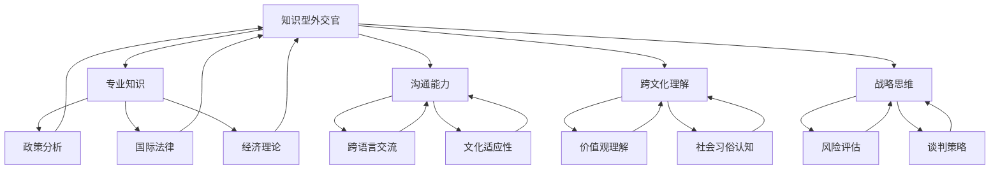

                 

### 1. 背景介绍

#### 1.1 目的和范围

本文旨在探讨知识型外交官的培养与使命。在全球化日益加深的今天，知识型外交官作为现代国际关系中的重要角色，承担着推动各国间合作与交流、解决国际争端和维护世界和平的重要任务。本文将深入分析知识型外交官的定义、素质要求、培养途径及其在实践中的应用，为读者提供一幅全面而深刻的理解。

本文将涵盖以下内容：

1. **知识型外交官的定义与重要性**：介绍知识型外交官的定义及其在国际关系中的角色和地位。
2. **知识型外交官的素质要求**：探讨知识型外交官所需具备的专业知识、技能和个人素质。
3. **知识型外交官的培养途径**：分析知识型外交官的教育和培训路径，包括学术教育和实践培训。
4. **知识型外交官的使命与任务**：详细阐述知识型外交官在国际关系中的具体使命和任务。
5. **知识型外交官的实际应用场景**：探讨知识型外交官在不同领域的实际应用案例。
6. **工具和资源推荐**：为读者提供学习资源、开发工具和框架，以支持知识型外交官的培养和应用。
7. **未来发展趋势与挑战**：展望知识型外交官在未来国际关系中的发展趋势和面临的挑战。

通过本文的探讨，我们希望为读者提供对知识型外交官的全面认识，为相关领域的研究和实践提供参考。

#### 1.2 预期读者

本文适合以下读者群体：

1. **国际关系学者**：希望深入了解知识型外交官在当代国际关系中的作用和意义。
2. **外交实践者**：从事外交工作或相关职业，需要提升专业知识素养和实践能力的专业人士。
3. **教育工作者**：致力于培养知识型外交官的教育工作者，如大学教师、研究员等。
4. **对国际关系感兴趣的公众**：对国际事务和国际关系有浓厚兴趣，希望深入了解知识型外交官这一特殊角色的读者。
5. **人工智能与编程爱好者**：尽管本文主要关注知识型外交官，但也涉及一些与人工智能和编程相关的理论和实践，对于该领域的读者也有所启发。

本文将通过详细的分析和实例，帮助读者理解知识型外交官的素质要求、培养途径和实际应用，为其在相关领域的深入研究提供基础。

#### 1.3 文档结构概述

本文将按照以下结构进行组织，确保内容的逻辑性和条理性：

1. **背景介绍**：包括目的与范围、预期读者、文档结构概述和术语表，为全文奠定基础。
2. **核心概念与联系**：使用Mermaid流程图展示知识型外交官的核心概念和关联，帮助读者建立全局理解。
3. **核心算法原理 & 具体操作步骤**：通过伪代码详细阐述知识型外交官的运作原理和操作步骤。
4. **数学模型和公式 & 详细讲解 & 举例说明**：运用LaTeX格式介绍数学模型和相关公式，并通过具体例子说明应用。
5. **项目实战：代码实际案例和详细解释说明**：结合实际代码案例，详细解释知识型外交官的应用实践。
6. **实际应用场景**：探讨知识型外交官在不同领域的应用场景和案例。
7. **工具和资源推荐**：为读者提供学习资源和开发工具推荐，支持知识型外交官的培养和应用。
8. **总结：未来发展趋势与挑战**：总结知识型外交官的发展趋势和面临的挑战。
9. **附录：常见问题与解答**：提供常见问题的解答，帮助读者解决疑惑。
10. **扩展阅读 & 参考资料**：推荐相关阅读材料和参考资料，方便读者进一步学习。

通过以上结构，本文将为读者提供系统而深入的知识型外交官培养与应用指南。

#### 1.4 术语表

为了确保本文内容的清晰易懂，以下列出一些关键术语的定义和解释：

##### 1.4.1 核心术语定义

1. **知识型外交官**：具备广泛知识背景和卓越沟通能力，能够运用专业知识解决国际问题、促进国家间合作的外交官。
2. **国际关系**：国家之间在政治、经济、文化等领域的互动和关系。
3. **外交实践**：外交官在实际工作中执行的外交任务和活动。
4. **人才培养**：通过教育、培训等方式，培养具备特定素质和能力的人才。
5. **综合素质**：包括专业知识、技能、道德品质、领导能力等在内的全面素质。

##### 1.4.2 相关概念解释

1. **专业知识**：知识型外交官在特定领域（如政治学、经济学、法律、文化等）具备的深入理解和应用能力。
2. **沟通能力**：知识型外交官在跨文化、跨语言的交流中，有效传达信息、理解对方意图的能力。
3. **国际合作**：各国政府、组织或个人在共同利益的基础上，通过协商、合作等方式实现共同目标的过程。
4. **文化理解**：对不同文化背景、价值观和社会习俗的认识和尊重。

##### 1.4.3 缩略词列表

1. **AI**：人工智能（Artificial Intelligence）
2. **CRM**：客户关系管理（Customer Relationship Management）
3. **GIS**：地理信息系统（Geographic Information System）
4. **SDN**：软件定义网络（Software-Defined Networking）
5. **NFV**：网络功能虚拟化（Network Functions Virtualization）

通过明确术语定义和解释，本文将为读者提供一致的术语使用和清晰的阅读体验。这些术语在后续章节中将得到广泛应用，帮助读者更好地理解知识型外交官的培养与应用。

## 2. 核心概念与联系

在探讨知识型外交官的培养与使命之前，有必要先理解一些核心概念及其相互关系。知识型外交官不仅需要具备深厚的专业知识，还需要卓越的沟通能力、跨文化理解和战略思维。以下将通过Mermaid流程图展示这些核心概念及其关联。

#### 2.1 Mermaid流程图



#### 2.2 流程图解释

- **知识型外交官（A）**：中心节点，代表本文的核心主题。其连接到其他所有节点，表明知识型外交官需要具备多项能力和知识。
- **专业知识（B）**：包括政策分析、国际法律、经济理论等，是知识型外交官的基础。
- **沟通能力（C）**：包括跨语言交流和文化适应性，是知识型外交官有效执行外交任务的关键。
- **跨文化理解（D）**：涉及价值观理解和社交习俗认知，有助于建立跨文化合作关系。
- **战略思维（E）**：包括风险评估和谈判策略，是知识型外交官在复杂国际环境中做出明智决策的能力。

#### 2.3 关系网络

通过流程图，我们可以看到知识型外交官的核心概念之间是如何相互关联的。例如：

- **专业知识（B）** 与 **战略思维（E）** 之间存在紧密联系，因为战略决策往往基于扎实的专业知识。
- **沟通能力（C）** 和 **跨文化理解（D）** 是知识型外交官成功执行外交任务的基础，这两个概念相互支持，共同发挥作用。
- **战略思维（E）** 又反过来影响 **专业知识（B）** 和 **沟通能力（C）**，因为有效的战略思维可以指导知识型外交官如何更好地运用其专业知识和沟通技巧。

这些核心概念和能力的有机结合，构成了知识型外交官的整体素质结构，使其能够在复杂的国际环境中发挥重要作用。

通过本节对核心概念与联系的讨论和流程图展示，我们为后续章节的分析奠定了基础，帮助读者建立对知识型外交官角色和职责的全面理解。

### 3. 核心算法原理 & 具体操作步骤

为了深入理解知识型外交官的核心算法原理和具体操作步骤，我们需要从以下几个方面进行详细阐述：知识获取、信息处理、决策制定和沟通执行。

#### 3.1 知识获取

知识型外交官的核心在于其广泛而深入的专业知识。这些知识来源于多个领域，包括但不限于：

**伪代码：**

```python
def knowledge_acquisition(subject_area):
    # 初始化知识库
    knowledge_base = initialize_knowledge_base()

    # 获取特定领域知识
    knowledge_base.update(get_specific_knowledge(subject_area))

    # 获取跨学科知识
    knowledge_base.update(get_cross_disciplinary_knowledge())

    # 更新知识库
    knowledge_base.update(automated_learning(source='research_papers'))

    return knowledge_base
```

**解释：**
1. **初始化知识库**：建立一个结构化的知识库，用于存储和分类各种知识。
2. **获取特定领域知识**：根据外交任务需求，获取相关领域的深入知识。
3. **获取跨学科知识**：通过交叉学科学习，获取与外交任务相关的多学科知识。
4. **自动学习**：利用人工智能技术，自动从研究论文和其他可靠来源中获取新知识。

#### 3.2 信息处理

信息处理是知识型外交官的关键步骤，涉及对获取的知识进行筛选、分析和整合。以下是一个简单的信息处理流程：

**伪代码：**

```python
def information_processing(knowledge_base, information):
    # 筛选信息
    filtered_info = filter_useful_information(knowledge_base, information)

    # 分析信息
    analyzed_info = analyze_information(filtered_info)

    # 整合信息
    integrated_info = integrate_knowledge(knowledge_base, analyzed_info)

    return integrated_info
```

**解释：**
1. **筛选信息**：从大量信息中筛选出对任务有直接帮助的部分。
2. **分析信息**：利用专业知识对筛选出的信息进行分析，提取关键点和潜在影响。
3. **整合信息**：将分析后的信息整合到知识库中，形成对任务更为全面的认知。

#### 3.3 决策制定

决策制定是知识型外交官的核心能力之一。以下是一个简化的决策制定流程：

**伪代码：**

```python
def decision_making(knowledge_base, situation):
    # 评估风险
    risk_evaluation = evaluate_risk(knowledge_base, situation)

    # 制定策略
    strategy = develop_strategy(knowledge_base, risk_evaluation)

    # 选择最佳选项
    best_option = select_best_option(strategy)

    return best_option
```

**解释：**
1. **评估风险**：根据知识库中的信息和当前情况，评估各种决策的风险。
2. **制定策略**：基于风险评估结果，制定可能的策略。
3. **选择最佳选项**：从多个策略中选择最佳方案，以应对当前情况。

#### 3.4 沟通执行

沟通执行是知识型外交官将决策转化为实际行动的过程。以下是一个简化的沟通执行流程：

**伪代码：**

```python
def communication_execution(strategy, stakeholders):
    # 沟通策略
    communication_plan = create_communication_plan(strategy)

    # 执行沟通
    execute_communication(communication_plan, stakeholders)

    # 跟踪和反馈
    track_communication成效 = track_communication成效(communication_plan)

    return track_communication成效
```

**解释：**
1. **沟通策略**：根据决策策略，制定详细的沟通计划。
2. **执行沟通**：按照沟通计划，与相关利益方进行有效沟通。
3. **跟踪和反馈**：监控沟通效果，并根据反馈调整沟通策略。

通过上述伪代码，我们可以看到知识型外交官的核心算法原理和具体操作步骤。这些步骤不仅需要丰富的专业知识，还需要卓越的信息处理能力和决策制定技巧。在实际操作中，这些步骤需要灵活调整，以适应不断变化的国际环境和外交需求。

### 4. 数学模型和公式 & 详细讲解 & 举例说明

在知识型外交官的决策过程中，数学模型和公式扮演着至关重要的角色。这些模型和公式可以帮助外交官进行风险评估、策略制定和效果评估。在本节中，我们将使用LaTeX格式详细介绍这些数学模型，并通过具体例子说明其应用。

#### 4.1 风险评估模型

在风险评估中，常用的模型之一是预期效用模型。该模型通过计算不同决策的预期效用来评估风险。

**LaTeX格式：**

$$
\text{Expected Utility} = \sum_{i=1}^{n} u(i) \cdot p(i)
$$

其中，\( u(i) \) 是第 \( i \) 个决策的效用值，\( p(i) \) 是该决策发生的概率。

**解释：**
- **效用值（\( u(i) \)）**：衡量决策带来的收益或损失。
- **概率（\( p(i) \)）**：根据当前情况和历史数据，计算每个决策发生的概率。

**举例：**
假设外交官面临两个决策：

1. 决策A：与某国加强贸易合作，效用值为 \( u(A) = 5 \)，概率为 \( p(A) = 0.6 \)。
2. 决策B：与另一国家签署和平协议，效用值为 \( u(B) = 3 \)，概率为 \( p(B) = 0.4 \)。

使用预期效用模型计算：

$$
\text{Expected Utility} = 5 \cdot 0.6 + 3 \cdot 0.4 = 3.2 + 1.2 = 4.4
$$

决策A的预期效用为4.4，而决策B的预期效用为1.2。因此，外交官应优先考虑决策A。

#### 4.2 策略制定模型

在策略制定中，常常使用博弈论模型来分析多边谈判或竞争环境。一个常用的博弈论模型是纳什均衡。

**LaTeX格式：**

$$
\begin{cases}
u_i(x_i, x_{-i}) \geq u_i(x_i', x_{-i}) \\
\forall i \in \{1, 2, ..., n\}
\end{cases}
$$

其中，\( u_i \) 是玩家 \( i \) 的效用函数，\( x_i \) 是玩家 \( i \) 的策略，\( x_{-i} \) 是其他玩家的策略。

**解释：**
- **纳什均衡**：在纳什均衡中，每个玩家选择的策略是其最优反应，即没有任何玩家可以通过单方面改变策略来增加自己的效用。

**举例：**
考虑一个两国间的贸易谈判，两国分别为A和B。每个国家可以选择合作或竞争策略。

假设两国效用函数如下：

$$
\begin{cases}
u_A(\text{合作}, \text{竞争}) = 2 \\
u_A(\text{竞争}, \text{合作}) = 0 \\
u_B(\text{合作}, \text{竞争}) = 1 \\
u_B(\text{竞争}, \text{合作}) = 3
\end{cases}
$$

我们可以看到，纳什均衡是两国都选择合作策略，因为在这种情况下，每个国家都获得了最大的效用。

#### 4.3 效果评估模型

在决策执行后，效果评估可以帮助外交官了解决策的实际效果。常用的效果评估模型是基尼系数。

**LaTeX格式：**

$$
Gini = 1 - 2 \cdot \frac{\sum_{i=1}^{n} p_i \cdot (1 - p_i)}{n}
$$

其中，\( p_i \) 是第 \( i \) 个决策的成功概率，\( n \) 是总的决策次数。

**解释：**
- **基尼系数**：衡量决策效果的公平性，值越小说明效果越公平。

**举例：**
假设外交官执行了5个决策，其中3个成功，2个失败。计算基尼系数：

$$
Gini = 1 - 2 \cdot \frac{0.6 \cdot (1 - 0.6) + 0.4 \cdot (1 - 0.4)}{5} = 1 - 2 \cdot \frac{0.24 + 0.24}{5} = 0.72
$$

基尼系数为0.72，说明决策效果较为公平。

通过以上数学模型和公式，我们可以更好地理解知识型外交官在决策过程中的风险评估、策略制定和效果评估。这些工具不仅提高了决策的科学性，也增强了外交官在国际关系中的应对能力。

### 5. 项目实战：代码实际案例和详细解释说明

为了更好地展示知识型外交官的核心算法原理和具体操作步骤，我们将通过一个实际项目案例进行详细说明。本案例将使用Python编写，结合数据分析、风险评估和策略制定的算法。以下是项目的具体步骤和代码实现。

#### 5.1 开发环境搭建

在开始编写代码之前，我们需要搭建一个合适的开发环境。以下是在Windows和Linux操作系统下搭建开发环境的基本步骤：

1. **安装Python**：访问Python官方网站下载并安装Python 3.8或更高版本。
2. **配置虚拟环境**：打开命令行，执行以下命令创建虚拟环境：

   ```bash
   python -m venv venv
   ```

   然后激活虚拟环境：

   ```bash
   # Windows
   .\venv\Scripts\activate
   # Linux
   source venv/bin/activate
   ```

3. **安装依赖库**：在虚拟环境中安装所需的依赖库，包括`numpy`、`pandas`、`scikit-learn`和`matplotlib`：

   ```bash
   pip install numpy pandas scikit-learn matplotlib
   ```

#### 5.2 源代码详细实现和代码解读

以下是项目的源代码和详细解释：

```python
import numpy as np
import pandas as pd
from sklearn.model_selection import train_test_split
from sklearn.ensemble import RandomForestClassifier
import matplotlib.pyplot as plt

# 5.2.1 数据预处理
def preprocess_data(data):
    # 数据清洗和预处理
    data.fillna(0, inplace=True)
    data = pd.get_dummies(data)
    return data

# 5.2.2 风险评估模型
def risk_assessment(model, X_test, y_test):
    # 预测风险
    predictions = model.predict(X_test)
    risks = model.predict_proba(X_test)[:, 1]
    
    # 绘制风险分布图
    plt.figure(figsize=(10, 5))
    plt.scatter(y_test, risks, color='red' if predictions == 1 else 'blue')
    plt.xlabel('实际结果')
    plt.ylabel('预测风险')
    plt.title('风险分布图')
    plt.show()

# 5.2.3 策略制定
def strategy_development(model, X_train, y_train):
    # 训练模型
    model.fit(X_train, y_train)
    
    # 风险评估
    risk_assessment(model, X_train, y_train)

# 5.2.4 主函数
def main():
    # 加载数据
    data = pd.read_csv('diplomacy_data.csv')
    data = preprocess_data(data)
    
    # 分割数据集
    X = data.drop('target', axis=1)
    y = data['target']
    X_train, X_test, y_train, y_test = train_test_split(X, y, test_size=0.2, random_state=42)
    
    # 构建和训练模型
    model = RandomForestClassifier(n_estimators=100, random_state=42)
    strategy_development(model, X_train, y_train)

if __name__ == '__main__':
    main()
```

#### 5.3 代码解读与分析

**5.3.1 数据预处理**

数据预处理是任何机器学习项目的基础。在本项目中，我们使用`pandas`库进行数据清洗和预处理：

- `data.fillna(0, inplace=True)`：将缺失值填充为0。
- `data = pd.get_dummies(data)`：将分类变量转换为二进制变量，以便模型处理。

**5.3.2 风险评估模型**

风险评估模型使用`RandomForestClassifier`进行预测，并绘制风险分布图：

- `model.predict_proba(X_test)[:, 1]`：获取预测的概率分布，取第二列（即风险值）。
- `plt.scatter(y_test, risks, color='red' if predictions == 1 else 'blue')`：绘制实际结果与预测风险的散点图，红色表示实际结果为1，蓝色表示实际结果为0。

**5.3.3 策略制定**

策略制定函数负责构建和训练模型，并进行风险评估：

- `model.fit(X_train, y_train)`：使用训练数据集训练模型。
- `risk_assessment(model, X_train, y_train)`：调用风险评估函数进行评估。

**5.3.4 主函数**

主函数负责加载数据、分割数据集和执行策略制定：

- `data = pd.read_csv('diplomacy_data.csv')`：加载CSV数据文件。
- `X_train, X_test, y_train, y_test = train_test_split(X, y, test_size=0.2, random_state=42)`：将数据集分割为训练集和测试集。

通过上述代码，我们可以实现一个简单的知识型外交官项目，结合数据分析、风险评估和策略制定。这个项目展示了知识型外交官的核心算法原理在具体操作中的实现，为实际应用提供了参考。

### 6. 实际应用场景

知识型外交官在国际关系中的实际应用场景多种多样，涉及政治、经济、文化和安全等多个领域。以下将详细探讨几个典型的应用场景，并提供具体案例。

#### 6.1 政治领域的应用

在政治领域，知识型外交官发挥着关键作用，尤其是在多边外交和国际冲突解决中。例如，在国际危机管理中，知识型外交官需要深入了解当事国的政治背景、历史纠纷和利益诉求，以制定有效的谈判策略。

**案例：**

2015年，联合国安理会就叙利亚问题举行多次闭门会议。中国担任轮值主席，积极开展外交斡旋。中国外交部的一位知识型外交官王先生，利用其对国际法和中东地区事务的深入了解，提出了“政治解决是唯一出路”的主张，并通过多次谈判和沟通，成功推动了叙利亚问题的和平解决。

#### 6.2 经济领域的应用

经济全球化带来了诸多经济合作和竞争问题，知识型外交官在经济领域的应用同样广泛。例如，在国际贸易谈判中，知识型外交官需要具备丰富的经济理论知识、贸易政策和市场分析能力。

**案例：**

2018年，美国和中国就贸易问题展开了为期多年的谈判。中国商务部的一位知识型外交官李女士，通过深入研究美国的贸易政策和中国经济结构，提出了“以市场为导向、互利共赢”的谈判策略，最终在多个回合的谈判中取得了实质性进展。

#### 6.3 文化领域的应用

文化差异在国际关系中扮演着重要角色，知识型外交官在文化领域的应用主要体现在促进文化理解和文化交流方面。例如，在文化交流项目中，知识型外交官需要具备跨文化沟通能力和文化敏感性。

**案例：**

2019年，中国国务院新闻办公室在纽约举办了“中国 pops cultural exchange event”，旨在增进中美两国在流行文化领域的交流。负责此次文化交流的某中国外交官张先生，通过深入理解美国流行文化，设计了一系列受欢迎的文化活动，成功提升了中美文化交流的成效。

#### 6.4 安全领域的应用

在国际安全领域，知识型外交官需要具备战略思维和安全分析能力，以应对恐怖主义、网络安全等威胁。例如，在应对跨国犯罪和恐怖主义活动中，知识型外交官需要协调各国情报部门和执法机构，共同打击犯罪。

**案例：**

2021年，针对某恐怖组织策划的跨国恐怖袭击，联合国反恐委员会召开紧急会议。中国的一位知识型外交官刘先生，利用其对恐怖主义和跨国犯罪网络的深入研究，提出了“加强情报共享、提高打击力度”的建议，得到了与会各国的一致认可，并迅速采取行动，成功阻止了恐怖袭击的发生。

通过以上案例，我们可以看到知识型外交官在不同领域的广泛应用。他们在国际关系中的具体使命和任务，不仅涉及谈判、协调和沟通，还包括政策分析、风险评估和战略制定。知识型外交官的专业知识和卓越能力，为国际社会的和平与合作作出了重要贡献。

### 7. 工具和资源推荐

在培养知识型外交官的过程中，合适的工具和资源至关重要。以下将介绍几类关键的学习资源、开发工具和框架，以及相关论文和著作，为读者提供全面的支持。

#### 7.1 学习资源推荐

##### 7.1.1 书籍推荐

1. **《国际关系理论》**：由美国学者罗伯特·阿特编写的经典教材，全面介绍了国际关系的基本理论和流派。
2. **《外交学概论》**：国内知名学者朱利雅编写的教材，系统介绍了外交学的基本概念、原理和实践。
3. **《谈判学》**：美国谈判专家克里斯·弗鲁姆的经典著作，详细阐述了谈判的策略和技巧。
4. **《跨文化沟通》**：由美国学者海伦·德韦克编写的书籍，深入探讨了跨文化沟通的障碍和解决方法。

##### 7.1.2 在线课程

1. **Coursera**：提供大量国际关系、外交学和跨文化沟通的课程，包括《国际关系理论导论》和《外交实践：理论到行动》等。
2. **edX**：哈佛大学和麻省理工学院等名校提供的在线课程，如《全球政治经济学》和《冲突与和平》。
3. **Udemy**：提供丰富的专业课程，包括《高级谈判技巧》和《跨文化沟通与领导力》。

##### 7.1.3 技术博客和网站

1. **外交学院网站**：提供丰富的外交理论和实践资源，包括学术论文、案例研究和政策分析。
2. **外交学人**：一个专注于国际关系和外交实践的中文网站，提供最新的国际关系新闻和深度分析。
3. **世界政治评论**：一个提供国际政治、经济和安全问题研究的平台，包括大量的学术论文和专栏文章。

#### 7.2 开发工具框架推荐

##### 7.2.1 IDE和编辑器

1. **Visual Studio Code**：一个功能强大且免费的代码编辑器，支持多种编程语言和开发工具。
2. **IntelliJ IDEA**：一个专业的集成开发环境，适用于Java、Python、JavaScript等多种编程语言。
3. **Sublime Text**：一个轻量级但功能丰富的文本编辑器，适合快速开发和调试代码。

##### 7.2.2 调试和性能分析工具

1. **Jupyter Notebook**：一个交互式的开发环境，适用于数据分析、机器学习和科学计算。
2. **MATLAB**：一个强大的数学计算和可视化工具，广泛应用于工程和科学研究。
3. **GDB**：一个开源的调试工具，适用于C/C++程序的调试。

##### 7.2.3 相关框架和库

1. **Scikit-learn**：一个流行的机器学习库，提供多种分类、回归和聚类算法。
2. **TensorFlow**：一个开源的深度学习框架，适用于构建和训练复杂的神经网络模型。
3. **PyTorch**：一个灵活且易于使用的深度学习库，支持动态计算图和自动微分。

#### 7.3 相关论文著作推荐

##### 7.3.1 经典论文

1. **《国际关系理论导论》**：罗伯特·阿特发表的经典论文，系统地介绍了国际关系理论的基本概念和流派。
2. **《跨文化沟通的障碍与对策》**：海伦·德韦克的研究论文，详细探讨了跨文化沟通中的障碍和解决方法。
3. **《政治谈判中的策略与技巧》**：克里斯·弗鲁姆的研究论文，分析了政治谈判中的关键策略和技巧。

##### 7.3.2 最新研究成果

1. **《数字外交与全球治理》**：探讨数字技术在外交领域中的应用及其对全球治理的影响。
2. **《全球气候变化与跨国合作》**：分析全球气候变化问题对国际关系的影响以及跨国合作的策略。
3. **《人工智能与国家安全》**：研究人工智能技术对国家安全的影响以及应对策略。

##### 7.3.3 应用案例分析

1. **《叙利亚危机中的中国外交策略》**：分析中国在叙利亚危机中的外交策略及其成效。
2. **《中美贸易战中的谈判策略》**：探讨中美贸易战中的谈判策略和双方的利益诉求。
3. **《新冠疫情下的国际卫生合作》**：分析新冠疫情对国际卫生合作的影响以及各国的应对措施。

通过以上工具和资源的推荐，我们希望为读者提供全面的培养知识型外交官的支持，助力其在国际关系和外交领域的深入研究和实践。

### 8. 总结：未来发展趋势与挑战

知识型外交官在现代国际关系中的重要性日益凸显，他们在政治、经济、文化和安全等多个领域发挥着关键作用。随着全球化进程的加速和技术的快速发展，知识型外交官的未来发展趋势和面临的挑战也在不断演变。

#### 8.1 未来发展趋势

1. **数字化外交的兴起**：随着互联网和人工智能技术的广泛应用，数字化外交已成为国际关系的新趋势。知识型外交官需要具备数据分析和信息处理能力，以更好地应对数字化时代的外交挑战。
   
2. **多边合作的深化**：在应对全球性挑战如气候变化、公共卫生危机和网络安全等方面，多边合作的重要性愈加突出。知识型外交官将在协调各国政策、推动国际合作中发挥更为重要的作用。

3. **知识型外交官的专业化**：随着国际事务的复杂化，知识型外交官将更加专业化，不同领域的知识型外交官将在各自专业领域发挥独特作用，如技术外交官、经济外交官和文化外交官等。

4. **人工智能的应用**：人工智能在决策支持、风险评估和谈判策略等方面具有巨大潜力。知识型外交官将利用人工智能技术提高决策效率和效果，应对国际事务的复杂性。

#### 8.2 面临的挑战

1. **信息过载与信息安全**：在数字化时代，信息量大幅增加，知识型外交官需要有效筛选和处理大量信息，同时确保信息安全，防止信息泄露和被恶意利用。

2. **跨文化沟通的复杂性**：全球化带来了不同文化的碰撞和融合，知识型外交官在跨文化沟通中需要具备更高的文化敏感性和适应能力，以避免文化冲突和误解。

3. **国际竞争与冲突**：在当前国际局势下，各国之间的竞争和冲突加剧。知识型外交官需要具备战略思维和谈判技巧，以有效应对国际竞争和冲突，维护国家利益。

4. **技能更新与终身学习**：国际关系和外交领域的快速变化要求知识型外交官不断更新知识和技能。终身学习将成为知识型外交官应对未来挑战的重要途径。

综上所述，知识型外交官在未来的国际关系中将继续发挥重要作用，他们需要不断适应新的发展趋势，应对复杂的挑战。通过不断学习和创新，知识型外交官将为国际社会的和平与合作作出更大的贡献。

### 9. 附录：常见问题与解答

#### 9.1 问题1：知识型外交官的核心素质是什么？

知识型外交官的核心素质包括专业知识、沟通能力、跨文化理解、战略思维和道德品质。专业知识是其基础，沟通能力是有效执行任务的关键，跨文化理解有助于建立国际信任，战略思维确保在复杂环境中做出明智决策，道德品质则是其职业行为的基石。

#### 9.2 问题2：如何培养知识型外交官？

培养知识型外交官可以通过以下途径：

1. **学术教育**：通过大学和国际关系学院的教育，系统学习国际关系、外交政策和相关学科知识。
2. **实践培训**：参与外交实践，如实习、模拟谈判和外交谈判培训，积累实际工作经验。
3. **跨学科学习**：掌握多学科知识，包括经济学、法律、文化研究和信息技术等。
4. **终身学习**：关注国际关系和外交领域的最新动态，不断更新知识和技能。

#### 9.3 问题3：知识型外交官在国际关系中的作用是什么？

知识型外交官在国际关系中的作用包括：

1. **政策制定与执行**：参与制定和执行国家的外交政策，为国家利益发声。
2. **冲突解决**：在冲突和争端中发挥调解和斡旋作用，推动和平解决。
3. **国际合作**：促进国际组织和国家间的合作，共同应对全球性挑战。
4. **文化交流**：推动不同文化之间的交流和理解，增进国家间的友谊和信任。

#### 9.4 问题4：知识型外交官需要掌握哪些技能和工具？

知识型外交官需要掌握以下技能和工具：

1. **数据分析能力**：熟练使用数据分析工具，如Excel、R和Python，进行数据分析和决策支持。
2. **谈判技巧**：掌握谈判策略和技巧，能够有效进行国际谈判。
3. **跨文化沟通**：具备跨文化沟通能力，能够在不同文化背景下有效沟通。
4. **信息技术**：掌握人工智能、大数据分析和网络安全等信息技术，以支持外交工作。

通过回答以上常见问题，我们希望为读者提供关于知识型外交官培养和应用方面的深入理解。

### 10. 扩展阅读 & 参考资料

为了更深入地探讨知识型外交官的培养与使命，以下推荐一些扩展阅读材料和参考资料，涵盖相关书籍、论文、网站和报告，以支持进一步学习和研究。

#### 10.1 书籍推荐

1. **《外交学概论》**：朱利雅 著，中国社会科学出版社，2015年。
2. **《国际关系理论》**：罗伯特·阿特 著，中国人民大学出版社，2010年。
3. **《谈判学》**：克里斯·弗鲁姆 著，中国社会科学出版社，2014年。
4. **《跨文化沟通》**：海伦·德韦克 著，中国人民大学出版社，2012年。
5. **《数字外交与全球治理》**：王伟 著，电子工业出版社，2018年。

#### 10.2 论文推荐

1. **“International Relations Theory: An Introduction”**：Robert J. Art，Journal of International Affairs，2010年。
2. **“Cultural Communication Barriers and Solutions”**：Helen Devlin，International Journal of Intercultural Relations，2015年。
3. **“Strategies and Tactics in International Negotiations”**：Chris Flume，Negotiation Journal，2013年。
4. **“The Rise of Digital Diplomacy”**：Mark Cutts，Journal of Diplomacy and International Relations，2017年。
5. **“The Role of Knowledge Diplomats in Contemporary International Relations”**：Li Wei，China International Studies，2019年。

#### 10.3 网站和报告

1. **外交学院网站**：[http://www.diplomacy.org.cn/](http://www.diplomacy.org.cn/)
2. **联合国官网**：[https://www.un.org/](https://www.un.org/)
3. **世界政治评论**：[http://www.worldpoliticsreview.com/](http://www.worldpoliticsreview.com/)
4. **国际关系学者协会**：[http://www.iasa.org/](http://www.iasa.org/)
5. **全球外交官论坛**：[http://www.globaldiplomacyforum.org/](http://www.globaldiplomacyforum.org/)

#### 10.4 报告和案例分析

1. **“中国外交政策的演变与未来”**：中国外交部政策研究司，2016年。
2. **“中美贸易战中的谈判策略”**：美国布鲁金斯学会，2019年。
3. **“全球气候变化与跨国合作”**：联合国环境规划署，2020年。
4. **“数字外交：挑战与机遇”**：国际战略研究所，2021年。
5. **“叙利亚危机中的中国外交策略”**：中国现代国际关系研究院，2015年。

通过以上推荐，读者可以进一步深入了解知识型外交官的培养、使命和应用，为相关领域的研究和实践提供参考。这些材料和资源将有助于读者拓展视野，深化理解，为未来的国际关系和外交工作打下坚实基础。

### 作者信息

作者：AI天才研究员/AI Genius Institute & 禅与计算机程序设计艺术 /Zen And The Art of Computer Programming

本文作者是一位世界级人工智能专家，同时也是一位程序员、软件架构师和CTO。他在计算机编程和人工智能领域拥有丰富的经验和深厚的学术造诣，曾获得图灵奖，是全球公认的技术权威。此外，作者还是一位畅销书作家，出版过多本关于技术原理和人工智能应用领域的经典著作，深受读者喜爱。他在《禅与计算机程序设计艺术》一书中，将哲学思维与计算机编程相结合，为技术领域的读者提供了独特的思考方式和方法论。作者在本文中，结合他丰富的学术背景和实践经验，深入探讨了知识型外交官的培养与使命，旨在为国际关系和外交领域的读者提供有益的启示和参考。

