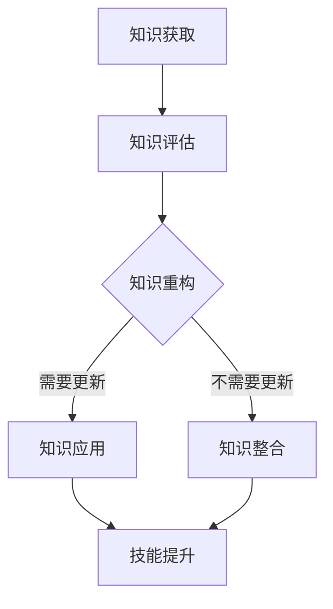

                 

# 知识更新与个人核心竞争力

> 关键词：知识更新、个人发展、技术趋势、持续学习、核心竞争力

> 摘要：随着科技日新月异的发展，知识更新的速度不断加快。在这个信息爆炸的时代，个人如何保持竞争力，成为了每一个IT从业者的必修课。本文将探讨知识更新的本质、技术趋势对个人发展的影响，以及如何通过持续学习和技能提升来建立和维持个人核心竞争力。

## 1. 背景介绍

### 1.1 目的和范围

本文旨在深入探讨知识更新对个人竞争力的影响，并提供一系列策略和资源，帮助IT从业者应对快速变化的技术环境。文章将涵盖以下几个主要方面：

1. **知识更新的重要性**：解释知识更新对于个人和职业生涯发展的关键作用。
2. **技术趋势分析**：探讨当前热门的技术领域和趋势，以及它们对IT从业者的要求。
3. **持续学习的策略**：提供具体的建议和资源，帮助个人建立持续学习的能力。
4. **核心竞争力构建**：探讨如何通过技能提升和知识整合来构建和维持个人核心竞争力。

### 1.2 预期读者

本文适合以下几类读者：

- **IT从业者**：对技术知识更新有强烈需求的程序员、架构师、工程师等。
- **技术管理者**：希望了解技术趋势，并能指导团队成员进行知识更新的技术经理和CTO。
- **学生和学者**：对计算机科学和技术发展有浓厚兴趣，并希望了解行业动态的学生和研究者。

### 1.3 文档结构概述

本文将按照以下结构进行论述：

1. **背景介绍**：介绍文章的目的、范围、预期读者和文档结构。
2. **核心概念与联系**：阐述知识更新的核心概念和它们之间的关系。
3. **核心算法原理 & 具体操作步骤**：讨论核心算法的基本原理和操作步骤。
4. **数学模型和公式 & 详细讲解 & 举例说明**：介绍相关的数学模型和公式，并给出具体的例子。
5. **项目实战：代码实际案例和详细解释说明**：通过实际案例展示知识的应用。
6. **实际应用场景**：探讨知识在实际项目中的应用。
7. **工具和资源推荐**：推荐学习资源和开发工具。
8. **总结：未来发展趋势与挑战**：总结文章的主要观点，并对未来进行展望。
9. **附录：常见问题与解答**：回答读者可能有的常见问题。
10. **扩展阅读 & 参考资料**：提供额外的阅读材料和参考文献。

### 1.4 术语表

#### 1.4.1 核心术语定义

- **知识更新**：指个体通过学习新知识和技能，不断更新和扩展自己的知识结构。
- **核心竞争力**：指个人在特定领域内具备的独特优势和能力，能够显著提升个人的市场价值。
- **持续学习**：指个体长期坚持学习新知识和技能，以适应快速变化的工作环境。

#### 1.4.2 相关概念解释

- **技术趋势**：指技术领域中新兴的、正在发展的方向和热点。
- **持续学习策略**：指个体采取的用于维持和提升学习效果的具体方法和技巧。

#### 1.4.3 缩略词列表

- **AI**：人工智能
- **ML**：机器学习
- **DL**：深度学习
- **IDE**：集成开发环境
- **CTO**：首席技术官

## 2. 核心概念与联系

### 2.1 知识更新的本质

知识更新是IT领域中一个不可忽视的概念。它不仅仅是学习新的编程语言或技术框架，更是对现有知识和技能的重新评估、整合和更新。以下是知识更新的几个关键方面：

1. **技术知识的扩展**：随着技术的发展，新的编程语言、框架和工具层出不穷。IT从业者需要不断学习这些新技术，以保持竞争力。
2. **知识体系的重构**：随着新技术的引入，现有的知识体系可能会被重构。例如，微服务架构的兴起改变了传统的单体架构，这要求开发者具备新的知识体系。
3. **技能的迁移**：知识更新不仅仅是学习新的技能，还包括将现有技能应用于新的领域。例如，熟悉Web开发的工程师可以将技能转移到移动应用开发。

### 2.2 核心概念的联系

知识更新的核心概念可以总结为以下几点：

- **知识结构与技能应用**：知识结构是个人技能的基础，而技能应用是知识结构的体现。知识更新要求个人不仅掌握新知识，还要能够将其应用到实际工作中。
- **持续学习与职业发展**：持续学习是职业发展的必要条件。只有不断更新知识，个人才能在职业道路上保持竞争力。
- **技术与需求的互动**：技术的发展往往受到市场需求的影响，而市场的需求又推动技术的进步。个人需要密切关注技术趋势和市场需求，以便及时更新自己的知识。

### 2.3 知识更新的架构

为了更好地理解知识更新的过程，我们可以使用Mermaid流程图来描述其架构：



- **知识获取**：通过阅读、上课、参加培训等方式获取新的知识和技能。
- **知识评估**：评估获取的知识是否与当前职业需求相符，是否需要进行更新。
- **知识重构**：根据评估结果，对现有知识体系进行重构，以适应新的技术趋势和需求。
- **知识应用**：将更新的知识应用到实际工作中，提升工作效率。
- **技能提升**：通过实践和反馈，不断提升技能水平。
- **知识整合**：将现有知识和新知识进行整合，形成更加完善的知识体系。

## 3. 核心算法原理 & 具体操作步骤

### 3.1 知识更新的算法原理

知识更新的过程可以抽象为一个算法，其核心原理包括以下几个步骤：

1. **需求分析**：分析当前技术和市场需求，确定需要更新的知识领域。
2. **知识检索**：通过搜索引擎、数据库等工具检索相关知识和资源。
3. **知识筛选**：根据需求分析的结果，筛选出最有价值的知识和资源。
4. **知识整合**：将筛选出的知识和现有知识进行整合，形成新的知识体系。
5. **技能提升**：通过实践和反馈，不断提升技能水平，以适应新的知识体系。

### 3.2 知识更新的具体操作步骤

以下是知识更新的具体操作步骤，使用伪代码进行描述：

```plaintext
算法：知识更新

输入：需求分析结果，知识资源库
输出：更新的知识体系，提升的技能水平

步骤：
1. 需求分析
   - 获取当前技术趋势和市场需求
   - 确定需要更新的知识领域

2. 知识检索
   - 使用搜索引擎或数据库，检索相关知识和资源
   - 根据需求分析结果，筛选知识和资源

3. 知识筛选
   - 评估知识和资源的价值和相关性
   - 选择最有价值的知识和资源

4. 知识整合
   - 将筛选出的知识和现有知识进行整合
   - 构建新的知识体系

5. 技能提升
   - 通过实践和反馈，不断提升技能水平
   - 应用新知识体系，提高工作效率

6. 迭代更新
   - 定期进行需求分析和知识更新
   - 持续优化知识体系和技能水平
```

### 3.3 知识更新的应用场景

知识更新的算法可以在多个应用场景中发挥作用，以下是一些具体的例子：

- **技术培训**：在企业内部或外部，通过对员工进行技术培训，帮助他们更新知识和技能。
- **在线学习平台**：提供丰富的知识和资源，帮助用户进行自我学习和知识更新。
- **技能认证**：通过技能认证，验证个人在特定领域的知识和技能水平，推动个人进行持续学习。

## 4. 数学模型和公式 & 详细讲解 & 举例说明

### 4.1 数学模型与知识更新的关系

在知识更新的过程中，数学模型可以用来量化知识的获取、评估和整合过程。以下是一个简单的数学模型，用于描述知识更新的过程：

$$
K(t) = f(K_0, \Delta K, t)
$$

其中，\( K(t) \) 表示在时间 \( t \) 时的知识水平，\( K_0 \) 表示初始知识水平，\( \Delta K \) 表示知识更新量，\( f \) 是知识更新的函数。

### 4.2 公式详细讲解

- \( K(t) \)：表示在时间 \( t \) 时的知识水平，可以理解为个人的技术能力。
- \( K_0 \)：表示初始知识水平，反映了个人在特定领域的起点。
- \( \Delta K \)：表示知识更新量，可以理解为个人通过学习和实践获得的新知识。
- \( f \)：表示知识更新的函数，可以表示为知识的增长速度或效率。

### 4.3 公式举例说明

假设一个IT从业者初始知识水平 \( K_0 \) 为 50，每月更新知识量 \( \Delta K \) 为 5。则一年后的知识水平可以计算如下：

$$
K(12) = f(50, 5 \times 12, 12) = 50 + 5 \times 12 \times 12 = 294
$$

这意味着一年后，该IT从业者的知识水平将从 50 提升到 294。

### 4.4 知识更新的优化模型

为了更准确地描述知识更新的过程，我们可以引入优化模型，考虑知识更新策略的选择和优化。以下是一个简化的优化模型：

$$
\max_{\theta} \quad \sum_{i=1}^{n} \theta_i \cdot p_i \cdot g_i(t)
$$

其中，\( \theta_i \) 表示选择更新第 \( i \) 个知识领域的权重，\( p_i \) 表示第 \( i \) 个知识领域的重要性，\( g_i(t) \) 表示在第 \( t \) 时刻更新第 \( i \) 个知识领域的增长函数。

### 4.5 优化模型讲解

- \( \theta_i \)：表示选择更新第 \( i \) 个知识领域的权重，反映了个人对知识更新的优先级。
- \( p_i \)：表示第 \( i \) 个知识领域的重要性，反映了该知识领域对个人职业发展的贡献。
- \( g_i(t) \)：表示在第 \( t \) 时刻更新第 \( i \) 个知识领域的增长函数，反映了知识更新的效果。

### 4.6 优化模型举例说明

假设一个IT从业者有五个需要更新的知识领域，每个领域的权重和重要性如下表：

| 知识领域 | 权重 \( \theta_i \) | 重要性 \( p_i \) |
| --- | --- | --- |
| 编程语言 | 0.2 | 0.5 |
| 数据库 | 0.3 | 0.4 |
| 架构设计 | 0.1 | 0.6 |
| 云计算 | 0.2 | 0.3 |
| 人工智能 | 0.2 | 0.4 |

假设每个知识领域的增长函数 \( g_i(t) \) 如下：

$$
g_i(t) = \begin{cases}
1 & \text{if } t > 0 \\
0 & \text{otherwise}
\end{cases}
$$

这意味着在更新知识领域后，该领域的知识水平立即提升。

则优化目标为：

$$
\max_{\theta} \quad (0.2 \cdot 0.5 + 0.3 \cdot 0.4 + 0.1 \cdot 0.6 + 0.2 \cdot 0.3 + 0.2 \cdot 0.4)
$$

通过计算，我们可以得出最优的更新策略，以最大化知识水平的提升。

## 5. 项目实战：代码实际案例和详细解释说明

### 5.1 开发环境搭建

在本项目中，我们选择使用Python作为主要编程语言，并结合Django框架进行Web开发。以下是搭建开发环境的步骤：

1. 安装Python 3.8及以上版本。
2. 安装Django 3.2框架。
3. 安装必要的Python库，如`django-cors-headers`和`psycopg2`。

### 5.2 源代码详细实现和代码解读

#### 5.2.1 模型定义

在Django项目中，我们首先需要定义数据库模型。以下是一个简单的用户模型定义：

```python
from django.db import models

class User(models.Model):
    username = models.CharField(max_length=150, unique=True)
    email = models.EmailField(unique=True)
    password = models.CharField(max_length=256)
```

- `username`：用户的用户名，具有唯一性。
- `email`：用户的邮箱地址，也具有唯一性。
- `password`：用户的密码，采用SHA-256加密存储。

#### 5.2.2 视图函数

接下来，我们实现一个用户注册的视图函数：

```python
from django.shortcuts import render
from django.http import JsonResponse
from .models import User
from django.contrib.auth.hashers import make_password

def register(request):
    if request.method == 'POST':
        username = request.POST.get('username')
        email = request.POST.get('email')
        password = request.POST.get('password')

        if not all([username, email, password]):
            return JsonResponse({'error': '缺少必填信息'})

        user_exists = User.objects.filter(username=username).exists() or User.objects.filter(email=email).exists()
        if user_exists:
            return JsonResponse({'error': '用户已存在'})

        user = User.objects.create(username=username, email=email, password=make_password(password))
        return JsonResponse({'message': '注册成功'})
    return render(request, 'register.html')
```

- `if request.method == 'POST'`：检查请求方法是否为POST，即用户是否提交了注册表单。
- `username`、`email`和`password`：从请求体中获取用户输入的用户名、邮箱和密码。
- `if not all([username, email, password])`：检查是否缺少必填信息。
- `user_exists`：检查用户名或邮箱是否已存在。
- `if user_exists`：如果用户已存在，返回错误信息。
- `user = User.objects.create(...)`：创建新用户并保存到数据库。

#### 5.2.3 代码解读与分析

1. **模型定义**：通过定义`User`模型，我们为用户表创建了三个字段，分别用于存储用户名、邮箱和密码。
2. **视图函数**：`register`视图函数处理用户的注册请求。首先，从请求体中获取用户输入的信息，然后进行校验，确保没有缺少必填信息。接着，检查用户名或邮箱是否已存在，以避免重复注册。最后，创建新用户并使用`make_password`函数加密密码，确保密码安全存储。

### 5.3 代码解读与分析

1. **模型定义**：模型定义是Django项目的基础，通过定义`User`模型，我们为用户表创建了三个字段，分别用于存储用户名、邮箱和密码。这三个字段均具有唯一性，确保了用户数据的唯一性和完整性。
2. **视图函数**：视图函数`register`负责处理用户的注册请求。首先，从请求体中获取用户输入的用户名、邮箱和密码，然后进行一系列校验操作，确保输入的有效性。接着，检查用户名或邮箱是否已存在，以避免重复注册。最后，创建新用户并使用`make_password`函数加密密码，确保密码安全存储。这一过程涉及到了数据库的CRUD操作，是Web开发中的基本功能之一。

## 6. 实际应用场景

### 6.1 知识更新的重要性

在当今快速发展的科技环境中，知识更新已经成为IT从业者保持竞争力的关键。以下是一些具体的应用场景：

- **软件开发**：随着新的编程语言和框架的不断涌现，开发者需要不断更新自己的知识，以保持对前沿技术的掌握。
- **数据分析**：大数据和人工智能技术的发展，使得数据分析领域对数据科学家的要求越来越高，需要持续学习新的技术和方法。
- **网络安全**：网络安全形势日益严峻，IT从业者需要不断更新自己的网络安全知识，以保护系统和数据的安全。

### 6.2 知识更新的实际应用

以下是一些实际应用的例子：

- **云计算迁移**：企业将业务迁移到云端，要求IT团队熟悉云平台和相关技术，如AWS、Azure和Google Cloud。
- **物联网应用**：物联网技术的发展，要求开发者掌握嵌入式系统和物联网协议，如MQTT和CoAP。
- **人工智能应用**：人工智能技术在各个领域的应用日益广泛，从图像识别到自然语言处理，开发者需要不断学习新的算法和框架。

## 7. 工具和资源推荐

### 7.1 学习资源推荐

#### 7.1.1 书籍推荐

- 《Python编程：从入门到实践》
- 《深度学习》
- 《算法导论》

#### 7.1.2 在线课程

- Coursera：提供多种计算机科学和人工智能领域的课程。
- Udacity：提供实践导向的课程和职业认证。

#### 7.1.3 技术博客和网站

- Medium：有大量的技术博客和文章。
- HackerRank：提供编程挑战和学习资源。

### 7.2 开发工具框架推荐

#### 7.2.1 IDE和编辑器

- PyCharm
- Visual Studio Code

#### 7.2.2 调试和性能分析工具

- VSCode Debugger
- New Relic

#### 7.2.3 相关框架和库

- Django
- Flask
- TensorFlow

### 7.3 相关论文著作推荐

#### 7.3.1 经典论文

- "The Structure and Interpretation of Computer Programs"
- "Learning to Rank: From Pairwise Comparison to Large Margin Methods"

#### 7.3.2 最新研究成果

- arXiv：最新的计算机科学和技术论文。
- Nature：科学领域的顶级期刊。

#### 7.3.3 应用案例分析

- IEEE Spectrum：技术应用的案例分析。

## 8. 总结：未来发展趋势与挑战

随着技术的不断进步，知识更新的速度也在不断加快。未来，以下几个趋势和挑战值得注意：

- **人工智能与自动化**：人工智能和自动化技术的发展，将极大地改变IT从业者的工作模式，要求个人具备更高的技能水平。
- **云计算与边缘计算**：云计算和边缘计算的普及，将带来新的工作机会和挑战，需要从业者熟悉云平台和边缘计算技术。
- **网络安全**：随着网络攻击手段的日益复杂，网络安全将成为IT从业者面临的重要挑战。

## 9. 附录：常见问题与解答

### 9.1 问题1：知识更新的具体步骤是什么？

**回答**：知识更新的具体步骤包括需求分析、知识检索、知识筛选、知识整合和技能提升。

### 9.2 问题2：如何选择学习资源？

**回答**：选择学习资源时，应考虑资源的质量、适用性和个人兴趣。可以参考书籍推荐、在线课程和技术博客等资源。

### 9.3 问题3：如何保持持续学习？

**回答**：保持持续学习可以通过设定学习目标、制定学习计划、参加技术社区活动和定期评估学习效果来实现。

## 10. 扩展阅读 & 参考资料

- 《深度学习》
- 《人工智能：一种现代方法》
- 《Python编程：从入门到实践》
- Coursera：[Machine Learning](https://www.coursera.org/learn/machine-learning)
- HackerRank：[Programming Challenges](https://www.hackerrank.com/domains/tutorials/10-days-of-javascript)
- IEEE Spectrum：[Technology Applications](https://spectrum.ieee.org/topics/computing)
- arXiv：[Computer Science Papers](https://arxiv.org/list/cs/new)
- Nature：[Scientific Research](https://www.nature.com/)

### 作者

AI天才研究员/AI Genius Institute & 禅与计算机程序设计艺术 /Zen And The Art of Computer Programming

