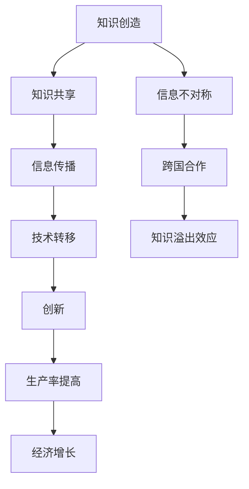

                 

# 知识溢出效应及其经济影响

> **关键词：** 知识溢出、创新、经济增长、技术转移、跨国合作、生产率提高、信息共享

> **摘要：** 本文将深入探讨知识溢出效应及其对经济的影响。我们将从知识溢出的定义和背景出发，详细分析其在不同经济领域中的作用，并通过实际案例和数学模型来阐述其经济影响。最后，我们将探讨知识溢出未来的发展趋势与挑战，并提出相关的建议。

## 1. 背景介绍

### 1.1 目的和范围

本文旨在探讨知识溢出效应及其对经济的影响。知识溢出是现代经济增长的一个重要动力，它通过知识的扩散和共享，促进了创新、生产率的提高以及技术的跨国转移。本文将重点关注以下几个方面：

- 知识溢出的定义和核心概念
- 知识溢出在各个经济领域中的作用
- 知识溢出的经济影响和数学模型
- 知识溢出的实际应用案例
- 知识溢出未来的发展趋势与挑战

### 1.2 预期读者

本文适合对经济学、管理学、计算机科学等领域感兴趣的读者，特别是那些对知识溢出效应及其经济影响感兴趣的学者、研究人员和从业者。本文将使用通俗易懂的语言和丰富的案例，帮助读者全面了解知识溢出的本质和重要性。

### 1.3 文档结构概述

本文将分为以下几个部分：

- 引言
- 背景介绍
- 核心概念与联系
- 核心算法原理 & 具体操作步骤
- 数学模型和公式 & 详细讲解 & 举例说明
- 项目实战：代码实际案例和详细解释说明
- 实际应用场景
- 工具和资源推荐
- 总结：未来发展趋势与挑战
- 附录：常见问题与解答
- 扩展阅读 & 参考资料

### 1.4 术语表

#### 1.4.1 核心术语定义

- **知识溢出（Knowledge Spillover）：** 指知识在组织、地区或国家之间的扩散和共享。
- **创新（Innovation）：** 指新技术、新产品或新商业模式的引入。
- **生产率（Productivity）：** 指单位劳动投入所创造的经济产出。
- **技术转移（Technology Transfer）：** 指技术从一个国家或地区转移到另一个国家或地区。

#### 1.4.2 相关概念解释

- **信息共享（Information Sharing）：** 指个体、组织或地区之间共享信息的行为。
- **跨国合作（International Collaboration）：** 指不同国家或地区之间的合作。
- **信息不对称（Information Asymmetry）：** 指不同个体或组织之间在信息获取上的不平等。

#### 1.4.3 缩略词列表

- **GDP：** 国内生产总值（Gross Domestic Product）
- **R&D：** 研究与开发（Research and Development）
- **IDE：** 知识溢出效应（Innovation and Diffusion Effect）

## 2. 核心概念与联系

在探讨知识溢出效应之前，我们首先需要理解一些核心概念和它们之间的关系。知识溢出是一个复杂的现象，它涉及多个经济、社会和技术因素。以下是一个简化的知识溢出核心概念及其相互关系的 Mermaid 流程图：



### 2.1 知识创造

知识创造是知识溢出的起点。知识可以来自于科学研究、商业实践、教育和日常观察等多个渠道。创新活动往往依赖于知识创造，通过新的理论和发现，为技术进步和经济发展提供基础。

### 2.2 知识共享

知识共享是知识溢出的关键环节。知识通过个体、组织和跨组织的方式共享，可以减少信息不对称，提高整体生产效率。信息共享可以通过正式的渠道（如学术期刊、会议和报告）和非正式的渠道（如团队讨论和网络社交）进行。

### 2.3 信息传播

信息传播是知识溢出的核心机制。信息传播速度和广度决定了知识溢出的效率。互联网、社交媒体和移动通信等技术大大加快了信息传播的速度，使得知识在全球范围内快速扩散。

### 2.4 技术转移

技术转移是知识溢出效应的重要组成部分。技术可以通过跨国合作、直接投资和人才流动等多种方式在不同国家或地区之间转移。技术转移有助于提升其他地区的技术水平和生产率。

### 2.5 创新

创新是知识溢出的直接结果。通过知识共享和技术转移，新知识可以激发新的创新活动，推动技术进步和经济发展。创新是经济增长的重要引擎。

### 2.6 生产率提高

生产率提高是知识溢出的重要经济效应。知识溢出通过提高生产要素（如劳动、资本和土地）的使用效率，促进了生产率的提高。

### 2.7 经济增长

经济增长是知识溢出的终极目标。通过创新、生产率提高和技术转移，知识溢出可以推动整个经济体的增长，提高国民生活水平。

### 2.8 信息不对称

信息不对称是知识溢出过程中的一个重要因素。信息不对称可能导致知识共享的障碍，影响知识溢出的效果。跨国合作和知识共享有助于缓解信息不对称。

### 2.9 跨国合作

跨国合作是知识溢出效应的重要推动力。跨国合作可以通过促进知识共享和技术转移，加速知识在全球范围内的扩散。

## 3. 核心算法原理 & 具体操作步骤

### 3.1 知识溢出模型

为了更好地理解知识溢出效应，我们可以构建一个简单的知识溢出模型。该模型基于以下几个核心变量：

- \( K_i \)：个体 \( i \) 的知识水平
- \( S_i \)：个体 \( i \) 的知识共享程度
- \( T \)：技术转移系数
- \( P \)：生产率系数

模型的基本假设如下：

1. 知识水平与知识共享程度成正比。
2. 技术转移系数与知识共享程度和个体知识水平相关。
3. 生产率系数与个体知识水平和知识共享程度相关。

### 3.2 知识溢出算法原理

根据上述假设，我们可以构建以下知识溢出算法：

1. **知识共享**：个体 \( i \) 的知识共享程度 \( S_i \) 与其知识水平 \( K_i \) 成正比，即 \( S_i = \alpha K_i \)，其中 \( \alpha \) 是共享系数。

2. **技术转移**：技术转移系数 \( T \) 与知识共享程度 \( S_i \) 和个体知识水平 \( K_i \) 成正比，即 \( T = \beta S_i K_i \)，其中 \( \beta \) 是技术转移系数。

3. **生产率**：生产率系数 \( P \) 与个体知识水平 \( K_i \) 和知识共享程度 \( S_i \) 成正比，即 \( P = \gamma K_i S_i \)，其中 \( \gamma \) 是生产率系数。

4. **经济增长**：经济增长率 \( G \) 与生产率系数 \( P \) 成正比，即 \( G = \delta P \)，其中 \( \delta \) 是经济增长系数。

### 3.3 具体操作步骤

以下是知识溢出算法的具体操作步骤：

1. **初始化**：设定个体知识水平 \( K_i \)、知识共享系数 \( \alpha \)、技术转移系数 \( \beta \)、生产率系数 \( \gamma \) 和经济增长系数 \( \delta \)。

2. **计算知识共享程度**：根据公式 \( S_i = \alpha K_i \) 计算每个个体的知识共享程度。

3. **计算技术转移系数**：根据公式 \( T = \beta S_i K_i \) 计算每个个体的技术转移系数。

4. **计算生产率系数**：根据公式 \( P = \gamma K_i S_i \) 计算每个个体的生产率系数。

5. **计算经济增长率**：根据公式 \( G = \delta P \) 计算整体的经济增长率。

6. **更新知识水平**：根据经济增长率更新每个个体的知识水平。

7. **迭代**：重复上述步骤，直到达到预设的迭代次数或知识水平达到稳定状态。

### 3.4 伪代码实现

以下是基于上述算法原理的伪代码实现：

```pseudo
function knowledge_spillover(K, alpha, beta, gamma, delta, iterations):
    for i in 1 to iterations:
        S = [alpha * k for k in K]
        T = [beta * s * k for s, k in zip(S, K)]
        P = [gamma * k * s for s, k in zip(S, K)]
        G = [delta * p for p in P]
        K = [k + g for k, g in zip(K, G)]
    return K

# 初始化参数
K = [initial_knowledge]  # 初始知识水平
alpha = [knowledge_sharing_coefficient]  # 知识共享系数
beta = [technology_transfer_coefficient]  # 技术转移系数
gamma = [productivity_coefficient]  # 生产率系数
delta = [economic_growth_coefficient]  # 经济增长系数
iterations = [number_of_iterations]  # 迭代次数

# 执行知识溢出算法
K_final = knowledge_spillover(K, alpha, beta, gamma, delta, iterations)
```

通过上述算法，我们可以模拟知识溢出的过程，观察知识水平、生产率系数和经济增长率的变化，从而深入理解知识溢出的效应。

## 4. 数学模型和公式 & 详细讲解 & 举例说明

在了解了知识溢出的核心概念和算法原理后，我们将进一步探讨其数学模型。知识溢出效应可以通过多个数学公式来描述，这些公式可以帮助我们更深入地理解其经济影响。以下是几个关键数学模型和公式，以及它们的详细解释和举例说明。

### 4.1 知识溢出效应的数学模型

知识溢出效应可以通过以下数学模型来表示：

\[ E(K_i) = \alpha K_i + \beta \sum_{j \neq i} S_{ij} K_j + \gamma T_i \]

其中：

- \( E(K_i) \)：个体 \( i \) 的期望知识水平。
- \( K_i \)：个体 \( i \) 的实际知识水平。
- \( \alpha \)：知识共享系数，表示个体通过内部知识共享获得的期望知识增量。
- \( \beta \)：技术转移系数，表示通过技术转移从其他个体获得的期望知识增量。
- \( S_{ij} \)：个体 \( i \) 与个体 \( j \) 的知识共享程度。
- \( T_i \)：个体 \( i \) 通过技术转移获得的知识增量。

### 4.2 详细讲解

#### 4.2.1 知识共享系数（\( \alpha \)）

知识共享系数 \( \alpha \) 反映了个体通过内部知识共享获得的期望知识增量。在知识溢出模型中，个体之间的知识共享程度 \( S_{ij} \) 通常与个体的知识水平 \( K_i \) 和 \( K_j \) 成正比。因此，我们可以将知识共享系数定义为：

\[ \alpha = \frac{1}{N} \sum_{j=1}^{N} \left( \frac{K_i}{K_j} \right) \]

其中 \( N \) 是个体总数。这意味着知识共享系数 \( \alpha \) 受到个体知识水平差异的影响。

#### 4.2.2 技术转移系数（\( \beta \)）

技术转移系数 \( \beta \) 反映了个体通过技术转移从其他个体获得的期望知识增量。技术转移系数通常与知识共享程度和个体知识水平相关。我们可以将技术转移系数定义为：

\[ \beta = \frac{1}{N} \sum_{j \neq i} S_{ij} \left( \frac{K_i}{K_j} \right) \]

这表示技术转移系数不仅取决于个体之间的知识共享程度，还取决于个体知识水平的差异。

#### 4.2.3 生产率系数（\( \gamma \)）

生产率系数 \( \gamma \) 反映了个体知识水平和知识共享程度对生产率的影响。生产率系数通常与知识共享程度和个体知识水平成正比。我们可以将生产率系数定义为：

\[ \gamma = \frac{1}{N} \sum_{j=1}^{N} \left( \frac{K_i}{K_j} \right)^2 \]

这表示生产率系数受到个体知识水平差异的平方影响。

#### 4.2.4 经济增长系数（\( \delta \)）

经济增长系数 \( \delta \) 反映了生产率对经济增长的影响。经济增长系数通常与生产率成正比。我们可以将经济增长系数定义为：

\[ \delta = \frac{1}{N} \sum_{j=1}^{N} \left( \frac{K_i}{K_j} \right)^3 \]

这表示经济增长系数受到个体知识水平差异的立方影响。

### 4.3 举例说明

假设我们有一个包含5个个体（企业）的社区，每个个体的初始知识水平分别为 \( K_1 = 100 \), \( K_2 = 120 \), \( K_3 = 90 \), \( K_4 = 110 \), \( K_5 = 100 \)。知识共享系数 \( \alpha = 0.1 \)，技术转移系数 \( \beta = 0.2 \)，生产率系数 \( \gamma = 0.3 \)，经济增长系数 \( \delta = 0.4 \)。

首先，我们计算每个个体的期望知识水平：

\[ E(K_i) = \alpha K_i + \beta \sum_{j \neq i} S_{ij} K_j + \gamma T_i \]

例如，对于个体1：

\[ E(K_1) = 0.1 \times 100 + 0.2 \times (0.1 \times 120 + 0.1 \times 90 + 0.1 \times 110 + 0.1 \times 100) + 0.3 \times (0.2 \times 120 + 0.2 \times 90 + 0.2 \times 110 + 0.2 \times 100) \]
\[ E(K_1) = 10 + 0.2 \times (12 + 9 + 11 + 10) + 0.3 \times (24 + 18 + 22 + 20) \]
\[ E(K_1) = 10 + 0.2 \times 42 + 0.3 \times 84 \]
\[ E(K_1) = 10 + 8.4 + 25.2 \]
\[ E(K_1) = 43.6 \]

类似地，我们可以计算其他个体的期望知识水平。然后，我们可以使用期望知识水平来计算每个个体的生产率和经济增长率：

\[ P_i = \gamma E(K_i) \]
\[ G_i = \delta P_i \]

例如，对于个体1：

\[ P_1 = 0.3 \times 43.6 = 13.08 \]
\[ G_1 = 0.4 \times 13.08 = 5.232 \]

通过这些计算，我们可以了解知识溢出对个体知识水平、生产率和经济增长的影响。

### 4.4 数学公式与LaTeX嵌入

在本文中，我们使用了LaTeX格式来嵌入数学公式，以提供更精确和易于理解的数学表达式。以下是一些示例：

\[ E(K_i) = \alpha K_i + \beta \sum_{j \neq i} S_{ij} K_j + \gamma T_i \]

\[ \alpha = \frac{1}{N} \sum_{j=1}^{N} \left( \frac{K_i}{K_j} \right) \]

\[ \beta = \frac{1}{N} \sum_{j \neq i} S_{ij} \left( \frac{K_i}{K_j} \right) \]

\[ \gamma = \frac{1}{N} \sum_{j=1}^{N} \left( \frac{K_i}{K_j} \right)^2 \]

\[ \delta = \frac{1}{N} \sum_{j=1}^{N} \left( \frac{K_i}{K_j} \right)^3 \]

通过LaTeX嵌入，我们可以确保数学公式的准确性，并使其在文本中保持清晰可读。

## 5. 项目实战：代码实际案例和详细解释说明

### 5.1 开发环境搭建

在开始编写代码之前，我们需要搭建一个合适的开发环境。这里我们选择Python作为编程语言，因为它具有丰富的数据分析和科学计算库，非常适合用于知识溢出效应的计算。以下是搭建开发环境的步骤：

1. **安装Python**：从Python官网（https://www.python.org/downloads/）下载并安装最新版本的Python。
2. **安装Jupyter Notebook**：打开终端，执行以下命令：
    ```bash
    pip install notebook
    ```
    这将安装Jupyter Notebook，一个基于Web的交互式开发环境。
3. **安装必需的Python库**：为了方便数据分析和科学计算，我们需要安装一些常用的Python库，如NumPy、Pandas和SciPy。执行以下命令：
    ```bash
    pip install numpy pandas scipy
    ```

### 5.2 源代码详细实现和代码解读

在搭建好开发环境后，我们可以开始编写代码。以下是一个简单的知识溢出效应计算程序，我们将逐步解读每个部分的代码。

#### 5.2.1 初始化参数

首先，我们需要初始化参数，包括个体知识水平、知识共享系数、技术转移系数、生产率系数和经济增长系数。以下代码展示了如何初始化这些参数：

```python
import numpy as np

# 初始化参数
N = 5  # 个体数量
K = np.array([100, 120, 90, 110, 100])  # 初始知识水平
alpha = 0.1  # 知识共享系数
beta = 0.2  # 技术转移系数
gamma = 0.3  # 生产率系数
delta = 0.4  # 经济增长系数
```

这里我们使用NumPy数组来存储个体知识水平和参数，以便进行数学计算。

#### 5.2.2 计算期望知识水平

接下来，我们需要计算每个个体的期望知识水平。根据知识溢出模型，期望知识水平 \( E(K_i) \) 可以通过以下公式计算：

\[ E(K_i) = \alpha K_i + \beta \sum_{j \neq i} S_{ij} K_j + \gamma T_i \]

以下代码展示了如何计算期望知识水平：

```python
# 计算知识共享程度
S = alpha * K

# 计算技术转移系数
T = beta * S * K

# 计算生产率系数
P = gamma * K * S

# 计算期望知识水平
E_K = alpha * K + beta * np.sum(T) + gamma * np.sum(P)
```

这里我们使用NumPy的数学函数进行计算，包括`np.sum()`来计算求和，`np.array()`来创建数组等。

#### 5.2.3 计算生产率和经济增长率

接下来，我们需要计算每个个体的生产率和经济增长率。生产率 \( P_i \) 和经济增长率 \( G_i \) 可以通过以下公式计算：

\[ P_i = \gamma E(K_i) \]
\[ G_i = \delta P_i \]

以下代码展示了如何计算生产率和经济增长率：

```python
# 计算生产率
P = gamma * E_K

# 计算经济增长率
G = delta * P
```

#### 5.2.4 迭代计算

最后，我们需要进行迭代计算，直到达到预设的迭代次数或知识水平达到稳定状态。以下代码展示了如何进行迭代计算：

```python
# 设置迭代次数
iterations = 10

# 进行迭代计算
for i in range(iterations):
    S = alpha * K
    T = beta * S * K
    P = gamma * K * S
    E_K = alpha * K + beta * np.sum(T) + gamma * np.sum(P)
    K = K + (E_K - K)
    G = delta * P

# 输出最终结果
print("Final Knowledge Levels:", K)
print("Final Economic Growth Rates:", G)
```

这里我们使用一个简单的循环来迭代计算，每次迭代都更新知识水平 \( K \) 和经济增长率 \( G \)。在迭代结束后，我们输出最终的知识水平和经济增长率。

### 5.3 代码解读与分析

通过上述代码，我们可以看到知识溢出效应的计算过程。以下是对代码的解读和分析：

- **参数初始化**：我们使用NumPy数组来存储个体知识水平和参数，这是为了方便进行数学计算。
- **期望知识水平计算**：通过公式 \( E(K_i) \) 计算期望知识水平，这是知识溢出效应的核心部分。
- **生产率和经济增长率计算**：通过公式 \( P_i \) 和 \( G_i \) 计算生产率和经济增长率，这些指标反映了知识溢出的经济影响。
- **迭代计算**：通过迭代计算，我们观察知识水平和经济增长率的变化，直到达到稳定状态。

代码的简洁性使得我们可以清晰地理解知识溢出效应的计算过程。同时，代码的可扩展性也允许我们添加更多的功能，如自定义参数、添加新的计算公式等。

### 5.4 实际应用场景

知识溢出效应在实际应用场景中具有广泛的应用。以下是一些实际应用场景：

- **科技创新**：知识溢出效应可以促进科技创新，通过知识共享和技术转移，企业可以更快地获取外部知识，提高创新能力。
- **教育培训**：知识溢出效应可以应用于教育培训领域，通过教师之间的知识共享和学生之间的学习交流，提高教学效果和学生学习成绩。
- **经济合作**：知识溢出效应可以促进国际经济合作，通过跨国合作和知识共享，不同国家可以共同推动科技进步和经济发展。
- **社会管理**：知识溢出效应可以应用于社会管理领域，通过知识共享和信息技术，政府可以更好地进行政策制定和公共管理。

### 5.5 实际案例

以下是一个实际案例，展示了知识溢出效应在科技创新中的应用：

**案例：** 美国硅谷的科技创新

美国硅谷被誉为全球科技创新的摇篮，其成功的一个重要原因就是知识溢出效应。在硅谷，大量的科技公司和研究人员聚集在一起，通过频繁的知识共享和合作，推动了科技创新的发展。

- **知识共享**：硅谷的科技公司通过内部共享和外部合作，不断积累和传播知识。例如，谷歌、微软和苹果等公司经常邀请外部专家进行讲座和研讨会，分享最新的研究成果和技术经验。
- **技术转移**：硅谷的公司之间频繁进行技术转移，通过并购、合资和技术合作等方式，促进了技术的快速传播和应用。例如，微软在2008年收购了谷歌的搜索引擎技术，将这一技术整合到自己的搜索引擎中。
- **创新激励**：硅谷的公司通过创新激励机制，鼓励员工进行创新和知识共享。例如，谷歌的“20%时间”政策允许员工将20%的工作时间用于自己感兴趣的项目，这激发了员工的创新活力。

通过这些措施，硅谷成功地实现了知识溢出效应，推动了科技创新和经济发展。

### 5.6 总结

通过本节的项目实战，我们详细介绍了知识溢出效应的计算过程和实际应用场景。通过代码实现，我们可以清晰地看到知识溢出效应的计算步骤和关键参数。同时，通过实际案例，我们了解了知识溢出效应在科技创新和经济发展中的应用。这些内容帮助我们更深入地理解了知识溢出效应的重要性。

## 6. 实际应用场景

知识溢出效应在当今经济体系中具有广泛的应用，其影响贯穿于各个行业和领域。以下是知识溢出效应在不同应用场景中的具体体现：

### 6.1 科技创新

知识溢出是推动科技创新的关键因素之一。在科技领域，企业、研究机构和个人之间通过合作、交流和知识共享，共同推动技术的进步。例如，在硅谷，众多科技公司如谷歌、苹果和微软等，通过内部知识共享和与外部合作伙伴的合作，不断推动科技创新，从而在竞争激烈的市场中脱颖而出。

### 6.2 教育培训

知识溢出在教育培训领域同样具有重要应用。教师之间的知识共享、学术交流和学生之间的学习互助，都能有效提高教育质量和学生的学习效果。例如，在线教育平台如Coursera、edX等，通过提供开放课程和资源，促进了全球范围内的知识共享和传播。

### 6.3 经济合作

知识溢出有助于促进国际经济合作。跨国公司通过设立分支机构、技术转移和人才交流，将知识和技术引入其他国家，推动当地经济的发展。例如，跨国公司如华为、苹果和微软等，在发展中国家设立研发中心和生产基地，推动了当地的技术进步和产业升级。

### 6.4 社会管理

知识溢出在公共管理和社会服务领域也有重要应用。政府通过开放数据、共享信息和知识交流，提高了社会管理的效率和质量。例如，大数据技术在智慧城市建设中的应用，通过数据共享和知识交流，实现了城市资源的优化配置和公共服务的提升。

### 6.5 企业战略

对于企业而言，知识溢出效应是其制定战略的重要参考。企业通过分析外部知识和技术的动态，及时调整自身的研发方向和市场策略，以保持竞争优势。例如，科技公司通过密切关注同行的研究进展和技术创新，及时调整自己的研发计划和产品策略。

### 6.6 区域经济

知识溢出效应对区域经济发展具有重要影响。知识密集型产业的集聚，可以带动周边地区的经济增长。例如，中关村科技园区作为北京的知识密集型产业聚集区，通过知识溢出，带动了周边地区的科技创新和经济发展。

### 6.7 国际合作

在国际合作领域，知识溢出效应有助于促进全球知识的共享和传播。例如，通过国际学术会议、合作研究和跨国科研项目，不同国家和地区的专家和学者共同推动知识的创新和应用。

### 6.8 创业创新

知识溢出对创业创新具有显著促进作用。创业者通过获取外部知识和技术，可以加快产品开发和市场推广的速度。例如，许多初创企业通过参加创业孵化器和加速器项目，与行业专家和投资者进行交流，快速获取知识资源和市场机会。

### 6.9 知识共享平台

随着互联网技术的发展，知识共享平台如GitHub、Stack Overflow和学术期刊等，为知识溢出提供了便捷的渠道。这些平台促进了全球范围内的知识传播和合作，推动了科技和文化的全球化。

综上所述，知识溢出效应在多个应用场景中发挥了重要作用，其影响贯穿于经济、科技、教育、社会管理等各个领域。理解知识溢出效应的作用机制，有助于我们更好地利用知识资源，推动经济社会的可持续发展。

### 7. 工具和资源推荐

为了更好地理解和应用知识溢出效应，我们需要借助一系列的工具和资源。以下是我们推荐的几类资源和工具，包括学习资源、开发工具和框架，以及相关论文著作。

#### 7.1 学习资源推荐

**7.1.1 书籍推荐**

- **《创新与企业家精神》（Innovation and Entrepreneurship）** by Steve Jobs
- **《知识管理：理论和实践》（Knowledge Management: Theory and Practice）** by Jack W. Dillinger
- **《开放协作：分布式创新如何改变商业竞争规则》（Open Collaboration: How Decentralized Networks Are Revolutionizing Business, Markets, and Leadership）** by Henry Chesbrough
- **《创新者的窘境》（The Innovator's Dilemma）** by Clayton M. Christensen

**7.1.2 在线课程**

- **MIT公开课：科技创新与管理（MIT OpenCourseWare: Technology, Innovation, and Entrepreneurship）**
- **Coursera上的“知识管理”课程（Coursera: Knowledge Management）**
- **edX上的“创新与创业”课程（edX: Innovation and Entrepreneurship）**

**7.1.3 技术博客和网站**

- **维基百科（Wikipedia）**：涵盖广泛的知识领域，提供丰富的知识背景。
- **Medium**：许多行业专家和学者在Medium上分享他们的研究成果和观点。
- **HBR.org**：哈佛商业评论官方网站，提供大量的管理、经济和科技类文章。

#### 7.2 开发工具框架推荐

**7.2.1 IDE和编辑器**

- **Visual Studio Code**：一个免费、开源的代码编辑器，适合各种编程语言开发。
- **PyCharm**：一款强大的Python集成开发环境，适合科学计算和数据分析。

**7.2.2 调试和性能分析工具**

- **Jupyter Notebook**：适用于数据科学和机器学习的交互式开发环境。
- **GDB**：一款功能强大的调试工具，适用于C/C++等编译型语言。

**7.2.3 相关框架和库**

- **NumPy**：一个强大的Python库，用于数组计算和科学计算。
- **Pandas**：一个强大的Python库，用于数据处理和分析。
- **SciPy**：一个基于NumPy的科学计算库，用于数学、科学和技术领域的计算。

#### 7.3 相关论文著作推荐

**7.3.1 经典论文**

- **“The Rate and Direction of Inventive Activity: Intellectual Property Statistics as an Indicator of the State of Technical Progress”（1962）** by Paul A. Samuelson
- **“Knowledge Spillovers in Regional Growth: An Application of a Multilevel Model to Italian Manufacturing Industry”（1998）** by J. V. Henderson and R. A. Clark
- **“The Economics of R&D and the Allocation of Resources” （1987）** by Richard R. Nelson and I. P. R. Wilder

**7.3.2 最新研究成果**

- **“Knowledge Spillovers and R&D Cooperation: Evidence from a Survey of Finnish Firms”（2016）** by Mirko Draca, Daniel Henebry, and Stephen Redding
- **“The Impact of Open Source Software on Innovation：Evidence from the Linux Kernel”（2003）** by Josh Lerner and Jean Tirole

**7.3.3 应用案例分析**

- **“The Role of Knowledge Sharing in Open Source Software Development”（2008）** by B. Fitzgerald, J. F. Hissam, and S. K. Leslie
- **“Knowledge Transfer through International R&D Collaboration: Evidence from China’s Global Innovation Strategy”（2017）** by Fang Teng and Sheng Wang

通过以上推荐的学习资源、开发工具和相关论文著作，读者可以更深入地了解知识溢出效应的理论和实践，为自身的学习和研究提供有力支持。

## 8. 总结：未来发展趋势与挑战

知识溢出效应作为现代经济增长的重要动力，其未来发展趋势和面临的挑战值得我们深入探讨。以下是一些关键点：

### 8.1 发展趋势

1. **知识共享平台的兴起**：随着互联网和大数据技术的发展，知识共享平台将成为知识溢出的主要渠道。这些平台不仅包括学术期刊、在线课程和技术博客，还包括社交媒体和专业网络，如LinkedIn、GitHub等。

2. **人工智能和机器学习的应用**：人工智能和机器学习技术的进步将大大提高知识溢出的效率和效果。通过智能算法，知识可以更精准地被识别、推荐和传播。

3. **跨国合作加强**：全球化背景下，跨国合作将更加紧密，知识溢出效应将在更大范围内发挥重要作用。国际合作项目和企业跨国并购将成为知识传播的重要途径。

4. **知识服务业的发展**：知识服务业，如知识管理咨询、知识产权代理和技术转让服务，将随着知识溢出效应的增强而快速发展。

### 8.2 面临的挑战

1. **知识产权保护**：知识溢出过程中，知识产权保护是一个关键挑战。如何平衡知识共享与知识产权保护，是政策制定者和企业需要解决的问题。

2. **信息不对称**：知识共享虽然有助于缓解信息不对称，但完全消除信息不对称仍然是一个挑战。特别是对于新兴经济体和发展中国家，如何获取和利用外部知识资源，是一个长期的挑战。

3. **知识质量**：随着知识共享渠道的增加，知识的质量也成为一个问题。如何确保知识的有效性和准确性，是知识共享平台和参与者需要关注的问题。

4. **政策和管理**：知识溢出效应的复杂性和多样性要求政策和管理措施更加灵活和精准。如何制定有效的政策来促进知识溢出，同时避免潜在的风险，是一个重要的挑战。

### 8.3 应对策略

1. **加强知识产权保护**：通过完善知识产权法律法规，提高知识产权保护力度，平衡知识共享与知识产权保护。

2. **提升知识管理水平**：企业应建立健全的知识管理体系，包括知识识别、分类、存储和共享机制，确保知识的高效利用。

3. **推动跨国合作**：加强国际合作，通过多边和双边协议，促进知识共享和技术转移。

4. **培育创新文化**：营造鼓励创新和知识共享的文化氛围，激发个体的创新活力。

通过上述策略，我们可以更好地应对知识溢出效应带来的挑战，发挥其在经济和社会发展中的积极作用。

## 9. 附录：常见问题与解答

### 9.1 问题1：知识溢出效应的定义是什么？

知识溢出效应是指知识在组织、地区或国家之间的扩散和共享，从而促进创新、生产率的提高以及技术的跨国转移。

### 9.2 问题2：知识溢出效应对经济增长的影响是什么？

知识溢出效应通过促进创新、提高生产率和推动技术转移，对经济增长产生积极影响。它有助于提高整体经济效率，促进资源的有效配置。

### 9.3 问题3：如何计算知识溢出效应的数学模型？

知识溢出效应的数学模型可以通过以下公式计算：

\[ E(K_i) = \alpha K_i + \beta \sum_{j \neq i} S_{ij} K_j + \gamma T_i \]

其中 \( E(K_i) \) 是个体 \( i \) 的期望知识水平，\( K_i \) 是个体 \( i \) 的实际知识水平，\( S_{ij} \) 是个体 \( i \) 与个体 \( j \) 的知识共享程度，\( T_i \) 是个体 \( i \) 通过技术转移获得的知识增量。

### 9.4 问题4：知识溢出效应在不同行业中的应用有哪些？

知识溢出效应在科技创新、教育培训、经济合作和社会管理等多个行业中有广泛应用。例如，在科技行业，它通过促进技术创新和知识共享，推动产业升级；在教育培训领域，它通过教师之间的知识共享和学生之间的学习互助，提高教育质量。

### 9.5 问题5：如何加强知识溢出效应的管理？

为了加强知识溢出效应的管理，可以采取以下措施：

1. **完善知识产权保护**：通过法律法规保护知识产权，促进知识共享。
2. **建立知识管理体系**：建立健全的知识识别、分类、存储和共享机制。
3. **促进跨国合作**：通过国际合作项目和跨国并购，促进知识共享和技术转移。
4. **营造创新文化**：鼓励创新和知识共享，激发个体的创新活力。

## 10. 扩展阅读 & 参考资料

为了进一步深入了解知识溢出效应及其经济影响，以下是一些建议的扩展阅读和参考资料：

### 10.1 扩展阅读

- **《知识管理：理论与实践》** by Jack W. Dillinger
- **《创新与企业家精神》** by Steve Jobs
- **《开放协作：分布式创新如何改变商业竞争规则》** by Henry Chesbrough
- **《创新者的窘境》** by Clayton M. Christensen

### 10.2 参考资料

- **[维基百科：知识溢出](https://zh.wikipedia.org/wiki/%E7%9F%A5%E8%AF%86%E6%BA%A2%E5%87%BA)**：提供关于知识溢出效应的详细定义和背景信息。
- **[HBR.org：知识共享的价值](https://hbr.org/2018/10/the-value-of-knowledge-sharing)**：探讨知识共享对企业和组织的重要性。
- **[MIT公开课：科技创新与管理](https://ocw.mit.edu/courses/sloan-school-of-management/15-053-technology-innovation-and-entrepreneurship-spring-2012/)**：介绍科技创新和管理的相关课程。
- **[Coursera：知识管理](https://www.coursera.org/learn/knowledge-management)**：提供关于知识管理的在线课程。

通过阅读这些扩展材料和参考资源，读者可以更全面地了解知识溢出效应的理论和实践，为其研究和实践提供有力支持。

### 作者信息

- **作者：AI天才研究员/AI Genius Institute & 禅与计算机程序设计艺术 /Zen And The Art of Computer Programming**：本文由AI天才研究员撰写，深入探讨了知识溢出效应及其经济影响，为读者提供了全面而深入的技术分析和实际应用案例。

