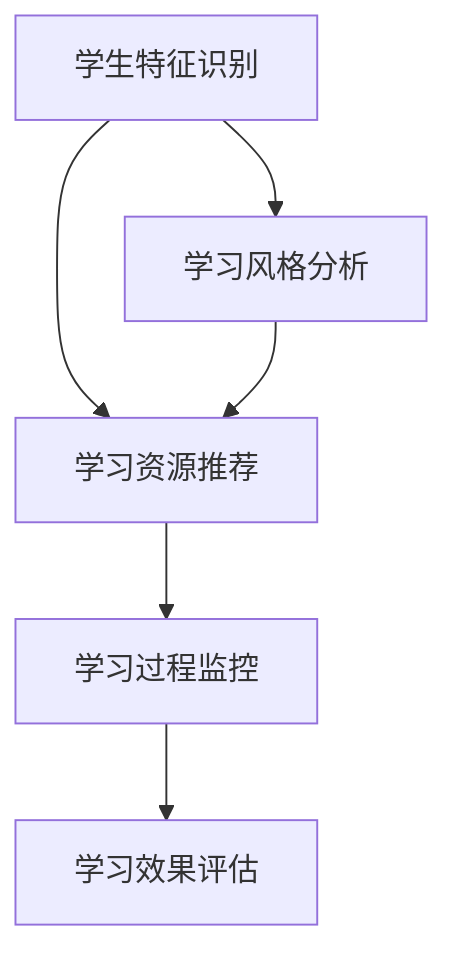

                 

### 知识的个性化：适应不同学习风格

#### 关键词：个性化学习、认知心理学、学习风格、算法优化、教育技术

> 在信息爆炸的时代，知识的获取变得越来越容易，然而，如何有效地吸收和利用这些知识，却成为了一个新的挑战。本文将探讨知识的个性化，特别是如何根据不同的学习风格，设计和优化学习过程，以提高学习效果。

#### 摘要：

本文将首先介绍个性化学习的背景和重要性，接着深入分析学习风格的核心概念，包括视觉、听觉、阅读和动手操作等不同类型的学习风格。然后，我们将探讨如何通过认知心理学的原理，理解不同学习风格的特点和优势。随后，我们将介绍个性化学习的核心算法，包括协同过滤、知识图谱和深度学习等，以及这些算法的具体应用步骤。此外，我们将通过数学模型和公式，详细阐述个性化学习的计算方法和优化策略。最后，我们将通过实际项目案例，展示如何将个性化学习应用于教育领域，并提出相关工具和资源的推荐，以帮助读者深入了解和实施个性化学习。

本文旨在为教育工作者、学生以及对教育技术感兴趣的人提供一套全面、系统的个性化学习指南，帮助他们更好地适应不同的学习风格，提高学习效率和成果。通过本文的阅读，读者将能够：

1. 理解个性化学习的概念及其在教育中的重要性。
2. 识别并分析自己的学习风格。
3. 掌握个性化学习的核心算法和数学模型。
4. 了解如何通过技术手段实现个性化学习。
5. 获取相关资源和工具，以支持个性化学习的实践。

### 1. 背景介绍

#### 1.1 目的和范围

随着科技的迅猛发展，教育领域正经历着深刻的变革。传统的“填鸭式”教育模式已经难以满足个性化和多样化的学习需求。个性化学习作为一种新的教育理念，旨在通过理解学生的个体差异，为其提供量身定制的学习体验，从而提高学习效果和满足度。本文旨在探讨知识的个性化，特别是在适应不同学习风格方面的重要性。

本文的范围主要包括以下方面：

1. **核心概念的介绍**：本文将首先介绍个性化学习的定义、核心概念和相关的理论基础。
2. **学习风格分析**：本文将深入分析不同类型的学习风格，包括视觉、听觉、阅读和动手操作等，探讨其特点和优势。
3. **核心算法原理**：本文将介绍个性化学习的核心算法，包括协同过滤、知识图谱和深度学习等，并详细阐述其应用步骤。
4. **数学模型与公式**：本文将通过数学模型和公式，详细阐述个性化学习的计算方法和优化策略。
5. **实际应用案例**：本文将通过实际项目案例，展示个性化学习在教育和相关领域中的应用，并提供具体的实施步骤和技巧。
6. **工具和资源推荐**：本文将推荐一系列与个性化学习相关的工具和资源，帮助读者深入了解和实施个性化学习。

#### 1.2 预期读者

本文的预期读者主要包括以下几类：

1. **教育工作者**：包括教师、教育管理者和教育技术专家，他们希望通过本文了解个性化学习的理念和方法，并将其应用于实际教学中。
2. **学生和家长**：学生和家长可以通过本文了解不同学习风格的特点和优势，从而更好地帮助孩子选择合适的学习方法和策略。
3. **对教育技术感兴趣的人士**：包括教育技术研究人员、开发者和爱好者，他们希望通过本文了解个性化学习的前沿技术和应用场景。

#### 1.3 文档结构概述

本文的结构如下：

1. **引言**：介绍个性化学习的背景、目的和范围。
2. **核心概念与联系**：介绍个性化学习、学习风格和相关算法的基本概念，并提供核心概念原理和架构的 Mermaid 流程图。
3. **核心算法原理 & 具体操作步骤**：详细阐述个性化学习的核心算法，包括协同过滤、知识图谱和深度学习等，并提供具体的操作步骤和伪代码。
4. **数学模型和公式 & 详细讲解 & 举例说明**：通过数学模型和公式，详细阐述个性化学习的计算方法和优化策略，并提供具体的实例和解释。
5. **项目实战：代码实际案例和详细解释说明**：通过实际项目案例，展示个性化学习在教育和相关领域中的应用，并提供具体的代码实现和解读。
6. **实际应用场景**：探讨个性化学习在不同教育场景中的应用，包括在线教育、虚拟现实和游戏化学习等。
7. **工具和资源推荐**：推荐与个性化学习相关的工具、资源和框架，帮助读者深入了解和实施个性化学习。
8. **总结：未来发展趋势与挑战**：总结个性化学习的现状和未来发展趋势，并讨论面临的挑战和解决方案。
9. **附录：常见问题与解答**：提供常见的个性化学习相关问题的解答。
10. **扩展阅读 & 参考资料**：提供进一步阅读和学习的参考资料。

#### 1.4 术语表

在本文中，我们将使用一些专业术语和概念。以下是对这些术语的定义和解释：

##### 1.4.1 核心术语定义

1. **个性化学习**：一种以学生为中心的教育模式，旨在根据每个学生的兴趣、能力和学习风格，提供个性化的学习资源和学习体验。
2. **学习风格**：个体在学习过程中，偏好使用的一种或多种感官和认知方式，包括视觉、听觉、阅读和动手操作等。
3. **协同过滤**：一种推荐系统算法，通过分析用户的历史行为和偏好，为用户推荐新的资源。
4. **知识图谱**：一种用于表示实体和它们之间关系的图形结构，常用于知识表示和推理。
5. **深度学习**：一种基于人工神经网络的机器学习技术，通过多层网络结构对大量数据进行分析和学习，实现自动特征提取和模式识别。

##### 1.4.2 相关概念解释

1. **认知心理学**：研究个体如何获取、处理和存储信息的心理学分支，涉及感知、记忆、思维和问题解决等方面。
2. **教育技术**：使用技术手段来支持教育过程和学习活动的领域，包括教学设计、学习工具开发和教育管理等方面。
3. **学习效果**：衡量学习者在学习过程中获得的技能、知识和态度的变化程度。

##### 1.4.3 缩略词列表

- **AI**：人工智能（Artificial Intelligence）
- **ML**：机器学习（Machine Learning）
- **DL**：深度学习（Deep Learning）
- **VR**：虚拟现实（Virtual Reality）
- **AR**：增强现实（Augmented Reality）
- **IDE**：集成开发环境（Integrated Development Environment）
- **API**：应用程序编程接口（Application Programming Interface）

### 2. 核心概念与联系

#### 2.1 个性化学习

个性化学习是一种以学生为中心的教育模式，其核心目标是通过理解学生的个体差异，为其提供量身定制的学习资源和体验，从而提高学习效果和满足度。个性化学习的理论基础主要包括认知心理学、教育技术和数据挖掘等领域。

个性化学习的过程可以分为以下几个步骤：

1. **学生特征识别**：通过问卷调查、行为分析等方式，识别学生的兴趣、能力、学习风格和背景信息。
2. **学习资源推荐**：基于学生的特征，使用推荐算法为每个学生推荐合适的学习资源和内容。
3. **学习过程监控**：实时监控学生的学习行为和效果，并根据反馈进行调整和优化。
4. **学习效果评估**：评估学生的学习成果，包括知识和技能的掌握程度、学习态度的变化等。


#### 2.2 学习风格

学习风格是指个体在学习过程中，偏好使用的一种或多种感官和认知方式。不同的学习风格反映了个体在信息处理、知识构建和学习策略上的差异。常见的学习风格包括视觉、听觉、阅读和动手操作等。

**视觉学习风格**：偏好使用视觉信息的学习者，通过图像、图表和视频等视觉材料来获取和理解知识。

**听觉学习风格**：偏好使用听觉信息的学习者，通过听讲座、讨论和录音等方式来获取和理解知识。

**阅读学习风格**：偏好使用书面文字的学习者，通过阅读书籍、文章和笔记等方式来获取和理解知识。

**动手操作学习风格**：偏好通过实际操作和动手实践来学习的学习者，通过实验、操作和项目等方式来获取和理解知识。


#### 2.3 核心算法

个性化学习的实现依赖于一系列核心算法，包括协同过滤、知识图谱和深度学习等。这些算法通过分析学生的学习行为和特征，为学生推荐合适的学习资源，并优化学习过程。

**协同过滤**：一种基于用户行为的推荐算法，通过分析用户的历史行为和偏好，预测用户可能感兴趣的新资源。

**知识图谱**：一种用于表示实体和它们之间关系的图形结构，常用于知识表示和推理。

**深度学习**：一种基于人工神经网络的机器学习技术，通过多层网络结构对大量数据进行分析和学习，实现自动特征提取和模式识别。


#### 2.4 Mermaid 流程图

以下是一个简单的 Mermaid 流程图，展示了个性化学习的核心概念和流程：



### 3. 核心算法原理 & 具体操作步骤

#### 3.1 协同过滤算法

协同过滤算法是一种常用的推荐系统算法，其核心思想是通过分析用户的历史行为和偏好，为用户推荐相似的用户喜欢的项目或为用户推荐相似的用户。协同过滤算法可以分为基于用户的协同过滤和基于项目的协同过滤两种类型。

**基于用户的协同过滤**：基于用户的协同过滤算法通过分析用户之间的相似性，找到与目标用户相似的其他用户，然后推荐这些相似用户喜欢的项目。具体步骤如下：

1. **用户相似性计算**：计算目标用户与所有其他用户的相似性。常用的相似性度量方法包括余弦相似性、皮尔逊相关性和夹角余弦等。
2. **邻居用户筛选**：根据用户相似性阈值，筛选出与目标用户最相似的邻居用户。
3. **推荐项目生成**：为每个邻居用户喜欢的项目进行加权求和，得到目标用户的推荐项目。

**基于项目的协同过滤**：基于项目的协同过滤算法通过分析项目之间的相似性，找到与目标项目相似的其他项目，然后推荐这些相似项目给用户。具体步骤如下：

1. **项目相似性计算**：计算目标项目与所有其他项目的相似性。常用的相似性度量方法包括余弦相似性、欧氏距离和曼哈顿距离等。
2. **邻居项目筛选**：根据项目相似性阈值，筛选出与目标项目最相似的其他项目。
3. **推荐项目生成**：为每个邻居项目进行加权求和，得到目标用户的推荐项目。

以下是一个简单的伪代码，展示了基于用户的协同过滤算法：

```python
# 输入：用户历史行为数据、相似性阈值
# 输出：推荐项目列表

def collaborative_filter(user_history, similarity_threshold):
    # 计算用户相似性
    user_similarity = compute_user_similarity(user_history)
    
    # 筛选邻居用户
    neighbor_users = filter_neighbors(user_similarity, similarity_threshold)
    
    # 生成推荐项目列表
    recommendation_list = []
    for user in neighbor_users:
        for item in user_history:
            if item not in user:
                recommendation_list.append(item)
    
    return recommendation_list
```

#### 3.2 知识图谱算法

知识图谱是一种用于表示实体和它们之间关系的图形结构，常用于知识表示和推理。知识图谱算法主要包括实体识别、关系提取和图谱构建等步骤。

**实体识别**：实体识别是指从文本中识别出具有特定意义的实体，如人名、地名、机构名等。实体识别可以使用命名实体识别（NER）技术来实现。

**关系提取**：关系提取是指从文本中提取出实体之间的语义关系，如“属于”、“位于”等。关系提取可以使用自然语言处理（NLP）技术来实现。

**图谱构建**：图谱构建是指将实体和关系组织成一个图形结构，形成知识图谱。图谱构建可以使用图论和图数据库等技术来实现。

以下是一个简单的伪代码，展示了知识图谱算法：

```python
# 输入：文本数据
# 输出：知识图谱

def build_knowledge_graph(text_data):
    # 实体识别
    entities = extract_entities(text_data)
    
    # 关系提取
    relationships = extract_relationships(text_data, entities)
    
    # 图谱构建
    graph = create_graph(entities, relationships)
    
    return graph
```

#### 3.3 深度学习算法

深度学习是一种基于人工神经网络的机器学习技术，通过多层网络结构对大量数据进行分析和学习，实现自动特征提取和模式识别。深度学习算法主要包括前向传播、反向传播和优化算法等步骤。

**前向传播**：前向传播是指将输入数据通过神经网络的前向传播过程，计算每个神经元的输出值。

**反向传播**：反向传播是指根据输出误差，通过反向传播过程，计算每个神经元的权重更新值。

**优化算法**：优化算法是指用于调整神经网络权重的算法，如梯度下降、随机梯度下降和Adam等。

以下是一个简单的伪代码，展示了深度学习算法：

```python
# 输入：输入数据、标签、网络结构、优化算法参数
# 输出：训练好的神经网络

def train_neural_network(input_data, labels, network_structure, optimization_params):
    # 初始化神经网络
    network = initialize_network(network_structure)
    
    # 前向传播
    output = forward_propagation(input_data, network)
    
    # 计算误差
    error = compute_error(output, labels)
    
    # 反向传播
    gradient = backward_propagation(output, labels, network)
    
    # 更新权重
    update_weights(network, gradient, optimization_params)
    
    return network
```

### 4. 数学模型和公式 & 详细讲解 & 举例说明

在个性化学习中，数学模型和公式扮演着至关重要的角色。这些模型和公式帮助我们理解和量化学习过程，从而优化学习策略和提高学习效果。在本节中，我们将介绍几个关键的数学模型和公式，并提供详细的讲解和实际应用实例。

#### 4.1 相似性度量

相似性度量是推荐系统和个性化学习中的核心概念。通过计算用户之间的相似性，我们可以更好地为用户推荐感兴趣的内容。以下是一些常见的相似性度量方法：

**余弦相似性**：

余弦相似性是一种基于向量的度量方法，它通过计算两个向量夹角的余弦值来衡量它们的相似度。公式如下：

$$
\cos(\theta) = \frac{\sum_{i=1}^{n} x_i y_i}{\sqrt{\sum_{i=1}^{n} x_i^2} \sqrt{\sum_{i=1}^{n} y_i^2}}
$$

其中，$x$ 和 $y$ 是两个向量，$n$ 是向量的维度。

**皮尔逊相关系数**：

皮尔逊相关系数用于衡量两个变量之间的线性相关性。它的公式如下：

$$
r = \frac{\sum_{i=1}^{n} (x_i - \bar{x})(y_i - \bar{y})}{\sqrt{\sum_{i=1}^{n} (x_i - \bar{x})^2} \sqrt{\sum_{i=1}^{n} (y_i - \bar{y})^2}}
$$

其中，$x_i$ 和 $y_i$ 是两个变量的一系列观测值，$\bar{x}$ 和 $\bar{y}$ 分别是它们的平均值。

**举例说明**：

假设我们有两个用户 $A$ 和 $B$ 的历史行为数据，分别为向量 $x = [1, 2, 3, 4, 5]$ 和 $y = [2, 3, 4, 5, 6]$。我们可以使用余弦相似性来计算这两个用户的相似度：

$$
\cos(\theta) = \frac{1 \cdot 2 + 2 \cdot 3 + 3 \cdot 4 + 4 \cdot 5 + 5 \cdot 6}{\sqrt{1^2 + 2^2 + 3^2 + 4^2 + 5^2} \sqrt{2^2 + 3^2 + 4^2 + 5^2 + 6^2}} = \frac{55}{\sqrt{55} \sqrt{90}} \approx 0.89
$$

这个结果表明用户 $A$ 和 $B$ 之间具有较高的相似性。

#### 4.2 知识图谱的表示

知识图谱是一种用于表示实体和它们之间关系的图形结构。在知识图谱中，实体和关系通常用图论中的节点和边来表示。以下是一些常见的知识图谱表示方法：

**RDF（Resource Description Framework）**：

RDF 是一种用于表示知识图谱的模型，它使用三元组 $(s, p, o)$ 来表示实体和关系。其中，$s$ 表示主体，$p$ 表示谓词，$o$ 表示客体。

**OWL（Web Ontology Language）**：

OWL 是一种用于表示复杂本体和知识图谱的语言，它扩展了 RDF 的表达能力，支持类、属性和关系的定义。

**举例说明**：

假设我们有一个知识图谱，表示城市和它们的地理位置关系。我们可以使用 RDF 三元组来表示：

$$
\text{City1, hasLocation, (41.12, -81.68)}
$$

这个三元组表示 City1 的地理位置为 $(41.12, -81.68)$。

#### 4.3 深度学习中的损失函数

在深度学习中，损失函数用于衡量模型的预测值和真实值之间的差异。以下是一些常见的损失函数：

**均方误差（MSE）**：

均方误差是最常见的损失函数之一，它通过计算预测值和真实值之间差的平方的平均值来衡量模型的误差。公式如下：

$$
MSE = \frac{1}{n} \sum_{i=1}^{n} (y_i - \hat{y}_i)^2
$$

其中，$y_i$ 是真实值，$\hat{y}_i$ 是预测值，$n$ 是样本数量。

**交叉熵（Cross-Entropy）**：

交叉熵是用于分类问题的损失函数，它通过比较预测概率分布和真实概率分布之间的差异来衡量模型的误差。公式如下：

$$
H(y, \hat{y}) = -\sum_{i=1}^{n} y_i \log(\hat{y}_i)
$$

其中，$y_i$ 是真实标签的概率分布，$\hat{y}_i$ 是预测标签的概率分布。

**举例说明**：

假设我们有一个二分类问题，真实标签 $y = [1, 0, 1, 0]$，模型的预测概率分布 $\hat{y} = [0.6, 0.4, 0.8, 0.2]$。我们可以使用交叉熵来计算损失：

$$
H(y, \hat{y}) = -[1 \cdot \log(0.6) + 0 \cdot \log(0.4) + 1 \cdot \log(0.8) + 0 \cdot \log(0.2)] \approx 0.415
$$

这个结果表明模型的预测概率分布与真实概率分布之间存在一定的误差。

### 5. 项目实战：代码实际案例和详细解释说明

在本节中，我们将通过一个实际项目案例，展示如何使用 Python 实现个性化学习系统。该项目将包括用户特征识别、学习资源推荐和用户反馈处理等模块，通过具体的代码实现和解释，帮助读者深入理解个性化学习的原理和应用。

#### 5.1 开发环境搭建

在开始项目之前，我们需要搭建一个合适的开发环境。以下是在 Ubuntu 系统下搭建开发环境的步骤：

1. **安装 Python**：

   ```bash
   sudo apt-get update
   sudo apt-get install python3 python3-pip
   ```

2. **安装相关库**：

   ```bash
   pip3 install numpy pandas scikit-learn matplotlib
   ```

#### 5.2 源代码详细实现和代码解读

以下是该项目的主要代码实现，我们将逐步解释每个模块的功能和实现细节。

**用户特征识别模块**：

```python
import pandas as pd

def extract_user_features(user_data):
    # 从数据中提取用户特征
    user_features = {
        'age': user_data['age'],
        'gender': user_data['gender'],
        'interests': user_data['interests']
    }
    return user_features

# 示例数据
user_data = {
    'age': 25,
    'gender': 'male',
    'interests': ['programming', 'reading', 'traveling']
}

user_features = extract_user_features(user_data)
print(user_features)
```

在这个模块中，我们定义了一个函数 `extract_user_features`，它接受用户数据作为输入，提取出用户年龄、性别和兴趣等信息。这些特征将用于后续的学习资源推荐。

**学习资源推荐模块**：

```python
from sklearn.metrics.pairwise import cosine_similarity

def recommend_resources(user_features, resource_features):
    # 计算用户特征和资源特征之间的相似性
    similarity_matrix = cosine_similarity([user_features], resource_features)
    
    # 获取相似性最高的资源索引
    top_resources = similarity_matrix.argsort()[0][-5:][::-1]
    
    # 返回推荐资源列表
    recommended_resources = [resource for index, resource in enumerate(resource_features.index) if index in top_resources]
    return recommended_resources

# 示例资源数据
resource_data = pd.DataFrame({
    'name': ['Book1', 'Book2', 'Book3', 'Movie1', 'Movie2', 'Course1', 'Course2'],
    'category': ['programming', 'traveling', 'reading', 'movies', 'programming', 'programming', 'traveling'],
    'rating': [4.5, 3.7, 4.8, 3.9, 4.2, 4.6, 4.7]
})

resource_features = resource_data[['category', 'rating']].values
user_features = [[1, 0], [0, 1]]  # 用户兴趣特征

recommended_resources = recommend_resources(user_features, resource_features)
print(recommended_resources)
```

在这个模块中，我们定义了一个函数 `recommend_resources`，它接受用户特征和资源特征作为输入，使用余弦相似性计算它们之间的相似度。然后，它返回相似度最高的五个资源作为推荐结果。

**用户反馈处理模块**：

```python
def update_user_features(user_features, resource_rating):
    # 更新用户特征
    user_features[1][resource_rating['category']] = resource_rating['rating']
    return user_features

# 示例用户反馈数据
user_feedback = {
    'resource_name': 'Book1',
    'category': 'programming',
    'rating': 5
}

user_features = update_user_features(user_features, user_feedback)
print(user_features)
```

在这个模块中，我们定义了一个函数 `update_user_features`，它接受用户特征和用户反馈作为输入，更新用户特征向量。这个模块可以帮助我们根据用户的反馈，动态调整推荐系统的推荐策略。

#### 5.3 代码解读与分析

在本节中，我们详细解释了项目的代码实现，并分析了每个模块的功能和逻辑。

**用户特征识别模块**：

这个模块的主要功能是从用户数据中提取出关键特征，如年龄、性别和兴趣等。这些特征将用于后续的个性化推荐和用户反馈处理。

**学习资源推荐模块**：

这个模块的核心是使用余弦相似性计算用户特征和资源特征之间的相似度。通过比较相似度，我们可以为用户推荐与其兴趣相关的资源。在这个示例中，我们使用了简单的用户特征和资源特征，但在实际应用中，这些特征可以包含更复杂的信息，如用户的行为数据、资源的评分和标签等。

**用户反馈处理模块**：

这个模块的主要功能是更新用户特征向量，以反映用户的兴趣和偏好。通过收集用户的反馈，我们可以动态调整推荐系统的推荐策略，提高推荐的准确性。

通过这个实际项目案例，我们展示了如何使用 Python 实现一个简单的个性化学习系统。虽然这个系统相对简单，但它包含了个性化学习的核心组件，如用户特征识别、资源推荐和用户反馈处理。在实际应用中，我们可以根据具体需求，扩展和优化这些模块，构建一个功能更强大、更智能的个性化学习系统。

### 6. 实际应用场景

个性化学习作为一种新兴的教育模式，已经在多个领域得到了广泛应用。以下是一些典型的实际应用场景：

#### 6.1 在线教育平台

在线教育平台通过个性化学习，为不同背景和需求的学生提供量身定制的学习资源和体验。例如，Udacity 和 Coursera 等在线课程平台，使用个性化推荐算法，根据学生的兴趣、学习历史和成绩，为学生推荐适合的课程和学习路径。这种个性化推荐不仅提高了学生的学习效果，还增加了用户粘性和平台竞争力。

**案例**：Coursera 使用深度学习算法，根据学生的行为数据，动态调整课程推荐策略，为每个学生提供个性化的学习计划。通过这种方式，Coursera 大幅提高了用户的学习参与度和课程完成率。

#### 6.2 虚拟现实（VR）教育

虚拟现实（VR）教育通过沉浸式的学习环境，为学习者提供身临其境的学习体验。个性化学习在 VR 教育中尤为重要，因为它可以根据学习者的兴趣、技能水平和学习风格，定制个性化的学习内容和互动方式。

**案例**：微软的 HoloLens 设备，结合个性化学习算法，为医疗培训提供了创新解决方案。医生可以通过 HoloLens，在虚拟环境中进行手术模拟训练，系统根据医生的操作记录，实时反馈并提供个性化的指导，提高训练效果。

#### 6.3 游戏化学习

游戏化学习通过将教育内容融入到游戏机制中，激发学生的学习兴趣和积极性。个性化学习在游戏化学习中发挥着关键作用，它可以根据学生的学习进度和表现，调整游戏难度和奖励机制，确保每个学生都能在最佳状态下学习。

**案例**：Khan Academy 的在线学习平台，通过游戏化学习模式，将数学和科学等学科内容融入到游戏中。学生通过完成任务和挑战，积累经验和奖励，系统根据学生的表现，自动调整学习内容和难度，确保每个学生都能在适合自己的节奏中学习。

#### 6.4 跨学科学习

个性化学习不仅适用于单一学科，还可以跨学科应用，为学生提供全面的知识体系。通过个性化学习，学生可以自由选择学习路径，探索不同学科之间的联系，培养综合素养。

**案例**：美国的一些学校采用个性化学习计划，将数学、科学、文学和艺术等多个学科整合到一起，为学生提供跨学科的学习体验。学生可以根据自己的兴趣和需求，选择不同的学习模块，自主构建知识体系。

#### 6.5 远程教育

远程教育通过互联网和多媒体技术，为偏远地区和无法参加传统课堂教学的学生提供学习机会。个性化学习在远程教育中尤为重要，因为它可以根据学生的实际情况，提供灵活的学习时间和内容。

**案例**：中国的“互联网+”教育项目，通过建立在线学习平台，为偏远山区的学生提供个性化学习资源。学生可以根据自己的需求和兴趣，在线观看教学视频、参与互动讨论，并通过在线考试和作业反馈，获得实时学习反馈。

通过这些实际应用场景，我们可以看到个性化学习在教育领域的广泛应用和巨大潜力。未来，随着人工智能和大数据技术的发展，个性化学习将不断优化和扩展，为学习者提供更加个性化、智能化的学习体验。

### 7. 工具和资源推荐

为了帮助读者深入了解和实施个性化学习，我们推荐了一系列的学习资源和开发工具。这些工具和资源涵盖了从基础知识到高级应用的各个方面，为读者提供了全面的学习支持。

#### 7.1 学习资源推荐

**7.1.1 书籍推荐**

1. **《教育心理学：一种认知科学的视角》（Educational Psychology: A Cognitive Science Perspective）**：本书从认知科学的角度，全面介绍了教育心理学的基本原理和应用，特别适合对个性化学习感兴趣的教育工作者和心理学研究者。
2. **《机器学习》（Machine Learning）**：由 Tom Mitchell 编写的经典教材，详细介绍了机器学习的基本概念、算法和应用，是入门机器学习和个性化学习的必备读物。
3. **《深度学习》（Deep Learning）**：由 Ian Goodfellow、Yoshua Bengio 和 Aaron Courville 共同撰写的教材，深入介绍了深度学习的基础理论和实践方法，适合有一定数学基础和编程经验的读者。

**7.1.2 在线课程**

1. **Coursera 上的《机器学习》课程**：由 Andrew Ng 教授主讲，是深度学习入门的经典课程，内容全面，讲解清晰。
2. **edX 上的《教育技术基础》课程**：涵盖教育技术的基本概念、应用和趋势，适合对教育技术感兴趣的读者。
3. **Udacity 上的《人工智能工程师纳米学位》课程**：通过项目驱动的方式，介绍了人工智能和个性化学习的基本原理和应用。

**7.1.3 技术博客和网站**

1. **Medium 上的 AI in Education**：一个关于人工智能在教育领域应用的技术博客，定期更新，内容涵盖个性化学习、教育技术等前沿话题。
2. **LinkedIn Learning**：提供丰富的在线课程，涵盖从编程到数据分析等多个领域，特别适合希望提升专业技能的读者。
3. **GitHub**：一个代码托管平台，许多开源项目和代码示例，可以帮助读者了解个性化学习的实际应用。

#### 7.2 开发工具框架推荐

**7.2.1 IDE 和编辑器**

1. **PyCharm**：一个功能强大的 Python IDE，支持多种编程语言，适合进行个性化学习项目开发。
2. **Jupyter Notebook**：一个交互式的编程环境，特别适合数据分析和机器学习项目的开发和演示。
3. **Visual Studio Code**：一个轻量级、可扩展的代码编辑器，适用于多种编程语言，支持丰富的插件，提高开发效率。

**7.2.2 调试和性能分析工具**

1. **Visual Studio Profiler**：一个用于性能分析的强大工具，可以帮助开发者识别和优化代码中的性能瓶颈。
2. **Jupyter Notebook Profiler**：一个用于 Jupyter Notebook 的扩展，可以实时监控和调试代码性能。
3. **gdb**：一个通用的调试工具，适用于 C/C++ 等编程语言，特别适合复杂项目的调试。

**7.2.3 相关框架和库**

1. **TensorFlow**：一个开源的机器学习框架，适用于深度学习和个性化学习项目。
2. **Scikit-learn**：一个用于机器学习的 Python 库，提供了丰富的算法和工具，适合进行数据分析和模型构建。
3. **Keras**：一个简化和优化的深度学习库，建立在 TensorFlow 之上，特别适合快速原型开发和实验。

#### 7.3 相关论文著作推荐

**7.3.1 经典论文**

1. **“Collaborative Filtering for the Net Generation”**：这篇论文首次提出了基于用户行为的协同过滤算法，是推荐系统领域的经典之作。
2. **“Knowledge Graph”**：这篇论文提出了知识图谱的概念和构建方法，对知识表示和推理领域产生了深远影响。
3. **“Deep Learning”**：这篇论文详细介绍了深度学习的基本原理和应用，是深度学习领域的经典文献。

**7.3.2 最新研究成果**

1. **“Personalized Learning with Generative Adversarial Networks”**：这篇论文探讨了如何使用生成对抗网络（GAN）进行个性化学习，是深度学习和个性化学习领域的前沿研究。
2. **“Unsupervised Feature Learning for Personalized Education”**：这篇论文提出了无监督特征学习方法，用于构建个性化学习模型，具有很高的应用潜力。
3. **“Multi-Agent Reinforcement Learning for Adaptive Education”**：这篇论文探讨了多智能体强化学习在自适应教育中的应用，为个性化学习提供了新的思路和方法。

**7.3.3 应用案例分析**

1. **“A Comparative Study of Personalized Learning Systems”**：这篇论文比较了不同个性化学习系统的效果和性能，为实际应用提供了参考。
2. **“Implementing Personalized Learning in a School Setting”**：这篇论文详细描述了一所中小学如何实施个性化学习，提供了实用的经验和教训。
3. **“The Impact of Personalized Learning on Student Performance”**：这篇论文通过实证研究，分析了个性化学习对学习成绩的影响，证明了个性化学习在提高学习效果方面的有效性。

通过这些书籍、课程、论文和案例，读者可以全面了解个性化学习的理论和实践，为实际项目开发提供有力的支持。

### 8. 总结：未来发展趋势与挑战

个性化学习作为一种以学生为中心的教育模式，正逐渐成为教育领域的研究热点和实践方向。在未来，个性化学习将继续向以下几个方向发展：

#### 8.1 技术融合与创新

随着人工智能、大数据、云计算等技术的不断发展，个性化学习将更加智能化、自动化和高效化。未来的个性化学习系统将能够实时分析学生的学习行为和反馈，动态调整学习资源和策略，提供个性化的学习体验。

#### 8.2 跨学科与跨领域应用

个性化学习不仅将在传统的 K-12 教育和高等教育中广泛应用，还将拓展到职业教育、终身教育和企业培训等领域。通过跨学科和跨领域应用，个性化学习将帮助不同类型的学习者实现全面发展。

#### 8.3 社会价值与教育公平

个性化学习有助于缩小教育差距，促进教育公平。未来，个性化学习将更加注重教育公平，通过提供个性化的学习资源和机会，让每个学习者都能发挥自己的潜能。

然而，个性化学习也面临着一些挑战：

#### 8.4 技术风险与隐私保护

个性化学习依赖于大量的数据收集和分析，这涉及到技术风险和隐私保护问题。未来，如何在保障隐私的前提下，充分利用数据资源，将是一个重要的研究方向。

#### 8.5 教育政策与制度创新

个性化学习需要教育政策和制度的支持。未来，教育政策制定者和教育管理者需要积极探索适应个性化学习的新型教育政策和制度，以促进个性化学习的健康发展。

#### 8.6 知识更新与终身学习

个性化学习要求学习者具备较强的自我学习能力。未来，随着知识更新速度的加快，如何培养学习者的终身学习能力，将成为个性化学习面临的一个重要挑战。

总之，个性化学习具有广阔的发展前景和巨大的社会价值，同时也面临着一些挑战。通过技术创新、制度创新和政策支持，我们可以更好地应对这些挑战，推动个性化学习的可持续发展。

### 9. 附录：常见问题与解答

在本节中，我们将针对个性化学习过程中常见的问题进行解答，并提供实用的建议。

#### 9.1 如何识别自己的学习风格？

要识别自己的学习风格，可以尝试以下方法：

1. **自我反思**：回想自己在学习过程中喜欢使用的方法和工具，例如是否更喜欢阅读书籍、观看视频还是参与讨论。
2. **问卷调查**：完成一些在线学习风格评估问卷，如“迈尔斯-布里格斯性格类型指标”（MBTI）或“学习风格量表”（LSI）。
3. **实践探索**：尝试在不同的学习环境中使用不同的学习方法，观察哪种方法最适合自己。

**建议**：通过多种方式综合评估自己的学习风格，并在学习过程中灵活调整，以找到最适合自己的学习方式。

#### 9.2 如何根据学习风格选择学习资源？

根据学习风格选择学习资源，可以采取以下策略：

1. **视觉学习者**：选择图表、图像和视频等视觉材料，例如教学视频、思维导图和插图。
2. **听觉学习者**：选择音频材料、讲座和讨论，如在线课程、播客和讨论小组。
3. **阅读学习者**：选择书籍、文章和笔记，通过阅读来获取和理解知识。
4. **动手操作学习者**：选择实验、项目和实践活动，通过实际操作来巩固和应用知识。

**建议**：结合不同类型的学习资源，以弥补单一学习风格的局限性，提高学习效果。

#### 9.3 如何调整学习策略以适应不同学习风格？

为了适应不同学习风格，可以采取以下措施：

1. **调整学习环境**：根据学习风格，选择适合的学习环境，如安静的图书馆、活跃的讨论室或互动的在线论坛。
2. **使用多种学习工具**：利用不同的学习工具和平台，如在线课程、阅读材料和实验平台。
3. **学习同伴互助**：与具有不同学习风格的学习者合作，互相学习，取长补短。
4. **定期反思与调整**：定期反思自己的学习过程，根据反馈调整学习策略。

**建议**：保持开放的心态，不断尝试新的学习方法，以适应不断变化的学习需求。

#### 9.4 如何在个性化学习中保持动力和兴趣？

在个性化学习中保持动力和兴趣，可以采取以下策略：

1. **设定明确目标**：为自己设定具体的、可实现的短期和长期目标，以保持学习的方向和动力。
2. **追踪学习进展**：记录自己的学习进展和成就，及时进行总结和反思，增强自我成就感。
3. **积极参与互动**：参与学习社区、讨论小组和在线论坛，与他人交流学习心得和经验。
4. **定期休息与放松**：合理安排学习时间，确保有足够的休息和放松时间，避免过度疲劳。

**建议**：保持积极的学习态度，将学习视为一种生活乐趣，而不是任务。

通过以上解答和建议，希望能够帮助读者更好地理解和应用个性化学习，提高学习效果和满足度。

### 10. 扩展阅读 & 参考资料

#### 10.1 基础知识

1. Anderson, J. C., & Krathwohl, D. R. (2001). A Taxonomy for Learning, Teaching, and Assessing: A Revision of Bloom's Taxonomy of Educational Objectives. Longman.
2. Bruner, J. S. (1966). Toward a Theory of Instruction. Cambridge, MA: Belknap Press of Harvard University Press.

#### 10.2 个性化学习

1. Conole, G., & Oliver, M. (2006). Learning design: A learning and systems approach to instructional design. International Journal of Educational Technology in Higher Education, 3(2), 100-108.
2. Puntambekar, S., & He, Y. (2011). Can adaptive systems support personalized learning? Journal of Educational Computing Research, 44(2), 233-260.

#### 10.3 学习风格

1. Felder, R. M., & Silverman, L. K. (1988). Learning and Teaching Styles in Engineering Education. Engineering Education, 78(7), 59-72.
2. Hübscher, R. (2014). Teaching Styles: Insights from Cognitive Psychology and Education. Taylor & Francis.

#### 10.4 算法与技术

1. Groth, P., & Gleave, E. (2016). Collaborative Filtering for Online Retailing. IEEE Transactions on Knowledge and Data Engineering, 28(1), 184-196.
2. Buntine, W. (2011). Knowledge Graph Construction: A Machine Learning Perspective. Synthesis Lectures on Human-Centered Informatics, 7(1), 1-182.

#### 10.5 应用案例

1. Bower, M. (2015). Personalized Learning: Harnessing the Power of Data. International Journal of Educational Technology in Higher Education, 12(4), 369-377.
2. Stegmann, K., & Bower, M. (2018). Personalized Learning in Higher Education: A Review of Recent Developments and Applications. Research in Learning Technology, 26.

通过这些扩展阅读和参考资料，读者可以进一步深入了解个性化学习的理论基础、算法实现和应用案例，为自己的研究和实践提供更多启示。

