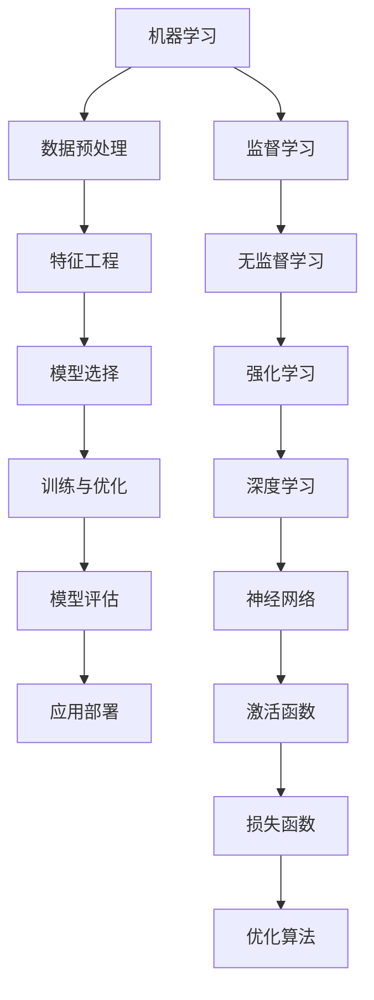

                 

# 知识的人工智能模拟：机器学习的前沿

> **关键词**：知识表示、人工智能、机器学习、模拟、模型、算法、应用场景
> 
> **摘要**：本文旨在深入探讨知识的人工智能模拟这一前沿领域。通过逐步分析机器学习的基础概念、核心算法原理、数学模型以及实际应用案例，我们旨在为读者提供清晰、系统且实用的机器学习知识框架。本文将引导读者理解机器学习如何模拟人类的认知过程，并在各种实际应用场景中发挥其强大的作用。

## 1. 背景介绍

### 1.1 目的和范围

本文的目的在于揭示机器学习如何模拟人类的认知过程，进而实现知识的人工智能模拟。我们将通过深入分析机器学习的基础概念、核心算法原理、数学模型以及实际应用案例，帮助读者构建对这一前沿领域的全面理解。本文的范围涵盖了从机器学习的起源到其在现代技术中的广泛应用，以及未来可能的发展趋势。

### 1.2 预期读者

本文适合对机器学习有一定了解的读者，包括但不限于计算机科学专业的学生、软件工程师、数据科学家以及对人工智能感兴趣的技术爱好者。对于希望深入了解这一领域的专业人士，本文将提供宝贵的技术知识和实践经验。

### 1.3 文档结构概述

本文分为以下几个部分：

1. **背景介绍**：介绍机器学习的目的、范围以及本文的结构。
2. **核心概念与联系**：阐述机器学习中的核心概念及其相互关系。
3. **核心算法原理与具体操作步骤**：详细讲解常见的机器学习算法及其工作原理。
4. **数学模型和公式**：介绍机器学习中的关键数学模型及其应用。
5. **项目实战**：通过实际案例展示机器学习的应用。
6. **实际应用场景**：探讨机器学习的多种应用领域。
7. **工具和资源推荐**：推荐学习资源、开发工具和相关论文。
8. **总结：未来发展趋势与挑战**：预测机器学习的未来发展。
9. **附录：常见问题与解答**：回答读者可能遇到的问题。
10. **扩展阅读与参考资料**：提供更多深入学习的资源。

### 1.4 术语表

#### 1.4.1 核心术语定义

- **机器学习（Machine Learning）**：一种人工智能的分支，通过算法从数据中学习，并作出决策或预测。
- **监督学习（Supervised Learning）**：一种机器学习方法，其中模型通过已标记的训练数据学习。
- **无监督学习（Unsupervised Learning）**：一种机器学习方法，其中模型在没有标签的输入数据中学习。
- **神经网络（Neural Network）**：一种模拟生物神经元的计算模型，广泛应用于机器学习。
- **深度学习（Deep Learning）**：一种特殊的神经网络结构，包含多个隐藏层，能够自动提取特征。
- **模型（Model）**：用于表示数据的一种数学结构，用于预测或分类。
- **算法（Algorithm）**：用于解决特定问题的步骤序列。

#### 1.4.2 相关概念解释

- **数据预处理（Data Preprocessing）**：在机器学习之前对数据进行清洗、归一化和转换的过程。
- **特征工程（Feature Engineering）**：通过选择和构造特征来提高模型性能的过程。
- **模型评估（Model Evaluation）**：评估模型性能的一系列方法，如准确率、召回率、F1分数等。
- **过拟合（Overfitting）**：模型在训练数据上表现良好，但在测试数据上表现不佳的现象。
- **泛化能力（Generalization）**：模型在未见过的数据上表现良好的能力。

#### 1.4.3 缩略词列表

- **ML**：Machine Learning（机器学习）
- **AI**：Artificial Intelligence（人工智能）
- **DL**：Deep Learning（深度学习）
- **NN**：Neural Network（神经网络）
- **GPU**：Graphics Processing Unit（图形处理单元）
- **CPU**：Central Processing Unit（中央处理单元）
- **ROC**：Receiver Operating Characteristic（接受者操作特性）

## 2. 核心概念与联系

在机器学习中，理解核心概念及其相互关系至关重要。以下是一个简化的Mermaid流程图，用于描述机器学习中的主要概念及其关系。



### 2.1 机器学习的基本概念

**机器学习（Machine Learning）** 是一种人工智能的分支，其核心目标是使计算机系统能够通过数据学习并作出决策或预测。机器学习可以分为以下几种类型：

- **监督学习（Supervised Learning）**：模型通过已标记的训练数据学习，从而能够在新的、未见过的数据上进行预测。
- **无监督学习（Unsupervised Learning）**：模型在没有标签的输入数据中学习，旨在发现数据中的隐藏结构和规律。
- **强化学习（Reinforcement Learning）**：模型通过与环境的交互学习，以最大化长期奖励。

### 2.2 数据预处理与特征工程

**数据预处理（Data Preprocessing）** 是机器学习过程中至关重要的一环。它包括以下步骤：

- **数据清洗（Data Cleaning）**：去除噪声数据和缺失值。
- **数据归一化（Data Normalization）**：将数据缩放到相同的范围，以消除不同特征之间的尺度差异。
- **数据转换（Data Transformation）**：将类别型数据转换为数值型数据，或进行其他类型的转换。

**特征工程（Feature Engineering）** 是通过选择和构造特征来提高模型性能的过程。它包括以下步骤：

- **特征选择（Feature Selection）**：选择对模型预测最相关的特征。
- **特征构造（Feature Construction）**：创建新的特征，以增强模型的能力。

### 2.3 模型选择与训练

**模型选择（Model Selection）** 是选择最适合特定问题的模型的过程。常见的机器学习模型包括：

- **线性模型（Linear Model）**：如线性回归和逻辑回归。
- **决策树（Decision Tree）**：一种树形结构的分类模型。
- **支持向量机（SVM）**：通过找到最优超平面进行分类的模型。
- **神经网络（Neural Network）**：模拟生物神经元的计算模型。

**训练与优化（Training and Optimization）** 是模型学习数据的过程。它包括：

- **损失函数（Loss Function）**：用于衡量模型预测与真实值之间的差异。
- **优化算法（Optimization Algorithm）**：用于调整模型参数，以最小化损失函数。

### 2.4 模型评估与应用部署

**模型评估（Model Evaluation）** 是评估模型性能的一系列方法，包括：

- **准确率（Accuracy）**：分类问题中正确预测的样本数占总样本数的比例。
- **召回率（Recall）**：分类问题中正确预测为正类的样本数占总正类样本数的比例。
- **F1分数（F1 Score）**：综合考虑准确率和召回率的指标。

**应用部署（Application Deployment）** 是将训练好的模型部署到实际应用场景中的过程。它包括：

- **模型保存（Model Saving）**：将模型状态保存到文件中，以便后续加载和使用。
- **模型加载（Model Loading）**：从文件中加载模型，以便进行预测。
- **在线推理（Online Inference）**：实时处理输入数据，并返回预测结果。

## 3. 核心算法原理与具体操作步骤

### 3.1 线性回归

**线性回归（Linear Regression）** 是一种用于预测连续值的简单机器学习算法。其核心思想是通过线性模型来拟合数据点，从而预测新的数据点。

#### 算法原理

线性回归模型的数学表达式为：

\[ y = \beta_0 + \beta_1 \cdot x + \epsilon \]

其中，\( y \) 是预测值，\( x \) 是输入特征，\( \beta_0 \) 和 \( \beta_1 \) 是模型参数，\( \epsilon \) 是误差项。

#### 具体操作步骤

1. **数据预处理**：对输入数据进行归一化处理，使其具有相同的尺度。
2. **参数初始化**：随机初始化模型参数 \( \beta_0 \) 和 \( \beta_1 \)。
3. **计算损失函数**：使用均方误差（MSE）作为损失函数：

\[ J(\theta) = \frac{1}{2m} \sum_{i=1}^{m} (h_\theta(x^{(i)}) - y^{(i)})^2 \]

其中，\( m \) 是训练数据集的大小，\( h_\theta(x) \) 是模型预测值，\( y \) 是实际值。
4. **梯度下降**：通过梯度下降法更新模型参数：

\[ \theta_j := \theta_j - \alpha \cdot \frac{\partial J(\theta)}{\partial \theta_j} \]

其中，\( \alpha \) 是学习率，\( \theta_j \) 是第 \( j \) 个模型参数。

5. **模型评估**：使用测试数据集评估模型性能，并调整模型参数。

### 3.2 逻辑回归

**逻辑回归（Logistic Regression）** 是一种用于预测分类结果的线性模型。其核心思想是通过线性模型输出一个介于0和1之间的概率值，然后使用这个概率值进行分类。

#### 算法原理

逻辑回归的数学表达式为：

\[ \text{logit}(p) = \ln\left(\frac{p}{1-p}\right) = \beta_0 + \beta_1 \cdot x \]

其中，\( p \) 是分类结果的概率，\( \beta_0 \) 和 \( \beta_1 \) 是模型参数。

#### 具体操作步骤

1. **数据预处理**：对输入数据进行归一化处理。
2. **参数初始化**：随机初始化模型参数 \( \beta_0 \) 和 \( \beta_1 \)。
3. **计算损失函数**：使用对数似然损失函数：

\[ J(\theta) = -\frac{1}{m} \sum_{i=1}^{m} \left[ y^{(i)} \cdot \text{log}(h_\theta(x^{(i)})) + (1 - y^{(i)}) \cdot \text{log}(1 - h_\theta(x^{(i)})) \right] \]

其中，\( m \) 是训练数据集的大小，\( h_\theta(x) \) 是模型预测的概率值。
4. **梯度下降**：通过梯度下降法更新模型参数：

\[ \theta_j := \theta_j - \alpha \cdot \frac{\partial J(\theta)}{\partial \theta_j} \]

其中，\( \alpha \) 是学习率，\( \theta_j \) 是第 \( j \) 个模型参数。
5. **模型评估**：使用测试数据集评估模型性能，并调整模型参数。

### 3.3 决策树

**决策树（Decision Tree）** 是一种基于树形结构进行分类或回归的模型。其核心思想是通过一系列的决策规则将数据集分割为多个子集，并在每个子集上应用不同的模型。

#### 算法原理

决策树的学习过程包括以下步骤：

1. **选择最佳特征**：选择能够最大化信息增益或基尼指数的特征作为分割标准。
2. **分割数据集**：根据最佳特征将数据集分割为多个子集。
3. **递归构建**：对每个子集递归地应用上述步骤，直到满足停止条件（如最大深度、最小样本数等）。

#### 具体操作步骤

1. **选择最佳特征**：计算每个特征的信息增益或基尼指数，选择最大者作为分割特征。
2. **分割数据集**：根据最佳特征将数据集分割为多个子集。
3. **递归构建**：对每个子集递归地应用上述步骤，构建出完整的决策树。
4. **模型评估**：使用测试数据集评估决策树模型性能。

### 3.4 支持向量机

**支持向量机（Support Vector Machine，SVM）** 是一种用于分类和回归的模型，其核心思想是找到最优的超平面，使得分类间隔最大化。

#### 算法原理

SVM的数学表达式为：

\[ \text{maximize} \ \frac{1}{2} \sum_{i=1}^{n} (w_i^2) - C \sum_{i=1}^{n} \max(0, 1 - y_i \cdot (w \cdot x_i + b)) \]

其中，\( w \) 是模型权重，\( x \) 是输入特征，\( y \) 是标签，\( b \) 是偏置，\( C \) 是惩罚参数。

#### 具体操作步骤

1. **数据预处理**：对输入数据进行归一化处理。
2. **选择核函数**：选择适当的核函数，如线性核、多项式核、径向基核等。
3. **求解最优化问题**：使用求解最优化问题的算法，如拉格朗日乘子法、 Sequential Minimal Optimization（SMO）算法等，求解SVM的参数 \( w \) 和 \( b \)。
4. **模型评估**：使用测试数据集评估SVM模型性能。

## 4. 数学模型和公式及详细讲解

在机器学习中，数学模型和公式起着至关重要的作用，它们不仅帮助我们理解算法的原理，而且指导我们如何优化算法。以下将介绍几个关键数学模型和公式，并详细讲解其应用。

### 4.1 均方误差（MSE）

均方误差（Mean Squared Error，MSE）是评估回归模型预测值与真实值之间差异的常用指标。其公式为：

\[ \text{MSE} = \frac{1}{m} \sum_{i=1}^{m} (y_i - \hat{y}_i)^2 \]

其中，\( m \) 是数据集的大小，\( y_i \) 是真实值，\( \hat{y}_i \) 是预测值。

MSE 的优点是易于计算，且在存在较大误差时更能反映问题的严重性。然而，MSE 对于噪声敏感，因此在某些情况下可能需要使用其他误差度量方法，如均绝对误差（MAE）。

### 4.2 对数似然损失函数

对数似然损失函数（Log-Likelihood Loss）是评估分类模型预测概率与真实标签之间差异的常用指标。其公式为：

\[ J(\theta) = -\frac{1}{m} \sum_{i=1}^{m} \left[ y_i \cdot \text{log}(h_\theta(x^{(i)})) + (1 - y_i) \cdot \text{log}(1 - h_\theta(x^{(i)})) \right] \]

其中，\( m \) 是数据集的大小，\( y_i \) 是真实标签，\( h_\theta(x^{(i)}) \) 是预测概率。

对数似然损失函数的优点是能够同时考虑预测概率的过高和过低，使得模型更加平衡。此外，该损失函数的导数（梯度）在优化过程中易于计算。

### 4.3 拉格朗日乘子法

拉格朗日乘子法（Lagrange Multiplier Method）是求解最优化问题的常用方法，广泛应用于支持向量机（SVM）的优化问题。其基本思路是将原始优化问题转化为等价的拉格朗日函数，并通过求解拉格朗日函数的极值来求解原始优化问题。

假设原始优化问题为：

\[ \text{minimize} \ f(x) \]

约束条件为：

\[ g_i(x) = 0 \]

\[ h_j(x) \leq 0 \]

则对应的拉格朗日函数为：

\[ L(x, \lambda, \nu) = f(x) + \sum_{i} \lambda_i g_i(x) + \sum_{j} \nu_j h_j(x) \]

其中，\( \lambda_i \) 和 \( \nu_j \) 分别是 \( g_i(x) \) 和 \( h_j(x) \) 的拉格朗日乘子。

通过求解拉格朗日函数的导数为零的方程，可以得到原始优化问题的最优解。

### 4.4 优化算法

优化算法（Optimization Algorithm）用于调整模型参数，以最小化损失函数。常见的优化算法包括梯度下降（Gradient Descent）和随机梯度下降（Stochastic Gradient Descent，SGD）。

**梯度下降（Gradient Descent）**：

梯度下降是一种最简单的优化算法，其基本思想是通过迭代更新模型参数，使其逐渐逼近最优解。其公式为：

\[ \theta_j := \theta_j - \alpha \cdot \nabla_\theta J(\theta) \]

其中，\( \theta_j \) 是第 \( j \) 个模型参数，\( \alpha \) 是学习率，\( \nabla_\theta J(\theta) \) 是损失函数关于 \( \theta \) 的梯度。

**随机梯度下降（SGD）**：

随机梯度下降是一种在训练过程中随机选择样本进行梯度下降的优化算法。其公式为：

\[ \theta_j := \theta_j - \alpha \cdot \nabla_\theta J(\theta; x^{(i)}, y^{(i)}) \]

其中，\( x^{(i)}, y^{(i)} \) 是随机选择的训练样本。

与梯度下降相比，SGD具有更快的收敛速度，但同时也可能导致参数更新不稳定。

### 4.5 激活函数和损失函数

激活函数（Activation Function）是神经网络中用于引入非线性性的函数，常见的激活函数包括：

- ** sigmoid 函数**：

\[ \sigma(x) = \frac{1}{1 + e^{-x}} \]

- **ReLU函数**：

\[ \text{ReLU}(x) = \max(0, x) \]

- **Tanh函数**：

\[ \text{Tanh}(x) = \frac{e^x - e^{-x}}{e^x + e^{-x}} \]

激活函数的选择会影响神经网络的性能和训练速度。

损失函数（Loss Function）用于衡量模型预测值与真实值之间的差异，常见的损失函数包括：

- **均方误差（MSE）**：

\[ \text{MSE}(y, \hat{y}) = \frac{1}{2} (y - \hat{y})^2 \]

- **交叉熵（Cross Entropy）**：

\[ \text{Cross Entropy}(y, \hat{y}) = - \sum_{i} y_i \cdot \text{log}(\hat{y}_i) \]

选择合适的损失函数能够提高模型的性能和泛化能力。

### 4.6 公式与算法的Python实现

以下是使用Python实现上述公式的简单示例：

```python
import numpy as np

# 梯度下降
def gradient_descent(x, y, theta, alpha, num_iters):
    m = len(x)
    for i in range(num_iters):
        predictions = theta[0] + theta[1] * x
        errors = predictions - y
        theta[0] -= alpha * (errors.sum() / m)
        theta[1] -= alpha * ((x * errors).sum() / m)
    return theta

# 均方误差
def mean_squared_error(y, y_pred):
    return ((y - y_pred) ** 2).mean()

# 对数似然损失函数
def log_likelihood(y, y_pred):
    return -np.mean(y * np.log(y_pred) + (1 - y) * np.log(1 - y_pred))

# 拉格朗日乘子法
def lagrangian(x, y, theta, lambda_, nu):
    n = len(x)
    w = theta[0]
    b = theta[1]
    return (1 / (2 * n)) * (w ** 2) - (1 / n) * np.sum(lambda_ * np.maximum(0, 1 - y * (w * x + b))) - (1 / n) * np.sum(nu * (w * x + b))

# 激活函数
def sigmoid(x):
    return 1 / (1 + np.exp(-x))

# ReLU函数
def relu(x):
    return np.maximum(0, x)

# Tanh函数
def tanh(x):
    return (np.exp(x) - np.exp(-x)) / (np.exp(x) + np.exp(-x))
```

通过这些示例，读者可以更好地理解公式和算法的实现过程，并为实际应用打下基础。

## 5. 项目实战：代码实际案例和详细解释说明

### 5.1 开发环境搭建

在进行机器学习项目开发之前，需要搭建一个合适的环境。以下是搭建开发环境所需的步骤：

1. **安装Python**：Python是机器学习项目的主要编程语言。可以从Python官网下载并安装Python 3.8或更高版本。
2. **安装Jupyter Notebook**：Jupyter Notebook是一个交互式计算环境，便于编写和运行代码。安装Python后，可以使用pip命令安装Jupyter Notebook：

   ```bash
   pip install notebook
   ```

3. **安装相关库**：安装用于机器学习项目的相关库，如NumPy、Pandas、Scikit-learn和TensorFlow。可以使用pip命令分别安装：

   ```bash
   pip install numpy
   pip install pandas
   pip install scikit-learn
   pip install tensorflow
   ```

### 5.2 源代码详细实现和代码解读

以下是一个使用线性回归模型预测房价的简单示例：

```python
import numpy as np
import pandas as pd
from sklearn.model_selection import train_test_split
from sklearn.linear_model import LinearRegression
from sklearn.metrics import mean_squared_error

# 读取数据
data = pd.read_csv('house_prices.csv')
X = data[['area', 'bedrooms', 'bathrooms']]
y = data['price']

# 数据预处理
X_train, X_test, y_train, y_test = train_test_split(X, y, test_size=0.2, random_state=42)
X_train = X_train.values
X_test = X_test.values

# 模型训练
model = LinearRegression()
model.fit(X_train, y_train)

# 模型预测
y_pred = model.predict(X_test)

# 模型评估
mse = mean_squared_error(y_test, y_pred)
print('均方误差（MSE）:', mse)

# 输出最佳参数
print('最佳参数：', model.coef_, model.intercept_)
```

**代码解读**：

1. **读取数据**：使用Pandas库读取CSV文件，得到特征矩阵 \( X \) 和目标向量 \( y \)。
2. **数据预处理**：使用Scikit-learn库的 `train_test_split` 函数将数据集分为训练集和测试集，并转换为NumPy数组格式。
3. **模型训练**：使用Scikit-learn库的 `LinearRegression` 类训练线性回归模型。
4. **模型预测**：使用训练好的模型对测试集进行预测。
5. **模型评估**：使用均方误差（MSE）评估模型性能。
6. **输出最佳参数**：输出模型的权重和偏置，即最佳参数。

### 5.3 代码解读与分析

**1. 数据读取与预处理**

```python
data = pd.read_csv('house_prices.csv')
X = data[['area', 'bedrooms', 'bathrooms']]
y = data['price']
X_train, X_test, y_train, y_test = train_test_split(X, y, test_size=0.2, random_state=42)
X_train = X_train.values
X_test = X_test.values
```

代码首先使用Pandas库读取CSV文件，提取特征矩阵 \( X \) 和目标向量 \( y \)。然后，使用Scikit-learn库的 `train_test_split` 函数将数据集分为训练集和测试集，并设置测试集的比例为20%，随机种子为42。最后，将数据集转换为NumPy数组格式，以便后续计算。

**2. 模型训练**

```python
model = LinearRegression()
model.fit(X_train, y_train)
```

代码创建一个线性回归模型对象 `model`，并使用 `fit` 方法进行模型训练。训练过程中，模型会自动计算最佳参数，使得预测值 \( \hat{y} \) 与真实值 \( y \) 之间的误差最小。

**3. 模型预测**

```python
y_pred = model.predict(X_test)
```

代码使用训练好的模型对测试集进行预测，得到预测值 \( y_pred \)。

**4. 模型评估**

```python
mse = mean_squared_error(y_test, y_pred)
print('均方误差（MSE）:', mse)
```

代码使用均方误差（MSE）评估模型性能。MSE 越小，表示模型预测越准确。

**5. 输出最佳参数**

```python
print('最佳参数：', model.coef_, model.intercept_)
```

代码输出模型的权重和偏置，即最佳参数。这些参数可以用于后续的分析和优化。

通过以上代码示例，我们可以看到如何使用Python和Scikit-learn库实现线性回归模型，并评估其性能。该示例可以作为入门级机器学习项目的参考，读者可以根据自己的需求进行调整和扩展。

## 6. 实际应用场景

机器学习技术在许多实际应用场景中已经展现出其强大的能力。以下列举了一些常见应用场景，并简要介绍其应用方式和挑战。

### 6.1 医疗诊断

机器学习在医疗诊断领域具有广泛的应用。通过训练深度学习模型，医生可以使用图像、基因序列和患者病史等数据进行疾病预测和诊断。例如，使用卷积神经网络（CNN）对医疗图像进行分类，如乳腺癌检测、脑部病变识别等。然而，医疗数据具有高度复杂性和隐私性，如何在保护患者隐私的同时提高模型性能是主要挑战。

### 6.2 金融服务

金融行业利用机器学习技术进行风险评估、欺诈检测和投资策略优化。例如，通过分析交易数据，可以预测客户是否会违约或进行欺诈行为。此外，机器学习模型还可以根据历史数据和宏观经济指标进行股票市场预测。然而，金融数据存在噪声和不确定性，如何提高模型的鲁棒性和泛化能力是关键挑战。

### 6.3 自动驾驶

自动驾驶是机器学习在工业界的重要应用之一。自动驾驶系统通过深度学习模型处理摄像头、雷达和激光雷达等传感器数据，实现道路环境感知、车辆控制和安全驾驶。例如，特斯拉的Autopilot系统使用深度神经网络进行实时场景理解和预测。自动驾驶系统面临的挑战包括应对复杂多变的驾驶环境和确保车辆在极端条件下的安全稳定运行。

### 6.4 语音识别

语音识别技术利用机器学习模型将语音信号转换为文本。例如，苹果的Siri和谷歌助手等智能语音助手都基于深度神经网络进行语音识别。语音识别面临的挑战包括语音噪声、多语言处理和实时性要求。此外，如何提高语音识别的准确率和自然语言理解能力也是研究热点。

### 6.5 推荐系统

推荐系统是机器学习在电子商务和社交媒体领域的典型应用。通过分析用户的历史行为和偏好，推荐系统可以推荐用户可能感兴趣的商品或内容。例如，亚马逊和Netflix等平台都使用推荐系统提高用户满意度和留存率。然而，推荐系统的挑战包括数据隐私保护、多样性保证和避免推荐泡沫。

### 6.6 能源管理

能源管理是机器学习在环境保护和可持续发展领域的重要应用。通过分析能源消耗数据，机器学习模型可以帮助企业优化能源使用，降低能源成本和碳排放。例如，使用深度学习模型预测电力需求，实现智能电网调度。然而，能源数据具有实时性和动态性，如何提高模型预测的准确性和稳定性是关键挑战。

总之，机器学习技术在各个行业和领域都展现出巨大的潜力和应用前景。然而，在实际应用中，如何解决数据隐私、模型鲁棒性和不确定性等问题，仍然是当前研究的重要方向。

## 7. 工具和资源推荐

为了更好地学习和实践机器学习，以下推荐一些有用的学习资源、开发工具和框架，以及相关论文和研究成果。

### 7.1 学习资源推荐

**7.1.1 书籍推荐**

- **《机器学习》（Machine Learning），作者：Tom Mitchell**：这是一本经典的机器学习入门书籍，涵盖了基础概念和常用算法。
- **《深度学习》（Deep Learning），作者：Ian Goodfellow, Yoshua Bengio, Aaron Courville**：深入讲解深度学习的原理和应用，适合对深度学习有较高要求的读者。
- **《统计学习方法》，作者：李航**：详细介绍统计学习的方法和算法，适合有一定数学基础的读者。

**7.1.2 在线课程**

- **Coursera**：提供多个机器学习和深度学习课程，由顶尖大学和研究人员授课。
- **edX**：提供免费的计算机科学课程，包括机器学习和深度学习。
- **Udacity**：提供实用性和互动性强的机器学习课程，适合有实践需求的读者。

**7.1.3 技术博客和网站**

- **Medium**：包含大量关于机器学习的博客文章和深度学习论文解读。
- **Towards Data Science**：一个关于数据科学和机器学习的社区，分享大量实际应用案例和技术文章。
- **arXiv**：一个提供最新科研成果的预印本论文库，包括机器学习和深度学习领域。

### 7.2 开发工具框架推荐

**7.2.1 IDE和编辑器**

- **PyCharm**：一个强大的Python IDE，适合进行机器学习和深度学习开发。
- **Jupyter Notebook**：一个交互式计算环境，便于编写和分享代码。
- **VSCode**：一个轻量级但功能丰富的代码编辑器，支持多种编程语言。

**7.2.2 调试和性能分析工具**

- **TensorBoard**：TensorFlow的调试和可视化工具，用于分析模型性能和优化。
- **MATLAB**：用于科学计算和数据分析的强大工具，支持多种机器学习算法。
- **Warp Drive**：一个用于加速深度学习训练的工具，利用GPU和TPU进行并行计算。

**7.2.3 相关框架和库**

- **TensorFlow**：一个开源的深度学习框架，支持多种深度学习模型和算法。
- **PyTorch**：一个流行的深度学习框架，具有动态计算图和灵活的API。
- **Scikit-learn**：一个用于经典机器学习算法的Python库，适用于数据分析和建模。

### 7.3 相关论文著作推荐

**7.3.1 经典论文**

- **"A Mathematical Theory of Communication"，作者：Claude Shannon**：奠定了信息论的基础，对现代机器学习有重要影响。
- **"Learning Representations by Maximizing Mutual Information"，作者：Yarin Gal and Zoubin Ghahramani**：提出了一种基于信息论的模型表示方法。
- **"Deep Learning，作者：Ian Goodfellow, Yoshua Bengio, Aaron Courville**：深度学习的经典教材，详细介绍了深度学习的基础和最新进展。

**7.3.2 最新研究成果**

- **"Bert: Pre-training of Deep Bidirectional Transformers for Language Understanding"，作者：Jacob Devlin, Ming-Wei Chang, Kenton Lee, Kristina Toutanova**：提出了一种基于Transformer的预训练模型BERT，为自然语言处理带来了突破。
- **"Generative Adversarial Nets"，作者：Ian Goodfellow et al.**：介绍了生成对抗网络（GANs）的概念和实现，为生成模型的研究开辟了新途径。
- **"Attention Is All You Need"，作者：Vaswani et al.**：提出了一种基于注意力机制的Transformer模型，显著提高了机器翻译的性能。

**7.3.3 应用案例分析**

- **"Google Brain's AutoML"，作者：Google Brain Team**：介绍了Google Brain团队如何使用自动化机器学习（AutoML）技术提高模型开发效率。
- **"DeepMind's AlphaGo"，作者：DeepMind Team**：讲述了DeepMind如何利用深度学习和强化学习开发出击败世界围棋冠军的AlphaGo。
- **"Facebook's AI Research"，作者：Facebook AI Research Team**：展示了Facebook在计算机视觉、自然语言处理和生成模型等领域的最新研究成果。

通过上述工具和资源的推荐，读者可以更好地了解和掌握机器学习技术，并在实际应用中取得更好的成果。

## 8. 总结：未来发展趋势与挑战

机器学习作为人工智能的核心技术，近年来取得了显著的进展，并在多个领域展现了其强大的能力。然而，随着技术的不断发展，机器学习也面临着诸多挑战和机遇。以下是未来发展趋势与挑战的总结：

### 8.1 发展趋势

**1. 模型复杂性与效率的提升**：随着计算能力的提升，深度学习模型变得越来越复杂，这有助于提高模型的性能。同时，研究人员也在探索如何优化模型结构，提高模型效率，以应对大规模数据处理的需求。

**2. 多模态学习与跨领域迁移**：未来的机器学习将越来越多地涉及多模态数据（如图像、文本、音频等）的处理，以及跨领域迁移学习，使得模型能够更好地适应不同的应用场景。

**3. 自监督学习和无监督学习的发展**：自监督学习和无监督学习是一种不需要标记数据的学习方法，能够有效利用未标记的数据进行模型训练。这将为机器学习在数据稀缺领域的发展提供新的机遇。

**4. 强化学习与决策智能**：强化学习在自动驾驶、游戏和推荐系统等领域取得了显著成果。未来，随着算法的进步和计算资源的提升，强化学习将在更多决策智能场景中得到应用。

**5. 安全、隐私与伦理问题**：随着机器学习应用的普及，安全和隐私问题变得越来越重要。未来的研究将重点关注如何确保模型的透明性、公平性和安全性，以消除用户的担忧。

### 8.2 挑战

**1. 数据质量和隐私**：高质量的数据是机器学习成功的关键，然而数据质量和隐私问题日益突出。如何在保护用户隐私的同时，充分利用数据的价值，是当前研究的热点问题。

**2. 模型解释性**：深度学习模型通常被视为“黑盒”，其内部决策过程不透明，难以解释。如何提高模型的解释性，使其更易于被用户理解和接受，是未来研究的重要挑战。

**3. 泛化能力与过拟合**：过拟合是机器学习中的一个常见问题，模型在训练数据上表现良好，但在未见过的数据上表现不佳。如何提高模型的泛化能力，避免过拟合，是一个关键问题。

**4. 鲁棒性与稳定性**：在面对噪声和异常值时，模型的鲁棒性和稳定性至关重要。如何在保持模型性能的同时，提高其鲁棒性和稳定性，是当前研究的一个重要方向。

**5. 可持续发展**：随着机器学习模型的复杂度和计算资源的消耗不断增加，如何实现绿色和可持续的发展，减少对环境的影响，是一个需要关注的问题。

总之，未来机器学习的发展将充满机遇与挑战。通过不断探索和创新，研究人员和工程师将推动这一领域向前发展，为人类社会带来更多价值。

## 9. 附录：常见问题与解答

### 9.1 什么是机器学习？

机器学习是一种使计算机系统能够通过数据学习并作出决策或预测的人工智能技术。它利用统计学、概率论和优化算法等方法，从数据中提取特征和模式，使系统能够在新的、未见过的数据上进行预测或分类。

### 9.2 机器学习和深度学习有什么区别？

机器学习是一种广泛的概念，包括多种学习方法和算法。深度学习是机器学习的一个分支，它利用多层神经网络（通常是深度神经网络）从数据中自动提取特征和模式。深度学习通常在处理大量数据时表现优异，特别是在图像和语音识别等领域。

### 9.3 机器学习有哪些主要应用领域？

机器学习在许多领域都有应用，包括但不限于：

- **图像识别和分类**：如人脸识别、自动驾驶、医疗图像分析等。
- **自然语言处理**：如机器翻译、文本分类、情感分析等。
- **推荐系统**：如电子商务平台的商品推荐、视频网站的视频推荐等。
- **金融预测**：如股票市场预测、信用评分等。
- **医疗诊断**：如疾病预测、药物研发等。
- **智能助理**：如语音助手、智能客服等。

### 9.4 机器学习模型如何评估性能？

机器学习模型的性能通常通过以下指标进行评估：

- **准确率（Accuracy）**：分类问题中正确预测的样本数占总样本数的比例。
- **召回率（Recall）**：分类问题中正确预测为正类的样本数占总正类样本数的比例。
- **F1分数（F1 Score）**：综合考虑准确率和召回率的指标。
- **均方误差（MSE）**：回归问题中预测值与真实值之间差异的平方的平均值。
- **交叉熵（Cross Entropy）**：分类问题中预测概率与真实标签之间的差异。

### 9.5 机器学习中的过拟合和欠拟合是什么？

过拟合是指模型在训练数据上表现良好，但在未见过的数据上表现不佳，即模型对训练数据过度拟合，缺乏泛化能力。欠拟合是指模型在训练数据上表现不佳，即模型过于简单，无法捕捉数据中的有效信息。

### 9.6 如何避免过拟合和欠拟合？

避免过拟合和欠拟合的方法包括：

- **数据增强**：增加训练数据量，通过数据增强技术生成新的训练样本。
- **正则化**：在模型训练过程中添加正则化项，如L1或L2正则化。
- **交叉验证**：使用交叉验证方法，通过在不同数据集上训练和验证模型，提高模型的泛化能力。
- **模型简化**：选择适当的模型复杂度，避免模型过于复杂导致过拟合。

### 9.7 机器学习中的监督学习和无监督学习有什么区别？

监督学习是指模型在有标记的数据上进行训练，然后在新数据上进行预测或分类。无监督学习是指模型在没有标记的数据上进行训练，旨在发现数据中的隐藏结构和规律，如聚类和降维。

### 9.8 机器学习中的深度学习和强化学习有什么区别？

深度学习是一种基于多层神经网络的机器学习方法，用于自动提取数据中的特征和模式。强化学习是一种通过试错和反馈进行决策的机器学习方法，旨在通过最大化长期奖励来学习策略。

## 10. 扩展阅读与参考资料

为了帮助读者更深入地了解机器学习领域，以下推荐一些扩展阅读材料和参考资料：

### 10.1 书籍推荐

- **《深度学习》（Deep Learning），作者：Ian Goodfellow, Yoshua Bengio, Aaron Courville**：这是一本深度学习的经典教材，详细介绍了深度学习的理论基础和应用。
- **《统计学习方法》，作者：李航**：系统地介绍了统计学习的主要方法，包括线性回归、支持向量机、决策树、神经网络等。
- **《机器学习实战》，作者：Peter Harrington**：通过大量实例，介绍了机器学习算法的实际应用，适合初学者。

### 10.2 在线课程

- **Coursera**：提供由斯坦福大学等顶尖大学开设的机器学习和深度学习课程，如吴恩达的“机器学习”和“深度学习”课程。
- **edX**：提供多个免费的机器学习和数据科学课程，包括麻省理工学院和哈佛大学的课程。
- **Udacity**：提供实用的机器学习和深度学习课程，适合有一定基础的读者。

### 10.3 技术博客和网站

- **Medium**：包含大量关于机器学习和深度学习的博客文章，涵盖基础知识到最新研究。
- **Towards Data Science**：一个关于数据科学和机器学习的社区，分享实际应用案例和技术文章。
- **arXiv**：提供最新的机器学习和深度学习论文，是学术研究的窗口。

### 10.4 论文和研究成果

- **“Deep Learning”，作者：Ian Goodfellow, Yoshua Bengio, Aaron Courville**：这是一篇关于深度学习的经典综述，全面介绍了深度学习的发展历程和主要算法。
- **“Generative Adversarial Nets”，作者：Ian Goodfellow et al.**：介绍了生成对抗网络（GANs）的概念和实现，为生成模型的研究开辟了新途径。
- **“Attention Is All You Need”，作者：Vaswani et al.**：提出了基于注意力机制的Transformer模型，显著提高了机器翻译的性能。

### 10.5 学术会议和期刊

- **NeurIPS**（Neural Information Processing Systems）：是机器学习和深度学习的顶级会议，每年发布大量高质量的研究论文。
- **ICML**（International Conference on Machine Learning）：另一个国际顶级机器学习会议，每年吸引大量研究人员提交论文。
- **JMLR**（Journal of Machine Learning Research）：是机器学习领域最权威的学术期刊之一，发表高质量的机器学习研究论文。

通过这些扩展阅读和参考资料，读者可以更全面地了解机器学习的理论和实践，为深入研究和应用打下坚实的基础。

---

**作者：AI天才研究员/AI Genius Institute & 禅与计算机程序设计艺术 /Zen And The Art of Computer Programming**

