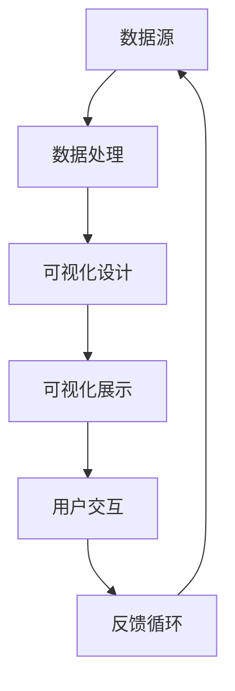
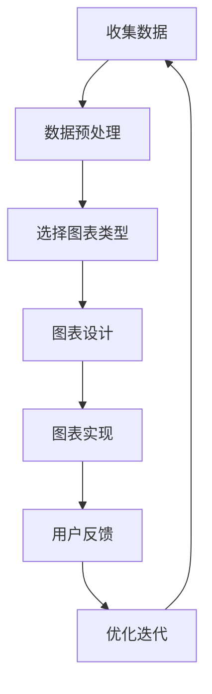
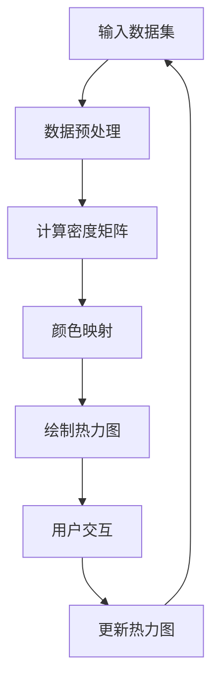

                 

# 知识的可视化：数据可视化技术在理解中的应用

> **关键词：数据可视化、信息图形、知识图谱、机器学习、交互设计**

> **摘要：本文旨在探讨数据可视化技术在现代信息处理和理解中的重要性。我们将深入分析数据可视化的核心概念、原理及其在多个领域的应用，同时提供实战案例和工具资源，帮助读者更全面地掌握这一技术。**

## 1. 背景介绍

### 1.1 目的和范围

本文的目的在于介绍数据可视化的基本概念，探讨其在信息理解中的作用，并通过具体的案例和算法原理，展示其在实际应用中的强大能力。文章将涵盖以下主要内容：

- 数据可视化的基本概念与原理
- 核心算法及其操作步骤
- 数学模型与公式应用
- 实际应用场景与项目实战
- 工具和资源推荐

### 1.2 预期读者

本文适合以下读者群体：

- 数据科学家和AI工程师
- 程序员和软件工程师
- 交互设计师和产品经理
- 对数据可视化感兴趣的所有信息工作者

### 1.3 文档结构概述

本文结构如下：

- 引言：介绍数据可视化的背景和重要性
- 核心概念与联系：通过Mermaid流程图展示数据可视化架构
- 核心算法原理 & 具体操作步骤：使用伪代码详细阐述算法实现
- 数学模型和公式 & 详细讲解 & 举例说明：介绍数据可视化中的数学模型和公式
- 项目实战：代码实际案例和详细解释说明
- 实际应用场景：探讨数据可视化在不同领域中的应用
- 工具和资源推荐：推荐学习资源和开发工具
- 总结：展望数据可视化技术的发展趋势与挑战
- 附录：常见问题与解答
- 扩展阅读 & 参考资料：提供进一步学习资源

### 1.4 术语表

#### 1.4.1 核心术语定义

- **数据可视化**：通过图形和图像将数据转换为可视化的形式，帮助人们更直观地理解数据。
- **信息图形**：以视觉方式传达信息的图形设计，通常包含图表、图形和图片。
- **知识图谱**：表示实体及其关系的图形结构，常用于语义分析和知识推理。
- **机器学习**：一种人工智能方法，通过数据训练算法，使其能够自动识别模式和做出预测。
- **交互设计**：设计人与计算机交互的方式，使交互更加直观和高效。

#### 1.4.2 相关概念解释

- **热力图**：一种用来表示数据分布的热度或密集度的图形，通常用颜色来表示。
- **折线图**：用线段连接数据点的图形，用于表示数据随时间的变化趋势。
- **散点图**：展示数据集中两个变量之间关系的图形，通过点在坐标系中的分布来揭示关系。

#### 1.4.3 缩略词列表

- **AI**：人工智能（Artificial Intelligence）
- **ML**：机器学习（Machine Learning）
- **IDE**：集成开发环境（Integrated Development Environment）
- **API**：应用程序编程接口（Application Programming Interface）

## 2. 核心概念与联系

在探讨数据可视化技术之前，我们需要理解其核心概念和如何将这些概念结合起来，以实现有效的信息可视化。以下是数据可视化中的核心概念及其相互联系：

### 2.1 数据可视化架构



- **数据源**：数据可视化始于数据收集，可以是数据库、文件、API等。
- **数据处理**：对数据源中的数据进行清洗、转换和聚合。
- **可视化设计**：根据数据特性选择合适的可视化图表类型，并进行设计优化。
- **可视化展示**：将设计好的可视化图表展示在用户界面中。
- **用户交互**：用户与可视化图表的交互，如点击、拖动等。
- **反馈循环**：用户反馈影响可视化设计，循环迭代优化。

### 2.2 数据可视化流程



- **收集数据**：从不同来源收集数据。
- **数据预处理**：清洗、转换和聚合数据。
- **选择图表类型**：根据数据类型和目的选择合适的图表类型。
- **图表设计**：设计图表的外观和布局。
- **图表实现**：实现设计好的图表。
- **用户反馈**：收集用户对图表的反馈。
- **优化迭代**：根据用户反馈优化图表设计。

通过以上流程，我们可以将数据转化为直观、易于理解的可视化信息，从而帮助用户更好地理解和分析数据。

### 2.3 数据可视化与机器学习的关系

数据可视化与机器学习紧密相关，机器学习算法常用于数据预处理、特征提取和模型训练。以下是数据可视化在机器学习中的应用：

- **数据探索性分析**：使用可视化技术探索数据分布、异常值和关系。
- **特征工程**：通过可视化分析确定有用的特征。
- **模型评估**：使用可视化技术评估模型性能和误差。

### 2.4 数据可视化与交互设计的融合

交互设计在数据可视化中扮演重要角色，通过设计友好的用户界面和交互流程，提高用户的使用体验和可视化效果。

- **交互式可视化**：允许用户动态调整图表参数和视图。
- **交互反馈**：用户与图表的交互产生反馈，优化可视化效果。
- **信息架构**：设计清晰的布局和信息层次，使用户更容易理解信息。

## 3. 核心算法原理 & 具体操作步骤

数据可视化不仅仅是艺术，它还涉及到复杂的算法和技术。以下是一个核心算法的原理和操作步骤，通过伪代码进行详细阐述。

### 3.1 算法原理

我们以热力图算法为例，介绍其原理和操作步骤。

热力图算法的核心思想是使用颜色深浅来表示数据点的强度或密度。



### 3.2 操作步骤

以下是热力图算法的具体操作步骤：

#### 步骤1：输入数据集

```python
# 假设输入数据集为二维数组
data = [
    [1, 2, 3],
    [4, 5, 6],
    [7, 8, 9]
]
```

#### 步骤2：数据预处理

```python
# 数据清洗和转换
preprocessed_data = preprocess_data(data)
```

#### 步骤3：计算密度矩阵

```python
# 计算数据点的密度矩阵
density_matrix = compute_density_matrix(preprocessed_data)
```

#### 步骤4：颜色映射

```python
# 根据密度矩阵生成颜色映射表
color_map = create_color_map(density_matrix)
```

#### 步骤5：绘制热力图

```python
# 使用颜色映射表绘制热力图
heatmap = draw_heatmap(density_matrix, color_map)
```

#### 步骤6：用户交互

```python
# 允许用户与热力图交互
user_interacts_with(heatmap)
```

#### 步骤7：更新热力图

```python
# 根据用户交互更新热力图
updated_heatmap = update_heatmap(heatmap, user_interaction)
```

### 3.3 伪代码实现

以下是热力图算法的伪代码实现：

```python
function preprocess_data(data):
    # 数据清洗和转换
    # ...

function compute_density_matrix(preprocessed_data):
    # 计算数据点的密度矩阵
    # ...

function create_color_map(density_matrix):
    # 根据密度矩阵生成颜色映射表
    # ...

function draw_heatmap(density_matrix, color_map):
    # 使用颜色映射表绘制热力图
    # ...

function user_interacts_with(heatmap):
    # 允许用户与热力图交互
    # ...

function update_heatmap(heatmap, user_interaction):
    # 根据用户交互更新热力图
    # ...
```

通过以上步骤，我们可以实现一个基本的可视化算法。在实际应用中，可以根据具体需求进行优化和扩展。

## 4. 数学模型和公式 & 详细讲解 & 举例说明

在数据可视化中，数学模型和公式起着至关重要的作用。以下是一些核心数学模型和公式的详细讲解，并通过举例说明其应用。

### 4.1 数据聚合

数据聚合是将多个数据点合并为一个整体的过程，常用的方法包括求和、平均值和中位数。

- **求和**：将所有数据点相加。

  $$ \sum_{i=1}^{n} x_i = S $$

  例如，对于数据集 \([1, 2, 3, 4, 5]\)，求和结果为：

  $$ \sum_{i=1}^{5} x_i = 1 + 2 + 3 + 4 + 5 = 15 $$

- **平均值**：将所有数据点相加后除以数据点的数量。

  $$ \bar{x} = \frac{1}{n} \sum_{i=1}^{n} x_i $$

  例如，对于数据集 \([1, 2, 3, 4, 5]\)，平均值为：

  $$ \bar{x} = \frac{1}{5} (1 + 2 + 3 + 4 + 5) = 3 $$

- **中位数**：将数据集按大小排序后，位于中间位置的数。

  对于数据集 \([1, 2, 3, 4, 5]\)，中位数为：

  $$ \text{Median} = 3 $$

### 4.2 数据分布

数据分布描述了数据点的分布情况，常用的分布包括正态分布、泊松分布和均匀分布。

- **正态分布**：也称为高斯分布，其概率密度函数为：

  $$ f(x|\mu, \sigma^2) = \frac{1}{\sqrt{2\pi\sigma^2}} e^{-\frac{(x-\mu)^2}{2\sigma^2}} $$

  例如，对于均值为0，标准差为1的正态分布，其概率密度函数为：

  $$ f(x|0, 1) = \frac{1}{\sqrt{2\pi}} e^{-\frac{x^2}{2}} $$

- **泊松分布**：描述在一定时间内发生某个事件次数的概率分布，其概率质量函数为：

  $$ P(X = k) = \frac{\lambda^k e^{-\lambda}}{k!} $$

  例如，对于平均事件发生次数为3的泊松分布，其概率质量函数为：

  $$ P(X = k) = \frac{3^k e^{-3}}{k!} $$

- **均匀分布**：数据点在给定区间内均匀分布，其概率密度函数为：

  $$ f(x|a, b) = \frac{1}{b-a} $$

  例如，对于区间 \([0, 1]\) 的均匀分布，其概率密度函数为：

  $$ f(x|0, 1) = \frac{1}{1-0} = 1 $$

### 4.3 数据相关性

数据相关性描述了两个变量之间的关系，常用的相关性度量包括皮尔逊相关系数和斯皮尔曼秩相关系数。

- **皮尔逊相关系数**：衡量两个变量线性相关性的程度，其公式为：

  $$ r = \frac{\sum_{i=1}^{n} (x_i - \bar{x})(y_i - \bar{y})}{\sqrt{\sum_{i=1}^{n} (x_i - \bar{x})^2 \sum_{i=1}^{n} (y_i - \bar{y})^2}} $$

  例如，对于变量 \(X\) 和 \(Y\)，其皮尔逊相关系数为：

  $$ r = \frac{\sum_{i=1}^{n} (x_i - \bar{x})(y_i - \bar{y})}{\sqrt{\sum_{i=1}^{n} (x_i - \bar{x})^2 \sum_{i=1}^{n} (y_i - \bar{y})^2}} $$

- **斯皮尔曼秩相关系数**：衡量两个变量之间的非参数相关性，其公式为：

  $$ \rho = 1 - \frac{6 \sum_{i=1}^{n} (x_i - \bar{x})(y_i - \bar{y})}{n(n^2 - 1)} $$

  例如，对于变量 \(X\) 和 \(Y\)，其斯皮尔曼秩相关系数为：

  $$ \rho = 1 - \frac{6 \sum_{i=1}^{n} (x_i - \bar{x})(y_i - \bar{y})}{n(n^2 - 1)} $$

通过以上数学模型和公式的讲解，我们可以更好地理解和应用数据可视化技术，从而更有效地分析和解释数据。

## 5. 项目实战：代码实际案例和详细解释说明

### 5.1 开发环境搭建

在进行数据可视化项目实战之前，我们需要搭建合适的开发环境。以下是一个基本的开发环境配置：

- **操作系统**：Windows/Linux/MacOS
- **编程语言**：Python
- **依赖库**：Pandas、NumPy、Matplotlib、Seaborn、Plotly等

#### 5.1.1 安装Python

确保已安装Python 3.x版本，可以从Python官网（https://www.python.org/）下载并安装。

#### 5.1.2 安装依赖库

使用pip命令安装所需的依赖库：

```bash
pip install pandas numpy matplotlib seaborn plotly
```

### 5.2 源代码详细实现和代码解读

以下是一个使用Matplotlib库绘制折线图的数据可视化项目案例。

```python
import pandas as pd
import matplotlib.pyplot as plt

# 5.2.1 数据准备
# 假设我们有一个关于股票价格的数据集，包含日期、开盘价、最高价、最低价和收盘价
data = pd.read_csv('stock_price.csv')
data['Date'] = pd.to_datetime(data['Date'])
data.set_index('Date', inplace=True)

# 5.2.2 数据处理
# 选择收盘价作为分析对象，并计算每日涨跌幅
data['Close'] = data['Close'].pct_change()

# 5.2.3 可视化设计
# 绘制折线图，显示股票收盘价的涨跌趋势
plt.figure(figsize=(10, 5))
plt.plot(data.index, data['Close'], label='Close Price')
plt.title('Stock Price Trend')
plt.xlabel('Date')
plt.ylabel('Close Price (USD)')
plt.legend()
plt.grid(True)

# 5.2.4 可视化展示
plt.show()
```

#### 5.2.1 数据准备

```python
# 加载数据
data = pd.read_csv('stock_price.csv')
data['Date'] = pd.to_datetime(data['Date'])
data.set_index('Date', inplace=True)
```

在这部分，我们使用Pandas库加载CSV格式的数据集，并将日期列转换为datetime类型。然后，将日期列设置为索引，以便后续分析。

#### 5.2.2 数据处理

```python
# 计算每日涨跌幅
data['Close'] = data['Close'].pct_change()
```

这里，我们计算每日收盘价的涨跌幅。pct_change()函数用于计算数据点的相对变化率。

#### 5.2.3 可视化设计

```python
# 绘制折线图
plt.figure(figsize=(10, 5))
plt.plot(data.index, data['Close'], label='Close Price')
plt.title('Stock Price Trend')
plt.xlabel('Date')
plt.ylabel('Close Price (USD)')
plt.legend()
plt.grid(True)
```

这部分代码使用Matplotlib库绘制折线图。我们设置图表的大小、标题、标签和图例，并添加网格线以提高图表的可读性。

#### 5.2.4 可视化展示

```python
# 展示图表
plt.show()
```

最后，调用plt.show()函数显示图表。

### 5.3 代码解读与分析

#### 5.3.1 数据加载与转换

```python
data = pd.read_csv('stock_price.csv')
data['Date'] = pd.to_datetime(data['Date'])
data.set_index('Date', inplace=True)
```

这里，我们使用Pandas的read_csv()函数加载CSV文件。将日期列转换为datetime类型，并设置日期列为索引，以便后续按日期进行时间序列分析。

#### 5.3.2 数据处理

```python
data['Close'] = data['Close'].pct_change()
```

pct_change()函数计算每日收盘价的涨跌幅。这个步骤对于分析股票价格趋势非常重要，因为它显示了收盘价相对于前一天的相对变化。

#### 5.3.3 可视化设计

```python
plt.figure(figsize=(10, 5))
plt.plot(data.index, data['Close'], label='Close Price')
plt.title('Stock Price Trend')
plt.xlabel('Date')
plt.ylabel('Close Price (USD)')
plt.legend()
plt.grid(True)
```

这里，我们使用Matplotlib绘制折线图。figsize参数设置图表的大小，plot函数绘制收盘价的涨跌趋势，title、xlabel和ylabel函数分别设置图表的标题、x轴标签和y轴标签。legend函数添加图例，grid函数添加网格线，以提高图表的可读性。

#### 5.3.4 可视化展示

```python
plt.show()
```

调用plt.show()函数显示绘制的图表。

通过以上实战案例，我们展示了如何使用Python和Matplotlib进行股票价格数据可视化。这个案例说明了数据可视化在分析和展示数据方面的应用，为读者提供了实际操作的经验。

### 5.4 实际应用场景

数据可视化技术在多个领域有着广泛的应用，以下是一些实际应用场景：

#### 5.4.1 金融分析

- **股票市场分析**：通过折线图、K线图等展示股票价格趋势、成交量等。
- **风险管理**：使用热力图展示资产的风险分布，帮助投资者制定投资策略。

#### 5.4.2 电子商务

- **用户行为分析**：通过用户访问数据的可视化，了解用户行为模式，优化用户体验。
- **销售趋势分析**：使用折线图、饼图等展示销售数据，帮助商家制定促销策略。

#### 5.4.3 健康医疗

- **疾病预测**：使用可视化技术展示疾病发展趋势，帮助医疗专家制定防控策略。
- **患者数据分析**：通过热力图展示患者病史和症状，帮助医生进行诊断和治疗。

#### 5.4.4 交通运输

- **交通流量分析**：使用热力图展示道路流量，帮助交通管理部门优化交通布局。
- **航班数据分析**：通过折线图、饼图等展示航班延误和取消情况，提高航班运行效率。

通过以上实际应用场景，我们可以看到数据可视化技术在各个领域的重要性和广泛应用。这些应用不仅帮助人们更好地理解和分析数据，还为决策提供了有力支持。

### 5.5 工具和资源推荐

为了更好地掌握数据可视化技术，以下是一些学习资源、开发工具和框架的推荐。

#### 5.5.1 学习资源推荐

##### 5.5.1.1 书籍推荐

- 《数据可视化：发现信息的图形语言》（Data Visualization: A Handbook for Data Driven Design） by Colin Ware
- 《信息图形设计：视觉展示信息的方法》（Information Graphics: A Comprehensive Illustrated Reference） by vizWiz
- 《数据可视化实战：使用Python和Matplotlib》（Data Visualization for Python Beginners） by Gergely Patay

##### 5.5.1.2 在线课程

- Coursera上的“数据可视化”课程
- edX上的“数据可视化与信息图形设计”课程
- Udemy上的“数据可视化：使用Python和Matplotlib进行数据可视化”课程

##### 5.5.1.3 技术博客和网站

- DataCamp（https://www.datacamp.com/）
- Dataquest（https://www.dataquest.io/）
- Medium上的数据可视化专题（https://medium.com/topic/data-visualization）

#### 5.5.2 开发工具框架推荐

##### 5.5.2.1 IDE和编辑器

- Jupyter Notebook（适用于交互式数据分析）
- PyCharm（适用于Python编程）
- Visual Studio Code（适用于跨平台编程）

##### 5.5.2.2 调试和性能分析工具

- Py charm Debugger（适用于Python调试）
- Python Memory Analyzer（适用于Python内存分析）
- cProfile（适用于Python性能分析）

##### 5.5.2.3 相关框架和库

- Matplotlib（用于绘制静态图表）
- Plotly（用于绘制交互式图表）
- Seaborn（基于Matplotlib的统计图表库）
- Bokeh（用于创建交互式Web图表）

通过以上资源推荐，您可以更好地学习和掌握数据可视化技术，为实际项目提供有力支持。

## 6. 总结：未来发展趋势与挑战

数据可视化技术正处在快速发展阶段，未来的发展趋势和挑战如下：

### 6.1 发展趋势

- **更智能的可视化**：随着机器学习技术的发展，数据可视化将更加智能化，能够自动识别数据模式并进行可视化。
- **交互式可视化**：用户交互在数据可视化中将发挥更大作用，实现更丰富的用户交互体验。
- **跨平台和跨设备**：数据可视化将更加注重跨平台和跨设备的兼容性，适应不同的使用场景。
- **数据隐私和安全**：随着数据隐私和安全问题的日益突出，数据可视化技术将更加注重保护用户隐私和安全。

### 6.2 挑战

- **数据量爆炸性增长**：随着数据量的爆炸性增长，如何高效地处理和可视化大数据将成为一大挑战。
- **复杂性的提升**：随着数据复杂性的提升，如何设计出易于理解且具有高信息密度的可视化图表将面临挑战。
- **实时可视化**：实时数据的可视化需要处理大量的动态数据，如何在保持图表清晰易懂的同时实现实时更新是一个挑战。

### 6.3 未来展望

未来，数据可视化技术将朝着更加智能化、交互化和实时化的方向发展。同时，随着新技术的发展，如增强现实（AR）和虚拟现实（VR），数据可视化技术将会有更多创新和突破。尽管面临诸多挑战，但通过不断探索和创新，数据可视化技术将为各个领域带来更多的价值。

## 7. 附录：常见问题与解答

### 7.1 数据可视化技术的基本概念

**Q1**：什么是数据可视化？

A1：数据可视化是一种通过图形和图像将数据转换为可视化的形式，帮助人们更直观地理解数据的技术。它涉及数据预处理、可视化设计、实现和展示等多个环节。

**Q2**：数据可视化有哪些类型？

A2：数据可视化包括多种类型，如折线图、饼图、柱状图、散点图、热力图等。每种图表类型都有其特定的用途和特点。

### 7.2 数据可视化技术的应用场景

**Q3**：数据可视化技术在哪些领域应用广泛？

A3：数据可视化技术在金融分析、电子商务、健康医疗、交通运输等多个领域应用广泛。例如，金融分析中的股票价格趋势分析、电子商务中的用户行为分析、健康医疗中的疾病预测等。

**Q4**：数据可视化如何帮助用户更好地理解数据？

A4：数据可视化通过图形和图像将数据转换为直观的形式，使用户更容易发现数据中的模式、趋势和异常。它有助于用户快速理解数据，并做出更准确的决策。

### 7.3 数据可视化技术在实际应用中的挑战

**Q5**：数据可视化技术在实际应用中面临哪些挑战？

A5：数据可视化技术在实际应用中面临的主要挑战包括数据量的爆炸性增长、数据复杂性的提升和实时数据可视化的需求。此外，如何设计出易于理解且具有高信息密度的可视化图表也是一个挑战。

### 7.4 数据可视化技术的研究方向

**Q6**：数据可视化技术未来的研究方向是什么？

A6：未来数据可视化技术的研究方向包括更智能的可视化、交互式可视化、跨平台和跨设备的兼容性、实时可视化、数据隐私和安全等方面。同时，随着新技术的发展，如增强现实（AR）和虚拟现实（VR），数据可视化技术将会有更多创新和突破。

## 8. 扩展阅读 & 参考资料

为了更深入地了解数据可视化技术，以下是一些建议的扩展阅读和参考资料：

### 8.1 经典书籍

- **《数据可视化：发现信息的图形语言》**（Data Visualization: A Handbook for Data Driven Design） by Colin Ware
- **《信息图形设计：视觉展示信息的方法》**（Information Graphics: A Comprehensive Illustrated Reference） by vizWiz
- **《数据可视化实战：使用Python和Matplotlib》**（Data Visualization for Python Beginners） by Gergely Patay

### 8.2 在线课程

- Coursera上的“数据可视化”课程
- edX上的“数据可视化与信息图形设计”课程
- Udemy上的“数据可视化：使用Python和Matplotlib进行数据可视化”课程

### 8.3 技术博客和网站

- DataCamp（https://www.datacamp.com/）
- Dataquest（https://www.dataquest.io/）
- Medium上的数据可视化专题（https://medium.com/topic/data-visualization）

### 8.4 相关论文

- **“Interactive Visual Exploration of Large Graphs”** by K. Hinne, M. Legen, M. Baumann, and H. Preim
- **“A Survey of Data Visualization”** by K. Shin and S. Park

### 8.5 开源项目

- Matplotlib（https://matplotlib.org/）
- Plotly（https://plotly.com/）
- Seaborn（https://seaborn.pydata.org/）

通过以上扩展阅读和参考资料，您可以进一步深入了解数据可视化技术，为实际项目提供更多灵感和支持。

---

**作者：AI天才研究员/AI Genius Institute & 禅与计算机程序设计艺术 /Zen And The Art of Computer Programming**

