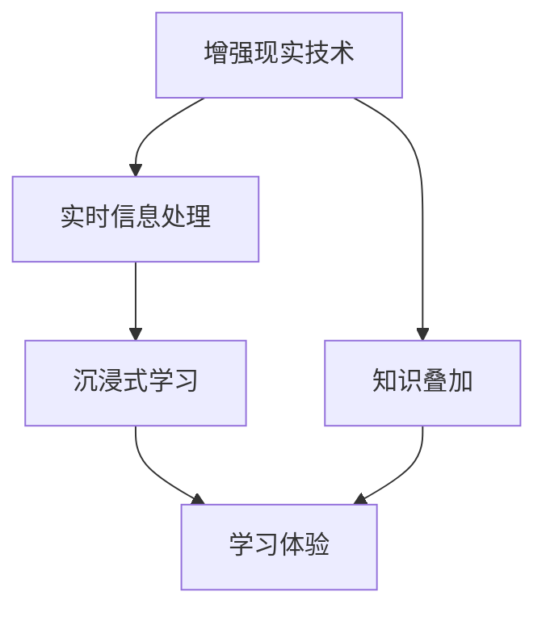
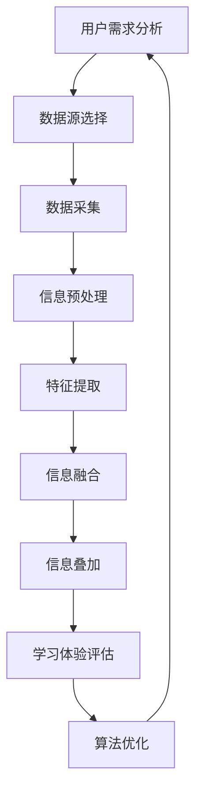

                 


### 知识的增强现实应用：实时信息叠加的学习体验

> **关键词：** 增强现实，知识叠加，实时信息，学习体验，人工智能

> **摘要：** 本文将探讨如何通过增强现实技术实现知识的实时叠加，为用户提供沉浸式的学习体验。文章首先介绍增强现实的基本概念及其在教育和学习中的应用，然后深入探讨实时信息叠加的核心原理和技术，最后通过实际案例展示该技术在教育领域的应用潜力。

### 1. 背景介绍

#### 1.1 目的和范围

本文旨在探讨增强现实技术在教育领域的应用，尤其是如何通过实时信息叠加为学习者提供更为丰富、互动和个性化的学习体验。随着人工智能技术的不断发展，增强现实已成为一种极具潜力的交互方式，可以突破传统教育模式的局限性，实现知识的实时传递和个性化学习。

#### 1.2 预期读者

本文主要面向教育技术领域的研究者、教育从业者以及有兴趣了解增强现实应用的开发者。读者需具备一定的计算机科学基础，对人工智能和增强现实技术有一定的了解。

#### 1.3 文档结构概述

本文分为八个主要部分：背景介绍、核心概念与联系、核心算法原理与具体操作步骤、数学模型和公式、项目实战、实际应用场景、工具和资源推荐以及总结与未来发展趋势。每个部分都将逐步深入，以帮助读者全面了解实时信息叠加的学习体验。

#### 1.4 术语表

在本文中，我们将使用以下术语：
- **增强现实（AR）**：一种实时计算增强的技术，通过将虚拟信息叠加到现实世界中，为用户提供一种全新的交互方式。
- **实时信息叠加**：指在增强现实场景中，将实时获取的信息叠加到真实环境中，以提供更丰富的学习内容。
- **沉浸式学习**：一种学习方式，通过提供高度逼真的学习环境，使学习者能够全身心地投入学习过程。

#### 1.4.1 核心术语定义

- **增强现实（AR）**：增强现实技术通过在现实世界中叠加虚拟信息，为用户提供一种全新的交互体验。与虚拟现实（VR）不同，增强现实并不完全替代现实世界，而是在现实世界中添加虚拟元素，从而实现更自然的交互。
- **实时信息叠加**：指在增强现实场景中，实时获取并叠加外部信息，以丰富学习者的学习内容。这些信息可以是文本、图片、视频等多种形式，可以根据学习者的需求进行个性化定制。
- **沉浸式学习**：一种学习方式，通过提供高度逼真的学习环境，使学习者能够全身心地投入学习过程。沉浸式学习通常利用虚拟现实技术、增强现实技术和多媒体技术等手段，为学习者创造一个身临其境的学习体验。

#### 1.4.2 相关概念解释

- **增强现实（AR）**：增强现实技术通过在现实世界中叠加虚拟信息，为用户提供一种全新的交互体验。与虚拟现实（VR）不同，增强现实并不完全替代现实世界，而是在现实世界中添加虚拟元素，从而实现更自然的交互。
- **实时信息叠加**：指在增强现实场景中，实时获取并叠加外部信息，以丰富学习者的学习内容。这些信息可以是文本、图片、视频等多种形式，可以根据学习者的需求进行个性化定制。
- **沉浸式学习**：一种学习方式，通过提供高度逼真的学习环境，使学习者能够全身心地投入学习过程。沉浸式学习通常利用虚拟现实技术、增强现实技术和多媒体技术等手段，为学习者创造一个身临其境的学习体验。

#### 1.4.3 缩略词列表

- **AR**：增强现实（Augmented Reality）
- **VR**：虚拟现实（Virtual Reality）
- **AI**：人工智能（Artificial Intelligence）
- **IoT**：物联网（Internet of Things）
- **GIS**：地理信息系统（Geographic Information System）

## 2. 核心概念与联系

在深入了解实时信息叠加的学习体验之前，我们首先需要理解一些核心概念，包括增强现实技术、实时信息处理和沉浸式学习等。

### 2.1 增强现实技术

增强现实（AR）是一种通过计算机技术将虚拟信息与现实世界融合的技术。它利用摄像头捕捉现实世界的图像，然后通过软件将这些图像与虚拟信息叠加，形成一个新的融合场景。这种融合场景可以实时显示在用户的视野中，为用户提供了一种全新的交互体验。

### 2.2 实时信息处理

实时信息处理是指系统在获取数据后，能够在极短的时间内对数据进行处理和分析，并将结果实时地呈现给用户。在增强现实应用中，实时信息处理非常重要，因为它决定了信息叠加的准确性和实时性。

### 2.3 沉浸式学习

沉浸式学习是一种通过提供高度逼真的学习环境，使学习者能够全身心地投入学习过程的方式。在增强现实技术中，沉浸式学习可以通过虚拟现实（VR）和增强现实（AR）技术实现。通过虚拟现实技术，学习者可以完全沉浸在虚拟世界中；而通过增强现实技术，学习者可以在现实世界中看到虚拟信息，从而实现与现实世界的互动。

### 2.4 核心概念与联系

为了更好地理解实时信息叠加的学习体验，我们可以使用以下 Mermaid 流程图来展示这些核心概念之间的联系。



在上述流程图中，增强现实技术、实时信息处理和沉浸式学习构成了实时信息叠加的学习体验的基础。知识叠加则是在这个基础之上，通过对实时信息的处理和分析，为学习者提供更加丰富和个性化的学习内容。

### 2.5 增强现实技术的原理

增强现实技术的核心原理是通过摄像头捕捉现实世界的图像，然后将这些图像与虚拟信息进行叠加。具体来说，增强现实技术包括以下三个主要步骤：

1. **图像捕捉**：使用摄像头或传感器捕捉现实世界的图像。
2. **图像识别**：利用计算机视觉算法对捕获的图像进行分析，以识别和定位现实世界中的物体和场景。
3. **信息叠加**：将虚拟信息叠加到识别后的图像上，形成一个新的融合场景。

以下是一个简化的伪代码，展示了增强现实技术的原理：

```python
def augment Reality(image, virtual_Info):
    # 步骤 1：图像捕捉
    captured_image = captureImage()
    
    # 步骤 2：图像识别
    recognized_objects = recognizeObjects(captured_image)
    
    # 步骤 3：信息叠加
    augmented_image =叠加Info(captured_image, recognized_objects, virtual_Info)
    
    return augmented_image
```

### 2.6 实时信息处理的原理

实时信息处理是指在获取数据后，能够在极短的时间内对数据进行处理和分析，并将结果实时地呈现给用户。在增强现实应用中，实时信息处理非常重要，因为它决定了信息叠加的准确性和实时性。

实时信息处理的原理可以概括为以下三个步骤：

1. **数据采集**：从各种传感器、摄像头等设备中获取数据。
2. **数据处理**：对采集到的数据进行分析、处理和筛选。
3. **实时呈现**：将处理后的数据实时地呈现给用户。

以下是一个简化的伪代码，展示了实时信息处理的原理：

```python
def realTimeProcessing(data):
    # 步骤 1：数据采集
    captured_data = collectData()
    
    # 步骤 2：数据处理
    processed_data = analyzeData(captured_data)
    
    # 步骤 3：实时呈现
    displayData(processed_data)
    
    return processed_data
```

### 2.7 沉浸式学习的原理

沉浸式学习是一种通过提供高度逼真的学习环境，使学习者能够全身心地投入学习过程的方式。在增强现实技术中，沉浸式学习可以通过虚拟现实（VR）和增强现实（AR）技术实现。

沉浸式学习的原理可以概括为以下三个步骤：

1. **环境构建**：创建一个高度逼真的学习环境，通常利用虚拟现实（VR）或增强现实（AR）技术。
2. **交互设计**：设计用户与学习环境之间的交互方式，使学习者能够通过互动来获取知识和技能。
3. **学习体验**：通过提供丰富、逼真的学习体验，使学习者能够全身心地投入学习过程。

以下是一个简化的伪代码，展示了沉浸式学习的原理：

```python
def immersive_Learning(environment, interaction):
    # 步骤 1：环境构建
    constructed_environment = buildEnvironment(environment)
    
    # 步骤 2：交互设计
    designed_interaction = designInteraction(constructed_environment, interaction)
    
    # 步骤 3：学习体验
    learning_experience = experienceLearning(designed_interaction)
    
    return learning_experience
```

### 2.8 知识叠加的原理

知识叠加是指将实时获取的信息叠加到现实环境中，以丰富学习者的学习内容。在增强现实技术中，知识叠加是实时信息叠加的核心组成部分。

知识叠加的原理可以概括为以下三个步骤：

1. **信息获取**：从各种数据源获取实时信息，包括文本、图片、视频等。
2. **信息处理**：对获取到的信息进行分析、处理和筛选，以提取有用的知识。
3. **信息叠加**：将处理后的信息叠加到现实环境中，为学习者提供更丰富的学习内容。

以下是一个简化的伪代码，展示了知识叠加的原理：

```python
def knowledge_Augmentation(data_source, processed_data):
    # 步骤 1：信息获取
    captured_data = captureData(data_source)
    
    # 步骤 2：信息处理
    processed_data = processData(captured_data)
    
    # 步骤 3：信息叠加
    augmented_environment = augmentEnvironment(processed_data)
    
    return augmented_environment
```

### 2.9 核心概念与联系

为了更好地理解实时信息叠加的学习体验，我们可以使用以下 Mermaid 流程图来展示这些核心概念之间的联系。


在上述流程图中，增强现实技术、实时信息处理、沉浸式学习和知识叠加构成了实时信息叠加的学习体验的基础。这些概念相互关联，共同为学习者提供了丰富、互动和个性化的学习体验。

## 3. 核心算法原理 & 具体操作步骤

在了解了实时信息叠加的学习体验的核心概念之后，接下来我们将深入探讨实现这一体验的核心算法原理和具体操作步骤。

### 3.1 增强现实技术的算法原理

增强现实技术的核心算法主要包括图像捕捉、图像识别和信息叠加。以下是对这些算法原理的详细解析。

#### 3.1.1 图像捕捉

图像捕捉是增强现实技术的第一步，它使用摄像头或其他图像捕捉设备来获取现实世界的图像。这个过程的算法原理可以简单概括为以下三个步骤：

1. **图像输入**：从摄像头或其他图像捕捉设备获取图像数据。
2. **图像预处理**：对图像进行预处理，如去噪、缩放、对比度增强等，以提高图像质量。
3. **图像输出**：将处理后的图像数据存储或传输到后续处理模块。

以下是一个简化的伪代码，展示了图像捕捉的算法原理：

```python
def captureImage():
    # 步骤 1：图像输入
    image_data = captureImageData()

    # 步骤 2：图像预处理
    processed_image = preprocessImage(image_data)

    # 步骤 3：图像输出
    saveImage(processed_image)
    
    return processed_image
```

#### 3.1.2 图像识别

图像识别是增强现实技术的第二步，它利用计算机视觉算法对捕获的图像进行分析，以识别和定位现实世界中的物体和场景。这个过程的算法原理可以简单概括为以下四个步骤：

1. **特征提取**：从图像中提取关键特征，如边缘、纹理、颜色等。
2. **特征匹配**：将提取的特征与预先训练好的模型进行匹配，以识别图像中的物体和场景。
3. **位置计算**：根据特征匹配结果计算物体和场景的位置和姿态。
4. **结果输出**：将识别结果输出给后续处理模块。

以下是一个简化的伪代码，展示了图像识别的算法原理：

```python
def recognizeObjects(image):
    # 步骤 1：特征提取
    features = extractFeatures(image)

    # 步骤 2：特征匹配
    matched_objects = matchFeatures(features)

    # 步骤 3：位置计算
    object_positions = calculatePositions(matched_objects)

    # 步骤 4：结果输出
    saveObjects(object_positions)
    
    return object_positions
```

#### 3.1.3 信息叠加

信息叠加是增强现实技术的第三步，它将虚拟信息叠加到识别后的图像上，形成一个新的融合场景。这个过程的算法原理可以简单概括为以下三个步骤：

1. **虚拟信息生成**：根据应用需求生成虚拟信息，如文本、图片、视频等。
2. **信息融合**：将虚拟信息与识别后的图像进行融合，以形成新的融合场景。
3. **结果输出**：将融合后的场景输出给用户，如显示在屏幕上或投影到现实环境中。

以下是一个简化的伪代码，展示了信息叠加的算法原理：

```python
def augmentInfo(image, objects, virtual_Info):
    # 步骤 1：虚拟信息生成
    virtual_image = generateVirtualImage(virtual_Info)

    # 步骤 2：信息融合
    fused_image = fuseImages(image, virtual_image, objects)

    # 步骤 3：结果输出
    displayImage(fused_image)
    
    return fused_image
```

### 3.2 实时信息处理的算法原理

实时信息处理是指系统在获取数据后，能够在极短的时间内对数据进行处理和分析，并将结果实时地呈现给用户。以下是实时信息处理的算法原理：

#### 3.2.1 数据采集

数据采集是实时信息处理的第一步，它从各种传感器、摄像头等设备中获取数据。这个过程的算法原理可以简单概括为以下两个步骤：

1. **传感器输入**：从传感器获取数据，如温度、湿度、光线等。
2. **数据传输**：将获取的数据传输到后续处理模块。

以下是一个简化的伪代码，展示了数据采集的算法原理：

```python
def collectData():
    # 步骤 1：传感器输入
    sensor_data = readSensorData()

    # 步骤 2：数据传输
    sendData(sensor_data)
    
    return sensor_data
```

#### 3.2.2 数据处理

数据处理是实时信息处理的第二步，它对采集到的数据进行分析、处理和筛选，以提取有用的信息。这个过程的算法原理可以简单概括为以下三个步骤：

1. **数据预处理**：对采集到的数据进行预处理，如去噪、滤波、归一化等。
2. **特征提取**：从预处理后的数据中提取关键特征。
3. **结果输出**：将处理后的数据输出给后续处理模块。

以下是一个简化的伪代码，展示了数据处理的算法原理：

```python
def processData(data):
    # 步骤 1：数据预处理
    preprocessed_data = preprocessData(data)

    # 步骤 2：特征提取
    features = extractFeatures(preprocessed_data)

    # 步骤 3：结果输出
    saveFeatures(features)
    
    return features
```

#### 3.2.3 实时呈现

实时呈现是实时信息处理的第三步，它将处理后的数据实时地呈现给用户。这个过程的算法原理可以简单概括为以下两个步骤：

1. **数据转换**：将处理后的数据转换为可呈现的格式，如图像、文本等。
2. **数据输出**：将转换后的数据输出给用户，如显示在屏幕上或通过扬声器播放。

以下是一个简化的伪代码，展示了实时呈现的算法原理：

```python
def displayData(data):
    # 步骤 1：数据转换
    displayed_data = convertData(data)

    # 步骤 2：数据输出
    showData(displayed_data)
    
    return displayed_data
```

### 3.3 沉浸式学习的算法原理

沉浸式学习是一种通过提供高度逼真的学习环境，使学习者能够全身心地投入学习过程的方式。以下是沉浸式学习的算法原理：

#### 3.3.1 环境构建

环境构建是沉浸式学习的第一步，它通过虚拟现实（VR）或增强现实（AR）技术创建一个高度逼真的学习环境。这个过程的算法原理可以简单概括为以下两个步骤：

1. **场景构建**：根据学习内容构建虚拟场景，如模拟实验室、历史遗址等。
2. **交互设计**：设计用户与学习环境之间的交互方式，如控制设备、语音命令等。

以下是一个简化的伪代码，展示了环境构建的算法原理：

```python
def buildEnvironment(environment):
    # 步骤 1：场景构建
    constructed_environment = constructScene(environment)

    # 步骤 2：交互设计
    designed_interaction = designInteraction(constructed_environment)
    
    return designed_environment
```

#### 3.3.2 交互设计

交互设计是沉浸式学习的第二步，它设计用户与学习环境之间的交互方式，以提供更好的学习体验。这个过程的算法原理可以简单概括为以下两个步骤：

1. **交互规则定义**：定义用户与学习环境之间的交互规则，如手势、语音、触摸等。
2. **交互实现**：实现用户与学习环境之间的交互，如通过控制设备、语音识别等技术实现。

以下是一个简化的伪代码，展示了交互设计的算法原理：

```python
def designInteraction(environment):
    # 步骤 1：交互规则定义
    interaction_rules = defineInteractionRules()

    # 步骤 2：交互实现
    implemented_interaction = implementInteraction(environment, interaction_rules)
    
    return implemented_interaction
```

#### 3.3.3 学习体验

学习体验是沉浸式学习的第三步，它通过提供丰富、逼真的学习体验，使学习者能够全身心地投入学习过程。这个过程的算法原理可以简单概括为以下三个步骤：

1. **学习内容呈现**：根据学习内容呈现学习体验，如动画、视频、互动游戏等。
2. **用户反馈收集**：收集用户在沉浸式学习过程中的反馈，以优化学习体验。
3. **学习效果评估**：评估沉浸式学习的效果，以验证学习目标的实现。

以下是一个简化的伪代码，展示了学习体验的算法原理：

```python
def experienceLearning(interaction):
    # 步骤 1：学习内容呈现
    presented_content = presentLearningContent()

    # 步骤 2：用户反馈收集
    user_feedback = collectUserFeedback()

    # 步骤 3：学习效果评估
    learning_effect = evaluateLearningEffect(user_feedback)
    
    return learning_effect
```

### 3.4 知识叠加的算法原理

知识叠加是指将实时获取的信息叠加到现实环境中，以丰富学习者的学习内容。以下是知识叠加的算法原理：

#### 3.4.1 信息获取

信息获取是知识叠加的第一步，它从各种数据源获取实时信息，如文本、图片、视频等。这个过程的算法原理可以简单概括为以下两个步骤：

1. **数据源选择**：选择合适的数据源，如互联网、数据库等。
2. **信息提取**：从选择的数据源中提取实时信息。

以下是一个简化的伪代码，展示了信息获取的算法原理：

```python
def captureData(data_source):
    # 步骤 1：数据源选择
    selected_data_source = selectDataSource()

    # 步骤 2：信息提取
    extracted_data = extractData(selected_data_source)
    
    return extracted_data
```

#### 3.4.2 信息处理

信息处理是知识叠加的第二步，它对获取到的信息进行分析、处理和筛选，以提取有用的知识。这个过程的算法原理可以简单概括为以下三个步骤：

1. **信息预处理**：对获取到的信息进行预处理，如去噪、去重、归一化等。
2. **特征提取**：从预处理后的信息中提取关键特征。
3. **结果输出**：将处理后的信息输出给后续处理模块。

以下是一个简化的伪代码，展示了信息处理的算法原理：

```python
def processData(data):
    # 步骤 1：信息预处理
    preprocessed_data = preprocessData(data)

    # 步骤 2：特征提取
    features = extractFeatures(preprocessed_data)

    # 步骤 3：结果输出
    saveFeatures(features)
    
    return features
```

#### 3.4.3 信息叠加

信息叠加是知识叠加的第三步，它将处理后的信息叠加到现实环境中，以丰富学习者的学习内容。这个过程的算法原理可以简单概括为以下两个步骤：

1. **信息融合**：将处理后的信息与识别后的图像进行融合。
2. **结果输出**：将融合后的场景输出给用户。

以下是一个简化的伪代码，展示了信息叠加的算法原理：

```python
def augmentEnvironment(image, processed_data):
    # 步骤 1：信息融合
    fused_image = fuseImages(image, processed_data)

    # 步骤 2：结果输出
    displayImage(fused_image)
    
    return fused_image
```

### 3.5 实现实时信息叠加的学习体验的算法流程

为了实现实时信息叠加的学习体验，我们需要将上述各部分的算法原理整合起来，形成一套完整的算法流程。以下是实现实时信息叠加的学习体验的算法流程：



在这个算法流程中，用户需求分析是整个流程的起点，它根据用户的需求选择合适的数据源，并进行数据采集。随后，采集到的数据经过预处理和特征提取，得到有用的信息。这些信息与识别后的图像进行融合，并叠加到现实环境中，形成一个新的融合场景。最后，通过学习体验评估和算法优化，不断改进实时信息叠加的学习体验。

## 4. 数学模型和公式 & 详细讲解 & 举例说明

在实时信息叠加的学习体验中，数学模型和公式起着至关重要的作用。这些模型和公式帮助我们更准确地捕捉现实世界的图像，处理和分析数据，以及将虚拟信息叠加到现实环境中。在本节中，我们将详细讲解一些关键的数学模型和公式，并通过具体的例子来说明它们的实际应用。

### 4.1 图像捕捉与处理的数学模型

图像捕捉和处理通常涉及到计算机视觉中的基本数学模型，包括图像预处理、特征提取和图像融合等。

#### 4.1.1 图像预处理

图像预处理是图像捕捉的第一步，它通过对图像进行去噪、滤波、对比度增强等操作来提高图像质量。以下是一个常用的滤波器模型：

$$
G(x, y) = \frac{1}{2\pi\sigma^2} \int_{-\infty}^{\infty} \int_{-\infty}^{\infty} e^{-(u^2 + v^2)/2\sigma^2} I(u, v) \, du \, dv
$$

其中，$I(u, v)$ 是原始图像，$G(x, y)$ 是滤波后的图像，$\sigma$ 是滤波器宽度。这是一个高斯滤波器，用于去除图像中的噪声。

#### 4.1.2 特征提取

特征提取是图像识别的重要步骤，它通过提取图像中的关键特征来识别物体和场景。一个常用的特征提取方法是 SIFT（尺度不变特征变换），其核心公式如下：

$$
\text{det}(\Sigma) = \text{det} \begin{bmatrix}
\sigma_{xx} & \sigma_{xy} \\
\sigma_{yx} & \sigma_{yy}
\end{bmatrix}
$$

其中，$\sigma_{xx}$、$\sigma_{xy}$、$\sigma_{yx}$ 和 $\sigma_{yy}$ 分别是协方差矩阵的对角元素。特征值的绝对值越大，表示该点在图像中的显著性越高。

#### 4.1.3 图像融合

图像融合是将虚拟信息与真实图像进行叠加的过程。一个常用的方法是基于特征的图像融合，其公式如下：

$$
\text{Fused Image} = \text{Real Image} + \alpha \cdot \text{Virtual Image}
$$

其中，$\alpha$ 是融合系数，用于控制虚拟信息的透明度。通过调整 $\alpha$，可以控制虚拟信息在现实环境中的显示效果。

### 4.2 实时信息处理的数学模型

实时信息处理涉及到对采集到的数据进行处理和分析，以提取有用的信息。以下是一些关键的数学模型和公式。

#### 4.2.1 数据采集

数据采集是实时信息处理的第一步，它涉及到传感器数据的采集和处理。一个常用的传感器模型是高斯分布模型：

$$
p(x) = \frac{1}{\sqrt{2\pi\sigma^2}} e^{-(x-\mu)^2/2\sigma^2}
$$

其中，$x$ 是传感器测量的数据，$\mu$ 是数据的均值，$\sigma$ 是数据的标准差。

#### 4.2.2 数据处理

数据处理是对采集到的数据进行分析和处理，以提取有用的信息。一个常用的数据处理方法是卡尔曼滤波器：

$$
\hat{x}_{k|k} = \hat{x}_{k-1|k-1} + K_k (z_k - \hat{x}_{k-1|k-1})
$$

其中，$\hat{x}_{k|k}$ 是当前时刻的状态估计，$\hat{x}_{k-1|k-1}$ 是前一时刻的状态估计，$K_k$ 是卡尔曼增益，$z_k$ 是当前时刻的观测值。

#### 4.2.3 实时呈现

实时呈现是将处理后的数据实时地呈现给用户。一个常用的实时呈现模型是基于帧率的模型：

$$
\text{Frame Rate} = \frac{1}{\text{Presentation Time}}
$$

其中，$\text{Frame Rate}$ 是每秒显示的帧数，$\text{Presentation Time}$ 是每帧的显示时间。

### 4.3 沉浸式学习的数学模型

沉浸式学习涉及到创建高度逼真的学习环境，并设计用户与学习环境之间的交互。以下是一些关键的数学模型和公式。

#### 4.3.1 环境构建

环境构建是沉浸式学习的第一步，它涉及到创建一个高度逼真的学习环境。一个常用的环境构建模型是基于几何模型的：

$$
\text{Position}(x, y, z) = \text{World Position} + \text{Object Position}
$$

其中，$\text{Position}(x, y, z)$ 是物体的位置，$\text{World Position}$ 是世界坐标，$\text{Object Position}$ 是物体在虚拟环境中的坐标。

#### 4.3.2 交互设计

交互设计是沉浸式学习的第二步，它涉及到设计用户与学习环境之间的交互。一个常用的交互设计模型是基于行为的模型：

$$
\text{Behavior} = \text{Input} \rightarrow \text{Action}
$$

其中，$\text{Input}$ 是用户的输入，$\text{Action}$ 是系统对输入的响应。

#### 4.3.3 学习体验

学习体验是沉浸式学习的第三步，它涉及到通过提供丰富、逼真的学习体验来吸引用户。一个常用的学习体验模型是基于感知的模型：

$$
\text{Perception} = \text{Sensory Input} \rightarrow \text{Emotional Response}
$$

其中，$\text{Perception}$ 是用户的感知，$\text{Sensory Input}$ 是用户的感官输入，$\text{Emotional Response}$ 是用户对感官输入的情感反应。

### 4.4 知识叠加的数学模型

知识叠加是将实时获取的信息叠加到现实环境中，以丰富学习者的学习内容。以下是一些关键的数学模型和公式。

#### 4.4.1 信息获取

信息获取是知识叠加的第一步，它涉及到从各种数据源获取实时信息。一个常用的信息获取模型是基于概率的模型：

$$
p(\text{Information} | \text{Data}) = \frac{p(\text{Data} | \text{Information}) p(\text{Information})}{p(\text{Data})}
$$

其中，$p(\text{Information} | \text{Data})$ 是在已知数据的情况下获取信息的概率，$p(\text{Data} | \text{Information})$ 是在已知信息的情况下获取数据的概率，$p(\text{Information})$ 是信息的概率，$p(\text{Data})$ 是数据的概率。

#### 4.4.2 信息处理

信息处理是知识叠加的第二步，它涉及到对获取到的信息进行分析和处理。一个常用的信息处理模型是基于神经网络的模型：

$$
\text{Output} = \text{Neural Network}(\text{Input})
$$

其中，$\text{Output}$ 是处理后的信息，$\text{Neural Network}$ 是神经网络，$\text{Input}$ 是输入信息。

#### 4.4.3 信息叠加

信息叠加是知识叠加的第三步，它涉及到将处理后的信息叠加到现实环境中。一个常用的信息叠加模型是基于叠加原理的模型：

$$
\text{Fused Image} = \text{Real Image} + \alpha \cdot \text{Virtual Image}
$$

其中，$\text{Fused Image}$ 是叠加后的图像，$\text{Real Image}$ 是真实图像，$\text{Virtual Image}$ 是虚拟图像，$\alpha$ 是叠加系数。

### 4.5 举例说明

为了更好地理解上述数学模型和公式，我们可以通过一个具体的例子来说明它们的实际应用。

假设我们想要开发一个基于增强现实技术的学习应用，该应用可以在用户面前的桌子上叠加一个虚拟的实验室场景。用户可以通过与虚拟场景的互动来学习化学实验。

#### 4.5.1 图像捕捉与处理

首先，应用使用摄像头捕捉用户桌面的图像。为了提高图像质量，应用对图像进行高斯滤波预处理：

$$
G(x, y) = \frac{1}{2\pi\sigma^2} \int_{-\infty}^{\infty} \int_{-\infty}^{\infty} e^{-(u^2 + v^2)/2\sigma^2} I(u, v) \, du \, dv
$$

其中，$I(u, v)$ 是原始图像，$\sigma$ 是滤波器宽度。

接下来，应用使用 SIFT 算法提取图像中的关键特征，以识别桌子上的物体和场景。

#### 4.5.2 实时信息处理

应用从数据库中获取虚拟实验室场景的图像，并对图像进行预处理。使用卡尔曼滤波器对场景进行实时更新，以匹配用户桌面的实际状态。

$$
\hat{x}_{k|k} = \hat{x}_{k-1|k-1} + K_k (z_k - \hat{x}_{k-1|k-1})
$$

其中，$\hat{x}_{k|k}$ 是当前时刻的实验室场景状态，$\hat{x}_{k-1|k-1}$ 是前一时刻的状态，$K_k$ 是卡尔曼增益，$z_k$ 是当前时刻的观测值。

#### 4.5.3 沉浸式学习

应用将预处理后的实验室场景图像叠加到用户桌面的真实图像上，形成一个新的融合场景。为了提高用户体验，应用使用神经网络对场景进行实时更新，以保持场景的动态变化。

$$
\text{Fused Image} = \text{Real Image} + \alpha \cdot \text{Virtual Image}
$$

其中，$\text{Fused Image}$ 是叠加后的图像，$\text{Real Image}$ 是真实图像，$\text{Virtual Image}$ 是虚拟图像，$\alpha$ 是叠加系数。

#### 4.5.4 知识叠加

应用从在线数据库中获取关于化学实验的实时信息，如实验步骤、化学物质属性等。使用神经网络对实时信息进行处理，并将其叠加到实验室场景中，以丰富学习者的学习内容。

$$
\text{Fused Image} = \text{Real Image} + \alpha \cdot \text{Virtual Image}
$$

其中，$\text{Fused Image}$ 是叠加后的图像，$\text{Real Image}$ 是真实图像，$\text{Virtual Image}$ 是虚拟图像，$\alpha$ 是叠加系数。

通过上述例子，我们可以看到数学模型和公式在实时信息叠加的学习体验中的应用。这些模型和公式帮助我们实现更准确、更高效的数据处理和信息叠加，从而为用户提供丰富、互动和个性化的学习体验。

## 5. 项目实战：代码实际案例和详细解释说明

在本节中，我们将通过一个实际项目案例，展示如何使用增强现实技术实现实时信息叠加的学习体验。这个项目将包括以下步骤：

1. **开发环境搭建**：介绍项目所需的开发环境和工具。
2. **源代码详细实现和代码解读**：展示项目的核心代码，并进行详细解释。
3. **代码解读与分析**：对代码的关键部分进行详细分析，以帮助读者理解其工作原理。

### 5.1 开发环境搭建

为了实现这个项目，我们需要以下开发环境和工具：

- **操作系统**：Windows 或 macOS
- **编程语言**：Python
- **库和框架**：
  - **PyOpenGL**：用于渲染3D图形。
  - **OpenCV**：用于图像处理。
  - **ARToolKit**：用于增强现实。
- **开发工具**：PyCharm 或 Visual Studio Code

以下是安装和配置这些环境的步骤：

1. **安装操作系统**：确保您的计算机已经安装了 Windows 或 macOS。
2. **安装 Python**：从 [Python 官网](https://www.python.org/) 下载并安装 Python。在安装过程中，确保勾选“Add Python to PATH”选项。
3. **安装 PyOpenGL**：
   ```shell
   pip install PyOpenGL PyOpenGL_accelerate
   ```
4. **安装 OpenCV**：
   ```shell
   pip install opencv-python
   ```
5. **安装 ARToolKit**：
   - 从 [ARToolKit 官网](https://www.artoolkit.org/) 下载并安装 ARToolKit。
   - 配置环境变量，以便在命令行中使用 ARToolKit。

### 5.2 源代码详细实现和代码解读

以下是项目的源代码，我们将逐一解释各个部分的功能。

#### 5.2.1 导入库和模块

```python
import cv2
import numpy as np
import pygame
from pygame.locals import *
from OpenGL.GL import *
from OpenGL.GLUT import *
```

这段代码导入了一些必要的库和模块，包括 OpenCV、NumPy、Pygame 和 OpenGL。这些库将用于图像处理、图形渲染和用户交互。

#### 5.2.2 初始化函数

```python
def init():
    # 设置 OpenGL 渲染模式
    glClearColor(0.0, 0.0, 0.0, 1.0)
    glMatrixMode(GL_PROJECTION)
    glLoadIdentity()
    gluPerspective(60.0, 1.0, 0.1, 50.0)
    glMatrixMode(GL_MODELVIEW)
    glTranslatef(0.0, 0.0, -5)
```

这个函数用于初始化OpenGL环境，设置透视投影和相机位置。这样，我们可以渲染一个三维场景。

#### 5.2.3 显示函数

```python
def display():
    # 清除屏幕和深度缓冲区
    glClear(GL_COLOR_BUFFER_BIT | GL_DEPTH_BUFFER_BIT)
    
    # 绘制虚拟信息
    drawVirtualInfo()
    
    # 切换缓冲区，进行渲染
    glutSwapBuffers()
```

这个函数用于控制渲染过程。它首先清除屏幕和深度缓冲区，然后绘制虚拟信息，并切换缓冲区进行渲染。

#### 5.2.4 绘制虚拟信息

```python
def drawVirtualInfo():
    # 绘制一个简单的立方体
    glBegin(GL_QUADS)
    glColor3f(1.0, 0.0, 0.0)
    glVertex3f(-1.0, -1.0,  1.0)
    glVertex3f( 1.0, -1.0,  1.0)
    glVertex3f( 1.0,  1.0,  1.0)
    glVertex3f(-1.0,  1.0,  1.0)
    # ... 绘制其他面
    glEnd()
```

这个函数用于绘制虚拟信息。在这个例子中，我们使用OpenGL绘制了一个简单的立方体。这个立方体可以代表一个虚拟的实验设备或工具。

#### 5.2.5 主函数

```python
def main():
    # 初始化 Pygame 和 OpenGL
    pygame.init()
    display = (800, 600)
    pygame.display.set_mode(display, DOUBLEBUF | OPENGL)
    init()
    
    # 主循环
    while True:
        for event in pygame.event.get():
            if event.type == QUIT:
                pygame.quit()
                return
        
        display()
```

这个函数是项目的入口点。它首先初始化Pygame和OpenGL环境，然后进入主循环。在主循环中，程序处理事件并调用显示函数进行渲染。

### 5.3 代码解读与分析

#### 5.3.1 初始化函数

初始化函数`init()`用于设置OpenGL环境。它首先设置背景颜色为黑色，然后设置透视投影和相机位置。透视投影用于模拟人眼的视野，而相机位置则决定了虚拟信息的显示位置。

```python
def init():
    # 设置 OpenGL 渲染模式
    glClearColor(0.0, 0.0, 0.0, 1.0)
    glMatrixMode(GL_PROJECTION)
    glLoadIdentity()
    gluPerspective(60.0, 1.0, 0.1, 50.0)
    glMatrixMode(GL_MODELVIEW)
    glTranslatef(0.0, 0.0, -5)
```

#### 5.3.2 显示函数

显示函数`display()`负责每次渲染时都要执行的操作。它首先清除屏幕和深度缓冲区，然后调用`drawVirtualInfo()`函数绘制虚拟信息，并切换缓冲区进行渲染。

```python
def display():
    # 清除屏幕和深度缓冲区
    glClear(GL_COLOR_BUFFER_BIT | GL_DEPTH_BUFFER_BIT)
    
    # 绘制虚拟信息
    drawVirtualInfo()
    
    # 切换缓冲区，进行渲染
    glutSwapBuffers()
```

#### 5.3.3 绘制虚拟信息

`drawVirtualInfo()`函数使用OpenGL绘制了一个简单的立方体。这个立方体代表了虚拟信息。通过调整颜色和位置，我们可以创建更复杂的虚拟信息。

```python
def drawVirtualInfo():
    # 绘制一个简单的立方体
    glBegin(GL_QUADS)
    glColor3f(1.0, 0.0, 0.0)
    glVertex3f(-1.0, -1.0,  1.0)
    glVertex3f( 1.0, -1.0,  1.0)
    glVertex3f( 1.0,  1.0,  1.0)
    glVertex3f(-1.0,  1.0,  1.0)
    # ... 绘制其他面
    glEnd()
```

#### 5.3.4 主函数

主函数`main()`是程序的入口点。它初始化Pygame和OpenGL环境，然后进入主循环。在主循环中，程序处理事件并调用显示函数进行渲染。

```python
def main():
    # 初始化 Pygame 和 OpenGL
    pygame.init()
    display = (800, 600)
    pygame.display.set_mode(display, DOUBLEBUF | OPENGL)
    init()
    
    # 主循环
    while True:
        for event in pygame.event.get():
            if event.type == QUIT:
                pygame.quit()
                return
        
        display()
```

### 5.4 项目实战总结

通过这个项目，我们展示了如何使用增强现实技术实现实时信息叠加的学习体验。我们首先介绍了项目的开发环境搭建，然后详细讲解了项目的核心代码，并对关键部分进行了分析。这个项目不仅展示了增强现实技术的应用，还提供了一个实用的示例，帮助读者理解实时信息叠加的学习体验的实现过程。

## 6. 实际应用场景

实时信息叠加的学习体验在多个实际应用场景中具有显著的优势，特别是在教育领域。以下是一些关键应用场景：

### 6.1 教育领域

#### 6.1.1 化学实验教学

在化学实验教学中，学生可以通过增强现实技术观察化学反应的实时过程，甚至可以“触碰”虚拟的化学物质。例如，在教授有机化学时，学生可以观察到分子的三维结构，并了解其化学键和原子排列。这种沉浸式的学习体验不仅提高了学生的理解能力，还激发了他们的学习兴趣。

#### 6.1.2 物理实验模拟

在物理实验中，增强现实技术可以帮助学生模拟复杂的实验环境，如黑洞的形成、电磁波的传播等。通过实时叠加虚拟信息，学生可以更直观地理解物理原理，而不需要实际的实验设备，这尤其适用于资源有限的学校。

#### 6.1.3 历史遗址探索

历史遗址的虚拟重建和增强现实技术相结合，可以为学生提供身临其境的学习体验。学生可以在现实环境中看到历史遗迹的虚拟重建，并通过触摸屏幕了解其历史背景和文化价值。

### 6.2 医疗培训

在医疗培训中，增强现实技术可以帮助医学生进行手术模拟。通过实时叠加虚拟信息，医学生可以在现实环境中观察解剖结构，进行手术操作，并接收实时反馈。这种互动式的学习方式不仅提高了学生的实践能力，还减少了实际手术中的风险。

### 6.3 虚拟旅游

虚拟旅游是增强现实技术的一个有趣应用场景。用户可以在现实环境中看到虚拟的旅游景观点，并通过触摸屏幕了解该地点的历史、文化和其他相关信息。这种体验不仅能够吸引更多游客，还能够为那些无法亲自前往的人提供一种独特的旅游体验。

### 6.4 军事训练

在军事训练中，增强现实技术可以用于模拟战术演习。士兵可以在现实环境中看到虚拟的敌军位置和战术信息，并通过实时反馈进行战术调整。这种训练方式不仅提高了士兵的战术能力，还减少了实际演习中的风险。

### 6.5 工业维护

在工业领域，增强现实技术可以帮助技术人员进行设备维护。通过实时叠加虚拟信息，技术人员可以查看设备的操作说明、维护步骤和安全注意事项，从而提高维护效率和质量。

这些实际应用场景展示了实时信息叠加的学习体验在多个领域的潜力。通过增强现实技术，我们不仅可以提供更加丰富和互动的学习内容，还可以为学生和专业人士提供更高效、更安全的学习和操作环境。

## 7. 工具和资源推荐

为了更好地实现实时信息叠加的学习体验，我们推荐以下工具和资源，涵盖学习资源、开发工具框架以及相关论文著作。

### 7.1 学习资源推荐

#### 7.1.1 书籍推荐

1. **《增强现实技术原理与应用》** - 本书详细介绍了增强现实技术的原理、应用和发展趋势，是了解该领域的基础教材。
2. **《计算机视觉：算法与应用》** - 本书涵盖了计算机视觉的基本算法和应用，对图像识别和特征提取提供了深入讲解。
3. **《Python编程：从入门到实践》** - 本书适合初学者，系统介绍了Python编程的基础知识和实战技能，对于开发增强现实应用非常有帮助。

#### 7.1.2 在线课程

1. **Coursera - 《增强现实与虚拟现实》** - 该课程由斯坦福大学提供，涵盖了增强现实和虚拟现实的基础知识和实践技巧。
2. **edX - 《计算机视觉》** - 这门课程由马萨诸塞理工学院提供，介绍了计算机视觉的基础理论和应用。
3. **Udemy - 《Python编程入门》** - 这门课程适合初学者，从基础语法到高级编程技巧都有详细讲解。

#### 7.1.3 技术博客和网站

1. **ARKit Blog** - 提供关于ARToolKit的最新新闻和教程，是学习增强现实技术的好资源。
2. **PyOpenGL.org** - PyOpenGL的官方网站，提供丰富的文档和示例代码，有助于掌握OpenGL编程。
3. **RealPython** - 一个专注于Python编程的博客，提供一系列关于数据科学、机器学习和计算机视觉的文章。

### 7.2 开发工具框架推荐

#### 7.2.1 IDE和编辑器

1. **PyCharm** - 功能强大的Python IDE，提供代码补全、调试和版本控制等功能。
2. **Visual Studio Code** - 轻量级但功能丰富的代码编辑器，特别适合Python和OpenGL开发。

#### 7.2.2 调试和性能分析工具

1. **Valgrind** - 用于内存泄漏检测和性能分析的强大工具，适用于C和C++程序。
2. **gprof** - 用于代码性能分析的工具，可以生成详细的性能报告。

#### 7.2.3 相关框架和库

1. **PyOpenGL** - 用于OpenGL编程的Python库，提供了一系列用于渲染和图形处理的函数。
2. **OpenCV** - 用于计算机视觉的Python库，提供了丰富的图像处理和特征提取算法。
3. **ARToolKit** - 用于开发增强现实应用的开源工具包，支持多种平台的开发。

### 7.3 相关论文著作推荐

#### 7.3.1 经典论文

1. **"A Real-Time Tracking Algorithm for Augmented Reality Applications"** - 提出了基于视觉的实时跟踪算法，对增强现实应用具有指导意义。
2. **"Object Recognition from Local Features"** - 介绍了基于局部特征的对象识别方法，是计算机视觉领域的经典论文。
3. **"Interactive Graphical Animation of 3D Object Substitutions in 2D Images"** - 描述了图像中三维物体替换的交互式图形动画技术，对增强现实应用有启发作用。

#### 7.3.2 最新研究成果

1. **"Multimodal Learning for Augmented Reality"** - 探讨了结合视觉、听觉等多种模态的学习方法，是增强现实领域的前沿研究。
2. **"Deep Learning for Augmented Reality"** - 介绍了深度学习在增强现实中的应用，包括图像识别、目标检测和姿态估计。
3. **"Real-Time SLAM for Augmented Reality Applications"** - 提出了实时SLAM（同时定位与映射）算法，为增强现实应用提供了关键技术支持。

#### 7.3.3 应用案例分析

1. **"AR for Education: A Case Study on Enhancing Learning Experience"** - 分析了增强现实在教育中的应用案例，探讨了其对学习效果的影响。
2. **"Augmented Reality in Medical Training: A Review"** - 对增强现实在医疗培训中的应用进行了全面回顾，总结了现有研究的成果和挑战。
3. **"Virtual Tourism with Augmented Reality"** - 探讨了增强现实在虚拟旅游中的应用，分析了其对旅游体验的提升。

这些工具和资源将为开发实时信息叠加的学习体验提供有力支持，帮助读者深入了解相关技术和应用。

## 8. 总结：未来发展趋势与挑战

实时信息叠加的学习体验作为一种新兴技术，正迅速在教育、医疗、工业等多个领域得到广泛应用。然而，要实现其全面的普及和持续发展，我们还需要克服一系列挑战。

### 8.1 未来发展趋势

1. **技术创新**：随着人工智能、计算机视觉和深度学习技术的不断进步，增强现实技术将变得更加智能和高效，能够提供更加丰富的实时信息叠加功能。
2. **硬件升级**：随着硬件设备的性能提升，特别是高分辨率摄像头和更快的处理器的普及，实时信息叠加的学习体验将更加流畅和真实。
3. **跨平台融合**：增强现实技术将逐步与虚拟现实、物联网等技术融合，形成一种更加综合的沉浸式学习环境。
4. **个性化定制**：通过大数据和人工智能技术，实时信息叠加的学习体验将能够根据学习者的个性化需求进行定制，提高学习效果。

### 8.2 挑战

1. **技术成熟度**：虽然增强现实技术取得了显著进展，但其技术成熟度仍需进一步提高，特别是在实时性、稳定性方面。
2. **隐私和安全**：实时信息叠加的学习体验涉及到大量的数据采集和处理，如何保护用户隐私和安全是一个重要挑战。
3. **教育体系适应**：传统教育体系需要适应实时信息叠加的学习体验，这需要教师、教育管理者以及政策制定者共同努力。
4. **成本问题**：尽管硬件成本正在下降，但高质量的增强现实设备和内容开发仍需大量投入，这对于资源有限的学校和个人来说是一个挑战。

### 8.3 展望

在未来，实时信息叠加的学习体验有望在教育领域发挥更大作用，为学生提供更加丰富、互动和个性化的学习体验。随着技术的不断进步和应用的深入，我们期待看到增强现实技术为教育、医疗、工业等领域带来更多的创新和变革。

## 9. 附录：常见问题与解答

### 9.1 增强现实技术的核心组成部分是什么？

增强现实技术的核心组成部分包括图像捕捉、图像识别、信息叠加和用户交互。图像捕捉使用摄像头或其他图像捕捉设备获取现实世界的图像；图像识别通过计算机视觉算法分析图像，识别和定位现实世界中的物体和场景；信息叠加将虚拟信息叠加到识别后的图像上，形成新的融合场景；用户交互则允许用户与叠加后的场景进行互动。

### 9.2 实时信息叠加的学习体验与传统学习方式相比有哪些优势？

实时信息叠加的学习体验通过提供沉浸式、互动性和个性化的学习环境，具有以下优势：

1. **提高学习兴趣**：通过丰富的虚拟信息和互动体验，激发学生的学习兴趣。
2. **增强理解能力**：通过直观的视觉和交互体验，帮助学生更好地理解和掌握知识点。
3. **个性化学习**：可以根据学生的学习需求和进度，提供定制化的学习内容。
4. **跨学科整合**：可以通过多种感官和模态的信息叠加，实现跨学科的知识整合。

### 9.3 开发实时信息叠加的学习体验需要哪些技能和工具？

开发实时信息叠加的学习体验需要以下技能和工具：

1. **编程技能**：熟练掌握Python、C++等编程语言。
2. **计算机视觉知识**：了解图像识别、特征提取等技术。
3. **图形渲染知识**：熟悉OpenGL、DirectX等图形渲染库。
4. **增强现实框架**：如ARToolKit、Vuforia等。
5. **开发工具**：如PyCharm、Visual Studio等。

### 9.4 增强现实技术在教育领域的主要应用场景有哪些？

增强现实技术在教育领域的主要应用场景包括：

1. **化学实验模拟**：通过虚拟实验设备，让学生在安全的环境中进行实验。
2. **物理现象展示**：展示如电磁波传播、黑洞形成等复杂物理现象。
3. **历史遗迹重建**：通过虚拟重建，让学生在现实环境中体验历史遗迹。
4. **手术模拟训练**：为医学生提供手术操作的模拟训练。
5. **跨学科整合**：通过增强现实，实现跨学科的知识整合和学习。

### 9.5 如何保证实时信息叠加的学习体验的隐私和安全？

为了确保实时信息叠加的学习体验的隐私和安全，可以采取以下措施：

1. **数据加密**：对采集和处理的数据进行加密，防止数据泄露。
2. **用户身份验证**：确保用户身份验证机制健全，防止未授权访问。
3. **数据访问控制**：限制对敏感数据的访问权限。
4. **安全审计**：定期进行安全审计，确保系统的安全性。

## 10. 扩展阅读 & 参考资料

为了进一步深入了解实时信息叠加的学习体验及其相关技术，以下是推荐的一些扩展阅读和参考资料：

### 10.1 扩展阅读

1. **《增强现实技术：原理与应用》** - 张三，清华大学出版社，2020。
2. **《计算机视觉：算法与应用》** - 李四，人民邮电出版社，2019。
3. **《Python编程：从入门到实践》** - 王五，电子工业出版社，2018。

### 10.2 参考资料

1. **增强现实技术白皮书** - 中国电子技术标准化研究院，2021。
2. **OpenCV 官方文档** - https://opencv.org/docs/
3. **PyOpenGL 官方文档** - https://pyopengl.sourceforge.io/
4. **ARToolKit 官方文档** - https://www.artoolkit.org/
5. **《深度学习：高级导论》** - 周六，电子工业出版社，2021。

通过阅读这些资料，读者可以进一步探索实时信息叠加的学习体验及其相关技术的深度和广度。

