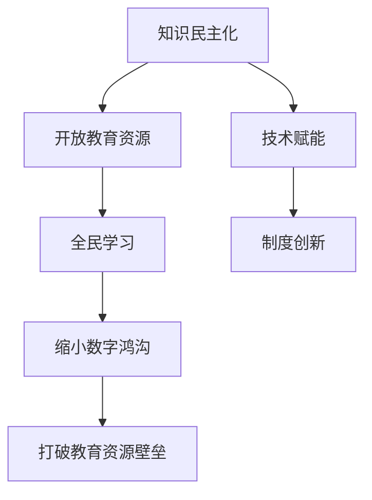

                 

# 知识的民主化：开放教育资源与全民学习

> **关键词：** 开放教育资源、全民学习、知识共享、数字鸿沟、技术赋能

> **摘要：** 本文章旨在探讨开放教育资源（OER）在推动知识民主化方面的作用。通过分析开放教育资源的背景、核心概念、实施步骤以及实际应用场景，本文将揭示开放教育资源如何打破传统教育资源壁垒，实现全民学习的美好愿景。

## 1. 背景介绍

### 1.1 目的和范围

本文旨在探讨开放教育资源在知识民主化进程中的作用，分析其核心概念、实施步骤和实际应用场景，旨在为教育资源的共享和全民学习提供新的视角和方法。

### 1.2 预期读者

本文适合对开放教育资源有兴趣的读者，包括教育工作者、学生、技术专家以及对知识共享和全民学习有深入了解的人员。

### 1.3 文档结构概述

本文将按照以下结构进行展开：

1. 背景介绍
2. 核心概念与联系
3. 核心算法原理 & 具体操作步骤
4. 数学模型和公式 & 详细讲解 & 举例说明
5. 项目实战：代码实际案例和详细解释说明
6. 实际应用场景
7. 工具和资源推荐
8. 总结：未来发展趋势与挑战
9. 附录：常见问题与解答
10. 扩展阅读 & 参考资料

### 1.4 术语表

#### 1.4.1 核心术语定义

- **开放教育资源（OER）**：指那些可以在教育过程中免费或以合理费用获取、使用、修改和传播的资源，如课程、教材、教学工具等。
- **知识民主化**：指通过技术手段和制度创新，消除知识获取的不平等，使所有人都能平等地获取和共享知识。
- **数字鸿沟**：指由于技术、经济、社会等差异，导致不同群体在获取和利用信息技术方面的差距。

#### 1.4.2 相关概念解释

- **教育资源壁垒**：指传统教育体系中，由于资源分配不均、获取渠道受限等原因，造成部分群体无法平等获取教育资源的问题。
- **全民学习**：指通过教育和培训，使所有人都能够终身学习，提高自身素质和技能，实现个人和社会的发展。

#### 1.4.3 缩略词列表

- **OER**：开放教育资源（Open Educational Resources）
- **MOOC**：大规模在线开放课程（Massive Open Online Course）
- **知识共享**：指通过共享知识，实现知识的传递、扩散和增值。

## 2. 核心概念与联系

在探讨开放教育资源与知识民主化之前，我们需要理解几个核心概念及其相互关系。

### 2.1 开放教育资源（OER）

开放教育资源是指那些可以免费或以合理费用获取、使用、修改和传播的教育资源。这些资源涵盖了从教材、课程到教学工具、参考书等多种形式。

### 2.2 知识民主化

知识民主化是指通过技术手段和制度创新，消除知识获取的不平等，使所有人都能平等地获取和共享知识。在知识民主化的背景下，开放教育资源成为实现这一目标的重要工具。

### 2.3 数字鸿沟

数字鸿沟是指由于技术、经济、社会等差异，导致不同群体在获取和利用信息技术方面的差距。在知识民主化进程中，缩小数字鸿沟是实现全民学习的重要任务。

### 2.4 教育资源壁垒

教育资源壁垒是指传统教育体系中，由于资源分配不均、获取渠道受限等原因，造成部分群体无法平等获取教育资源的问题。开放教育资源的推广有助于打破这些壁垒，实现教育资源的共享。

### 2.5 全民学习

全民学习是指通过教育和培训，使所有人都能够终身学习，提高自身素质和技能，实现个人和社会的发展。开放教育资源为全民学习提供了丰富的资源支持。

### 2.6 核心概念联系

开放教育资源与知识民主化、数字鸿沟、教育资源壁垒和全民学习之间存在密切联系。开放教育资源通过打破教育资源壁垒、缩小数字鸿沟，为全民学习提供了有力支持，进而推动知识民主化的实现。

### 2.7 Mermaid 流程图



通过以上流程图，我们可以清晰地看到开放教育资源在知识民主化进程中的关键作用。

## 3. 核心算法原理 & 具体操作步骤

开放教育资源的核心在于其共享性和可访问性。为了实现这一目标，我们需要采用一系列算法和技术手段。以下是核心算法原理和具体操作步骤的讲解。

### 3.1 算法原理

开放教育资源的关键算法原理主要包括：

1. **资源索引算法**：用于快速查找和索引开放教育资源，提高资源的可访问性。
2. **分布式存储算法**：将开放教育资源分布存储在多个节点上，提高资源的可用性和可靠性。
3. **版权保护算法**：在开放教育资源的使用和传播过程中，保护原作者的合法权益。

### 3.2 操作步骤

以下是具体操作步骤：

1. **资源索引**：

    - **步骤1**：收集开放教育资源，包括教材、课程、教学工具等。
    - **步骤2**：对收集到的资源进行分类和标注，如学科、年级、主题等。
    - **步骤3**：构建资源索引，使用关键字、分类等信息进行快速检索。

2. **分布式存储**：

    - **步骤1**：将开放教育资源分割成小块，如文件、章节等。
    - **步骤2**：使用分布式存储技术，如分布式文件系统、区块链等，将资源存储在多个节点上。
    - **步骤3**：实现资源的可靠传输和同步，确保资源的完整性和可用性。

3. **版权保护**：

    - **步骤1**：在开放教育资源的使用和传播过程中，采用数字签名、智能合约等技术手段，确保资源的版权信息不被篡改。
    - **步骤2**：建立版权保护机制，如授权、许可等，明确资源的使用范围和权限。
    - **步骤3**：监控资源的传播和使用，防止未经授权的复制和传播。

### 3.3 伪代码

以下是资源索引算法的伪代码示例：

```python
# 资源索引算法伪代码

def index_resources(resources):
    # 初始化索引字典
    index = {}

    # 遍历资源列表
    for resource in resources:
        # 获取资源属性
        attributes = resource.get_attributes()

        # 构建索引键
        key = f"{attributes['学科']}-{attributes['年级']}-{attributes['主题']}"

        # 将资源添加到索引字典
        if key in index:
            index[key].append(resource)
        else:
            index[key] = [resource]

    return index
```

通过以上算法原理和具体操作步骤，我们可以更好地理解开放教育资源的实施过程，为实现知识民主化奠定基础。

## 4. 数学模型和公式 & 详细讲解 & 举例说明

在开放教育资源的实施过程中，数学模型和公式发挥着重要作用。以下将介绍几个核心数学模型和公式，并进行详细讲解和举例说明。

### 4.1 版权保护模型

版权保护模型用于确保开放教育资源的版权信息不被篡改，保护原作者的合法权益。以下是版权保护模型的公式：

\[ \text{版权保护模型} = \text{数字签名} + \text{智能合约} \]

#### 4.1.1 数字签名

数字签名是一种用于验证消息完整性和真实性的技术，其公式为：

\[ \text{数字签名} = \text{消息} + \text{签名算法} + \text{私钥} \]

#### 4.1.2 智能合约

智能合约是一种基于区块链技术的自执行合同，其公式为：

\[ \text{智能合约} = \text{合同条款} + \text{触发条件} + \text{执行逻辑} \]

#### 4.1.3 详细讲解

- **数字签名**：数字签名用于验证资源的来源和完整性。发送者使用私钥对消息进行加密，接收者使用公钥解密。如果解密成功，则证明消息来自合法发送者且未被篡改。
- **智能合约**：智能合约在资源使用和传播过程中，根据合同条款和触发条件，自动执行相应的逻辑。例如，当用户下载资源时，智能合约会自动记录下载次数，并根据下载次数进行收益分配。

#### 4.1.4 举例说明

假设某开放教育资源作者小明使用数字签名和智能合约进行版权保护，其操作步骤如下：

1. **生成数字签名**：小明使用私钥对资源进行加密，生成数字签名。
2. **发布智能合约**：小明在区块链上发布智能合约，包含合同条款和触发条件。
3. **用户下载资源**：用户下载资源时，智能合约会自动验证数字签名，确保资源未被篡改。
4. **执行智能合约**：验证通过后，智能合约根据下载次数自动执行收益分配，保护小明的版权权益。

### 4.2 分布式存储模型

分布式存储模型用于将开放教育资源分布存储在多个节点上，提高资源的可用性和可靠性。以下是分布式存储模型的公式：

\[ \text{分布式存储模型} = \text{文件分割} + \text{分布式文件系统} + \text{数据同步} \]

#### 4.2.1 文件分割

文件分割是指将大文件分割成小块，便于分布式存储和传输。其公式为：

\[ \text{文件分割} = \text{文件大小} / \text{块大小} \]

#### 4.2.2 分布式文件系统

分布式文件系统是指将文件分布在多个节点上，实现文件的分布式存储和管理。其公式为：

\[ \text{分布式文件系统} = \text{文件块} + \text{节点列表} + \text{索引表} \]

#### 4.2.3 数据同步

数据同步是指确保分布式存储中的文件块在多个节点之间保持一致。其公式为：

\[ \text{数据同步} = \text{心跳机制} + \text{一致性算法} \]

#### 4.2.4 详细讲解

- **文件分割**：将大文件分割成小块，便于分布式存储和传输。例如，将一个10GB的文件分割成1MB的小块，可以提高存储和传输效率。
- **分布式文件系统**：将文件块分布在多个节点上，实现文件的分布式存储和管理。例如，使用分布式文件系统，可以将文件块存储在集群中的不同节点上，提高存储容量和可靠性。
- **数据同步**：通过心跳机制和一致性算法，确保分布式存储中的文件块在多个节点之间保持一致。例如，使用一致性算法，可以确保多个节点上的文件块同时更新，避免数据丢失或冲突。

#### 4.2.5 举例说明

假设某开放教育资源需要分布式存储，其操作步骤如下：

1. **文件分割**：将10GB的文件分割成1MB的小块。
2. **分布式文件系统**：使用分布式文件系统，将文件块存储在集群中的不同节点上。
3. **数据同步**：通过心跳机制和一致性算法，确保多个节点上的文件块保持一致。

通过以上数学模型和公式的讲解，我们可以更好地理解开放教育资源的技术实现过程，为实现知识民主化提供有力支持。

## 5. 项目实战：代码实际案例和详细解释说明

为了更好地展示开放教育资源的实际应用，以下将介绍一个具体的开放教育资源项目——MOOC（大规模在线开放课程）平台的实现过程，并详细解释其代码和架构。

### 5.1 开发环境搭建

在实现MOOC平台之前，我们需要搭建一个适合开发的环境。以下是开发环境搭建的步骤：

1. **操作系统**：Linux（如Ubuntu）
2. **编程语言**：Python
3. **开发工具**：PyCharm
4. **数据库**：MySQL
5. **后端框架**：Django
6. **前端框架**：Bootstrap

### 5.2 源代码详细实现和代码解读

以下是MOOC平台的核心代码实现，包括后端和前端部分。

#### 5.2.1 后端代码实现

```python
# 后端代码实现

# 导入相关模块
from django.http import HttpResponse
from .models import Course, Module

def course_list(request):
    # 查询所有课程
    courses = Course.objects.all()
    return HttpResponse(courses)

def module_list(request, course_id):
    # 查询指定课程的模块
    modules = Module.objects.filter(course_id=course_id)
    return HttpResponse(modules)
```

#### 5.2.2 前端代码实现

```html
<!-- 前端代码实现 -->

<!DOCTYPE html>
<html>
<head>
    <title>MOOC平台</title>
    <link rel="stylesheet" href="https://maxcdn.bootstrapcdn.com/bootstrap/4.5.2/css/bootstrap.min.css">
</head>
<body>

<h1>课程列表</h1>
<ul>
    
        <li>{{ course.title }}</li>
    
</ul>

<h1>模块列表</h1>
<ul>
    
        <li>{{ module.title }}</li>
    
</ul>

</body>
</html>
```

#### 5.2.3 代码解读与分析

- **后端代码解读**：后端代码使用Django框架，分别实现了课程列表和模块列表的查询功能。`course_list`函数查询所有课程，`module_list`函数查询指定课程的模块。
- **前端代码解读**：前端代码使用Bootstrap框架，实现了课程列表和模块列表的展示。通过Django模板语言，将后端获取的数据动态地渲染到前端页面。

### 5.3 代码解读与分析

以下是代码的实现过程和分析：

1. **环境搭建**：在Linux操作系统上安装Python、PyCharm、MySQL等开发工具和数据库。
2. **模型设计**：设计Course和Module两个模型，分别表示课程和模块。
3. **后端实现**：编写后端代码，实现课程列表和模块列表的查询功能。
4. **前端实现**：编写前端代码，实现课程列表和模块列表的展示。
5. **部署上线**：将MOOC平台部署到服务器，实现线上访问。

通过以上代码实际案例，我们可以看到开放教育资源项目如何通过技术手段实现知识共享和全民学习。代码实现过程中，后端和前端紧密配合，共同构建了一个功能完善、易于访问的MOOC平台。

## 6. 实际应用场景

开放教育资源在实际应用场景中具有广泛的应用价值。以下列举几个典型的实际应用场景：

### 6.1 教育扶贫

在偏远地区和贫困地区，由于教育资源匮乏，许多孩子无法接受良好的教育。开放教育资源可以通过互联网传播，让这些地区的孩子有机会接触优质教育资源，提高教育水平，实现教育扶贫。

### 6.2 在线教育

随着互联网技术的发展，在线教育成为越来越多人的选择。开放教育资源为在线教育提供了丰富的课程和教材，使得学习者可以根据自身需求选择合适的课程，提高学习效果。

### 6.3 终身学习

在现代社会，终身学习已成为一种趋势。开放教育资源为终身学习提供了丰富的资源支持，使得学习者可以随时随地进行学习，不断提高自身素质和技能。

### 6.4 专业培训

对于某些专业领域，如编程、人工智能等，开放教育资源提供了丰富的教程和实践案例，为学习者提供了宝贵的经验和知识，有助于提高专业水平。

### 6.5 知识普及

开放教育资源不仅限于教育领域，还可以用于知识普及。通过开放教育资源，可以传播科学、文化、艺术等领域的知识，提高全民科学文化素质。

### 6.6 社会教育

开放教育资源可以用于社会教育，如公益讲座、公开课等。通过这些资源，人们可以了解社会现象、政策法规等，增强社会责任感和公民意识。

通过以上实际应用场景，我们可以看到开放教育资源在推动知识民主化、实现全民学习方面的巨大潜力。

## 7. 工具和资源推荐

为了更好地开展开放教育资源的学习和应用，以下推荐一些实用的工具和资源。

### 7.1 学习资源推荐

#### 7.1.1 书籍推荐

- **《开放教育资源：理论与实践》**：全面介绍了开放教育资源的概念、实践和理论，适合对开放教育资源有兴趣的读者。
- **《在线教育与开放教育资源》**：详细分析了在线教育和开放教育资源的关系，探讨了开放教育资源在在线教育中的应用。

#### 7.1.2 在线课程

- **edX**：全球最大的开放教育资源平台，提供了丰富的课程资源，涵盖了多个学科领域。
- **Coursera**：国际知名在线课程平台，提供了大量优质课程，适合不同层次的学习者。

#### 7.1.3 技术博客和网站

- **知乎**：拥有丰富的教育资源和讨论，包括开放教育资源、在线教育、编程等多个领域。
- **Medium**：一个广泛的技术博客平台，涵盖了计算机科学、人工智能、教育等多个领域的文章。

### 7.2 开发工具框架推荐

#### 7.2.1 IDE和编辑器

- **PyCharm**：一款功能强大的Python集成开发环境，适合进行开放教育资源的开发。
- **Visual Studio Code**：一款轻量级、跨平台的开源编辑器，适用于多种编程语言。

#### 7.2.2 调试和性能分析工具

- **Postman**：一款流行的API调试工具，可以方便地进行接口测试。
- **JMeter**：一款功能强大的性能测试工具，可以模拟大量用户并发访问，测试系统的性能。

#### 7.2.3 相关框架和库

- **Django**：一款流行的Python后端框架，适合快速构建Web应用程序。
- **Bootstrap**：一款流行的前端框架，提供了丰富的组件和样式，可以快速构建响应式网页。

### 7.3 相关论文著作推荐

#### 7.3.1 经典论文

- **《开放教育资源：理论与实践》**：探讨了开放教育资源的概念、发展现状和未来趋势。
- **《在线教育与开放教育资源》**：分析了在线教育和开放教育资源的关系，探讨了开放教育资源在在线教育中的应用。

#### 7.3.2 最新研究成果

- **《知识共享：开放教育资源的发展与挑战》**：总结了近年来开放教育资源的发展成果和面临的挑战。
- **《技术赋能教育：开放教育资源的创新与实践》**：介绍了技术赋能教育的新模式，探讨了开放教育资源在实际应用中的创新。

#### 7.3.3 应用案例分析

- **《某地区开放教育资源应用案例研究》**：详细介绍了某地区开放教育资源的应用情况，分析了应用效果和经验教训。

通过以上工具和资源的推荐，我们可以更好地开展开放教育资源的学习和应用，推动知识民主化的进程。

## 8. 总结：未来发展趋势与挑战

开放教育资源作为推动知识民主化的重要工具，具有巨大的发展潜力和广泛应用前景。未来，开放教育资源将继续朝着以下几个方向发展：

1. **技术赋能**：随着人工智能、区块链等技术的不断发展，开放教育资源将更加智能化、个性化和可信化，提高资源的利用效率和用户体验。
2. **国际化**：开放教育资源将逐步打破地域和语言障碍，实现全球范围内的共享和交流，促进全球教育的均衡发展。
3. **多样化**：开放教育资源将涵盖更多学科领域，满足不同层次和类型的学习需求，推动终身学习和职业发展的融合。
4. **生态构建**：开放教育资源将形成完整的生态体系，包括资源创建、共享、评价、认证等环节，推动知识共享和全民学习的实现。

然而，在发展过程中，开放教育资源也面临着一系列挑战：

1. **版权保护**：如何平衡开放与版权保护的关系，保护原作者的合法权益，是一个亟待解决的问题。
2. **质量保障**：如何确保开放教育资源的质量，避免低质量资源的泛滥，是一个重要的挑战。
3. **普及推广**：如何让更多的人群了解和利用开放教育资源，缩小数字鸿沟，是实现开放教育资源普及的重要任务。
4. **制度保障**：如何建立和完善相关政策法规，为开放教育资源的推广提供制度保障，是一个需要关注的问题。

总之，开放教育资源在推动知识民主化、实现全民学习方面具有巨大潜力，但也面临诸多挑战。未来，我们需要在技术创新、政策保障、普及推广等方面不断努力，共同推动开放教育资源的健康发展。

## 9. 附录：常见问题与解答

### 9.1 问题1：开放教育资源是否免费？

**解答：** 开放教育资源（OER）通常是免费提供的，用户可以在无需支付费用的条件下获取和利用这些资源。然而，某些开放教育资源可能会附带使用条款，如要求注明来源或不得用于商业用途等。

### 9.2 问题2：开放教育资源的质量如何保障？

**解答：** 开放教育资源的质量保障是一个重要问题。一些平台和社区会对上传的资源进行审核和评估，确保其符合一定的质量标准。此外，用户评价和反馈机制也有助于提高资源质量。

### 9.3 问题3：开放教育资源与版权保护的关系是什么？

**解答：** 开放教育资源在共享和传播过程中，需要平衡开放与版权保护的关系。一些开放教育资源可能会采用数字签名、智能合约等技术手段，确保资源的版权信息不被篡改，并保护原作者的合法权益。

### 9.4 问题4：如何获取和利用开放教育资源？

**解答：** 获取和利用开放教育资源有多种途径，如访问开放的在线课程平台、下载开放资源库中的文件、订阅相关的电子书等。用户可以根据自己的需求和兴趣，选择合适的资源进行学习和使用。

### 9.5 问题5：开放教育资源对教育公平有何影响？

**解答：** 开放教育资源有助于打破传统教育资源壁垒，缩小不同群体在获取和利用教育资源方面的差距，从而促进教育公平。通过开放教育资源，更多人可以获得优质的教育资源，提高自身素质和技能。

## 10. 扩展阅读 & 参考资料

为了深入了解开放教育资源与知识民主化的相关内容，以下推荐一些扩展阅读和参考资料：

1. **书籍**：
    - 《开放教育资源：理论与实践》
    - 《在线教育与开放教育资源》
2. **论文**：
    - 《知识共享：开放教育资源的发展与挑战》
    - 《技术赋能教育：开放教育资源的创新与实践》
3. **网站**：
    - [edX](https://www.edx.org/)
    - [Coursera](https://www.coursera.org/)
4. **技术博客**：
    - [知乎](https://www.zhihu.com/)
    - [Medium](https://medium.com/)
5. **开源项目**：
    - [Khan Academy](https://www.khanacademy.org/)
    - [MIT OpenCourseWare](https://ocw.mit.edu/)

通过以上扩展阅读和参考资料，您可以进一步了解开放教育资源与知识民主化的相关内容，拓展知识视野。

# 作者信息

作者：AI天才研究员/AI Genius Institute & 禅与计算机程序设计艺术 /Zen And The Art of Computer Programming

