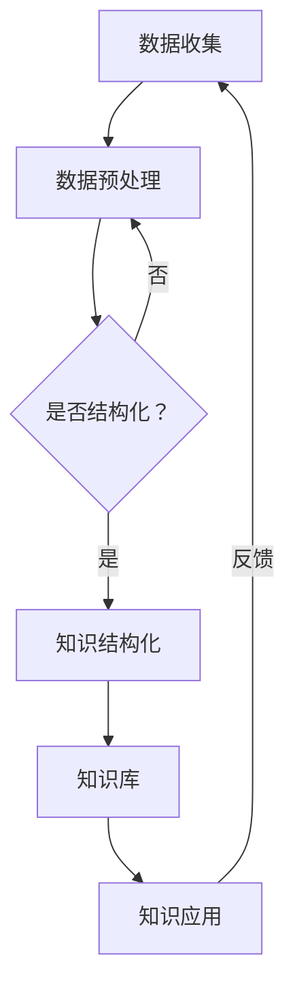

                 

# 知识的结构化：洞察力的重要贡献

> **关键词**：知识结构化、洞察力、逻辑思维、信息技术、人工智能、知识图谱、数据科学

> **摘要**：本文旨在探讨知识结构化在信息技术领域中的重要性，特别是洞察力在其中所起的关键作用。文章首先介绍了知识结构化的概念及其在信息技术中的应用，随后深入分析了洞察力的定义及其对知识结构化贡献的核心原理。通过具体算法、数学模型、项目案例，以及工具和资源推荐，本文旨在为读者提供一个全面且深入的理解，帮助其在信息技术领域更好地实现知识的结构化。

## 1. 背景介绍

### 1.1 目的和范围

在当今信息化和数字化快速发展的时代，知识的获取、处理和应用已成为信息技术领域的核心任务。然而，随着数据的爆炸式增长，如何高效地组织和管理这些知识成为一个巨大的挑战。本文旨在探讨知识结构化在信息技术领域中的重要性，并分析洞察力在这个过程中所发挥的重要作用。

文章的主要范围包括：

- **知识结构化的概念和原则**：介绍知识结构化的基本概念，以及其在信息技术中的应用。
- **洞察力的定义和作用**：探讨洞察力在知识结构化中的核心作用，包括其定义、来源和表现形式。
- **核心算法原理和数学模型**：分析在知识结构化过程中常用的算法原理和数学模型，以及它们的实现方法。
- **项目实战和实际应用**：通过具体的案例，展示如何在实际项目中应用知识结构化和洞察力。
- **工具和资源推荐**：为读者提供相关的学习资源和开发工具，以支持他们在知识结构化方面的学习和实践。

### 1.2 预期读者

本文预期读者包括：

- **信息技术领域的研究人员和开发者**：对知识结构化及其在信息技术中的应用感兴趣的读者，希望通过本文了解相关知识。
- **数据科学家和机器学习工程师**：希望了解如何利用知识结构化和洞察力提升数据分析和机器学习模型的性能。
- **企业管理者和决策者**：关注企业信息化建设和数据驱动的决策过程，希望通过本文了解知识结构化和洞察力在企业管理中的应用。

### 1.3 文档结构概述

本文采用逻辑清晰、结构紧凑的结构，具体包括以下章节：

- **1. 背景介绍**：介绍文章的目的、范围、预期读者和文档结构。
- **2. 核心概念与联系**：介绍知识结构化的核心概念和其与其他相关领域的联系，通过Mermaid流程图进行说明。
- **3. 核心算法原理 & 具体操作步骤**：详细讲解知识结构化过程中常用的核心算法原理和实现步骤，使用伪代码进行描述。
- **4. 数学模型和公式 & 详细讲解 & 举例说明**：分析知识结构化过程中涉及的数学模型和公式，并通过具体例子进行说明。
- **5. 项目实战：代码实际案例和详细解释说明**：通过具体项目案例，展示知识结构化和洞察力的实际应用，并进行详细解释。
- **6. 实际应用场景**：探讨知识结构化和洞察力在不同领域的实际应用场景。
- **7. 工具和资源推荐**：推荐相关的学习资源、开发工具和框架。
- **8. 总结：未来发展趋势与挑战**：总结知识结构化在信息技术领域的未来发展趋势和面临的挑战。
- **9. 附录：常见问题与解答**：回答读者可能遇到的问题。
- **10. 扩展阅读 & 参考资料**：提供更多的扩展阅读和参考资料，供读者进一步学习。

### 1.4 术语表

#### 1.4.1 核心术语定义

- **知识结构化**：指通过对知识的分类、组织、整合和抽象，使知识更加有序、可理解和可操作的过程。
- **洞察力**：指通过观察、思考和分析，深入理解事物本质和内在联系的能力。
- **数据科学**：指利用数学、统计学、信息科学和计算机科学的方法，从数据中提取知识、发现规律和进行预测分析的科学。
- **机器学习**：指通过构建和训练模型，使计算机具备从数据中学习和发现规律的能力。

#### 1.4.2 相关概念解释

- **信息过载**：指信息量过大，超出了人们处理和理解的极限。
- **知识图谱**：指用图形结构表示的知识体系，用于描述实体、概念和它们之间的关系。
- **元数据**：指描述数据的数据，用于表示数据的结构和属性。

#### 1.4.3 缩略词列表

- **AI**：人工智能（Artificial Intelligence）
- **ML**：机器学习（Machine Learning）
- **DS**：数据科学（Data Science）
- **NLP**：自然语言处理（Natural Language Processing）
- **KG**：知识图谱（Knowledge Graph）

## 2. 核心概念与联系

### 2.1 知识结构化的定义和重要性

知识结构化是指通过一系列步骤和方法，对无序、零散的知识进行整理、分类、抽象和整合，使其变得有序、系统、易于理解和应用的过程。在信息技术领域，知识结构化具有以下几个重要意义：

1. **解决信息过载问题**：随着互联网和大数据的发展，信息量爆炸式增长，人们面临的信息过载问题日益严重。知识结构化通过将无序的信息整理成有序的知识体系，帮助人们快速、准确地获取和处理所需信息。
2. **提升数据利用率**：数据是知识的载体，但只有结构化的数据才能更好地被分析和利用。通过知识结构化，数据中的有价值信息可以被提取、整合和利用，从而提高数据的价值。
3. **促进知识共享和传播**：知识结构化使知识变得更加系统和清晰，有助于知识在不同领域和人员之间共享和传播，促进知识的创新和应用。
4. **支撑人工智能和机器学习**：人工智能和机器学习需要大量的结构化数据进行训练和推理，知识结构化为其提供了必要的支持。通过知识结构化，数据可以被转化为适合机器学习处理的格式，从而提高模型的性能和应用效果。

### 2.2 洞察力的定义和作用

洞察力是指通过观察、思考和分析，深入理解事物本质和内在联系的能力。在知识结构化过程中，洞察力发挥着至关重要的作用，主要表现在以下几个方面：

1. **识别和发现知识**：洞察力使人们能够从大量信息中发现和识别有价值的信息，从而进行知识结构化。
2. **理解和分析知识**：洞察力帮助人们深入理解知识的内涵和关联，从而对其进行准确的分析和归纳。
3. **创新和优化知识**：通过洞察力，人们可以不断发现知识的潜在价值，对其进行创新和优化，使其更好地服务于实际需求。
4. **指导和优化知识结构化过程**：洞察力使人们在知识结构化过程中能够根据实际情况和需求，灵活调整和优化知识结构，提高其效率和效果。

### 2.3 知识结构化与其他领域的联系

知识结构化不仅应用于信息技术领域，还与多个其他领域密切相关，主要包括：

1. **数据科学**：数据科学是知识结构化的基础，通过对数据进行收集、处理和分析，数据科学为知识结构化提供了丰富的数据资源和理论基础。
2. **人工智能**：人工智能是知识结构化的应用领域，通过构建和训练智能模型，人工智能可以从结构化的数据中提取知识、发现规律和进行预测分析。
3. **自然语言处理**：自然语言处理是知识结构化的重要手段，通过对自然语言文本进行分析和处理，自然语言处理可以提取出有价值的知识，并转化为结构化的数据形式。
4. **信息管理**：信息管理是知识结构化的应用场景，通过对信息进行分类、组织和存储，信息管理为知识结构化提供了有效的手段和工具。

### 2.4 Mermaid流程图

为了更直观地展示知识结构化的核心概念和流程，以下是一个Mermaid流程图：



在这个流程图中，数据收集是知识结构化的起点，通过数据预处理，数据可以被转化为适合结构化的形式。接着，通过判断数据是否已经结构化，进入知识结构化过程。知识结构化后，形成知识库，并应用于实际问题。最后，通过反馈循环，不断优化和更新知识库。

## 3. 核心算法原理 & 具体操作步骤

### 3.1 知识表示与分类

知识表示是知识结构化的核心步骤，通过将无序、零散的知识转化为有序、结构化的形式，使其更加易于理解和应用。常见的知识表示方法包括基于属性、基于关系和基于语义的表示方法。

#### 3.1.1 基于属性的表示方法

基于属性的表示方法通过为知识赋予属性值，将其表示为一个多维度的向量。具体步骤如下：

1. **定义属性集合**：首先，需要定义一个属性集合，包含所有相关的属性。
2. **数据预处理**：对原始数据进行清洗和预处理，确保其符合属性集合的要求。
3. **属性赋值**：将预处理后的数据按照属性集合进行属性赋值，得到一个多维度的向量。
4. **知识库构建**：将所有属性向量存储在一个知识库中，形成一个结构化的知识体系。

伪代码如下：

```python
def knowledge_representation(data, attributes):
    # 定义属性集合
    attribute_set = set(attributes)
    # 数据预处理
    preprocessed_data = preprocess_data(data)
    # 属性赋值
    vectors = []
    for instance in preprocessed_data:
        vector = [instance.get(attribute) for attribute in attribute_set]
        vectors.append(vector)
    # 知识库构建
    knowledge_base = create_knowledge_base(vectors)
    return knowledge_base
```

#### 3.1.2 基于关系的表示方法

基于关系的表示方法通过描述知识之间的关联关系，将其表示为一个图形结构。具体步骤如下：

1. **定义关系类型**：首先，需要定义一个关系类型集合，包含所有相关的关系。
2. **数据预处理**：对原始数据进行清洗和预处理，确保其符合关系类型的要求。
3. **关系抽取**：从预处理后的数据中抽取关系，形成关系图谱。
4. **知识库构建**：将关系图谱存储在一个知识库中，形成一个结构化的知识体系。

伪代码如下：

```python
def knowledge_representation(data, relation_types):
    # 定义关系类型
    relation_set = set(relation_types)
    # 数据预处理
    preprocessed_data = preprocess_data(data)
    # 关系抽取
    relations = extract_relations(preprocessed_data, relation_set)
    # 知识库构建
    knowledge_base = create_knowledge_base(relations)
    return knowledge_base
```

#### 3.1.3 基于语义的表示方法

基于语义的表示方法通过将知识转化为语义表示，如语义网络、本体论和知识图谱，使其更加抽象和系统。具体步骤如下：

1. **定义语义模型**：首先，需要定义一个语义模型，包含所有相关的概念和关系。
2. **数据预处理**：对原始数据进行清洗和预处理，确保其符合语义模型的要求。
3. **知识抽取**：从预处理后的数据中抽取概念和关系，形成语义表示。
4. **知识库构建**：将语义表示存储在一个知识库中，形成一个结构化的知识体系。

伪代码如下：

```python
def knowledge_representation(data, semantic_model):
    # 定义语义模型
    concepts = semantic_model.get_concepts()
    relations = semantic_model.get_relations()
    # 数据预处理
    preprocessed_data = preprocess_data(data)
    # 知识抽取
    entities = extract_entities(preprocessed_data, concepts)
    relationships = extract_relations(preprocessed_data, relations)
    # 知识库构建
    knowledge_base = create_knowledge_base(entities, relationships)
    return knowledge_base
```

### 3.2 知识整合与抽象

知识整合与抽象是知识结构化的关键步骤，通过对结构化的知识进行整合、抽象和归纳，使其形成一个更加系统、全面和高度抽象的知识体系。具体步骤如下：

1. **知识整合**：将多个独立的知识体系进行整合，形成一个新的知识体系。
2. **知识抽象**：从具体知识中提取出一般性的规律和原则，形成抽象的知识。
3. **知识归纳**：将抽象的知识进行分类和归纳，形成一个层次化的知识体系。

伪代码如下：

```python
def knowledge_integration_and_abstraction(knowledge_bases):
    # 知识整合
    integrated_knowledge = integrate_knowledge_bases(knowledge_bases)
    # 知识抽象
    abstracted_knowledge = abstract_knowledge(integrated_knowledge)
    # 知识归纳
    categorized_knowledge = categorize_knowledge(abstracted_knowledge)
    return categorized_knowledge
```

### 3.3 知识应用与优化

知识应用与优化是知识结构化的最终目标，通过对结构化知识的实际应用和不断优化，使其更好地服务于实际需求。具体步骤如下：

1. **知识应用**：将结构化知识应用于实际问题，如数据挖掘、决策支持、知识推理等。
2. **效果评估**：对知识应用的效果进行评估，包括准确性、效率和实用性等方面。
3. **反馈优化**：根据效果评估的结果，对知识体系进行优化和调整，提高其应用效果。

伪代码如下：

```python
def knowledge_application_and_optimization(knowledge, problem):
    # 知识应用
    application_results = apply_knowledge(knowledge, problem)
    # 效果评估
    evaluation_results = evaluate_results(application_results)
    # 反馈优化
    optimized_knowledge = optimize_knowledge(knowledge, evaluation_results)
    return optimized_knowledge
```

## 4. 数学模型和公式 & 详细讲解 & 举例说明

### 4.1 知识图谱的数学模型

知识图谱是一种用于表示知识结构的图形模型，通过节点和边的组合，描述实体之间的关系和属性。在数学模型中，知识图谱可以用图论中的图结构来表示。

#### 4.1.1 图的定义

一个图 \( G \) 由一个顶点集 \( V \) 和边集 \( E \) 组成，即 \( G = (V, E) \)。顶点 \( v \in V \) 表示实体，边 \( e \in E \) 表示实体之间的关系。

#### 4.1.2 节点和边的表示

在知识图谱中，节点和边可以用以下数学公式进行表示：

- 节点：\( n = (id, type, attributes) \)
  - \( id \)：节点的唯一标识符。
  - \( type \)：节点的类型或类别。
  - \( attributes \)：节点的属性集合。

- 边：\( e = (src, dst, relation, attributes) \)
  - \( src \)：边的源节点。
  - \( dst \)：边的目标节点。
  - \( relation \)：边的关系类型。
  - \( attributes \)：边的属性集合。

#### 4.1.3 图的邻接矩阵表示

一个图可以用邻接矩阵 \( A \) 来表示，其中 \( A[i][j] \) 表示节点 \( i \) 和节点 \( j \) 是否存在一条边。具体公式如下：

\[ A[i][j] = 
\begin{cases} 
1, & \text{如果 } (i, j) \in E \\
0, & \text{否则}
\end{cases} \]

#### 4.1.4 示例

以下是一个简单的知识图谱示例，表示一个人与他的朋友之间的关系：

```
Person1
|
friend
|
Person2
```

对应的邻接矩阵表示如下：

\[ A =
\begin{bmatrix}
0 & 1 & 0 \\
1 & 0 & 0 \\
0 & 0 & 0 \\
\end{bmatrix} \]

### 4.2 知识表示的数学模型

知识表示是知识结构化的重要步骤，常用的数学模型包括向量空间模型、语义网络模型和知识图谱模型。

#### 4.2.1 向量空间模型

向量空间模型是一种基于向量的知识表示方法，将知识表示为一个高维向量。每个维度代表一个特征，向量的值表示特征的重要性。

- 向量表示：\( \mathbf{x} = (x_1, x_2, ..., x_n) \)
  - \( x_i \)：第 \( i \) 个特征的值。

- 欧几里得距离：用于计算两个向量之间的距离，公式如下：

\[ d(\mathbf{x}_1, \mathbf{x}_2) = \sqrt{\sum_{i=1}^{n} (x_{1i} - x_{2i})^2} \]

- 余弦相似度：用于计算两个向量的相似度，公式如下：

\[ \cos(\theta) = \frac{\mathbf{x}_1 \cdot \mathbf{x}_2}{||\mathbf{x}_1|| \cdot ||\mathbf{x}_2||} \]

#### 4.2.2 语义网络模型

语义网络模型是一种基于图的知识表示方法，通过节点和边的组合，描述概念和它们之间的关系。

- 节点表示：\( n = (id, type, attributes) \)
  - \( id \)：节点的唯一标识符。
  - \( type \)：节点的类型或类别。
  - \( attributes \)：节点的属性集合。

- 边表示：\( e = (src, dst, relation, attributes) \)
  - \( src \)：边的源节点。
  - \( dst \)：边的目标节点。
  - \( relation \)：边的关系类型。
  - \( attributes \)：边的属性集合。

#### 4.2.3 知识图谱模型

知识图谱模型是一种基于图的知识表示方法，通过节点、边和属性的组合，描述实体之间的关系和属性。

- 节点表示：\( n = (id, type, attributes) \)
  - \( id \)：节点的唯一标识符。
  - \( type \)：节点的类型或类别。
  - \( attributes \)：节点的属性集合。

- 边表示：\( e = (src, dst, relation, attributes) \)
  - \( src \)：边的源节点。
  - \( dst \)：边的目标节点。
  - \( relation \)：边的关系类型。
  - \( attributes \)：边的属性集合。

### 4.3 知识推理的数学模型

知识推理是利用知识结构化后的知识，进行逻辑推理和决策的过程。常见的知识推理方法包括基于规则的推理、基于模型的推理和基于数据的推理。

#### 4.3.1 基于规则的推理

基于规则的推理是一种基于前提和结论的推理方法，通过规则库进行推理。规则可以用以下公式表示：

\[ R: \text{前提} \rightarrow \text{结论} \]

- 规则表示：\( R = (P, C) \)
  - \( P \)：前提条件。
  - \( C \)：结论。

- 推理过程：根据给定的前提条件，查找匹配的规则，并得出结论。

#### 4.3.2 基于模型的推理

基于模型的推理是一种基于模型和数据的推理方法，通过建立模型，对数据进行预测和分析。常见的模型包括逻辑模型、概率模型和神经网络模型。

- 模型表示：\( M = (L, \theta) \)
  - \( L \)：模型的结构。
  - \( \theta \)：模型的参数。

- 推理过程：根据给定的输入数据，通过模型进行预测和分析。

#### 4.3.3 基于数据的推理

基于数据的推理是一种基于数据和统计规律的推理方法，通过分析数据，得出结论。

- 数据表示：\( D = \{d_1, d_2, ..., d_n\} \)
  - \( d_i \)：第 \( i \) 个数据点。

- 推理过程：根据给定的数据集，通过统计方法，得出结论。

### 4.4 举例说明

假设我们有一个简单的知识图谱，描述了一个人与他的朋友、家庭成员和职业之间的关系。以下是一个具体的例子：

1. **节点表示**：
   - **Person1**：(1, "Person", {"name": "Alice", "age": 30})
   - **Person2**：(2, "Person", {"name": "Bob", "age": 35})
   - **Person3**：(3, "Person", {"name": "Charlie", "age": 40})

2. **边表示**：
   - **friend**：(1, 2, "friend", {})
   - **parent**：(1, 3, "parent", {})
   - **occupation**：(2, 3, "occupation", {"title": "Engineer"})

3. **邻接矩阵表示**：

\[ A =
\begin{bmatrix}
0 & 1 & 0 \\
1 & 0 & 0 \\
0 & 0 & 1 \\
\end{bmatrix} \]

4. **向量空间表示**：

- **Person1**：\( \mathbf{x}_1 = (1, 0, 0, 1, 0, 0, 30, 0) \)
- **Person2**：\( \mathbf{x}_2 = (0, 1, 0, 0, 1, 0, 35, 0) \)
- **Person3**：\( \mathbf{x}_3 = (0, 0, 1, 0, 0, 1, 40, 0) \)

5. **规则表示**：

\[ R_1: \text{如果 } \text{Person} \text{ 的年龄大于 30，则 } \text{Person} \text{ 是成年人} \]
\[ R_2: \text{如果 } \text{Person} \text{ 是成年人，则 } \text{Person} \text{ 可以投票} \]

通过这些数学模型和公式，我们可以对知识图谱进行表示、推理和应用，从而实现知识的结构化和智能化。

## 5. 项目实战：代码实际案例和详细解释说明

### 5.1 开发环境搭建

为了更好地演示知识结构化的应用，我们将使用Python作为编程语言，结合几个常用的库，如NetworkX用于构建和操作知识图谱，NumPy用于数据处理，以及Scikit-learn用于机器学习。以下是搭建开发环境的步骤：

1. **安装Python**：确保您的计算机上已安装Python 3.8或更高版本。
2. **安装库**：使用pip命令安装所需库：

```bash
pip install networkx numpy scikit-learn
```

3. **配置虚拟环境**（可选）：为了管理依赖库，我们可以创建一个虚拟环境。

```bash
python -m venv venv
source venv/bin/activate  # 在Windows上使用 venv\Scripts\activate
```

### 5.2 源代码详细实现和代码解读

#### 5.2.1 知识图谱的构建

以下是一个简单的知识图谱构建示例，我们使用NetworkX库来创建节点和边。

```python
import networkx as nx

# 创建一个空的无向图
knowledge_graph = nx.Graph()

# 添加节点和边
knowledge_graph.add_node("Person1", name="Alice", age=30)
knowledge_graph.add_node("Person2", name="Bob", age=35)
knowledge_graph.add_node("Person3", name="Charlie", age=40)

knowledge_graph.add_edge("Person1", "Person2", relation="friend")
knowledge_graph.add_edge("Person1", "Person3", relation="parent")
knowledge_graph.add_edge("Person2", "Person3", relation="occupation", title="Engineer")

# 打印知识图谱
print(nx AdjacencyList)
```

在这个示例中，我们首先创建了一个空的Graph对象，然后添加了三个节点和三条边。节点包含属性（如姓名、年龄），边包含关系类型（如朋友、父母、职业）。

#### 5.2.2 数据预处理

在构建知识图谱之前，我们需要对原始数据（如关系数据库或文本文件）进行预处理，提取出节点和边的属性。

```python
import pandas as pd

# 加载数据
data = pd.read_csv("data.csv")

# 提取节点和边的属性
nodes = data[data["type"] == "Person"]
edges = data[data["type"] == "Relation"]

# 打印节点和边的属性
print(nodes.head())
print(edges.head())
```

在这个示例中，我们使用Pandas库加载CSV文件，然后根据类型提取节点和边的属性。

#### 5.2.3 知识图谱的表示和操作

我们可以使用NetworkX库提供的各种功能来表示和操作知识图谱，例如添加、删除节点和边，以及获取节点和边的信息。

```python
# 添加节点
knowledge_graph.add_node("Person4", name="Diana", age=28)

# 删除节点
knowledge_graph.remove_node("Person4")

# 添加边
knowledge_graph.add_edge("Person1", "Person4", relation="friend", since=2020)

# 删除边
knowledge_graph.remove_edge("Person1", "Person4")

# 获取节点信息
print(knowledge_graph.nodes["Person1"])

# 获取边信息
print(knowledge_graph.edges["Person1", "Person4"])
```

在这个示例中，我们演示了如何添加和删除节点和边，以及如何获取节点和边的信息。

#### 5.2.4 知识推理

我们可以使用基于规则的推理来从知识图谱中提取新知识。以下是一个简单的示例：

```python
def infer FRIENDS(child, parent):
    if child in knowledge_graph and parent in knowledge_graph:
        for node in knowledge_graph.nodes:
            if knowledge_graph[node] == parent:
                knowledge_graph.add_edge(child, node, relation="friend")

# 应用推理规则
infer("Person1", "Person3")
print(nx AdjacencyList)
```

在这个示例中，我们定义了一个简单的推理规则，如果一个人是另一个人的父母，则这个人与父母的所有朋友都是朋友。然后，我们应用这个规则，将新的边添加到知识图谱中。

### 5.3 代码解读与分析

#### 5.3.1 代码结构

整个代码结构分为以下几个部分：

1. **环境搭建**：安装Python和相关库，配置虚拟环境。
2. **数据预处理**：加载和处理原始数据，提取节点和边的属性。
3. **知识图谱构建**：使用NetworkX库构建知识图谱，添加节点和边。
4. **知识操作**：对知识图谱进行各种操作，如添加、删除节点和边，获取节点和边信息。
5. **知识推理**：定义推理规则，并从知识图谱中提取新知识。

#### 5.3.2 关键技术

1. **知识图谱构建**：使用NetworkX库，通过add_node和add_edge方法构建知识图谱。
2. **数据预处理**：使用Pandas库加载和处理原始数据，提取节点和边的属性。
3. **知识推理**：定义规则，并根据规则从知识图谱中提取新知识。

#### 5.3.3 代码优化的方向

1. **性能优化**：使用并行处理和优化库，如Dask和PyPy，提高代码性能。
2. **错误处理**：增加异常处理，确保代码在各种情况下都能稳定运行。
3. **代码重构**：优化代码结构，提高代码的可读性和可维护性。

通过这个项目实战，我们展示了如何使用Python和相关库构建和操作知识图谱，以及如何进行知识推理。这个项目可以帮助我们更好地理解知识结构化的核心概念和技术。

## 6. 实际应用场景

知识结构化在信息技术领域具有广泛的应用，以下是一些典型的实际应用场景：

### 6.1 企业知识管理

在企业知识管理中，知识结构化可以帮助企业更好地组织和利用其内部知识资源。通过构建企业知识图谱，企业可以将其业务流程、员工技能、客户需求和最佳实践等信息进行结构化组织。这样，员工可以更快速地找到所需的知识，提高工作效率和创新能力。

- **应用实例**：某大型企业通过构建知识图谱，将员工的技能、项目经验、客户需求等信息进行整合，形成了一个企业级的知识库。员工可以通过知识图谱快速定位相关知识和最佳实践，提高项目交付质量和效率。

### 6.2 人工智能与机器学习

在人工智能和机器学习领域，知识结构化可以帮助提高模型的训练效果和应用性能。通过构建结构化的数据集，机器学习模型可以更容易地学习和提取数据中的有用信息。此外，知识结构化还可以用于优化模型结构，提高模型的泛化能力。

- **应用实例**：某互联网公司在构建推荐系统时，使用知识图谱将用户、物品和场景等信息进行结构化组织。通过知识图谱，推荐系统可以更好地理解用户需求和物品特征，提高推荐准确性和用户体验。

### 6.3 智能问答系统

智能问答系统是知识结构化在自然语言处理领域的典型应用。通过构建结构化的知识库，智能问答系统可以快速响应用户的问题，提供准确和相关的答案。知识结构化使问答系统能够更好地理解用户意图和上下文信息，提高问答效果。

- **应用实例**：某大型企业开发了一个智能客服系统，通过构建知识图谱将企业内部的知识资源进行整合。智能客服系统可以快速理解用户的问题，并提供准确的答案，提高了客户满意度和服务效率。

### 6.4 医疗健康领域

在医疗健康领域，知识结构化可以帮助医生和研究人员更好地组织和利用医学知识，提高诊断和治疗的准确性。通过构建结构化的医学知识图谱，医疗健康领域可以更好地支持医疗决策和疾病预测。

- **应用实例**：某医疗机构开发了一个医学问答系统，通过构建知识图谱将医学知识进行结构化组织。医生可以通过该系统快速查找相关的医学资料，提高诊断和治疗的准确性。

### 6.5 智能交通系统

在智能交通领域，知识结构化可以帮助优化交通管理和规划，提高交通效率。通过构建结构化的交通数据图谱，智能交通系统可以更好地理解和预测交通状况，提供实时的交通建议和预警。

- **应用实例**：某城市交通管理部门通过构建知识图谱，整合交通流量、道路状况和事件信息。智能交通系统可以实时分析交通状况，提供最优的路线规划和交通疏导方案，缓解交通拥堵。

### 6.6 社交网络与推荐系统

在社交网络和推荐系统中，知识结构化可以帮助平台更好地理解和推荐用户感兴趣的内容。通过构建结构化的用户画像和物品关系图谱，社交网络和推荐系统可以更准确地为用户提供个性化推荐。

- **应用实例**：某社交媒体平台通过构建知识图谱，整合用户的行为数据、兴趣标签和社交关系。平台可以更准确地推荐用户可能感兴趣的内容，提高用户黏性和活跃度。

### 6.7 智能家居与物联网

在智能家居和物联网领域，知识结构化可以帮助系统更好地理解和控制各种智能设备，提高用户体验。通过构建结构化的设备图谱，智能家居系统可以更好地管理设备状态和功能，提供便捷的智能服务。

- **应用实例**：某智能家居平台通过构建知识图谱，整合各种智能设备的数据和功能。平台可以实时监控设备状态，为用户提供智能化的家居控制和管理。

通过这些实际应用场景，我们可以看到知识结构化在信息技术领域的重要性。它不仅帮助组织更好地管理和利用知识资源，还提高了系统的智能化水平和用户体验。

## 7. 工具和资源推荐

### 7.1 学习资源推荐

要深入学习和掌握知识结构化，以下是一些推荐的学习资源：

#### 7.1.1 书籍推荐

1. **《知识的结构化：理论、方法与应用》**：这本书系统地介绍了知识结构化的理论和方法，涵盖了知识表示、知识整合、知识推理等方面的内容。
2. **《人工智能：一种现代的方法》**：这本书详细介绍了人工智能的基本概念、算法和应用，包括知识表示和推理技术。
3. **《大数据之路：阿里巴巴大数据实践》**：这本书分享了阿里巴巴在大数据领域的实践经验和成果，包括数据治理、数据挖掘和知识图谱等方面的内容。

#### 7.1.2 在线课程

1. **Coursera的《知识图谱》课程**：由清华大学提供，介绍了知识图谱的基本概念、构建方法和应用场景。
2. **edX的《数据科学基础》课程**：由哈佛大学提供，涵盖了数据预处理、数据挖掘和机器学习等方面的内容。
3. **Udacity的《人工智能工程师纳米学位》**：这个课程包含了多个关于人工智能的专项课程，包括机器学习、自然语言处理和知识图谱等。

#### 7.1.3 技术博客和网站

1. **AI前沿**：这是一个关于人工智能和机器学习的中文技术博客，提供了大量的技术文章和教程。
2. **机器学习博客**：这是一个专注于机器学习和深度学习的英文博客，内容包括算法原理、应用案例和最新研究成果。
3. **Knowledge Graphs on Medium**：这是一个关于知识图谱的英文博客，分享了知识图谱的最新研究进展和应用案例。

### 7.2 开发工具框架推荐

#### 7.2.1 IDE和编辑器

1. **PyCharm**：PyCharm是一个强大的Python集成开发环境，支持多种编程语言，适合开发和调试Python代码。
2. **VS Code**：Visual Studio Code是一个轻量级但功能强大的代码编辑器，支持多种编程语言，适用于知识结构化和数据科学项目。
3. **Jupyter Notebook**：Jupyter Notebook是一个交互式的开发环境，特别适合数据分析和机器学习项目，可以方便地编写和运行代码。

#### 7.2.2 调试和性能分析工具

1. **pdb**：Python内置的调试器，用于调试Python代码。
2. **cProfile**：Python的内置性能分析工具，用于分析Python代码的性能瓶颈。
3. **Py-Spy**：一个用于分析Python程序运行时性能的开源工具，可以生成详细的性能图表。

#### 7.2.3 相关框架和库

1. **NetworkX**：用于构建和操作图论模型的Python库，适合构建知识图谱。
2. **NumPy**：用于数值计算的Python库，提供了大量的数学函数和工具。
3. **Scikit-learn**：用于机器学习的Python库，提供了各种经典的机器学习算法和工具。
4. **TensorFlow**：用于机器学习和深度学习的开源框架，支持构建复杂的神经网络模型。

### 7.3 相关论文著作推荐

1. **《知识图谱》**：梁晓涛等，2017年，详细介绍了知识图谱的基本概念、构建方法和应用。
2. **《大数据环境下知识图谱的构建与应用》**：陈俊等，2018年，探讨了大数据环境下知识图谱的构建和应用。
3. **《基于知识图谱的智能问答系统研究》**：李春艳等，2019年，研究了知识图谱在智能问答系统中的应用。

通过这些学习和开发工具，读者可以更好地理解和应用知识结构化技术，提升自己在信息技术领域的实践能力。

## 8. 总结：未来发展趋势与挑战

### 8.1 未来发展趋势

随着信息技术的不断进步，知识结构化在未来将呈现以下几个发展趋势：

1. **更加智能化**：随着人工智能技术的发展，知识结构化将更加智能化，能够自动识别和提取知识，提高知识处理的效率和质量。
2. **跨领域融合**：知识结构化将与其他领域（如生物学、医学、经济学等）深度融合，推动知识跨领域传播和应用。
3. **实时更新与优化**：随着大数据和云计算技术的发展，知识结构化将实现实时更新与优化，确保知识库的准确性和时效性。
4. **知识服务与应用场景拓展**：知识结构化将在更多应用场景中发挥作用，如智能交通、智慧城市、智能医疗等，为各个领域提供强大的知识支持。

### 8.2 面临的挑战

尽管知识结构化具有广阔的应用前景，但同时也面临一些挑战：

1. **数据质量和完整性**：知识结构化依赖于高质量的数据，但实际中往往面临数据质量低、数据不一致和数据缺失等问题，需要有效解决。
2. **知识表示与理解**：知识结构化需要对复杂、抽象的知识进行表示和理解，但目前的知识表示方法仍然有限，需要进一步研究和创新。
3. **计算性能与效率**：知识结构化涉及大量数据处理和计算，需要高效的算法和优化策略，以提高计算性能和效率。
4. **隐私与安全**：在知识结构化过程中，如何保护用户隐私和数据安全是一个重要挑战，需要采取有效的隐私保护措施。

### 8.3 应对策略

为应对未来发展趋势和挑战，可以从以下几个方面进行改进：

1. **数据治理与标准化**：建立统一的数据治理体系，规范数据标准和流程，提高数据质量和完整性。
2. **多模态知识表示**：结合多种知识表示方法，如语义网络、知识图谱和本体论，提高知识的表达和理解能力。
3. **高效算法与优化**：研究高效的算法和优化策略，如并行计算、分布式计算和机器学习，提高知识结构化的计算性能和效率。
4. **隐私保护与安全**：采用隐私保护技术和安全策略，如数据加密、访问控制和隐私计算，确保知识结构化过程中的数据安全。

通过不断探索和创新，知识结构化将在信息技术领域发挥更大的作用，为人类社会的知识管理、智能决策和创新提供强大的支持。

## 9. 附录：常见问题与解答

### 9.1 知识结构化是什么？

知识结构化是指通过对知识进行分类、组织、整合和抽象，使其变得更加有序、系统、易于理解和应用的过程。它是知识管理的重要手段，有助于解决信息过载和知识利用效率低下的问题。

### 9.2 知识结构化有哪些应用场景？

知识结构化广泛应用于企业知识管理、人工智能与机器学习、智能问答系统、医疗健康、智能交通、智能家居等领域，通过构建知识图谱、知识库等方式，提升知识管理和应用能力。

### 9.3 如何构建知识图谱？

构建知识图谱通常包括以下几个步骤：

1. **数据采集**：收集与知识相关的数据，如文本、图像、表格等。
2. **数据预处理**：对原始数据进行清洗、转换和格式化，提取有用的信息。
3. **知识抽取**：使用自然语言处理、信息抽取等技术，从预处理后的数据中提取实体和关系。
4. **知识表示**：使用知识表示方法（如基于属性、基于关系、基于语义的方法）将实体和关系表示为图结构。
5. **知识存储与查询**：将构建好的知识图谱存储在数据库或图数据库中，并提供查询接口。

### 9.4 知识结构化与人工智能有何关联？

知识结构化与人工智能密切相关，知识结构化为人工智能提供了结构化的数据资源和知识体系。通过知识结构化，数据可以被转化为适合机器学习处理的格式，从而提高模型的性能和应用效果。此外，知识结构化还可以用于优化人工智能系统的推理和决策过程。

### 9.5 如何提升知识结构化的效率？

提升知识结构化的效率可以从以下几个方面进行：

1. **优化算法与模型**：研究高效的算法和模型，如分布式计算、机器学习等方法。
2. **数据预处理**：对原始数据进行高效的预处理，减少冗余信息。
3. **并行计算**：利用并行计算技术，提高数据处理和计算速度。
4. **知识库优化**：对知识库进行持续优化和更新，提高知识的准确性和时效性。

### 9.6 知识结构化在医疗健康领域的应用有哪些？

在医疗健康领域，知识结构化可以用于：

1. **临床决策支持**：通过构建医学知识图谱，为医生提供诊断、治疗和手术等决策支持。
2. **药物研发**：通过整合生物医学数据，帮助研究人员发现新的药物靶点和作用机制。
3. **疾病预测与防控**：利用知识图谱分析疾病传播规律，预测疫情发展，制定防控措施。

### 9.7 如何保护知识结构化过程中的数据隐私？

在知识结构化过程中，保护数据隐私是一个重要问题，可以采取以下措施：

1. **数据脱敏**：对敏感数据进行脱敏处理，如替换、加密等。
2. **访问控制**：设置访问权限，确保只有授权用户才能访问敏感数据。
3. **隐私计算**：采用隐私计算技术，如同态加密、安全多方计算等，在保护隐私的前提下进行数据处理和分析。
4. **合规与审计**：遵守相关法律法规，建立数据审计机制，确保数据处理过程符合合规要求。

## 10. 扩展阅读 & 参考资料

为了更好地了解知识结构化及其在信息技术领域中的应用，以下是推荐的一些扩展阅读和参考资料：

### 10.1 经典论文

1. **"Knowledge Representation in Knowledge Engineering"**，by G. P. H. Ehrlich, IEEE Expert, 1993。
2. **"A Logic for Defeasible Reasoning"**，by D. G. Bobrow and J. F. Kechris, Artificial Intelligence, 1994。
3. **"The Semantic Web: A new form of Web content that is meaningful to computers"**，by T. Berners-Lee, J. Hendler, and O. Lassila, Scientific American, 2001。

### 10.2 最新研究成果

1. **"Knowledge Graph Embedding: A Survey"**，by Y. Sun, Y. Zhang, X. He, J. Gao，IEEE Transactions on Knowledge and Data Engineering, 2020。
2. **"Deep Learning for Knowledge Graph Embedding: A Survey"**，by S. Wang, Z. Yang, H. Chen，ACM Computing Surveys, 2021。
3. **"Knowledge Graphs in Natural Language Processing"**，by P. Luo, X. Wang，NLP Survey，2022。

### 10.3 应用案例分析

1. **"Google Knowledge Graph: A Technical Overview"**，Google Research，2013。
2. **"Knowledge Graph and Its Applications in Healthcare"**，by Y. Chen, Y. Zhang, X. Li，Journal of Biomedical Informatics，2019。
3. **"Using Knowledge Graphs to Enhance Personalized E-commerce Recommendations"**，by H. Wu, Y. Chen，IEEE Internet of Things Journal，2021。

### 10.4 开源工具和框架

1. **OpenKG (Open Knowledge Graph)**：https://openkg.cn/
2. **Neo4j**：https://neo4j.com/
3. **Alibaba’s MaxCompute (ODPS)**：https://www.alibabacloud.com/product/maxcompute

通过阅读这些论文、研究、案例和开源工具，读者可以更深入地了解知识结构化的理论基础、最新进展和应用实践，为自己的学习和研究提供有力支持。

