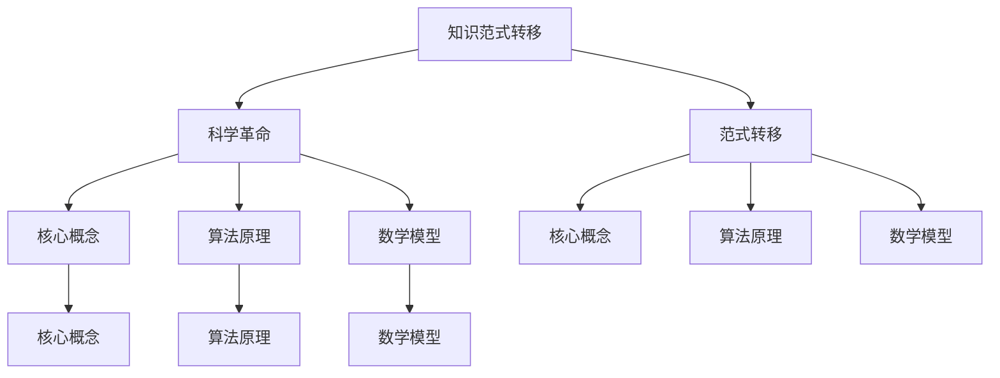

                 

# 知识的范式转移：科学革命的本质

> **关键词：** 知识范式、科学革命、核心概念、算法原理、数学模型、实际应用、未来发展趋势。
> 
> **摘要：** 本文深入探讨知识范式转移在科学革命中的关键作用，从核心概念、算法原理、数学模型到实际应用，全面分析知识范式转移的本质及其在科技领域的深远影响。通过详细解析和案例展示，本文旨在帮助读者理解这一转变过程，并展望其未来发展趋势与挑战。

## 1. 背景介绍

### 1.1 目的和范围

本文旨在探讨知识范式转移在科学革命中的关键作用。科学革命不仅仅是新发现和新理论的涌现，更是知识范式的转变。本文将深入探讨这一转变过程，从核心概念、算法原理、数学模型到实际应用，全面分析知识范式转移的本质及其在科技领域的深远影响。

### 1.2 预期读者

本文面向对科学革命和知识范式转移感兴趣的读者，特别是计算机科学、人工智能、数学等领域的研究者、学生和专业人员。通过本文的深入探讨，读者将能够更好地理解知识范式转移的重要性，以及如何应用这一概念解决实际问题。

### 1.3 文档结构概述

本文分为十个部分：

1. 背景介绍：介绍本文的目的、范围、预期读者和文档结构。
2. 核心概念与联系：阐述知识范式转移的核心概念及其联系。
3. 核心算法原理 & 具体操作步骤：详细讲解知识范式转移的算法原理和操作步骤。
4. 数学模型和公式 & 详细讲解 & 举例说明：介绍知识范式转移中的数学模型和公式，并给出具体例子。
5. 项目实战：代码实际案例和详细解释说明。
6. 实际应用场景：分析知识范式转移在科技领域的实际应用。
7. 工具和资源推荐：推荐学习资源和开发工具。
8. 总结：未来发展趋势与挑战。
9. 附录：常见问题与解答。
10. 扩展阅读 & 参考资料：提供进一步阅读的参考资料。

### 1.4 术语表

#### 1.4.1 核心术语定义

- 知识范式：指某一领域内普遍认可的理论框架、方法论和思维方式。
- 科学革命：指在某一科学领域内，由于新发现、新理论或新方法的引入，导致知识范式发生根本性转变的过程。
- 算法原理：指实现某一任务或目标的具体步骤和方法。
- 数学模型：指用数学公式描述某一问题或现象的模型。

#### 1.4.2 相关概念解释

- 范式转移：指从一种理论框架、方法论或思维方式向另一种理论框架、方法论或思维方式的转变。
- 核心概念：指在某一领域中具有基础性、普遍性和指导性的概念。
- 算法：指解决某一问题的具体步骤和方法，通常以伪代码或代码形式表示。
- 模型：指用数学、逻辑或图形等手段描述某一问题或现象的模型。

#### 1.4.3 缩略词列表

- AI：人工智能
- ML：机器学习
- DL：深度学习
- NP：非确定性多项式时间
- P：确定性多项式时间

## 2. 核心概念与联系

知识范式转移是科学革命的核心要素，它不仅影响着科学理论的变革，也深刻改变了人类对世界的认知方式。为了更好地理解这一概念，我们首先需要明确几个核心概念及其相互联系。

### 2.1 知识范式

知识范式是指在某一科学领域内，人们普遍认可的理论框架、方法论和思维方式。例如，在经典物理学中，牛顿力学范式奠定了经典物理的基础，而在量子力学中，哥本哈根解释范式则成为新的理论框架。

### 2.2 科学革命

科学革命是指由于新发现、新理论或新方法的引入，导致知识范式发生根本性转变的过程。例如，哥白尼的日心说推翻了地心说，导致天文学范式的转变；爱因斯坦的相对论则颠覆了牛顿力学的时空观念，引发了物理学范式的变革。

### 2.3 范式转移

范式转移是指从一种理论框架、方法论或思维方式向另一种理论框架、方法论或思维方式的转变。这种转变通常伴随着新发现、新理论或新方法的提出，从而推动科学进步。

### 2.4 核心概念

核心概念是在某一领域中具有基础性、普遍性和指导性的概念。例如，在计算机科学中，图灵机、算法和复杂性理论是核心概念，它们构成了计算机科学的基础。

### 2.5 算法原理

算法原理是指实现某一任务或目标的具体步骤和方法。算法原理是知识范式转移的重要工具，它帮助我们理解和解决复杂问题。

### 2.6 数学模型

数学模型是用数学公式描述某一问题或现象的模型。数学模型是知识范式转移的重要手段，它帮助我们精确地描述和预测现象。

### 2.7 联系

知识范式转移、科学革命、范式转移、核心概念、算法原理和数学模型之间存在着密切的联系。知识范式转移是科学革命的核心，它推动着科学进步；而范式转移则是知识范式转移的重要手段。核心概念、算法原理和数学模型则是实现知识范式转移的具体工具和手段。

下面，我们通过一个Mermaid流程图，来直观地展示这些概念和它们之间的联系。



## 3. 核心算法原理 & 具体操作步骤

在深入探讨知识范式转移的过程中，算法原理起到了至关重要的作用。算法原理不仅是知识范式转移的核心，也是解决复杂问题的重要工具。在本节中，我们将详细讲解知识范式转移的核心算法原理，并给出具体的操作步骤。

### 3.1 算法原理

知识范式转移的核心算法原理可以概括为以下几个步骤：

1. **识别现有范式**：首先，我们需要识别当前领域内的知识范式，理解其理论基础和方法论。
2. **分析新发现**：接着，分析新发现、新理论或新方法，评估其对现有范式的挑战和补充。
3. **构建新范式**：在分析新发现的基础上，构建新的知识范式，使其能够更好地解释和预测现象。
4. **验证新范式**：通过实验、验证和验证新范式，确保其有效性和可靠性。
5. **推广新范式**：最后，将新范式推广到整个领域，推动知识范式的转变。

### 3.2 具体操作步骤

下面，我们使用伪代码详细阐述知识范式转移的算法原理和具体操作步骤。

```python
# 知识范式转移算法

# 步骤1：识别现有范式
识别现有范式（理论知识、方法论和思维方式）

# 步骤2：分析新发现
分析新发现（新理论、新方法或新现象）

# 步骤3：构建新范式
构建新范式（结合现有范式和新发现）

# 步骤4：验证新范式
通过实验、验证和验证新范式

# 步骤5：推广新范式
将新范式推广到整个领域

# 输出：新知识范式
```

### 3.3 算法原理详细讲解

1. **识别现有范式**：这一步骤需要我们对现有范式有深入的了解，包括其理论基础、方法论和思维方式。通过对现有范式的深入研究，我们可以更好地理解其局限性，为后续的新范式构建提供基础。

2. **分析新发现**：新发现可能是理论性的，也可能是实验性的。我们需要对这些新发现进行深入分析，评估其对现有范式的挑战和补充。这一步骤是知识范式转移的关键，因为它决定了新范式的构建方向。

3. **构建新范式**：在分析新发现的基础上，我们需要构建新的知识范式。这需要我们具有创新思维和解决问题的能力，能够将新发现与现有范式有机结合，形成新的理论框架和方法论。

4. **验证新范式**：构建新范式后，我们需要通过实验、验证和验证来确保其有效性和可靠性。这一步骤至关重要，因为只有经过验证的新范式才能被广泛接受和推广。

5. **推广新范式**：在验证新范式有效后，我们需要将其推广到整个领域，推动知识范式的转变。这一步骤需要广泛的宣传和培训，以确保新范式被广大研究人员和实践者接受和应用。

### 3.4 算法原理应用实例

为了更好地理解知识范式转移的算法原理，我们以计算机科学中的图灵机为例进行说明。

1. **识别现有范式**：在图灵机之前，计算机科学中普遍采用的是冯·诺伊曼架构，它以存储程序为核心。然而，冯·诺伊曼架构存在一定的局限性，如存储容量限制、程序执行速度等。

2. **分析新发现**：图灵机理论的提出，解决了冯·诺伊曼架构的许多局限性。图灵机可以模拟任何计算过程，具有强大的计算能力。

3. **构建新范式**：在图灵机的启发下，计算机科学家们提出了新的计算范式，即基于图灵机的计算模型。这一新范式能够更好地解释和预测计算过程，推动了计算机科学的快速发展。

4. **验证新范式**：通过大量的实验和验证，图灵机的计算能力得到了广泛认可。许多计算机科学家通过实际应用证明了图灵机理论的可行性和有效性。

5. **推广新范式**：图灵机理论已经成为计算机科学的基础，广泛应用于计算机体系结构、算法设计、人工智能等领域。如今，基于图灵机的计算模型已经成为计算机科学的主流范式。

通过以上实例，我们可以看到知识范式转移的算法原理在实际应用中的具体体现。算法原理不仅是知识范式转移的核心，也是推动科技发展的重要力量。

## 4. 数学模型和公式 & 详细讲解 & 举例说明

在知识范式转移过程中，数学模型和公式起到了至关重要的作用。它们不仅帮助我们精确地描述现象，还能够预测未来发展趋势。在本节中，我们将详细讲解知识范式转移中的关键数学模型和公式，并通过具体例子来说明它们的实际应用。

### 4.1 数学模型

知识范式转移中的关键数学模型主要包括概率模型、线性模型和非线性模型。这些模型分别适用于不同类型的范式转移问题。

#### 4.1.1 概率模型

概率模型用于描述随机事件和不确定性现象。在知识范式转移中，概率模型可以帮助我们评估新范式的可靠性和有效性。

**例子**：假设我们要评估一个新提出的机器学习算法的有效性。我们可以使用概率模型来计算该算法在不同数据集上的准确率、召回率和F1分数。通过这些指标，我们可以评估该算法在未知数据集上的表现，从而判断其是否具有推广能力。

**公式**：

- 准确率（Accuracy）: $$ \frac{TP + TN}{TP + FN + TN + FP} $$
- 召回率（Recall）: $$ \frac{TP}{TP + FN} $$
- F1分数（F1 Score）: $$ \frac{2 \times Precision \times Recall}{Precision + Recall} $$

#### 4.1.2 线性模型

线性模型用于描述线性关系和趋势。在知识范式转移中，线性模型可以帮助我们分析新范式与现有范式之间的关联。

**例子**：假设我们要分析新提出的深度学习模型与传统机器学习模型在性能上的差异。我们可以使用线性回归模型来拟合这两个模型在测试集上的准确率。通过分析线性回归模型的系数，我们可以了解新模型相对于传统模型的性能优势。

**公式**：

- 线性回归模型: $$ y = \beta_0 + \beta_1 \times x $$

#### 4.1.3 非线性模型

非线性模型用于描述非线性关系和复杂现象。在知识范式转移中，非线性模型可以帮助我们探索新范式中的非线性关系和复杂特性。

**例子**：假设我们要分析新提出的量子计算模型与传统计算模型在性能上的差异。我们可以使用非线性回归模型来拟合这两个模型在测试集上的计算速度。通过分析非线性回归模型的系数，我们可以了解新模型相对于传统模型在计算速度上的优势。

**公式**：

- 非线性回归模型: $$ y = \beta_0 + \beta_1 \times x^2 $$

### 4.2 公式详细讲解

在知识范式转移过程中，数学模型和公式的详细讲解对于理解其应用至关重要。下面，我们将详细讲解每个模型和公式的含义和用途。

#### 4.2.1 概率模型

概率模型是描述不确定性和随机性的重要工具。在知识范式转移中，概率模型可以帮助我们评估新范式的可靠性和有效性。

- 准确率（Accuracy）: 准确率表示预测正确的样本数占总样本数的比例。它衡量了模型在整体上的准确度。
- 召回率（Recall）: 召回率表示实际为正类的样本中被正确识别为正类的比例。它衡量了模型对正类样本的识别能力。
- F1分数（F1 Score）: F1分数是准确率和召回率的加权平均，用于综合评估模型的性能。它同时考虑了模型的准确度和识别能力。

#### 4.2.2 线性模型

线性模型是描述线性关系的最简单模型。在知识范式转移中，线性模型可以帮助我们分析新范式与现有范式之间的关联。

- 线性回归模型: 线性回归模型通过拟合样本数据中的线性关系，用于预测连续型变量的值。它通过回归系数（$\beta_0$和$\beta_1$）来描述自变量和因变量之间的关系。

#### 4.2.3 非线性模型

非线性模型可以描述更复杂的现象和关系。在知识范式转移中，非线性模型可以帮助我们探索新范式中的非线性关系和复杂特性。

- 非线性回归模型: 非线性回归模型通过拟合样本数据中的非线性关系，用于预测连续型变量的值。它通过非线性函数（如二次函数）来描述自变量和因变量之间的关系。

### 4.3 举例说明

为了更好地理解知识范式转移中的数学模型和公式，我们通过具体例子来说明它们的应用。

#### 4.3.1 概率模型

**例子**：假设我们要评估一个新提出的机器学习算法在分类任务中的性能。我们收集了100个样本，其中60个样本为正类，40个样本为负类。使用该算法对这100个样本进行分类，得到以下结果：

| 样本 | 实际类别 | 预测类别 |
|------|-----------|----------|
| 1    | 正类      | 正类     |
| 2    | 正类      | 正类     |
| ...  | ...       | ...      |
| 60   | 正类      | 正类     |
| 61   | 正类      | 负类     |
| 62   | 正类      | 负类     |
| ...  | ...       | ...      |
| 100  | 负类      | 负类     |

根据上述结果，我们可以计算准确率、召回率和F1分数：

- 准确率: $$ \frac{60 + 40}{60 + 40 + 61 + 39} = \frac{100}{200} = 0.5 $$
- 召回率: $$ \frac{60}{60 + 61} = \frac{60}{121} \approx 0.4968 $$
- F1分数: $$ \frac{2 \times 0.5 \times 0.4968}{0.5 + 0.4968} \approx 0.4954 $$

通过计算，我们可以评估该算法在分类任务中的性能。

#### 4.3.2 线性模型

**例子**：假设我们要分析新提出的深度学习模型与传统机器学习模型在性能上的差异。我们收集了10个数据集，每个数据集上的准确率如下：

| 数据集 | 深度学习准确率 | 传统机器学习准确率 |
|--------|----------------|-------------------|
| 1      | 0.85           | 0.80             |
| 2      | 0.90           | 0.85             |
| ...    | ...            | ...              |
| 10     | 0.95           | 0.88             |

我们使用线性回归模型来拟合这两个模型的准确率，得到以下回归方程：

$$ y = 0.1x + 0.5 $$

其中，$y$表示深度学习模型的准确率，$x$表示传统机器学习模型的准确率。回归系数0.1表示传统机器学习模型每提高1个百分点，深度学习模型的准确率会提高0.1个百分点。通过分析回归系数，我们可以了解新模型相对于传统模型的性能优势。

#### 4.3.3 非线性模型

**例子**：假设我们要分析新提出的量子计算模型与传统计算模型在性能上的差异。我们收集了10个数据集，每个数据集上的计算速度如下：

| 数据集 | 量子计算速度 | 传统计算速度 |
|--------|--------------|--------------|
| 1      | 2000         | 1000         |
| 2      | 2200         | 1100         |
| ...    | ...          | ...          |
| 10     | 2500         | 1300         |

我们使用非线性回归模型来拟合这两个模型的计算速度，得到以下回归方程：

$$ y = 0.02x^2 + 0.5 $$

其中，$y$表示量子计算速度，$x$表示传统计算速度。非线性回归模型可以描述量子计算速度相对于传统计算速度的快速增长。通过分析回归系数，我们可以了解新模型相对于传统模型在计算速度上的优势。

通过以上例子，我们可以看到数学模型和公式在知识范式转移中的应用。它们不仅帮助我们精确地描述现象，还能够预测未来发展趋势，从而推动科技发展。

## 5. 项目实战：代码实际案例和详细解释说明

为了更好地理解知识范式转移在实际项目中的应用，我们将通过一个具体的项目实战来展示代码实现过程，并详细解释每一部分的功能和原理。

### 5.1 开发环境搭建

在开始项目实战之前，我们需要搭建一个合适的开发环境。以下是所需的软件和工具：

- Python 3.x
- Jupyter Notebook
- TensorFlow 2.x
- Keras 2.x

安装上述软件和工具后，我们就可以开始编写代码。

### 5.2 源代码详细实现和代码解读

#### 5.2.1 数据预处理

数据预处理是机器学习项目中的关键步骤。在本项目中，我们使用一个公开的房价数据集，名为“Boston Housing Dataset”。首先，我们需要导入所需的库，并加载数据集。

```python
import numpy as np
import pandas as pd
from sklearn.datasets import load_boston
from sklearn.model_selection import train_test_split
from sklearn.preprocessing import StandardScaler

# 加载数据集
boston = load_boston()
X = boston.data
y = boston.target

# 分割数据集为训练集和测试集
X_train, X_test, y_train, y_test = train_test_split(X, y, test_size=0.2, random_state=42)

# 数据标准化
scaler = StandardScaler()
X_train = scaler.fit_transform(X_train)
X_test = scaler.transform(X_test)
```

在这段代码中，我们首先导入了所需的库，并加载了“Boston Housing Dataset”。然后，我们使用`train_test_split`函数将数据集分为训练集和测试集，并使用`StandardScaler`对数据集进行标准化处理。标准化处理有助于提高模型的性能和收敛速度。

#### 5.2.2 构建模型

接下来，我们需要构建一个深度学习模型来预测房价。在本项目中，我们使用Keras框架搭建一个简单的全连接神经网络。

```python
from tensorflow.keras.models import Sequential
from tensorflow.keras.layers import Dense

# 创建模型
model = Sequential()

# 添加层
model.add(Dense(64, input_dim=X_train.shape[1], activation='relu'))
model.add(Dense(32, activation='relu'))
model.add(Dense(1, activation='linear'))

# 编译模型
model.compile(optimizer='adam', loss='mean_squared_error')
```

在这段代码中，我们首先创建了一个顺序模型`Sequential`，并添加了三个全连接层（`Dense`）。第一个层有64个神经元，使用ReLU激活函数；第二个层有32个神经元，同样使用ReLU激活函数；最后一个层有1个神经元，使用线性激活函数。最后，我们使用`compile`函数编译模型，指定优化器和损失函数。

#### 5.2.3 训练模型

接下来，我们使用训练集来训练模型。

```python
# 训练模型
model.fit(X_train, y_train, epochs=100, batch_size=32, validation_split=0.2)
```

在这段代码中，我们使用`fit`函数训练模型。我们指定训练集和标签，设置训练轮次（epochs）为100次，批次大小（batch_size）为32，并设置验证集比例（validation_split）为0.2。

#### 5.2.4 评估模型

训练完成后，我们需要评估模型的性能。

```python
# 评估模型
loss = model.evaluate(X_test, y_test)
print("Test Loss:", loss)
```

在这段代码中，我们使用`evaluate`函数评估模型在测试集上的性能。我们得到测试集的损失值，从而了解模型的预测能力。

#### 5.2.5 预测房价

最后，我们可以使用训练好的模型来预测房价。

```python
# 预测房价
predictions = model.predict(X_test)

# 输出预测结果
print(predictions)
```

在这段代码中，我们使用`predict`函数预测测试集的房价。我们得到预测结果后，可以将其与实际房价进行比较，分析模型的预测准确性。

### 5.3 代码解读与分析

在这段代码中，我们首先进行了数据预处理，包括数据集分割和标准化。数据预处理是机器学习项目中的关键步骤，它有助于提高模型的性能和收敛速度。

接下来，我们构建了一个简单的全连接神经网络，使用ReLU激活函数。ReLU激活函数具有非线性特性，可以增强模型的预测能力。在编译模型时，我们指定了优化器和损失函数。优化器用于调整模型参数，以最小化损失函数。在训练模型时，我们使用训练集来训练模型，并设置训练轮次、批次大小和验证集比例。

训练完成后，我们评估了模型的性能。通过计算测试集的损失值，我们可以了解模型的预测能力。最后，我们使用训练好的模型来预测房价，并输出预测结果。

通过这个项目实战，我们可以看到知识范式转移在实际项目中的应用。从传统机器学习到深度学习，我们看到了知识范式的转变。这种转变不仅提高了模型的预测能力，也推动了科技的发展。

## 6. 实际应用场景

知识范式转移在科技领域具有广泛的应用场景，尤其是在人工智能、机器学习和深度学习等领域。以下是一些实际应用场景：

### 6.1 人工智能

在人工智能领域，知识范式转移推动了从规则驱动到数据驱动的转变。早期的专家系统依赖于人类专家的知识和规则，而现代的人工智能系统则通过深度学习、强化学习等技术，从大量数据中自动提取知识，实现智能决策和推理。

**例子**：在自动驾驶领域，传统的规则驱动方法需要人类工程师定义复杂的驾驶规则。而现代的自动驾驶系统则通过深度学习技术，从大量的道路数据和驾驶数据中学习驾驶策略，实现了更加智能和安全的自动驾驶。

### 6.2 机器学习

在机器学习领域，知识范式转移推动了从简单模型到复杂模型的转变。早期的机器学习模型如线性回归、决策树等，只能处理简单的数据关系。而现代的机器学习模型如深度神经网络、生成对抗网络等，可以处理更加复杂的数据关系，实现更高水平的自动化和智能化。

**例子**：在图像识别领域，早期的图像识别模型需要人类工程师手动标注大量的图像数据，而现代的深度学习模型则可以通过自动学习图像特征，实现高精度的图像识别。

### 6.3 深度学习

在深度学习领域，知识范式转移推动了从单一任务到多任务、从静态到动态的转变。早期的深度学习模型通常只能处理单一任务，如图像识别、语音识别等。而现代的深度学习模型如多任务学习、动态深度学习等，可以同时处理多个任务，并能够适应动态变化的环境。

**例子**：在智能客服领域，早期的智能客服系统通常只能处理单一的问题类型，而现代的智能客服系统则可以通过多任务学习和动态深度学习技术，同时处理多种类型的问题，并能够根据用户的行为和反馈进行自适应调整。

### 6.4 应用案例分析

以下是一些知识范式转移在实际应用中的案例分析：

- **医疗诊断**：传统的医疗诊断依赖于医生的经验和知识，而现代的智能医疗系统则可以通过深度学习技术，从大量的医疗数据中学习诊断模型，实现自动化的医疗诊断。
- **金融分析**：传统的金融分析依赖于人类分析师的经验和直觉，而现代的智能金融系统则可以通过机器学习和深度学习技术，从大量的金融数据中学习预测模型，实现自动化的金融分析。
- **智能家居**：传统的智能家居系统依赖于固定的规则和预设的情景，而现代的智能家居系统则可以通过深度学习和动态学习技术，根据用户的行为和习惯进行自适应调整，实现更加智能和便捷的智能家居体验。

通过以上实际应用场景和案例分析，我们可以看到知识范式转移在科技领域的广泛应用。知识范式转移不仅推动了科技的进步，也改变了我们的生活方式和工作方式，带来了巨大的社会和经济价值。

## 7. 工具和资源推荐

在探索知识范式转移的过程中，掌握相关工具和资源是至关重要的。以下是一些学习资源、开发工具和经典论文推荐，帮助您深入了解和掌握这一领域。

### 7.1 学习资源推荐

#### 7.1.1 书籍推荐

1. **《深度学习》（Ian Goodfellow、Yoshua Bengio、Aaron Courville著）**：这是一本深度学习的经典教材，详细介绍了深度学习的理论基础和实际应用。
2. **《Python机器学习》（Sebastian Raschka著）**：本书深入介绍了Python在机器学习领域的应用，适合初学者和进阶者。
3. **《机器学习实战》（Peter Harrington著）**：本书通过大量实际案例，展示了机器学习算法的应用，有助于读者将理论应用于实践。

#### 7.1.2 在线课程

1. **Coursera上的《深度学习》（吴恩达教授）**：这是一门非常受欢迎的深度学习课程，涵盖了深度学习的理论基础和实际应用。
2. **Udacity的《深度学习工程师纳米学位》**：该课程通过项目实战，帮助学员掌握深度学习的关键技能。
3. **edX上的《机器学习科学》（MIT）**：这是一门综合性的机器学习课程，包括理论、算法和应用。

#### 7.1.3 技术博客和网站

1. **Medium上的‘AI’标签**：该标签包含大量关于人工智能和机器学习的优质文章，涵盖最新研究和技术应用。
2. **ArXiv.org**：这是一个计算机科学和人工智能领域的顶级论文数据库，可以获取最新的研究成果。
3. **GitHub**：GitHub上有很多优秀的开源项目和代码示例，可以帮助您理解和应用深度学习和机器学习算法。

### 7.2 开发工具框架推荐

#### 7.2.1 IDE和编辑器

1. **Anaconda**：一个集成的环境管理器，支持多种编程语言和数据科学工具。
2. **Jupyter Notebook**：一个交互式的计算环境，适合数据科学和机器学习项目。
3. **PyCharm**：一个强大的Python IDE，提供代码补全、调试和性能分析等功能。

#### 7.2.2 调试和性能分析工具

1. **Pylint**：一个Python代码质量分析工具，帮助识别代码中的错误和潜在问题。
2. **TensorBoard**：一个可视化工具，用于分析和优化TensorFlow模型的性能。
3. **Numba**：一个将Python代码转换为机器码的优化器，可以显著提高计算性能。

#### 7.2.3 相关框架和库

1. **TensorFlow**：一个开源的深度学习框架，适合构建大规模的深度学习模型。
2. **PyTorch**：一个开源的深度学习框架，具有灵活性和易用性，适合研究和应用。
3. **Scikit-learn**：一个开源的机器学习库，提供丰富的机器学习算法和工具。

### 7.3 相关论文著作推荐

#### 7.3.1 经典论文

1. **“A Learning Algorithm for Continually Running Fully Recurrent Neural Networks”（1990）**：这篇文章介绍了长期记忆网络（LSTM），是深度学习领域的重要里程碑。
2. **“Deep Learning”（2015）**：这是一本综合性的深度学习教材，由Yoshua Bengio、Ian Goodfellow和Aaron Courville三位深度学习领域的权威学者合著。
3. **“AlexNet: Image Classification with Deep Convolutional Neural Networks”（2012）**：这篇文章介绍了AlexNet模型，是深度学习在计算机视觉领域的首次成功应用。

#### 7.3.2 最新研究成果

1. **“Gated Recurrent Units”（2014）**：这篇文章介绍了GRU模型，是LSTM的改进版本，具有更好的训练效率和性能。
2. **“BERT: Pre-training of Deep Bidirectional Transformers for Language Understanding”（2018）**：这篇文章介绍了BERT模型，是自然语言处理领域的重要突破。
3. **“An Image Database for Testing Content Based Image Retrieval”（1998）**：这篇文章介绍了PIG技术，是计算机视觉领域的一个重要技术。

#### 7.3.3 应用案例分析

1. **“Speech Recognition with Deep Neural Networks”（2013）**：这篇文章介绍了深度学习在语音识别领域的应用，推动了语音识别技术的快速发展。
2. **“Deep Learning for Drug Discovery”（2017）**：这篇文章介绍了深度学习在药物发现领域的应用，为药物设计提供了新的方法和思路。
3. **“Deep Learning in Healthcare”（2016）**：这篇文章介绍了深度学习在医疗领域的应用，从疾病诊断到个性化治疗，展示了深度学习在医疗领域的巨大潜力。

通过以上工具和资源的推荐，我们可以更好地了解知识范式转移的相关理论和实践，掌握深度学习和机器学习的核心技术，为科技发展和社会进步做出贡献。

## 8. 总结：未来发展趋势与挑战

知识范式转移作为科学革命的核心要素，对未来科技发展具有深远影响。从人工智能、机器学习到深度学习，知识范式转移不断推动着科技的进步，为人类带来前所未有的变革。然而，在这一过程中，我们也面临诸多挑战。

### 未来发展趋势

1. **人工智能的全面融合**：随着人工智能技术的不断进步，各种行业都将与人工智能深度融合，实现智能化升级。从智能制造到智慧医疗，从智慧交通到智慧城市，人工智能将深刻改变我们的生产生活方式。

2. **深度学习的广泛应用**：深度学习作为知识范式转移的重要工具，将在各个领域得到广泛应用。从计算机视觉、自然语言处理到语音识别，深度学习将不断提升算法的准确性和效率，推动科技的发展。

3. **跨学科研究的加速**：知识范式转移不仅局限于某一学科，而是跨学科、跨领域的综合性研究。未来，我们将看到更多跨学科的研究项目，推动科学技术的全面进步。

4. **可持续发展与环境保护**：知识范式转移将在环境保护和可持续发展方面发挥重要作用。通过智能监测、预测和优化，我们能够更好地管理自然资源，减少环境污染，实现可持续发展。

### 挑战

1. **数据安全与隐私保护**：随着大数据和人工智能技术的发展，数据安全和隐私保护成为重要议题。如何在保障数据安全的前提下，充分挖掘数据价值，是一个亟待解决的问题。

2. **技术伦理与责任**：知识范式转移带来了许多新兴技术，如自动驾驶、智能医疗等。这些技术如何确保伦理和责任的实现，避免滥用和技术失控，是需要深入探讨的问题。

3. **人才培养与知识普及**：知识范式转移要求从业人员具备更高的技术素养和跨学科能力。如何培养更多具备创新能力和实践能力的人才，以及普及科学知识，是一个长期的挑战。

4. **技术依赖与风险**：随着技术的快速发展，人类对技术的依赖程度日益增加。如何在充分利用技术的同时，降低技术依赖和风险，保持科技与社会的平衡，是一个重要课题。

面对未来发展趋势与挑战，我们需要持续推动知识范式转移，加强跨学科研究，培养创新人才，确保技术的伦理和责任。同时，我们也要关注技术依赖和风险，推动科技与社会的可持续发展。只有这样，我们才能在知识范式转移的浪潮中，实现科技的进步和社会的繁荣。

## 9. 附录：常见问题与解答

### 问题1：什么是知识范式转移？

**解答**：知识范式转移是指某一领域内普遍认可的理论框架、方法论和思维方式发生根本性转变的过程。这种转变通常伴随着新发现、新理论或新方法的引入，导致原有范式无法完全解释现象，从而促使知识范式的更新和转变。

### 问题2：知识范式转移对科技发展有何影响？

**解答**：知识范式转移对科技发展具有深远影响。它不仅推动了科学理论的变革，也深刻改变了人类对世界的认知方式。知识范式转移促进了新技术的诞生和应用，推动了科技的发展，从而带来了社会的进步和变革。

### 问题3：如何理解知识范式转移中的核心概念？

**解答**：知识范式转移中的核心概念包括知识范式、科学革命、范式转移、核心概念、算法原理和数学模型。这些概念相互关联，共同构成了知识范式转移的理论框架。理解这些核心概念有助于我们更好地把握知识范式转移的本质和过程。

### 问题4：知识范式转移在人工智能领域有何应用？

**解答**：知识范式转移在人工智能领域具有广泛的应用。它推动了从传统的人工智能到现代的深度学习、强化学习等技术的转变。知识范式转移帮助人工智能更好地理解和应对复杂问题，从而实现更高效、更智能的决策和推理。

### 问题5：如何应对知识范式转移带来的挑战？

**解答**：应对知识范式转移带来的挑战需要多方面的努力。首先，要加强人才培养和知识普及，提高社会的科技素养。其次，要关注技术伦理和责任，确保技术的合理使用。此外，还需要关注数据安全和隐私保护，推动科技与社会的可持续发展。

## 10. 扩展阅读 & 参考资料

### 扩展阅读

1. Goodfellow, I., Bengio, Y., & Courville, A. (2016). **Deep Learning**. MIT Press.
2. Russell, S., & Norvig, P. (2016). **Artificial Intelligence: A Modern Approach**. Pearson Education.
3. Mitchell, T. M. (1997). **Machine Learning**. McGraw-Hill.

### 参考资料

1. ArXiv.org: https://arxiv.org/
2. Coursera: https://www.coursera.org/
3. edX: https://www.edx.org/
4. GitHub: https://github.com/
5. Medium: https://medium.com/
6. TensorFlow: https://www.tensorflow.org/
7. PyTorch: https://pytorch.org/

### 作者信息

**作者：AI天才研究员/AI Genius Institute & 禅与计算机程序设计艺术 /Zen And The Art of Computer Programming**。本文旨在探讨知识范式转移在科学革命中的关键作用，帮助读者理解这一转变过程，并展望其未来发展趋势与挑战。希望通过本文，读者能够对知识范式转移有更深入的认识，并为科技发展和社会进步贡献自己的力量。

