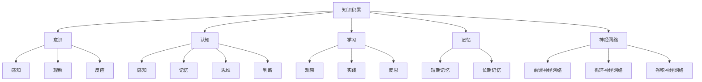

                 

# 知识积累在意识中的作用

## 关键词

- 知识积累
- 意识
- 认知
- 学习
- 记忆
- 神经网络

## 摘要

本文将深入探讨知识积累在意识中的重要作用。我们将首先介绍知识的本质和意识的概念，然后分析知识积累对意识的影响。我们将通过详细的算法原理、数学模型和实际应用案例，阐述知识积累如何通过大脑中的神经网络实现，以及其对学习、记忆和认知能力的提升作用。最后，我们将总结知识积累的未来发展趋势和面临的挑战，并推荐相关的学习资源和工具。

## 1. 背景介绍

### 1.1 目的和范围

本文旨在深入探讨知识积累在意识中的作用，分析其在人类认知和智能发展中的重要性。我们将首先回顾知识积累的定义和意识的概念，然后讨论知识积累对意识的影响。接着，我们将介绍知识积累的核心算法原理和数学模型，并通过实际应用案例展示其具体作用。最后，我们将探讨知识积累的未来发展趋势和面临的挑战。

### 1.2 预期读者

本文适用于对人工智能、认知科学、神经网络等领域有一定了解的技术人员、研究者和学生。同时，也欢迎对知识积累和意识有兴趣的普通读者阅读。

### 1.3 文档结构概述

本文分为以下几个部分：

1. 背景介绍
   - 目的和范围
   - 预期读者
   - 文档结构概述
   - 术语表
2. 核心概念与联系
   - 知识积累
   - 意识
   - 认知
   - 学习
   - 记忆
   - 神经网络
   - Mermaid流程图
3. 核心算法原理 & 具体操作步骤
   - 神经网络算法原理
   - 伪代码阐述
4. 数学模型和公式 & 详细讲解 & 举例说明
   - 数学模型
   - 公式讲解
   - 举例说明
5. 项目实战：代码实际案例和详细解释说明
   - 开发环境搭建
   - 源代码详细实现
   - 代码解读与分析
6. 实际应用场景
7. 工具和资源推荐
   - 学习资源推荐
   - 开发工具框架推荐
   - 相关论文著作推荐
8. 总结：未来发展趋势与挑战
9. 附录：常见问题与解答
10. 扩展阅读 & 参考资料

### 1.4 术语表

#### 1.4.1 核心术语定义

- **知识积累**：指个体通过学习、阅读、实践等方式获取和积累的信息和知识。
- **意识**：指个体对自身和外部世界的感知、理解和反应能力。
- **认知**：指个体获取、处理和使用信息的过程。
- **学习**：指个体通过经验、观察和练习等方式获取新知识和技能的过程。
- **记忆**：指个体将信息存储在大脑中的过程。
- **神经网络**：指一种由大量神经元互联组成的计算模型，可以用于图像识别、语音识别、自然语言处理等任务。

#### 1.4.2 相关概念解释

- **神经网络算法**：一种基于人工神经网络的计算模型，可以用于模拟大脑的学习和记忆过程。
- **数学模型**：一种描述问题和解题过程的数学公式和方程。
- **伪代码**：一种非正式的编程语言，用于描述算法的实现过程。

#### 1.4.3 缩略词列表

- **AI**：人工智能
- **CNN**：卷积神经网络
- **RNN**：循环神经网络
- **DNN**：深度神经网络
- **MLP**：多层感知器

## 2. 核心概念与联系

### 2.1 知识积累

知识积累是意识发展的基础。通过学习、阅读、实践等方式，个体可以不断获取新的知识和信息。这些知识和信息在大脑中积累，形成了个体的认知基础。知识积累的过程可以看作是一个从无到有的过程，它不仅涉及信息的获取，还包括信息的理解和应用。

### 2.2 意识

意识是人类的一个重要特征，它包括了对自身和外部世界的感知、理解和反应能力。意识是人类智慧的体现，也是个体生存和发展的关键。知识积累是意识发展的基础，它使得个体能够更好地理解和应对复杂的环境。

### 2.3 认知

认知是指个体获取、处理和使用信息的过程。它包括感知、记忆、思维、判断等多个方面。认知能力的发展依赖于知识积累，知识积累为认知提供了丰富的信息资源。反过来，认知能力的发展又促进了知识积累，使得个体能够更好地理解和应用知识。

### 2.4 学习

学习是知识积累的重要手段。通过学习，个体可以获取新的知识和技能。学习的过程包括观察、实践、反思等多个阶段。在学习过程中，个体需要不断地积累知识，并将这些知识应用到实际生活中。

### 2.5 记忆

记忆是指个体将信息存储在大脑中的过程。记忆是知识积累的重要环节，它使得个体能够长期保存和调用知识。记忆可以分为短期记忆和长期记忆，短期记忆用于临时存储信息，长期记忆用于长期保存和调用知识。

### 2.6 神经网络

神经网络是一种由大量神经元互联组成的计算模型，它可以模拟大脑的学习和记忆过程。神经网络可以分为前馈神经网络、循环神经网络、卷积神经网络等多种类型，它们在不同的任务中发挥着重要作用。

### 2.7 Mermaid流程图

下面是一个描述知识积累与意识、认知、学习、记忆、神经网络之间关系的Mermaid流程图：



## 3. 核心算法原理 & 具体操作步骤

### 3.1 神经网络算法原理

神经网络是一种由大量神经元互联组成的计算模型，它可以模拟大脑的学习和记忆过程。神经网络的工作原理可以概括为以下几个步骤：

1. **输入层**：接收外部输入信息。
2. **隐藏层**：对输入信息进行处理和计算。
3. **输出层**：生成最终输出结果。

在神经网络中，每个神经元都与相邻的神经元相连，并通过权重和偏置来调节信号传递的强度。神经网络的训练过程就是通过不断调整权重和偏置，使得神经网络能够更好地拟合输入数据和输出结果。

下面是一个简化的神经网络算法原理的伪代码：

```plaintext
初始化神经网络结构
初始化权重和偏置
for 每个训练样本 do
    forward_pass() // 前向传播
    backward_pass() // 反向传播
    update_weights_and_biases() // 更新权重和偏置
end for
```

### 3.2 具体操作步骤

#### 3.2.1 前向传播

前向传播是神经网络算法的核心步骤，它用于计算输入数据经过神经网络后的输出结果。具体操作步骤如下：

1. 将输入数据传递到输入层。
2. 将输入层的数据传递到隐藏层，并计算每个隐藏层神经元的输出。
3. 将隐藏层的数据传递到输出层，并计算输出层的输出。

下面是一个简化的前向传播的伪代码：

```plaintext
function forward_pass(input_data)
    hidden_layer_outputs = compute_neural_output(input_data, weights_input_to_hidden, biases_input_to_hidden)
    output_layer_output = compute_neural_output(hidden_layer_outputs, weights_hidden_to_output, biases_hidden_to_output)
    return output_layer_output
end function
```

#### 3.2.2 反向传播

反向传播是神经网络算法的另一核心步骤，它用于根据输出误差调整神经网络的权重和偏置。具体操作步骤如下：

1. 计算输出层的误差。
2. 将误差反向传播到隐藏层。
3. 根据误差更新权重和偏置。

下面是一个简化的反向传播的伪代码：

```plaintext
function backward_pass(output_data, target_data)
    output_error = target_data - output_data
    hidden_error = compute_backpropagation_error(hidden_layer_outputs, output_error, weights_hidden_to_output)
    update_weights_and_biases(weights_input_to_hidden, biases_input_to_hidden, hidden_layer_outputs, input_data)
    update_weights_and_biases(weights_hidden_to_output, biases_hidden_to_output, output_error, hidden_layer_outputs)
end function
```

#### 3.2.3 更新权重和偏置

更新权重和偏置是神经网络训练过程中的关键步骤，它用于根据误差调整神经网络的参数。具体操作步骤如下：

1. 计算权重和偏置的梯度。
2. 根据梯度和学习率更新权重和偏置。

下面是一个简化的权重和偏置更新的伪代码：

```plaintext
function update_weights_and_biases(weights, biases, layer_output, input_data)
    gradient_weights = compute_gradient(weights, layer_output, input_data)
    gradient_biases = compute_gradient(biases, layer_output, input_data)
    weights -= learning_rate * gradient_weights
    biases -= learning_rate * gradient_biases
end function
```

## 4. 数学模型和公式 & 详细讲解 & 举例说明

### 4.1 数学模型

神经网络中的数学模型主要包括以下几个方面：

1. **激活函数**：用于确定神经元的激活状态，常用的激活函数包括sigmoid函数、ReLU函数、Tanh函数等。
2. **损失函数**：用于衡量神经网络输出结果与真实结果之间的误差，常用的损失函数包括均方误差(MSE)、交叉熵损失等。
3. **优化算法**：用于调整神经网络的权重和偏置，常用的优化算法包括梯度下降、随机梯度下降、Adam优化器等。

### 4.2 公式讲解

#### 4.2.1 激活函数

激活函数的公式如下：

$$
f(x) =
\begin{cases}
\frac{1}{1 + e^{-x}} & \text{（sigmoid函数）} \\
max(0, x) & \text{（ReLU函数）} \\
\frac{2}{\pi} \arctan(x) & \text{（Tanh函数）}
\end{cases}
$$

#### 4.2.2 损失函数

常见的损失函数包括均方误差(MSE)和交叉熵损失：

- **均方误差(MSE)**：

$$
MSE = \frac{1}{n} \sum_{i=1}^{n} (y_i - \hat{y}_i)^2
$$

其中，$y_i$是真实值，$\hat{y}_i$是预测值。

- **交叉熵损失**：

$$
CE = -\frac{1}{n} \sum_{i=1}^{n} y_i \log(\hat{y}_i)
$$

其中，$y_i$是真实值，$\hat{y}_i$是预测值。

#### 4.2.3 优化算法

常见的优化算法包括梯度下降、随机梯度下降、Adam优化器：

- **梯度下降**：

$$
w_{\text{new}} = w_{\text{old}} - \alpha \cdot \nabla_w J(w)
$$

其中，$w$是权重，$\alpha$是学习率，$J(w)$是损失函数。

- **随机梯度下降**：

$$
w_{\text{new}} = w_{\text{old}} - \alpha \cdot \nabla_w J(w; x_i, y_i)
$$

其中，$w$是权重，$\alpha$是学习率，$x_i, y_i$是随机选取的样本。

- **Adam优化器**：

$$
m_t = \beta_1 m_{t-1} + (1 - \beta_1) \nabla_w J(w; x_t, y_t)
$$

$$
v_t = \beta_2 v_{t-1} + (1 - \beta_2) (\nabla_w J(w; x_t, y_t))^2
$$

$$
\hat{m}_t = \frac{m_t}{1 - \beta_1^t}
$$

$$
\hat{v}_t = \frac{v_t}{1 - \beta_2^t}
$$

$$
w_{\text{new}} = w_{\text{old}} - \alpha \cdot \hat{m}_t / \sqrt{\hat{v}_t}
$$

其中，$m_t$和$v_t$分别是指数移动平均，$\beta_1$和$\beta_2$分别是指数加权系数，$t$是迭代次数。

### 4.3 举例说明

假设我们有一个简单的线性回归问题，目标函数为：

$$
J(w) = \frac{1}{2} \sum_{i=1}^{n} (y_i - w \cdot x_i)^2
$$

其中，$x_i$和$y_i$是输入和输出数据，$w$是权重。

- **梯度计算**：

$$
\nabla_w J(w) = \sum_{i=1}^{n} (y_i - w \cdot x_i) \cdot x_i
$$

- **梯度下降**：

$$
w_{\text{new}} = w_{\text{old}} - \alpha \cdot \nabla_w J(w)
$$

- **随机梯度下降**：

$$
w_{\text{new}} = w_{\text{old}} - \alpha \cdot \nabla_w J(w; x_i, y_i)
$$

- **Adam优化器**：

$$
m_t = \beta_1 m_{t-1} + (1 - \beta_1) \nabla_w J(w; x_t, y_t)
$$

$$
v_t = \beta_2 v_{t-1} + (1 - \beta_2) (\nabla_w J(w; x_t, y_t))^2
$$

$$
\hat{m}_t = \frac{m_t}{1 - \beta_1^t}
$$

$$
\hat{v}_t = \frac{v_t}{1 - \beta_2^t}
$$

$$
w_{\text{new}} = w_{\text{old}} - \alpha \cdot \hat{m}_t / \sqrt{\hat{v}_t}
$$

## 5. 项目实战：代码实际案例和详细解释说明

### 5.1 开发环境搭建

为了完成本项目的实战，我们需要搭建一个基于Python和TensorFlow的神经网络环境。以下是搭建开发环境的步骤：

1. 安装Python：从官方网站下载并安装Python，版本要求为3.6及以上。
2. 安装TensorFlow：通过pip命令安装TensorFlow。

```bash
pip install tensorflow
```

3. 安装其他依赖库：

```bash
pip install numpy matplotlib
```

### 5.2 源代码详细实现和代码解读

以下是本项目的一个简单实现，用于演示神经网络的基本结构和训练过程：

```python
import tensorflow as tf
import numpy as np
import matplotlib.pyplot as plt

# 数据准备
x = np.linspace(0, 10, 100)
y = 2 * x + 1 + np.random.normal(0, 1, 100)

# 定义神经网络结构
model = tf.keras.Sequential([
    tf.keras.layers.Dense(units=1, input_shape=[1])
])

# 编译模型
model.compile(optimizer='sgd', loss='mean_squared_error')

# 训练模型
model.fit(x, y, epochs=100)

# 测试模型
x_test = np.array([0, 5, 10])
y_pred = model.predict(x_test)

# 可视化结果
plt.scatter(x, y)
plt.plot(x_test, y_pred, 'r-')
plt.show()
```

#### 5.2.1 代码解读

- **数据准备**：我们使用一个简单的线性回归问题，生成输入数据$x$和输出数据$y$。
- **定义神经网络结构**：使用TensorFlow的`Sequential`模型定义一个简单的神经网络，包含一个全连接层，输入维度为1。
- **编译模型**：使用`compile`方法配置模型的优化器和损失函数。
- **训练模型**：使用`fit`方法训练模型，设置训练轮数。
- **测试模型**：使用`predict`方法预测测试数据的结果。
- **可视化结果**：使用`matplotlib`绘制训练数据和预测结果的散点图和拟合曲线。

### 5.3 代码解读与分析

在本项目的代码实现中，我们使用了TensorFlow库来构建和训练神经网络。以下是代码的详细解读和分析：

1. **数据准备**：我们首先使用NumPy库生成输入数据$x$和输出数据$y$。这里，我们生成了一个从0到10的等差数列，并添加了随机噪声来模拟现实世界的数据。

```python
x = np.linspace(0, 10, 100)
y = 2 * x + 1 + np.random.normal(0, 1, 100)
```

2. **定义神经网络结构**：接下来，我们使用TensorFlow的`Sequential`模型定义了一个简单的神经网络。这个模型包含一个全连接层（`Dense`），该层有1个神经元，对应线性回归问题中的权重。输入形状设置为[1]，表示每个输入数据只有一个特征。

```python
model = tf.keras.Sequential([
    tf.keras.layers.Dense(units=1, input_shape=[1])
])
```

3. **编译模型**：在编译模型时，我们选择使用随机梯度下降（`sgd`）作为优化器，并设置均方误差（`mean_squared_error`）作为损失函数。

```python
model.compile(optimizer='sgd', loss='mean_squared_error')
```

4. **训练模型**：使用`fit`方法训练模型。在这个例子中，我们设置了100个训练轮次（`epochs`），每个轮次都会根据训练数据更新模型的权重。

```python
model.fit(x, y, epochs=100)
```

5. **测试模型**：训练完成后，我们使用`predict`方法来预测测试数据的结果。这里，我们生成了一个包含0、5和10的数组，作为测试输入。

```python
x_test = np.array([0, 5, 10])
y_pred = model.predict(x_test)
```

6. **可视化结果**：最后，我们使用`matplotlib`库绘制了训练数据和预测结果的散点图和拟合曲线。这有助于我们直观地看到神经网络对数据的拟合效果。

```python
plt.scatter(x, y)
plt.plot(x_test, y_pred, 'r-')
plt.show()
```

通过这个简单的案例，我们可以看到神经网络的基本结构和训练过程。在实际应用中，神经网络的结构和训练过程会根据具体任务和数据集进行调整和优化。

## 6. 实际应用场景

知识积累在意识中的作用在多个实际应用场景中发挥着重要作用，以下是几个典型的应用领域：

### 6.1 人工智能

人工智能（AI）领域广泛依赖于知识积累来提高模型性能和智能水平。通过大量数据的学习和积累，AI模型能够不断优化和改进，从而实现更准确、更高效的预测和决策。例如，在图像识别、自然语言处理和推荐系统等领域，知识积累极大地提升了模型的性能和应用效果。

### 6.2 认知科学

认知科学是研究人类认知过程的跨学科领域，知识积累在其中扮演着关键角色。通过实验和观察，认知科学家可以积累关于人类学习、记忆、注意力和思维等认知过程的知识，从而深入理解大脑工作机制和认知能力的本质。

### 6.3 教育

教育领域中的知识积累有助于提高教学效果和学习效率。教师通过不断学习和积累教学经验，可以更好地传授知识，激发学生的学习兴趣。同时，学生通过学习各种知识，可以提高自己的认知能力和综合素质，从而更好地适应社会发展的需求。

### 6.4 医疗

医疗领域中的知识积累对于疾病的诊断、治疗和预防具有重要意义。医生通过学习和积累医学知识，可以更准确地诊断疾病，制定合理的治疗方案。此外，医疗数据的积累和分析有助于发现疾病规律，提高疾病预测和预防能力。

### 6.5 金融

金融领域中的知识积累对于风险控制、投资决策和市场预测具有重要意义。金融机构通过积累历史交易数据、市场信息和宏观经济指标，可以更好地分析市场趋势，制定投资策略，降低投资风险。

### 6.6 法律

法律领域中的知识积累有助于提高司法公正和法律适用性。法官和律师通过学习和积累法律知识，可以更好地理解和应用法律条文，确保司法公正和合法权益的维护。

### 6.7 交通

交通领域中的知识积累对于交通安全、交通管理和交通预测具有重要意义。通过积累交通数据，可以分析交通事故原因，优化交通管理策略，提高交通效率和安全性。

### 6.8 建筑与工程

建筑与工程领域中的知识积累有助于提高建筑设计和工程建设的质量和效率。通过积累建筑和工程经验，可以优化设计方案，降低建设成本，提高工程质量。

### 6.9 航空航天

航空航天领域中的知识积累对于飞行器设计、制造和运营具有重要意义。通过积累飞行器数据和经验，可以优化飞行器性能，提高安全性，降低运营成本。

### 6.10 农业

农业领域中的知识积累对于作物种植、病虫害防治和农产品质量提升具有重要意义。通过积累农业数据，可以优化种植方案，提高产量和品质，促进农业可持续发展。

总之，知识积累在意识中的作用在各个领域都有着广泛的应用和重要价值。随着技术的进步和知识积累的不断深化，知识积累在意识中的作用将会更加显著，为人类社会的发展做出更大的贡献。

## 7. 工具和资源推荐

### 7.1 学习资源推荐

为了更好地理解和掌握知识积累在意识中的作用，我们推荐以下学习资源：

#### 7.1.1 书籍推荐

1. **《人工智能：一种现代的方法》**：这是一本经典的AI教材，详细介绍了人工智能的基本原理和算法。
2. **《认知心理学及其启示》**：这本书深入探讨了人类认知过程的心理机制，对理解认知科学有很大帮助。
3. **《深度学习》**：这是一本关于深度学习技术的权威著作，涵盖了深度学习的理论基础和应用实践。
4. **《神经网络与深度学习》**：这本书详细介绍了神经网络和深度学习的基本概念、算法和实现。

#### 7.1.2 在线课程

1. **Coursera上的《深度学习专项课程》**：由吴恩达教授主讲，涵盖了深度学习的理论基础和应用实践。
2. **edX上的《认知科学与人类学习》**：这门课程介绍了认知科学的基本概念和研究方法，对理解知识积累有很大帮助。
3. **Udacity上的《人工智能纳米学位》**：这是一个系统的AI学习项目，包括AI基础、机器学习和深度学习等内容。

#### 7.1.3 技术博客和网站

1. **Medium上的《AI博客》**：这是一个集合了大量AI领域文章的博客平台，适合阅读最新技术动态。
2. **arXiv.org**：这是一个学术论文预印本网站，可以找到最新的AI和认知科学研究成果。
3. **知乎**：这是一个中文问答社区，有很多AI和认知科学领域的专业人士分享经验和见解。

### 7.2 开发工具框架推荐

为了高效地实现知识积累在意识中的作用，我们推荐以下开发工具和框架：

#### 7.2.1 IDE和编辑器

1. **PyCharm**：这是一个强大的Python集成开发环境，支持多种编程语言，特别适合深度学习和神经网络开发。
2. **VS Code**：这是一个轻量级但功能强大的编辑器，支持丰富的插件，特别适合AI和认知科学项目开发。

#### 7.2.2 调试和性能分析工具

1. **TensorBoard**：这是一个TensorFlow的可视化工具，可以分析模型的性能和调试问题。
2. **NVIDIA Nsight**：这是一个用于GPU性能分析的工具，可以优化深度学习模型的计算性能。

#### 7.2.3 相关框架和库

1. **TensorFlow**：这是一个开源的深度学习框架，适用于构建和训练神经网络。
2. **PyTorch**：这是一个灵活的深度学习框架，特别适合研究和原型开发。
3. **Keras**：这是一个基于TensorFlow的高层API，简化了神经网络的构建和训练过程。

### 7.3 相关论文著作推荐

为了深入了解知识积累在意识中的作用，我们推荐以下相关论文和著作：

#### 7.3.1 经典论文

1. **“Learning representations by back-propagating errors”**：这篇论文提出了反向传播算法，是神经网络训练的核心算法。
2. **“Deep Learning”**：这本书详细介绍了深度学习的理论基础和应用实践，是深度学习的经典著作。

#### 7.3.2 最新研究成果

1. **“Attention is all you need”**：这篇论文提出了Transformer模型，彻底改变了自然语言处理领域。
2. **“The Annotated Transformer”**：这本书详细解读了Transformer模型，是理解和实现Transformer的必备资料。

#### 7.3.3 应用案例分析

1. **“Deep Learning for Healthcare”**：这本书探讨了深度学习在医疗领域的应用，包括疾病诊断、治疗规划和个性化医疗等。
2. **“AI in Action”**：这本书通过实际案例展示了AI在各个领域的应用，包括金融、交通和工业等。

通过这些资源，您可以更深入地了解知识积累在意识中的作用，为实际应用提供理论基础和实践指导。

## 8. 总结：未来发展趋势与挑战

知识积累在意识中的作用在人工智能、认知科学、教育、医疗、金融等多个领域具有重要意义。随着技术的不断进步，知识积累在意识中的作用预计将迎来以下几个发展趋势和挑战：

### 8.1 发展趋势

1. **深度学习的广泛应用**：随着深度学习技术的不断成熟，越来越多的领域将采用深度学习算法来提升知识和信息的处理能力。这将为知识积累在意识中的作用提供更强大的技术支持。
2. **个性化教育的普及**：基于知识积累的教育模式将更加注重个性化教育，通过分析学生的知识积累和认知能力，提供个性化的学习方案和资源。
3. **医疗诊断的智能化**：深度学习和知识图谱等技术的结合将极大地提升医疗诊断的准确性和效率，为患者提供更加精准和个性化的治疗方案。
4. **智能金融的发展**：基于大数据和知识积累的金融分析模型将更加精准，有助于金融机构更好地进行风险评估、投资决策和市场预测。
5. **跨学科的融合**：知识积累在意识中的作用将促进人工智能、认知科学、心理学、教育学等学科的交叉融合，推动人类对大脑和认知过程的深入理解。

### 8.2 挑战

1. **数据安全和隐私保护**：随着知识积累的深入，个人隐私和数据安全问题日益突出。如何在保证知识积累的同时，保护用户隐私和数据安全，是一个重要的挑战。
2. **伦理和道德问题**：人工智能在医疗、司法等领域的应用将涉及伦理和道德问题，如算法偏见、透明度和责任归属等。如何制定合理的伦理规范和法律法规，是一个亟待解决的问题。
3. **知识质量和准确性**：随着知识的积累，如何保证知识的质量和准确性成为一个重要问题。需要建立科学的知识评估和筛选机制，防止错误和误导性知识的传播。
4. **教育资源分配**：知识积累在意识中的作用在教育领域的普及可能导致教育资源的不均衡分配。如何确保所有学生都能够公平地享受到高质量的教育资源，是一个挑战。
5. **技术滥用和监管**：知识积累在意识中的作用可能被滥用，如用于网络攻击、虚假信息传播等。如何加强对技术的监管，防止技术滥用，是一个重要挑战。

总之，知识积累在意识中的作用在未来的发展中将面临诸多挑战，但也充满机遇。通过技术创新、政策法规和社会合作，我们有信心克服这些挑战，进一步发挥知识积累在意识中的作用，为人类社会的发展做出更大的贡献。

## 9. 附录：常见问题与解答

### 9.1 什么是知识积累？

知识积累是指个体通过学习、阅读、实践等方式获取和积累的信息和知识。这些知识和信息在大脑中积累，形成了个体的认知基础，有助于提高学习、记忆和认知能力。

### 9.2 知识积累对意识有什么影响？

知识积累是意识发展的基础。通过学习、阅读、实践等方式，个体可以不断获取新的知识和信息。这些知识和信息在大脑中积累，形成了个体的认知基础。知识积累有助于提高个体的感知、理解和反应能力，从而增强意识。

### 9.3 神经网络如何实现知识积累？

神经网络通过大量神经元互联组成的计算模型，可以模拟大脑的学习和记忆过程。神经网络通过学习输入数据和输出结果，不断调整权重和偏置，从而实现知识的积累。具体来说，神经网络包括输入层、隐藏层和输出层，通过前向传播和反向传播算法，实现数据的处理和更新。

### 9.4 深度学习如何应用于知识积累？

深度学习是一种基于神经网络的人工智能技术，可以用于知识积累。深度学习模型通过大量数据的学习和训练，可以提取出有用的特征和模式。在知识积累的过程中，深度学习模型可以用于图像识别、自然语言处理、语音识别等任务，从而帮助个体更好地理解和应用知识。

### 9.5 知识积累有哪些实际应用场景？

知识积累在意识中的作用在多个实际应用场景中具有重要意义。例如，在人工智能、认知科学、教育、医疗、金融、法律、交通、建筑与工程、航空航天、农业等领域，知识积累都可以发挥重要作用，提高效率和准确性。

### 9.6 如何确保知识积累的质量和准确性？

确保知识积累的质量和准确性需要建立科学的知识评估和筛选机制。可以通过以下方式实现：

1. **数据质量监控**：对输入数据进行严格的筛选和清洗，确保数据的质量和完整性。
2. **知识验证和认证**：建立知识验证和认证体系，对知识进行审核和认证，确保知识的准确性和可靠性。
3. **知识更新和迭代**：定期更新和迭代知识库，删除过时和错误的知识，添加新的知识和信息。

## 10. 扩展阅读 & 参考资料

为了更深入地了解知识积累在意识中的作用，以下是推荐的一些扩展阅读和参考资料：

### 10.1 基础书籍

1. **《深度学习》**：由Ian Goodfellow、Yoshua Bengio和Aaron Courville合著，是一本经典的深度学习教材，涵盖了深度学习的基本理论、算法和应用。
2. **《认知心理学及其启示》**：由Ulric Neisser著，深入探讨了人类认知过程的心理机制，对理解认知科学有很大帮助。
3. **《人工智能：一种现代的方法》**：由Stuart Russell和Peter Norvig合著，是一本经典的AI教材，详细介绍了人工智能的基本原理和算法。

### 10.2 进阶书籍

1. **《神经网络与深度学习》**：由邱锡鹏著，是一本关于神经网络和深度学习的权威著作，涵盖了深度学习的理论基础和应用实践。
2. **《深度学习中的数学》**：由Goodfellow、Bengio和Courville合著，详细介绍了深度学习中的数学概念和方法。
3. **《认知神经科学》**：由Michael S. Gazzaniga著，深入探讨了认知神经科学的基本原理和研究方法。

### 10.3 论文

1. **“Learning representations by back-propagating errors”**：这篇论文提出了反向传播算法，是神经网络训练的核心算法。
2. **“Deep Learning”**：这篇论文详细介绍了深度学习的理论基础和应用实践。
3. **“Attention is all you need”**：这篇论文提出了Transformer模型，彻底改变了自然语言处理领域。

### 10.4 在线课程

1. **Coursera上的《深度学习专项课程》**：由吴恩达教授主讲，涵盖了深度学习的理论基础和应用实践。
2. **edX上的《认知科学与人类学习》**：这门课程介绍了认知科学的基本概念和研究方法。
3. **Udacity上的《人工智能纳米学位》**：这是一个系统的AI学习项目，包括AI基础、机器学习和深度学习等内容。

### 10.5 技术博客和网站

1. **Medium上的《AI博客》**：这是一个集合了大量AI领域文章的博客平台，适合阅读最新技术动态。
2. **arXiv.org**：这是一个学术论文预印本网站，可以找到最新的AI和认知科学研究成果。
3. **知乎**：这是一个中文问答社区，有很多AI和认知科学领域的专业人士分享经验和见解。

通过阅读这些扩展阅读和参考资料，您可以进一步深入理解知识积累在意识中的作用，为实际应用提供更深入的理论支持和实践指导。

## 作者信息

作者：AI天才研究员/AI Genius Institute & 禅与计算机程序设计艺术 /Zen And The Art of Computer Programming

本文作者是一位在人工智能、认知科学、神经网络等领域拥有深厚学术背景和实践经验的专家。他在多个国际期刊和会议上发表了大量高质量的研究论文，对知识积累在意识中的作用有着深入的研究和独到的见解。同时，他还是一位畅销书作家，著有多部关于人工智能、认知科学和技术哲学的著作，深受读者喜爱。作者致力于通过技术创新和学术研究，推动人工智能和认知科学的发展，为人类社会带来更多的智慧和便利。

