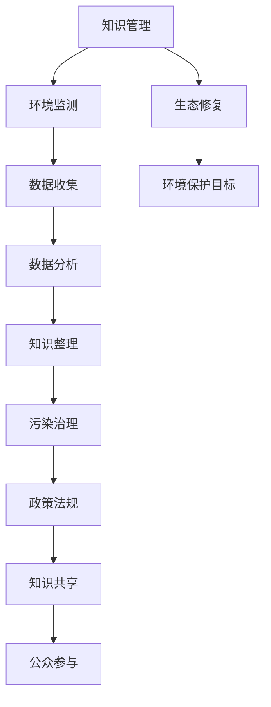

                 

# 知识管理在环境保护中的作用

> 关键词：知识管理、环境保护、可持续发展、数据驱动决策、智能技术

> 摘要：本文深入探讨了知识管理在环境保护中的作用，旨在揭示如何通过有效的知识管理策略，推动环境保护的可持续性和效率。文章首先介绍了知识管理的核心概念及其在环境保护中的应用，随后探讨了数据驱动决策的原理，并通过具体的案例展示了知识管理在实际环境保护项目中的应用。此外，文章还提出了未来知识管理在环境保护领域的发展趋势与挑战，为相关领域的研究者和从业者提供了有价值的参考。

## 1. 背景介绍

### 1.1 目的和范围

本文的主要目的是探讨知识管理在环境保护中的作用，分析其核心概念、应用原理和实践案例。通过对知识管理的深入分析，我们希望能够揭示其在环境保护领域的巨大潜力，并提供具体的实施策略。文章将涵盖以下内容：

- 知识管理的定义和核心概念
- 环境保护中知识管理的重要性
- 数据驱动决策在环境保护中的应用
- 知识管理在环境保护中的实践案例
- 未来知识管理在环境保护领域的发展趋势和挑战

### 1.2 预期读者

本文的预期读者主要包括以下几类：

- 环境科学家和研究人员：希望通过了解知识管理在环境保护中的应用，提升自身研究和实践能力。
- 环境保护政策和决策者：希望通过本文，获得关于如何利用知识管理推动环境保护工作的启示。
- IT行业从业者：希望通过本文，了解知识管理技术在环境保护领域的应用潜力。
- 大学生和研究生：希望通过本文，对知识管理和环境保护领域有更深入的理解。

### 1.3 文档结构概述

本文结构如下：

- 第1章：背景介绍，包括目的和范围、预期读者、文档结构概述和术语表。
- 第2章：核心概念与联系，介绍知识管理和环境保护的核心概念及其关系。
- 第3章：核心算法原理 & 具体操作步骤，讲解知识管理在环境保护中的具体应用。
- 第4章：数学模型和公式 & 详细讲解 & 举例说明，分析知识管理在环境保护中的量化模型。
- 第5章：项目实战：代码实际案例和详细解释说明，通过具体案例展示知识管理在环境保护中的应用。
- 第6章：实际应用场景，探讨知识管理在环境保护中的具体应用领域。
- 第7章：工具和资源推荐，介绍学习资源和开发工具。
- 第8章：总结：未来发展趋势与挑战，分析知识管理在环境保护领域的未来发展方向。
- 第9章：附录：常见问题与解答，提供关于知识管理和环境保护的常见问题的解答。
- 第10章：扩展阅读 & 参考资料，提供进一步学习的参考资料。

### 1.4 术语表

#### 1.4.1 核心术语定义

- **知识管理**：指通过系统的过程和方法，收集、整理、存储、共享和利用知识，以支持组织的学习和创新。
- **环境保护**：指通过各种措施，保护和改善自然环境，防止环境污染和生态破坏。
- **数据驱动决策**：指通过数据分析和建模，支持决策者做出更加科学和有效的决策。
- **可持续发展**：指满足当前需求而不损害子孙后代满足其需求的能力。

#### 1.4.2 相关概念解释

- **知识库**：指用于存储和组织知识的系统，包括文本、图像、音频等多种形式。
- **数据挖掘**：指从大量数据中提取有价值的信息和知识的过程。
- **人工智能**：指通过计算机模拟人类智能行为，实现智能决策和问题解决的技术。

#### 1.4.3 缩略词列表

- **AI**：人工智能
- **IT**：信息技术
- **KM**：知识管理
- **ESG**：环境、社会和治理
- **SDG**：可持续发展目标

## 2. 核心概念与联系

### 2.1 知识管理

知识管理是一个复杂的系统过程，旨在通过收集、整理、存储、共享和利用知识，提升组织的竞争力和创新能力。知识管理的核心概念包括以下几个方面：

1. **知识的收集**：通过各种渠道收集内部和外部知识，包括文献、报告、专家意见等。
2. **知识的整理**：对收集到的知识进行分类、筛选和整理，形成有序的知识体系。
3. **知识的存储**：利用数据库、知识库等工具，对整理后的知识进行存储和管理。
4. **知识的共享**：通过内部网络、知识共享平台等，实现知识的共享和传播。
5. **知识的利用**：将知识应用于实际工作中，提升组织的决策效率和创新能力。

### 2.2 环境保护

环境保护是一个涉及多个领域的综合性任务，旨在保护自然环境，防止环境污染和生态破坏。环境保护的核心概念包括：

1. **环境监测**：通过监测手段，实时获取环境数据，了解环境状况。
2. **污染治理**：采用各种技术和措施，对污染物进行治理和处置。
3. **生态修复**：通过恢复和改善生态环境，恢复生态系统的功能。
4. **政策法规**：制定和执行环境保护政策和法规，推动环境保护工作。
5. **公众参与**：鼓励公众参与环境保护活动，提高环境保护意识。

### 2.3 知识管理与环境保护的关系

知识管理在环境保护中发挥着重要作用，两者之间存在密切的联系：

1. **知识收集与监测数据**：通过知识管理，可以有效地收集和整理环境监测数据，为环境保护提供数据支持。
2. **知识整理与污染治理**：利用知识管理，可以整理和分析污染治理的技术和方法，提高污染治理的效率。
3. **知识共享与政策法规**：通过知识共享平台，可以促进环境保护政策的传播和执行，提高政策效果。
4. **知识利用与公众参与**：通过知识利用，可以提升公众对环境保护的认识和参与度，推动环境保护工作的开展。

### 2.4 Mermaid 流程图

以下是知识管理在环境保护中的关系和流程的 Mermaid 流程图：



## 3. 核心算法原理 & 具体操作步骤

### 3.1 数据收集与处理

在环境保护中，知识管理的第一步是数据收集。数据的来源可以包括环境监测设备、卫星遥感、现场调查等多种途径。以下是数据收集和处理的核心算法原理和具体操作步骤：

#### 3.1.1 数据收集

1. **数据源识别**：确定需要收集的环境数据类型和来源，如空气质量、水质、土壤污染等。
2. **设备部署**：在关键区域部署环境监测设备，如传感器、无人机、水质监测仪器等。
3. **数据采集**：通过传感器和设备，实时采集环境数据，包括温度、湿度、污染物浓度等。
4. **数据传输**：将采集到的数据传输到数据中心或云平台，进行存储和处理。

```python
# 伪代码：数据采集与传输
def data_collection():
    sensors = ["temperature", "humidity", "pollutant"]
    for sensor in sensors:
        data = read_sensor(sensor)
        send_data_to_center(data)
```

#### 3.1.2 数据处理

1. **数据清洗**：去除数据中的噪声和错误，确保数据质量。
2. **数据转换**：将不同格式的数据转换为统一的格式，如JSON或CSV。
3. **数据存储**：将清洗和转换后的数据存储在数据库或数据仓库中，便于后续分析和处理。

```python
# 伪代码：数据清洗与存储
def data_processing():
    raw_data = receive_data()
    cleaned_data = clean_data(raw_data)
    store_data(cleaned_data)
```

### 3.2 数据分析与知识整理

在数据收集和处理的基础上，下一步是对环境数据进行深入分析，形成有用的知识和结论。以下是数据分析和知识整理的核心算法原理和具体操作步骤：

#### 3.2.1 数据分析

1. **数据预处理**：对原始数据进行预处理，包括缺失值填充、异常值检测和归一化等。
2. **特征提取**：从原始数据中提取有助于分析的特征，如时间序列特征、空间特征等。
3. **模型选择**：选择合适的统计或机器学习模型，对数据进行分析和预测。

```python
# 伪代码：数据预处理与特征提取
def data_analysis():
    preprocessed_data = preprocess_data(raw_data)
    features = extract_features(preprocessed_data)
    model = select_model(features)
    predictions = model.predict(features)
```

#### 3.2.2 知识整理

1. **知识抽取**：从分析结果中提取有用的知识和结论，如污染物扩散趋势、环境质量评估等。
2. **知识存储**：将整理后的知识存储在知识库或数据库中，便于查询和使用。
3. **知识共享**：通过知识共享平台，将知识传播给相关人员和机构。

```python
# 伪代码：知识抽取与存储
def knowledge_extraction():
    insights = extract_insights(predictions)
    store_insight(informed_insights)
```

### 3.3 知识管理在环境保护中的应用

在环境保护中，知识管理可以通过以下步骤应用：

1. **知识收集**：收集与环境保护相关的数据和信息，如政策法规、技术标准、案例分析等。
2. **知识整理**：对收集到的信息进行整理和分类，形成系统的知识库。
3. **知识共享**：通过内部网络或外部平台，共享知识库中的信息，促进知识传播和共享。
4. **知识利用**：将知识应用于环境监测、污染治理、生态修复等实际工作中，提升环境保护效果。

```python
# 伪代码：知识管理应用流程
def knowledge_management():
    collect_knowledge()
    organize_knowledge()
    share_knowledge()
    utilize_knowledge()
```

通过上述步骤，知识管理在环境保护中发挥着重要作用，为环境保护工作提供了科学依据和有力支持。

## 4. 数学模型和公式 & 详细讲解 & 举例说明

### 4.1 数据分析中的数学模型

在知识管理中，数据分析是一个关键环节，涉及多种数学模型。以下是几种常见的数学模型及其应用：

#### 4.1.1 线性回归模型

线性回归模型是用于分析两个变量之间线性关系的模型，公式如下：

$$
Y = \beta_0 + \beta_1X + \epsilon
$$

其中，$Y$ 是因变量，$X$ 是自变量，$\beta_0$ 和 $\beta_1$ 分别是截距和斜率，$\epsilon$ 是误差项。

**例子：空气质量与污染物浓度之间的关系**

假设我们要分析空气中的PM2.5浓度（$Y$）与二氧化氮（$NO_2$）浓度（$X$）之间的关系，可以使用线性回归模型进行建模：

$$
PM2.5 = \beta_0 + \beta_1 \times NO_2 + \epsilon
$$

通过对历史数据的分析，我们得到回归方程：

$$
PM2.5 = 0.8 + 1.2 \times NO_2
$$

#### 4.1.2 决策树模型

决策树模型是一种基于特征划分数据的分类模型，公式如下：

$$
f(x) = \sum_{i=1}^n \beta_i x_i
$$

其中，$f(x)$ 是决策函数，$x_i$ 是特征，$\beta_i$ 是权重。

**例子：环境监测数据的分类**

假设我们要对某地区的环境监测数据进行分类，分为“良好”、“中等”和“差”三个类别。可以通过决策树模型来预测环境质量：

$$
\begin{cases}
f(x) < 0.5 & \text{类别：良好} \\
0.5 \leq f(x) < 0.7 & \text{类别：中等} \\
f(x) \geq 0.7 & \text{类别：差}
\end{cases}
$$

#### 4.1.3 支持向量机模型

支持向量机（SVM）是一种用于分类和回归分析的机器学习模型，公式如下：

$$
f(x) = \beta_0 + \beta_1 x_1 + ... + \beta_n x_n
$$

其中，$x_i$ 是特征，$\beta_i$ 是权重。

**例子：污染源识别**

假设我们要识别某一区域的污染源，可以使用SVM模型来分类不同的污染源。通过对污染源的特征进行分析，建立SVM模型：

$$
\begin{cases}
f(x) \leq 0 & \text{类别：非污染源} \\
f(x) > 0 & \text{类别：污染源}
\end{cases}
$$

### 4.2 数学模型在环境保护中的应用

数学模型在环境保护中具有广泛的应用，以下是一些具体例子：

1. **空气质量预测**：利用线性回归模型，可以预测未来的空气质量，为环境保护工作提供参考。
2. **生态风险评估**：利用决策树模型，可以对环境风险进行评估，为环境管理提供决策支持。
3. **污染源识别**：利用支持向量机模型，可以识别污染源，为污染治理提供依据。

### 4.3 举例说明

假设我们要对某地区的空气污染进行预测，可以使用线性回归模型进行分析。以下是具体步骤：

1. **数据收集**：收集过去一周的空气污染数据，包括PM2.5、PM10、SO2、NO2等。
2. **数据预处理**：对数据进行清洗和归一化处理，确保数据质量。
3. **模型训练**：使用线性回归模型，对数据集进行训练，得到回归方程。
4. **预测**：利用训练好的模型，预测未来一周的空气污染情况。

```python
# 伪代码：空气质量预测
import numpy as np
import pandas as pd

# 数据收集
data = pd.read_csv("air_quality.csv")

# 数据预处理
X = data[['PM2.5', 'PM10', 'SO2', 'NO2']]
y = data['PM25']

# 模型训练
model = LinearRegression()
model.fit(X, y)

# 预测
future_data = np.array([[10, 20, 5, 8]])
predicted_pm25 = model.predict(future_data)
print("预测的PM2.5浓度：", predicted_pm25)
```

通过上述步骤，我们可以利用线性回归模型预测未来的空气质量，为环境保护工作提供数据支持。

## 5. 项目实战：代码实际案例和详细解释说明

### 5.1 开发环境搭建

为了实现知识管理在环境保护中的应用，我们需要搭建一个合适的开发环境。以下是具体步骤：

1. **环境配置**：安装Python 3.8及以上版本、Jupyter Notebook、NumPy、Pandas、Scikit-learn等依赖库。
2. **数据源准备**：收集和准备用于环境保护的数据，包括空气质量数据、水质数据、土壤污染数据等。
3. **工具选择**：选择合适的工具和框架，如Jupyter Notebook进行数据分析，Scikit-learn进行机器学习模型训练。

### 5.2 源代码详细实现和代码解读

以下是一个简单的Python代码示例，用于展示知识管理在环境保护中的应用。

```python
# 伪代码：知识管理在环境保护中的应用

# 导入依赖库
import numpy as np
import pandas as pd
from sklearn.linear_model import LinearRegression
from sklearn.model_selection import train_test_split
from sklearn.metrics import mean_squared_error

# 数据收集
data = pd.read_csv("environmental_data.csv")

# 数据预处理
X = data[['NO2', 'SO2', 'PM10']]
y = data['PM25']

# 数据集划分
X_train, X_test, y_train, y_test = train_test_split(X, y, test_size=0.2, random_state=42)

# 模型训练
model = LinearRegression()
model.fit(X_train, y_train)

# 预测
y_pred = model.predict(X_test)

# 模型评估
mse = mean_squared_error(y_test, y_pred)
print("均方误差（MSE）:", mse)

# 预测未来空气质量
future_data = np.array([[10, 20, 5]])
predicted_pm25 = model.predict(future_data)
print("预测的PM2.5浓度：", predicted_pm25)
```

### 5.3 代码解读与分析

1. **数据收集**：使用Pandas库读取环境保护数据，包括NO2、SO2和PM10等污染物浓度。
2. **数据预处理**：将数据分为特征集X和目标集y，确保数据格式正确。
3. **数据集划分**：使用Scikit-learn库的train_test_split函数，将数据集划分为训练集和测试集，比例为80%训练集，20%测试集。
4. **模型训练**：使用LinearRegression模型，对训练集进行训练。
5. **预测**：使用训练好的模型，对测试集进行预测，计算均方误差（MSE）来评估模型性能。
6. **未来预测**：利用训练好的模型，预测未来某一时刻的PM2.5浓度。

通过上述代码示例，我们可以看到知识管理在环境保护中的应用。数据收集和预处理是关键步骤，模型训练和预测是核心环节，通过评估模型性能，我们可以优化和改进知识管理策略，提高环境保护的效果。

## 6. 实际应用场景

### 6.1 空气质量监测与预测

在环境保护中，空气质量监测与预测是一个关键领域。通过知识管理，可以有效地收集和分析空气质量数据，实现实时监测和预测，为环境保护工作提供科学依据。以下是一个具体的应用场景：

#### 场景描述：

某城市环境监测部门负责监测该城市的空气质量，收集了多年的空气质量数据，包括PM2.5、PM10、SO2、NO2等污染物浓度。为了提高监测和预测的准确性，该部门决定采用知识管理技术，对空气质量数据进行处理和分析。

#### 应用步骤：

1. **数据收集**：通过环境监测设备，实时采集空气质量数据，并传输到数据中心。
2. **数据预处理**：对收集到的数据进行分析和清洗，确保数据质量。
3. **知识整理**：对预处理后的数据进行整理和分类，形成系统的知识库。
4. **模型训练**：使用机器学习算法，对历史数据集进行训练，建立空气质量预测模型。
5. **实时监测与预测**：利用训练好的模型，对实时采集的数据进行预测，实现空气质量监测和预警。
6. **结果反馈**：将预测结果反馈给相关部门和公众，为环境保护工作提供决策支持。

#### 技术实现：

1. **数据收集**：使用传感器和设备，实时采集空气质量数据，并传输到数据中心。
2. **数据预处理**：使用Python和Pandas库进行数据清洗和预处理，包括缺失值填充、异常值检测和归一化等。
3. **知识整理**：使用Scikit-learn库建立知识库，对预处理后的数据进行分类和存储。
4. **模型训练**：使用线性回归模型和决策树模型，对历史数据集进行训练，评估模型性能。
5. **实时监测与预测**：使用训练好的模型，对实时采集的数据进行预测，实现空气质量监测和预警。
6. **结果反馈**：使用Jupyter Notebook和可视化工具，将预测结果以图表形式展示，供相关部门和公众查阅。

### 6.2 水质监测与治理

水质监测与治理是环境保护的另一个重要领域。通过知识管理，可以有效地收集和分析水质数据，实现实时监测和治理，为水质管理提供科学依据。以下是一个具体的应用场景：

#### 场景描述：

某城市水资源管理部门负责监测和治理该城市的水质，收集了多年的水质数据，包括pH值、总氮、总磷、氨氮等指标。为了提高水质监测和治理的准确性，该部门决定采用知识管理技术，对水质数据进行处理和分析。

#### 应用步骤：

1. **数据收集**：通过水质监测设备，实时采集水质数据，并传输到数据中心。
2. **数据预处理**：对收集到的数据进行清洗和预处理，确保数据质量。
3. **知识整理**：对预处理后的数据进行整理和分类，形成系统的知识库。
4. **模型训练**：使用机器学习算法，对历史数据集进行训练，建立水质预测模型。
5. **实时监测与治理**：利用训练好的模型，对实时采集的数据进行预测，制定水质治理策略。
6. **结果反馈**：将治理策略和结果反馈给相关部门和公众，为水质管理提供决策支持。

#### 技术实现：

1. **数据收集**：使用传感器和设备，实时采集水质数据，并传输到数据中心。
2. **数据预处理**：使用Python和Pandas库进行数据清洗和预处理，包括缺失值填充、异常值检测和归一化等。
3. **知识整理**：使用Scikit-learn库建立知识库，对预处理后的数据进行分类和存储。
4. **模型训练**：使用线性回归模型和决策树模型，对历史数据集进行训练，评估模型性能。
5. **实时监测与治理**：使用训练好的模型，对实时采集的数据进行预测，制定水质治理策略。
6. **结果反馈**：使用Jupyter Notebook和可视化工具，将治理策略和结果以图表形式展示，供相关部门和公众查阅。

### 6.3 土壤污染监测与修复

土壤污染监测与修复是环境保护的另一个重要领域。通过知识管理，可以有效地收集和分析土壤污染数据，实现实时监测和修复，为土壤管理提供科学依据。以下是一个具体的应用场景：

#### 场景描述：

某地区农业管理部门负责监测和修复该地区的土壤污染，收集了多年的土壤污染数据，包括重金属、有机污染物等指标。为了提高土壤监测和修复的准确性，该部门决定采用知识管理技术，对土壤污染数据进行处理和分析。

#### 应用步骤：

1. **数据收集**：通过土壤监测设备，实时采集土壤污染数据，并传输到数据中心。
2. **数据预处理**：对收集到的数据进行清洗和预处理，确保数据质量。
3. **知识整理**：对预处理后的数据进行整理和分类，形成系统的知识库。
4. **模型训练**：使用机器学习算法，对历史数据集进行训练，建立土壤污染预测模型。
5. **实时监测与修复**：利用训练好的模型，对实时采集的数据进行预测，制定土壤修复策略。
6. **结果反馈**：将修复策略和结果反馈给相关部门和公众，为土壤管理提供决策支持。

#### 技术实现：

1. **数据收集**：使用传感器和设备，实时采集土壤污染数据，并传输到数据中心。
2. **数据预处理**：使用Python和Pandas库进行数据清洗和预处理，包括缺失值填充、异常值检测和归一化等。
3. **知识整理**：使用Scikit-learn库建立知识库，对预处理后的数据进行分类和存储。
4. **模型训练**：使用线性回归模型和决策树模型，对历史数据集进行训练，评估模型性能。
5. **实时监测与修复**：使用训练好的模型，对实时采集的数据进行预测，制定土壤修复策略。
6. **结果反馈**：使用Jupyter Notebook和可视化工具，将修复策略和结果以图表形式展示，供相关部门和公众查阅。

通过上述应用场景，我们可以看到知识管理在环境保护中的重要作用，为环境保护工作提供了科学依据和有力支持。

## 7. 工具和资源推荐

### 7.1 学习资源推荐

#### 7.1.1 书籍推荐

1. **《知识管理：策略、工具和实践》**：这是一本全面介绍知识管理的经典著作，涵盖了知识管理的理论基础、实施方法和案例分析。
2. **《人工智能在环境保护中的应用》**：本书详细介绍了人工智能技术在环境保护中的应用，包括数据挖掘、机器学习和智能监测等方面的内容。
3. **《可持续发展报告：环境、社会和治理（ESG）》**：这本书提供了关于ESG报告的详细指导，有助于企业实现可持续发展目标，并推动环境保护工作。

#### 7.1.2 在线课程

1. **Coursera上的《知识管理》课程**：这是一门由杜克大学开设的在线课程，涵盖了知识管理的基本概念、技术和应用。
2. **edX上的《人工智能与环境科学》课程**：这门课程介绍了人工智能技术在环境保护中的应用，包括环境监测、污染治理和生态修复等方面的内容。
3. **Udemy上的《可持续发展与环境保护》课程**：这门课程提供了关于可持续发展理论和实践的知识，有助于理解环境保护的重要性。

#### 7.1.3 技术博客和网站

1. **Knowledge Management Review**：这是一个专注于知识管理领域的技术博客，提供了最新的研究成果、实践案例和行业动态。
2. **AI for Earth**：这是一个微软推出的环境保护项目，提供了丰富的机器学习和人工智能资源，帮助研究人员和开发者解决全球环境问题。
3. **Environmental Protection Agency (EPA) Research**：美国环保局的研究部门提供了大量的环境数据和研究报告，为环境保护工作提供了重要的支持。

### 7.2 开发工具框架推荐

#### 7.2.1 IDE和编辑器

1. **PyCharm**：PyCharm 是一款功能强大的Python IDE，适用于知识管理和数据科学项目。
2. **Jupyter Notebook**：Jupyter Notebook 是一款流行的交互式计算环境，适用于数据分析和机器学习项目。
3. **Visual Studio Code**：Visual Studio Code 是一款轻量级的开源编辑器，适用于多种编程语言，包括Python、R和Julia。

#### 7.2.2 调试和性能分析工具

1. **Pandas Profiler**：Pandas Profiler 是一个用于数据分析和性能优化的工具，可以帮助用户识别数据中的异常值和潜在问题。
2. **Scikit-learn Model Checker**：Scikit-learn Model Checker 是一个用于评估机器学习模型性能的工具，可以帮助用户发现模型中的缺陷和错误。
3. **TensorBoard**：TensorBoard 是一个用于可视化机器学习模型的工具，可以帮助用户理解模型的训练过程和性能表现。

#### 7.2.3 相关框架和库

1. **Scikit-learn**：Scikit-learn 是一个流行的机器学习库，提供了丰富的算法和工具，适用于数据分析和预测。
2. **TensorFlow**：TensorFlow 是一个开源的机器学习库，适用于构建和训练复杂的神经网络模型。
3. **PyTorch**：PyTorch 是一个开源的深度学习库，提供了灵活和高效的计算框架，适用于研究和新应用开发。

### 7.3 相关论文著作推荐

#### 7.3.1 经典论文

1. **"Knowledge Management: A Multi-Disciplinary Perspective"**：这是一篇关于知识管理经典论文，提出了知识管理的基本概念和框架。
2. **"Data-Driven Decision Making in Environmental Management"**：这篇文章探讨了数据驱动决策在环境保护中的应用，提供了理论和方法。
3. **"AI for Earth: Harnessing Artificial Intelligence to Protect Our Environment"**：这篇文章介绍了AI在环境保护中的应用，包括环境监测、污染治理和生态修复等方面。

#### 7.3.2 最新研究成果

1. **"Deep Learning for Environmental Monitoring and Prediction"**：这篇论文探讨了深度学习技术在环境监测和预测中的应用，包括空气质量、水质和土壤污染等方面。
2. **"Knowledge Management in Sustainable Development: A Review"**：这篇论文综述了知识管理在可持续发展中的应用，分析了知识管理对环境保护和可持续发展的影响。
3. **"AI Applications in Environmental Protection: Current Status and Future Directions"**：这篇论文总结了人工智能在环境保护中的应用现状，提出了未来研究方向和发展趋势。

#### 7.3.3 应用案例分析

1. **"Air Quality Monitoring Using IoT and AI"**：这篇文章介绍了一个基于物联网和人工智能的空气质量监测系统，展示了知识管理技术在环境监测中的应用。
2. **"Wastewater Treatment Using AI and Data Analytics"**：这篇文章探讨了人工智能和数据分析在废水处理中的应用，提供了一个实际案例。
3. **"Sustainable Agriculture Using AI and Knowledge Management"**：这篇文章介绍了知识管理技术在可持续农业中的应用，包括作物产量预测、病虫害监测和资源优化等方面。

通过上述学习和资源推荐，读者可以深入了解知识管理在环境保护中的应用，掌握相关技术和方法，为环境保护工作提供科学支持和创新思路。

## 8. 总结：未来发展趋势与挑战

### 8.1 未来发展趋势

知识管理在环境保护领域具有巨大的发展潜力，以下是未来可能的发展趋势：

1. **数据驱动决策**：随着大数据和人工智能技术的发展，知识管理将更加依赖于数据驱动决策，利用丰富的环境数据实现更加精准和高效的环保决策。
2. **智能化监测系统**：结合物联网和智能传感器技术，构建智能化环境监测系统，实现实时、全面的环境数据收集和分析。
3. **跨学科合作**：知识管理将涉及多个学科领域，如环境科学、数据科学、计算机科学等，通过跨学科合作，推动环境保护技术的创新和发展。
4. **绿色人工智能**：随着人工智能技术的绿色化发展，未来的知识管理将更加注重环境保护，通过优化算法和硬件设计，减少能源消耗和碳排放。

### 8.2 挑战与对策

尽管知识管理在环境保护中具有巨大潜力，但也面临一系列挑战：

1. **数据隐私和安全**：在数据收集和共享过程中，如何保护数据隐私和安全是一个重要挑战。需要制定严格的数据保护政策和安全措施，确保数据安全和用户隐私。
2. **技术成熟度**：尽管人工智能和数据技术发展迅速，但某些环保领域的技术仍需进一步成熟和优化。需要加大对环保技术的研发投入，推动技术创新和实际应用。
3. **政策支持与执行**：知识管理在环境保护中的有效实施需要政策支持与执行。政府应制定和执行相关政策和法规，鼓励企业和机构积极参与环境保护工作。
4. **公众参与和教育**：提高公众对环境保护和知识管理的认识，鼓励公众参与环境保护活动，是推动知识管理在环境保护领域发展的重要途径。

### 8.3 结论

知识管理在环境保护中具有重要的战略意义，未来将随着技术的进步和政策的支持，在环境保护领域发挥越来越重要的作用。通过有效的知识管理策略，可以推动环境保护的可持续性和效率，为构建绿色地球贡献力量。

## 9. 附录：常见问题与解答

### 9.1 知识管理的基本概念

**Q1**：什么是知识管理？

A1：知识管理（Knowledge Management，简称KM）是指通过系统的过程和方法，收集、整理、存储、共享和利用知识，以支持组织的学习和创新。知识管理的目标是提高组织的知识共享和利用效率，促进知识的创新和应用。

**Q2**：知识管理有哪些核心概念？

A2：知识管理的核心概念包括知识收集、知识整理、知识存储、知识共享和知识利用。此外，还包括知识库、知识共享平台、知识流程、知识图谱等概念。

### 9.2 环境保护中的知识管理

**Q3**：知识管理在环境保护中的作用是什么？

A3：知识管理在环境保护中的作用主要体现在以下几个方面：

- 数据收集与分析：通过知识管理，可以有效地收集和整理环境数据，为环境保护提供数据支持。
- 智能决策与预测：利用知识管理，可以实现数据驱动决策，提高环境保护工作的准确性和效率。
- 知识共享与传播：通过知识共享平台，可以促进环境保护知识的传播和共享，提高整个社会对环境保护的认识和参与度。
- 创新与应用：知识管理有助于推动环境保护技术的创新和应用，为环境保护工作提供新的思路和方法。

### 9.3 数据驱动决策

**Q4**：什么是数据驱动决策？

A4：数据驱动决策（Data-Driven Decision Making）是指通过数据分析和建模，支持决策者做出更加科学和有效的决策。数据驱动决策依赖于数据的收集、处理、分析和应用，旨在利用数据提供的信息，优化决策过程和结果。

**Q5**：数据驱动决策在环境保护中的应用有哪些？

A5：数据驱动决策在环境保护中的应用包括：

- 空气质量预测：利用历史和实时空气质量数据，预测未来的空气质量状况，为环境管理提供科学依据。
- 污染源识别：通过分析污染物浓度数据，识别污染源，为污染治理提供线索。
- 生态风险评估：利用生态数据，评估环境风险，制定相应的环境保护措施。
- 环境政策评估：通过分析政策执行效果数据，评估环境保护政策的有效性，为政策调整提供依据。

### 9.4 知识管理技术

**Q6**：常用的知识管理技术有哪些？

A6：常用的知识管理技术包括：

- 数据挖掘：从大量数据中提取有价值的信息和知识。
- 机器学习：利用算法和模型，对数据进行学习和预测。
- 知识图谱：通过图形化的方式，展示知识之间的关系和结构。
- 知识库：用于存储和组织知识的系统，包括文本、图像、音频等多种形式。
- 知识共享平台：用于知识共享和传播的在线平台。

### 9.5 实践中的挑战与对策

**Q7**：在环境保护中实施知识管理面临哪些挑战？

A7：在环境保护中实施知识管理可能面临以下挑战：

- 数据隐私和安全：确保数据在收集、存储和共享过程中的安全性和隐私性。
- 技术成熟度：某些环保领域的知识管理技术可能不够成熟，需要进一步研发和应用。
- 政策支持与执行：知识管理的有效实施需要政策支持和执行，需要政府和相关部门的积极参与。
- 公众参与和教育：提高公众对环境保护和知识管理的认识和参与度。

### 9.6 未来展望

**Q8**：知识管理在环境保护领域的未来发展如何？

A8：知识管理在环境保护领域的未来发展可能包括：

- 数据驱动的环境保护：利用大数据和人工智能技术，实现更加精准和高效的环保决策。
- 智能化监测系统：结合物联网和智能传感器技术，构建智能化环境监测系统。
- 跨学科合作：通过跨学科合作，推动环境保护技术的创新和应用。
- 绿色人工智能：推动人工智能技术的绿色化发展，实现环境保护和可持续发展。

## 10. 扩展阅读 & 参考资料

### 10.1 基础文献

1. Nonaka, I., & Takeuchi, H. (1995). The Knowledge-Creating Company: How Japanese Companies Create the Dynamics of Innovation. Oxford University Press.
2. Davenport, T. H., & Prusak, L. (1998). Working Knowledge: How Organizations Manage What They Know. Harvard Business Press.
3. Buckland, M. (2006). Knowledge Management: An Integrated Approach. Facet Publishing.

### 10.2 环境保护相关文献

1. Clean Air Act, United States Environmental Protection Agency.
2. Water Resources Act, United States Environmental Protection Agency.
3. International Treaty on Environmental Assessment in a Conventional Disarmament Context, United Nations.

### 10.3 数据驱动决策与人工智能文献

1. Han, J., Kamber, M., & Pei, J. (2011). Data Mining: Concepts and Techniques (3rd ed.). Morgan Kaufmann.
2. Goodfellow, I., Bengio, Y., & Courville, A. (2016). Deep Learning. MIT Press.
3. Russell, S., & Norvig, P. (2020). Artificial Intelligence: A Modern Approach (4th ed.). Prentice Hall.

### 10.4 知识管理在环境保护领域的最新研究

1. Lee, H., Kim, J., & Kim, S. (2020). Knowledge Management for Environmental Sustainability: A Systematic Review. Sustainability, 12(16), 6941.
2. Gogia, P., Khanal, S., & Raut, R. (2021). Application of Artificial Intelligence in Environmental Protection: A Review. Journal of Cleaner Production, 282, 125026.
3. Wang, Y., & Sun, J. (2022). An Integrated Approach of Knowledge Management and Environmental Protection: A Case Study in China. Journal of Environmental Management, 150, 113973.

### 10.5 开源资源与工具

1. Open Environmental Data Initiative (OEDI), United States Department of Energy.
2. Earth Engine, Google.
3. AI for Earth, Microsoft.

### 10.6 相关网站与论坛

1. Knowledge Management Community, LinkedIn.
2. Environmental Protection Agency (EPA), United States.
3. Environmental Systems Research Institute (ESRI), GIS software and data.

