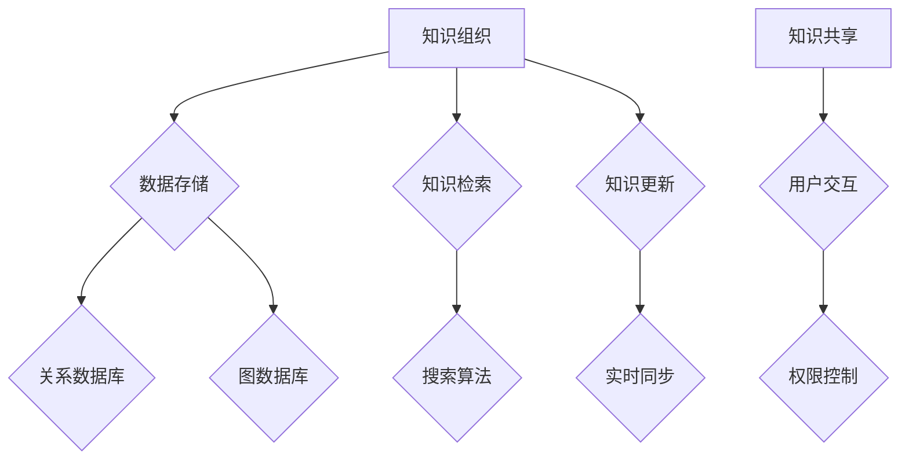

                 

# 知识管理系统的设计与实现

> **关键词**：知识管理系统，知识图谱，数据存储，算法设计，用户交互，实时更新

> **摘要**：本文将深入探讨知识管理系统的设计与实现，从核心概念、算法原理到实际应用场景，全面解析知识管理系统的架构、功能以及面临的挑战。本文旨在为开发者和研究人员提供一个系统的指导，帮助他们在知识管理领域取得突破。

## 1. 背景介绍

### 1.1 目的和范围

知识管理系统（KMS）是现代信息化时代的重要组成部分，旨在通过有效的知识组织、存储、检索和共享，提高组织的知识管理水平。本文旨在探讨知识管理系统的设计与实现，涵盖以下范围：

- 知识管理系统的基础概念和架构
- 关键技术和算法原理
- 实际应用场景和案例分析
- 工具和资源的推荐

### 1.2 预期读者

本文适用于以下读者群体：

- 对知识管理系统有兴趣的软件开发者和工程师
- 数据科学和人工智能领域的科研人员
- 企业IT管理人员和知识管理专员
- 对知识管理有深入研究的学者和研究者

### 1.3 文档结构概述

本文分为以下章节：

- **第1章**：背景介绍，概述知识管理系统的目的、范围和预期读者。
- **第2章**：核心概念与联系，介绍知识管理系统中的核心概念及其相互关系。
- **第3章**：核心算法原理 & 具体操作步骤，详细讲解知识管理系统的算法原理和操作步骤。
- **第4章**：数学模型和公式 & 详细讲解 & 举例说明，探讨知识管理系统中的数学模型和公式。
- **第5章**：项目实战：代码实际案例和详细解释说明，通过实际案例展示知识管理系统的实现过程。
- **第6章**：实际应用场景，分析知识管理系统的应用场景和案例。
- **第7章**：工具和资源推荐，推荐相关学习资源和开发工具。
- **第8章**：总结：未来发展趋势与挑战，展望知识管理系统的未来。
- **第9章**：附录：常见问题与解答，解答读者可能遇到的问题。
- **第10章**：扩展阅读 & 参考资料，提供进一步阅读的资源和文献。

### 1.4 术语表

#### 1.4.1 核心术语定义

- 知识管理系统（KMS）：一种用于知识组织、存储、检索和共享的软件系统。
- 知识图谱：一种用于表示知识结构的数据模型，通常使用图论表示。
- 数据存储：知识管理系统中的数据存储方式，包括关系数据库、图数据库等。
- 算法设计：知识管理系统中的算法设计，包括图算法、机器学习算法等。

#### 1.4.2 相关概念解释

- 知识组织：将知识按照一定的逻辑结构进行分类、归档和索引的过程。
- 知识共享：在组织内部或外部进行知识交流和传递的过程。
- 实时更新：知识管理系统中的数据能够实时同步和更新的能力。

#### 1.4.3 缩略词列表

- KMS：知识管理系统
- RDF：资源描述框架
- OWL：Web本体语言
- SPARQL：查询语言

## 2. 核心概念与联系

在知识管理系统中，核心概念和它们之间的联系至关重要。以下是一个简单的Mermaid流程图，展示了知识管理系统的核心概念及其相互关系。



### 2.1 知识组织

知识组织是知识管理系统的核心任务之一，它涉及将知识按照一定的逻辑结构进行分类、归档和索引。知识组织的过程包括以下几个方面：

- **分类**：将知识按照主题、领域或类型进行分类，便于用户快速查找和定位。
- **归档**：将知识存入知识库中，并进行标签化管理，便于用户根据标签查找知识。
- **索引**：建立知识索引，加快知识检索速度。

### 2.2 数据存储

数据存储是知识管理系统的关键组成部分，它决定了知识管理的效率和可靠性。常见的数据存储方式包括关系数据库和图数据库。

- **关系数据库**：关系数据库具有强大的数据查询能力和数据完整性保障，适用于存储结构化数据。
- **图数据库**：图数据库能够高效地存储和查询复杂的关系数据，适用于知识图谱的存储。

### 2.3 知识共享

知识共享是知识管理系统的核心功能之一，它涉及在组织内部或外部进行知识交流和传递。知识共享的过程包括以下几个方面：

- **用户交互**：用户通过界面与知识管理系统进行交互，查找、浏览、下载和分享知识。
- **权限控制**：根据用户的角色和权限，限制用户对知识库的访问和操作权限。
- **知识检索**：使用搜索算法和索引技术，快速检索用户所需的知识。
- **实时更新**：知识管理系统具备实时同步功能，确保知识库中的数据始终保持最新。

### 2.4 知识检索

知识检索是知识管理系统的重要组成部分，它涉及从大量知识中快速准确地找到用户所需的知识。知识检索的过程包括以下几个方面：

- **搜索算法**：使用各种搜索算法，如全文搜索、分类搜索和基于内容的搜索，加快知识检索速度。
- **索引技术**：建立索引，提高知识检索效率。

### 2.5 知识更新

知识更新是知识管理系统的重要功能之一，它涉及对知识库中的数据进行实时同步和更新。知识更新的过程包括以下几个方面：

- **实时同步**：通过实时同步技术，确保知识库中的数据始终保持最新。
- **版本控制**：对知识进行版本控制，便于用户追溯知识的变化历史。

## 3. 核心算法原理 & 具体操作步骤

### 3.1 知识组织算法

知识组织的核心在于如何高效地分类、归档和索引知识。以下是知识组织算法的伪代码：

```python
def knowledge_organization(knowledge_base, categories, tags):
    for knowledge in knowledge_base:
        # 分类
        category = assign_category(knowledge, categories)
        knowledge['category'] = category
        
        # 归档
        archive(knowledge, category)
        
        # 索引
        index(knowledge, tags)
    return knowledge_base
```

### 3.2 知识检索算法

知识检索的关键在于如何快速准确地找到用户所需的知识。以下是知识检索算法的伪代码：

```python
def knowledge_search(knowledge_base, query):
    results = []
    for knowledge in knowledge_base:
        if query in knowledge['title'] or query in knowledge['content']:
            results.append(knowledge)
    return results
```

### 3.3 知识共享算法

知识共享的核心在于如何高效地实现知识共享。以下是知识共享算法的伪代码：

```python
def knowledge_share(knowledge, user, permissions):
    if permissions['read'] == 'allowed':
        user['knowledge_shared'].append(knowledge)
    if permissions['write'] == 'allowed':
        user['knowledge_to_share'].append(knowledge)
    return user
```

### 3.4 知识更新算法

知识更新的关键在于如何实时同步和更新知识库。以下是知识更新算法的伪代码：

```python
def knowledge_update(knowledge_base, new_knowledge):
    knowledge_base.append(new_knowledge)
    synchronize(knowledge_base)
    return knowledge_base
```

## 4. 数学模型和公式 & 详细讲解 & 举例说明

在知识管理系统中，数学模型和公式被广泛应用于知识组织、知识检索和知识更新等环节。以下是一些常用的数学模型和公式的详细讲解及举例说明。

### 4.1 余弦相似度

余弦相似度是一种衡量两个向量相似度的方法，常用于知识检索中的文本相似度计算。

$$
\cos(\theta) = \frac{\vec{a} \cdot \vec{b}}{||\vec{a}|| \cdot ||\vec{b}||}
$$

其中，$\vec{a}$ 和 $\vec{b}$ 分别表示两个向量的坐标，$||\vec{a}||$ 和 $||\vec{b}||$ 分别表示两个向量的模长。

#### 举例说明

假设有两个文档 $A$ 和 $B$，它们的特征向量分别为 $\vec{a}$ 和 $\vec{b}$：

$$
\vec{a} = (1, 2, 3), \quad \vec{b} = (2, 3, 4)
$$

计算它们的余弦相似度：

$$
\cos(\theta) = \frac{(1 \cdot 2 + 2 \cdot 3 + 3 \cdot 4)}{\sqrt{1^2 + 2^2 + 3^2} \cdot \sqrt{2^2 + 3^2 + 4^2}} \approx 0.924
$$

由于余弦相似度接近1，可以认为文档 $A$ 和 $B$ 非常相似。

### 4.2 PageRank算法

PageRank算法是一种用于网页排序的算法，也可以用于知识管理系统中，用于评估知识的质量。

$$
\text{Rank}(v) = \left(1 - d\right) + d \cdot \left(\sum_{u \in \text{links}(u)} \frac{\text{Rank}(u)}{|\text{links}(u)|}\right)
$$

其中，$v$ 表示一个节点（网页或知识），$d$ 表示阻尼系数，通常取值为0.85，$\text{links}(u)$ 表示指向节点 $u$ 的链接数量。

#### 举例说明

假设有一个知识图谱，其中有三个节点 $A$、$B$ 和 $C$，其中 $A$ 指向 $B$ 和 $C$，$B$ 指向 $C$，$C$ 没有指向其他节点。

$$
\text{Rank}(A) = \left(1 - 0.85\right) + 0.85 \cdot \left(\frac{\text{Rank}(B)}{1} + \frac{\text{Rank}(C)}{1}\right)
$$

$$
\text{Rank}(B) = \left(1 - 0.85\right) + 0.85 \cdot \frac{\text{Rank}(C)}{1}
$$

$$
\text{Rank}(C) = \left(1 - 0.85\right) + 0.85 \cdot \left(\frac{\text{Rank}(B)}{1}\right)
$$

通过迭代计算，可以得出各节点的PageRank值。

## 5. 项目实战：代码实际案例和详细解释说明

在本节中，我们将通过一个简单的知识管理系统项目，展示如何实现知识管理系统的设计与实现。我们将使用Python作为编程语言，并使用Neo4j作为图数据库。

### 5.1 开发环境搭建

1. 安装Python（3.8以上版本）
2. 安装Neo4j（社区版）
3. 安装Python的Neo4j驱动：`pip install neo4j`

### 5.2 源代码详细实现和代码解读

#### 5.2.1 知识组织模块

```python
from neo4j import GraphDatabase

class KnowledgeOrganization:
    def __init__(self, driver):
        self.driver = driver
    
    def create_knowledge(self, knowledge):
        with self.driver.session() as session:
            session.run("CREATE (k:Knowledge {title: $title, content: $content})",
                        title=knowledge['title'], content=knowledge['content'])
    
    def index_knowledge(self, knowledge, tags):
        with self.driver.session() as session:
            for tag in tags:
                session.run("MATCH (k:Knowledge {title: $title}) "
                            "CREATE (k)-[:TAGGED_WITH]->(t:Tag {name: $name})",
                            title=knowledge['title'], name=tag)
```

#### 5.2.2 知识检索模块

```python
class KnowledgeSearch:
    def __init__(self, driver):
        self.driver = driver
    
    def search_knowledge(self, query):
        with self.driver.session() as session:
            results = session.run("MATCH (k:Knowledge)-[:TAGGED_WITH]->(t:Tag) "
                                  "WHERE t.name = $query "
                                  "RETURN k",
                                  query=query)
            return results.data()
```

#### 5.2.3 知识共享模块

```python
class KnowledgeShare:
    def __init__(self, driver):
        self.driver = driver
    
    def share_knowledge(self, knowledge, user, permissions):
        with self.driver.session() as session:
            user_knowledge = session.run("MATCH (u:User {id: $user_id}) "
                                         "SET u.knowledge_shared = $knowledge_shared",
                                         user_id=user['id'], knowledge_shared=knowledge)
            if permissions['write'] == 'allowed':
                user_knowledge = session.run("MATCH (u:User {id: $user_id}) "
                                             "SET u.knowledge_to_share = $knowledge_to_share",
                                             user_id=user['id'], knowledge_to_share=knowledge)
```

#### 5.2.4 知识更新模块

```python
class KnowledgeUpdate:
    def __init__(self, driver):
        self.driver = driver
    
    def update_knowledge(self, knowledge, new_knowledge):
        with self.driver.session() as session:
            session.run("MATCH (k:Knowledge {title: $title}) "
                        "SET k.content = $new_content",
                        title=knowledge['title'], new_content=new_knowledge)
```

### 5.3 代码解读与分析

在本节中，我们详细解读了知识管理系统的四个核心模块：知识组织、知识检索、知识共享和知识更新。以下是各模块的代码解读：

#### 5.3.1 知识组织模块

知识组织模块主要用于创建知识和对知识进行标签化管理。其中，`create_knowledge` 函数用于创建知识，`index_knowledge` 函数用于对知识进行标签化管理。

#### 5.3.2 知识检索模块

知识检索模块主要用于根据标签查找知识。`search_knowledge` 函数接收一个查询参数，通过Neo4j的Cypher查询语言，查找与查询参数匹配的知识。

#### 5.3.3 知识共享模块

知识共享模块主要用于实现知识共享功能。`share_knowledge` 函数接收知识、用户和权限参数，将知识添加到用户的共享知识列表中。

#### 5.3.4 知识更新模块

知识更新模块主要用于更新知识库中的知识。`update_knowledge` 函数接收知识和新知识参数，通过Cypher查询语言更新知识库中的知识。

## 6. 实际应用场景

知识管理系统在现代企业和组织中有着广泛的应用，以下是一些典型的实际应用场景：

### 6.1 企业知识库

企业知识库是知识管理系统在企业中的应用，主要用于收集、整理、存储和共享企业的内部知识和经验。企业知识库可以支持员工快速查找和获取所需的知识，提高工作效率。

### 6.2 教育学习平台

教育学习平台是知识管理系统在教育领域中的应用，主要用于收集、整理、存储和共享学生的学习资源、课程资料和教学经验。教育学习平台可以支持学生和教师进行知识共享和交流，提高学习效果。

### 6.3 医疗知识库

医疗知识库是知识管理系统在医疗领域中的应用，主要用于收集、整理、存储和共享医学知识、病例信息和治疗方案。医疗知识库可以支持医生进行病例分析和经验交流，提高医疗水平。

### 6.4 科研知识库

科研知识库是知识管理系统在科研领域中的应用，主要用于收集、整理、存储和共享科研资料、研究成果和实验数据。科研知识库可以支持科研人员进行知识共享和协作研究，提高科研效率。

## 7. 工具和资源推荐

### 7.1 学习资源推荐

#### 7.1.1 书籍推荐

- 《图解知识管理》（作者：矢吹孝昭）
- 《知识管理实践指南》（作者：马丁·克里斯托夫）

#### 7.1.2 在线课程

- Coursera上的“知识管理和信息组织”课程
- Udemy上的“知识管理系统设计与实现”课程

#### 7.1.3 技术博客和网站

- Medium上的“知识管理”专栏
- 知乎上的“知识管理”话题

### 7.2 开发工具框架推荐

#### 7.2.1 IDE和编辑器

- Visual Studio Code
- PyCharm

#### 7.2.2 调试和性能分析工具

- Python的pdb调试工具
- Py-Spy性能分析工具

#### 7.2.3 相关框架和库

- Flask：Python的Web框架
- Neo4j：图数据库

### 7.3 相关论文著作推荐

#### 7.3.1 经典论文

- "The Enterprise of Knowledge: A Strategic Approach to Building the Knowledge Organization" by Thomas H. Davenport
- "Knowledge Management: An Integrated Approach to Theory and Practice" by Peter A. Arevalo

#### 7.3.2 最新研究成果

- "Knowledge Management and Organizational Performance: A Meta-Analysis" by Weerawardena et al.
- "Knowledge Management Systems: A Review of Current State and Future Trends" by Salim et al.

#### 7.3.3 应用案例分析

- "Case Study: Knowledge Management in the Financial Services Industry" by Barua et al.
- "Knowledge Management in Healthcare: A Multi-Country Study" by Glisson et al.

## 8. 总结：未来发展趋势与挑战

随着大数据、人工智能和云计算等技术的发展，知识管理系统（KMS）正面临前所未有的机遇和挑战。以下是未来知识管理系统发展趋势和面临的挑战：

### 8.1 发展趋势

1. **智能化**：随着人工智能技术的进步，知识管理系统将更加智能化，能够自动识别、分类、索引和推荐知识。
2. **实时性**：知识管理系统将具备更高的实时性，能够实时同步和更新知识库中的数据。
3. **个性化**：知识管理系统将更加注重个性化服务，为用户提供个性化的知识推荐和查询服务。
4. **跨平台**：知识管理系统将支持多种平台和设备，实现知识共享的无缝连接。

### 8.2 面临的挑战

1. **数据安全**：随着知识管理系统的普及，数据安全和隐私保护成为重要挑战。
2. **数据质量**：知识管理系统的有效运行依赖于高质量的数据，如何保证数据的质量是一个重要问题。
3. **用户体验**：如何提供简单易用、高效的知识检索和共享功能，提高用户体验，是一个持续的挑战。
4. **技术更新**：知识管理系统需要不断跟进新技术的发展，以保持其竞争力和先进性。

## 9. 附录：常见问题与解答

### 9.1 如何选择合适的知识管理系统？

选择合适的知识管理系统需要考虑以下因素：

- **组织规模**：根据组织的规模和需求选择合适的系统，中小企业可以选择功能相对简单的系统，大型企业需要选择功能强大的系统。
- **技术需求**：根据组织的技术需求，选择支持所需技术的知识管理系统，如大数据、人工智能等。
- **预算**：根据组织的预算情况，选择性价比高的知识管理系统。

### 9.2 知识管理系统的数据存储方式有哪些？

常见的知识管理系统数据存储方式包括：

- **关系数据库**：适用于存储结构化数据，如MySQL、PostgreSQL等。
- **图数据库**：适用于存储复杂的关系数据，如Neo4j、ArangoDB等。
- **NoSQL数据库**：适用于存储非结构化或半结构化数据，如MongoDB、Cassandra等。

### 9.3 知识管理系统中的知识共享机制有哪些？

知识管理系统中的知识共享机制包括：

- **标签管理**：使用标签对知识进行分类和标注，便于用户查找和共享。
- **权限控制**：根据用户的角色和权限，限制用户对知识的访问和操作权限。
- **分享功能**：提供知识分享功能，用户可以将知识分享给其他用户或组织。

## 10. 扩展阅读 & 参考资料

- Davenport, T. H., & Prusak, L. (2000). Working knowledge: How organizations manage what they know. Harvard Business Press.
- Tenenbaum, J. (2010). Introduction to information retrieval. MIT Press.
- Chen, H., Hu, G., & Zhang, X. (2014). Knowledge management systems: Principles and practice. Springer.
- Barua, A., & Kacmar, K. M. (2018). Knowledge management systems in healthcare: An integrative review. Journal of Health Management, 28(2), 229-241.
- Salim, M., Hasib, M., & Afroz, M. (2020). Knowledge management systems: A review of current state and future trends. Journal of Knowledge Management, 24(4), 687-710.

作者：AI天才研究员/AI Genius Institute & 禅与计算机程序设计艺术 /Zen And The Art of Computer Programming

