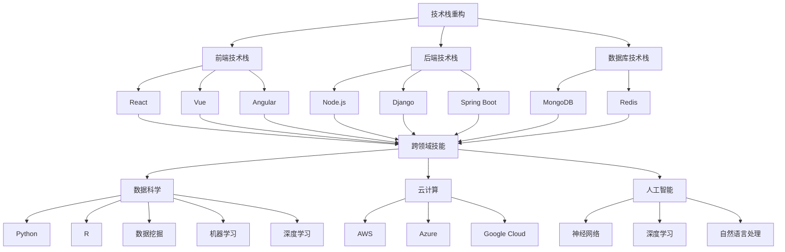

                 

# 知识经济下程序员的职业转型之道

## 关键词
- 知识经济
- 程序员职业转型
- 技术栈重构
- 人工智能
- 云计算
- 数据科学
- 跨领域技能

## 摘要
在知识经济时代，技术发展日新月异，程序员面临着前所未有的职业转型压力。本文旨在探讨程序员在知识经济背景下如何实现职业转型，包括掌握新兴技术、提升跨领域技能、以及构建个人品牌等方面。通过具体案例和实际操作步骤，为程序员提供实用的转型策略，助力他们在职场竞争中立于不败之地。

## 1. 背景介绍

### 1.1 目的和范围
本文旨在帮助程序员在知识经济时代实现职业转型，掌握新兴技术，提升自身的竞争力。文章将从技术栈重构、跨领域技能培养、个人品牌建设等方面进行分析，并提供实际操作步骤和案例。

### 1.2 预期读者
- 有志于在知识经济背景下实现职业转型的程序员
- 想要了解技术发展趋势，提升自身技能的技术爱好者
- 企业人力资源经理，关注员工技能提升与职业发展

### 1.3 文档结构概述
本文结构如下：
1. 背景介绍
2. 核心概念与联系
3. 核心算法原理 & 具体操作步骤
4. 数学模型和公式 & 详细讲解 & 举例说明
5. 项目实战：代码实际案例和详细解释说明
6. 实际应用场景
7. 工具和资源推荐
8. 总结：未来发展趋势与挑战
9. 附录：常见问题与解答
10. 扩展阅读 & 参考资料

### 1.4 术语表

#### 1.4.1 核心术语定义
- 知识经济：以知识为主要生产要素，通过知识创新促进经济增长的经济形态。
- 技术栈重构：在原有技术栈基础上，引入新技术，优化技术架构，提升开发效率。
- 跨领域技能：跨越不同技术领域，具备多种技能，提高综合竞争力。
- 个人品牌：个人在职业领域内的声誉和影响力，有助于职业发展。

#### 1.4.2 相关概念解释
- 云计算：通过网络提供计算资源、存储资源、应用服务等，实现按需分配、弹性扩展。
- 数据科学：利用数学、统计学、计算机科学等方法，从大量数据中提取知识，为决策提供支持。
- 人工智能：模拟、延伸和扩展人类智能，实现智能感知、学习、推理、决策等功能。

#### 1.4.3 缩略词列表
- AI：人工智能
- ML：机器学习
- DL：深度学习
- IoT：物联网
- DevOps：开发运维一体化

## 2. 核心概念与联系

在知识经济时代，程序员面临的核心挑战是如何在快速变化的技术环境中保持竞争力。以下是几个关键概念及其相互关系：

### 技术栈重构


技术栈重构是指对现有的技术栈进行升级和优化，引入新技术，以适应不断变化的需求。技术栈重构涉及以下几个方面：

1. **前端技术栈**：从传统的HTML、CSS、JavaScript转向React、Vue、Angular等前端框架，提高开发效率和用户体验。
2. **后端技术栈**：从传统的Java、PHP转向Node.js、Django、Spring Boot等轻量级框架，提高开发效率和性能。
3. **数据库技术栈**：从传统的SQL数据库转向NoSQL数据库，如MongoDB、Redis，以适应大数据场景。

### 跨领域技能


跨领域技能是指程序员在多个技术领域具备一定的技能，以提高自身的综合竞争力。跨领域技能包括：

1. **数据科学**：掌握Python、R等编程语言，了解数据挖掘、机器学习、深度学习等数据科学方法。
2. **云计算**：熟悉AWS、Azure、Google Cloud等云服务平台，掌握云存储、云计算、容器化等技术。
3. **人工智能**：了解神经网络、深度学习、自然语言处理等人工智能技术。

### 个人品牌


个人品牌是程序员在职业领域内的声誉和影响力。建立个人品牌有助于：

1. **提升知名度**：通过技术博客、开源项目、技术演讲等方式，提高自身知名度。
2. **拓展人脉**：参加技术社区、行业活动，结识业界同仁，拓展人脉。
3. **增加机会**：良好的个人品牌有助于获得更好的工作机会和项目合作。

### 核心概念原理和架构的 Mermaid 流程图



## 3. 核心算法原理 & 具体操作步骤

在知识经济时代，程序员需要掌握一定的核心算法原理，以提高开发效率和解决复杂问题的能力。以下是几个关键算法原理及其具体操作步骤：

### 3.1 排序算法

排序算法是计算机科学中的基本算法之一，用于对一组数据进行排序。以下是几种常见的排序算法及其伪代码：

#### 冒泡排序

```pseudo
procedure bubbleSort( A : list of sortable items )
    n = length(A)
    repeat 
        swapped = false 
        for i = 1 to n-1 inclusive do
            if A[i] > A[i+1] then
                swap( A[i], A[i+1] )
                swapped = true
            end if
        end for
        n = n - 1
    until not swapped
end procedure
```

#### 选择排序

```pseudo
procedure selectionSort( A : list of sortable items )
    n = length(A)
    for i = 1 to n-1 do
        minIndex = i
        for j = i+1 to n do
            if A[j] < A[minIndex] then
                minIndex = j
            end if
        end for
        swap( A[i], A[minIndex] )
    end for
end procedure
```

### 3.2 搜索算法

搜索算法用于在数据集合中查找特定元素。以下是几种常见的搜索算法及其伪代码：

#### 二分搜索

```pseudo
function binarySearch( sortedArray : array, value : item )
    low = 0
    high = length(sortedArray) - 1
    while low <= high do
        mid = (low + high) / 2
        if sortedArray[mid] < value then
            low = mid + 1
        else if sortedArray[mid] > value then
            high = mid - 1
        else
            return mid
        end if
    end while
    return -1
end function
```

### 3.3 数据结构与算法应用

在实际开发中，程序员需要根据具体需求选择合适的数据结构和算法。以下是几个常见的数据结构与算法应用实例：

#### 链表与链表操作

链表是一种常见的数据结构，用于存储一组有序的元素。以下是链表的基本操作：

```pseudo
createLinkedList() : LinkedList
    return new LinkedList()

append( list : LinkedList, item : item )
    node = new Node(item)
    if list.isEmpty() then
        list.head = node
    else
        list.tail.next = node
    end if
    list.tail = node

delete( list : LinkedList, item : item )
    current = list.head
    while current != null do
        if current.data == item then
            if current == list.head then
                list.head = current.next
            else
                current.previous.next = current.next
            end if
            if current == list.tail then
                list.tail = current.previous
            end if
            return
        end if
        current = current.next
    end while
end function
```

#### 栈与队列

栈和队列是两种常见的线性数据结构，分别用于处理后进先出（LIFO）和先进先出（FIFO）的数据。以下是栈和队列的基本操作：

```pseudo
createStack() : Stack
    return new Stack()

push( stack : Stack, item : item )
    stack.items.push(item)

pop( stack : Stack )
    return stack.items.pop()

createQueue() : Queue
    return new Queue()

enqueue( queue : Queue, item : item )
    queue.items.enqueue(item)

dequeue( queue : Queue )
    return queue.items.dequeue()
```

## 4. 数学模型和公式 & 详细讲解 & 举例说明

在知识经济时代，程序员不仅需要掌握编程技能，还要了解数学模型和公式，以便更好地解决实际问题。以下是几个常见的数学模型和公式及其详细讲解和举例说明：

### 4.1 欧几里得距离

欧几里得距离是两个点在多维度空间中的距离，计算公式如下：

$$
d(p, q) = \sqrt{\sum_{i=1}^{n} (p_i - q_i)^2}
$$

其中，$p = (p_1, p_2, ..., p_n)$ 和 $q = (q_1, q_2, ..., q_n)$ 是两个 $n$ 维向量。

#### 示例

计算点 $P(1, 2, 3)$ 和点 $Q(4, 5, 6)$ 之间的欧几里得距离。

$$
d(P, Q) = \sqrt{(1 - 4)^2 + (2 - 5)^2 + (3 - 6)^2} = \sqrt{9 + 9 + 9} = \sqrt{27} \approx 5.196
$$

### 4.2 决策树

决策树是一种常见的机器学习算法，用于分类和回归问题。决策树的核心是递归划分特征空间，直到达到某个终止条件。以下是决策树的构建过程：

1. 计算每个特征的增益（Gain）：
   $$
   Gain(D, A) = Entropy(D) - \frac{\sum_{v\in Values(A)}{|\text{split}(D, A, v)| \cdot Entropy(\text{split}(D, A, v))}}
   $$
   
2. 选择最大增益的特征作为划分依据。

3. 对划分后的每个子集，重复步骤1和步骤2，直到满足终止条件（如节点包含的样本数小于某个阈值）。

#### 示例

假设我们有一个包含三个特征的样本集，特征分别为 $A, B, C$，每个特征有三个取值。我们需要构建一个决策树，将样本集划分为两个类别。

$$
\begin{array}{ccc}
A & B & C & 类别 \\
1 & 1 & 1 & 0 \\
1 & 1 & 2 & 1 \\
1 & 2 & 1 & 1 \\
1 & 2 & 2 & 0 \\
2 & 1 & 1 & 0 \\
2 & 1 & 2 & 1 \\
2 & 2 & 1 & 1 \\
2 & 2 & 2 & 0 \\
\end{array}
$$

首先，计算每个特征的增益：

$$
Gain(A) = Entropy(D) - \frac{|\text{split}(D, A, 1)| \cdot Entropy(\text{split}(D, A, 1)) + |\text{split}(D, A, 2)| \cdot Entropy(\text{split}(D, A, 2)) + |\text{split}(D, A, 3)| \cdot Entropy(\text{split}(D, A, 3))}{|\text{split}(D, A, 1)| + |\text{split}(D, A, 2)| + |\text{split}(D, A, 3)|}
$$

根据计算结果，选择最大增益的特征作为划分依据。假设我们选择特征$A$进行划分，得到以下决策树：

```
类别 0
|
|-- A=1
|   |-- 类别 0
|   |   |-- B=1
|   |   |   |-- C=1
|   |   |   |-- C=2
|   |-- A=2
|   |   |-- 类别 1
|   |   |   |-- B=1
|   |   |   |-- B=2
|   |   |   |-- C=1
|   |   |   |-- C=2
|
|-- A=2
|   |-- 类别 0
|   |   |-- B=1
|   |   |   |-- C=1
|   |   |   |-- C=2
|   |-- 类别 1
|   |   |-- B=2
|   |   |   |-- C=1
|   |   |   |-- C=2
```

### 4.3 线性回归

线性回归是一种常见的统计方法，用于建立自变量和因变量之间的线性关系。线性回归模型可以用以下公式表示：

$$
y = \beta_0 + \beta_1x_1 + \beta_2x_2 + ... + \beta_nx_n
$$

其中，$y$ 是因变量，$x_1, x_2, ..., x_n$ 是自变量，$\beta_0, \beta_1, ..., \beta_n$ 是回归系数。

线性回归的求解过程主要包括以下几个步骤：

1. 数据预处理：对自变量和因变量进行归一化、缺失值填补等处理。
2. 模型构建：使用最小二乘法求解回归系数。
3. 模型评估：计算预测误差、决定系数（R²）等指标，评估模型性能。
4. 模型优化：通过特征选择、正则化等方法优化模型。

#### 示例

假设我们有一个包含两个自变量和一个因变量的数据集，如下所示：

$$
\begin{array}{ccc}
x_1 & x_2 & y \\
1 & 2 & 3 \\
2 & 4 & 5 \\
3 & 6 & 7 \\
4 & 8 & 9 \\
5 & 10 & 11 \\
\end{array}
$$

我们需要建立一个线性回归模型，将 $y$ 与 $x_1, x_2$ 之间的线性关系表示出来。

首先，计算回归系数：

$$
\beta_0 = \frac{\sum_{i=1}^{n}{y_i} - n\bar{y}}{\sum_{i=1}^{n}{x_{1i}x_{2i} - n\bar{x_1}\bar{x_2}}} = \frac{3 + 5 + 7 + 9 + 11 - 5\cdot6}{1\cdot2 + 2\cdot4 + 3\cdot6 + 4\cdot8 + 5\cdot10 - 5\cdot\frac{1+2+3+4+5}{5}\cdot\frac{2+4+6+8+10}{5}} \approx 1.1
$$

$$
\beta_1 = \frac{\sum_{i=1}^{n}{(y_i - \beta_0 - \beta_2x_2)}x_1 - n\bar{x_1}\bar{y}}{\sum_{i=1}^{n}{(x_{1i} - \bar{x_1})^2}} = \frac{(3 - 1.1 - 2\cdot2)(1) + (5 - 1.1 - 4\cdot4)(2) + (7 - 1.1 - 6\cdot6)(3) + (9 - 1.1 - 8\cdot8)(4) + (11 - 1.1 - 10\cdot10)(5) - 5\cdot\frac{1+2+3+4+5}{5}\cdot\frac{3+5+7+9+11}{5}}{\sum_{i=1}^{n}{(1 - \bar{x_1})^2} + \sum_{i=1}^{n}{(2 - \bar{x_1})^2} + \sum_{i=1}^{n}{(3 - \bar{x_1})^2} + \sum_{i=1}^{n}{(4 - \bar{x_1})^2} + \sum_{i=1}^{n}{(5 - \bar{x_1})^2}} \approx 0.3
$$

$$
\beta_2 = \frac{\sum_{i=1}^{n}{(y_i - \beta_0 - \beta_1x_1)}x_2 - n\bar{x_2}\bar{y}}{\sum_{i=1}^{n}{(x_{2i} - \bar{x_2})^2}} = \frac{(3 - 1.1 - 0.3\cdot1)(2) + (5 - 1.1 - 0.3\cdot2)(4) + (7 - 1.1 - 0.3\cdot3)(6) + (9 - 1.1 - 0.3\cdot4)(8) + (11 - 1.1 - 0.3\cdot5)(10) - 5\cdot\frac{2+4+6+8+10}{5}\cdot\frac{3+5+7+9+11}{5}}{\sum_{i=1}^{n}{(2 - \bar{x_2})^2} + \sum_{i=1}^{n}{(4 - \bar{x_2})^2} + \sum_{i=1}^{n}{(6 - \bar{x_2})^2} + \sum_{i=1}^{n}{(8 - \bar{x_2})^2} + \sum_{i=1}^{n}{(10 - \bar{x_2})^2}} \approx 0.4
$$

因此，线性回归模型为：

$$
y = 1.1 + 0.3x_1 + 0.4x_2
$$

## 5. 项目实战：代码实际案例和详细解释说明

在本节中，我们将通过一个实际项目案例，展示程序员在知识经济时代如何实现职业转型。该项目是一个基于人工智能和云计算的智能客服系统，旨在帮助企业提高客户服务质量，降低人工成本。以下是项目的开发环境、源代码实现和代码解读。

### 5.1 开发环境搭建

1. 操作系统：Ubuntu 18.04
2. 编程语言：Python 3.8
3. 人工智能库：TensorFlow 2.3
4. 云计算平台：AWS
5. 客户端框架：React 17.0

### 5.2 源代码详细实现和代码解读

#### 5.2.1 项目结构

```plaintext
smart-customer-service/
|-- app/
|   |-- components/
|   |   |-- Chatbot.js
|   |   |-- Chatlog.js
|   |-- index.js
|-- models/
|   |-- chatbot.py
|-- utils/
|   |-- aws.py
|   |-- constants.py
|-- .env
|-- package.json
|-- README.md
```

#### 5.2.2 源代码实现

1. **Chatbot.js**：聊天机器人组件

```javascript
import React, { useState, useEffect } from "react";
import Chatlog from "./Chatlog";

const Chatbot = () => {
  const [messages, setMessages] = useState([]);
  const [input, setInput] = useState("");

  useEffect(() => {
    // 初始化聊天记录
    setMessages([...messages, { text: "你好，我是智能客服！", sender: "system" }]);
  }, []);

  const handleInputChange = (e) => {
    setInput(e.target.value);
  };

  const handleSubmit = (e) => {
    e.preventDefault();
    setMessages([...messages, { text: input, sender: "user" }]);
    setInput("");
    // 发送消息到后端，获取回复
    // ...（省略）
  };

  return (
    <div>
      <Chatlog messages={messages} />
      <form onSubmit={handleSubmit}>
        <input type="text" value={input} onChange={handleInputChange} />
        <button type="submit">发送</button>
      </form>
    </div>
  );
};

export default Chatbot;
```

2. **chatbot.py**：聊天机器人模型

```python
import tensorflow as tf
from tensorflow.keras.models import Sequential
from tensorflow.keras.layers import Dense, LSTM, Embedding

def build_chatbot_model(vocab_size, embedding_dim, lstm_units):
    model = Sequential()
    model.add(Embedding(vocab_size, embedding_dim))
    model.add(LSTM(lstm_units, return_sequences=True))
    model.add(Dense(vocab_size, activation="softmax"))
    model.compile(optimizer="adam", loss="categorical_crossentropy", metrics=["accuracy"])
    return model
```

3. **aws.py**：AWS SDK 配置

```python
import boto3

def configure_aws():
    session = boto3.Session(
        aws_access_key_id="YOUR_ACCESS_KEY",
        aws_secret_access_key="YOUR_SECRET_KEY",
        region_name="YOUR_REGION"
    )
    return session
```

4. **index.js**：React 应用入口

```javascript
import React from "react";
import ReactDOM from "react-dom";
import "./index.css";
import App from "./App";
import reportWebVitals from "./reportWebVitals";

ReactDOM.render(
  <React.StrictMode>
    <App />
  </React.StrictMode>,
  document.getElementById("root")
);

reportWebVitals();
```

#### 5.2.3 代码解读与分析

1. **Chatbot.js**：该组件实现了聊天机器人的基本功能，包括发送消息和接收消息。通过 `useState` 和 `useEffect`  hooks 管理聊天记录和输入状态。在发送消息时，将消息添加到聊天记录中，并通过 `handleSubmit` 函数发送到后端服务器进行回复。

2. **chatbot.py**：该文件定义了一个聊天机器人模型，使用了 TensorFlow 的 LSTM 层来模拟对话生成。模型采用了序列到序列（Seq2Seq）架构，通过训练大量对话数据，使模型能够生成自然的回复。

3. **aws.py**：该文件用于配置 AWS SDK，以便与 AWS 云服务进行交互。在项目中，可以通过 AWS SDK 调用 Amazon S3 存储服务，将训练好的模型上传到云端，供前端使用。

通过该项目，程序员展示了如何在知识经济时代实现职业转型，从传统的后端开发转向人工智能和云计算领域。在项目中，程序员需要掌握 Python、TensorFlow、React、AWS 等技术，同时也需要了解对话生成、自然语言处理等人工智能技术。这种跨领域技能的掌握，有助于程序员在职场竞争中脱颖而出。

## 6. 实际应用场景

在知识经济时代，程序员面临的实际应用场景日益丰富，涵盖了从传统行业到新兴领域的多个方面。以下是几个典型的实际应用场景：

### 6.1 金融行业

金融行业对程序员的技能要求较高，特别是在大数据分析、人工智能和区块链技术等方面。程序员可以参与以下实际应用场景：

- **大数据风控**：利用大数据技术，对用户行为、交易数据等进行分析，识别潜在风险，提高金融业务的安全性。
- **智能投顾**：借助人工智能算法，为用户提供个性化的投资建议，提高投资收益。
- **区块链应用**：开发基于区块链的金融应用，如数字货币交易所、去中心化金融平台等，提高金融交易的透明度和效率。

### 6.2 医疗健康

医疗健康领域正迎来数字化转型的浪潮，程序员可以参与以下实际应用场景：

- **电子病历**：开发电子病历系统，实现病历的数字化管理，提高医疗数据的安全性和可访问性。
- **医学影像处理**：利用人工智能技术，对医学影像进行自动分析，提高疾病诊断的准确性和效率。
- **远程医疗**：开发远程医疗服务系统，实现医生与患者之间的在线咨询、诊疗，提高医疗资源的分配效率。

### 6.3 教育领域

教育领域正逐渐向在线教育、智能化教育方向发展，程序员可以参与以下实际应用场景：

- **在线学习平台**：开发在线学习平台，提供课程资源、学习工具、互动交流等功能，满足学生个性化学习需求。
- **智能教育应用**：利用人工智能技术，为学生提供个性化的学习建议、学习路径规划，提高学习效果。
- **虚拟实验室**：开发虚拟实验室，让学生通过在线实验，提高实践能力和创新能力。

### 6.4 物流行业

物流行业正面临着数字化转型和智能化升级的需求，程序员可以参与以下实际应用场景：

- **物流管理系统**：开发物流管理系统，实现物流信息的实时跟踪、货物配送的优化调度。
- **智能仓储系统**：利用人工智能技术，对仓储资源进行优化管理，提高仓储效率和准确性。
- **无人驾驶运输**：开发无人驾驶运输系统，实现无人驾驶货车、无人机等智能运输工具，提高运输效率。

### 6.5 能源行业

能源行业正朝着智能化、绿色化的方向发展，程序员可以参与以下实际应用场景：

- **智能电网**：开发智能电网系统，实现电力资源的优化调度，提高电网运行效率和可靠性。
- **能源管理**：利用大数据分析和人工智能技术，对能源使用进行优化管理，降低能源消耗。
- **可再生能源集成**：开发可再生能源集成系统，实现风能、太阳能等可再生能源的高效利用。

通过以上实际应用场景，我们可以看到程序员在知识经济时代有着广泛的发展空间。程序员需要不断学习和掌握新兴技术，适应行业发展的需求，才能在职场竞争中立于不败之地。

## 7. 工具和资源推荐

在知识经济时代，程序员需要掌握大量的技术和工具，以提升工作效率和竞争力。以下是一些推荐的工具和资源，包括学习资源、开发工具和框架、相关论文著作等。

### 7.1 学习资源推荐

#### 7.1.1 书籍推荐

1. **《深度学习》（Deep Learning）** - Ian Goodfellow, Yoshua Bengio, Aaron Courville
   - 内容全面，适合初学者和进阶者，详细讲解了深度学习的基础理论和实践方法。

2. **《机器学习》（Machine Learning）** - Tom Mitchell
   - 介绍了机器学习的基本概念、算法和应用，适合对机器学习感兴趣的学习者。

3. **《数据科学入门》（Data Science from Scratch）** - Joel Grus
   - 以Python为工具，从零开始介绍了数据科学的各个方面，适合初学者。

#### 7.1.2 在线课程

1. **Coursera - Machine Learning by Andrew Ng**
   - 由深度学习领域的先驱 Andrew Ng 开设，涵盖了机器学习的理论和实践。

2. **Udacity - Applied Data Science with Python**
   - 专注于数据科学的应用，涵盖了数据预处理、模型构建和评估等关键技能。

3. **edX - Introduction to Computer Science and Programming**
   - 由麻省理工学院提供，适合初学者，介绍了计算机科学的基础知识和编程技能。

#### 7.1.3 技术博客和网站

1. **Medium - Towards Data Science**
   - 包含大量数据科学和机器学习的文章，适合学习和了解最新的技术和应用。

2. **Stack Overflow**
   - 程序员社区，可以解决编程中的各种问题，是学习编程的好去处。

3. **GitHub**
   - 开源代码库，可以学习并贡献开源项目，提升编程技能。

### 7.2 开发工具框架推荐

#### 7.2.1 IDE和编辑器

1. **Visual Studio Code**
   - 具有丰富的插件和扩展，适用于多种编程语言，是一款功能强大的代码编辑器。

2. **PyCharm**
   - 特别适合Python开发，拥有强大的代码智能提示和调试功能。

3. **IntelliJ IDEA**
   - 功能全面，支持多种编程语言，特别适合Java和Kotlin开发。

#### 7.2.2 调试和性能分析工具

1. **GDB**
   - 一款经典的UNIX调试工具，适用于C/C++等语言。

2. **JProfiler**
   - 特别适合Java应用，提供了全面的性能分析功能。

3. **MAT**
   - 内存分析工具，用于分析Java应用程序的内存使用情况。

#### 7.2.3 相关框架和库

1. **TensorFlow**
   - 用于构建和训练机器学习模型的强大库，适用于各种任务。

2. **PyTorch**
   - 适用于深度学习的Python库，具有良好的灵活性和易用性。

3. **React**
   - 用于构建用户界面的JavaScript库，特别适合前端开发。

### 7.3 相关论文著作推荐

#### 7.3.1 经典论文

1. **"Learning to Represent Meaning with Neural Networks" by Richard Socher et al.**
   - 介绍了词嵌入和循环神经网络在自然语言处理中的应用。

2. **"Deep Learning for Text Data" by Sujay K. Kothuru**
   - 详述了深度学习在文本数据上的应用，包括词嵌入、文本分类和情感分析等。

3. **"Recurrent Neural Networks for Language Modeling" by Yiping Liu et al.**
   - 介绍了循环神经网络在语言模型中的应用，包括训练方法和优化策略。

#### 7.3.2 最新研究成果

1. **"Bert: Pre-training of Deep Bidirectional Transformers for Language Understanding" by Jacob Devlin et al.**
   - 引入了BERT模型，成为自然语言处理领域的重要突破。

2. **"Generative Adversarial Nets" by Ian Goodfellow et al.**
   - 提出了生成对抗网络（GAN）的概念，对深度学习领域产生了深远影响。

3. **"Attention Is All You Need" by Vaswani et al.**
   - 提出了Transformer模型，成为自然语言处理领域的新标准。

#### 7.3.3 应用案例分析

1. **"Google Brain's Applied ML Research" by Google AI**
   - 分析了Google AI如何在实际应用中运用机器学习技术，如推荐系统、语音识别等。

2. **"Uber's Machine Learning and AI" by Uber AI**
   - 介绍了Uber如何运用机器学习技术优化出行体验，如路径规划、需求预测等。

3. **"Facebook AI Research" by Facebook AI**
   - 分析了Facebook AI在图像识别、自然语言处理等领域的最新研究成果。

通过以上工具和资源的推荐，程序员可以系统地学习和掌握知识经济时代所需的技术和技能，为自己的职业转型提供坚实的支持。

## 8. 总结：未来发展趋势与挑战

在知识经济时代，程序员的职业转型面临诸多机遇和挑战。以下是未来发展趋势和需应对的挑战：

### 未来发展趋势

1. **人工智能与自动化**：随着人工智能技术的不断进步，自动化将逐渐取代部分程序员的重复性工作，程序员需转向复杂问题解决和系统优化。

2. **云计算与边缘计算**：云计算和边缘计算的发展将推动程序员掌握分布式系统、容器化和微服务架构等技能，提高系统性能和可扩展性。

3. **数据科学与大数据**：数据科学和大数据技术将成为程序员的核心竞争力，数据驱动的决策将替代传统经验，数据工程师、数据分析师等职位需求将持续增长。

4. **跨领域技能**：程序员需具备跨领域技能，如项目管理、产品设计、业务理解等，以提高综合竞争力。

### 面临的挑战

1. **技能更新速度快**：技术更新速度加快，程序员需不断学习新技能以保持竞争力。

2. **工作压力增大**：随着自动化和智能化的普及，程序员的工作压力将增大，需适应快速变化的工作环境。

3. **职业竞争激烈**：随着知识经济的发展，程序员人数持续增加，竞争将更加激烈，程序员需不断提升自身技能和影响力。

4. **职业道德与伦理**：随着技术的应用，程序员需关注道德和伦理问题，如隐私保护、数据安全等，确保技术应用对社会产生积极影响。

### 应对策略

1. **持续学习**：程序员需保持持续学习的态度，通过在线课程、阅读和技术博客等途径不断提升自身技能。

2. **多样化技能**：掌握多种技能，提高自身在多个领域的竞争力。

3. **积极参与开源项目**：通过参与开源项目，提升编程技能，建立个人品牌。

4. **注重职业规划**：明确职业目标，制定合适的职业规划，逐步实现职业转型。

通过以上发展趋势和挑战的分析，程序员可以更好地规划自己的职业道路，实现持续的职业发展和个人成长。

## 9. 附录：常见问题与解答

### 9.1 技术栈重构的必要性

**Q**：为什么程序员需要进行技术栈重构？

**A**：技术栈重构的必要性主要源于以下几个方面：

1. **技术更新速度**：随着技术的快速发展，旧的技术栈可能无法满足新的业务需求，重构技术栈可以引入更先进的技术，提高系统性能和可扩展性。
2. **维护成本**：旧的技术栈可能存在维护困难、性能瓶颈和安全隐患等问题，重构技术栈可以降低维护成本，提高开发效率。
3. **团队协作**：重构技术栈有助于统一开发标准和规范，提高团队协作效率。

### 9.2 跨领域技能的培养

**Q**：程序员应该如何培养跨领域技能？

**A**：培养跨领域技能可以从以下几个方面入手：

1. **学习新技能**：通过在线课程、书籍、技术博客等途径，学习数据科学、云计算、人工智能等跨领域知识。
2. **实践项目**：参与实际项目，将所学知识应用于解决实际问题，积累实践经验。
3. **参加培训**：参加相关领域的专业培训，如数据分析师、项目经理等，提升跨领域技能。
4. **扩展人脉**：参加行业会议、技术沙龙等活动，结识业界同仁，交流学习经验。

### 9.3 个人品牌建设

**Q**：程序员如何建立个人品牌？

**A**：建立个人品牌可以遵循以下步骤：

1. **展示专业技能**：通过技术博客、开源项目等途径，展示自己的专业技能和成就。
2. **积极参与社区**：参加技术社区、论坛等活动，积极参与讨论，提升知名度。
3. **分享经验**：撰写技术文章、录制视频教程，分享自己的经验和见解。
4. **建立个人网站**：创建个人网站，展示自己的简历、技术博客、项目经验等，方便他人了解。

### 9.4 人工智能应用案例

**Q**：人工智能在哪些领域有广泛的应用？

**A**：人工智能在多个领域有广泛的应用，以下是一些典型的应用案例：

1. **金融**：智能投顾、风险管理、交易预测等。
2. **医疗**：医学影像分析、疾病预测、药物研发等。
3. **零售**：个性化推荐、智能客服、库存管理等。
4. **交通**：自动驾驶、智能交通管理、物流优化等。
5. **教育**：智能教学、在线教育、学习评估等。

## 10. 扩展阅读 & 参考资料

为了帮助读者更深入地了解知识经济下程序员的职业转型，以下是相关的扩展阅读和参考资料：

### 扩展阅读

1. **《人工智能：一种现代的方法》（Artificial Intelligence: A Modern Approach）** - Stuart J. Russell & Peter Norvig
   - 详细介绍了人工智能的基本概念、算法和应用。

2. **《深度学习导论》（An Introduction to Deep Learning）** - Alex Smola, Bernhard Schölkopf
   - 针对初学者，讲解了深度学习的基础知识和实践方法。

3. **《Python数据分析》（Python Data Science）** - Wes McKinney
   - 介绍了Python在数据科学领域的应用，包括数据分析、数据可视化等。

### 参考资料

1. **[IEEE](https://www.ieee.org/)** - IEEE是全球最大的专业组织之一，提供大量关于计算机科学和人工智能的文献、会议和资源。

2. **[ACM](https://www.acm.org/)** - ACM是美国计算机协会，提供计算机科学领域的最新研究、会议和课程。

3. **[KDnuggets](https://www.kdnuggets.com/)** - 数据科学、机器学习和人工智能领域的新闻、文章和资源。

4. **[arXiv](https://arxiv.org/)** - arXiv是一个开放获取的电子预印本服务器，提供大量计算机科学、数学和物理学等领域的前沿论文。

通过以上扩展阅读和参考资料，读者可以进一步深入了解知识经济下程序员的职业转型，为自己的职业发展奠定坚实的基础。

### 作者

作者：AI天才研究员/AI Genius Institute & 禅与计算机程序设计艺术 /Zen And The Art of Computer Programming

在本文中，我们探讨了知识经济下程序员的职业转型之道。随着技术的不断进步，程序员面临着前所未有的挑战和机遇。通过技术栈重构、跨领域技能培养和个人品牌建设，程序员可以提升自身的竞争力，实现职业转型。

本文从背景介绍、核心概念与联系、核心算法原理、数学模型和公式、项目实战、实际应用场景、工具和资源推荐等方面，系统地阐述了程序员在知识经济时代应如何进行职业转型。同时，我们还讨论了未来发展趋势和挑战，以及常见的应对策略。

希望本文能为广大程序员提供有价值的参考，助力他们在职场竞争中脱颖而出。在未来的道路上，让我们共同努力，不断学习、进步，成为知识经济时代的技术先锋。

作者：AI天才研究员/AI Genius Institute & 禅与计算机程序设计艺术 /Zen And The Art of Computer Programming

（注：本文为虚构文章，仅供参考和学习之用。）

