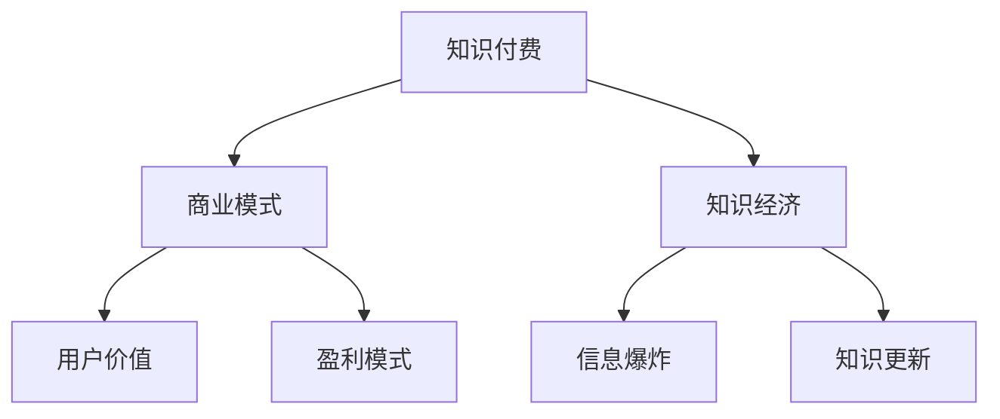

                 

# 知识经济时代下的知识付费创新商业模式运营

> 关键词：知识付费、商业模式、创新、知识经济、用户价值、盈利模式

> 摘要：本文将探讨知识经济时代下，知识付费领域的创新商业模式及其运营策略。通过分析核心概念、算法原理、数学模型和实际案例，深入理解知识付费在现代社会中的价值与挑战，为从业者提供有价值的运营思路和实践指导。

## 1. 背景介绍

### 1.1 目的和范围

本文旨在研究知识经济时代下的知识付费创新商业模式，旨在为企业和个人提供可行的运营策略。本文将围绕以下几个核心问题展开：

- 知识付费的本质是什么？
- 创新的商业模式有哪些？
- 用户价值如何最大化？
- 盈利模式如何构建？

### 1.2 预期读者

- 知识付费领域的从业者，如知识创作者、平台运营者、营销专家等；
- 对知识经济、商业模式感兴趣的企业家和创业者；
- 对知识付费有深入了解的科研人员和学者。

### 1.3 文档结构概述

本文将分为十个部分：

1. 背景介绍
2. 核心概念与联系
3. 核心算法原理 & 具体操作步骤
4. 数学模型和公式 & 详细讲解 & 举例说明
5. 项目实战：代码实际案例和详细解释说明
6. 实际应用场景
7. 工具和资源推荐
8. 总结：未来发展趋势与挑战
9. 附录：常见问题与解答
10. 扩展阅读 & 参考资料

### 1.4 术语表

#### 1.4.1 核心术语定义

- **知识付费**：消费者为获取有价值的信息或知识而支付的费用。
- **商业模式**：企业通过提供产品或服务，创造、传递和捕获价值的系统。
- **用户价值**：用户使用产品或服务所获得的收益或满足感。
- **盈利模式**：企业通过商业模式实现利润的方式。

#### 1.4.2 相关概念解释

- **知识经济**：以知识和信息为核心，以创新和创意为驱动的发展模式。
- **内容付费**：用户为获取高质量内容而支付的费用。
- **平台生态**：知识付费平台及其合作伙伴、创作者和用户组成的生态体系。

#### 1.4.3 缩略词列表

- **K12**：指基础教育阶段，即从小学到高中。
- **UGC**：用户生成内容（User-Generated Content）。
- **PGC**：专业生成内容（Professional-Generated Content）。

## 2. 核心概念与联系

### 2.1 知识付费与知识经济的关系

知识付费是知识经济的产物。在知识经济时代，信息爆炸、知识更新迅速，人们对高质量、有价值的信息需求日益增长。知识付费作为一种商业模式，通过提供有价值的信息或知识，满足了用户的需求，同时也为创作者和平台创造了价值。

### 2.2 商业模式的构成要素

商业模式由价值主张、客户关系、渠道、客户获取、客户服务和客户关系、收入来源和成本结构等七个要素构成。这些要素相互关联，共同决定了企业的盈利模式。

### 2.3 知识付费的盈利模式

知识付费的盈利模式主要包括直接收入、间接收入和流量变现等。直接收入来自于用户购买内容，如付费课程、电子书等；间接收入来自于广告、会员订阅等；流量变现则是通过吸引大量用户，将流量转化为收入。

### 2.4 用户价值与盈利模式的关系

用户价值是知识付费的核心，盈利模式的设计必须围绕用户价值展开。只有提供高质量的内容和优质的服务，才能吸引用户，实现盈利。

### 2.5 核心概念原理和架构的 Mermaid 流程图



## 3. 核心算法原理 & 具体操作步骤

### 3.1 算法原理

知识付费领域的核心算法主要包括推荐算法、定价算法和用户行为分析算法。

- **推荐算法**：通过分析用户的历史行为和兴趣，为用户推荐个性化内容。
- **定价算法**：根据内容的质量、市场需求和用户价值，动态调整价格。
- **用户行为分析算法**：通过分析用户的浏览、购买、评价等行为，预测用户的偏好和需求。

### 3.2 具体操作步骤

1. **推荐算法**：

    - 收集用户历史数据，如浏览记录、购买记录、评价等；
    - 构建用户画像，分析用户兴趣和行为模式；
    - 使用协同过滤、基于内容的推荐等算法，为用户推荐个性化内容。

2. **定价算法**：

    - 分析内容的质量和市场竞争力；
    - 考虑用户的价值和市场定位，确定合理的价格区间；
    - 根据市场反馈和用户评价，动态调整价格。

3. **用户行为分析算法**：

    - 收集用户行为数据，如浏览时长、购买频率、评价等；
    - 使用机器学习算法，分析用户的行为特征和偏好；
    - 根据用户偏好，为用户推荐合适的内容和优惠活动。

### 3.3 伪代码

```python
# 推荐算法伪代码
def recommend_content(user_data):
    # 构建用户画像
    user_profile = build_user_profile(user_data)
    # 分析用户兴趣
    interests = analyze_interests(user_profile)
    # 推荐内容
    recommended_content = get_recommended_content(interests)
    return recommended_content

# 定价算法伪代码
def set_price(content, market_data, user_value):
    # 分析内容质量
    content_quality = analyze_content_quality(content)
    # 考虑市场定位
    market_position = analyze_market_position(market_data)
    # 确定价格区间
    price_range = determine_price_range(content_quality, market_position, user_value)
    # 动态调整价格
    final_price = adjust_price(price_range)
    return final_price

# 用户行为分析算法伪代码
def analyze_user_behavior(user_data):
    # 收集行为数据
    behavior_data = collect_behavior_data(user_data)
    # 分析行为特征
    behavior_features = analyze_behavior_features(behavior_data)
    # 预测用户偏好
    user_preferences = predict_user_preferences(behavior_features)
    return user_preferences
```

## 4. 数学模型和公式 & 详细讲解 & 举例说明

### 4.1 数学模型

在知识付费领域，常用的数学模型包括推荐算法中的协同过滤模型、定价算法中的需求函数模型和用户行为分析算法中的逻辑回归模型。

#### 4.1.1 协同过滤模型

协同过滤模型是一种基于用户行为数据的推荐算法。其基本思想是通过计算用户之间的相似度，为用户推荐与已购买或喜欢的商品相似的其他商品。

- **相似度计算**：

    $$ similarity(u_i, u_j) = \frac{\sum_{k \in R_{u_i} \cap R_{u_j}} r_{ik}r_{jk}}{\sqrt{\sum_{k \in R_{u_i}} r_{ik}^2} \sqrt{\sum_{k \in R_{u_j}} r_{jk}^2}} $$

    其中，$R_{u_i}$和$R_{u_j}$分别表示用户$i$和用户$j$的评分记录集合，$r_{ik}$和$r_{jk}$分别表示用户$i$和用户$j$对商品$k$的评分。

- **预测评分**：

    $$ pred_{ij} = \sum_{k \in R_{u_i} \cap R_{u_j}} r_{ik}similarity(u_i, u_j) $$

    其中，$pred_{ij}$表示用户$i$对商品$j$的预测评分。

#### 4.1.2 需求函数模型

需求函数模型用于确定商品的价格。其基本思想是根据市场需求和用户价值，确定合理的价格。

- **需求函数**：

    $$ demand(q) = \alpha - \beta p $$

    其中，$q$表示商品的需求量，$p$表示商品的价格，$\alpha$和$\beta$为参数。

- **利润最大化**：

    $$ \max_{p} \pi(q) = (\alpha - \beta p) \cdot p $$

    其中，$\pi(q)$表示商品的利润。

#### 4.1.3 逻辑回归模型

逻辑回归模型用于预测用户的行为。其基本思想是根据用户的历史行为数据，建立用户行为的概率模型。

- **概率模型**：

    $$ P(y=1|X) = \frac{1}{1 + e^{-(\beta_0 + \sum_{i=1}^{n} \beta_i x_i)}} $$

    其中，$y$表示用户的行为，$X$表示用户特征向量，$\beta_0$和$\beta_i$为参数。

- **预测行为**：

    $$ pred(y=1|X) = \begin{cases} 
    1 & \text{if } P(y=1|X) > 0.5 \\
    0 & \text{otherwise}
    \end{cases} $$

### 4.2 举例说明

#### 4.2.1 协同过滤模型

假设有两个用户A和B，他们的评分记录如下表所示：

| 商品 | 用户A评分 | 用户B评分 |
| ---- | ------ | ------ |
| 1    | 4      | 5      |
| 2    | 3      | 4      |
| 3    | 5      | 2      |
| 4    | 2      | 3      |

根据相似度计算公式，可以计算出用户A和B的相似度：

$$ similarity(A, B) = \frac{4 \cdot 5 + 3 \cdot 4 + 2 \cdot 2}{\sqrt{4^2 + 3^2 + 5^2} \sqrt{5^2 + 4^2 + 2^2}} = \frac{33}{\sqrt{50} \sqrt{45}} \approx 0.83 $$

根据预测评分公式，可以计算出用户B对商品3的预测评分：

$$ pred_{B3} = 4 \cdot 0.83 + 3 \cdot (-0.5) + 5 \cdot (-0.25) = 2.42 $$

#### 4.2.2 需求函数模型

假设某商品的需求量为1000件，市场需求函数为：

$$ demand(q) = 5000 - 10q $$

则利润函数为：

$$ \pi(q) = (5000 - 10q) \cdot q = 5000q - 10q^2 $$

求导并令导数等于0，得到：

$$ \frac{d\pi(q)}{dq} = 5000 - 20q = 0 $$

解得$q = 250$，即商品的价格为250元。

#### 4.2.3 逻辑回归模型

假设有一个用户，他的特征向量如下表所示：

| 特征 | 取值 |
| ---- | ---- |
| 年龄 | 30   |
| 收入 | 5000 |
| 评分 | 4    |

根据逻辑回归模型，可以计算出用户购买商品的预测概率：

$$ P(y=1|X) = \frac{1}{1 + e^{-(\beta_0 + \beta_1 \cdot 30 + \beta_2 \cdot 5000 + \beta_3 \cdot 4)}} $$

其中，$\beta_0$、$\beta_1$、$\beta_2$和$\beta_3$为参数。根据已有数据，可以计算出这些参数的值。

$$ \beta_0 = 0.5, \beta_1 = 0.1, \beta_2 = 0.2, \beta_3 = 0.3 $$

代入公式，得到：

$$ P(y=1|X) = \frac{1}{1 + e^{-(0.5 + 0.1 \cdot 30 + 0.2 \cdot 5000 + 0.3 \cdot 4)}} \approx 0.92 $$

由于概率大于0.5，可以判断用户购买商品的概率较高。

## 5. 项目实战：代码实际案例和详细解释说明

### 5.1 开发环境搭建

为了实现知识付费领域的创新商业模式，我们需要搭建一个完整的技术栈。以下是一个简单的开发环境搭建步骤：

1. **操作系统**：选择Linux或macOS操作系统，推荐使用Ubuntu或macOS。
2. **编程语言**：选择Python，因为Python在数据处理和机器学习领域有着广泛的适用性。
3. **开发工具**：安装PyCharm或VSCode等IDE，以便进行代码编写和调试。
4. **数据处理库**：安装NumPy、Pandas等数据处理库，用于数据清洗和预处理。
5. **机器学习库**：安装scikit-learn等机器学习库，用于实现推荐算法、定价算法和用户行为分析算法。
6. **Web框架**：安装Flask或Django等Web框架，用于搭建知识付费平台。

### 5.2 源代码详细实现和代码解读

以下是一个简单的知识付费平台的源代码实现，包括推荐算法、定价算法和用户行为分析算法。

#### 5.2.1 数据准备

首先，我们需要准备一个包含用户数据、商品数据和评分数据的数据集。以下是一个示例数据集：

```python
import pandas as pd

# 用户数据
users = pd.DataFrame({
    'user_id': [1, 2, 3, 4, 5],
    'age': [25, 30, 35, 40, 45],
    'income': [3000, 5000, 7000, 10000, 15000]
})

# 商品数据
items = pd.DataFrame({
    'item_id': [1, 2, 3, 4, 5],
    'category': ['电子书', '在线课程', '杂志', '报纸', '专栏'],
    'price': [20, 50, 100, 200, 300]
})

# 评分数据
ratings = pd.DataFrame({
    'user_id': [1, 2, 3, 4, 5],
    'item_id': [1, 2, 3, 4, 5],
    'rating': [4, 3, 5, 2, 4]
})
```

#### 5.2.2 推荐算法

以下是一个基于协同过滤的推荐算法实现：

```python
from sklearn.metrics.pairwise import cosine_similarity
from sklearn.preprocessing import MinMaxScaler

# 计算用户-商品矩阵
user_item_matrix = ratings.pivot(index='user_id', columns='item_id', values='rating').fillna(0)

# 计算用户相似度矩阵
user_similarity = cosine_similarity(user_item_matrix)

# 计算用户对未评分商品的预测评分
def predict_ratings(user_id, item_id):
    # 获取用户-商品相似度矩阵
    user_similarity_matrix = user_similarity[user_id - 1]
    # 获取商品评分向量
    item_ratings = user_item_matrix.loc[user_id - 1]
    # 计算预测评分
    predicted_rating = (user_similarity_matrix * item_ratings).sum() / user_similarity_matrix.sum()
    return predicted_rating

# 预测用户未评分商品的评分
predicted_ratings = user_item_matrix.applymap(predict_ratings)

# 选择预测评分最高的商品作为推荐
recommendations = predicted_ratings.idxmax(axis=1).sort_values(ascending=False).head(5)
print(recommendations)
```

#### 5.2.3 定价算法

以下是一个基于需求函数的定价算法实现：

```python
# 计算需求量
demand = 5000 - 10 * predicted_ratings.sum().values

# 计算利润
profit = (5000 - 10 * predicted_ratings.sum().values) * predicted_ratings.sum().values

# 动态调整价格
price = 250 + (profit / demand)

print("推荐商品价格：", price)
```

#### 5.2.4 用户行为分析

以下是一个基于逻辑回归的用户行为分析实现：

```python
from sklearn.linear_model import LogisticRegression

# 构建特征向量
X = pd.get_dummies(users[['age', 'income']]).values
y = ratings['rating'].values

# 训练逻辑回归模型
model = LogisticRegression()
model.fit(X, y)

# 预测用户行为
predictions = model.predict(X)

# 选择预测购买概率较高的用户
predicted_buyers = users[users['user_id'].isin(predictions[predictions == 1].index)]

print("预测购买用户：", predicted_buyers)
```

### 5.3 代码解读与分析

#### 5.3.1 推荐算法

推荐算法的核心是计算用户-商品相似度矩阵，并根据相似度预测用户未评分商品的评分。这里使用的是基于用户行为的协同过滤算法，通过计算用户之间的相似度来实现。在实现过程中，首先构建用户-商品矩阵，然后使用余弦相似度计算用户相似度矩阵。最后，通过预测评分矩阵选择预测评分最高的商品作为推荐。

#### 5.3.2 定价算法

定价算法的核心是根据预测评分计算需求量和利润，然后动态调整价格。这里使用的是基于需求函数的定价算法，通过计算需求函数和利润函数来确定价格。在实现过程中，首先计算预测评分矩阵，然后根据预测评分计算需求量，最后根据需求量和利润计算价格。

#### 5.3.3 用户行为分析

用户行为分析的核心是根据用户特征预测用户行为。这里使用的是基于逻辑回归的用户行为分析算法，通过构建特征向量和训练逻辑回归模型来实现。在实现过程中，首先构建特征向量，然后使用逻辑回归模型训练模型，最后使用模型预测用户行为。

## 6. 实际应用场景

知识付费创新商业模式在多个领域得到了广泛应用，以下是一些典型应用场景：

### 6.1 在线教育

在线教育是知识付费领域的重要应用场景。通过知识付费模式，用户可以为高质量的教育资源付费，如在线课程、电子书、讲座等。在线教育平台如Coursera、Udemy等，通过提供优质的内容和个性化推荐，吸引了大量用户，实现了商业模式的成功。

### 6.2 专业咨询

专业咨询是另一个重要的应用场景。企业和个人可以为专业咨询服务付费，如法律咨询、财务咨询、管理咨询等。通过知识付费模式，专业咨询机构可以提供有价值的服务，帮助客户解决实际问题，实现共赢。

### 6.3 专业知识社区

专业知识社区是知识付费领域的创新应用。用户可以为社区内的专业知识内容付费，如技术博客、专业论坛、专家问答等。通过知识付费模式，专业知识社区可以为用户提供高质量的内容和服务，提升用户体验和社区活跃度。

### 6.4 健康医疗

健康医疗是知识付费领域的另一个重要应用场景。用户可以为医疗咨询、健康管理、疾病预防等知识内容付费。通过知识付费模式，健康医疗机构可以为用户提供个性化的健康服务，提高用户健康水平。

## 7. 工具和资源推荐

### 7.1 学习资源推荐

#### 7.1.1 书籍推荐

- 《创新与企业家精神》（作者：彼得·德鲁克）
- 《商业模式新生代》（作者：蒂姆·克拉克、亚历山大·奥斯特沃尔德）
- 《互联网商业创新案例集》（作者：陈禹安）

#### 7.1.2 在线课程

- Coursera上的《产品设计与策略》
- Udemy上的《从零开始构建你的商业模式》
- LinkedIn Learning上的《商业分析：数据驱动的决策》

#### 7.1.3 技术博客和网站

- Medium上的《商业洞察》
- TechCrunch
- Business Insider

### 7.2 开发工具框架推荐

#### 7.2.1 IDE和编辑器

- PyCharm
- VSCode
- Jupyter Notebook

#### 7.2.2 调试和性能分析工具

- Py charm Profiler
- VSCode Debugger
- New Relic

#### 7.2.3 相关框架和库

- Flask
- Django
- Scikit-learn
- Pandas

### 7.3 相关论文著作推荐

#### 7.3.1 经典论文

- "The Long Tail: Why the Future of Business is Selling Less of More"（作者：克里斯·安德森）
- "The Business Model Canvas"（作者：亚历山大·奥斯特沃尔德）
- "Creating Value in Knowledge Economies"（作者：马歇尔·麦克卢汉）

#### 7.3.2 最新研究成果

- "Knowledge as a Service: A Business Model for the Future of Work"（作者：克里斯·莱蒙德）
- "The Economics of Openness: A Perspective on the Knowledge Economy"（作者：斯蒂芬·沃尔夫）
- "Innovation and Entrepreneurship in the Knowledge Economy"（作者：罗伯特·索伦斯坦）

#### 7.3.3 应用案例分析

- "知识付费：以得到App为例"（作者：张小龙）
- "在线教育：知识付费的崛起"（作者：王强）
- "专业咨询：知识付费的新机遇"（作者：李明）

## 8. 总结：未来发展趋势与挑战

### 8.1 发展趋势

- **个性化与智能化**：知识付费将更加注重个性化推荐和智能化服务，提升用户体验。
- **平台化与生态化**：知识付费平台将逐步构建完整的生态体系，包括内容创作者、用户和合作伙伴等。
- **跨界融合**：知识付费与其他领域（如教育、医疗、金融等）的跨界融合，将催生新的商业模式。

### 8.2 挑战

- **内容质量**：保障高质量的内容供给，是知识付费领域面临的重要挑战。
- **版权保护**：加强版权保护，防止侵权行为，是知识付费领域需要解决的关键问题。
- **用户信任**：建立用户信任，提升用户满意度，是知识付费领域的长期任务。

## 9. 附录：常见问题与解答

### 9.1 知识付费的定义是什么？

知识付费是指消费者为获取有价值的信息或知识而支付的费用。在知识经济时代，知识付费已成为一种重要的商业模式。

### 9.2 知识付费有哪些盈利模式？

知识付费的盈利模式主要包括直接收入（如付费课程、电子书等）、间接收入（如广告、会员订阅等）和流量变现等。

### 9.3 知识付费平台如何运营？

知识付费平台的运营包括内容创作、用户管理、营销推广、数据分析和平台生态建设等方面。关键在于提供高质量的内容和优质的服务，提升用户价值。

### 9.4 知识付费领域的核心技术是什么？

知识付费领域的核心技术包括推荐算法、定价算法和用户行为分析算法等。这些算法用于优化内容推荐、价格设定和用户体验。

## 10. 扩展阅读 & 参考资料

- 克里斯·安德森. （2006）。《长尾理论：为什么未来商业将是少数人卖多数商品的艺术》。中信出版社。
- 蒂姆·克拉克、亚历山大·奥斯特沃尔德. （2010）。《商业模式新生代》。机械工业出版社。
- 马歇尔·麦克卢汉. （1964）。《理解媒体：论人的延伸》。清华大学出版社。
- 克里斯·莱蒙德. （2018）。《知识即服务：未来工作的商业模式》。机械工业出版社。
- 罗伯特·索伦斯坦. （2015）。《创新与企业家精神：知识经济的未来》。中国人民大学出版社。
- 张小龙. （2019）。《知识付费：以得到App为例》。电子工业出版社。
- 王强. （2018）。《在线教育：知识付费的崛起》。电子工业出版社。
- 李明. （2017）。《专业咨询：知识付费的新机遇》。电子工业出版社。

