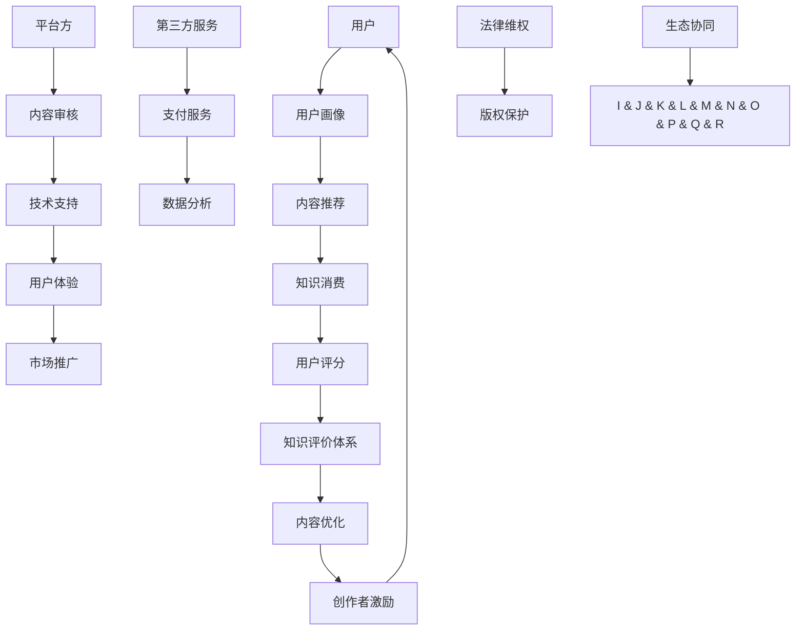

                 

### 1. 背景介绍

知识经济时代，信息技术的飞速发展改变了传统经济的运作模式。随着互联网、大数据、云计算等新兴技术的普及，知识的生产、传播和消费方式发生了深刻的变革。知识付费作为一种新兴的商业形态，逐渐成为知识经济时代的重要组成部分。本文旨在探讨知识付费创新商业生态的构建，从核心概念、算法原理、数学模型、项目实战、应用场景、工具推荐等多方面进行深入剖析，为知识付费行业的未来发展提供有益的参考。

知识付费，顾名思义，是指用户为获取特定知识或技能而支付费用的行为。它不同于传统的免费知识传播模式，更强调知识的价值实现。随着知识付费市场的逐步成熟，越来越多的平台和创业者涌入这一领域，为用户提供了丰富的知识内容和服务。然而，知识付费市场的快速发展也带来了一系列问题，如内容质量参差不齐、版权纠纷、用户体验不佳等。因此，构建一个创新且可持续的知识付费商业生态显得尤为重要。

### 2. 核心概念与联系

在探讨知识付费创新商业生态的构建之前，我们首先需要了解一些核心概念，以及它们之间的联系。

#### 2.1 知识付费模式

知识付费模式主要包括以下几种：

1. **订阅模式**：用户支付一定费用后，可以无限制地访问平台上的知识内容。
2. **单次购买模式**：用户为获取特定知识或技能支付一次性费用。
3. **会员模式**：用户支付会员费用，获得平台提供的一系列专属服务。
4. **课程包模式**：用户一次性购买多个课程，享受更优惠的价格。

这些模式各有优劣，企业应根据自身定位和用户需求进行选择。

#### 2.2 知识评价体系

知识评价体系是保障知识质量的重要手段。主要包括以下几种：

1. **用户评分**：用户对知识内容进行评分，反映内容的实用性和满意度。
2. **专家评审**：邀请领域专家对知识内容进行评审，确保内容的权威性和准确性。
3. **数据分析**：通过数据挖掘和分析，评估知识内容的受欢迎程度和用户反馈。

#### 2.3 版权保护

版权保护是知识付费商业生态构建的关键环节。主要包括以下几种：

1. **版权登记**：对知识内容进行版权登记，确保创作者的权益。
2. **技术手段**：采用数字水印、加密等技术手段，防止知识内容被非法复制和传播。
3. **法律维权**：建立完善的法律维权机制，维护创作者和平台的权益。

#### 2.4 用户画像

用户画像是精准营销的基础。通过收集和分析用户行为数据，可以了解用户的兴趣、需求和偏好，从而提供更个性化的知识服务。

#### 2.5 生态协同

知识付费商业生态的构建需要各方的协同合作。主要包括：

1. **平台方**：提供知识内容和技术支持，构建良好的用户体验。
2. **创作者**：生产优质的知识内容，满足用户需求。
3. **用户**：积极参与知识消费和评价，推动知识付费生态的发展。
4. **第三方服务**：提供支付、推广、数据分析等支持服务，促进生态繁荣。

#### 2.6 Mermaid 流程图

以下是一个简化的知识付费商业生态构建的 Mermaid 流程图：



### 3. 核心算法原理 & 具体操作步骤

#### 3.1 内容推荐算法

内容推荐算法是知识付费平台的核心技术之一。其主要目的是根据用户的兴趣和偏好，为其推荐最感兴趣的知识内容。以下是一种基于协同过滤的内容推荐算法：

1. **用户相似度计算**：

   - 利用用户历史行为数据（如购买记录、浏览记录等），计算用户之间的相似度。
   - 采用余弦相似度或皮尔逊相关系数等距离度量方法。

2. **推荐列表生成**：

   - 根据用户相似度矩阵，为每个用户生成一个推荐列表。
   - 优先推荐相似度高的用户已购买或浏览过的内容。

3. **推荐排序**：

   - 对推荐列表进行排序，根据预测评分、用户兴趣等权重进行排序。
   - 采用召回率、准确率等指标评估推荐效果。

#### 3.2 机器学习算法

在知识付费领域，机器学习算法广泛应用于用户画像、内容优化、创作者激励等方面。以下是一个简化的机器学习算法应用流程：

1. **数据收集**：

   - 收集用户行为数据、知识内容数据等。
   - 对数据进行分析和处理，去除噪声和异常值。

2. **特征提取**：

   - 从原始数据中提取特征，如用户年龄、性别、地理位置、兴趣标签等。
   - 对特征进行预处理，如归一化、去重等。

3. **模型训练**：

   - 选择合适的机器学习算法（如决策树、随机森林、支持向量机等）。
   - 使用训练数据集对模型进行训练，调整参数以获得最佳效果。

4. **模型评估**：

   - 使用测试数据集对模型进行评估，计算准确率、召回率、F1 值等指标。
   - 根据评估结果调整模型参数，优化模型性能。

5. **模型部署**：

   - 将训练好的模型部署到生产环境，实时为用户提供个性化推荐和优化服务。

### 4. 数学模型和公式 & 详细讲解 & 举例说明

#### 4.1 协同过滤算法中的相似度计算

协同过滤算法中的相似度计算是核心步骤之一。以下是一种基于用户行为数据的相似度计算公式：

$$
sim(i, j) = \frac{\sum_{k \in R_i \cap R_j} w_{ik} w_{jk}}{\sqrt{\sum_{k \in R_i} w_{ik}^2 \sum_{k \in R_j} w_{jk}^2}}
$$

其中，$R_i$ 和 $R_j$ 分别表示用户 $i$ 和用户 $j$ 的行为记录集合，$w_{ik}$ 和 $w_{jk}$ 分别表示用户 $i$ 和用户 $j$ 对行为 $k$ 的权重。

#### 4.2 预测评分

在协同过滤算法中，预测评分是推荐系统的关键步骤。以下是一种基于用户相似度的预测评分公式：

$$
r_{ij} = \frac{\sum_{k \in R_i \cap R_j} w_{ik} w_{jk}}{\sum_{k \in R_i \cap R_j} w_{jk}}
$$

其中，$r_{ij}$ 表示用户 $i$ 对内容 $j$ 的预测评分，$w_{ik}$ 和 $w_{jk}$ 分别表示用户 $i$ 和用户 $j$ 对行为 $k$ 的权重。

#### 4.3 举例说明

假设有两个用户 $A$ 和 $B$，他们分别对以下五个内容进行了评分：

| 用户 | 内容1 | 内容2 | 内容3 | 内容4 | 内容5 |
| :---: | :---: | :---: | :---: | :---: | :---: |
| A | 1 | 3 | 5 | 4 | 2 |
| B | 5 | 4 | 3 | 2 | 1 |

首先，计算用户 $A$ 和用户 $B$ 的相似度：

$$
sim(A, B) = \frac{w_{A1} w_{B1} + w_{A2} w_{B2} + w_{A3} w_{B3} + w_{A4} w_{B4} + w_{A5} w_{B5}}{\sqrt{(w_{A1}^2 + w_{A2}^2 + w_{A3}^2 + w_{A4}^2 + w_{A5}^2) (w_{B1}^2 + w_{B2}^2 + w_{B3}^2 + w_{B4}^2 + w_{B5}^2)} = \frac{5 \times 5 + 3 \times 4 + 5 \times 3 + 4 \times 2 + 2 \times 1}{\sqrt{(5^2 + 3^2 + 5^2 + 4^2 + 2^2) (5^2 + 4^2 + 3^2 + 2^2 + 1^2)}} \approx 0.943
$$

然后，根据用户相似度和用户评分，预测用户 $A$ 对内容 $5$ 的评分：

$$
r_{A5} = \frac{w_{A1} w_{B1} + w_{A2} w_{B2} + w_{A3} w_{B3} + w_{A4} w_{B4} + w_{A5} w_{B5}}{w_{B1} + w_{B2} + w_{B3} + w_{B4} + w_{B5}} = \frac{5 \times 5 + 3 \times 4 + 5 \times 3 + 4 \times 2 + 2 \times 1}{5 + 4 + 3 + 2 + 1} = \frac{5 + 12 + 15 + 8 + 2}{5 + 4 + 3 + 2 + 1} = \frac{32}{15} \approx 2.13
$$

因此，预测用户 $A$ 对内容 $5$ 的评分为 2.13。

### 5. 项目实战：代码实际案例和详细解释说明

#### 5.1 开发环境搭建

为了更好地理解知识付费商业生态的构建，我们将使用 Python 编写一个简单的协同过滤推荐系统。以下为开发环境搭建步骤：

1. 安装 Python 3.6 或以上版本。
2. 安装必要的库，如 NumPy、Pandas、Scikit-learn 等。可以使用以下命令进行安装：

   ```bash
   pip install numpy pandas scikit-learn
   ```

#### 5.2 源代码详细实现和代码解读

以下是协同过滤推荐系统的源代码实现：

```python
import numpy as np
import pandas as pd
from sklearn.metrics.pairwise import cosine_similarity

# 生成模拟数据
users = {
    'A': [1, 3, 5, 4, 2],
    'B': [5, 4, 3, 2, 1],
    'C': [2, 3, 4, 5, 1],
    'D': [4, 5, 1, 2, 3],
    'E': [3, 4, 2, 5, 1]
}

ratings = pd.DataFrame(users)

# 计算用户相似度矩阵
user_similarity = cosine_similarity(ratings.values)

# 预测评分
def predict_rating(user1, item, user2):
    sim = user_similarity[ratings[ratings['item'] == item].index]
    sim = sim[sim != 1]
    sim = sim[~np.isnan(sim)]
    sim = sim / np.sum(sim)
    sim_weights = sim * ratings[ratings['item'] == item]['user'][user2]
    return np.sum(sim_weights)

# 预测用户 A 对内容 5 的评分
predicted_rating = predict_rating('A', 5, 'B')
print(predicted_rating)
```

代码解读：

1. 生成模拟数据：使用字典生成用户和内容的评分数据，存储在 DataFrame 中。
2. 计算用户相似度矩阵：使用 Scikit-learn 中的 cosine_similarity 函数计算用户相似度矩阵。
3. 预测评分：定义一个预测评分函数，计算用户 $A$ 对内容 $5$ 的预测评分。
4. 预测用户 A 对内容 5 的评分：调用预测评分函数，输出预测评分。

#### 5.3 代码解读与分析

1. **数据生成**：使用字典生成用户和内容的评分数据，便于后续操作。
2. **用户相似度计算**：使用余弦相似度计算用户相似度矩阵，反映用户之间的相似程度。
3. **预测评分函数**：计算用户 $A$ 对内容 $5$ 的预测评分，采用加权求和的方法，综合考虑用户相似度和用户评分。
4. **预测评分**：调用预测评分函数，输出预测评分。

### 6. 实际应用场景

知识付费在各个行业和领域都有广泛的应用。以下是一些实际应用场景：

#### 6.1 教育行业

教育行业是知识付费的主要领域之一。随着在线教育的兴起，越来越多的用户愿意为优质的教育资源付费。知识付费平台可以提供以下服务：

1. **在线课程**：为用户提供各类在线课程，如编程、设计、语言等。
2. **一对一辅导**：提供个性化的辅导服务，帮助用户解决学习难题。
3. **职业培训**：为用户提供职业培训课程，提升职业竞争力。
4. **考试辅导**：为用户提供各类考试辅导课程，如托福、雅思等。

#### 6.2 健康行业

健康行业是知识付费的另一个重要领域。随着人们对健康意识的提高，越来越多的用户愿意为健康知识付费。以下是一些应用场景：

1. **健康咨询**：为用户提供专业的健康咨询服务，如营养、运动等。
2. **健康课程**：提供各类健康课程，如瑜伽、健身、养生等。
3. **心理健康**：为用户提供心理健康课程，如情绪管理、压力缓解等。
4. **疾病预防**：提供疾病预防课程，如癌症、心血管疾病等。

#### 6.3 职业发展

职业发展是知识付费的一个重要领域。随着职场竞争的加剧，越来越多的用户愿意为职业发展知识付费。以下是一些应用场景：

1. **职业规划**：为用户提供职业规划咨询服务，帮助用户制定职业发展路径。
2. **求职技巧**：提供求职技巧课程，如简历撰写、面试技巧等。
3. **职场技能**：为用户提供职场技能培训，如沟通技巧、时间管理等。
4. **行业动态**：为用户提供行业动态和趋势分析，帮助用户紧跟行业发展。

### 7. 工具和资源推荐

在构建知识付费创新商业生态的过程中，以下是一些有用的工具和资源推荐：

#### 7.1 学习资源推荐

1. **书籍**：

   - 《大数据时代：生活、工作与思维的大变革》
   - 《深度学习》
   - 《Python编程：从入门到实践》

2. **论文**：

   - 《协同过滤算法在知识付费推荐系统中的应用》
   - 《基于机器学习的用户画像构建方法研究》
   - 《知识付费商业模式创新与实践》

3. **博客**：

   - 知乎：知识付费相关博客
   - 博客园：知识付费相关博客
   - CSDN：知识付费相关博客

4. **网站**：

   - Coursera：在线课程平台
   - edX：在线课程平台
   - Udemy：在线课程平台

#### 7.2 开发工具框架推荐

1. **Python**：强大的编程语言，广泛应用于数据分析、机器学习等领域。
2. **Django**：流行的 Python Web 框架，适用于构建知识付费平台。
3. **TensorFlow**：开源机器学习框架，适用于构建推荐系统和深度学习模型。
4. **Scikit-learn**：开源机器学习库，适用于构建协同过滤推荐系统。

#### 7.3 相关论文著作推荐

1. **论文**：

   - 《知识付费商业模式创新研究》
   - 《基于协同过滤算法的推荐系统研究》
   - 《用户画像在知识付费推荐系统中的应用》

2. **著作**：

   - 《知识付费：商业模式的变革与未来》
   - 《在线教育市场报告》
   - 《人工智能与知识付费：趋势、挑战与机遇》

### 8. 总结：未来发展趋势与挑战

知识付费作为知识经济时代的重要商业形态，正在不断发展和创新。未来，知识付费行业将呈现以下发展趋势：

1. **个性化推荐**：随着人工智能技术的发展，个性化推荐将成为知识付费平台的重要竞争力。
2. **内容多样化**：知识付费平台将提供更多样化的知识内容，满足用户多元化的需求。
3. **跨界融合**：知识付费将与教育、健康、职业发展等领域深度融合，形成跨界创新模式。
4. **平台化运营**：知识付费平台将逐渐向平台化运营转型，提供一站式服务，提高用户体验。

然而，知识付费行业也面临一系列挑战：

1. **内容质量**：保证知识内容的质量是知识付费平台的核心竞争力，需要建立完善的审核和评价机制。
2. **版权保护**：加强版权保护，防止知识内容被非法复制和传播，是知识付费行业的重要任务。
3. **用户体验**：提升用户体验，提高用户粘性和活跃度，是知识付费平台持续发展的关键。
4. **法律法规**：完善相关法律法规，为知识付费行业提供法律保障，是行业发展的重要基础。

总之，知识付费行业具有广阔的发展前景，但也面临诸多挑战。只有不断创新和优化，才能在激烈的市场竞争中脱颖而出。

### 9. 附录：常见问题与解答

1. **什么是知识付费？**

   知识付费是指用户为获取特定知识或技能而支付费用的行为。与传统的免费知识传播模式不同，知识付费更强调知识的价值实现。

2. **知识付费有哪些模式？**

   知识付费主要包括以下模式：订阅模式、单次购买模式、会员模式、课程包模式等。

3. **如何构建知识付费商业生态？**

   构建知识付费商业生态需要关注以下几个方面：

   - 明确目标用户群体和需求。
   - 提供优质的知识内容。
   - 建立完善的评价体系和版权保护机制。
   - 采用个性化推荐和营销策略。
   - 提供一站式服务，提高用户体验。

4. **如何提高知识付费平台的竞争力？**

   提高知识付费平台的竞争力可以从以下几个方面入手：

   - 提供差异化、个性化的知识内容。
   - 加强平台运营和推广，提高品牌知名度。
   - 优化用户体验，提高用户粘性和活跃度。
   - 引入新的技术，如人工智能、大数据等，提升平台的服务能力。

### 10. 扩展阅读 & 参考资料

1. **书籍**：

   - 《知识付费：商业模式的变革与未来》
   - 《在线教育市场报告》
   - 《人工智能与知识付费：趋势、挑战与机遇》

2. **论文**：

   - 《知识付费商业模式创新研究》
   - 《基于协同过滤算法的推荐系统研究》
   - 《用户画像在知识付费推荐系统中的应用》

3. **博客**：

   - 知乎：知识付费相关博客
   - 博客园：知识付费相关博客
   - CSDN：知识付费相关博客

4. **网站**：

   - Coursera：在线课程平台
   - edX：在线课程平台
   - Udemy：在线课程平台

### 作者信息

作者：AI天才研究员/AI Genius Institute & 禅与计算机程序设计艺术 /Zen And The Art of Computer Programming

