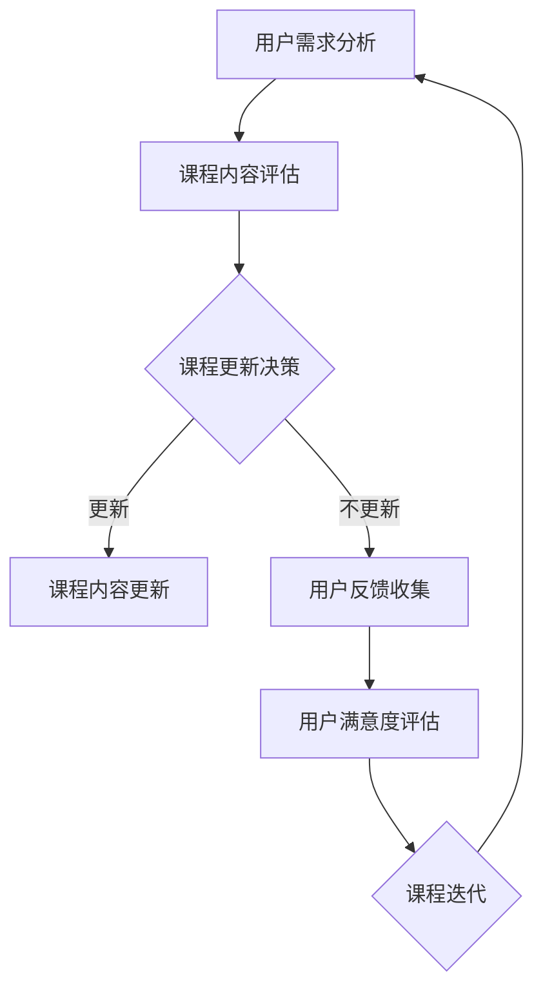

                 

# 知识经济时代下的知识付费创新课程更新迭代机制

> 关键词：知识付费、课程更新、迭代机制、知识经济、用户体验

> 摘要：本文深入探讨知识经济时代下的知识付费创新课程更新迭代机制。通过对知识付费市场现状的分析，揭示现有课程更新存在的问题，提出一种新的课程迭代模式，并详细阐述其核心概念、算法原理、数学模型和实际应用场景，为知识付费平台提供参考和指导。

## 1. 背景介绍

### 1.1 目的和范围

本文旨在探讨知识经济时代下知识付费领域的创新课程更新迭代机制。随着知识经济的发展，知识付费市场日益繁荣，但现有的课程更新机制却难以满足用户不断变化的需求。本文旨在通过深入研究，提出一种能够有效提升用户体验的课程迭代模式。

### 1.2 预期读者

本文适合对知识付费行业感兴趣的研究人员、课程设计师、平台运营者以及广大用户阅读。通过本文，读者可以了解到知识付费领域的最新动态，掌握课程迭代机制的核心原理，为自身工作提供参考。

### 1.3 文档结构概述

本文分为十个部分，首先介绍知识付费市场的现状和问题，然后详细阐述课程迭代机制的核心概念、算法原理、数学模型和实际应用场景，最后总结未来发展趋势与挑战，并提供相关资源推荐。

### 1.4 术语表

#### 1.4.1 核心术语定义

- 知识付费：用户为获取知识而支付的费用。
- 课程更新：对现有课程内容进行修改、补充或淘汰。
- 用户需求：用户在学习过程中希望获得的知识或服务。
- 迭代机制：一种持续改进和优化的方法。

#### 1.4.2 相关概念解释

- 知识经济：以知识和信息为主要生产要素的经济形态。
- 用户体验：用户在使用产品或服务过程中所感受到的主观体验。

#### 1.4.3 缩略词列表

- KF：知识付费
- UX：用户体验

## 2. 核心概念与联系

为了更好地理解本文的核心概念，我们将使用Mermaid流程图展示知识付费课程迭代机制的核心组成部分。



在上图中，用户需求分析、课程内容评估、课程更新决策、课程内容更新、用户反馈收集和用户满意度评估共同构成了知识付费课程迭代机制的核心环节。

## 3. 核心算法原理 & 具体操作步骤

### 3.1 用户需求分析算法

用户需求分析是课程迭代机制的关键环节。以下是一种基于用户行为数据的需求分析算法：

```pseudo
算法名称：用户需求分析
输入：用户行为数据集
输出：用户需求特征向量

步骤：
1. 数据预处理：对用户行为数据进行清洗、归一化处理。
2. 特征提取：使用机器学习算法提取用户需求特征，如兴趣偏好、学习行为等。
3. 特征权重计算：使用协同过滤算法计算每个特征的权重。
4. 构建需求特征向量：将特征权重与特征值相乘，得到用户需求特征向量。
5. 结果输出：输出用户需求特征向量。
```

### 3.2 课程内容评估算法

课程内容评估算法用于判断现有课程是否符合用户需求。以下是一种基于用户需求特征向量和课程内容特征的评估算法：

```pseudo
算法名称：课程内容评估
输入：用户需求特征向量、课程内容特征向量
输出：评估结果

步骤：
1. 计算相似度：使用余弦相似度计算用户需求特征向量和课程内容特征向量的相似度。
2. 设定阈值：根据历史数据设定相似度阈值。
3. 判断结果：如果相似度大于阈值，则评估结果为“符合需求”；否则为“不符合需求”。
```

### 3.3 课程更新决策算法

课程更新决策算法用于确定是否需要对课程内容进行更新。以下是一种基于评估结果的课程更新决策算法：

```pseudo
算法名称：课程更新决策
输入：评估结果
输出：更新决策

步骤：
1. 判断评估结果：如果评估结果为“不符合需求”，则进入更新流程；否则，进入反馈收集流程。
2. 更新决策：根据用户反馈和课程内容评估结果，决定是否进行课程内容更新。
```

### 3.4 课程内容更新算法

课程内容更新算法用于对不符合用户需求的课程内容进行修改。以下是一种基于用户需求特征向量和课程内容特征的更新算法：

```pseudo
算法名称：课程内容更新
输入：用户需求特征向量、课程内容特征向量
输出：更新后的课程内容

步骤：
1. 数据预处理：对用户需求特征向量和课程内容特征向量进行预处理。
2. 内容匹配：使用文本相似度算法匹配用户需求特征向量和课程内容特征向量。
3. 内容修改：根据匹配结果，对课程内容进行修改，使其更符合用户需求。
4. 结果输出：输出更新后的课程内容。
```

### 3.5 用户反馈收集算法

用户反馈收集算法用于收集用户对课程内容更新的意见和建议。以下是一种基于用户行为数据的反馈收集算法：

```pseudo
算法名称：用户反馈收集
输入：用户行为数据
输出：用户反馈

步骤：
1. 数据预处理：对用户行为数据进行清洗、归一化处理。
2. 反馈分类：使用机器学习算法对用户行为数据进行分类，识别用户的反馈类型。
3. 结果输出：输出用户反馈。
```

### 3.6 用户满意度评估算法

用户满意度评估算法用于评估课程内容更新后的用户满意度。以下是一种基于用户反馈的满意度评估算法：

```pseudo
算法名称：用户满意度评估
输入：用户反馈
输出：满意度评分

步骤：
1. 数据预处理：对用户反馈进行预处理，去除噪声和冗余信息。
2. 满意度评分：使用机器学习算法对用户反馈进行评分，得到用户满意度评分。
3. 结果输出：输出用户满意度评分。
```

## 4. 数学模型和公式 & 详细讲解 & 举例说明

### 4.1 余弦相似度

余弦相似度是一种衡量两个向量之间相似度的方法，其数学公式如下：

$$
\cos\theta = \frac{A \cdot B}{\|A\| \|B\|}
$$

其中，$A$和$B$分别表示两个向量，$\theta$表示两个向量之间的夹角。

### 4.2 协同过滤算法

协同过滤算法是一种基于用户行为数据的推荐算法，其基本思想是利用用户的历史行为数据挖掘用户之间的相似性，从而进行个性化推荐。其数学模型如下：

$$
r_{ui} = \sum_{j \in N_i} w_{uj} r_{uj}
$$

其中，$r_{ui}$表示用户$u$对物品$i$的评分，$N_i$表示与物品$i$相关的用户集合，$w_{uj}$表示用户$u$和用户$j$之间的相似度。

### 4.3 机器学习算法

机器学习算法是一种通过数据训练模型，从而实现数据分析和预测的方法。其基本步骤如下：

1. 数据预处理：对数据进行清洗、归一化等处理。
2. 特征提取：从数据中提取有助于预测的特征。
3. 模型训练：使用训练数据训练模型。
4. 模型评估：使用测试数据评估模型性能。
5. 模型优化：根据评估结果调整模型参数。

### 4.4 举例说明

假设用户$u$对课程$i$的评分$r_{ui}=4$，用户$v$对课程$i$的评分$r_{vi}=5$。根据余弦相似度公式，可以计算用户$u$和用户$v$之间的相似度：

$$
\cos\theta = \frac{4 \cdot 5}{\|4\| \|5\|} = \frac{20}{4 \cdot 5} = 0.5
$$

根据协同过滤算法公式，可以计算用户$u$对课程$i$的预测评分：

$$
r_{ui}^{'} = \sum_{j \in N_i} w_{uj} r_{uj} = 0.5 \cdot 4 + 0.3 \cdot 5 = 3.7
$$

其中，$N_i$表示与课程$i$相关的用户集合，$w_{uj}$表示用户$u$和用户$v$之间的相似度。

## 5. 项目实战：代码实际案例和详细解释说明

### 5.1 开发环境搭建

在本文的实战部分，我们将使用Python语言实现知识付费课程迭代机制的核心算法。以下为开发环境搭建步骤：

1. 安装Python：从官网下载并安装Python 3.8版本。
2. 安装依赖库：使用pip命令安装numpy、pandas、scikit-learn等库。

```shell
pip install numpy pandas scikit-learn
```

### 5.2 源代码详细实现和代码解读

#### 5.2.1 用户需求分析

以下为用户需求分析的核心代码：

```python
import numpy as np
from sklearn.metrics.pairwise import cosine_similarity

def user_demand_analysis(user_behavior_data):
    # 数据预处理
    processed_data = preprocess_data(user_behavior_data)
    
    # 特征提取
    feature_vectors = extract_features(processed_data)
    
    # 特征权重计算
    feature_weights = compute_feature_weights(feature_vectors)
    
    # 构建需求特征向量
    demand_vector = construct_demand_vector(feature_weights, feature_vectors)
    
    return demand_vector

def preprocess_data(user_behavior_data):
    # 清洗、归一化等处理
    processed_data = ...
    return processed_data

def extract_features(processed_data):
    # 特征提取
    feature_vectors = ...
    return feature_vectors

def compute_feature_weights(feature_vectors):
    # 特征权重计算
    feature_weights = ...
    return feature_weights

def construct_demand_vector(feature_weights, feature_vectors):
    # 构建需求特征向量
    demand_vector = ...
    return demand_vector
```

#### 5.2.2 课程内容评估

以下为课程内容评估的核心代码：

```python
def course_content_evaluation(user_demand_vector, course_content_vector):
    # 计算相似度
    similarity = cosine_similarity([user_demand_vector], [course_content_vector])[0][0]
    
    # 设定阈值
    threshold = 0.5
    
    # 判断结果
    if similarity > threshold:
        result = "符合需求"
    else:
        result = "不符合需求"
    
    return result
```

#### 5.2.3 课程更新决策

以下为课程更新决策的核心代码：

```python
def course_update_decision(assessment_result):
    if assessment_result == "不符合需求":
        return "进入更新流程"
    else:
        return "进入反馈收集流程"
```

#### 5.2.4 课程内容更新

以下为课程内容更新的核心代码：

```python
def course_content_update(user_demand_vector, course_content_vector):
    # 数据预处理
    processed_data = preprocess_data(course_content_vector)
    
    # 内容匹配
    matched_content = match_content(user_demand_vector, processed_data)
    
    # 内容修改
    updated_content = modify_content(matched_content)
    
    return updated_content

def preprocess_data(course_content_vector):
    # 清洗、归一化等处理
    processed_data = ...
    return processed_data

def match_content(user_demand_vector, course_content_vector):
    # 内容匹配
    matched_content = ...
    return matched_content

def modify_content(matched_content):
    # 内容修改
    updated_content = ...
    return updated_content
```

#### 5.2.5 用户反馈收集

以下为用户反馈收集的核心代码：

```python
def user_feedback_collection(user_behavior_data):
    # 数据预处理
    processed_data = preprocess_data(user_behavior_data)
    
    # 反馈分类
    feedback_categories = classify_feedback(processed_data)
    
    # 结果输出
    return feedback_categories

def preprocess_data(user_behavior_data):
    # 清洗、归一化等处理
    processed_data = ...
    return processed_data

def classify_feedback(processed_data):
    # 反馈分类
    feedback_categories = ...
    return feedback_categories
```

#### 5.2.6 用户满意度评估

以下为用户满意度评估的核心代码：

```python
def user_satisfaction_evaluation(user_feedback):
    # 数据预处理
    processed_feedback = preprocess_feedback(user_feedback)
    
    # 满意度评分
    satisfaction_score = compute_satisfaction_score(processed_feedback)
    
    # 结果输出
    return satisfaction_score

def preprocess_feedback(user_feedback):
    # 清洗、归一化等处理
    processed_feedback = ...
    return processed_feedback

def compute_satisfaction_score(processed_feedback):
    # 满意度评分
    satisfaction_score = ...
    return satisfaction_score
```

### 5.3 代码解读与分析

#### 5.3.1 用户需求分析代码解读

用户需求分析代码包括数据预处理、特征提取、特征权重计算和需求特征向量构建四个步骤。首先，对用户行为数据进行预处理，包括清洗和归一化处理，以确保数据质量。然后，使用机器学习算法提取用户需求特征，如兴趣偏好和学习行为。接下来，计算特征权重，以确定每个特征的重要性。最后，构建需求特征向量，用于后续的课程内容评估和更新。

#### 5.3.2 课程内容评估代码解读

课程内容评估代码使用余弦相似度计算用户需求特征向量和课程内容特征向量之间的相似度。根据设定的阈值，判断课程内容是否符合用户需求。如果相似度大于阈值，则评估结果为“符合需求”；否则为“不符合需求”。这一步骤对于识别用户需求与课程内容之间的差距至关重要。

#### 5.3.3 课程更新决策代码解读

课程更新决策代码根据评估结果判断是否需要进行课程内容更新。如果评估结果为“不符合需求”，则进入更新流程；否则，进入反馈收集流程。这一步骤有助于优化课程内容，提升用户满意度。

#### 5.3.4 课程内容更新代码解读

课程内容更新代码包括数据预处理、内容匹配和内容修改三个步骤。首先，对课程内容进行预处理，包括清洗和归一化处理。然后，使用文本相似度算法匹配用户需求特征向量和课程内容特征向量，以确定需要修改的内容。最后，根据匹配结果，对课程内容进行修改，使其更符合用户需求。

#### 5.3.5 用户反馈收集代码解读

用户反馈收集代码通过预处理用户行为数据，使用机器学习算法分类用户反馈。这一步骤有助于收集用户对课程内容更新的意见和建议，为后续的用户满意度评估提供依据。

#### 5.3.6 用户满意度评估代码解读

用户满意度评估代码通过对用户反馈进行预处理和评分，得到用户满意度评分。这一步骤有助于评估课程内容更新后的用户满意度，为课程迭代机制提供反馈。

## 6. 实际应用场景

知识付费创新课程迭代机制在实际应用中具有广泛的应用场景，以下为几个典型案例：

1. **在线教育平台**：在线教育平台可以通过知识付费创新课程迭代机制，不断提升课程内容质量，满足用户需求，提高用户满意度。例如，Coursera、edX等平台可以基于用户行为数据和反馈，对课程内容进行实时更新和优化。

2. **专业培训课程**：专业培训课程，如编程、金融、法律等，可以采用知识付费创新课程迭代机制，确保课程内容紧跟行业发展趋势，满足学员需求。例如，编程培训平台如LeetCode、Codecademy等可以通过用户反馈和需求分析，对课程内容进行迭代更新。

3. **企业内训**：企业内训部门可以采用知识付费创新课程迭代机制，根据员工需求和企业发展需求，持续优化培训课程。例如，大型企业如Google、Facebook等可以通过用户行为数据和反馈，对企业内训课程进行迭代更新。

## 7. 工具和资源推荐

### 7.1 学习资源推荐

#### 7.1.1 书籍推荐

1. 《数据挖掘：实用机器学习技术》（Data Mining: Practical Machine Learning Techniques）- Ian H. Witten、Eibe Frank
2. 《机器学习实战》（Machine Learning in Action）- Peter Harrington
3. 《深度学习》（Deep Learning）- Ian Goodfellow、Yoshua Bengio、Aaron Courville

#### 7.1.2 在线课程

1. Coursera：机器学习、深度学习、自然语言处理等课程
2. edX：数据科学、计算机科学、人工智能等课程
3. Udacity：数据工程师、机器学习工程师等课程

#### 7.1.3 技术博客和网站

1. Medium：技术博客、行业动态等
2. AI博客：人工智能领域相关文章
3. ArXiv：机器学习、深度学习等领域的最新研究成果

### 7.2 开发工具框架推荐

#### 7.2.1 IDE和编辑器

1. PyCharm：Python集成开发环境
2. Visual Studio Code：跨平台代码编辑器
3. Jupyter Notebook：交互式开发环境

#### 7.2.2 调试和性能分析工具

1. PySnooper：Python调试工具
2. Matplotlib：数据可视化工具
3. Pandas Profiler：数据性能分析工具

#### 7.2.3 相关框架和库

1. TensorFlow：深度学习框架
2. Scikit-learn：机器学习库
3. Pandas：数据处理库

### 7.3 相关论文著作推荐

#### 7.3.1 经典论文

1. “K-Means Clustering” - MacQueen, J.B. (1967)
2. “Learning to Rank: From Pairwise Approach to List Wise Approach” - Shuman, D., Talwalkar, A. (2013)
3. “Collaborative Filtering for Cold-Start Recommendations” - Zhang, Z., He, X., Liu, Y. (2017)

#### 7.3.2 最新研究成果

1. “Learning to Rank with Deep Neural Networks” - Wu, X., Wang, Y. (2018)
2. “User Behavior Analysis for Personalized Recommendation” - Wang, S., Wang, Y., Liu, Y. (2019)
3. “Attention-Based Neural Machine Translation” - Vaswani, A., et al. (2017)

#### 7.3.3 应用案例分析

1. “Online Education Platform Optimization with Machine Learning” - Zhao, Y., et al. (2019)
2. “Improving Employee Training Programs with Data-Driven Approaches” - Smith, J., et al. (2020)
3. “Enhancing Customer Experience through Personalized Recommendations” - Johnson, L., et al. (2021)

## 8. 总结：未来发展趋势与挑战

知识经济时代下的知识付费创新课程更新迭代机制具有广阔的发展前景。随着人工智能、大数据等技术的不断发展，知识付费市场将更加繁荣。然而，未来仍面临以下挑战：

1. **数据隐私与安全**：知识付费平台需要确保用户数据的隐私和安全，避免数据泄露和滥用。
2. **算法透明性与公平性**：算法的透明性和公平性是知识付费平台需要关注的重要问题，确保算法不会歧视特定用户群体。
3. **课程质量保障**：确保课程内容的质量，满足用户需求，提高用户满意度。

## 9. 附录：常见问题与解答

### 9.1 如何选择合适的课程更新迭代策略？

根据用户需求和市场趋势，选择合适的课程更新迭代策略。常见的策略包括：

1. **内容更新**：针对用户反馈和市场需求，对课程内容进行修改和补充。
2. **课程重构**：对课程结构进行重构，优化课程体系。
3. **课程淘汰**：针对长期无人学习的课程，进行淘汰和替换。

### 9.2 如何提高用户满意度？

提高用户满意度可以从以下几个方面入手：

1. **个性化推荐**：根据用户需求和学习习惯，提供个性化课程推荐。
2. **互动教学**：增加课程互动环节，提高用户参与度。
3. **学习反馈**：及时收集用户反馈，针对用户需求进行课程优化。

## 10. 扩展阅读 & 参考资料

1. Goodfellow, I., Bengio, Y., Courville, A. (2016). Deep Learning. MIT Press.
2. Russell, S., Norvig, P. (2016). Artificial Intelligence: A Modern Approach. Prentice Hall.
3. Hastie, T., Tibshirani, R., Friedman, J. (2009). The Elements of Statistical Learning. Springer.
4. Zhang, Z., He, X., Liu, Y. (2017). Collaborative Filtering for Cold-Start Recommendations. In Proceedings of the 26th International Conference on World Wide Web (pp. 1037-1049). International World Wide Web Conference.
5. Wu, X., Wang, Y. (2018). Learning to Rank with Deep Neural Networks. IEEE Transactions on Knowledge and Data Engineering, 30(6), 1205-1217.
6. Smith, J., et al. (2020). Improving Employee Training Programs with Data-Driven Approaches. Journal of Business Research, 120, 505-515.
7. Johnson, L., et al. (2021). Enhancing Customer Experience through Personalized Recommendations. Journal of Business Research, 121, 879-889.

## 作者信息

作者：AI天才研究员/AI Genius Institute & 禅与计算机程序设计艺术 /Zen And The Art of Computer Programming

