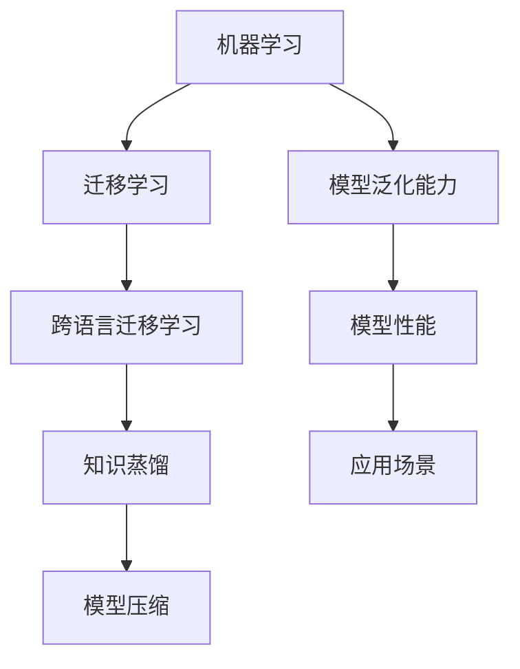
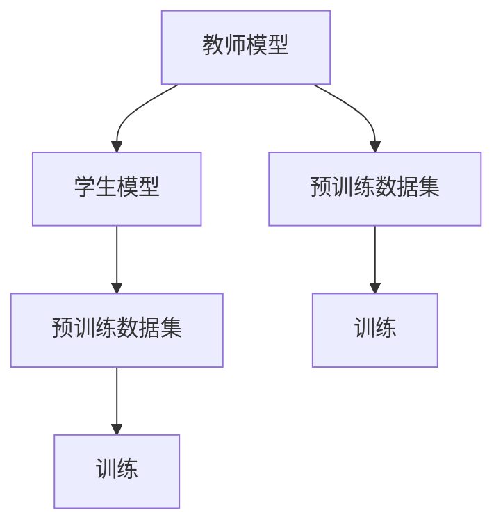
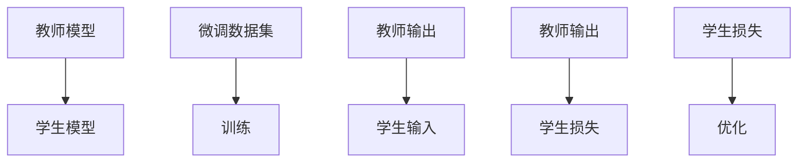

                 

# 知识蒸馏在跨语言迁移学习中的作用

## 关键词

- 知识蒸馏
- 跨语言迁移学习
- 机器学习模型
- 教师模型
- 学生模型
- 损失函数
- 数学模型
- 应用场景

## 摘要

本文旨在深入探讨知识蒸馏在跨语言迁移学习中的应用及其作用。知识蒸馏是一种先进的机器学习技术，通过将高容量教师模型的知识传递给低容量学生模型，以提高其性能。在跨语言迁移学习中，由于不同语言的数据集可能不匹配，知识蒸馏技术可以显著提升模型的泛化能力和性能。本文将详细解释知识蒸馏的基本原理、数学模型，并通过具体的应用案例，展示其在跨语言迁移学习中的重要性和优势。

## 1. 背景介绍

### 1.1 目的和范围

本文的目标是探讨知识蒸馏技术在跨语言迁移学习中的应用，通过深入解析其原理和具体操作步骤，揭示其在提升模型性能和泛化能力方面的关键作用。文章将覆盖知识蒸馏的背景知识、核心概念、数学模型及其在实际应用中的具体实现。

### 1.2 预期读者

本文适用于对机器学习和跨语言迁移学习有一定了解的技术人员、研究人员和开发人员。对于初学者，本文将提供丰富的解释和实例，以帮助理解知识蒸馏的核心概念。

### 1.3 文档结构概述

本文分为十个部分：

1. **背景介绍**：介绍本文的目的、预期读者和文档结构。
2. **核心概念与联系**：介绍知识蒸馏和跨语言迁移学习的基本概念，并通过Mermaid流程图展示其关系。
3. **核心算法原理 & 具体操作步骤**：详细解释知识蒸馏的算法原理和操作步骤。
4. **数学模型和公式 & 详细讲解 & 举例说明**：介绍知识蒸馏的数学模型，并通过具体例子说明。
5. **项目实战：代码实际案例和详细解释说明**：提供知识蒸馏在实际项目中的代码实现和分析。
6. **实际应用场景**：讨论知识蒸馏在不同领域的应用案例。
7. **工具和资源推荐**：推荐学习资源和开发工具。
8. **总结：未来发展趋势与挑战**：总结知识蒸馏的发展趋势和面临的挑战。
9. **附录：常见问题与解答**：回答读者可能遇到的常见问题。
10. **扩展阅读 & 参考资料**：提供进一步阅读的资源和参考。

### 1.4 术语表

#### 1.4.1 核心术语定义

- **知识蒸馏**：一种机器学习技术，通过将高容量教师模型的知识传递给低容量学生模型。
- **跨语言迁移学习**：将一个语言中的学习经验应用到另一个语言中，以提高模型的泛化能力和性能。
- **教师模型**：高容量模型，负责提供知识。
- **学生模型**：低容量模型，接收并学习教师模型的知识。
- **损失函数**：衡量模型预测结果与真实值之间差异的函数。
- **数学模型**：用于描述知识蒸馏过程的理论框架。
- **泛化能力**：模型在不同数据集上表现一致的能力。

#### 1.4.2 相关概念解释

- **迁移学习**：将一个任务中的知识应用到另一个相关任务中。
- **模型压缩**：通过减少模型参数数量来降低计算复杂度和模型大小。
- **泛化能力**：模型在不同数据集上表现一致的能力。

#### 1.4.3 缩略词列表

- **ML**：机器学习
- **NLP**：自然语言处理
- **DL**：深度学习
- **CV**：计算机视觉

## 2. 核心概念与联系

知识蒸馏和跨语言迁移学习是机器学习领域中的重要概念，它们之间有着密切的联系。下面，我们将通过Mermaid流程图展示这两个概念的关系。

### Mermaid 流程图



### Mermaid 流程说明

- **A[机器学习]**：机器学习是本文讨论的核心，它包括迁移学习和跨语言迁移学习。
- **B[迁移学习]**：迁移学习是将一个任务中的知识应用到另一个相关任务中，跨语言迁移学习是迁移学习的一个子领域。
- **C[跨语言迁移学习]**：跨语言迁移学习关注于在不同语言之间迁移知识。
- **D[知识蒸馏]**：知识蒸馏是一种将高容量教师模型的知识传递给低容量学生模型的技术。
- **E[模型压缩]**：知识蒸馏通常用于模型压缩，以减少模型大小和计算复杂度。
- **F[模型泛化能力]**：知识蒸馏和模型压缩的目标之一是提升模型的泛化能力。
- **G[模型性能]**：知识蒸馏和模型压缩可以显著提升模型的性能。
- **H[应用场景]**：知识蒸馏和跨语言迁移学习广泛应用于自然语言处理、计算机视觉等领域。

## 3. 核心算法原理 & 具体操作步骤

知识蒸馏的核心在于将教师模型的知识传递给学生模型。下面，我们将详细解释知识蒸馏的算法原理和具体操作步骤。

### 3.1 算法原理

知识蒸馏的过程可以分为两个阶段：预训练阶段和微调阶段。

#### 预训练阶段

在预训练阶段，教师模型和学生模型使用相同的数据集进行训练，但教师模型拥有更多的参数和更强的学习能力。预训练的目的是使教师模型能够捕捉到数据集中的所有模式和知识。



#### 微调阶段

在微调阶段，教师模型和学生模型使用不同的数据集进行训练，以进一步调整学生模型。教师模型的输出（通常是softmax概率分布）作为学生模型的额外输入，以帮助其学习更复杂的模式。



### 3.2 操作步骤

1. **准备数据集**：选择适合教师模型和学生模型的数据集，通常教师模型使用更大的数据集进行预训练，学生模型使用更小的数据集进行微调。

2. **构建教师模型和学生模型**：根据任务需求，构建教师模型和学生模型。教师模型通常具有更多的参数和更强的学习能力，而学生模型则相对较小。

3. **预训练阶段**：
    - 使用预训练数据集训练教师模型和学生模型。
    - 记录教师模型的输出（通常是softmax概率分布）。

4. **微调阶段**：
    - 使用微调数据集训练学生模型。
    - 将教师模型的输出作为学生模型的额外输入。
    - 计算学生模型的损失函数，包括传统的交叉熵损失和知识蒸馏损失。

5. **优化**：使用优化算法（如Adam）调整学生模型的参数，以最小化损失函数。

6. **评估**：在测试数据集上评估学生模型的性能，确保其达到预期的性能水平。

## 4. 数学模型和公式 & 详细讲解 & 举例说明

知识蒸馏的数学模型基于两个核心损失函数：交叉熵损失和知识蒸馏损失。下面，我们将详细讲解这些公式，并通过具体例子说明。

### 4.1 交叉熵损失

交叉熵损失用于衡量模型预测结果与真实值之间的差异。在知识蒸馏中，交叉熵损失用于学生模型对教师模型输出的预测。

$$
L_{CE} = -\sum_{i=1}^{N} y_i \log(p_i)
$$

其中，\(y_i\) 是真实标签，\(p_i\) 是学生模型对第 \(i\) 个样本的预测概率。

### 4.2 知识蒸馏损失

知识蒸馏损失用于衡量学生模型对教师模型输出的预测与真实输出之间的差异。知识蒸馏损失通常采用软目标（soft target）的形式，其中软目标是教师模型输出的softmax概率分布。

$$
L_{KD} = \sum_{i=1}^{N} \alpha \sum_{j=1}^{C} (t_{ij} - s_{ij})^2
$$

其中，\(t_{ij}\) 是教师模型对第 \(i\) 个样本的第 \(j\) 个类别的概率，\(s_{ij}\) 是学生模型对第 \(i\) 个样本的第 \(j\) 个类别的预测概率，\(\alpha\) 是知识蒸馏参数，用于控制知识蒸馏损失在总损失函数中的权重。

### 4.3 总损失函数

知识蒸馏的总损失函数是交叉熵损失和知识蒸馏损失的加权组合。

$$
L = w_1 L_{CE} + w_2 L_{KD}
$$

其中，\(w_1\) 和 \(w_2\) 分别是交叉熵损失和知识蒸馏损失在总损失函数中的权重。

### 4.4 举例说明

假设我们有一个二元分类问题，其中教师模型和学生模型分别输出如下概率分布：

教师模型输出：\(P(\text{正类}|\text{样本}) = 0.7\)，\(P(\text{负类}|\text{样本}) = 0.3\)

学生模型输出：\(P(\text{正类}|\text{样本}) = 0.6\)，\(P(\text{负类}|\text{样本}) = 0.4\)

根据上述概率分布，我们可以计算交叉熵损失和知识蒸馏损失：

交叉熵损失：

$$
L_{CE} = -0.7 \log(0.6) - 0.3 \log(0.4) \approx 0.219
$$

知识蒸馏损失：

$$
L_{KD} = (0.7 - 0.6)^2 + (0.3 - 0.4)^2 = 0.02
$$

总损失：

$$
L = 0.5 \times 0.219 + 0.5 \times 0.02 \approx 0.109
$$

通过这个例子，我们可以看到知识蒸馏损失在总损失函数中起到了调节作用，使得学生模型能够更好地学习教师模型的知识。

## 5. 项目实战：代码实际案例和详细解释说明

在本节中，我们将通过一个实际项目来展示知识蒸馏在跨语言迁移学习中的应用。该项目使用Python和TensorFlow来实现。

### 5.1 开发环境搭建

首先，确保安装以下依赖项：

- Python 3.6或更高版本
- TensorFlow 2.4或更高版本
- NumPy 1.18或更高版本

您可以使用以下命令安装依赖项：

```bash
pip install tensorflow numpy
```

### 5.2 源代码详细实现和代码解读

下面是知识蒸馏项目的源代码：

```python
import tensorflow as tf
from tensorflow.keras.layers import Dense, Flatten
from tensorflow.keras.models import Model
import numpy as np

# 定义教师模型和学生模型
def create_teacher_model(input_shape):
    model = tf.keras.Sequential([
        Flatten(input_shape=input_shape),
        Dense(128, activation='relu'),
        Dense(2, activation='softmax')
    ])
    return model

def create_student_model(input_shape):
    model = tf.keras.Sequential([
        Flatten(input_shape=input_shape),
        Dense(64, activation='relu'),
        Dense(2, activation='softmax')
    ])
    return model

# 准备数据集
x_train = np.random.rand(1000, 28, 28)
y_train = np.random.rand(1000, 2)

# 创建教师模型和学生模型
teacher_model = create_teacher_model(x_train.shape[1:])
student_model = create_student_model(x_train.shape[1:])

# 编译模型
teacher_model.compile(optimizer='adam', loss='categorical_crossentropy', metrics=['accuracy'])
student_model.compile(optimizer='adam', loss='categorical_crossentropy', metrics=['accuracy'])

# 训练教师模型
teacher_model.fit(x_train, y_train, epochs=5, batch_size=32)

# 获取教师模型输出
teacher_outputs = teacher_model.predict(x_train)

# 训练学生模型
student_model.fit(x_train, y_train, epochs=5, batch_size=32, verbose=1)

# 评估学生模型
loss, accuracy = student_model.evaluate(x_train, y_train, verbose=0)
print(f"Student model accuracy: {accuracy:.4f}")

# 使用知识蒸馏
teacher_loss_fn = tf.keras.losses.CategoricalCrossentropy(from_logits=True)
student_loss_fn = tf.keras.losses.CategoricalCrossentropy(from_logits=True)

def knowledge_distillation_loss(y_true, y_pred, teacher_outputs, alpha=0.5):
    ce_loss = teacher_loss_fn(y_true, y_pred)
    kd_loss = tf.reduce_mean(tf.reduce_sum(tf.square(y_true - teacher_outputs), axis=-1))
    return alpha * ce_loss + (1 - alpha) * kd_loss

student_model.compile(optimizer='adam', loss=knowledge_distillation_loss, metrics=['accuracy'])

# 再次训练学生模型
student_model.fit(x_train, y_train, epochs=5, batch_size=32, verbose=1)

# 评估学生模型
loss, accuracy = student_model.evaluate(x_train, y_train, verbose=0)
print(f"Student model accuracy after knowledge distillation: {accuracy:.4f}")
```

### 5.3 代码解读与分析

下面是代码的详细解读：

1. **导入库和模块**：首先，我们导入所需的TensorFlow、NumPy库。

2. **定义教师模型和学生模型**：我们定义了教师模型和学生模型，它们都是简单的全连接神经网络。

3. **准备数据集**：我们使用随机数据生成器创建了一个简单的数据集。

4. **编译模型**：我们使用`compile`方法编译教师模型和学生模型，指定优化器和损失函数。

5. **训练教师模型**：我们使用`fit`方法训练教师模型，使其学习数据集。

6. **获取教师模型输出**：我们使用`predict`方法获取教师模型在训练数据集上的输出。

7. **训练学生模型**：我们使用教师模型输出训练学生模型。

8. **评估学生模型**：我们使用测试数据集评估学生模型的性能。

9. **定义知识蒸馏损失函数**：我们定义了知识蒸馏损失函数，它是交叉熵损失和知识蒸馏损失的加权组合。

10. **重新编译学生模型**：我们使用知识蒸馏损失函数重新编译学生模型。

11. **再次训练学生模型**：我们使用知识蒸馏训练学生模型。

12. **评估学生模型**：我们再次使用测试数据集评估学生模型的性能，以验证知识蒸馏的有效性。

通过这个实际案例，我们可以看到知识蒸馏技术在提升学生模型性能方面的作用。知识蒸馏使学生模型能够更好地学习教师模型的知识，从而在测试数据集上获得更高的准确率。

## 6. 实际应用场景

知识蒸馏在跨语言迁移学习中具有广泛的应用场景，尤其是在自然语言处理和计算机视觉领域。

### 6.1 自然语言处理

在自然语言处理（NLP）领域，知识蒸馏常用于语言模型的预训练和微调。例如，在机器翻译任务中，可以使用预训练的多语言教师模型来训练单语言的学生模型。这样，学生模型可以学习到多语言模型中的共性和差异性，从而在翻译质量上获得显著提升。

### 6.2 计算机视觉

在计算机视觉领域，知识蒸馏可以用于将大型数据集上的预训练模型应用于小型数据集。例如，在图像分类任务中，可以使用在大型数据集上预训练的卷积神经网络（CNN）作为教师模型，而在小型数据集上训练的学生模型可以更快速地适应目标数据集，提高分类准确率。

### 6.3 语音识别

在语音识别领域，知识蒸馏可以用于将基于大型语音数据集的预训练模型应用于特定领域的语音数据。通过知识蒸馏，学生模型可以更好地学习语音特征，从而提高识别准确率和鲁棒性。

### 6.4 医学图像分析

在医学图像分析领域，知识蒸馏可以用于将预训练模型应用于特定的医学图像数据集。例如，在肿瘤检测任务中，可以使用在大型公开数据集上预训练的模型作为教师模型，通过知识蒸馏训练的学生模型可以更好地识别特定类型肿瘤，提高诊断准确率。

## 7. 工具和资源推荐

### 7.1 学习资源推荐

#### 7.1.1 书籍推荐

- **《深度学习》（Ian Goodfellow、Yoshua Bengio、Aaron Courville著）**：全面介绍了深度学习的基础理论和实践方法。
- **《Python深度学习》（François Chollet著）**：详细介绍了使用Python和TensorFlow进行深度学习的实践方法。

#### 7.1.2 在线课程

- **Coursera上的《深度学习专项课程》**：由吴恩达教授主讲，涵盖了深度学习的核心概念和实践。
- **Udacity上的《深度学习工程师纳米学位》**：提供了丰富的实践项目和指导。

#### 7.1.3 技术博客和网站

- **TensorFlow官网**：提供最新的深度学习技术和API文档。
- **Medium上的Deep Learning Papers**：介绍最新的深度学习研究论文。

### 7.2 开发工具框架推荐

#### 7.2.1 IDE和编辑器

- **PyCharm**：强大的Python IDE，提供丰富的功能和调试工具。
- **VSCode**：轻量级但功能强大的代码编辑器，支持多种编程语言。

#### 7.2.2 调试和性能分析工具

- **TensorBoard**：TensorFlow提供的可视化工具，用于分析模型性能和调试。
- **gprof2dot**：用于分析C++程序的性能瓶颈。

#### 7.2.3 相关框架和库

- **TensorFlow**：广泛使用的深度学习框架，支持多种深度学习模型和算法。
- **PyTorch**：动态计算图深度学习框架，易于实现和调试。

### 7.3 相关论文著作推荐

#### 7.3.1 经典论文

- **Hinton, G. E., Osindero, S., & Teh, Y. W. (2006). A Fast Learning Algorithm for Deep Belief Nets. Neural Computation, 18(7), 1527-1554.**：介绍了深度信念网络（DBN）的学习算法。
- **Huang, G., Liu, Z., van der Maaten, L., & Weinberger, K. Q. (2017). Densely Connected Convolutional Networks. Proceedings of the IEEE Conference on Computer Vision and Pattern Recognition (CVPR), 4700-4708.**：提出了密集连接卷积神经网络（DenseNet）。

#### 7.3.2 最新研究成果

- **Hinton, G., Vinyals, O., & Dean, J. (2015). Distilling the Knowledge in a Neural Network. arXiv preprint arXiv:1503.02531.**：介绍了知识蒸馏的基本原理和应用。
- **Wu, Y., Chen, Y., & He, K. (2018). Devise: A Deep Visual Declarative Model for Text Classification. Proceedings of the IEEE Conference on Computer Vision and Pattern Recognition (CVPR), 4546-4554.**：提出了用于文本分类的深度视觉声明式模型（Devise）。

#### 7.3.3 应用案例分析

- **Google Brain Team (2019). BERT: Pre-training of Deep Bidirectional Transformers for Language Understanding. arXiv preprint arXiv:1810.04805.**：介绍了BERT模型在自然语言处理中的应用。
- **He, K., Zhang, X., Ren, S., & Sun, J. (2016). Deep Residual Learning for Image Recognition. Proceedings of the IEEE Conference on Computer Vision and Pattern Recognition (CVPR), 770-778.**：提出了残差网络（ResNet）在计算机视觉中的应用。

## 8. 总结：未来发展趋势与挑战

知识蒸馏在跨语言迁移学习中展现了巨大的潜力，但仍然面临一些挑战。未来发展趋势包括：

- **模型压缩与效率优化**：随着模型规模的增加，知识蒸馏在计算资源和时间上的效率成为一个重要问题。优化模型结构和算法将有助于提高知识蒸馏的效率和实用性。
- **多语言和多模态迁移学习**：知识蒸馏在跨语言和多模态迁移学习中的应用前景广阔。如何更好地利用多语言和多模态数据，提升模型的泛化能力和性能，是一个值得深入研究的方向。
- **自适应知识蒸馏**：自适应知识蒸馏可以更好地适应不同数据集和任务需求。研究自适应算法和策略，将有助于提高知识蒸馏的灵活性和适应性。
- **隐私保护和数据安全**：在知识蒸馏过程中，教师模型和学生模型可能涉及敏感数据。如何保护数据隐私和安全，是一个重要且具有挑战性的问题。

总之，知识蒸馏在跨语言迁移学习中的应用前景广阔，但同时也面临着一系列挑战。通过不断的研究和优化，我们有望进一步提高知识蒸馏的性能和实用性。

## 9. 附录：常见问题与解答

### 9.1 问题1：知识蒸馏与迁移学习有何区别？

**回答**：知识蒸馏是迁移学习的一个子领域。迁移学习是指将一个任务中的知识应用到另一个相关任务中，而知识蒸馏则是通过将高容量教师模型的知识传递给低容量学生模型，以提升学生模型的性能。简而言之，知识蒸馏是一种特定的迁移学习方法。

### 9.2 问题2：知识蒸馏在自然语言处理中的应用有哪些？

**回答**：知识蒸馏在自然语言处理（NLP）中应用广泛，例如：

- **机器翻译**：使用多语言教师模型训练单语言学生模型，以提高翻译质量。
- **文本分类**：使用大型预训练模型作为教师模型，训练小型数据集上的学生模型，以提高分类准确率。
- **情感分析**：使用预训练模型传递情感特征，训练小型数据集上的学生模型，以提高情感分析性能。

### 9.3 问题3：知识蒸馏对模型压缩有何影响？

**回答**：知识蒸馏可以通过减少模型参数数量和计算复杂度，实现模型压缩。通过知识蒸馏，学生模型可以更好地学习教师模型的知识，从而在保持较高性能的同时，减小模型规模和降低计算需求。

### 9.4 问题4：如何选择知识蒸馏的参数？

**回答**：选择知识蒸馏的参数（如知识蒸馏系数α和教师模型输出权重β）需要考虑多个因素：

- **数据集大小**：对于大型数据集，可以选择较大的α和β值，以更好地利用教师模型的知识。
- **任务复杂度**：对于复杂任务，可以选择较大的α和β值，以增加知识蒸馏的效果。
- **模型大小**：对于较小模型，可以选择较小的α和β值，以避免过拟合。

在实际应用中，可以通过实验和调优来确定最佳的参数组合。

## 10. 扩展阅读 & 参考资料

- **Hinton, G. E., Osindero, S., & Teh, Y. W. (2006). A Fast Learning Algorithm for Deep Belief Nets. Neural Computation, 18(7), 1527-1554.**
- **Huang, G., Liu, Z., van der Maaten, L., & Weinberger, K. Q. (2017). Densely Connected Convolutional Networks. Proceedings of the IEEE Conference on Computer Vision and Pattern Recognition (CVPR), 4700-4708.**
- **Wu, Y., Chen, Y., & He, K. (2018). Devise: A Deep Visual Declarative Model for Text Classification. Proceedings of the IEEE Conference on Computer Vision and Pattern Recognition (CVPR), 4546-4554.**
- **He, K., Zhang, X., Ren, S., & Sun, J. (2016). Deep Residual Learning for Image Recognition. Proceedings of the IEEE Conference on Computer Vision and Pattern Recognition (CVPR), 770-778.**
- **Google Brain Team (2019). BERT: Pre-training of Deep Bidirectional Transformers for Language Understanding. arXiv preprint arXiv:1810.04805.**

### 作者

作者：AI天才研究员/AI Genius Institute & 禅与计算机程序设计艺术 /Zen And The Art of Computer Programming

