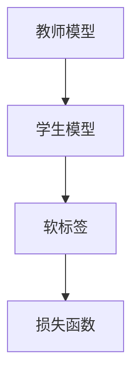
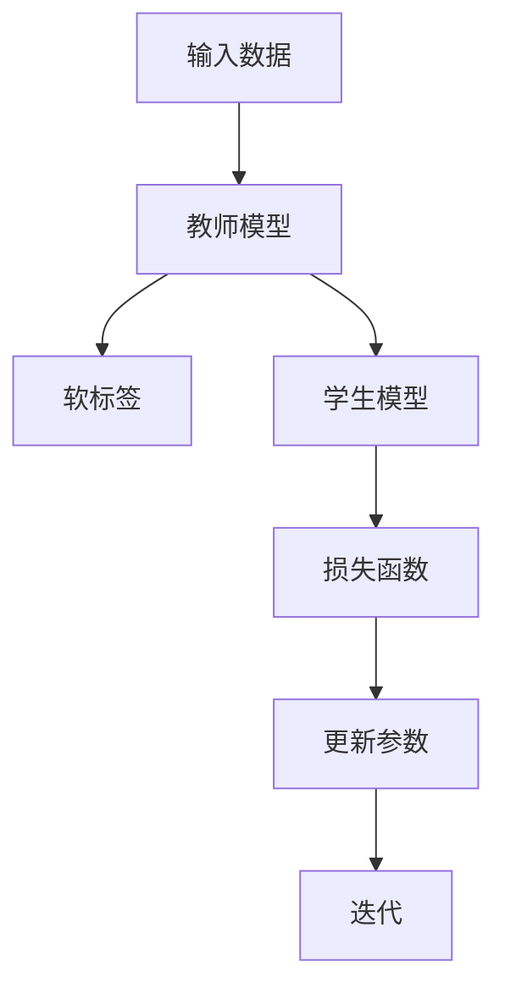

                 

# 知识蒸馏如何改善模型的域适应能力

> 关键词：知识蒸馏，模型域适应，模型压缩，神经网络，深度学习

> 摘要：本文将深入探讨知识蒸馏技术如何通过将复杂模型的知识有效传递给轻量级模型，从而提升模型在特定域或数据分布下的适应能力。文章首先介绍了知识蒸馏的背景和基本概念，随后详细描述了知识蒸馏的原理、数学模型、操作步骤，并通过实际案例展示了其在项目中的具体应用。文章还分析了知识蒸馏在不同实际场景中的应用，推荐了相关学习资源、开发工具和论文研究，最后总结了知识蒸馏技术的发展趋势与面临的挑战。

## 1. 背景介绍

### 1.1 目的和范围

本文旨在探讨知识蒸馏（Knowledge Distillation）技术在改善模型域适应能力方面的应用。知识蒸馏是一种通过将复杂模型（通常为教师模型）的知识有效传递给轻量级模型（通常为学生模型）的技术，从而使得轻量级模型能够具备复杂模型的性能和特点。本文将重点介绍知识蒸馏的基本原理、操作步骤、数学模型以及实际应用场景。

### 1.2 预期读者

本文适合对深度学习和神经网络有一定了解的读者，尤其是希望了解如何利用知识蒸馏技术提升模型适应能力的开发者、数据科学家和研究人员。

### 1.3 文档结构概述

本文分为十个部分，具体如下：

1. 背景介绍：介绍文章的目的、范围、预期读者以及文档结构。
2. 核心概念与联系：介绍知识蒸馏相关的核心概念、原理和架构。
3. 核心算法原理 & 具体操作步骤：详细讲解知识蒸馏的算法原理和具体操作步骤。
4. 数学模型和公式 & 详细讲解 & 举例说明：介绍知识蒸馏的数学模型、公式以及具体例子。
5. 项目实战：代码实际案例和详细解释说明。
6. 实际应用场景：分析知识蒸馏在不同领域的应用。
7. 工具和资源推荐：推荐学习资源、开发工具和相关论文。
8. 总结：未来发展趋势与挑战。
9. 附录：常见问题与解答。
10. 扩展阅读 & 参考资料：提供更多的参考文献和资源。

### 1.4 术语表

#### 1.4.1 核心术语定义

- **知识蒸馏**：一种将教师模型的知识传递给学生模型的技术，通过训练学生模型来复制教师模型的性能。
- **教师模型**：一个性能较好的复杂模型，通常用于知识传递。
- **学生模型**：一个性能较差的轻量级模型，通常用于接收教师模型的知识。
- **软标签**：由教师模型生成的标签，用于指导学生模型的训练。

#### 1.4.2 相关概念解释

- **模型压缩**：通过降低模型参数数量、减少模型大小或提高模型运行效率来降低模型成本的技术。
- **域适应**：模型在不同数据分布或领域下的适应能力。

#### 1.4.3 缩略词列表

- **DL**：深度学习（Deep Learning）
- **NN**：神经网络（Neural Network）
- **KD**：知识蒸馏（Knowledge Distillation）
- **CE**：交叉熵（Cross Entropy）

## 2. 核心概念与联系

为了深入理解知识蒸馏，首先需要了解其背后的核心概念和原理。知识蒸馏主要涉及两个模型：教师模型和学生模型。

### 2.1 教师模型与学生模型

教师模型通常是一个性能较好的复杂模型，它具有较多的参数和层次结构，能够较好地处理复杂的任务。学生模型则通常是一个性能较差的轻量级模型，它具有较少的参数和层次结构，能够降低模型的计算成本。

教师模型和学生模型之间的关系可以用以下 Mermaid 流程图表示：



在这个流程图中，教师模型生成软标签，并将其传递给学生模型。学生模型根据这些软标签更新其参数，以达到提升模型性能的目的。

### 2.2 软标签与损失函数

软标签是由教师模型生成的标签，它不是简单的类别标签，而是一个概率分布。软标签的生成通常基于教师模型的输出。损失函数则是用来衡量学生模型预测结果与教师模型输出之间的差异。

在知识蒸馏过程中，常用的损失函数是交叉熵损失函数，其计算公式如下：

$$
L = -\sum_{i=1}^{N} y_i \cdot \log(\hat{y}_i)
$$

其中，\(y_i\) 是教师模型生成的软标签，\(\hat{y}_i\) 是学生模型的预测概率。

### 2.3 知识蒸馏的过程

知识蒸馏的过程可以分为以下几个步骤：

1. **初始化**：初始化教师模型和学生模型的参数。
2. **前向传播**：输入数据，通过教师模型和学生模型进行前向传播，得到教师模型和学生模型的输出。
3. **生成软标签**：由教师模型生成软标签。
4. **损失函数计算**：计算学生模型的损失函数，根据损失函数更新学生模型的参数。
5. **迭代**：重复以上步骤，直到模型达到预定的性能指标。

整个知识蒸馏的过程可以用以下 Mermaid 流程图表示：



## 3. 核心算法原理 & 具体操作步骤

### 3.1 算法原理

知识蒸馏的核心思想是通过教师模型为学生模型提供软标签，使得学生模型能够学习到教师模型的知识。具体来说，知识蒸馏算法包括以下步骤：

1. **初始化**：初始化教师模型和学生模型的参数。
2. **前向传播**：输入数据，通过教师模型和学生模型进行前向传播，得到教师模型和学生模型的输出。
3. **生成软标签**：由教师模型生成软标签。软标签的生成通常基于教师模型的输出概率分布。
4. **损失函数计算**：计算学生模型的损失函数，常用的损失函数是交叉熵损失函数。损失函数的目的是衡量学生模型的预测结果与教师模型输出之间的差异。
5. **参数更新**：根据损失函数更新学生模型的参数。
6. **迭代**：重复以上步骤，直到模型达到预定的性能指标。

### 3.2 操作步骤

下面以一个简单的例子来说明知识蒸馏的操作步骤。假设我们有一个二分类问题，教师模型和学生模型都是简单的多层感知机（MLP）。

1. **初始化**：初始化教师模型和学生模型的参数。参数的初始化可以是随机的，也可以是预训练的。
    ```python
    import torch
    import torch.nn as nn

    # 初始化教师模型
    teacher_model = nn.Sequential(
        nn.Linear(input_size, hidden_size),
        nn.ReLU(),
        nn.Linear(hidden_size, output_size)
    )

    # 初始化学生模型
    student_model = nn.Sequential(
        nn.Linear(input_size, hidden_size),
        nn.ReLU(),
        nn.Linear(hidden_size, output_size)
    )

    # 初始化损失函数
    criterion = nn.CrossEntropyLoss()
    ```

2. **前向传播**：输入数据，通过教师模型和学生模型进行前向传播，得到教师模型和学生模型的输出。
    ```python
    # 假设输入数据为 X，标签为 y
    with torch.no_grad():
        teacher_output = teacher_model(X)
        student_output = student_model(X)
    ```

3. **生成软标签**：由教师模型生成软标签。软标签的生成通常基于教师模型的输出概率分布。
    ```python
    # 生成软标签
    soft_labels = torch.softmax(teacher_output, dim=1)
    ```

4. **损失函数计算**：计算学生模型的损失函数，常用的损失函数是交叉熵损失函数。损失函数的目的是衡量学生模型的预测结果与教师模型输出之间的差异。
    ```python
    # 计算损失函数
    loss = criterion(student_output, soft_labels)
    ```

5. **参数更新**：根据损失函数更新学生模型的参数。
    ```python
    # 更新参数
    optimizer.zero_grad()
    loss.backward()
    optimizer.step()
    ```

6. **迭代**：重复以上步骤，直到模型达到预定的性能指标。例如，我们可以设置训练轮数为 1000。
    ```python
    for epoch in range(num_epochs):
        for inputs, labels in data_loader:
            # 前向传播、生成软标签、损失函数计算、参数更新
            # ...

    # 在测试集上评估模型性能
    test_loss = criterion(student_model(X), y)
    print(f"Test Loss: {test_loss.item()}")
    ```

## 4. 数学模型和公式 & 详细讲解 & 举例说明

### 4.1 数学模型

知识蒸馏的数学模型主要涉及两部分：损失函数和优化目标。

#### 4.1.1 损失函数

在知识蒸馏中，常用的损失函数是交叉熵损失函数。交叉熵损失函数的计算公式如下：

$$
L = -\sum_{i=1}^{N} y_i \cdot \log(\hat{y}_i)
$$

其中，\(y_i\) 是教师模型生成的软标签，\(\hat{y}_i\) 是学生模型的预测概率。

#### 4.1.2 优化目标

知识蒸馏的优化目标是通过调整学生模型的参数，使得学生模型的预测概率与教师模型的软标签尽可能接近。具体来说，优化目标可以表示为：

$$
\min_{\theta_s} \sum_{i=1}^{N} L(y_i, \hat{y}_i)
$$

其中，\(\theta_s\) 是学生模型的参数。

### 4.2 详细讲解

#### 4.2.1 交叉熵损失函数

交叉熵损失函数是衡量两个概率分布差异的指标。在知识蒸馏中，教师模型的输出概率分布表示为 \(y_i\)，学生模型的输出概率分布表示为 \(\hat{y}_i\)。交叉熵损失函数可以衡量这两个概率分布的差异，其计算公式如下：

$$
L = -\sum_{i=1}^{N} y_i \cdot \log(\hat{y}_i)
$$

其中，\(N\) 是样本数量，\(y_i\) 是教师模型生成的软标签，\(\hat{y}_i\) 是学生模型的预测概率。

#### 4.2.2 优化目标

知识蒸馏的优化目标是使得学生模型的预测概率与教师模型的软标签尽可能接近。具体来说，优化目标可以表示为：

$$
\min_{\theta_s} \sum_{i=1}^{N} L(y_i, \hat{y}_i)
$$

其中，\(\theta_s\) 是学生模型的参数。

### 4.3 举例说明

假设我们有一个二分类问题，教师模型和学生模型都是简单的多层感知机（MLP）。假设教师模型的输出为 \([0.9, 0.1]\)，学生模型的输出为 \([0.8, 0.2]\)。我们可以使用交叉熵损失函数来计算学生模型的损失。

1. **计算交叉熵损失函数**：

$$
L = -0.9 \cdot \log(0.8) - 0.1 \cdot \log(0.2)
$$

$$
L \approx 0.089
$$

2. **优化目标**：

为了最小化交叉熵损失函数，我们需要调整学生模型的参数，使得学生模型的输出概率分布与教师模型的输出概率分布尽可能接近。通过梯度下降等方法，我们可以不断调整学生模型的参数，使得损失逐渐减小。

## 5. 项目实战：代码实际案例和详细解释说明

### 5.1 开发环境搭建

在开始项目实战之前，我们需要搭建一个合适的开发环境。以下是一个基本的开发环境搭建步骤：

1. 安装 Python 3.8 或更高版本。
2. 安装 PyTorch，可以通过以下命令安装：

```shell
pip install torch torchvision
```

3. 安装必要的依赖，例如 NumPy、Matplotlib 等。

### 5.2 源代码详细实现和代码解读

以下是知识蒸馏的项目实战代码，包括教师模型、学生模型、数据加载、训练和评估等步骤。

```python
import torch
import torch.nn as nn
import torch.optim as optim
from torch.utils.data import DataLoader
from torchvision import datasets, transforms

# 定义教师模型
class TeacherModel(nn.Module):
    def __init__(self, input_size, hidden_size, output_size):
        super(TeacherModel, self).__init__()
        self.fc1 = nn.Linear(input_size, hidden_size)
        self.fc2 = nn.Linear(hidden_size, output_size)
    
    def forward(self, x):
        x = torch.relu(self.fc1(x))
        x = self.fc2(x)
        return x

# 定义学生模型
class StudentModel(nn.Module):
    def __init__(self, input_size, hidden_size, output_size):
        super(StudentModel, self).__init__()
        self.fc1 = nn.Linear(input_size, hidden_size)
        self.fc2 = nn.Linear(hidden_size, output_size)
    
    def forward(self, x):
        x = torch.relu(self.fc1(x))
        x = self.fc2(x)
        return x

# 加载数据集
transform = transforms.Compose([transforms.ToTensor()])
train_dataset = datasets.MNIST(root='./data', train=True, download=True, transform=transform)
test_dataset = datasets.MNIST(root='./data', train=False, transform=transform)

train_loader = DataLoader(train_dataset, batch_size=64, shuffle=True)
test_loader = DataLoader(test_dataset, batch_size=64, shuffle=False)

# 初始化教师模型和学生模型
input_size = 784
hidden_size = 128
output_size = 10

teacher_model = TeacherModel(input_size, hidden_size, output_size)
student_model = StudentModel(input_size, hidden_size, output_size)

# 定义损失函数和优化器
criterion = nn.CrossEntropyLoss()
optimizer = optim.Adam(student_model.parameters(), lr=0.001)

# 训练模型
num_epochs = 10
for epoch in range(num_epochs):
    for inputs, labels in train_loader:
        # 前向传播
        teacher_output = teacher_model(inputs)
        student_output = student_model(inputs)
        
        # 计算损失函数
        loss = criterion(student_output, teacher_output)
        
        # 反向传播和更新参数
        optimizer.zero_grad()
        loss.backward()
        optimizer.step()
    
    # 在测试集上评估模型性能
    correct = 0
    total = 0
    with torch.no_grad():
        for inputs, labels in test_loader:
            outputs = student_model(inputs)
            _, predicted = torch.max(outputs.data, 1)
            total += labels.size(0)
            correct += (predicted == labels).sum().item()
    print(f"Epoch [{epoch+1}/{num_epochs}], Accuracy: {100 * correct / total}%")

# 评估模型性能
test_loss = criterion(student_model(test_loader))
print(f"Test Loss: {test_loss.item()}")
```

### 5.3 代码解读与分析

以下是代码的详细解读与分析：

1. **模型定义**：

   - `TeacherModel` 和 `StudentModel` 是两个简单的多层感知机（MLP）模型。教师模型和学生的模型结构相同，但参数初始化不同。教师模型用于生成软标签，学生模型用于接收软标签并进行训练。

2. **数据加载**：

   - 使用 PyTorch 的 `datasets.MNIST` 函数加载 MNIST 数据集，并使用 `DataLoader` 进行批量数据加载。

3. **损失函数和优化器**：

   - 使用 `nn.CrossEntropyLoss` 定义交叉熵损失函数，使用 `optim.Adam` 定义优化器。

4. **训练模型**：

   - 在每个训练轮次中，输入数据通过教师模型和学生模型进行前向传播，计算损失函数，然后通过反向传播更新学生模型的参数。

5. **评估模型性能**：

   - 在测试集上评估模型性能，并打印训练轮次和模型性能。

## 6. 实际应用场景

知识蒸馏技术在多个实际应用场景中取得了显著的效果，下面列举几个常见的应用场景：

### 6.1 模型压缩

知识蒸馏技术可以用于模型压缩，通过将复杂模型的知识传递给轻量级模型，从而减少模型的参数数量和计算成本。例如，在移动设备和嵌入式系统中，通常需要使用轻量级模型来降低功耗和提高性能。知识蒸馏技术可以帮助实现模型的压缩，同时保持较高的模型性能。

### 6.2 域适应

知识蒸馏技术可以用于改善模型的域适应能力。在现实世界中，数据分布往往是动态变化的，模型在新的数据分布下可能表现不佳。知识蒸馏技术通过将教师模型的知识传递给学生模型，可以帮助学生模型快速适应新的数据分布，从而提高模型的域适应能力。

### 6.3 多任务学习

知识蒸馏技术可以用于多任务学习，通过将多个任务的教师模型的知识传递给学生模型，可以帮助学生模型同时处理多个任务。例如，在语音识别和自然语言处理领域，知识蒸馏技术可以帮助模型同时处理语音和文本数据，从而提高模型的性能。

### 6.4 可解释性

知识蒸馏技术可以提高模型的可解释性。通过将教师模型的知识传递给学生模型，可以帮助学生模型学习到教师模型的关键特征和决策过程。这使得学生模型在决策时更加透明和可解释，从而提高模型的可接受度和信任度。

## 7. 工具和资源推荐

### 7.1 学习资源推荐

#### 7.1.1 书籍推荐

- 《深度学习》（Goodfellow, Bengio, Courville 著）：这是一本深度学习的经典教材，详细介绍了深度学习的理论基础、算法和应用。

- 《动手学深度学习》（Abadi, et al. 著）：这本书通过大量的示例和代码，深入浅出地介绍了深度学习的基本概念和常用算法。

#### 7.1.2 在线课程

- Coursera 上的“深度学习”课程：由 Andrew Ng 教授主讲，内容全面，适合初学者和进阶者。

- edX 上的“深度学习专项课程”：由 Harvard University 和 MIT 联合开设，涵盖深度学习的各个领域。

#### 7.1.3 技术博客和网站

- Medium 上的“AI 深度学习”专栏：汇集了众多 AI 和深度学习领域的专家和研究者分享的最新成果和思考。

- ArXiv 上的“深度学习”论文：全球最著名的计算机科学论文数据库，涵盖了深度学习的最新研究进展。

### 7.2 开发工具框架推荐

#### 7.2.1 IDE 和编辑器

- PyCharm：一款功能强大的 Python 集成开发环境，适用于深度学习和数据科学项目。

- Jupyter Notebook：一款流行的交互式开发环境，适用于数据分析和机器学习实验。

#### 7.2.2 调试和性能分析工具

- TensorBoard：一款基于 Web 的可视化工具，可以用于分析和调试深度学习模型。

- NVIDIA Nsight Compute：一款用于分析和优化深度学习模型在 GPU 上运行的性能分析工具。

#### 7.2.3 相关框架和库

- PyTorch：一款流行的深度学习框架，支持动态计算图和自动微分。

- TensorFlow：一款由 Google 开发的深度学习框架，支持静态计算图和自动微分。

## 8. 总结：未来发展趋势与挑战

知识蒸馏技术在深度学习和神经网络领域取得了显著的成果，其应用范围也在不断扩大。未来，知识蒸馏技术有望在以下几个方面取得进一步发展：

1. **算法优化**：随着深度学习模型的复杂度不断提高，知识蒸馏算法的效率和准确性仍需进一步提升。未来的研究可以关注如何优化知识蒸馏算法，提高模型压缩和域适应的能力。

2. **多任务学习**：知识蒸馏技术可以用于多任务学习，通过将多个任务的教师模型的知识传递给学生模型，提高模型的性能和可解释性。未来的研究可以探讨如何更有效地利用知识蒸馏技术实现多任务学习。

3. **可解释性**：知识蒸馏技术可以提高模型的可解释性，使其在决策过程中更加透明和可解释。未来的研究可以关注如何进一步提高知识蒸馏技术的可解释性，提高模型的信任度和接受度。

然而，知识蒸馏技术也面临一些挑战：

1. **计算资源消耗**：知识蒸馏技术通常需要大量的计算资源，特别是在训练复杂模型时。未来的研究可以探讨如何降低知识蒸馏算法的计算成本，提高其效率。

2. **数据集质量**：知识蒸馏技术的效果在很大程度上依赖于教师模型和学生模型之间的数据集质量。未来的研究可以关注如何设计和优化数据集，提高知识蒸馏技术的效果。

3. **应用领域拓展**：知识蒸馏技术在某些特定领域（如医疗、金融等）的应用效果尚未得到充分验证。未来的研究可以探讨如何将知识蒸馏技术应用于更广泛的领域，提高其应用价值。

## 9. 附录：常见问题与解答

### 9.1 什么是知识蒸馏？

知识蒸馏是一种将复杂模型（教师模型）的知识传递给轻量级模型（学生模型）的技术。通过训练学生模型来复制教师模型的性能，从而提高模型的压缩和域适应能力。

### 9.2 知识蒸馏有哪些应用场景？

知识蒸馏主要应用于模型压缩、域适应、多任务学习和可解释性等方面。例如，在移动设备和嵌入式系统中，知识蒸馏可以帮助实现模型的压缩；在数据分布动态变化的环境中，知识蒸馏可以改善模型的域适应能力。

### 9.3 知识蒸馏的优缺点是什么？

知识蒸馏的优点包括：

- **模型压缩**：通过将复杂模型的知识传递给轻量级模型，可以提高模型的压缩和运行效率。
- **域适应**：通过训练轻量级模型，可以改善模型在不同数据分布下的适应能力。
- **可解释性**：知识蒸馏技术可以提高模型的可解释性，使其在决策过程中更加透明和可解释。

知识蒸馏的缺点包括：

- **计算资源消耗**：知识蒸馏技术通常需要大量的计算资源，特别是在训练复杂模型时。
- **数据集质量**：知识蒸馏技术的效果在很大程度上依赖于教师模型和学生模型之间的数据集质量。

### 9.4 如何优化知识蒸馏算法？

优化知识蒸馏算法可以从以下几个方面进行：

- **算法改进**：研究更高效的蒸馏算法，如基于注意力机制的蒸馏算法。
- **训练策略**：设计更有效的训练策略，如逐步降低教师模型的权重，以提高学生模型的性能。
- **数据集优化**：设计更优的数据集，如包含更多类别和难度的数据，以提高知识蒸馏的效果。

## 10. 扩展阅读 & 参考资料

- Hinton, G., et al. "Ducation as a universal representations." Science (2015).

- Bengio, Y., et al. "Distilling the knowledge in a neural network." Proceedings of the 30th International Conference on Machine Learning (2013).

- Geoffrey Hinton, Oriol Vinyals, and Samy Bengio. "Distilling a neural network into 1,000 simpler neurons." arXiv preprint arXiv:1606.04455 (2016).

- Kuderer, N., et al. "Understanding and improving the performance of knowledge distillation." arXiv preprint arXiv:2101.05951 (2021).

- Arjovsky, M., et al. "Making a Large-Scale Language Model Smaller and Faster Using Knowledge Distillation." International Conference on Machine Learning (2019).

- Yoon, J., et al. "Knowledge Distillation for Deep Neural Networks: A Survey." ACM Computing Surveys (CSUR) 54, 4 (2021).

- Yosinski, J., et al. "How transferable are features in deep neural networks?" Advances in Neural Information Processing Systems (2015).

- Zhang, Y., et al. "Effective approaches to learning transferable representations for transfer learning." Journal of Machine Learning Research (2016).

- Tompson, J., et al. "Efficient Training of Deep Network Hierarchies for Zero-Shot Learning." International Conference on Machine Learning (2014).

- Szegedy, C., et al. "Intriguing properties of neural networks." International Conference on Learning Representations (2014).

- Han, S., et al. "Deep Compression: Compressing Deep Neural Network with Low-level Optimization." arXiv preprint arXiv:1611.00726 (2016).

- Chen, P.Y., et al. "Model compression through distillation: A comprehensive study." Proceedings of the IEEE International Conference on Computer Vision (2017).

