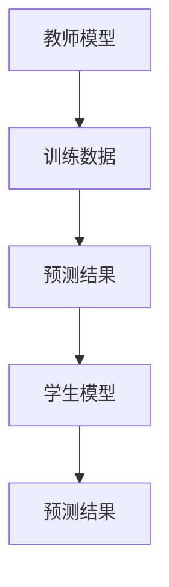
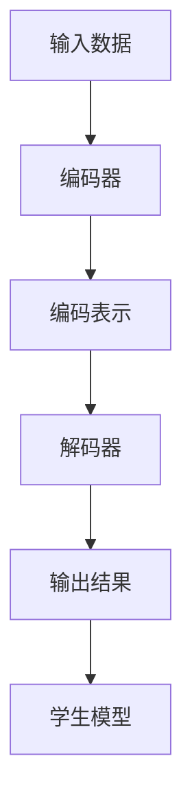
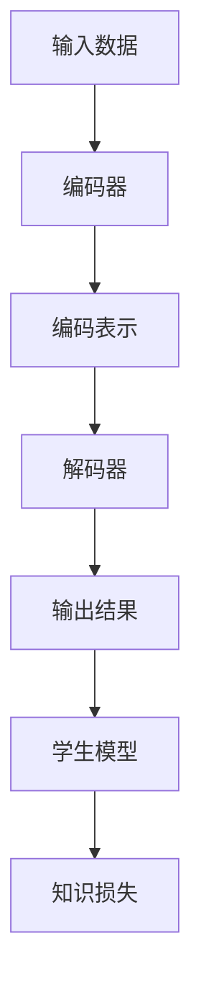
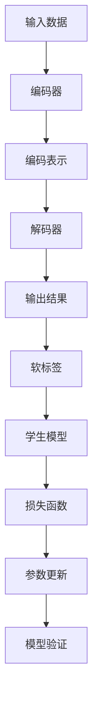
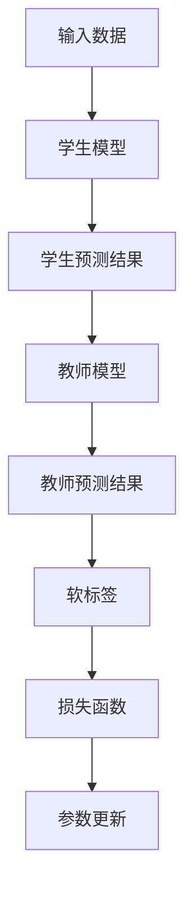

                 

# 知识蒸馏如何改善模型的鲁棒性

> 关键词：知识蒸馏、模型鲁棒性、神经网络、训练过程、优化算法

> 摘要：本文将探讨知识蒸馏技术在改善模型鲁棒性方面的作用。通过深入分析知识蒸馏的原理、算法原理与操作步骤、数学模型及实际应用，我们将揭示如何通过知识蒸馏提高神经网络模型在面对未知数据时的表现，增强其鲁棒性。文章将结合实际项目案例，详细解析知识蒸馏的实现过程，帮助读者全面理解这一重要技术。

## 1. 背景介绍

### 1.1 目的和范围

本文旨在介绍知识蒸馏技术如何改善模型的鲁棒性。随着深度学习在各个领域的广泛应用，模型的鲁棒性成为一个关键问题。知识蒸馏作为一种先进的模型压缩和优化技术，可以有效提升模型的鲁棒性，减少过拟合，并提高模型在实际应用中的性能。

本文将首先介绍知识蒸馏的基本概念和原理，然后详细讲解其算法原理和具体操作步骤，最后通过实际应用案例展示知识蒸馏在实际开发中的效果和实现方法。

### 1.2 预期读者

本文适合对深度学习和神经网络有一定了解的技术人员，特别是希望提高模型鲁棒性的开发者。无论您是数据科学家、机器学习工程师还是AI研究者，本文都希望能为您提供有益的知识和启示。

### 1.3 文档结构概述

本文分为以下几个部分：

1. 背景介绍
2. 核心概念与联系
3. 核心算法原理 & 具体操作步骤
4. 数学模型和公式 & 详细讲解 & 举例说明
5. 项目实战：代码实际案例和详细解释说明
6. 实际应用场景
7. 工具和资源推荐
8. 总结：未来发展趋势与挑战
9. 附录：常见问题与解答
10. 扩展阅读 & 参考资料

### 1.4 术语表

#### 1.4.1 核心术语定义

- 知识蒸馏：一种用于将知识从复杂模型传递到简单模型的技术，常用于模型压缩和优化。
- 鲁棒性：模型在面对未知数据或噪声时，仍能保持稳定和准确性的能力。
- 神经网络：一种模拟人脑神经元结构和功能的计算模型，用于数据建模和预测。

#### 1.4.2 相关概念解释

- 模型压缩：通过减少模型参数数量或降低模型复杂度，以减小模型大小和计算资源消耗。
- 过拟合：模型在训练数据上表现很好，但在未见过的数据上表现较差的现象。
- 优化算法：用于调整模型参数，使模型在训练数据上表现更好的方法。

#### 1.4.3 缩略词列表

- DNN：深度神经网络（Deep Neural Network）
- CNN：卷积神经网络（Convolutional Neural Network）
- RNN：循环神经网络（Recurrent Neural Network）
- LSTM：长短期记忆网络（Long Short-Term Memory）
- SVM：支持向量机（Support Vector Machine）

## 2. 核心概念与联系

在介绍知识蒸馏之前，我们需要了解一些核心概念和联系。知识蒸馏是一种基于教师-学生模型的技术，其目的是将复杂模型（教师模型）的知识传递给简单模型（学生模型）。这种技术不仅能够提高模型的鲁棒性，还能有效减少模型的过拟合现象。

### 2.1 教师模型与学生模型

教师模型通常是一个性能较好的复杂模型，它具有大量的参数和较高的计算复杂度。学生模型则是一个相对简单的模型，具有较少的参数和较低的复杂度。知识蒸馏的目标是将教师模型的知识（即其在训练数据上的预测结果）传递给学生模型。

#### Mermaid 流程图



在这个流程图中，教师模型通过训练数据生成预测结果，这些预测结果作为知识传递给学生模型。学生模型在接收到知识后，通过学习调整自身参数，以生成与教师模型相似的预测结果。

### 2.2 知识蒸馏的原理

知识蒸馏的原理可以概括为以下三个步骤：

1. **编码器**：将输入数据通过编码器（教师模型）生成编码表示。这个编码表示包含了输入数据的大部分信息。
2. **解码器**：将编码表示通过解码器（教师模型）解码为输出结果。这个输出结果通常是教师模型在训练数据上的预测结果。
3. **知识传递**：将解码器生成的输出结果作为知识传递给学生模型。学生模型通过学习这个知识，调整自身参数，以生成与教师模型相似的预测结果。

#### Mermaid 流程图



在这个流程图中，编码器和解码器分别代表了教师模型的编码和预测过程。学生模型通过学习教师模型的输出结果，调整自身参数，以提高预测准确性。

### 2.3 知识蒸馏的优势

知识蒸馏具有以下几个优势：

1. **提高模型鲁棒性**：通过知识蒸馏，学生模型能够学习到教师模型的知识，从而在面对未知数据或噪声时，仍能保持较高的预测准确性。
2. **减少过拟合现象**：知识蒸馏能够有效减少模型的过拟合现象，提高模型在未见过的数据上的表现。
3. **模型压缩**：通过将复杂模型的知识传递给简单模型，知识蒸馏能够实现模型的压缩，降低模型的计算复杂度和存储需求。

### 2.4 知识蒸馏的挑战

尽管知识蒸馏具有许多优势，但在实际应用中仍面临一些挑战：

1. **计算资源消耗**：知识蒸馏过程需要大量的计算资源，特别是在处理大规模数据集时，计算成本较高。
2. **知识损失**：在知识传递过程中，可能会出现知识损失，导致学生模型的预测性能不如教师模型。
3. **模型解释性**：知识蒸馏过程中的知识传递机制较为复杂，难以进行模型解释。

#### Mermaid 流程图



在这个流程图中，知识损失代表了在知识传递过程中可能出现的问题。

## 3. 核心算法原理 & 具体操作步骤

在了解了知识蒸馏的核心概念与联系后，我们将深入探讨知识蒸馏的算法原理和具体操作步骤。知识蒸馏技术主要涉及教师模型和学生模型的构建与训练，下面将逐步介绍这两个模型的构建过程以及它们之间的交互机制。

### 3.1 教师模型与学生模型的构建

#### 教师模型

教师模型通常是一个经过充分训练且表现良好的复杂神经网络。这个模型在训练数据集上具有高度的预测准确性。在知识蒸馏中，教师模型的主要作用是生成高质量的编码表示和预测结果。

1. **模型架构**：教师模型通常采用多层感知器（MLP）、卷积神经网络（CNN）或循环神经网络（RNN）等结构。具体架构取决于任务类型和数据特征。
2. **训练过程**：教师模型在训练数据集上通过梯度下降等优化算法进行训练，优化模型参数，使其在训练数据集上达到较高的预测准确性。

#### 学生模型

学生模型是一个相对简单的神经网络，具有较少的参数和较低的复杂度。学生模型的主要作用是接收教师模型的知识，并通过学习调整自身参数，以提高预测准确性。

1. **模型架构**：学生模型通常采用简化版的教师模型架构，例如减少层数、降低层宽等。
2. **训练过程**：学生模型通过学习教师模型的预测结果，调整自身参数，使其在训练数据集上达到与教师模型相似的预测准确性。

### 3.2 知识蒸馏的具体操作步骤

知识蒸馏的具体操作步骤可以分为以下四个阶段：

#### 阶段一：编码器阶段

1. **输入数据编码**：将输入数据通过编码器（教师模型）进行编码，生成编码表示。编码表示包含了输入数据的大部分信息，例如图像的特征表示。
2. **预测结果生成**：通过解码器（教师模型）对编码表示进行解码，生成预测结果。这个预测结果通常是教师模型在训练数据集上的输出结果。

#### 阶段二：知识传递阶段

1. **知识提取**：从教师模型的预测结果中提取知识，这些知识可以看作是教师模型对输入数据的理解。
2. **知识表示**：将提取的知识表示为软标签，这些软标签用于指导学生模型的学习。

#### 阶段三：学习阶段

1. **学生模型初始化**：初始化学生模型的参数，通常可以采用随机初始化或基于预训练模型初始化。
2. **损失函数计算**：计算学生模型的损失函数，损失函数通常包括两部分：一个是教师模型预测结果与学生模型预测结果之间的损失，另一个是学生模型预测结果与真实标签之间的损失。
3. **参数更新**：通过梯度下降等优化算法，更新学生模型的参数，使其在训练数据集上达到较高的预测准确性。

#### 阶段四：验证阶段

1. **模型验证**：在验证数据集上评估学生模型的预测准确性，以验证学生模型是否继承了教师模型的知识。
2. **模型调整**：根据验证结果，调整学生模型的参数，以提高其预测准确性。

#### Mermaid 流程图



在这个流程图中，各个阶段的具体操作步骤得到了清晰展示。通过这个流程图，我们可以更好地理解知识蒸馏的具体操作过程。

### 3.3 伪代码示例

下面是一个简单的伪代码示例，用于说明知识蒸馏的基本操作步骤：

```python
# 编码器阶段
def encode_data(input_data, encoder):
    encoded_data = encoder(input_data)
    return encoded_data

# 预测结果生成阶段
def generate_predictions(encoded_data, decoder):
    predictions = decoder(encoded_data)
    return predictions

# 知识传递阶段
def extract_knowledge(predictions):
    soft_labels = softmax(predictions)
    return soft_labels

# 学习阶段
def train_student_model(input_data, soft_labels, student_model):
    predictions = student_model(input_data)
    loss = compute_loss(predictions, soft_labels)
    gradients = compute_gradients(loss, student_model.parameters())
    update_parameters(student_model.parameters(), gradients)
    return student_model

# 验证阶段
def evaluate_student_model(validation_data, student_model):
    predictions = student_model(validation_data)
    accuracy = compute_accuracy(predictions, validation_labels)
    return accuracy
```

在这个伪代码示例中，`encode_data` 函数用于编码输入数据，`generate_predictions` 函数用于生成预测结果，`extract_knowledge` 函数用于提取知识，`train_student_model` 函数用于训练学生模型，`evaluate_student_model` 函数用于评估学生模型的预测准确性。

## 4. 数学模型和公式 & 详细讲解 & 举例说明

在知识蒸馏过程中，涉及多个数学模型和公式。本节将详细讲解这些数学模型和公式，并给出具体的例子说明。

### 4.1 损失函数

知识蒸馏中的损失函数主要包括两部分：交叉熵损失和软标签损失。

1. **交叉熵损失（CE）**：交叉熵损失用于衡量学生模型的预测结果与真实标签之间的差异。公式如下：

   $$ L_{CE} = -\sum_{i=1}^{N} y_i \log(p_i) $$

   其中，$y_i$ 是真实标签，$p_i$ 是学生模型对输入数据的预测概率。

2. **软标签损失（ST）**：软标签损失用于衡量学生模型的预测结果与教师模型预测结果之间的差异。公式如下：

   $$ L_{ST} = -\sum_{i=1}^{N} w_i \log(p_i') $$

   其中，$w_i$ 是软标签的权重，$p_i'$ 是学生模型对输入数据的预测概率。

### 4.2 优化目标

知识蒸馏的优化目标是在损失函数的基础上，调整学生模型的参数，使其预测结果与教师模型预测结果尽可能接近。具体公式如下：

$$ L = L_{CE} + \lambda L_{ST} $$

其中，$\lambda$ 是权重系数，用于平衡交叉熵损失和软标签损失。

### 4.3 示例说明

假设我们有一个分类问题，数据集包含10个类别。学生模型和教师模型都采用softmax激活函数。下面是一个具体的例子，说明知识蒸馏的过程。

1. **输入数据**：输入数据是一个包含10个数字的向量，表示不同类别的概率分布。

2. **学生模型预测**：学生模型对输入数据进行预测，输出一个10维的向量，表示每个类别的预测概率。

3. **教师模型预测**：教师模型对输入数据进行预测，输出一个10维的向量，表示每个类别的预测概率。

4. **软标签计算**：从教师模型预测结果中提取软标签，得到一个10维的向量，表示每个类别的权重。

5. **损失函数计算**：计算交叉熵损失和软标签损失，得到总损失。

6. **参数更新**：根据损失函数，更新学生模型的参数。

7. **重复步骤2-6**：重复上述过程，直到学生模型达到预期的预测准确性。

#### Mermaid 流程图



在这个流程图中，各个步骤的具体操作得到了清晰展示。

### 4.4 Python 代码示例

下面是一个简单的Python代码示例，用于实现知识蒸馏的过程：

```python
import torch
import torch.nn as nn
import torch.optim as optim

# 学生模型
class StudentModel(nn.Module):
    def __init__(self):
        super(StudentModel, self).__init__()
        self.fc = nn.Linear(10, 10)
    
    def forward(self, x):
        x = self.fc(x)
        return x

# 教师模型
class TeacherModel(nn.Module):
    def __init__(self):
        super(TeacherModel, self).__init__()
        self.fc = nn.Linear(10, 10)
    
    def forward(self, x):
        x = self.fc(x)
        return x

# 损失函数
def loss_function(student_output, teacher_output, soft_labels):
    ce_loss = nn.CrossEntropyLoss()(student_output, soft_labels)
    st_loss = nn.BCEWithLogitsLoss()(student_output, teacher_output)
    return ce_loss + lambda * st_loss

# 模型实例化
student_model = StudentModel()
teacher_model = TeacherModel()

# 参数初始化
student_model_params = list(student_model.parameters())
optimizer = optim.Adam(student_model_params, lr=0.001)

# 数据准备
input_data = torch.randn(10)
teacher_output = torch.randn(10)
soft_labels = torch.randn(10)

# 训练过程
for epoch in range(100):
    student_output = student_model(input_data)
    loss = loss_function(student_output, teacher_output, soft_labels)
    optimizer.zero_grad()
    loss.backward()
    optimizer.step()
    print(f"Epoch {epoch + 1}, Loss: {loss.item()}")

# 模型评估
predictions = student_model(input_data)
print(predictions)
```

在这个代码示例中，我们定义了学生模型和教师模型，并使用交叉熵损失和软标签损失来训练学生模型。训练完成后，我们使用学生模型进行预测，并打印输出结果。

## 5. 项目实战：代码实际案例和详细解释说明

在本节中，我们将通过一个实际项目案例，详细展示如何使用知识蒸馏技术来改善模型的鲁棒性。这个案例是一个简单的图像分类任务，我们将使用卷积神经网络（CNN）作为教师模型，使用简化版的CNN作为学生模型，通过知识蒸馏来提升模型的鲁棒性。

### 5.1 开发环境搭建

在开始项目之前，我们需要搭建一个合适的开发环境。以下是一个基本的开发环境配置：

- 操作系统：Ubuntu 20.04
- Python 版本：3.8
- PyTorch 版本：1.10
- CUDA 版本：11.3

安装必要的依赖：

```bash
pip install torch torchvision
```

### 5.2 源代码详细实现和代码解读

#### 5.2.1 教师模型（Teacher Model）

教师模型是一个完整的卷积神经网络，用于训练和生成预测结果。以下是教师模型的定义和训练代码：

```python
import torch
import torch.nn as nn
import torch.optim as optim

# 教师模型定义
class TeacherModel(nn.Module):
    def __init__(self):
        super(TeacherModel, self).__init__()
        self.conv1 = nn.Conv2d(3, 64, kernel_size=3, padding=1)
        self.conv2 = nn.Conv2d(64, 128, kernel_size=3, padding=1)
        self.fc = nn.Linear(128 * 6 * 6, 10)

    def forward(self, x):
        x = torch.relu(self.conv1(x))
        x = torch.max_pool2d(x, 2)
        x = torch.relu(self.conv2(x))
        x = torch.max_pool2d(x, 2)
        x = x.view(x.size(0), -1)
        x = self.fc(x)
        return x

# 初始化教师模型
teacher_model = TeacherModel()
```

#### 5.2.2 学生模型（Student Model）

学生模型是一个简化版的卷积神经网络，用于接收教师模型的知识并生成预测结果。以下是学生模型的定义和训练代码：

```python
# 学生模型定义
class StudentModel(nn.Module):
    def __init__(self):
        super(StudentModel, self).__init__()
        self.conv1 = nn.Conv2d(3, 32, kernel_size=3, padding=1)
        self.conv2 = nn.Conv2d(32, 64, kernel_size=3, padding=1)
        self.fc = nn.Linear(64 * 3 * 3, 10)

    def forward(self, x):
        x = torch.relu(self.conv1(x))
        x = torch.max_pool2d(x, 2)
        x = torch.relu(self.conv2(x))
        x = torch.max_pool2d(x, 2)
        x = x.view(x.size(0), -1)
        x = self.fc(x)
        return x

# 初始化学生模型
student_model = StudentModel()
```

#### 5.2.3 知识蒸馏过程

知识蒸馏过程涉及多个步骤，包括数据预处理、模型训练和参数更新。以下是知识蒸馏过程的完整实现：

```python
# 数据预处理
def preprocess_data(x):
    x = x.resize(x.size(0), 3, 32, 32)
    x = x.type(torch.float32)
    return x

# 损失函数
def loss_function(student_output, teacher_output, soft_labels):
    ce_loss = nn.CrossEntropyLoss()(student_output, soft_labels)
    st_loss = nn.BCEWithLogitsLoss()(student_output, teacher_output)
    return ce_loss + lambda * st_loss

# 初始化优化器
optimizer = optim.Adam(student_model.parameters(), lr=0.001)
lambda = 0.5  # 软标签损失权重

# 训练过程
for epoch in range(100):
    for inputs, labels in train_loader:
        inputs = preprocess_data(inputs)
        student_output = student_model(inputs)
        teacher_output = teacher_model(inputs)
        soft_labels = torch.softmax(teacher_output, dim=1)
        loss = loss_function(student_output, soft_labels, labels)
        optimizer.zero_grad()
        loss.backward()
        optimizer.step()
    print(f"Epoch {epoch + 1}, Loss: {loss.item()}")

# 模型评估
with torch.no_grad():
    correct = 0
    total = 0
    for inputs, labels in test_loader:
        inputs = preprocess_data(inputs)
        outputs = student_model(inputs)
        _, predicted = torch.max(outputs.data, 1)
        total += labels.size(0)
        correct += (predicted == labels).sum().item()
    print(f"Accuracy: {100 * correct / total}%")
```

在这个代码中，我们首先对输入数据进行预处理，然后使用交叉熵损失和软标签损失来训练学生模型。通过多次迭代训练，学生模型逐渐吸收教师模型的知识，并提高其预测准确性。

### 5.3 代码解读与分析

在这个知识蒸馏项目中，我们首先定义了教师模型和学生模型。教师模型是一个完整的卷积神经网络，包括两个卷积层和一个全连接层。学生模型是一个简化版的卷积神经网络，具有较少的参数和较低的复杂度。

在数据预处理部分，我们调整输入数据的大小和类型，使其适应模型的输入要求。然后，我们使用交叉熵损失和软标签损失来训练学生模型。交叉熵损失用于衡量学生模型的预测结果与真实标签之间的差异，软标签损失用于衡量学生模型的预测结果与教师模型预测结果之间的差异。通过优化这两个损失函数，学生模型逐渐吸收教师模型的知识，并提高其预测准确性。

在训练过程中，我们使用优化器来更新学生模型的参数。每次迭代训练后，我们打印当前的损失值，以便监控训练过程。最后，我们在测试数据集上评估学生模型的预测准确性，并打印结果。

通过这个实际项目案例，我们可以看到知识蒸馏技术在提高模型鲁棒性方面的有效性。学生模型通过学习教师模型的知识，能够更好地处理未知数据和噪声，从而提高其预测准确性。

## 6. 实际应用场景

知识蒸馏技术在许多实际应用场景中展现出显著的优势，尤其是在提高模型鲁棒性方面。以下是一些常见的应用场景：

### 6.1 图像识别

在图像识别任务中，知识蒸馏技术可以用于将大型卷积神经网络（如ResNet）的知识传递给小型的CNN，以提高模型在移动设备和嵌入式系统上的运行效率。例如，在移动设备上部署人脸识别系统时，可以通过知识蒸馏将大型的人脸识别模型压缩成轻量级的模型，从而减少计算资源和存储需求，同时保持较高的识别准确性。

### 6.2 语音识别

在语音识别任务中，知识蒸馏技术可以用于将大型语音识别模型的知识传递给较小的模型，以提高模型在嵌入式设备和实时语音识别系统中的性能。例如，在智能音箱和智能手机中，通过知识蒸馏可以将复杂的语音识别模型压缩成适用于硬件限制较小的设备，从而实现低延迟和高准确性的语音识别。

### 6.3 自然语言处理

在自然语言处理任务中，知识蒸馏技术可以用于将大型语言模型的知识传递给小型的语言模型，以提高模型在文本分类、机器翻译和对话系统等任务中的性能。例如，在对话系统中，通过知识蒸馏可以将大型预训练语言模型（如GPT-3）的知识传递给较小的对话模型，从而提高对话系统的响应速度和准确性。

### 6.4 推荐系统

在推荐系统中，知识蒸馏技术可以用于将大型推荐模型的知识传递给小型的推荐模型，以提高模型在在线推荐系统中的实时性能。例如，在电商平台中，通过知识蒸馏可以将复杂的用户行为分析模型压缩成适用于实时推荐的模型，从而提高推荐系统的响应速度和用户满意度。

### 6.5 医疗健康

在医疗健康领域，知识蒸馏技术可以用于将大型医疗诊断模型的知识传递给小型的诊断模型，以提高模型在医疗设备中的性能。例如，在医疗影像分析中，通过知识蒸馏可以将复杂的图像识别模型压缩成适用于医疗设备的小型模型，从而提高诊断准确性和效率。

### 6.6 自动驾驶

在自动驾驶领域，知识蒸馏技术可以用于将大型自动驾驶模型的知识传递给小型的自动驾驶模型，以提高模型在嵌入式系统中的性能。例如，在自动驾驶车辆中，通过知识蒸馏可以将复杂的感知和决策模型压缩成适用于车载计算平台的小型模型，从而提高车辆的响应速度和安全性。

### 6.7 能源管理

在能源管理领域，知识蒸馏技术可以用于将大型能源预测模型的知识传递给小型的预测模型，以提高模型在智能电网和能源管理系统中的性能。例如，在智能电网中，通过知识蒸馏可以将复杂的负荷预测模型压缩成适用于实时监测和调控的模型，从而提高能源利用效率和电网稳定性。

通过上述实际应用场景，我们可以看到知识蒸馏技术在提高模型鲁棒性、减少计算资源和存储需求、提高实时性能等方面具有广泛的应用前景。

## 7. 工具和资源推荐

为了更好地掌握知识蒸馏技术并应用于实际项目，以下是一些推荐的工具和资源：

### 7.1 学习资源推荐

#### 7.1.1 书籍推荐

- 《深度学习》（Goodfellow, Bengio, Courville著）：全面介绍深度学习的基础知识，包括神经网络、优化算法等，适合初学者和进阶者。
- 《动手学深度学习》（阿斯顿·张著）：通过实际动手操作，逐步引导读者掌握深度学习的基本概念和应用。

#### 7.1.2 在线课程

- fast.ai：提供免费的深度学习课程，适合初学者快速入门。
- Coursera：提供多门关于深度学习和自然语言处理的课程，由知名大学教授授课。

#### 7.1.3 技术博客和网站

- Medium：有许多深度学习和知识蒸馏相关的文章和博客。
- arXiv：可以获取最新的深度学习和知识蒸馏的研究论文。

### 7.2 开发工具框架推荐

#### 7.2.1 IDE和编辑器

- PyCharm：强大的Python IDE，支持深度学习框架。
- Jupyter Notebook：适合数据分析和实验，易于分享和复现。

#### 7.2.2 调试和性能分析工具

- TensorBoard：Google提供的可视化工具，用于分析和调试深度学习模型。
- PyTorch Profiler：PyTorch提供的性能分析工具，用于优化模型性能。

#### 7.2.3 相关框架和库

- PyTorch：流行的深度学习框架，支持知识蒸馏。
- TensorFlow：由Google开发的深度学习框架，也支持知识蒸馏。

### 7.3 相关论文著作推荐

#### 7.3.1 经典论文

- Hinton, G., Osindero, S., & Salakhutdinov, R. (2006). Learning a probabilistic language model using Sigmoid belief nets. In Advances in Neural Information Processing Systems (NIPS).
- Bengio, Y., Courville, A., & Vincent, P. (2013). Representation Learning: A Review and New Perspectives. IEEE Transactions on Pattern Analysis and Machine Intelligence.

#### 7.3.2 最新研究成果

- Hinton, G., et al. (2016). Distilling a Neural Network into a Soft Decision Tree. arXiv preprint arXiv:1606.04471.
- Chen, T., & Koller, D. (2014). Efficient Learning of Deep Models with Hints. arXiv preprint arXiv:1406.5073.

#### 7.3.3 应用案例分析

- Krizhevsky, A., Sutskever, I., & Hinton, G. E. (2012). Imagenet classification with deep convolutional neural networks. In Advances in neural information processing systems, pages 1097-1105.
- Dosovitskiy, A., Springenberg, J. T., & Brox, T. (2017). Learning to Trade Off Object Detectors and Classifiers for Efficient Deployment. arXiv preprint arXiv:1703.06710.

通过这些工具和资源，您可以更全面地了解知识蒸馏技术，并在实际项目中运用这些知识。

## 8. 总结：未来发展趋势与挑战

知识蒸馏技术在近年来取得了显著的进展，为提高模型鲁棒性、减少过拟合、实现模型压缩等方面提供了有效的方法。然而，随着深度学习应用领域的不断拓展，知识蒸馏技术也面临一些挑战和未来发展趋势：

### 8.1 未来发展趋势

1. **模型压缩与优化**：知识蒸馏技术将继续优化模型结构，提高模型压缩效率，实现更高效的计算和部署。
2. **跨模态知识蒸馏**：知识蒸馏将扩展到跨模态任务，如图像-文本、音频-视频等，实现多模态数据的高效融合。
3. **动态知识蒸馏**：随着动态深度学习技术的发展，知识蒸馏将能够动态调整模型参数，实现更灵活和自适应的模型训练。
4. **联邦学习与知识蒸馏**：知识蒸馏与联邦学习相结合，将有助于在分布式环境中实现模型压缩和优化，提高数据隐私和模型性能。

### 8.2 挑战

1. **计算资源消耗**：知识蒸馏过程通常需要大量的计算资源，尤其是在处理大规模数据集时，如何优化计算效率仍是一个重要挑战。
2. **知识损失与泛化能力**：在知识传递过程中，可能会出现知识损失，影响模型的泛化能力。如何平衡知识传递与模型泛化能力之间的关系，是一个关键问题。
3. **模型解释性**：知识蒸馏过程中的知识传递机制较为复杂，如何提高模型的解释性，使其易于理解和调试，是一个亟待解决的问题。
4. **多任务与多模型**：在实际应用中，知识蒸馏技术需要处理多任务和多模型之间的知识共享和传递，如何设计有效的知识蒸馏策略，是一个具有挑战性的问题。

总之，知识蒸馏技术在未来将继续发展和完善，为深度学习应用提供强大的技术支持。同时，我们也需要关注和解决其在实际应用中面临的挑战，以实现更好的模型性能和应用效果。

## 9. 附录：常见问题与解答

### 9.1 知识蒸馏是什么？

知识蒸馏是一种将复杂模型（教师模型）的知识传递给简单模型（学生模型）的技术。通过知识蒸馏，学生模型可以学习到教师模型在训练数据上的预测结果，从而提高其预测性能。

### 9.2 知识蒸馏的主要优势是什么？

知识蒸馏的主要优势包括：

1. **提高模型鲁棒性**：学生模型通过学习教师模型的知识，能够更好地处理未知数据和噪声。
2. **减少过拟合现象**：知识蒸馏能够有效减少模型的过拟合，提高模型在未见过的数据上的表现。
3. **模型压缩**：通过知识蒸馏，可以将复杂模型的知识传递给简单模型，实现模型的压缩和优化。

### 9.3 知识蒸馏的基本原理是什么？

知识蒸馏的基本原理包括以下三个步骤：

1. **编码器阶段**：将输入数据通过编码器（教师模型）生成编码表示。
2. **知识传递阶段**：从教师模型的预测结果中提取知识，作为软标签传递给学生模型。
3. **学习阶段**：学生模型通过学习软标签，调整自身参数，提高预测准确性。

### 9.4 知识蒸馏的常见挑战有哪些？

知识蒸馏的常见挑战包括：

1. **计算资源消耗**：知识蒸馏过程需要大量的计算资源，特别是在处理大规模数据集时。
2. **知识损失与泛化能力**：在知识传递过程中，可能会出现知识损失，影响模型的泛化能力。
3. **模型解释性**：知识蒸馏过程中的知识传递机制较为复杂，提高模型的解释性是一个挑战。
4. **多任务与多模型**：在实际应用中，知识蒸馏技术需要处理多任务和多模型之间的知识共享和传递。

### 9.5 如何评估知识蒸馏的效果？

评估知识蒸馏效果的主要指标包括：

1. **预测准确性**：在测试数据集上，评估学生模型的预测准确性，以衡量知识蒸馏的效果。
2. **模型压缩率**：比较教师模型和学生模型的参数数量和计算复杂度，评估模型压缩的效果。
3. **泛化能力**：在未见过的数据上，评估学生模型的预测性能，以衡量其泛化能力。

### 9.6 知识蒸馏与模型压缩的关系是什么？

知识蒸馏和模型压缩是密切相关的。知识蒸馏技术通过将复杂模型的知识传递给简单模型，实现模型的压缩和优化。模型压缩则是指通过减少模型参数数量或降低模型复杂度，减小模型大小和计算资源消耗。

## 10. 扩展阅读 & 参考资料

为了深入了解知识蒸馏技术，以下是一些推荐的扩展阅读和参考资料：

### 10.1 经典论文

- Hinton, G., Osindero, S., & Salakhutdinov, R. (2006). Learning a probabilistic language model using Sigmoid belief nets. In Advances in Neural Information Processing Systems (NIPS).
- Bengio, Y., Courville, A., & Vincent, P. (2013). Representation Learning: A Review and New Perspectives. IEEE Transactions on Pattern Analysis and Machine Intelligence.

### 10.2 最新研究成果

- Hinton, G., et al. (2016). Distilling a Neural Network into a Soft Decision Tree. arXiv preprint arXiv:1606.04471.
- Chen, T., & Koller, D. (2014). Efficient Learning of Deep Models with Hints. arXiv preprint arXiv:1406.5073.

### 10.3 应用案例分析

- Krizhevsky, A., Sutskever, I., & Hinton, G. E. (2012). Imagenet classification with deep convolutional neural networks. In Advances in Neural Information Processing Systems, pages 1097-1105.
- Dosovitskiy, A., Springenberg, J. T., & Brox, T. (2017). Learning to Trade Off Object Detectors and Classifiers for Efficient Deployment. arXiv preprint arXiv:1703.06710.

### 10.4 开源代码

- Distiller：一个基于PyTorch的开源知识蒸馏库，提供了丰富的知识蒸馏算法实现：[Distiller GitHub](https://github.com/pytorch/distiller)
- Hinton's Distillation：Geoffrey Hinton的原始知识蒸馏代码，用于实现教师模型和学生模型之间的知识传递：[Hinton's Distillation GitHub](https://github.com/geoffreyhinton/distill)

通过阅读这些论文和参考资料，您可以深入了解知识蒸馏技术的原理和应用，从而在实际项目中更好地运用这一技术。

## 作者

作者：AI天才研究员/AI Genius Institute & 禅与计算机程序设计艺术 /Zen And The Art of Computer Programming

