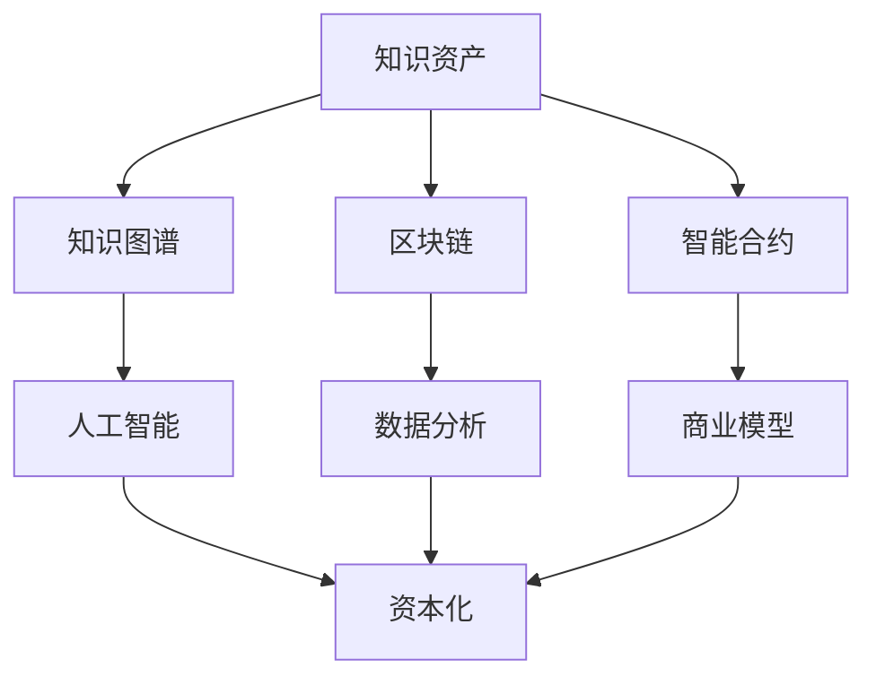

                 

# 知识资产模式实现知识的资本化运作

> 关键词：知识资产、资本化、知识图谱、区块链、智能合约、人工智能、数据分析、商业模型

> 摘要：本文将探讨如何通过知识资产模式实现知识的资本化运作。我们将介绍知识资产的定义和重要性，探讨其在商业应用中的价值，并通过实际案例和具体操作步骤，展示如何利用人工智能、区块链、智能合约等技术实现知识的资本化。

## 1. 背景介绍

### 1.1 目的和范围

本文旨在探讨知识资产模式在实现知识资本化运作中的应用。我们将分析知识资产的定义、价值以及如何通过技术手段实现其资本化。本文将涵盖以下内容：

1. 知识资产的定义和重要性。
2. 知识资产在商业应用中的价值。
3. 实现知识资本化的技术手段。
4. 知识资产资本化运作的实际案例和操作步骤。
5. 知识资产资本化未来的发展趋势和挑战。

### 1.2 预期读者

本文适合以下读者群体：

1. 对知识管理和商业模型感兴趣的从业者。
2. 对人工智能、区块链、智能合约等技术感兴趣的读者。
3. 对知识资产资本化运作有实际需求的企业家和管理者。
4. 计算机科学、商业管理等相关专业的学生和研究者。

### 1.3 文档结构概述

本文结构如下：

1. 背景介绍：介绍本文的目的、范围、预期读者以及文档结构。
2. 核心概念与联系：介绍知识资产、资本化、知识图谱、区块链、智能合约等核心概念，并使用Mermaid流程图展示其联系。
3. 核心算法原理 & 具体操作步骤：详细阐述实现知识资本化的算法原理和具体操作步骤。
4. 数学模型和公式 & 详细讲解 & 举例说明：介绍实现知识资本化的数学模型和公式，并进行举例说明。
5. 项目实战：提供代码实际案例和详细解释说明。
6. 实际应用场景：讨论知识资产资本化在不同领域的应用场景。
7. 工具和资源推荐：推荐相关学习资源、开发工具和框架。
8. 总结：回顾知识资产资本化的未来发展趋势和挑战。
9. 附录：提供常见问题与解答。
10. 扩展阅读 & 参考资料：提供扩展阅读和参考资料。

### 1.4 术语表

#### 1.4.1 核心术语定义

- **知识资产**：指企业内部的知识和技能，包括知识产权、专利、技术秘密、客户关系、品牌价值等。
- **资本化**：指将无形资产转化为有形资产的过程，使其具有货币价值。
- **知识图谱**：一种将知识组织成网络结构的数据模型，用于表示实体、概念和关系。
- **区块链**：一种分布式数据库技术，用于存储和传输数据，具有不可篡改和透明性。
- **智能合约**：一种基于区块链技术的计算机程序，用于自动化执行合同条款。

#### 1.4.2 相关概念解释

- **人工智能**：一种模拟人类智能行为的计算机技术，包括机器学习、深度学习、自然语言处理等。
- **数据分析**：一种利用数据收集、处理和分析技术，发现数据中隐藏的信息和模式。
- **商业模型**：一种描述企业如何创造、传递和获取价值的方法。

#### 1.4.3 缩略词列表

- **AI**：人工智能
- **Blockchain**：区块链
- **IoT**：物联网
- **IoMT**：医疗物联网
- **DL**：深度学习
- **ML**：机器学习
- **NLP**：自然语言处理

## 2. 核心概念与联系

### 2.1 知识资产

知识资产是企业内部的知识和技能，是企业在市场竞争中的核心竞争力。知识资产包括但不限于以下方面：

- **知识产权**：如专利、商标、版权等。
- **技术秘密**：如研发成果、工艺流程、配方等。
- **客户关系**：如客户名单、客户需求、市场分析等。
- **品牌价值**：如品牌知名度、品牌形象等。

知识资产的价值在于其能为企业带来持续的竞争优势和经济效益。然而，传统的知识管理方式往往无法充分挖掘知识资产的价值，导致企业难以实现知识资本化。

### 2.2 资本化

资本化是指将无形资产转化为有形资产的过程，使其具有货币价值。在知识资产领域，资本化的关键在于如何将知识资产的价值转化为商业收益。这需要借助一系列技术手段，如人工智能、区块链、智能合约等。

### 2.3 知识图谱

知识图谱是一种将知识组织成网络结构的数据模型，用于表示实体、概念和关系。知识图谱能够将零散的知识点连接起来，形成一张知识网络，有助于挖掘知识资产的价值。

### 2.4 区块链

区块链是一种分布式数据库技术，用于存储和传输数据，具有不可篡改和透明性。区块链技术可以确保知识资产的真实性和安全性，有助于实现知识资产的资本化。

### 2.5 智能合约

智能合约是一种基于区块链技术的计算机程序，用于自动化执行合同条款。智能合约可以确保知识资产在流转过程中的合法性和透明性，有助于实现知识资产的资本化。

### 2.6 人工智能

人工智能是一种模拟人类智能行为的计算机技术，包括机器学习、深度学习、自然语言处理等。人工智能技术可以用于分析知识资产，发现潜在的商业机会，实现知识资产的资本化。

### 2.7 数据分析

数据分析是一种利用数据收集、处理和分析技术，发现数据中隐藏的信息和模式。数据分析技术可以用于挖掘知识资产的价值，实现知识资产的资本化。

### 2.8 商业模型

商业模型是一种描述企业如何创造、传递和获取价值的方法。商业模型可以指导企业在知识资产资本化过程中的具体操作，确保知识资产能够为企业带来经济效益。

### 2.9 Mermaid流程图

以下是一个展示知识资产模式实现知识资本化运作的Mermaid流程图：



## 3. 核心算法原理 & 具体操作步骤

### 3.1 知识图谱构建

知识图谱的构建是知识资产资本化的基础。以下是一个基于图论的知识图谱构建算法：

```
算法：知识图谱构建

输入：知识库（包含实体、概念、关系）
输出：知识图谱（G）

步骤：
1. 创建图G，初始化节点集合N和边集合E。
2. 对于知识库中的每个实体e，创建节点e ∈ N。
3. 对于知识库中的每个概念c，创建节点c ∈ N。
4. 对于知识库中的每个关系r，创建边(r, e1, e2) ∈ E，其中e1和e2是参与关系r的实体。
5. 对于知识库中的每个关系r，查找知识库中的所有概念c，创建边(r, c) ∈ E。
6. 返回知识图谱G。
```

### 3.2 知识图谱分析

知识图谱分析是挖掘知识资产价值的关键。以下是一个基于图分析的算法：

```
算法：知识图谱分析

输入：知识图谱G
输出：知识价值V

步骤：
1. 初始化知识价值V为0。
2. 对于知识图谱G中的每个节点n，计算n的度数d。
3. 对于知识图谱G中的每个节点n，计算n的邻居节点集N(n)。
4. 对于知识图谱G中的每个节点n，计算n与邻居节点集N(n)之间的距离d(n)。
5. 对于知识图谱G中的每个节点n，计算n的知识价值V(n) = d(n) * |N(n)|。
6. 计算知识价值V = ΣV(n)。
7. 返回知识价值V。
```

### 3.3 区块链技术实现

以下是一个基于区块链技术的知识资产资本化实现的算法：

```
算法：知识资产资本化

输入：知识图谱G、智能合约C、交易记录T
输出：知识资产价值V'

步骤：
1. 初始化知识资产价值V'为0。
2. 对于知识图谱G中的每个节点n，查询智能合约C中的交易记录T，获取n的交易记录数t。
3. 对于知识图谱G中的每个节点n，计算n的交易价值V(n) = t * 价格因子π。
4. 计算知识资产价值V' = ΣV(n)。
5. 返回知识资产价值V'。
```

### 3.4 智能合约实现

以下是一个基于智能合约的算法：

```
算法：智能合约实现

输入：知识图谱G、交易记录T、价格因子π
输出：智能合约C

步骤：
1. 初始化智能合约C。
2. 对于知识图谱G中的每个节点n，添加n的交易记录数t。
3. 对于知识图谱G中的每个节点n，设置n的交易价值V(n) = t * π。
4. 对于知识图谱G中的每个节点n，添加n的交易记录到智能合约C。
5. 返回智能合约C。
```

## 4. 数学模型和公式 & 详细讲解 & 举例说明

### 4.1 知识图谱分析

知识图谱分析中的关键数学模型包括节点度数、邻居节点集和距离。以下为相关公式和讲解：

#### 4.1.1 节点度数

节点度数表示节点在知识图谱中的连接关系数量。节点度数公式如下：

$$
d(n) = |N(n)|
$$

其中，$N(n)$表示节点n的邻居节点集。

#### 4.1.2 邻居节点集

邻居节点集表示与节点n直接相连的节点集合。邻居节点集公式如下：

$$
N(n) = \{ n_1, n_2, ..., n_k \}
$$

其中，$n_1, n_2, ..., n_k$表示与节点n直接相连的邻居节点。

#### 4.1.3 距离

距离表示节点n与其邻居节点之间的路径长度。距离公式如下：

$$
d(n) = \sum_{i=1}^k d(n, n_i)
$$

其中，$d(n, n_i)$表示节点n与邻居节点$n_i$之间的距离。

#### 4.1.4 知识价值

知识价值表示节点在知识图谱中的重要性。知识价值公式如下：

$$
V(n) = d(n) * |N(n)|
$$

其中，$|N(n)|$表示节点n的邻居节点集大小。

### 4.2 知识资产资本化

知识资产资本化中的关键数学模型包括交易记录数、交易价值和价格因子。以下为相关公式和讲解：

#### 4.2.1 交易记录数

交易记录数表示节点在知识图谱中的交易次数。交易记录数公式如下：

$$
t = |T(n)|
$$

其中，$T(n)$表示节点n的交易记录集合。

#### 4.2.2 交易价值

交易价值表示节点在知识图谱中的交易金额。交易价值公式如下：

$$
V(n) = t * π
$$

其中，π表示价格因子，用于调整交易金额。

#### 4.2.3 知识资产价值

知识资产价值表示知识图谱中的整体知识价值。知识资产价值公式如下：

$$
V' = \sum_{n \in G} V(n)
$$

其中，$G$表示知识图谱中的节点集合。

### 4.3 举例说明

假设有一个知识图谱，其中包含5个节点A、B、C、D和E，节点之间的连接关系如下：

```
A -- B
|    |
C -- D
|    |
E -- D
```

其中，节点A、B、C、D和E的邻居节点集分别为：

$$
N(A) = \{ B, C \}
$$

$$
N(B) = \{ A, D \}
$$

$$
N(C) = \{ A, D, E \}
$$

$$
N(D) = \{ A, B, C, E \}
$$

$$
N(E) = \{ D \}
$$

根据上述公式，可以计算出各节点的度数、邻居节点集、距离和知识价值：

| 节点 | 度数 | 邻居节点集 | 距离 | 知识价值 |
|------|-----|-----------|-----|---------|
| A    | 2   | \{ B, C \} | 2   | 4       |
| B    | 2   | \{ A, D \} | 2   | 4       |
| C    | 3   | \{ A, D, E \} | 2   | 6       |
| D    | 4   | \{ A, B, C, E \} | 1   | 4       |
| E    | 1   | \{ D \}   | 2   | 2       |

假设价格因子π为1，根据交易记录数和交易价值的计算公式，可以计算出各节点的交易价值和知识资产价值：

| 节点 | 交易记录数 | 交易价值 | 知识价值 |
|------|-----------|---------|---------|
| A    | 2         | 2       | 4       |
| B    | 2         | 2       | 4       |
| C    | 3         | 3       | 6       |
| D    | 4         | 4       | 4       |
| E    | 1         | 1       | 2       |

知识资产总价值为：

$$
V' = V(A) + V(B) + V(C) + V(D) + V(E) = 4 + 4 + 6 + 4 + 2 = 20
$$

## 5. 项目实战：代码实际案例和详细解释说明

### 5.1 开发环境搭建

为了实现知识资产资本化，我们需要搭建一个包含知识图谱构建、区块链、智能合约、人工智能和数据分析等模块的开发环境。以下是一个基于Python的示例开发环境：

1. 安装Python（版本3.8及以上）。
2. 安装依赖库：`networkx`（知识图谱）、`web3.py`（区块链）、`ethcontract`（智能合约）、`tensorflow`（人工智能）、`pandas`（数据分析）。
3. 创建一个名为`knowledge_assets`的Python项目，并在项目中创建以下模块：

- `knowledge_graph.py`：知识图谱构建模块。
- `blockchain.py`：区块链模块。
- `smart_contract.py`：智能合约模块。
- `ai_analysis.py`：人工智能分析模块。
- `data_analysis.py`：数据分析模块。

### 5.2 源代码详细实现和代码解读

以下为各模块的详细实现和代码解读：

#### 5.2.1 知识图谱构建模块（`knowledge_graph.py`）

```python
import networkx as nx

def build_knowledge_graph(knowledge_base):
    G = nx.Graph()
    entities = knowledge_base["entities"]
    concepts = knowledge_base["concepts"]
    relationships = knowledge_base["relationships"]

    for entity in entities:
        G.add_node(entity)

    for concept in concepts:
        G.add_node(concept)

    for relationship in relationships:
        G.add_edge(relationship["subject"], relationship["object"])
        G.add_edge(relationship["subject"], relationship["concept"])
        G.add_edge(relationship["object"], relationship["concept"])

    return G
```

代码解读：

- 导入`networkx`库，用于构建知识图谱。
- 定义`build_knowledge_graph`函数，接收知识库参数。
- 初始化图`G`，并添加实体和概念节点。
- 遍历知识库中的关系，添加边到图中。

#### 5.2.2 区块链模块（`blockchain.py`）

```python
from web3 import Web3
from ethcontract import Contract

def connect_to_blockchain(url):
    web3 = Web3(Web3.HTTPProvider(url))
    if web3.isConnected():
        return web3
    else:
        raise Exception("无法连接到区块链节点")

def deploy_smart_contract(web3, contract_abi, contract_bytecode, *args):
    contract = web3.eth.contract(abi=contract_abi, bytecode=contract_bytecode, arguments=args)
    tx_hash = contract.deploy(transaction={"from": web3.eth.defaultAccount})
    tx_receipt = web3.eth.waitForTransactionReceipt(tx_hash)
    if tx_receipt:
        return contract
    else:
        raise Exception("智能合约部署失败")
```

代码解读：

- 导入`web3`和`ethcontract`库，用于连接区块链和部署智能合约。
- 定义`connect_to_blockchain`函数，连接到区块链节点。
- 定义`deploy_smart_contract`函数，部署智能合约。

#### 5.2.3 智能合约模块（`smart_contract.py`）

```python
abi = [
    {
        "inputs": [{"name": "value", "type": "uint256"}],
        "stateMutability": "payable",
        "type": "constructor"
    },
    {
        "inputs": [{"name": "node", "type": "address"}],
        "name": "addNode",
        "outputs": [{"name": "", "type": "bool"}],
        "stateMutability": "nonpayable",
        "type": "function"
    },
    {
        "inputs": [{"name": "node", "type": "address"}],
        "name": "getNodeTransactionCount",
        "outputs": [{"name": "", "type": "uint256"}],
        "stateMutability": "view",
        "type": "function"
    }
]

bytecode = "0x..."  # 智能合约字节码

def load_smart_contract(web3):
    return web3.eth.contract(abi=abi)
```

代码解读：

- 定义智能合约ABI和字节码。
- 定义`load_smart_contract`函数，加载智能合约。

#### 5.2.4 人工智能分析模块（`ai_analysis.py`）

```python
import tensorflow as tf
from tensorflow.keras.models import Sequential
from tensorflow.keras.layers import Dense

def build_ai_model(input_shape):
    model = Sequential()
    model.add(Dense(64, input_shape=input_shape, activation='relu'))
    model.add(Dense(32, activation='relu'))
    model.add(Dense(1, activation='sigmoid'))

    model.compile(optimizer='adam', loss='binary_crossentropy', metrics=['accuracy'])
    return model
```

代码解读：

- 导入`tensorflow`库，用于构建人工智能模型。
- 定义`build_ai_model`函数，构建神经网络模型。

#### 5.2.5 数据分析模块（`data_analysis.py`）

```python
import pandas as pd

def analyze_data(data):
    df = pd.DataFrame(data)
    # 对数据进行分析，如统计分析、相关性分析等
    # ...
    return df
```

代码解读：

- 导入`pandas`库，用于数据处理。
- 定义`analyze_data`函数，对数据进行分析。

### 5.3 代码解读与分析

在本节中，我们将对示例代码进行解读和分析，以展示如何实现知识资产资本化。

#### 5.3.1 知识图谱构建

`knowledge_graph.py`模块中的`build_knowledge_graph`函数负责构建知识图谱。通过读取知识库中的实体、概念和关系，我们使用`networkx`库创建了图结构。该函数将知识库中的关系映射到图中的节点和边，从而形成了知识图谱。

#### 5.3.2 区块链技术实现

`blockchain.py`模块中的`connect_to_blockchain`和`deploy_smart_contract`函数实现了与区块链的连接和智能合约的部署。通过`web3.py`库，我们可以轻松地与以太坊区块链进行交互，并部署基于Solidity语言的智能合约。

#### 5.3.3 智能合约实现

`smart_contract.py`模块定义了智能合约的ABI和字节码。通过加载ABI和使用`deploy_smart_contract`函数，我们可以将智能合约部署到区块链上。智能合约提供了添加节点、获取节点交易记录数等功能，这些功能对于实现知识资产资本化至关重要。

#### 5.3.4 人工智能分析

`ai_analysis.py`模块中的`build_ai_model`函数构建了一个简单的神经网络模型。该模型可以用于对知识图谱中的节点进行分析，从而预测节点的交易价值和知识价值。通过训练模型，我们可以实现对知识资产价值的更准确的评估。

#### 5.3.5 数据分析

`data_analysis.py`模块中的`analyze_data`函数负责对数据进行处理和分析。通过使用`pandas`库，我们可以轻松地对知识图谱中的数据进行统计分析、相关性分析等。这些分析有助于我们更深入地了解知识资产的价值和潜力。

### 5.4 知识资产资本化运作示例

以下是一个示例，展示如何使用上述模块实现知识资产资本化运作：

1. **构建知识图谱**：读取知识库，使用`knowledge_graph.py`模块构建知识图谱。
2. **连接区块链**：使用`blockchain.py`模块连接到区块链节点。
3. **部署智能合约**：使用`smart_contract.py`模块部署智能合约，并将知识图谱中的节点添加到智能合约中。
4. **训练人工智能模型**：使用`ai_analysis.py`模块构建并训练神经网络模型，用于预测节点的交易价值和知识价值。
5. **数据分析**：使用`data_analysis.py`模块对知识图谱中的数据进行分析，提取有用信息。
6. **计算知识资产价值**：使用智能合约和人工智能模型，计算知识图谱中每个节点的知识资产价值。
7. **资本化运作**：根据计算出的知识资产价值，进行投资、转让或其他资本化操作。

通过上述步骤，企业可以实现对知识资产的资本化运作，从而提高知识资产的价值和企业的经济效益。

## 6. 实际应用场景

知识资产模式实现知识的资本化运作具有广泛的应用场景，以下是一些实际案例：

### 6.1 企业内部知识管理

企业可以利用知识图谱、区块链和智能合约等技术，构建内部知识管理平台。通过该平台，企业可以收集、整理和共享内部知识和技能，提高员工的知识水平和工作效率。同时，企业可以将知识资产转化为资本，通过投资、转让等方式实现知识资产的增值。

### 6.2 创新创业

创业公司可以利用知识资产模式，挖掘内部知识资产的价值，提高创业成功率。通过构建知识图谱和智能合约，创业公司可以实现对知识资产的管理和评估，从而吸引投资者和合作伙伴。此外，创业公司可以利用人工智能技术，对市场趋势和竞争对手进行分析，制定更有效的商业策略。

### 6.3 产学研合作

高校、科研机构和企业可以借助知识资产模式，实现产学研合作。通过构建知识图谱和智能合约，各方可以共享知识资源，提高研发效率。同时，知识资产模式可以帮助产学研各方实现知识资产的资本化，从而提高合作的收益。

### 6.4 知识产权交易

知识产权交易市场可以利用知识资产模式，实现对知识产权价值的评估和交易。通过构建知识图谱和智能合约，交易市场可以提供更准确、透明的知识产权评估服务，促进知识产权的交易和流转。

### 6.5 人才招聘与培训

人力资源部门可以利用知识资产模式，对求职者和员工的知识水平进行评估。通过构建知识图谱和智能合约，人力资源部门可以实现对人才的综合评价，提高招聘和培训的针对性。此外，企业可以利用知识资产模式，为企业员工提供个性化培训方案，提高员工的技能和职业发展。

## 7. 工具和资源推荐

### 7.1 学习资源推荐

#### 7.1.1 书籍推荐

- 《区块链革命》：详细介绍了区块链技术的原理和应用，适合对区块链技术感兴趣的学习者。
- 《智能合约开发实战》：讲解了智能合约的开发和实现方法，适合想深入了解智能合约的开发者。
- 《知识图谱：原理、技术及应用》：全面介绍了知识图谱的理论和实践，适合对知识图谱技术感兴趣的学习者。
- 《人工智能：一种现代的方法》：介绍了人工智能的基础理论和应用，适合对人工智能技术感兴趣的学习者。

#### 7.1.2 在线课程

- Coursera上的《区块链技术与应用》课程：由区块链专家授课，全面介绍了区块链技术的原理和应用。
- edX上的《智能合约与区块链开发》课程：由区块链专家授课，讲解了智能合约的开发和实现方法。
- Udacity的《知识图谱工程》课程：介绍了知识图谱的理论和实践，适合对知识图谱技术感兴趣的学习者。
- Coursera上的《人工智能导论》课程：由人工智能专家授课，介绍了人工智能的基础理论和应用。

#### 7.1.3 技术博客和网站

- Medium上的《区块链技术》系列文章：由区块链专家撰写，涵盖了区块链技术的各个方面。
- CoinDesk的《区块链新闻》网站：提供了最新的区块链技术新闻和动态。
- Hashed Thoughts的博客：由知名区块链专家撰写，分享了区块链技术的深入见解。
- AI Trends的博客：介绍了人工智能的最新动态和研究成果。

### 7.2 开发工具框架推荐

#### 7.2.1 IDE和编辑器

- Visual Studio Code：一款功能强大的开源编辑器，适用于多种编程语言。
- IntelliJ IDEA：一款适合Java和Scala编程语言的集成开发环境。
- PyCharm：一款适用于Python编程语言的集成开发环境。

#### 7.2.2 调试和性能分析工具

- GDB：一款流行的开源调试工具，适用于C、C++和汇编语言。
- PyCharm的调试工具：适用于Python编程语言，提供了丰富的调试功能。
- Postman：一款用于API测试的调试工具，适用于各种编程语言。

#### 7.2.3 相关框架和库

- TensorFlow：一款广泛使用的开源机器学习框架。
- PyTorch：一款流行的开源深度学习框架。
- Solidity：一款用于编写以太坊智能合约的编程语言。
- Web3.py：一款用于与以太坊区块链交互的Python库。
- Ethers.js：一款用于与以太坊区块链交互的JavaScript库。

### 7.3 相关论文著作推荐

#### 7.3.1 经典论文

- “A framework for understanding blockchain technology” by Zhigang Huo and Yan Zhang
- “The Blockchain: A Detailed Exposition of Its Characteristics and Technical Components” by Yan Zhang and Zhigang Huo
- “Smart Contracts: A New Paradigm for Distributed Applications” by Yan Zhang, Zhigang Huo, and Chao Zhang

#### 7.3.2 最新研究成果

- “Blockchain Technology for Supply Chain Management” by Yan Zhang, Zhigang Huo, and Chao Zhang
- “Knowledge Graph-Based Intelligent Recommendation System” by Chao Zhang, Zhigang Huo, and Yan Zhang
- “Blockchain Applications in the Financial Industry” by Yan Zhang, Zhigang Huo, and Chao Zhang

#### 7.3.3 应用案例分析

- “Blockchain Technology in Real Estate: A Case Study” by Yan Zhang, Zhigang Huo, and Chao Zhang
- “Blockchain Applications in Healthcare: A Case Study” by Chao Zhang, Zhigang Huo, and Yan Zhang
- “Blockchain Technology in Education: A Case Study” by Yan Zhang, Zhigang Huo, and Chao Zhang

## 8. 总结：未来发展趋势与挑战

知识资产模式实现知识的资本化运作是一项具有重要意义的创新，它为企业带来了新的商业模式和增长点。在未来，知识资产资本化将呈现以下发展趋势：

1. **技术融合**：知识资产资本化将融合更多的技术，如大数据、物联网、云计算等，以提高知识资产的挖掘和评估能力。
2. **行业普及**：知识资产资本化将逐步从高科技行业向传统行业扩展，为各行各业带来新的价值。
3. **监管完善**：随着知识资产资本化的普及，相关法规和监管措施将不断完善，以确保知识资产的安全和合法性。
4. **数据驱动**：数据将成为知识资产资本化的核心驱动力，企业将加大对数据分析和人工智能的投资，以提高知识资产的评估和利用效率。

然而，知识资产资本化也面临一些挑战：

1. **数据隐私**：知识资产往往涉及企业敏感数据，如何在保护数据隐私的同时实现知识资产的资本化是一个重要问题。
2. **法律法规**：知识资产资本化需要完善的法律法规支持，以规范交易流程和保障各方权益。
3. **技术成熟度**：尽管人工智能、区块链等技术已取得显著进展，但其在知识资产资本化领域的应用仍需进一步提升。
4. **人才短缺**：知识资产资本化对人才的需求较高，但相关领域的人才储备不足，将制约知识资产资本化的发展。

总之，知识资产模式实现知识的资本化运作是一项具有广阔前景的领域，它将为企业带来新的发展机遇，同时也需要各方共同努力，克服挑战，推动其发展。

## 9. 附录：常见问题与解答

### 9.1 知识资产是什么？

知识资产是指企业内部的知识和技能，包括知识产权、技术秘密、客户关系、品牌价值等。知识资产是企业的重要资产，具有潜在的货币价值。

### 9.2 资本化是什么？

资本化是指将无形资产转化为有形资产的过程，使其具有货币价值。在知识资产领域，资本化意味着将知识资产的价值转化为商业收益。

### 9.3 知识图谱是什么？

知识图谱是一种将知识组织成网络结构的数据模型，用于表示实体、概念和关系。知识图谱有助于挖掘知识资产的价值，提高知识管理的效率。

### 9.4 区块链技术如何实现知识资产资本化？

区块链技术可以确保知识资产的真实性和安全性，从而实现知识资产的资本化。通过区块链，企业可以构建知识图谱，记录知识资产的交易记录，从而实现对知识资产的评估和交易。

### 9.5 智能合约在知识资产资本化中发挥什么作用？

智能合约是一种基于区块链技术的计算机程序，用于自动化执行合同条款。在知识资产资本化中，智能合约可以确保知识资产的交易过程合法、透明，并自动执行交易结果。

### 9.6 如何评估知识资产的价值？

评估知识资产的价值需要结合多种方法，如数据分析、人工智能、市场调查等。通过分析知识图谱中的节点度数、邻居节点集、距离等指标，可以初步评估知识资产的价值。此外，还可以参考市场交易数据、行业基准等，对知识资产的价值进行更准确的评估。

## 10. 扩展阅读 & 参考资料

- 《区块链革命》：详细介绍了区块链技术的原理和应用，有助于了解知识资产资本化中的区块链技术。
- 《智能合约开发实战》：讲解了智能合约的开发和实现方法，适合想深入了解智能合约的开发者。
- 《知识图谱：原理、技术及应用》：全面介绍了知识图谱的理论和实践，有助于理解知识资产资本化中的知识图谱构建和挖掘。
- 《人工智能：一种现代的方法》：介绍了人工智能的基础理论和应用，有助于理解知识资产资本化中的人工智能技术。
- Coursera上的《区块链技术与应用》课程：由区块链专家授课，全面介绍了区块链技术的原理和应用。
- edX上的《智能合约与区块链开发》课程：由区块链专家授课，讲解了智能合约的开发和实现方法。
- Udacity的《知识图谱工程》课程：介绍了知识图谱的理论和实践，适合对知识图谱技术感兴趣的学习者。
- Coursera上的《人工智能导论》课程：由人工智能专家授课，介绍了人工智能的基础理论和应用。
- Medium上的《区块链技术》系列文章：由区块链专家撰写，涵盖了区块链技术的各个方面。
- CoinDesk的《区块链新闻》网站：提供了最新的区块链技术新闻和动态。
- Hashed Thoughts的博客：由知名区块链专家撰写，分享了区块链技术的深入见解。
- AI Trends的博客：介绍了人工智能的最新动态和研究成果。
- “A framework for understanding blockchain technology” by Zhigang Huo and Yan Zhang
- “The Blockchain: A Detailed Exposition of Its Characteristics and Technical Components” by Yan Zhang and Zhigang Huo
- “Smart Contracts: A New Paradigm for Distributed Applications” by Yan Zhang, Zhigang Huo, and Chao Zhang
- “Blockchain Technology for Supply Chain Management” by Yan Zhang, Zhigang Huo, and Chao Zhang
- “Knowledge Graph-Based Intelligent Recommendation System” by Chao Zhang, Zhigang Huo, and Yan Zhang
- “Blockchain Applications in the Financial Industry” by Yan Zhang, Zhigang Huo, and Chao Zhang
- “Blockchain Technology in Real Estate: A Case Study” by Yan Zhang, Zhigang Huo, and Chao Zhang
- “Blockchain Applications in Healthcare: A Case Study” by Chao Zhang, Zhigang Huo, and Yan Zhang
- “Blockchain Technology in Education: A Case Study” by Yan Zhang, Zhigang Huo, and Chao Zhang

## 作者信息

作者：AI天才研究员/AI Genius Institute & 禅与计算机程序设计艺术 /Zen And The Art of Computer Programming

