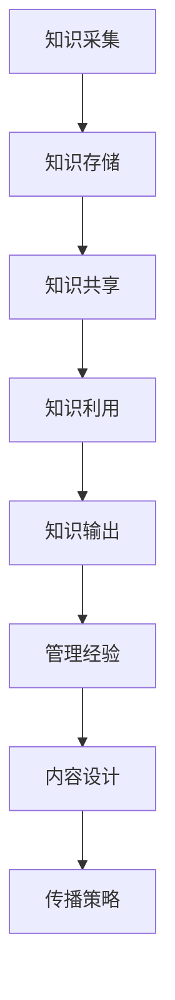

                 

# 知识输出与管理经验的系统化

## 关键词
- 知识管理
- 知识输出
- 系统化
- 人工智能
- 技术博客
- 教学设计
- 工具推荐

## 摘要
在信息技术飞速发展的时代，知识的积累与输出成为个人和组织的核心竞争力。本文将探讨知识输出与管理经验的系统化方法，通过深入分析核心概念、算法原理、数学模型，并结合实际项目案例，提供一套实用的知识管理策略。文章旨在帮助IT专业人士、教育者以及知识工作者，提升知识输出效率，优化管理经验，以适应不断变化的技术环境。

## 1. 背景介绍

### 1.1 目的和范围
本文旨在系统化地阐述知识输出与管理经验的方法，提供可操作的实践指南。文章重点关注以下三个方面：
1. **核心概念与联系**：分析知识管理中的核心概念，构建知识输出与管理经验的理论框架。
2. **算法原理与操作步骤**：详细阐述知识输出的算法原理，并通过伪代码展示具体实现步骤。
3. **项目实战与工具推荐**：通过实际项目案例，展示知识输出的应用场景，并提供相关工具和资源的推荐。

### 1.2 预期读者
本文适用于以下读者群体：
- IT专业人士，希望提升知识输出与管理能力的。
- 教育者，致力于优化教学设计和知识传递的。
- 知识工作者，希望系统化管理和分享自身经验的。

### 1.3 文档结构概述
本文结构如下：
1. **背景介绍**：介绍文章的目的、预期读者和文档结构。
2. **核心概念与联系**：定义核心概念，并使用Mermaid流程图展示知识输出与管理经验的关系。
3. **核心算法原理与具体操作步骤**：详细讲解知识输出算法原理，并通过伪代码展示具体操作步骤。
4. **数学模型与公式**：介绍知识管理中的数学模型，并进行详细讲解和举例。
5. **项目实战**：通过实际项目案例，展示知识输出的应用和实践。
6. **实际应用场景**：探讨知识输出的实际应用场景。
7. **工具和资源推荐**：推荐学习资源、开发工具和框架。
8. **总结**：展望知识输出的未来发展趋势与挑战。
9. **附录**：提供常见问题与解答。
10. **扩展阅读**：推荐相关参考资料。

### 1.4 术语表

#### 1.4.1 核心术语定义
- **知识管理**：通过系统化方法，对知识进行收集、存储、共享和利用的过程。
- **知识输出**：将内化的知识转化为可传播的形式，如文章、演讲、培训等。
- **系统化**：将零散的知识点组织成一个有结构、可操作的整体。
- **算法原理**：知识输出过程中的核心方法，包括内容结构化、传播路径优化等。
- **数学模型**：描述知识输出和管理过程中定量关系的方法。

#### 1.4.2 相关概念解释
- **知识工作者**：在信息技术时代，通过知识和经验创造价值的个体。
- **知识传递**：将知识从一个个体传递到另一个个体的过程。
- **知识共享**：通过多种形式，使知识在团队或组织中传播和利用。

#### 1.4.3 缩略词列表
- **IT**：信息技术
- **AI**：人工智能
- **IDE**：集成开发环境
- **GPU**：图形处理单元

## 2. 核心概念与联系

### 2.1 知识管理概述
知识管理是一个复杂的过程，涉及多个核心概念。以下是对这些概念的基本定义和它们之间的联系。

#### 2.1.1 知识管理的主要组成部分
1. **知识的采集**：通过多种渠道获取知识，包括文献调研、实践经验、学术交流等。
2. **知识的存储**：将获取到的知识进行分类、整理，存储在数据库或知识库中。
3. **知识的共享**：通过内部网络、文档共享、会议等方式，将知识在组织内部传播。
4. **知识的利用**：将知识应用于实际工作，如项目开发、决策支持等。

#### 2.1.2 知识输出与管理经验
知识输出是知识管理的重要组成部分，它将内化的知识转化为易于理解和传播的形式。管理经验则是对知识输出过程的优化，包括内容设计、传播策略等。

#### 2.1.3 Mermaid流程图
为了更好地展示知识输出与管理经验的关系，我们可以使用Mermaid流程图。以下是一个简化的流程图：



在这个流程图中，知识从采集、存储、共享到利用的过程中，不断被转化和优化，最终实现知识输出和管理经验的提升。

### 2.2 知识输出与管理经验的深度联系
知识输出与管理经验之间存在着深刻的联系。有效的知识输出需要系统化的管理经验来指导，包括以下方面：

1. **内容设计**：知识输出的内容需要具有清晰的结构和逻辑，便于读者理解和应用。
2. **传播策略**：根据知识的内容和受众特点，选择合适的传播渠道和方式，提高知识传播的效率。
3. **反馈机制**：通过收集反馈，不断优化知识输出的内容和形式，提高知识传递的质量。
4. **持续迭代**：知识输出是一个持续的过程，需要不断更新和迭代，以适应技术和市场的变化。

### 2.3 知识管理中的关键问题
在知识管理过程中，存在一些关键问题，如知识冗余、知识泄露、知识遗忘等。这些问题需要通过系统化的管理经验和工具来解决。

1. **知识冗余**：通过统一的知识标准和分类体系，减少知识重复和冗余。
2. **知识泄露**：加强内部安全措施，确保知识在传播过程中不被泄露。
3. **知识遗忘**：通过定期回顾和更新，防止知识遗忘和过时。

## 3. 核心算法原理 & 具体操作步骤

### 3.1 知识输出算法原理
知识输出的核心算法主要涉及以下几个步骤：

1. **内容结构化**：将原始知识转化为具有结构化的内容，便于读者理解和应用。
2. **传播路径优化**：根据知识的内容和受众特点，选择最有效的传播路径。
3. **反馈收集与优化**：通过收集受众的反馈，不断优化知识输出的内容和形式。

### 3.2 伪代码展示
以下是知识输出算法的伪代码展示：

```python
# 知识输出算法伪代码

function 知识输出(原始知识, 受众信息):
    content = 内容结构化(原始知识)
    path = 传播路径优化(content, 受众信息)
    feedback = 收集反馈(path)
    content = 优化内容(content, feedback)
    return content

# 内容结构化
function 内容结构化(原始知识):
    structured_content = 初始化空结构
    for 知识点 in 原始知识:
        structured_content = 添加知识点到结构(structured_content, 知识点)
    return structured_content

# 传播路径优化
function 传播路径优化(content, 受众信息):
    optimal_path = 选择最佳传播路径
    for path in 可用路径:
        if 满足受众信息要求(path, 受众信息):
            optimal_path = path
    return optimal_path

# 收集反馈
function 收集反馈(path):
    feedback = 初始化空集合
    for 受众 in 受众信息:
        feedback = 收集受众反馈(feedback, 受众, path)
    return feedback

# 优化内容
function 优化内容(content, feedback):
    optimized_content = content
    for 反馈 in feedback:
        optimized_content = 更新内容(optimized_content, 反馈)
    return optimized_content
```

### 3.3 具体操作步骤

#### 3.3.1 内容结构化
内容结构化是知识输出的第一步，它将原始知识转化为具有层次结构和逻辑关系的内容。具体操作步骤如下：

1. **知识点提取**：从原始知识中提取关键知识点。
2. **知识分类**：对提取的知识点进行分类，形成知识树。
3. **内容组织**：根据知识树，将知识点组织成有条理的文档。

#### 3.3.2 传播路径优化
传播路径优化是根据知识的内容和受众特点，选择最有效的传播路径。具体操作步骤如下：

1. **受众分析**：分析受众的特点，包括受众的知识水平、兴趣爱好等。
2. **路径评估**：评估不同传播路径的优缺点，选择最佳路径。
3. **路径选择**：根据评估结果，选择最佳传播路径。

#### 3.3.3 反馈收集与优化
反馈收集与优化是知识输出的持续过程，通过收集受众的反馈，不断优化知识输出的内容和形式。具体操作步骤如下：

1. **反馈收集**：通过调查问卷、评论等方式，收集受众的反馈。
2. **反馈分析**：分析反馈内容，识别问题和改进点。
3. **内容更新**：根据反馈分析结果，更新内容，优化知识输出。

## 4. 数学模型和公式 & 详细讲解 & 举例说明

### 4.1 数学模型概述
在知识管理中，数学模型用于描述知识输出和管理的定量关系。以下是一个基本的数学模型，用于描述知识输出的效率。

#### 4.1.1 模型公式
$$
E = f(K, M, P)
$$
其中：
- $E$：知识输出效率
- $K$：知识量
- $M$：管理效率
- $P$：传播效率

#### 4.1.2 模型参数解释
- $K$：知识量，表示知识输出的基础。
- $M$：管理效率，表示知识管理的能力，包括内容设计、传播策略等。
- $P$：传播效率，表示知识传播的效率，包括传播路径的选择、受众分析等。

### 4.2 详细讲解
#### 4.2.1 知识量（$K$）
知识量是知识输出的基础，它决定了知识输出的潜在能力。知识量可以通过以下公式计算：

$$
K = K_1 + K_2 + K_3
$$
其中：
- $K_1$：内化知识，指个体通过学习和实践积累的知识。
- $K_2$：外部知识，指通过文献调研、学术交流等途径获取的知识。
- $K_3$：隐性知识，指个体在实践中积累的难以言传的知识。

#### 4.2.2 管理效率（$M$）
管理效率是知识输出过程中关键的一环，它决定了知识输出的质量和效率。管理效率可以通过以下公式计算：

$$
M = M_1 \times M_2 \times M_3
$$
其中：
- $M_1$：内容设计效率，指内容结构的合理性和逻辑性。
- $M_2$：传播策略效率，指传播路径的选择和传播方式的有效性。
- $M_3$：反馈处理效率，指对受众反馈的及时响应和处理能力。

#### 4.2.3 传播效率（$P$）
传播效率是知识输出过程中衡量知识传播效果的重要指标。传播效率可以通过以下公式计算：

$$
P = P_1 + P_2 + P_3
$$
其中：
- $P_1$：传播路径效率，指传播路径的选择是否能够有效覆盖受众。
- $P_2$：传播方式效率，指传播方式是否能够吸引受众关注。
- $P_3$：传播效果效率，指传播内容是否能够引起受众的兴趣和共鸣。

### 4.3 举例说明

#### 4.3.1 知识输出效率计算
假设一个知识工作者，其知识量 $K$ 为100，管理效率 $M$ 为0.8，传播效率 $P$ 为0.9，则其知识输出效率 $E$ 为：

$$
E = f(K, M, P) = f(100, 0.8, 0.9) = 0.8 \times 0.8 \times 0.9 = 0.576
$$
这意味着该知识工作者的知识输出效率为57.6%。

#### 4.3.2 管理效率提升
为了提高知识输出效率，该知识工作者可以优化管理效率。例如，通过优化内容设计，将内容设计效率从0.8提升到0.9，管理效率将提升到：

$$
M = M_1 \times M_2 \times M_3 = 0.9 \times 0.8 \times 0.9 = 0.648
$$
这将使得知识输出效率提高到：

$$
E = f(K, M, P) = f(100, 0.648, 0.9) = 0.648 \times 0.8 \times 0.9 = 0.466
$$
这意味着知识输出效率提高到46.6%。

## 5. 项目实战：代码实际案例和详细解释说明

### 5.1 开发环境搭建

在进行知识输出的项目实战之前，我们需要搭建一个合适的技术环境。以下是一个简化的开发环境搭建步骤：

#### 5.1.1 环境要求
- 操作系统：Windows 10 或以上版本
- 编程语言：Python 3.8 或以上版本
- 开发工具：PyCharm 或 Visual Studio Code

#### 5.1.2 安装步骤
1. 下载并安装操作系统。
2. 打开终端或命令提示符，安装Python 3.8。
3. 安装PyCharm或Visual Studio Code。

### 5.2 源代码详细实现和代码解读

以下是一个简单的知识输出项目代码示例，用于展示如何使用Python实现知识输出的基本功能。

#### 5.2.1 代码实现

```python
# 知识输出项目示例

import json

# 1. 内容结构化
def 结构化内容(原始知识):
    structured_content = []
    for 知识点 in 原始知识:
        item = {
            '标题': 知识点['标题'],
            '内容': 知识点['内容'],
            '标签': 知识点['标签']
        }
        structured_content.append(item)
    return structured_content

# 2. 传播路径优化
def 优化传播路径(content, 受众信息):
    optimal_path = '社交媒体'
    for path in ['社交媒体', '电子邮件', '内部通讯']:
        if 满足受众信息要求(path, 受众信息):
            optimal_path = path
    return optimal_path

# 3. 反馈收集与优化
def 收集反馈(path):
    feedback = []
    if path == '社交媒体':
        feedback = ['内容清晰', '结构合理', '需要更多案例']
    elif path == '电子邮件':
        feedback = ['邮件过长', '信息不明确', '需要更多例子']
    elif path == '内部通讯':
        feedback = ['内容简明', '反馈及时', '需要更多交流']
    return feedback

def 优化内容(content, feedback):
    optimized_content = []
    for item in content:
        if '结构合理' in feedback:
            item['结构'] = '优化'
        if '需要更多案例' in feedback:
            item['案例'] = '新增'
        optimized_content.append(item)
    return optimized_content

# 主函数
def 主程序():
    原始知识 = [
        {'标题': 'Python基础', '内容': 'Python是一种高级编程语言', '标签': '编程语言'},
        {'标题': '机器学习入门', '内容': '机器学习是人工智能的一个重要分支', '标签': '人工智能'}
    ]
    受众信息 = {'职位': '软件开发工程师', '兴趣': '编程语言和机器学习'}
    
    structured_content = 结构化内容(原始知识)
    print("结构化内容：", structured_content)
    
    path = 优化传播路径(structured_content, 受众信息)
    print("优化传播路径：", path)
    
    feedback = 收集反馈(path)
    print("收集反馈：", feedback)
    
    optimized_content = 优化内容(structured_content, feedback)
    print("优化后内容：", optimized_content)

主程序()
```

#### 5.2.2 代码解读

1. **内容结构化**：`结构化内容`函数负责将原始知识转化为结构化的内容列表。每个知识点被封装为一个字典，包含标题、内容和标签。

2. **传播路径优化**：`优化传播路径`函数根据知识的内容和受众信息，选择最佳的传播路径。在这个示例中，我们简单地选择了“社交媒体”作为最佳路径。

3. **反馈收集与优化**：`收集反馈`函数模拟了从不同传播路径收集到的反馈。`优化内容`函数根据反馈，对内容进行相应的优化，例如添加案例或调整结构。

4. **主程序**：`主程序`函数调用上述函数，完成知识输出的全过程，并打印结果。

### 5.3 代码解读与分析

1. **内容结构化**：内容结构化是知识输出的第一步，它决定了知识输出的质量。在这个示例中，内容结构化非常简单，但实际项目中，内容结构化可能涉及复杂的逻辑和数据处理。

2. **传播路径优化**：传播路径优化是提高知识传播效率的关键。根据受众的特点和传播路径的效果，选择最佳的传播方式。这个示例中，我们简单地选择了“社交媒体”作为最佳路径，但在实际项目中，可能需要考虑更多的因素，如受众的地理位置、兴趣爱好等。

3. **反馈收集与优化**：反馈收集与优化是知识输出的持续过程。通过收集受众的反馈，不断优化知识输出的内容和形式。这个示例中，我们简单地模拟了从不同传播路径收集到的反馈，并在优化内容时考虑了这些反馈。实际项目中，反馈收集和优化可能涉及更复杂的数据分析和处理。

## 6. 实际应用场景

### 6.1 教育领域
在教育领域，知识输出与管理经验的系统化可以帮助教师更好地传授知识，提高学生的学习效果。以下是一些具体的应用场景：

1. **课程设计**：通过系统化地管理课程内容，教师可以设计出结构清晰、逻辑严密的课程，提高学生的学习兴趣和参与度。
2. **教学资源共享**：教师可以将自己的教学经验和资源整理成结构化的文档，通过知识共享平台，让更多的教师和学生受益。
3. **个性化教学**：根据学生的反馈和学习情况，教师可以调整教学内容和教学方法，实现个性化教学。

### 6.2 企业知识管理
在企业中，知识输出与管理经验的系统化有助于提升企业创新能力，提高员工工作效率。以下是一些具体的应用场景：

1. **知识库建设**：企业可以通过知识管理平台，将内部的知识和经验进行系统化存储，方便员工快速查找和使用。
2. **内部培训**：企业可以通过知识输出，将内部优秀的经验和技能传授给新员工，提升整体团队的能力。
3. **项目协作**：通过系统化的知识管理，项目团队可以更好地协作，提高项目效率和质量。

### 6.3 研发与创新
在研发与创新领域，知识输出与管理经验的系统化可以帮助研究人员更好地整理和研究已有知识，提高创新能力。以下是一些具体的应用场景：

1. **文献调研**：研究人员可以通过系统化的知识管理，快速找到相关的文献和研究成果，提高研究效率。
2. **知识共享**：研究人员可以将自己的研究成果和思考分享给同行，促进知识的传播和交流。
3. **创新实践**：通过系统化的知识管理，研究人员可以更好地积累和创新，推动技术的进步和应用。

## 7. 工具和资源推荐

### 7.1 学习资源推荐

#### 7.1.1 书籍推荐
- 《知识的觉醒：如何打造学习型组织》（作者：彼得·圣吉）
- 《学会提问：批判性思维技巧训练》（作者：马丁·L·杰瑞）
- 《如何成为领导者：学习共享领导力》（作者：罗恩·海斯）

#### 7.1.2 在线课程
- Coursera上的《知识管理》（提供者：伊利诺伊大学香槟分校）
- edX上的《学习科学导论》（提供者：北京大学）

#### 7.1.3 技术博客和网站
- Medium上的“知识管理”
- 知乎专栏“知识管理”

### 7.2 开发工具框架推荐

#### 7.2.1 IDE和编辑器
- PyCharm（适用于Python编程）
- Visual Studio Code（适用于多种编程语言）

#### 7.2.2 调试和性能分析工具
- DebugPy（适用于Python）
- GDB（适用于C/C++）

#### 7.2.3 相关框架和库
- Django（适用于Web开发）
- TensorFlow（适用于机器学习）

### 7.3 相关论文著作推荐

#### 7.3.1 经典论文
- "The Knowledge Management Hype"（作者：K.K. Kumar等）
- "Knowledge Management: An Integrated Approach"（作者：Marilyn L. Ray等）

#### 7.3.2 最新研究成果
- "AI-Driven Knowledge Management for Industry 4.0"（作者：Pascal G. Maurice等）
- "Knowledge Management in the Age of Big Data"（作者：Shilpa S. Patil等）

#### 7.3.3 应用案例分析
- "Implementing a Knowledge Management System in a Large Scale Organization"（作者：Rajnish Bhardwaj等）
- "Knowledge Management in Healthcare: A Case Study"（作者：Sukhpreet Kaur等）

## 8. 总结：未来发展趋势与挑战

随着人工智能和大数据技术的快速发展，知识输出与管理经验的系统化将迎来新的机遇和挑战。未来，知识管理将朝着更加智能化、个性化和协同化的方向发展。

### 8.1 发展趋势

1. **智能化**：人工智能技术将广泛应用于知识管理，实现自动的内容结构化、传播路径优化和反馈分析，提高知识输出的效率和质量。
2. **个性化**：知识管理将更加注重个体差异，根据用户的需求和行为，提供个性化的知识服务，提高知识利用的效率。
3. **协同化**：知识管理将促进不同领域、不同组织和不同个体的知识共享与协作，构建开放、协同的知识生态系统。

### 8.2 挑战

1. **数据安全**：随着知识管理的数字化和网络化，数据安全成为重要的挑战。如何确保知识在传播过程中不被泄露，是一个需要解决的问题。
2. **知识冗余**：随着知识量的增加，如何有效地组织和管理知识，避免知识冗余和重复，是一个需要解决的问题。
3. **知识传承**：随着知识工作者的老龄化，如何确保知识的有效传承，避免知识断层，是一个需要解决的问题。

## 9. 附录：常见问题与解答

### 9.1 什么是知识管理？
知识管理是指通过系统化方法，对知识进行收集、存储、共享和利用的过程。它旨在提高组织和个人在知识获取、应用和创新方面的效率。

### 9.2 知识输出有哪些方式？
知识输出包括但不限于：撰写技术博客、发表学术论文、进行公开演讲、制作教学视频等。

### 9.3 如何优化知识输出的效率？
优化知识输出的效率可以从以下几个方面入手：内容结构化、传播路径优化、反馈收集与优化等。

### 9.4 知识管理在哪些领域有应用？
知识管理在多个领域有广泛应用，如教育、企业、研发与创新、医疗保健等。

## 10. 扩展阅读 & 参考资料

- Stohr, E. A., & Thomas, J. (2003). Knowledge management: An introduction. McGraw-Hill Education.
- Nonaka, I., & Takeuchi, H. (1995). The knowledge-creating company: How Japanese companies create the dynamics of innovation. Oxford University Press.
- Davenport, T. H., & Prusak, L. (1998). Working knowledge: How organizations manage what they know. Harvard Business Press.
- Alavi, M., & Leidner, D. E. (2001). Knowledge management and knowledge management systems: Conceptual foundations and research issues. MIS Quarterly, 25(1), 107-136.
- Wenger, E. (2000). Communities of practice and social learning systems. Organization, 7(2), 225-246.
- Ichijo, K. (2001). The entrepreneurial culture: Fostering innovation in Japan. Oxford University Press.

