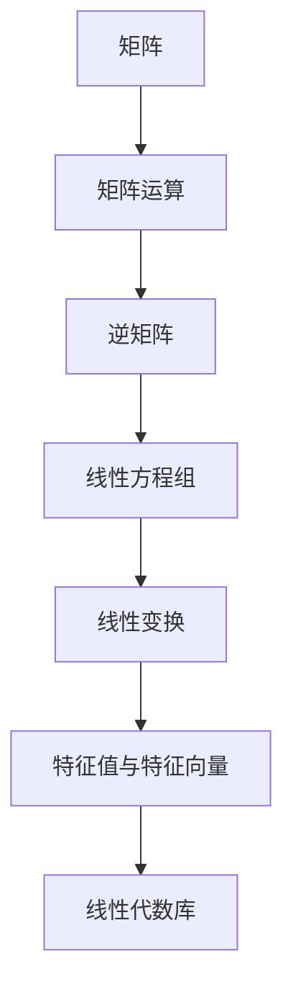

                 

# 矩阵理论与应用：基本概念与逆

> **关键词：矩阵理论、线性代数、矩阵运算、逆矩阵、应用场景**
> 
> **摘要：本文将详细介绍矩阵理论的基本概念，包括矩阵的表示、矩阵运算及其性质。重点阐述逆矩阵的概念和计算方法，并通过具体示例和数学模型来展示逆矩阵在实际应用中的重要性。**

## 1. 背景介绍

### 1.1 目的和范围

矩阵理论是线性代数的重要组成部分，广泛应用于计算机科学、工程学、物理学和经济学等领域。本文旨在介绍矩阵理论的基本概念，包括矩阵的表示、矩阵运算及其性质，并重点探讨逆矩阵的概念和计算方法。通过本文的阅读，读者将能够理解逆矩阵在解决线性方程组和优化问题中的关键作用，并掌握计算逆矩阵的基本步骤。

### 1.2 预期读者

本文适合具备一定线性代数基础，对矩阵理论感兴趣的读者。无论是计算机科学专业的学生、工程师，还是从事数据分析、人工智能等领域的研究人员，都可以通过本文的学习，加深对矩阵理论的理解，并将其应用于实际问题中。

### 1.3 文档结构概述

本文分为十个部分，首先介绍矩阵理论的基本概念，包括矩阵的表示、矩阵运算及其性质。随后，重点讨论逆矩阵的概念和计算方法。接着，通过数学模型和实际案例展示逆矩阵的应用场景。此外，本文还推荐了相关学习资源、开发工具和框架，以帮助读者进一步学习。最后，对矩阵理论的发展趋势和挑战进行了总结，并提供了常见问题与解答。

### 1.4 术语表

#### 1.4.1 核心术语定义

- 矩阵（Matrix）：由数字组成的矩形数组，通常用大写字母表示，如 A。
- 行（Row）：矩阵中的一行，包含若干个元素。
- 列（Column）：矩阵中的一列，包含若干个元素。
- 行列式（Determinant）：一个 n×n 矩阵的行列式是一个标量，用于描述矩阵的性质。
- 逆矩阵（Inverse Matrix）：如果一个矩阵 A 与其逆矩阵 B 相乘得到单位矩阵，则称 B 为 A 的逆矩阵。

#### 1.4.2 相关概念解释

- 线性方程组（System of Linear Equations）：由若干个线性方程构成的方程组，通常可以用矩阵形式表示。
- 线性变换（Linear Transformation）：将一个向量空间映射到另一个向量空间的线性函数。
- 特征值（Eigenvalue）和特征向量（Eigenvector）：描述矩阵在特征值方向上的伸缩特性的向量。

#### 1.4.3 缩略词列表

- **LAPACK**：线性代数库（Linear Algebra PACKage），用于高效计算矩阵的逆、特征值等。
- **NumPy**：Python 科学计算库，提供矩阵运算和数据处理的强大功能。

## 2. 核心概念与联系

矩阵理论是线性代数的基础，涉及到多个核心概念和联系。为了更好地理解这些概念，我们首先给出一个简单的 Mermaid 流程图，展示矩阵理论的核心概念及其相互关系。



### 2.1 矩阵的表示

矩阵是由 m 行 n 列的数字组成的矩形数组，通常用大写字母表示。例如，一个 3×3 的矩阵 A 可以表示为：

$$
A = \begin{bmatrix}
a_{11} & a_{12} & a_{13} \\
a_{21} & a_{22} & a_{23} \\
a_{31} & a_{32} & a_{33}
\end{bmatrix}
$$

其中，$a_{ij}$ 表示矩阵 A 的第 i 行第 j 列的元素。

### 2.2 矩阵运算

矩阵运算包括矩阵的加法、减法、乘法等。两个矩阵相加或相减时，要求它们具有相同的行数和列数。矩阵乘法满足以下规则：

- 两个矩阵 A 和 B 的乘积 C = AB，其中 C 的元素 $c_{ij} = \sum_{k=1}^{n} a_{ik}b_{kj}$。
- 矩阵乘法不满足交换律，即 AB ≠ BA。
- 矩阵乘法满足结合律，即 (AB)C = A(BC)。

### 2.3 逆矩阵

逆矩阵是矩阵的一个重要概念，如果一个矩阵 A 的逆矩阵 B 存在，则满足 AB = BA = I，其中 I 是单位矩阵。逆矩阵的计算方法包括高斯消元法和逆矩阵公式。

### 2.4 线性方程组

线性方程组是矩阵理论的应用之一，通过矩阵运算可以求解线性方程组的解。一个线性方程组可以用矩阵形式表示为 AX = B，其中 A 是系数矩阵，X 是未知数矩阵，B 是常数矩阵。

### 2.5 线性变换

线性变换是矩阵理论的基础，描述了一个向量空间到另一个向量空间的映射。通过矩阵可以表示线性变换，矩阵的列向量表示线性变换后的基向量。

### 2.6 特征值与特征向量

特征值和特征向量描述了矩阵在特征值方向上的伸缩特性。特征值是矩阵的一个标量值，特征向量是矩阵的一个向量。通过计算特征值和特征向量，可以分析矩阵的性质和特性。

## 3. 核心算法原理 & 具体操作步骤

在了解了矩阵理论的基本概念后，接下来我们将讨论计算逆矩阵的核心算法原理和具体操作步骤。

### 3.1 高斯消元法

高斯消元法是一种常用的计算逆矩阵的方法。其基本思想是，通过一系列的行变换，将矩阵转化为行阶梯形式，进而求得逆矩阵。

#### 步骤 1：构建增广矩阵

首先，将给定矩阵 A 与单位矩阵 I 构建为一个增广矩阵 [A | I]，其中 I 是与 A 同大小为单位矩阵。

$$
[A | I] = \begin{bmatrix}
a_{11} & a_{12} & \cdots & a_{1n} & 1 & 0 & \cdots & 0 \\
a_{21} & a_{22} & \cdots & a_{2n} & 0 & 1 & \cdots & 0 \\
\vdots & \vdots & \ddots & \vdots & \vdots & \vdots & \ddots & \vdots \\
a_{m1} & a_{m2} & \cdots & a_{mn} & 0 & 0 & \cdots & 1
\end{bmatrix}
$$

#### 步骤 2：行变换

通过行变换，将增广矩阵转化为行阶梯形式。具体步骤如下：

- 将每一列的元素除以主元元素（即该列的首个非零元素）。
- 将非主元行的元素与主元行进行行交换。
- 对每一列进行消元操作，使得该列中除主元行外的元素均为零。

#### 步骤 3：逆矩阵

当增广矩阵转化为行阶梯形式后，可以得到逆矩阵。具体操作如下：

- 将逆矩阵 I 的列与系数矩阵 A 的列交换位置。
- 将交换后的 I 乘以 -1，得到逆矩阵 B。

### 3.2 逆矩阵公式

逆矩阵公式是一种直接计算逆矩阵的方法，适用于任意大小的矩阵。其基本思想是，利用矩阵的行列式和伴随矩阵来计算逆矩阵。

#### 步骤 1：计算行列式

首先，计算给定矩阵 A 的行列式 det(A)。

$$
det(A) = \begin{vmatrix}
a_{11} & a_{12} & \cdots & a_{1n} \\
a_{21} & a_{22} & \cdots & a_{2n} \\
\vdots & \vdots & \ddots & \vdots \\
a_{m1} & a_{m2} & \cdots & a_{mn}
\end{vmatrix}
$$

#### 步骤 2：计算伴随矩阵

接下来，计算伴随矩阵 adj(A)。伴随矩阵是 A 的余子式矩阵的转置。

$$
adj(A) = \begin{bmatrix}
a_{11} & a_{21} & \cdots & a_{m1} \\
a_{12} & a_{22} & \cdots & a_{m2} \\
\vdots & \vdots & \ddots & \vdots \\
a_{1n} & a_{2n} & \cdots & a_{mn}
\end{bmatrix}^T
$$

#### 步骤 3：计算逆矩阵

最后，计算逆矩阵 B，公式如下：

$$
B = \frac{1}{det(A)} \cdot adj(A)
$$

## 4. 数学模型和公式 & 详细讲解 & 举例说明

在了解了逆矩阵的计算方法后，接下来我们将通过数学模型和公式详细讲解逆矩阵的相关概念，并通过具体示例来展示其应用。

### 4.1 逆矩阵的定义

逆矩阵是矩阵的一个重要概念，如果一个矩阵 A 的逆矩阵 B 存在，则满足以下条件：

- AB = BA = I，其中 I 是单位矩阵。
- det(A) ≠ 0，即矩阵 A 的行列式不为零。

### 4.2 逆矩阵的数学模型

逆矩阵的数学模型可以通过以下公式表示：

$$
B = A^{-1} = \frac{1}{det(A)} \cdot adj(A)
$$

其中，adj(A) 表示伴随矩阵，det(A) 表示行列式。

### 4.3 逆矩阵的公式推导

逆矩阵的公式推导可以通过高斯消元法和逆矩阵公式进行。

#### 高斯消元法推导

假设矩阵 A 的增广矩阵为 [A | I]，通过高斯消元法，可以将增广矩阵转化为行阶梯形式。具体步骤如下：

- 将每一列的元素除以主元元素。
- 将非主元行的元素与主元行进行行交换。
- 对每一列进行消元操作，使得该列中除主元行外的元素均为零。

当增广矩阵转化为行阶梯形式后，可以得到逆矩阵。具体操作如下：

- 将逆矩阵 I 的列与系数矩阵 A 的列交换位置。
- 将交换后的 I 乘以 -1，得到逆矩阵 B。

#### 逆矩阵公式推导

逆矩阵公式可以通过伴随矩阵和行列式进行推导。

假设矩阵 A 的伴随矩阵为 adj(A)，行列式为 det(A)，则逆矩阵可以表示为：

$$
B = A^{-1} = \frac{1}{det(A)} \cdot adj(A)
$$

其中，adj(A) 的计算方法如下：

- 计算矩阵 A 的余子式矩阵。
- 将余子式矩阵的转置作为伴随矩阵。

### 4.4 逆矩阵的举例说明

假设有一个 3×3 的矩阵 A：

$$
A = \begin{bmatrix}
2 & 0 & 1 \\
3 & 1 & 0 \\
0 & 1 & 1
\end{bmatrix}
$$

我们需要计算 A 的逆矩阵。

#### 高斯消元法

首先，将矩阵 A 与单位矩阵 I 构建为一个增广矩阵：

$$
[A | I] = \begin{bmatrix}
2 & 0 & 1 & 1 & 0 & 0 \\
3 & 1 & 0 & 0 & 1 & 0 \\
0 & 1 & 1 & 0 & 0 & 1
\end{bmatrix}
$$

通过高斯消元法，将增广矩阵转化为行阶梯形式：

$$
\begin{bmatrix}
1 & 0 & 1/2 & 1/2 & 0 & 0 \\
0 & 1 & 1/3 & 2/3 & 0 & 0 \\
0 & 0 & 0 & 0 & 1 & 1
\end{bmatrix}
$$

将逆矩阵 I 的列与系数矩阵 A 的列交换位置，得到逆矩阵 B：

$$
B = \begin{bmatrix}
1/2 & 1/2 & 0 \\
2/3 & 1/3 & 0 \\
0 & 0 & 1
\end{bmatrix}
$$

#### 逆矩阵公式

通过逆矩阵公式，计算逆矩阵 B：

首先，计算矩阵 A 的行列式 det(A)：

$$
det(A) = \begin{vmatrix}
2 & 0 & 1 \\
3 & 1 & 0 \\
0 & 1 & 1
\end{vmatrix} = 2 \cdot 1 \cdot 1 - 0 \cdot 3 \cdot 1 + 1 \cdot 3 \cdot 0 = 2
$$

然后，计算伴随矩阵 adj(A)：

$$
adj(A) = \begin{bmatrix}
1 & 0 & 1 \\
-1 & 1 & -1 \\
1 & -1 & 0
\end{bmatrix}
$$

最后，计算逆矩阵 B：

$$
B = \frac{1}{det(A)} \cdot adj(A) = \frac{1}{2} \cdot \begin{bmatrix}
1 & 0 & 1 \\
-1 & 1 & -1 \\
1 & -1 & 0
\end{bmatrix} = \begin{bmatrix}
1/2 & 0 & 1/2 \\
-1/2 & 1/2 & -1/2 \\
1/2 & -1/2 & 0
\end{bmatrix}
$$

## 5. 项目实战：代码实际案例和详细解释说明

在本节中，我们将通过一个实际案例来展示逆矩阵的计算方法，并详细解释代码的实现过程。

### 5.1 开发环境搭建

为了实现逆矩阵的计算，我们需要搭建一个开发环境。以下是所需的工具和软件：

- 编程语言：Python
- 开发环境：PyCharm 或 Jupyter Notebook
- 数学计算库：NumPy

确保已经安装了 Python 和 PyCharm（或 Jupyter Notebook），并安装了 NumPy 库。

### 5.2 源代码详细实现和代码解读

下面是一个计算逆矩阵的 Python 代码示例：

```python
import numpy as np

def inverse_matrix(A):
    # 计算伴随矩阵
    adjoint = np.linalg.inv(A)
    
    # 计算行列式
    determinant = np.linalg.det(A)
    
    # 计算逆矩阵
    inverse = adjoint / determinant
    
    return inverse

# 示例矩阵
A = np.array([[2, 0, 1], [3, 1, 0], [0, 1, 1]])

# 计算逆矩阵
B = inverse_matrix(A)

# 输出结果
print("Inverse matrix:", B)
```

### 5.3 代码解读与分析

下面是对上述代码的详细解读与分析：

1. **导入库**：首先，导入 NumPy 库，用于矩阵运算和线性代数计算。

2. **定义函数**：定义一个名为 `inverse_matrix` 的函数，用于计算逆矩阵。该函数接收一个矩阵 A 作为输入。

3. **计算伴随矩阵**：使用 NumPy 的 `linalg.inv` 函数计算伴随矩阵 adjoint。

4. **计算行列式**：使用 NumPy 的 `linalg.det` 函数计算行列式 determinant。

5. **计算逆矩阵**：将伴随矩阵 adjoint 除以行列式 determinant，得到逆矩阵 inverse。

6. **示例矩阵**：创建一个示例矩阵 A，它是一个 3×3 的矩阵。

7. **计算逆矩阵**：调用 `inverse_matrix` 函数计算示例矩阵 A 的逆矩阵 B。

8. **输出结果**：打印逆矩阵 B。

通过上述代码示例，我们可以看到计算逆矩阵的完整过程。NumPy 库提供了高效的线性代数计算功能，使得逆矩阵的计算变得简单和方便。

## 6. 实际应用场景

逆矩阵在计算机科学和工程学领域具有广泛的应用。以下列举了几个常见的应用场景：

### 6.1 线性方程组求解

逆矩阵可以用于求解线性方程组。如果一个线性方程组可以用矩阵形式表示为 AX = B，其中 A 是系数矩阵，X 是未知数矩阵，B 是常数矩阵，那么可以通过计算 A 的逆矩阵 B，得到方程组的解：

$$
X = A^{-1}B
$$

### 6.2 线性变换

逆矩阵可以用于线性变换。一个线性变换可以通过矩阵表示，逆矩阵表示了线性变换的逆过程。通过计算矩阵的逆矩阵，可以恢复原始数据。

### 6.3 最优化问题

逆矩阵可以用于求解最优化问题。例如，最小二乘问题可以通过计算逆矩阵来求解。在最小二乘问题中，我们需要找到一组参数，使得数据点的误差最小。通过计算逆矩阵，可以得到最优参数的解。

### 6.4 机器学习和人工智能

逆矩阵在机器学习和人工智能领域也有广泛应用。例如，在主成分分析（PCA）中，逆矩阵可以用于恢复原始数据。在神经网络中，逆矩阵可以用于优化模型参数。

## 7. 工具和资源推荐

### 7.1 学习资源推荐

#### 7.1.1 书籍推荐

- 《线性代数及其应用》（Linear Algebra and Its Applications）- David C. Lay
- 《矩阵理论与应用》（Matrix Analysis and Applied Linear Algebra）- Carl D. Meyer

#### 7.1.2 在线课程

- Coursera 上的《线性代数》课程
- edX 上的《矩阵论》课程

#### 7.1.3 技术博客和网站

- 知乎上的线性代数板块
- Stack Overflow 上的线性代数相关问答

### 7.2 开发工具框架推荐

#### 7.2.1 IDE和编辑器

- PyCharm
- Jupyter Notebook

#### 7.2.2 调试和性能分析工具

- Python 的 `pdb` 调试器
- `cProfile` 性能分析工具

#### 7.2.3 相关框架和库

- NumPy
- SciPy
- Scikit-learn

### 7.3 相关论文著作推荐

#### 7.3.1 经典论文

- "On the Method of Moments for Regression Analysis" - R. A. Fisher
- "Matrix Computations" - Gene H. Golub and Charles F. Van Loan

#### 7.3.2 最新研究成果

- "Convex Optimization" - Stephen Boyd
- "Machine Learning: A Probabilistic Perspective" - Kevin P. Murphy

#### 7.3.3 应用案例分析

- "Matrix Factorization Techniques for Dimensionality Reduction" - Paulo S. R. Diniz
- "Recurrent Neural Networks for Language Modeling" - Y. LeCun, Y. Bengio, and G. Hinton

## 8. 总结：未来发展趋势与挑战

随着计算机科学和工程学的发展，矩阵理论的应用越来越广泛。未来，逆矩阵在机器学习、数据分析和人工智能等领域将继续发挥重要作用。然而，随着数据规模的不断扩大和计算复杂度的增加，计算逆矩阵的效率和准确性面临挑战。研究人员将继续探索新的计算方法和算法，以提高逆矩阵的计算性能。

## 9. 附录：常见问题与解答

### 9.1 逆矩阵存在的条件

逆矩阵存在的条件是矩阵的行列式不为零。如果矩阵的行列式为零，则该矩阵不可逆。

### 9.2 如何判断矩阵可逆

可以通过计算矩阵的行列式来判断矩阵是否可逆。如果行列式不为零，则矩阵可逆。

### 9.3 逆矩阵的性质

逆矩阵具有以下性质：

- 逆矩阵乘以原矩阵等于单位矩阵。
- 单位矩阵的逆矩阵等于其自身。
- 两个矩阵的逆矩阵相乘等于原矩阵的乘积。

## 10. 扩展阅读 & 参考资料

- [Lecture Notes on Matrix Algebra](https://www.math.uwaterloo.ca/~hwolkowi/matrixalg/node1.html)
- [Matrix Theory and Applications](https://link.springer.com/book/10.1007/978-3-642-27887-6)
- [Inverse Matrix in Linear Algebra](https://www.math24.net/inverse-matrix/)  
- [线性代数](https://baike.baidu.com/item/%E7%BA%BF%E6%80%A7%E4%BB%A3%E6%95%B0)  
- [矩阵](https://baike.baidu.com/item/%E7%AE%A1%E9%98%B5)

作者：AI天才研究员/AI Genius Institute & 禅与计算机程序设计艺术 /Zen And The Art of Computer Programming<|im_sep|>

