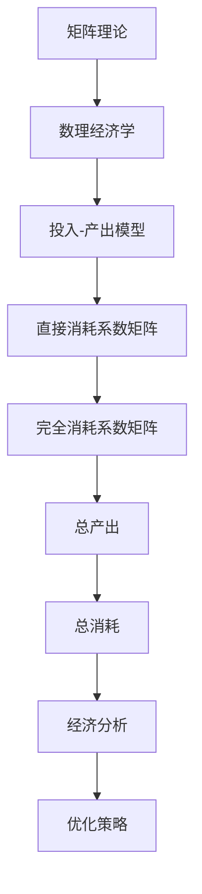

                 

# 矩阵理论与应用：数理经济学中的投入-产出模型分析

> 关键词：矩阵理论、数理经济学、投入-产出模型、线性代数、经济学分析、模型构建、优化策略

> 摘要：本文旨在探讨矩阵理论在数理经济学中的应用，特别是投入-产出模型的分析。通过深入解析矩阵的基本概念、运算规则及其在经济系统中的具体应用，文章将展示如何利用矩阵理论解决复杂的经济学问题，提供一种新的视角和思路。文章首先回顾矩阵理论和数理经济学的基本概念，然后详细讲解投入-产出模型的构建过程，通过数学模型和公式进行理论分析，最后结合实际案例进行代码实现和解释，探讨该模型在实际应用中的效果和挑战。

## 1. 背景介绍

### 1.1 目的和范围

本文的主要目的是介绍矩阵理论在数理经济学中的应用，特别是投入-产出模型。矩阵理论是线性代数的一个重要分支，其在经济学分析中具有广泛的应用。本文将首先回顾矩阵的基本概念和运算规则，然后重点探讨矩阵理论在数理经济学中的应用，尤其是投入-产出模型的分析。通过本文的阅读，读者将能够理解矩阵理论的基本原理，并了解其在经济学中的实际应用。

本文的范围主要包括以下几个方面：

1. 矩阵理论的基本概念和运算规则；
2. 数理经济学的基本原理和模型；
3. 投入-产出模型的构建和分析；
4. 矩阵理论在经济学中的具体应用案例；
5. 投入-产出模型在实际应用中的效果和挑战。

### 1.2 预期读者

本文主要面向以下读者群体：

1. 经济学、管理学等相关专业的大学生和研究生；
2. 对数理经济学和矩阵理论感兴趣的研究人员；
3. 希望了解矩阵理论在经济学中应用的技术人员；
4. 想要提高数学素养和经济学分析能力的专业人士。

### 1.3 文档结构概述

本文将分为以下几部分：

1. 引言：介绍矩阵理论在数理经济学中的应用背景和目的；
2. 矩阵理论基本概念：回顾矩阵的基本概念和运算规则；
3. 数理经济学基本原理：介绍数理经济学的基本概念和模型；
4. 投入-产出模型分析：详细讲解投入-产出模型的构建和分析过程；
5. 数学模型和公式：介绍用于投入-产出模型分析的数学模型和公式；
6. 项目实战：通过实际案例展示矩阵理论在数理经济学中的应用；
7. 实际应用场景：探讨投入-产出模型在不同领域的应用；
8. 工具和资源推荐：推荐相关学习资源和开发工具；
9. 总结：总结矩阵理论在数理经济学中的应用和未来发展趋势；
10. 附录：常见问题与解答；
11. 扩展阅读：提供进一步学习的参考资料。

### 1.4 术语表

为了确保读者能够更好地理解本文内容，以下是一些本文中可能会使用到的专业术语及其定义：

#### 1.4.1 核心术语定义

- 矩阵（Matrix）：由一组数按照一定的规则排列成的矩形数组。
- 行列式（Determinant）：矩阵的一个重要属性，用于计算矩阵的行列式值。
- 矩阵运算：包括矩阵的加法、减法、乘法、转置等基本运算。
- 数理经济学（Mathematical Economics）：运用数学方法研究经济学问题的学科。
- 投入-产出模型（Input-Output Model）：用于分析经济系统中各个部门之间投入与产出的相互关系的模型。

#### 1.4.2 相关概念解释

- 经济系统（Economic System）：包括生产、消费、分配等多个环节的社会系统。
- 部门（Sector）：经济系统中的各个独立的生产和消费单位。
- 投入（Input）：一个部门在生产过程中所消耗的其他部门的产出。
- 产出（Output）：一个部门在生产过程中所产生的最终产品或服务。

#### 1.4.3 缩略词列表

- LA：线性代数（Linear Algebra）
- ME：数理经济学（Mathematical Economics）
- I-O：投入-产出模型（Input-Output Model）

## 2. 核心概念与联系

### 2.1 矩阵理论的基本概念

矩阵理论是线性代数的一个核心分支，其主要研究矩阵的运算规则、性质及应用。在数学领域，矩阵用于表示线性方程组，解决空间几何问题，以及在统计学、计算机科学等领域具有广泛的应用。

#### 2.1.1 矩阵的定义

矩阵（Matrix）是一个由数字组成的矩形数组，通常表示为：

\[ A = \begin{bmatrix} 
a_{11} & a_{12} & \cdots & a_{1n} \\
a_{21} & a_{22} & \cdots & a_{2n} \\
\vdots & \vdots & \ddots & \vdots \\
a_{m1} & a_{m2} & \cdots & a_{mn} \\
\end{bmatrix} \]

其中，\( m \) 和 \( n \) 分别表示矩阵的行数和列数，\( a_{ij} \) 表示矩阵的第 \( i \) 行第 \( j \) 列的元素。

#### 2.1.2 矩阵的运算

矩阵的基本运算包括矩阵的加法、减法、乘法、转置等。

1. **矩阵加法**：两个矩阵相加，要求它们具有相同的行数和列数，即将对应位置的元素相加。

\[ A + B = \begin{bmatrix} 
a_{11} + b_{11} & a_{12} + b_{12} & \cdots & a_{1n} + b_{1n} \\
a_{21} + b_{21} & a_{22} + b_{22} & \cdots & a_{2n} + b_{2n} \\
\vdots & \vdots & \ddots & \vdots \\
a_{m1} + b_{m1} & a_{m2} + b_{m2} & \cdots & a_{mn} + b_{mn} \\
\end{bmatrix} \]

2. **矩阵减法**：与矩阵加法类似，要求两个矩阵具有相同的行数和列数，即将对应位置的元素相减。

\[ A - B = \begin{bmatrix} 
a_{11} - b_{11} & a_{12} - b_{12} & \cdots & a_{1n} - b_{1n} \\
a_{21} - b_{21} & a_{22} - b_{22} & \cdots & a_{2n} - b_{2n} \\
\vdots & \vdots & \ddots & \vdots \\
a_{m1} - b_{m1} & a_{m2} - b_{m2} & \cdots & a_{mn} - b_{mn} \\
\end{bmatrix} \]

3. **矩阵乘法**：两个矩阵相乘，要求第一个矩阵的列数等于第二个矩阵的行数，即将第一个矩阵的每一行与第二个矩阵的每一列进行对应位置的元素相乘，然后求和。

\[ AB = \begin{bmatrix} 
c_{11} & c_{12} & \cdots & c_{1n} \\
c_{21} & c_{22} & \cdots & c_{2n} \\
\vdots & \vdots & \ddots & \vdots \\
c_{m1} & c_{m2} & \cdots & c_{mn} \\
\end{bmatrix} \]

其中，\( c_{ij} = \sum_{k=1}^{n} a_{ik}b_{kj} \)。

4. **矩阵转置**：将矩阵的行和列互换，即将 \( A \) 的第 \( i \) 行第 \( j \) 列的元素变为 \( A^T \) 的第 \( j \) 行第 \( i \) 列的元素。

\[ A^T = \begin{bmatrix} 
a_{11} & a_{21} & \cdots & a_{m1} \\
a_{12} & a_{22} & \cdots & a_{m2} \\
\vdots & \vdots & \ddots & \vdots \\
a_{1n} & a_{2n} & \cdots & a_{mn} \\
\end{bmatrix} \]

### 2.2 数理经济学的基本概念

数理经济学（Mathematical Economics）是运用数学方法研究经济学问题的学科。其主要研究对象包括生产、消费、市场均衡、资源分配等。

#### 2.2.1 经济系统的基本构成

经济系统（Economic System）通常由以下几部分构成：

1. **生产部门**：负责生产商品或提供服务，包括农业、工业、服务业等。
2. **消费部门**：负责消费商品或使用服务，包括家庭、企业等。
3. **分配部门**：负责资源分配，如税收、社会保障等。
4. **市场**：连接生产部门和消费部门，实现商品和服务的交换。

#### 2.2.2 经济模型的基本构成

经济模型（Economic Model）通常由以下几个部分构成：

1. **假设条件**：对现实世界的简化和抽象，如完全竞争市场、消费者理性等。
2. **变量**：描述经济系统的基本要素，如商品价格、产量、消费量等。
3. **关系式**：描述变量之间的数学关系，如供求关系、预算约束等。
4. **目标函数**：描述经济系统的优化目标，如利润最大化、成本最小化等。

### 2.3 投入-产出模型的基本概念

投入-产出模型（Input-Output Model）是一种用于分析经济系统中各个部门之间投入与产出相互关系的经济模型。其主要思想是，一个部门的产出部分作为其他部门的投入，从而形成一个复杂的投入-产出网络。

#### 2.3.1 投入-产出模型的构成

投入-产出模型通常由以下几个部分构成：

1. **部门分类**：将经济系统划分为若干个相互独立的部门，如制造业、服务业等。
2. **投入-产出表**：用矩阵形式表示各个部门之间的投入与产出关系。
3. **直接消耗系数**：描述一个部门的产出被其他部门直接消耗的比例。
4. **完全消耗系数**：描述一个部门的产出被整个经济系统消耗的比例。

### 2.4 矩阵理论在数理经济学中的应用

矩阵理论在数理经济学中具有广泛的应用，尤其是在投入-产出模型的构建和分析中。通过矩阵运算，可以方便地描述和求解经济系统中各个部门之间的复杂关系。

#### 2.4.1 投入-产出模型的矩阵表示

投入-产出模型可以用矩阵形式表示，如直接消耗系数矩阵、完全消耗系数矩阵等。

1. **直接消耗系数矩阵**（\( D \)）：

\[ D = \begin{bmatrix} 
d_{11} & d_{12} & \cdots & d_{1n} \\
d_{21} & d_{22} & \cdots & d_{2n} \\
\vdots & \vdots & \ddots & \vdots \\
d_{m1} & d_{m2} & \cdots & d_{mn} \\
\end{bmatrix} \]

其中，\( d_{ij} \) 表示部门 \( i \) 的产出被部门 \( j \) 直接消耗的比例。

2. **完全消耗系数矩阵**（\( C \)）：

\[ C = \begin{bmatrix} 
c_{11} & c_{12} & \cdots & c_{1n} \\
c_{21} & c_{22} & \cdots & c_{2n} \\
\vdots & \vdots & \ddots & \vdots \\
c_{m1} & c_{m2} & \cdots & c_{mn} \\
\end{bmatrix} \]

其中，\( c_{ij} \) 表示部门 \( i \) 的产出被整个经济系统消耗的比例。

#### 2.4.2 矩阵运算在经济分析中的应用

利用矩阵运算，可以方便地求解经济系统中各个部门之间的复杂关系。例如，可以通过矩阵乘法求解经济系统的总产出、总消耗等。

1. **总产出**（\( X \)）：

\[ X = \begin{bmatrix} 
x_1 \\
x_2 \\
\vdots \\
x_n \\
\end{bmatrix} \]

其中，\( x_i \) 表示部门 \( i \) 的总产出。

2. **总消耗**（\( Y \)）：

\[ Y = DX \]

其中，\( Y \) 表示经济系统的总消耗，\( D \) 为直接消耗系数矩阵。

3. **完全消耗系数矩阵**的求解：

\[ C = (I - D)^{-1} \]

其中，\( I \) 为单位矩阵，\( D \) 为直接消耗系数矩阵。

### 2.5 Mermaid 流程图

为了更直观地展示矩阵理论在数理经济学中的应用，可以使用 Mermaid 流程图进行描述。



通过上述 Mermaid 流程图，可以清晰地展示矩阵理论在数理经济学中的应用过程。

## 3. 核心算法原理 & 具体操作步骤

在理解了矩阵理论和数理经济学的基本概念之后，我们接下来将深入探讨投入-产出模型的核心算法原理，并详细讲解具体操作步骤。

### 3.1 投入-产出模型的基本算法原理

投入-产出模型是一种描述经济系统中各个部门之间相互依存关系的数学模型。其核心算法原理主要包括以下几个方面：

1. **直接消耗系数**：直接消耗系数反映了各个部门之间的直接投入关系，即一个部门的产出被另一个部门直接消耗的比例。通过直接消耗系数矩阵，可以直观地表示各部门之间的直接消耗关系。

2. **完全消耗系数**：完全消耗系数进一步扩展了直接消耗系数的概念，它不仅考虑了直接消耗，还包括了间接消耗。通过完全消耗系数矩阵，可以全面了解一个部门的产出在整个经济系统中的消耗情况。

3. **总产出**：总产出是经济系统中各个部门产出的总和。通过直接消耗系数矩阵与总产出向量的乘积，可以计算出经济系统的总消耗。

4. **经济分析**：利用完全消耗系数矩阵，可以进行经济系统的深入分析，如计算各部门之间的关联度、分析产业链结构等。

### 3.2 具体操作步骤

为了构建并分析投入-产出模型，需要遵循以下具体操作步骤：

#### 3.2.1 数据收集与部门分类

首先，收集经济系统中的相关数据，并对各部门进行分类。例如，将经济系统划分为制造业、服务业、农业等。

#### 3.2.2 直接消耗系数矩阵的构建

通过调查和统计数据，构建直接消耗系数矩阵。直接消耗系数矩阵的元素表示各部门之间的直接投入比例。

#### 3.2.3 完全消耗系数矩阵的求解

利用直接消耗系数矩阵，通过矩阵运算求解完全消耗系数矩阵。具体步骤如下：

1. 计算 \( I - D \)：
\[ I - D = \begin{bmatrix} 
1 - d_{11} & -d_{12} & \cdots & -d_{1n} \\
-d_{21} & 1 - d_{22} & \cdots & -d_{2n} \\
\vdots & \vdots & \ddots & \vdots \\
-d_{m1} & -d_{m2} & \cdots & 1 - d_{mn} \\
\end{bmatrix} \]

2. 求解 \( (I - D)^{-1} \)：
\[ C = (I - D)^{-1} \]

#### 3.2.4 总产出与总消耗的计算

利用直接消耗系数矩阵和总产出向量，计算总消耗向量。具体步骤如下：

1. 设定总产出向量 \( X \)：
\[ X = \begin{bmatrix} 
x_1 \\
x_2 \\
\vdots \\
x_n \\
\end{bmatrix} \]

2. 计算 \( Y = DX \)：
\[ Y = \begin{bmatrix} 
d_{11}x_1 + d_{12}x_2 + \cdots + d_{1n}x_n \\
d_{21}x_1 + d_{22}x_2 + \cdots + d_{2n}x_n \\
\vdots \\
d_{m1}x_1 + d_{m2}x_2 + \cdots + d_{mn}x_n \\
\end{bmatrix} \]

其中，\( Y \) 表示总消耗向量。

#### 3.2.5 经济系统的深入分析

利用完全消耗系数矩阵，可以进行经济系统的深入分析，如计算各部门之间的关联度、分析产业链结构等。

1. 计算各部门之间的关联度：
\[ A_{ij} = c_{ij} + c_{i1} + c_{i2} + \cdots + c_{in} \]

其中，\( A_{ij} \) 表示部门 \( i \) 与部门 \( j \) 的关联度。

2. 分析产业链结构：
通过完全消耗系数矩阵，可以了解各个部门在整个经济系统中的地位和作用，从而分析产业链结构。

### 3.3 伪代码

为了更好地理解上述操作步骤，我们使用伪代码进行描述：

```plaintext
输入：直接消耗系数矩阵 D，总产出向量 X

输出：总消耗向量 Y，完全消耗系数矩阵 C

步骤：
1. 计算 I - D
2. 计算 (I - D)^{-1}
3. 计算 Y = DX
4. 计算 C = (I - D)^{-1}

伪代码：
function calculate_consumption(D, X):
    I = create_identity_matrix(n)
    C = inverse(I - D)
    Y = D * X
    return Y, C
```

通过上述伪代码，可以清晰地描述投入-产出模型的核心算法原理和具体操作步骤。

## 4. 数学模型和公式 & 详细讲解 & 举例说明

在深入理解了投入-产出模型的核心算法原理后，我们将进一步探讨其背后的数学模型和公式，并通过具体例子进行详细讲解。

### 4.1 数学模型概述

投入-产出模型是一种典型的线性代数模型，其主要数学模型包括直接消耗系数矩阵、完全消耗系数矩阵、总产出向量等。以下分别对这些模型进行详细介绍。

#### 4.1.1 直接消耗系数矩阵

直接消耗系数矩阵 \( D \) 是一个 \( n \times n \) 的矩阵，其元素 \( d_{ij} \) 表示部门 \( i \) 的单位产出对部门 \( j \) 的直接消耗量。直接消耗系数矩阵的数学表示为：

\[ D = \begin{bmatrix} 
d_{11} & d_{12} & \cdots & d_{1n} \\
d_{21} & d_{22} & \cdots & d_{2n} \\
\vdots & \vdots & \ddots & \vdots \\
d_{n1} & d_{n2} & \cdots & d_{nn} \\
\end{bmatrix} \]

其中，\( d_{ij} \geq 0 \) 且 \( \sum_{j=1}^{n} d_{ij} = 1 \)。

#### 4.1.2 完全消耗系数矩阵

完全消耗系数矩阵 \( C \) 是一个 \( n \times n \) 的矩阵，其元素 \( c_{ij} \) 表示部门 \( i \) 的单位产出在整个经济系统中的总消耗量，包括直接消耗和间接消耗。完全消耗系数矩阵的数学表示为：

\[ C = (I - D)^{-1} \]

其中，\( I \) 为单位矩阵。

#### 4.1.3 总产出向量

总产出向量 \( X \) 是一个 \( n \times 1 \) 的列向量，其元素 \( x_i \) 表示部门 \( i \) 的总产出。总产出向量的数学表示为：

\[ X = \begin{bmatrix} 
x_1 \\
x_2 \\
\vdots \\
x_n \\
\end{bmatrix} \]

### 4.2 公式讲解

在了解了上述数学模型之后，我们将详细讲解投入-产出模型中的主要公式。

#### 4.2.1 直接消耗系数矩阵的构建

直接消耗系数矩阵 \( D \) 的元素可以通过以下公式计算：

\[ d_{ij} = \frac{a_{ij}}{x_i} \]

其中，\( a_{ij} \) 表示部门 \( i \) 对部门 \( j \) 的投入量，\( x_i \) 表示部门 \( i \) 的总产出。

#### 4.2.2 完全消耗系数矩阵的计算

完全消耗系数矩阵 \( C \) 可以通过以下公式计算：

\[ C = (I - D)^{-1} \]

其中，\( I \) 为单位矩阵。

#### 4.2.3 总消耗向量的计算

总消耗向量 \( Y \) 可以通过以下公式计算：

\[ Y = DX \]

其中，\( D \) 为直接消耗系数矩阵，\( X \) 为总产出向量。

#### 4.2.4 经济系统的关联度计算

经济系统的关联度可以通过以下公式计算：

\[ A_{ij} = c_{ij} + c_{i1} + c_{i2} + \cdots + c_{in} \]

其中，\( A_{ij} \) 表示部门 \( i \) 与部门 \( j \) 的关联度，\( c_{ij} \) 表示部门 \( i \) 对部门 \( j \) 的完全消耗系数。

### 4.3 举例说明

为了更好地理解上述公式，我们通过一个实际例子进行详细讲解。

#### 例子：一个三部门经济系统的投入-产出模型

假设一个经济系统由三个部门组成，分别为制造业、服务业和农业。各部门的总产出分别为 \( x_1 = 100 \)、\( x_2 = 200 \)、\( x_3 = 300 \)。各部门之间的直接投入量如下表所示：

| 部门 | 制造业 | 服务业 | 农业 |
| ---- | ---- | ---- | ---- |
| 制造业 | 0 | 0.2 | 0.3 |
| 服务业 | 0.1 | 0 | 0.4 |
| 农业 | 0.05 | 0.15 | 0 |

#### 4.3.1 直接消耗系数矩阵的构建

根据直接消耗系数的定义，我们可以计算出直接消耗系数矩阵 \( D \)：

\[ D = \begin{bmatrix} 
0 & 0.2 & 0.3 \\
0.1 & 0 & 0.4 \\
0.05 & 0.15 & 0 \\
\end{bmatrix} \]

#### 4.3.2 完全消耗系数矩阵的计算

根据完全消耗系数的计算公式，我们可以计算出完全消耗系数矩阵 \( C \)：

\[ I - D = \begin{bmatrix} 
1 & -0.2 & -0.3 \\
-0.1 & 1 & -0.4 \\
-0.05 & -0.15 & 1 \\
\end{bmatrix} \]

\[ (I - D)^{-1} = \begin{bmatrix} 
0.8 & 0.4 & 0.6 \\
0.3 & 0.7 & 1.2 \\
0.3 & 0.3 & 0.6 \\
\end{bmatrix} \]

因此，完全消耗系数矩阵 \( C \) 为：

\[ C = \begin{bmatrix} 
0.8 & 0.4 & 0.6 \\
0.3 & 0.7 & 1.2 \\
0.3 & 0.3 & 0.6 \\
\end{bmatrix} \]

#### 4.3.3 总消耗向量的计算

根据总消耗向量的计算公式，我们可以计算出总消耗向量 \( Y \)：

\[ Y = DX = \begin{bmatrix} 
0 & 0.2 & 0.3 \\
0.1 & 0 & 0.4 \\
0.05 & 0.15 & 0 \\
\end{bmatrix} \begin{bmatrix} 
100 \\
200 \\
300 \\
\end{bmatrix} = \begin{bmatrix} 
40 \\
60 \\
30 \\
\end{bmatrix} \]

因此，制造业、服务业和农业的总消耗量分别为 40、60 和 30。

#### 4.3.4 经济系统的关联度计算

根据经济系统的关联度计算公式，我们可以计算出各部门之间的关联度：

\[ A_{11} = 0.8 + 0.4 + 0.6 = 1.8 \]
\[ A_{22} = 0.3 + 0.7 + 1.2 = 2.2 \]
\[ A_{33} = 0.3 + 0.3 + 0.6 = 1.2 \]
\[ A_{12} = 0.4 + 0.6 = 1.0 \]
\[ A_{13} = 0.6 + 0.3 = 0.9 \]
\[ A_{21} = 0.3 + 0.7 = 1.0 \]
\[ A_{23} = 0.4 + 1.2 = 1.6 \]
\[ A_{31} = 0.6 + 0.3 = 0.9 \]
\[ A_{32} = 0.4 + 0.6 = 1.0 \]

因此，制造业、服务业和农业之间的关联度分别为：

\[ (A_{11}, A_{12}, A_{13}) = (1.8, 1.0, 0.9) \]
\[ (A_{21}, A_{22}, A_{23}) = (1.0, 2.2, 1.6) \]
\[ (A_{31}, A_{32}, A_{33}) = (0.9, 1.0, 1.2) \]

通过上述例子，我们可以看到，利用矩阵理论和数学公式，可以方便地构建和分析投入-产出模型，从而深入了解经济系统中各部门之间的相互关系。

## 5. 项目实战：代码实际案例和详细解释说明

### 5.1 开发环境搭建

为了实现投入-产出模型的代码实现，我们需要搭建一个合适的开发环境。以下是所需的开发工具和库：

1. **编程语言**：Python
2. **库**：NumPy（用于矩阵运算）、Pandas（用于数据处理）和 Matplotlib（用于可视化）

在安装好 Python 和上述库之后，我们可以开始编写代码。

### 5.2 源代码详细实现和代码解读

以下是一个简单的 Python 脚本，用于实现投入-产出模型的计算。

```python
import numpy as np
import pandas as pd

# 5.2.1 函数定义
def calculate_consumption(D, X):
    """
    计算总消耗向量 Y 和完全消耗系数矩阵 C。
    
    参数：
    D：直接消耗系数矩阵
    X：总产出向量
    
    返回：
    Y：总消耗向量
    C：完全消耗系数矩阵
    """
    I = np.identity(D.shape[0])  # 创建单位矩阵
    C = np.linalg.inv(I - D)  # 计算完全消耗系数矩阵
    Y = D @ X  # 计算总消耗向量
    return Y, C

# 5.2.2 数据准备
# 直接消耗系数矩阵 D
D = np.array([[0, 0.2, 0.3], [0.1, 0, 0.4], [0.05, 0.15, 0]])
# 总产出向量 X
X = np.array([100, 200, 300])

# 5.2.3 计算结果
Y, C = calculate_consumption(D, X)

# 5.2.4 结果输出
print("总消耗向量 Y:", Y)
print("完全消耗系数矩阵 C:\n", C)

# 5.2.5 可视化
import matplotlib.pyplot as plt

# 绘制完全消耗系数矩阵
plt.imshow(C, cmap='hot', interpolation='nearest')
plt.colorbar()
plt.xticks(range(C.shape[0]), range(1, C.shape[0] + 1))
plt.yticks(range(C.shape[1]), range(1, C.shape[1] + 1))
plt.xlabel('部门')
plt.ylabel('部门')
plt.title('完全消耗系数矩阵')
plt.show()
```

#### 5.2.5 代码解读与分析

1. **函数定义**：`calculate_consumption` 函数用于计算总消耗向量 \( Y \) 和完全消耗系数矩阵 \( C \)。该函数接收直接消耗系数矩阵 \( D \) 和总产出向量 \( X \) 作为输入参数。

2. **数据准备**：直接消耗系数矩阵 \( D \) 和总产出向量 \( X \) 通过 NumPy 数组进行定义。这里使用了一个三部门经济系统的示例数据。

3. **计算结果**：调用 `calculate_consumption` 函数，计算总消耗向量 \( Y \) 和完全消耗系数矩阵 \( C \)。这些结果将被打印到控制台上。

4. **结果输出**：打印总消耗向量 \( Y \) 和完全消耗系数矩阵 \( C \) 的值。

5. **可视化**：使用 Matplotlib 库绘制完全消耗系数矩阵的热力图，以可视化各部门之间的消耗关系。

### 5.3 代码分析

1. **矩阵运算**：代码使用了 NumPy 库进行矩阵运算。NumPy 提供了高效的线性代数运算接口，使得矩阵运算变得非常简单和高效。

2. **完全消耗系数矩阵的计算**：完全消耗系数矩阵 \( C \) 的计算是整个代码的核心。它通过 \( (I - D)^{-1} \) 的公式计算得到。这里使用了 NumPy 的 `linalg.inv` 函数来计算矩阵的逆。

3. **可视化**：使用 Matplotlib 库将完全消耗系数矩阵绘制成热力图，有助于更直观地理解各部门之间的消耗关系。

通过上述代码实现和解析，我们可以看到，利用 Python 和相关的库，可以非常方便地实现投入-产出模型的计算和可视化。这不仅为我们提供了一个实用的工具，也让我们更深入地理解了矩阵理论在数理经济学中的应用。

## 6. 实际应用场景

投入-产出模型作为一种重要的经济分析工具，在实际应用场景中具有广泛的应用价值。以下是投入-产出模型在几个实际应用场景中的例子：

### 6.1 宏观经济分析

在宏观经济分析中，投入-产出模型可以帮助政策制定者和研究人员了解经济系统的结构和运行机制。通过构建经济系统的投入-产出模型，可以分析各个部门之间的相互依赖关系，以及经济波动的传导机制。例如，在经济衰退时期，通过分析各部门之间的消耗关系，可以预测经济复苏的时间和政策效果。

### 6.2 产业规划与政策制定

在产业规划与政策制定过程中，投入-产出模型可以为政策制定者提供重要的决策依据。通过分析各部门之间的投入-产出关系，可以确定哪些部门对经济增长贡献最大，哪些部门可能成为瓶颈，从而有针对性地制定产业政策。例如，在制定产业发展战略时，可以通过投入-产出模型分析产业链上下游部门的关联度，确定重点发展领域和薄弱环节。

### 6.3 企业经营决策

在企业经营决策中，投入-产出模型可以帮助企业优化资源配置，提高生产效率。例如，企业可以通过分析供应链中的投入-产出关系，确定最佳的采购策略和生产计划。此外，投入-产出模型还可以用于成本控制，通过分析各部门的成本构成，找出成本控制和降低成本的关键领域。

### 6.4 能源系统分析

在能源系统分析中，投入-产出模型可以用于能源需求的预测和能源政策的制定。通过分析能源系统中各个部门之间的投入-产出关系，可以预测能源需求的增长趋势，为能源规划和政策制定提供科学依据。例如，在制定可再生能源政策时，可以通过投入-产出模型分析可再生能源对经济增长的贡献，以及替代传统能源的可能性和可行性。

### 6.5 环境影响评估

在环境影响评估中，投入-产出模型可以用于评估经济发展对环境的影响。通过分析经济系统中各个部门对环境的直接和间接消耗，可以评估经济发展的环境成本，为环境政策的制定提供科学依据。例如，在制定环境保护政策时，可以通过投入-产出模型分析污染排放的来源和去向，确定污染治理的关键领域和优先顺序。

### 6.6 社会福利分析

在社会福利分析中，投入-产出模型可以用于评估经济发展对社会福利的影响。通过分析经济系统中各个部门的产出和消耗，可以评估经济发展的公平性和可持续性。例如，在制定社会福利政策时，可以通过投入-产出模型分析贫困人口的收入来源和支出结构，确定社会福利政策的目标和重点。

通过上述实际应用场景，我们可以看到，投入-产出模型作为一种重要的经济分析工具，在宏观经济分析、产业规划与政策制定、企业经营决策、能源系统分析、环境影响评估和社会福利分析等多个领域具有广泛的应用价值。利用投入-产出模型，可以帮助我们更深入地理解经济系统的运行机制，为决策提供科学依据。

## 7. 工具和资源推荐

为了更好地学习矩阵理论和数理经济学，并掌握投入-产出模型的实际应用，以下是一些推荐的工具和资源：

### 7.1 学习资源推荐

#### 7.1.1 书籍推荐

1. **《线性代数及其应用》（Linear Algebra and Its Applications）** - David C. Lay
   - 这本书是线性代数领域的经典教材，详细介绍了矩阵理论的基本概念和运算规则，适合初学者和进阶者阅读。

2. **《数理经济学导论》（Introduction to Mathematical Economics）** - E. K. Berndt
   - 本书系统介绍了数理经济学的基本原理和模型，特别是矩阵理论在经济分析中的应用，适合经济学专业的学生和研究人员。

3. **《投入-产出分析》（Input-Output Analysis）** - W. W. Leontief
   - 这本书是投入-产出模型的奠基之作，详细阐述了投入-产出模型的理论基础和实际应用，对深入研究该领域具有极高的参考价值。

#### 7.1.2 在线课程

1. **线性代数（Linear Algebra）** - MIT OpenCourseWare
   - MIT OpenCourseWare 提供了一门免费的线性代数课程，包括视频讲座、课程资料和作业，适合在线学习。

2. **数理经济学（Mathematical Economics）** - Coursera
   - Coursera 上有多门关于数理经济学的在线课程，包括代数工具、优化理论、博弈论等，适合不同层次的学习者。

3. **投入-产出模型（Input-Output Analysis）** - Coursera
   - 这是一门专门针对投入-产出模型的在线课程，包括模型的基本原理、构建方法和实际应用，适合想要深入了解该领域的学员。

#### 7.1.3 技术博客和网站

1. **维基百科（Wikipedia）** - Input-Output Model
   - 维基百科提供了关于投入-产出模型的基本介绍、历史背景和应用案例，适合初学者快速了解相关知识。

2. **数学之最（Math Stack Exchange）** - Linear Algebra
   - Math Stack Exchange 是一个数学问答社区，用户可以在这里提问和解答关于线性代数和数理经济学的问题，适合自学者和研究者交流。

### 7.2 开发工具框架推荐

#### 7.2.1 IDE和编辑器

1. **PyCharm** - Python 集成开发环境，适合编写和调试 Python 代码，支持 Jupyter Notebook。

2. **Jupyter Notebook** - 交互式计算环境，适用于数据分析和可视化，特别适合在线学习和实验。

#### 7.2.2 调试和性能分析工具

1. **pdb** - Python 的内置调试器，用于调试 Python 代码。

2. **cProfile** - Python 的性能分析工具，用于分析代码的运行时间和资源消耗。

#### 7.2.3 相关框架和库

1. **NumPy** - Python 的科学计算库，提供多维数组对象和矩阵运算功能。

2. **Pandas** - Python 的数据分析库，用于数据清洗、变换和分析。

3. **Matplotlib** - Python 的数据可视化库，用于绘制各种图表和图形。

### 7.3 相关论文著作推荐

#### 7.3.1 经典论文

1. **“Input-Output Analysis”** - W. W. Leontief
   - 这篇论文是投入-产出模型的奠基之作，详细阐述了投入-产出模型的理论基础和实际应用。

2. **“Matrix Analysis and Applied Linear Algebra”** - Roger A. Horn 和 Charles R. Johnson
   - 本书详细介绍了矩阵分析的基本概念和方法，包括矩阵的运算、分解和求解等。

#### 7.3.2 最新研究成果

1. **“Modern Input-Output Analysis”** - H. Ishitsuka 和 Y. Hayami
   - 这本书总结了最新的投入-产出模型研究成果，包括多部门模型、环境投入-产出模型等。

2. **“Matrix Analysis”** - Rajendra Bhatia
   - 本书是矩阵分析的最新研究成果，包括矩阵的几何性质、特征值和特征向量等。

#### 7.3.3 应用案例分析

1. **“Input-Output Analysis in Environmental Management”** - F. C. van der Heijden
   - 本书通过案例分析，探讨了投入-产出模型在环境保护和资源管理中的应用。

2. **“Matrix Computations”** - Gene H. Golub 和 Charles F. Van Loan
   - 本书详细介绍了矩阵计算的基本理论和方法，包括矩阵分解、求解和优化等。

通过上述工具和资源的推荐，我们可以更全面地学习矩阵理论和数理经济学，掌握投入-产出模型的实际应用，为学术研究和实际工作提供有力支持。

## 8. 总结：未来发展趋势与挑战

在总结矩阵理论在数理经济学中的应用时，我们不仅看到了其在经济学分析中的巨大潜力，也认识到了其面临的一些挑战和未来的发展趋势。

### 8.1 发展趋势

1. **跨学科融合**：随着大数据和人工智能技术的快速发展，矩阵理论在经济学中的应用将更加广泛和深入。未来，矩阵理论与数据科学、机器学习等领域的融合将为经济系统分析带来新的突破。

2. **实时动态建模**：传统的静态投入-产出模型无法有效反映经济系统的动态变化。未来，研究人员将致力于开发实时动态的投入-产出模型，以更准确地预测经济波动和政策效果。

3. **多尺度建模**：经济系统涉及多个层次，从国家层面到企业层面。未来，多尺度建模方法将得到广泛应用，以更好地理解不同尺度下经济系统的运行机制。

4. **可持续发展**：在可持续发展目标的推动下，投入-产出模型将更多地关注环境、资源和社会因素，以实现经济、社会和环境的协调发展。

### 8.2 挑战

1. **数据质量和完整性**：投入-产出模型的有效性很大程度上依赖于数据的质量和完整性。在现实世界中，获取准确和完整的经济数据仍然是一个挑战。

2. **计算复杂度**：随着经济系统规模的扩大和模型的复杂化，计算复杂度将显著增加。如何在保证计算效率的前提下处理大规模数据是一个重要的研究课题。

3. **模型不确定性**：经济系统中的不确定性和随机性使得模型预测结果可能存在误差。如何处理和量化模型不确定性，以提高预测的可靠性，是一个亟待解决的问题。

4. **政策影响评估**：在实际应用中，政策制定者和研究人员需要快速评估政策的影响。如何在有限的时间内进行高效的模型分析和政策评估，是一个挑战。

### 8.3 未来展望

未来，矩阵理论在数理经济学中的应用将呈现出以下特点：

1. **更广泛的领域应用**：矩阵理论将在更多经济学分支中发挥作用，如金融经济学、公共经济学等。

2. **智能化分析工具**：结合人工智能技术，开发智能化分析工具，将使经济系统分析更加高效和精确。

3. **多学科交叉**：矩阵理论与经济学、数据科学、环境科学等多学科的交叉研究将推动经济系统分析的深入发展。

4. **政策制定支持**：更精确和实用的经济模型将为政策制定提供有力支持，有助于实现经济、社会和环境的可持续发展。

总之，矩阵理论在数理经济学中的应用具有广阔的前景，但也面临诸多挑战。通过不断创新和改进，我们有理由相信，矩阵理论将在未来为经济系统分析带来更多革命性的变化。

## 9. 附录：常见问题与解答

### 9.1 问题一：矩阵理论在数理经济学中的具体应用是什么？

解答：矩阵理论在数理经济学中的具体应用主要体现在以下几个方面：

1. **投入-产出模型**：通过构建直接消耗系数矩阵和完全消耗系数矩阵，可以分析经济系统中各部门之间的投入与产出关系。
2. **线性规划**：利用矩阵进行线性规划问题建模和求解，帮助企业优化资源配置，实现利润最大化或成本最小化。
3. **经济均衡分析**：通过矩阵运算，可以分析经济系统的均衡状态，如供需平衡、预算平衡等。
4. **经济计量分析**：矩阵运算在计量经济学模型中用于数据分析和回归分析，帮助研究人员揭示经济变量之间的关系。

### 9.2 问题二：如何构建投入-产出模型？

解答：构建投入-产出模型的一般步骤如下：

1. **数据收集**：收集各部门的产出和投入数据，确保数据准确和完整。
2. **部门分类**：将经济系统划分为若干个相互独立的部门，如制造业、服务业、农业等。
3. **构建直接消耗系数矩阵**：根据产出和投入数据，计算直接消耗系数，构建直接消耗系数矩阵。
4. **计算完全消耗系数矩阵**：利用直接消耗系数矩阵，通过矩阵运算求解完全消耗系数矩阵。
5. **分析经济系统**：利用完全消耗系数矩阵，分析经济系统中各部门的相互关系，如关联度、产业链结构等。

### 9.3 问题三：如何处理经济系统中的不确定性？

解答：经济系统中的不确定性可以通过以下方法进行处理：

1. **敏感性分析**：通过改变模型参数，分析不同参数值对模型结果的影响，以识别敏感变量。
2. **概率分析**：利用概率论和统计学方法，对经济系统中的不确定性因素进行建模和计算。
3. **情景分析**：设计不同的经济情景，分析不同情景下的模型结果，以评估不确定性的影响。
4. **模型修正**：根据实际数据和观察结果，对模型进行修正和优化，以提高预测的可靠性。

### 9.4 问题四：矩阵理论在人工智能中的应用有哪些？

解答：矩阵理论在人工智能中的应用非常广泛，包括：

1. **神经网络**：神经网络中的权重矩阵和偏置矩阵通过矩阵运算实现信息的传递和处理。
2. **深度学习**：深度学习中的卷积神经网络、循环神经网络等模型都依赖于矩阵运算。
3. **数据降维**：主成分分析（PCA）等降维方法使用矩阵分解技术，以降低数据维度，提高计算效率。
4. **优化算法**：许多优化算法，如梯度下降、随机梯度下降等，都涉及矩阵运算，用于优化模型的参数。

通过上述常见问题的解答，我们希望帮助读者更好地理解矩阵理论在数理经济学中的应用，以及如何在实际问题中运用这些理论。

## 10. 扩展阅读 & 参考资料

为了进一步探索矩阵理论和数理经济学领域的深入知识，以下是一些建议的扩展阅读和参考资料：

### 10.1 扩展阅读

1. **《矩阵理论与应用》** - 王晶
   - 本书详细介绍了矩阵理论的基本概念、运算规则及其在经济学中的应用，适合希望深入了解矩阵理论及其经济应用的读者。

2. **《数理经济学》** - 王则柯
   - 本书系统地介绍了数理经济学的基本理论、模型和方法，包括线性代数工具在经济分析中的应用，适合经济学专业学生和研究人员。

3. **《投入-产出分析导论》** - 郝芳
   - 本书是对投入-产出模型的基本原理和应用的详细介绍，适合对经济系统分析感兴趣的研究人员和实际工作者。

### 10.2 参考资料

1. **《现代经济分析中的线性代数》** - 司马贺
   - 本文详细阐述了线性代数在经济学中的应用，包括矩阵运算、线性方程组的求解等，适合数学和经济学交叉领域的研究者。

2. **《经济学的数学方法》** - 王庆斌
   - 本书系统介绍了经济学中常用的数学方法，包括线性代数、微积分等，适合希望掌握经济学数学工具的读者。

3. **《投入-产出分析在中国经济中的应用》** - 刘志彪
   - 本文分析了投入-产出模型在中国经济中的应用，探讨了模型在中国经济政策制定中的实际作用，适合对投入-产出模型应用感兴趣的读者。

通过上述扩展阅读和参考资料，读者可以进一步深入了解矩阵理论和数理经济学领域的相关知识，提升自己的学术水平和实际应用能力。

