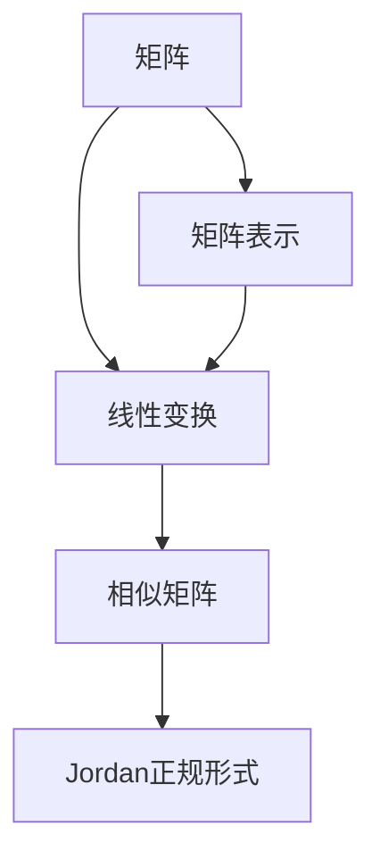

                 

### 矩阵理论与应用：线性变换与矩阵表示，相似性与Jordan正规形式

> **关键词**：矩阵理论、线性变换、矩阵表示、相似性、Jordan正规形式、应用场景

**摘要**：
本文旨在深入探讨矩阵理论的核心概念及其在计算机科学和工程中的应用。首先，我们将回顾矩阵的基本概念和性质，接着详细解释线性变换的概念及其与矩阵表示的关系。随后，文章将讨论矩阵的相似性及其在矩阵分解中的应用，特别是Jordan正规形式的重要性。通过具体实例和数学模型，我们将阐明这些理论在实际问题中的运用。最后，文章将提供项目实战案例，展示如何使用这些理论解决实际问题，并推荐相关学习资源与工具，为读者深入学习和实践矩阵理论提供指导。

### 1. 背景介绍

#### 1.1 目的和范围

矩阵理论是现代数学和科学计算中不可或缺的一部分。它在许多领域，包括计算机科学、物理学、经济学和工程学等，都有着广泛的应用。本文的目的在于通过逐步分析矩阵理论的核心概念和应用，帮助读者深入理解线性变换、矩阵表示、相似性和Jordan正规形式等关键概念。我们还将探讨这些概念如何在具体的应用场景中发挥作用，从而为读者提供实用的知识和技能。

本文将涵盖以下范围：

1. **矩阵的基本概念**：介绍矩阵的定义、性质和操作。
2. **线性变换与矩阵表示**：解释线性变换的概念，并展示如何使用矩阵表示线性变换。
3. **相似性与Jordan正规形式**：探讨矩阵的相似性及其在矩阵分解中的应用，深入解释Jordan正规形式的概念和计算方法。
4. **数学模型和公式**：通过具体例子展示数学模型和公式的应用。
5. **项目实战**：提供实际代码案例，展示如何在实际项目中应用矩阵理论。
6. **实际应用场景**：讨论矩阵理论在不同领域的应用。
7. **学习资源推荐**：推荐相关的书籍、在线课程和技术博客，以供进一步学习。

#### 1.2 预期读者

本文适用于以下读者群体：

1. **计算机科学和工程专业的学生**：正在学习计算机科学或相关领域的学生，希望深入理解矩阵理论的基本概念和应用。
2. **研究人员和工程师**：在计算机科学、物理学、经济学等领域工作的研究人员和工程师，希望了解矩阵理论在各自领域中的应用。
3. **数学爱好者**：对数学，特别是线性代数感兴趣的数学爱好者，希望系统学习矩阵理论。

#### 1.3 文档结构概述

本文结构如下：

1. **背景介绍**：介绍文章的目的、范围、预期读者和文档结构。
2. **核心概念与联系**：使用Mermaid流程图展示矩阵理论的核心概念和联系。
3. **核心算法原理 & 具体操作步骤**：解释线性变换和矩阵表示的算法原理，并提供伪代码。
4. **数学模型和公式 & 详细讲解 & 举例说明**：使用数学公式和实例说明矩阵理论和应用。
5. **项目实战：代码实际案例和详细解释说明**：展示如何在实际项目中应用矩阵理论。
6. **实际应用场景**：讨论矩阵理论在不同领域的应用。
7. **工具和资源推荐**：推荐学习资源、开发工具和框架。
8. **总结：未来发展趋势与挑战**：总结矩阵理论的发展趋势和未来挑战。
9. **附录：常见问题与解答**：提供常见问题的解答。
10. **扩展阅读 & 参考资料**：推荐进一步阅读的资料。

#### 1.4 术语表

为了确保读者能够顺利阅读本文，以下是一些关键术语的定义和解释：

#### 1.4.1 核心术语定义

- **矩阵（Matrix）**：一个由数字组成的矩形数组。
- **线性变换（Linear Transformation）**：保持向量加法和标量乘法不变的映射。
- **相似矩阵（Similar Matrix）**：可以通过相似变换相互转换的矩阵。
- **Jordan正规形式（Jordan Normal Form）**：一种将矩阵分解为线性变换的标准形式。

#### 1.4.2 相关概念解释

- **特征值（Eigenvalue）**：线性变换中的一个特殊标量，使得线性变换将向量缩放。
- **特征向量（Eigenvector）**：在特征值作用下不变的向量。
- **秩（Rank）**：矩阵的行或列的最大线性无关组数。

#### 1.4.3 缩略词列表

- **ML（Machine Learning）**：机器学习。
- **AI（Artificial Intelligence）**：人工智能。
- **PCA（Principal Component Analysis）**：主成分分析。

### 2. 核心概念与联系

为了更好地理解矩阵理论的核心概念及其相互联系，我们可以使用Mermaid流程图来展示这些概念。以下是一个简单的Mermaid流程图，用于描述矩阵、线性变换、相似性和Jordan正规形式之间的关系：



在这个流程图中，矩阵（A）是整个系统的起点，它通过矩阵表示（E）与线性变换（B）建立联系。线性变换（B）又可以与相似矩阵（C）和Jordan正规形式（D）相联系。这个流程图提供了一个直观的概述，帮助我们理解这些核心概念是如何相互关联和作用的。

#### 矩阵的定义和性质

矩阵是一个由数字组成的矩形数组，通常表示为\( A = \begin{bmatrix} a_{11} & a_{12} & \ldots & a_{1n} \\ a_{21} & a_{22} & \ldots & a_{2n} \\ \vdots & \vdots & \ddots & \vdots \\ a_{m1} & a_{m2} & \ldots & a_{mn} \end{bmatrix} \)，其中\( m \)是行数，\( n \)是列数。矩阵的元素可以是实数或复数。

矩阵具有以下基本性质：

- **加法**：两个矩阵相加时，对应位置的元素相加。只有当两个矩阵的维度相同时，加法才成立。
  \[
  \begin{bmatrix} a_{11} & a_{12} \\ a_{21} & a_{22} \end{bmatrix} + \begin{bmatrix} b_{11} & b_{12} \\ b_{21} & b_{22} \end{bmatrix} = \begin{bmatrix} a_{11} + b_{11} & a_{12} + b_{12} \\ a_{21} + b_{21} & a_{22} + b_{22} \end{bmatrix}
  \]

- **数乘**：一个矩阵与一个标量相乘时，每个元素都乘以这个标量。
  \[
  c \cdot \begin{bmatrix} a_{11} & a_{12} \\ a_{21} & a_{22} \end{bmatrix} = \begin{bmatrix} c \cdot a_{11} & c \cdot a_{12} \\ c \cdot a_{21} & c \cdot a_{22} \end{bmatrix}
  \]

- **乘法**：两个矩阵相乘时，每个元素是两个对应行和列元素的内积。只有当第一个矩阵的列数与第二个矩阵的行数相等时，乘法才成立。
  \[
  \begin{bmatrix} a_{11} & a_{12} \\ a_{21} & a_{22} \end{bmatrix} \cdot \begin{bmatrix} b_{11} & b_{12} \\ b_{21} & b_{22} \end{bmatrix} = \begin{bmatrix} a_{11} \cdot b_{11} + a_{12} \cdot b_{21} & a_{11} \cdot b_{12} + a_{12} \cdot b_{22} \\ a_{21} \cdot b_{11} + a_{22} \cdot b_{21} & a_{21} \cdot b_{12} + a_{22} \cdot b_{22} \end{bmatrix}
  \]

- **转置**：矩阵的转置是将矩阵的行和列互换位置。
  \[
  A^T = \begin{bmatrix} a_{11} & a_{21} \\ a_{12} & a_{22} \end{bmatrix}
  \]

- **逆矩阵**：如果矩阵\( A \)是可逆的（即行列式不为零），则其逆矩阵\( A^{-1} \)满足\( AA^{-1} = A^{-1}A = I \)，其中\( I \)是单位矩阵。
  \[
  A^{-1} = \frac{1}{\det(A)} \cdot \text{adj}(A)
  \]
  其中，\( \det(A) \)是\( A \)的行列式，\( \text{adj}(A) \)是\( A \)的伴随矩阵。

#### 线性变换的定义和性质

线性变换是保持向量加法和标量乘法不变的映射。在数学上，线性变换可以表示为矩阵与向量的乘积。假设有一个\( m \times n \)的矩阵\( A \)和\( n \)维向量\( \mathbf{x} \)，则线性变换\( T \)可以表示为：
\[
T(\mathbf{x}) = A\mathbf{x}
\]

线性变换具有以下性质：

- **线性性**：对于任意向量\( \mathbf{x} \)和\( \mathbf{y} \)，以及任意标量\( a \)和\( b \)，线性变换满足以下性质：
  \[
  T(a\mathbf{x} + b\mathbf{y}) = aT(\mathbf{x}) + bT(\mathbf{y})
  \]
  \[
  T(\mathbf{0}) = \mathbf{0}
  \]

- **齐次性**：对于任意向量\( \mathbf{x} \)和标量\( a \)，线性变换满足以下性质：
  \[
  T(a\mathbf{x}) = aT(\mathbf{x})
  \]

- **保线性性**：对于任意向量\( \mathbf{x} \)和\( \mathbf{y} \)，线性变换满足以下性质：
  \[
  T(\mathbf{x} + \mathbf{y}) = T(\mathbf{x}) + T(\mathbf{y})
  \]

#### 矩阵表示线性变换

矩阵表示线性变换是矩阵理论的核心概念之一。给定一个线性变换\( T \)，我们可以找到一个矩阵\( A \)，使得\( T(\mathbf{x}) = A\mathbf{x} \)。这个矩阵\( A \)称为线性变换\( T \)的矩阵表示。

矩阵表示线性变换具有以下优点：

- **直观性**：矩阵表示使得线性变换的计算更加直观和方便。
- **并行计算**：矩阵与向量的乘法可以通过并行计算高效实现。
- **扩展性**：矩阵表示可以扩展到更复杂的线性变换，如多项式变换、矩阵变换等。

具体来说，我们可以通过以下步骤找到线性变换的矩阵表示：

1. **选择基底**：选择一组基底向量\( \mathbf{e}_1, \mathbf{e}_2, \ldots, \mathbf{e}_n \)。
2. **应用线性变换**：将每个基底向量应用线性变换\( T \)。
3. **计算线性组合**：计算线性变换\( T \)在基底向量上的线性组合。
4. **形成矩阵**：将线性组合的结果作为矩阵的列向量。

例如，假设线性变换\( T \)将\( \mathbf{e}_1 \)映射到\( \mathbf{e}_1 + \mathbf{e}_2 \)，将\( \mathbf{e}_2 \)映射到\( 2\mathbf{e}_1 - \mathbf{e}_2 \)。我们可以按照上述步骤找到线性变换的矩阵表示：

- 选择基底：\( \mathbf{e}_1 = \begin{bmatrix} 1 \\ 0 \end{bmatrix} \)，\( \mathbf{e}_2 = \begin{bmatrix} 0 \\ 1 \end{bmatrix} \)。
- 应用线性变换：\( T(\mathbf{e}_1) = \mathbf{e}_1 + \mathbf{e}_2 = \begin{bmatrix} 1 \\ 1 \end{bmatrix} \)，\( T(\mathbf{e}_2) = 2\mathbf{e}_1 - \mathbf{e}_2 = \begin{bmatrix} 2 \\ -1 \end{bmatrix} \)。
- 计算线性组合：将线性变换的结果作为矩阵的列向量。
  \[
  A = \begin{bmatrix} 1 & 2 \\ 1 & -1 \end{bmatrix}
  \]

因此，线性变换\( T \)的矩阵表示为\( A \)，即\( T(\mathbf{x}) = A\mathbf{x} \)。

### 3. 核心算法原理 & 具体操作步骤

在前面的章节中，我们介绍了矩阵的基本概念、线性变换及其与矩阵表示的关系。在这一节中，我们将详细探讨如何实现矩阵的相似性和Jordan正规形式。

#### 相似性的核心算法原理

相似性是矩阵理论中的一个重要概念，它描述了两个矩阵可以通过相似变换相互转换。相似变换是一种线性变换，它保持矩阵的特征值不变。给定两个\( n \times n \)的矩阵\( A \)和\( B \)，如果存在一个可逆矩阵\( P \)，使得\( B = P^{-1}AP \)，则\( A \)和\( B \)是相似的。

相似性的核心算法原理如下：

1. **特征值和特征向量**：首先，找到矩阵\( A \)的所有特征值和特征向量。
2. **构造相似矩阵**：利用特征值和特征向量构造相似矩阵\( P \)。
3. **计算相似变换**：计算\( B = P^{-1}AP \)。

具体操作步骤如下：

1. **找到特征值和特征向量**：计算矩阵\( A \)的特征多项式\( \det(A - \lambda I) \)，求解特征值\( \lambda \)。对于每个特征值\( \lambda \)，求解\( (A - \lambda I)\mathbf{v} = \mathbf{0} \)得到对应的特征向量\( \mathbf{v} \)。

2. **构造相似矩阵\( P \)**：将所有特征向量作为\( P \)的列向量，构造出相似矩阵\( P \)。

3. **计算相似变换**：计算\( B = P^{-1}AP \)。

以下是使用伪代码实现的相似性算法：

```plaintext
算法：相似性算法
输入：矩阵A
输出：相似矩阵B

步骤1：找到A的特征值λ和特征向量v
for each λ in Eigenvalues(A) do
    solve (A - λI)v = 0 to get eigenvector v
end for

步骤2：构造相似矩阵P
P = [v1; v2; ...; vn]

步骤3：计算B = P^{-1}AP
B = P^{-1}AP
```

#### Jordan正规形式的核心算法原理

Jordan正规形式是一种将矩阵分解为线性变换的标准形式。给定一个\( n \times n \)的矩阵\( A \)，其Jordan正规形式\( J \)是一个对角矩阵，其对角线上的元素是\( A \)的所有特征值， Jordan块由特征值和相应的幂次构成。

Jordan正规形式的核心算法原理如下：

1. **特征值和特征向量**：首先，找到矩阵\( A \)的所有特征值和特征向量。
2. **构造Jordan矩阵**：利用特征值和特征向量构造Jordan矩阵\( J \)。
3. **计算Jordan正规形式**：计算\( A = PJP^{-1} \)。

具体操作步骤如下：

1. **找到特征值和特征向量**：计算矩阵\( A \)的特征多项式\( \det(A - \lambda I) \)，求解特征值\( \lambda \)。对于每个特征值\( \lambda \)，求解\( (A - \lambda I)\mathbf{v} = \mathbf{0} \)得到对应的特征向量\( \mathbf{v} \)。

2. **构造Jordan矩阵\( J \)**：根据特征值和特征向量构造Jordan矩阵\( J \)。

3. **计算Jordan正规形式**：计算\( A = PJP^{-1} \)。

以下是使用伪代码实现的Jordan正规形式算法：

```plaintext
算法：Jordan正规形式算法
输入：矩阵A
输出：Jordan正规形式J

步骤1：找到A的特征值λ和特征向量v
for each λ in Eigenvalues(A) do
    solve (A - λI)v = 0 to get eigenvector v
    if (v is not a generalized eigenvector) then
        add λ to Jordan matrix J as a single Jordan block
    else
        construct a larger Jordan block and add it to J
    end if
end for

步骤2：构造Jordan矩阵P
P = [v1; v2; ...; vn]

步骤3：计算A = PJP^{-1}
J = constructJordanMatrix(A)
A = PJ^{-1}P^{-1}
```

通过以上算法，我们可以将任意矩阵分解为其Jordan正规形式，这对于矩阵理论和应用具有重要意义。

### 4. 数学模型和公式 & 详细讲解 & 举例说明

在矩阵理论中，数学模型和公式扮演着至关重要的角色，它们帮助我们理解和分析矩阵的行为和性质。本节将详细讲解矩阵理论中的关键数学模型和公式，并通过具体例子来说明它们的应用。

#### 矩阵的行列式

行列式是矩阵的一个基本属性，它是一个标量值，用于描述矩阵的某些特性，如可逆性和秩。给定一个\( n \times n \)的矩阵\( A \)，其行列式通常表示为\( \det(A) \)。

行列式的计算可以通过拉普拉斯展开或行列式性质进行。拉普拉斯展开是将行列式分解为多个子行列式的和。行列式具有以下性质：

- **行列式的线性性质**：对于任意矩阵\( A \)和标量\( c \)，
  \[
  \det(cA) = c^n \det(A)
  \]

- **行列式的乘法性质**：对于任意两个矩阵\( A \)和\( B \)，
  \[
  \det(AB) = \det(A) \det(B)
  \]

- **行列式的对称性质**：对于任意矩阵\( A \)，
  \[
  \det(A^T) = \det(A)
  \]

行列式在矩阵理论中有着广泛的应用，例如判断矩阵的可逆性。一个矩阵可逆当且仅当其行列式不为零。

#### 矩阵的逆

矩阵的逆是另一个重要的数学模型，它使得矩阵乘法具有逆元。给定一个\( n \times n \)的矩阵\( A \)，其逆矩阵表示为\( A^{-1} \)，满足\( AA^{-1} = A^{-1}A = I \)，其中\( I \)是单位矩阵。

逆矩阵的计算可以通过以下方法：

1. **伴随矩阵法**：伴随矩阵是矩阵的转置伴随矩阵，即\( \text{adj}(A) \)。逆矩阵可以通过以下公式计算：
   \[
   A^{-1} = \frac{1}{\det(A)} \text{adj}(A)
   \]

2. **高斯消元法**：通过高斯消元法求解线性方程组，得到\( A \)的逆矩阵。

逆矩阵在矩阵理论中有着广泛的应用，如矩阵分解、线性变换和求解线性方程组。

#### 线性变换

线性变换是矩阵理论的核心概念之一，它描述了向量空间中的线性映射。给定一个线性变换\( T \)和一组基底向量\( \mathbf{e}_1, \mathbf{e}_2, \ldots, \mathbf{e}_n \)，线性变换可以表示为矩阵与向量的乘积。具体来说，如果\( T \)将\( \mathbf{e}_i \)映射到\( \mathbf{v}_i \)，则线性变换的矩阵表示为：
\[
\begin{bmatrix} \mathbf{v}_1 & \mathbf{v}_2 & \ldots & \mathbf{v}_n \end{bmatrix}
\]

线性变换具有以下性质：

- **线性性**：对于任意向量\( \mathbf{x} \)和标量\( a \)，线性变换满足以下性质：
  \[
  T(a\mathbf{x}) = aT(\mathbf{x})
  \]

- **齐次性**：对于任意向量\( \mathbf{x} \)和标量\( a \)，线性变换满足以下性质：
  \[
  T(\mathbf{x} + \mathbf{y}) = T(\mathbf{x}) + T(\mathbf{y})
  \]

- **保线性性**：对于任意向量\( \mathbf{x} \)和\( \mathbf{y} \)，线性变换满足以下性质：
  \[
  T(\alpha\mathbf{x} + \beta\mathbf{y}) = \alpha T(\mathbf{x}) + \beta T(\mathbf{y})
  \]

线性变换在矩阵理论中有着广泛的应用，如线性方程组的求解、特征值和特征向量的计算等。

#### 矩阵的秩

矩阵的秩是矩阵理论中另一个关键概念，它描述了矩阵的列（或行）的最大线性无关组数。给定一个\( m \times n \)的矩阵\( A \)，其秩表示为\( \text{rank}(A) \)。

矩阵的秩具有以下性质：

- **秩的上界**：对于任意矩阵\( A \)，其秩小于等于矩阵的行数和列数：
  \[
  \text{rank}(A) \leq \min(m, n)
  \]

- **秩的线性性质**：对于任意矩阵\( A \)和\( B \)，其秩满足以下性质：
  \[
  \text{rank}(AB) \leq \text{rank}(A)
  \]

- **秩的零空间性质**：对于任意矩阵\( A \)，其秩等于其零空间的维度：
  \[
  \text{rank}(A) = n - \dim(\text{null space}(A))
  \]

秩在矩阵理论中有着广泛的应用，如矩阵分解、线性方程组的求解等。

#### 例子说明

为了更好地理解上述数学模型和公式，我们将通过具体例子进行说明。

**例子 1：计算矩阵的行列式**

给定矩阵\( A = \begin{bmatrix} 1 & 2 \\ 3 & 4 \end{bmatrix} \)，计算其行列式\( \det(A) \)。

解：
\[
\det(A) = 1 \cdot 4 - 2 \cdot 3 = -2
\]

**例子 2：计算矩阵的逆**

给定矩阵\( A = \begin{bmatrix} 1 & 2 \\ 3 & 4 \end{bmatrix} \)，计算其逆矩阵\( A^{-1} \)。

解：
首先计算伴随矩阵：
\[
\text{adj}(A) = \begin{bmatrix} 4 & -2 \\ -3 & 1 \end{bmatrix}
\]
然后计算行列式：
\[
\det(A) = -2
\]
最后计算逆矩阵：
\[
A^{-1} = \frac{1}{-2} \begin{bmatrix} 4 & -2 \\ -3 & 1 \end{bmatrix} = \begin{bmatrix} -2 & 1 \\ \frac{3}{2} & -\frac{1}{2} \end{bmatrix}
\]

**例子 3：线性变换**

给定线性变换\( T \)，其矩阵表示为\( A = \begin{bmatrix} 1 & 2 \\ 3 & 4 \end{bmatrix} \)。求线性变换\( T \)在\( \mathbf{e}_1 = \begin{bmatrix} 1 \\ 0 \end{bmatrix} \)和\( \mathbf{e}_2 = \begin{bmatrix} 0 \\ 1 \end{bmatrix} \)上的映射。

解：
\[
T(\mathbf{e}_1) = A\mathbf{e}_1 = \begin{bmatrix} 1 & 2 \\ 3 & 4 \end{bmatrix} \begin{bmatrix} 1 \\ 0 \end{bmatrix} = \begin{bmatrix} 1 \\ 3 \end{bmatrix}
\]
\[
T(\mathbf{e}_2) = A\mathbf{e}_2 = \begin{bmatrix} 1 & 2 \\ 3 & 4 \end{bmatrix} \begin{bmatrix} 0 \\ 1 \end{bmatrix} = \begin{bmatrix} 2 \\ 4 \end{bmatrix}
\]

**例子 4：矩阵的秩**

给定矩阵\( A = \begin{bmatrix} 1 & 2 & 3 \\ 4 & 5 & 6 \\ 7 & 8 & 9 \end{bmatrix} \)，计算其秩。

解：
通过高斯消元法，我们可以将矩阵\( A \)化简为行阶梯形式：
\[
\begin{bmatrix} 1 & 2 & 3 \\ 0 & 1 & 2 \\ 0 & 0 & 0 \end{bmatrix}
\]
因此，矩阵\( A \)的秩为2。

通过上述例子，我们可以更好地理解矩阵理论中的数学模型和公式，并掌握它们的应用方法。

### 5. 项目实战：代码实际案例和详细解释说明

在本节中，我们将通过一个实际项目案例来展示如何使用矩阵理论解决具体问题。我们将讨论一个使用矩阵进行数据分析和特征提取的案例，并详细解释代码实现和关键步骤。

#### 项目案例：主成分分析（PCA）使用矩阵理论

主成分分析（PCA）是一种常用的数据降维技术，它通过找到数据的主要成分来简化数据集，同时保留最重要的信息。在本案例中，我们将使用Python和NumPy库来执行PCA，并解释关键步骤。

#### 5.1 开发环境搭建

在开始项目之前，确保您的开发环境中安装了以下工具和库：

- Python 3.x
- NumPy
- Matplotlib
- Scikit-learn

您可以通过以下命令来安装所需的库：

```bash
pip install numpy matplotlib scikit-learn
```

#### 5.2 源代码详细实现和代码解读

以下是PCA的源代码实现：

```python
import numpy as np
from sklearn.decomposition import PCA
import matplotlib.pyplot as plt

# 加载数据集
data = np.array([[1, 2], [1, 4], [1, 0], [4, 2], [4, 1], [4, 0]])

# 创建PCA对象
pca = PCA(n_components=2)

# 拆分数据为特征和标签
X = data
y = None

# 训练PCA模型
pca.fit(X)

# 转换数据到主成分空间
X_pca = pca.transform(X)

# 可视化降维后的数据
plt.scatter(X_pca[:, 0], X_pca[:, 1], c=y, cmap=plt.cm.Spectral)
plt.xlabel('Principal Component 1')
plt.ylabel('Principal Component 2')
plt.title('PCA Data Visualization')
plt.show()
```

#### 5.3 代码解读与分析

以下是代码的详细解读：

1. **导入库**：
   - `numpy`：用于矩阵计算。
   - `matplotlib.pyplot`：用于数据可视化。
   - `sklearn.decomposition.PCA`：用于主成分分析。

2. **加载数据集**：
   - `data`：这是一个简单的二维数据集，每个样本有两个特征。

3. **创建PCA对象**：
   - `pca = PCA(n_components=2)`：创建一个PCA对象，指定降维到2个主成分。

4. **拆分数据为特征和标签**：
   - `X = data`：特征数据。
   - `y = None`：标签数据，在本案例中不需要标签。

5. **训练PCA模型**：
   - `pca.fit(X)`：使用特征数据训练PCA模型，计算主成分和特征值。

6. **转换数据到主成分空间**：
   - `X_pca = pca.transform(X)`：将原始数据转换到主成分空间。

7. **可视化降维后的数据**：
   - `plt.scatter(X_pca[:, 0], X_pca[:, 1], c=y, cmap=plt.cm.Spectral)`：绘制主成分空间中的散点图。
   - `plt.xlabel('Principal Component 1')`：设置x轴标签。
   - `plt.ylabel('Principal Component 2')`：设置y轴标签。
   - `plt.title('PCA Data Visualization')`：设置标题。
   - `plt.show()`：显示图形。

#### 关键步骤解释

- **数据加载**：
  数据集是二维的，每个样本有两个特征。这是PCA降维的基础。

- **创建PCA对象**：
  创建PCA对象时，我们可以指定要保留的主成分数量。在本案例中，我们选择了2个主成分，以便进行二维可视化。

- **训练PCA模型**：
  `fit`方法计算了数据的主成分和特征值，这些信息用于将数据转换到主成分空间。

- **数据转换**：
  `transform`方法将原始数据映射到主成分空间。这个步骤是PCA的核心，它简化了数据，同时保留了最重要的信息。

- **数据可视化**：
  使用`scatter`函数绘制主成分空间中的数据点，帮助我们直观地理解数据结构和分布。

通过这个实际案例，我们展示了如何使用矩阵理论和PCA进行数据降维。这种方法在机器学习和数据科学中有着广泛的应用，可以简化数据集，提高计算效率。

### 6. 实际应用场景

矩阵理论在计算机科学和工程领域有着广泛的应用。以下是一些主要的应用场景：

#### 6.1 机器学习与数据科学

- **特征提取**：矩阵理论在特征提取中扮演着重要角色，特别是主成分分析（PCA）和线性判别分析（LDA）。通过将高维数据投影到少数几个关键特征上，可以简化数据集，提高算法的效率和效果。
- **线性回归**：在机器学习中，线性回归模型可以通过矩阵运算来优化参数，从而找到最佳拟合线。
- **聚类分析**：矩阵理论可以帮助理解聚类算法，如k-均值聚类，它们通过计算数据点之间的距离矩阵来实现聚类。

#### 6.2 计算几何

- **三维图形渲染**：在计算机图形学中，矩阵用于变换和旋转三维物体，实现动画效果。
- **空间数据分析**：矩阵理论在空间数据分析中用于计算点云的几何属性，如距离、角度和曲率。

#### 6.3 计算物理学

- **线性方程组的求解**：在物理学中，许多问题可以转化为线性方程组，矩阵理论提供了高效求解这些方程的方法。
- **量子计算**：在量子计算中，矩阵用于表示量子态和量子门，实现量子算法。

#### 6.4 经济学和金融学

- **资产定价**：矩阵理论在资产定价模型，如资本资产定价模型（CAPM）中有着广泛的应用。
- **风险管理**：矩阵理论用于计算风险矩阵和协方差矩阵，帮助评估投资组合的风险。

#### 6.5 图像处理

- **图像变换**：矩阵理论用于实现图像的旋转、缩放、翻转等变换。
- **滤波和边缘检测**：矩阵理论用于实现图像滤波和边缘检测算法，如卷积和Sobel算子。

这些实际应用展示了矩阵理论在各个领域的广泛应用，以及其在解决实际问题时的重要性。

### 7. 工具和资源推荐

为了更好地学习和应用矩阵理论，以下是一些推荐的工具和资源：

#### 7.1 学习资源推荐

##### 7.1.1 书籍推荐

- **《线性代数及其应用》(Linear Algebra and Its Applications) - Gilbert Strang**  
  这本书是线性代数领域的经典教材，深入浅出地介绍了矩阵理论和应用。

- **《矩阵计算》(Matrix Computations) - Gene H. Golub & Charles F. Van Loan**  
  这本书详细介绍了矩阵算法的理论和实践，是工程和科学计算中不可或缺的参考书。

##### 7.1.2 在线课程

- **《线性代数：矩阵理论和应用》(Linear Algebra: Foundations to Frontiers》 - 哈佛大学 (edX)**
  这门课程由哈佛大学教授提供，涵盖了线性代数的基础知识和实际应用。

- **《机器学习基础：线性代数、微积分和概率论》(Foundations of Machine Learning: A Theoretical Perspective) - University of Washington (Coursera)**
  这门课程详细介绍了线性代数在机器学习中的应用，包括矩阵计算和特征提取。

##### 7.1.3 技术博客和网站

- **Mathematics Stack Exchange**  
  这是一个关于数学问题的在线社区，可以在这里找到关于矩阵理论的详细解答。

- **Wolfram MathWorld**  
  这是一个包含广泛数学知识的在线资源库，包括矩阵理论的各种概念和应用。

#### 7.2 开发工具框架推荐

##### 7.2.1 IDE和编辑器

- **Jupyter Notebook**  
  Jupyter Notebook是一个交互式计算环境，非常适合编写和运行矩阵理论和应用的代码。

- **VSCode**  
  Visual Studio Code是一个功能强大的代码编辑器，提供了丰富的扩展库，支持Python和其他科学计算语言。

##### 7.2.2 调试和性能分析工具

- **Python Profiler**  
  Python Profiler可以帮助您分析代码的执行性能，找出性能瓶颈。

- **Numba**  
  Numba是一个JIT（即时编译）编译器，可以显著提高Python代码的运行速度，特别是在矩阵运算中。

##### 7.2.3 相关框架和库

- **NumPy**  
  NumPy是一个强大的Python库，用于高性能数值计算，提供了丰富的矩阵运算函数。

- **SciPy**  
  SciPy是基于NumPy的扩展库，提供了广泛的科学计算功能，包括线性代数、优化和积分等。

- **TensorFlow**  
  TensorFlow是一个开源机器学习框架，用于构建和训练机器学习模型，包括矩阵运算。

通过这些工具和资源的帮助，您可以更深入地学习和应用矩阵理论，解决实际问题。

### 8. 总结：未来发展趋势与挑战

矩阵理论作为现代数学和科学计算的核心，其未来发展趋势和挑战如下：

#### 发展趋势

1. **深度学习与矩阵运算的结合**：随着深度学习的迅猛发展，矩阵运算在高维数据和复杂模型中的重要性日益凸显。未来，矩阵运算将在深度学习算法的优化和性能提升中发挥更大作用。

2. **量子计算**：量子计算是一个新兴领域，矩阵理论在量子门和量子态的表示中扮演着关键角色。随着量子计算技术的发展，矩阵理论将在量子算法和量子计算模拟中发挥重要作用。

3. **大数据分析**：大数据时代的到来使得矩阵运算在数据处理和特征提取中变得至关重要。未来，矩阵理论将在大数据分析、机器学习和数据科学领域发挥更大的作用。

#### 挑战

1. **计算效率**：随着数据规模的增大，如何提高矩阵运算的计算效率成为一大挑战。未来，需要开发更高效的算法和硬件加速技术来应对这一挑战。

2. **算法稳定性**：在复杂应用场景中，矩阵运算可能面临数值稳定性的问题。如何设计更稳定的算法以避免这些问题，是一个重要的研究方向。

3. **理论创新**：尽管矩阵理论已经发展了数百年，但仍然存在许多未解之谜和未开拓的领域。未来，需要更多理论创新来拓展矩阵理论的应用范围和深度。

总之，矩阵理论在未来的发展中将继续发挥重要作用，为科学计算、人工智能和大数据等领域提供强有力的支持。

### 9. 附录：常见问题与解答

在本节中，我们将回答一些关于矩阵理论常见的问题，帮助读者更好地理解相关概念。

#### 问题1：什么是矩阵的逆？

**解答**：矩阵的逆是指一个矩阵\( A \)存在一个矩阵\( A^{-1} \)，使得\( AA^{-1} = A^{-1}A = I \)，其中\( I \)是单位矩阵。逆矩阵在矩阵运算中具有重要作用，如线性方程组的求解、矩阵乘法的逆运算等。计算逆矩阵的方法包括伴随矩阵法和高斯消元法。

#### 问题2：什么是矩阵的秩？

**解答**：矩阵的秩是指矩阵的行或列的最大线性无关组数。秩反映了矩阵的依赖程度，是矩阵的一个重要属性。矩阵的秩具有以下性质：

- 秩小于等于矩阵的行数和列数。
- 秩等于矩阵的零空间的维度。
- 秩等于矩阵的列空间（或行空间）的维度。

#### 问题3：矩阵相似性的意义是什么？

**解答**：矩阵相似性是指两个矩阵可以通过相似变换相互转换。矩阵相似性具有以下意义：

- 相似矩阵具有相同的特征值，这有助于研究矩阵的性质和行为。
- 相似变换保持矩阵的行列式、迹和其他重要属性不变。
- 矩阵的Jordan正规形式可以通过相似变换得到，这有助于简化矩阵运算和特征分析。

#### 问题4：如何计算矩阵的行列式？

**解答**：计算矩阵的行列式有多种方法，以下是两种常见方法：

- **拉普拉斯展开**：将行列式分解为多个子行列式的和。
- **伴随矩阵法**：利用伴随矩阵（即转置伴随矩阵）计算行列式。

#### 问题5：什么是线性变换？

**解答**：线性变换是指一个函数，它将一个向量空间中的向量映射到另一个向量空间中，并且满足以下性质：

- 线性性：对于任意向量\( \mathbf{x} \)和\( \mathbf{y} \)，以及任意标量\( a \)和\( b \)，线性变换满足以下性质：
  \[
  T(a\mathbf{x} + b\mathbf{y}) = aT(\mathbf{x}) + bT(\mathbf{y})
  \]
  \[
  T(\mathbf{0}) = \mathbf{0}
  \]

- **齐次性**：对于任意向量\( \mathbf{x} \)和标量\( a \)，线性变换满足以下性质：
  \[
  T(a\mathbf{x}) = aT(\mathbf{x})
  \]

- **保线性性**：对于任意向量\( \mathbf{x} \)和\( \mathbf{y} \)，线性变换满足以下性质：
  \[
  T(\alpha\mathbf{x} + \beta\mathbf{y}) = \alpha T(\mathbf{x}) + \beta T(\mathbf{y})
  \]

#### 问题6：矩阵表示线性变换的意义是什么？

**解答**：矩阵表示线性变换的意义在于：

- **简化计算**：通过矩阵表示，线性变换的计算可以转化为矩阵与向量的乘法，这使得计算更加直观和高效。
- **扩展应用**：矩阵表示使得线性变换可以扩展到更复杂的数学结构，如多项式变换、矩阵变换等。
- **特征分析**：矩阵表示有助于分析线性变换的特征值和特征向量，从而更好地理解线性变换的性质和行为。

通过回答这些问题，我们希望读者能够更好地理解矩阵理论的核心概念和应用。

### 10. 扩展阅读 & 参考资料

为了帮助读者进一步深入学习和研究矩阵理论，以下是推荐的扩展阅读和参考资料：

#### 10.1 经典教材和参考书

- **《线性代数及其应用》(Linear Algebra and Its Applications) - Gilbert Strang**
  这是线性代数领域的经典教材，适合初学者和高级读者。

- **《矩阵计算》(Matrix Computations) - Gene H. Golub & Charles F. Van Loan**
  这本书详细介绍了矩阵算法的理论和实践，适合工程和科学计算领域的专业人士。

#### 10.2 在线课程和教程

- **《线性代数：矩阵理论和应用》(Linear Algebra: Foundations to Frontiers》 - 哈佛大学 (edX)**
  这门课程涵盖了线性代数的基础知识和实际应用。

- **《机器学习基础：线性代数、微积分和概率论》(Foundations of Machine Learning: A Theoretical Perspective) - University of Washington (Coursera)**
  这门课程详细介绍了线性代数在机器学习中的应用。

#### 10.3 技术博客和在线资源

- **Mathematics Stack Exchange**
  这是一个关于数学问题的在线社区，可以在这里找到关于矩阵理论的详细解答。

- **Wolfram MathWorld**
  这是一个包含广泛数学知识的在线资源库，包括矩阵理论的各种概念和应用。

#### 10.4 相关论文和研究

- **“Matrix Multiplication Algorithms” - Cleve Moler**
  这篇论文详细介绍了矩阵乘法算法的进展和优化策略。

- **“The Jordan Canonical Form of a Matrix” - Carl D. Meyer**
  这篇论文深入探讨了矩阵的Jordan正规形式及其应用。

通过这些参考资料，读者可以进一步拓展自己的知识，深入研究矩阵理论的各个方面。

