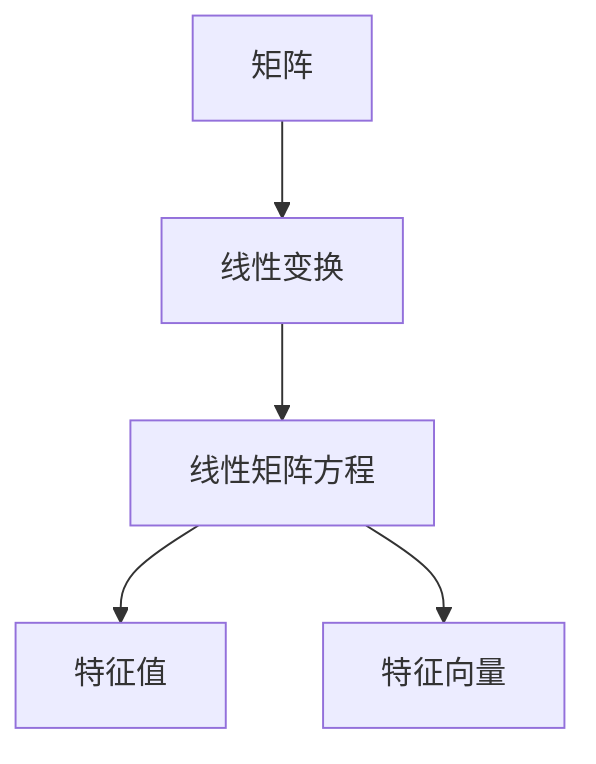

                 


# 矩阵理论与应用：线性矩阵方程

> **关键词：**矩阵理论、线性矩阵方程、算法原理、数学模型、实际应用、编程实现、开发工具推荐、未来趋势。

> **摘要：**本文深入探讨了矩阵理论的核心概念及其在现实世界中的应用，特别是线性矩阵方程的解决方法。通过详细的算法原理讲解、数学模型和公式推导，以及实际代码案例，本文旨在帮助读者理解和掌握这一重要的数学工具，并了解其潜在的未来发展趋势和挑战。

## 1. 背景介绍

### 1.1 目的和范围

本文旨在深入探讨矩阵理论的基本概念，特别是线性矩阵方程的解法。矩阵理论作为现代数学的一个重要分支，在计算机科学、物理学、工程学、经济学等多个领域都有着广泛的应用。线性矩阵方程的求解方法不仅是一种理论工具，更是实际工程中解决复杂问题的关键技术。本文将涵盖以下内容：

1. 矩阵理论的基本概念和性质。
2. 线性矩阵方程的定义和分类。
3. 常见的线性矩阵方程求解算法及其原理。
4. 数学模型和公式推导。
5. 实际应用场景和编程实现。
6. 开发工具和资源推荐。
7. 未来发展趋势和挑战。

### 1.2 预期读者

本文适合以下读者群体：

1. 计算机科学、数学、物理学、工程学等专业的高年级本科生和研究生。
2. 对矩阵理论和线性方程组求解有浓厚兴趣的科技工作者。
3. 在实际工作中需要应用矩阵理论解决问题的工程师和程序员。

### 1.3 文档结构概述

本文的结构如下：

1. **背景介绍**：简要介绍矩阵理论的基本概念和线性矩阵方程的重要性。
2. **核心概念与联系**：通过Mermaid流程图展示矩阵理论的核心概念及其相互关系。
3. **核心算法原理 & 具体操作步骤**：详细讲解线性矩阵方程的常见求解算法，并使用伪代码进行阐述。
4. **数学模型和公式 & 详细讲解 & 举例说明**：介绍线性矩阵方程的数学模型，并使用LaTeX格式展示相关公式。
5. **项目实战：代码实际案例和详细解释说明**：通过实际案例展示线性矩阵方程的编程实现。
6. **实际应用场景**：探讨线性矩阵方程在实际工程中的应用。
7. **工具和资源推荐**：推荐学习资源和开发工具。
8. **总结：未来发展趋势与挑战**：展望线性矩阵方程研究的未来趋势和面临的挑战。
9. **附录：常见问题与解答**：对一些常见问题进行解答。
10. **扩展阅读 & 参考资料**：提供进一步的阅读材料和参考文献。

### 1.4 术语表

#### 1.4.1 核心术语定义

- **矩阵（Matrix）**：由数字组成的矩形阵列，用于表示线性方程组、线性变换等。
- **线性矩阵方程（Linear Matrix Equation）**：形如 $Ax = b$ 的矩阵方程，其中 $A$ 是矩阵，$x$ 和 $b$ 是向量。
- **特征值（Eigenvalue）**：矩阵 $A$ 对应的特征向量 $v$ 的值，满足 $Av = \lambda v$，其中 $\lambda$ 是特征值。
- **特征向量（Eigenvector）**：与特征值相关的向量，满足上述特征方程。

#### 1.4.2 相关概念解释

- **逆矩阵（Inverse Matrix）**：如果矩阵 $A$ 存在逆矩阵 $A^{-1}$，则满足 $AA^{-1} = A^{-1}A = I$，其中 $I$ 是单位矩阵。
- **线性变换（Linear Transformation）**：一种将向量空间中的每个向量映射到另一个向量空间中的线性映射。
- **奇异矩阵（Singular Matrix）**：如果矩阵 $A$ 的行列式为零，则 $A$ 是奇异矩阵。

#### 1.4.3 缩略词列表

- **MATLAB**：矩阵实验室（Matrix Laboratory），一种用于数值计算的科学计算软件。
- **Python**：一种广泛使用的高级编程语言，支持多种科学计算库。

## 2. 核心概念与联系

矩阵理论是一个涉及广泛且深入的数学分支，其核心概念包括矩阵的表示、运算、性质以及与线性方程组、线性变换等的联系。以下是一个简单的Mermaid流程图，展示了这些核心概念之间的联系：



### 2.1 矩阵表示与运算

矩阵是数学中的一个重要工具，用于表示线性方程组、线性变换以及许多其他数学结构。矩阵的表示通常是一个二维数组，其中每个元素表示矩阵中的一个数。

矩阵的运算包括加法、减法、数乘、矩阵乘法等。矩阵加法和减法类似于数字加法和减法，只需要对应位置的元素进行运算。数乘是将矩阵中的每个元素乘以一个标量。矩阵乘法是矩阵之间的一种特殊运算，其结果是一个新矩阵，其元素是原矩阵元素按一定规则组合的结果。

### 2.2 线性变换

线性变换是将一个向量空间中的每个向量映射到另一个向量空间中的线性映射。线性变换可以用矩阵表示。具体来说，如果有一个线性变换 $T: \mathbb{R}^n \rightarrow \mathbb{R}^m$，那么它可以表示为一个 $m \times n$ 的矩阵 $A$，使得对于任意的向量 $x \in \mathbb{R}^n$，都有 $T(x) = Ax$。

### 2.3 线性矩阵方程

线性矩阵方程是形如 $Ax = b$ 的矩阵方程，其中 $A$ 是矩阵，$x$ 和 $b$ 是向量。线性矩阵方程的解法是矩阵理论中的一个重要问题，其解法包括高斯消元法、LU分解、奇异值分解等。

### 2.4 特征值与特征向量

特征值和特征向量是矩阵理论中的核心概念。特征值是矩阵对应特征向量的值，满足 $Av = \lambda v$，其中 $\lambda$ 是特征值，$v$ 是特征向量。特征值和特征向量可以用来分析矩阵的性质，如矩阵的对角化、稳定性等。

### 2.5 线性变换与线性矩阵方程的关系

线性变换和线性矩阵方程之间有着密切的联系。具体来说，如果有一个线性变换 $T: \mathbb{R}^n \rightarrow \mathbb{R}^m$，那么它可以表示为一个 $m \times n$ 的矩阵 $A$。进一步地，如果 $T$ 是可逆的，那么对于任意的向量 $b \in \mathbb{R}^m$，都存在唯一的向量 $x \in \mathbb{R}^n$，使得 $T(x) = b$，即 $Ax = b$ 有唯一解。

## 3. 核心算法原理 & 具体操作步骤

在线性矩阵方程的求解中，算法的选择至关重要。以下是几种常见的线性矩阵方程求解算法及其原理：

### 3.1 高斯消元法

高斯消元法是一种经典的线性方程组求解算法，其基本思想是通过消元操作将线性方程组转化为上三角矩阵，然后依次回代求解。对于线性矩阵方程 $Ax = b$，我们可以使用高斯消元法来求解。

#### 步骤：

1. **初始化**：将矩阵 $A$ 和向量 $b$ 分别存入二维数组中。
2. **消元操作**：从第一行开始，依次对后续行进行消元，将每一列中的非主对角线元素全部消为0。
3. **回代求解**：从最后一行开始，依次回代求解出每一行的解，最终得到向量 $x$ 的解。

#### 伪代码：

```python
def gauss_elimination(A, b):
    n = len(A)
    # 消元操作
    for i in range(n):
        # 找到最大元素的位置
        max_index = find_max_index(A[i], i)
        # 交换行
        swap_rows(A, b, i, max_index)
        # 消元
        for j in range(i+1, n):
            factor = A[j][i] / A[i][i]
            for k in range(i, n):
                A[j][k] -= factor * A[i][k]
            b[j] -= factor * b[i]
    # 回代求解
    x = [0] * n
    for i in range(n-1, -1, -1):
        x[i] = (b[i] - sum(A[i][j] * x[j] for j in range(i+1, n))) / A[i][i]
    return x
```

### 3.2 LU分解

LU分解是将矩阵 $A$ 分解为下三角矩阵 $L$ 和上三角矩阵 $U$ 的过程，即 $A = LU$。通过LU分解，我们可以将线性矩阵方程 $Ax = b$ 转化为两个简单的线性方程组 $Ly = b$ 和 $Ux = y$ 进行求解。

#### 步骤：

1. **初始化**：创建下三角矩阵 $L$ 和上三角矩阵 $U$。
2. **分解过程**：按照高斯消元法的步骤进行消元，将 $A$ 的每个非主对角线元素分解到 $L$ 中，主对角线元素分解到 $U$ 中。
3. **求解过程**：先求解 $Ly = b$，再求解 $Ux = y$。

#### 伪代码：

```python
def lu_decomposition(A):
    n = len(A)
    L = [[0] * n for _ in range(n)]
    U = [[0] * n for _ in range(n)]
    for i in range(n):
        # 消元操作
        for j in range(i, n):
            sum = 0
            for k in range(i):
                sum += L[i][k] * U[k][j]
            U[i][j] = A[i][j] - sum
        # 初始化 L 的对角线元素
        L[i][i] = 1
        # 消元到 L 中
        for j in range(i+1, n):
            sum = 0
            for k in range(i):
                sum += L[j][k] * U[k][i]
            L[j][i] = (A[j][i] - sum) / U[i][i]
    return L, U

def solve_with_LU(L, U, b):
    n = len(L)
    y = forward_substitution(L, b)
    x = backward_substitution(U, y)
    return x
```

### 3.3 奇异值分解

奇异值分解是将矩阵 $A$ 分解为三个矩阵的乘积：$A = U\Sigma V^T$，其中 $U$ 和 $V$ 是正交矩阵，$\Sigma$ 是对角矩阵，对角线上的元素称为奇异值。奇异值分解可以用于求解最小二乘问题和矩阵求逆等问题。

#### 步骤：

1. **初始化**：计算矩阵 $A$ 的奇异值分解。
2. **求解过程**：根据奇异值分解的结果求解线性矩阵方程。

#### 伪代码：

```python
def singular_value_decomposition(A):
    # 使用库函数计算奇异值分解
    U, Sigma, V = svd(A)
    return U, Sigma, V

def solve_with_SVD(U, Sigma, b):
    n = len(Sigma)
    # 计算右侧向量 b 的奇异值分解
    Vb = V.T @ b
    # 求解最小二乘问题
    x = [0] * n
    for i in range(n):
        if Sigma[i] > 1e-10:
            x[i] = Vb[i] / Sigma[i]
    # 使用 U 进行回代求解
    y = U @ x
    return y
```

## 4. 数学模型和公式 & 详细讲解 & 举例说明

线性矩阵方程的数学模型和公式是解决此类问题的关键。以下是线性矩阵方程的数学模型、公式以及详细讲解和举例说明。

### 4.1 线性矩阵方程的数学模型

线性矩阵方程的一般形式为：

$$
Ax = b
$$

其中，$A$ 是 $m \times n$ 的矩阵，$x$ 是 $n$ 维向量，$b$ 是 $m$ 维向量。该方程可以分解为多个线性方程组，例如：

$$
\begin{cases}
a_{11}x_1 + a_{12}x_2 + \cdots + a_{1n}x_n = b_1 \\
a_{21}x_1 + a_{22}x_2 + \cdots + a_{2n}x_n = b_2 \\
\vdots \\
a_{m1}x_1 + a_{m2}x_2 + \cdots + a_{mn}x_n = b_m
\end{cases}
$$

### 4.2 线性矩阵方程的求解公式

线性矩阵方程的求解公式取决于具体的解法。以下是几种常见解法的公式：

#### 高斯消元法：

如果使用高斯消元法求解线性矩阵方程，最终的解可以通过回代得到：

$$
x_i = \frac{b_i - \sum_{j=i+1}^{n} a_{ij}x_j}{a_{ii}}, \quad i = n-1, n-2, \ldots, 1
$$

#### LU分解：

如果使用LU分解，则可以分别求解两个线性方程组：

$$
Ly = b \quad \text{和} \quad Ux = y
$$

其解分别为：

$$
y_i = \frac{b_i - \sum_{j=1}^{i-1} l_{ij}y_j}{l_{ii}}, \quad i = 1, 2, \ldots, n
$$

$$
x_i = \frac{y_i - \sum_{j=1}^{i-1} u_{ij}x_j}{u_{ii}}, \quad i = 1, 2, \ldots, n
$$

#### 奇异值分解：

如果使用奇异值分解，则可以求解最小二乘问题：

$$
x = V\Sigma^{-1}U^Tb
$$

### 4.3 举例说明

假设有一个线性矩阵方程：

$$
\begin{bmatrix}
2 & 1 \\
1 & 2
\end{bmatrix}
\begin{bmatrix}
x_1 \\
x_2
\end{bmatrix}
=
\begin{bmatrix}
3 \\
2
\end{bmatrix}
$$

#### 使用高斯消元法求解：

首先，我们将方程转化为增广矩阵：

$$
\left[
\begin{array}{cc|c}
2 & 1 & 3 \\
1 & 2 & 2
\end{array}
\right]
$$

进行消元操作：

$$
R2 = R2 - \frac{1}{2}R1
$$

得到新的增广矩阵：

$$
\left[
\begin{array}{cc|c}
2 & 1 & 3 \\
0 & \frac{3}{2} & \frac{1}{2}
\end{array}
\right]
$$

继续消元，将第二行中的非主对角线元素消为0：

$$
R1 = R1 - \frac{2}{3}R2
$$

得到新的增广矩阵：

$$
\left[
\begin{array}{cc|c}
2 & 0 & 2 \\
0 & \frac{3}{2} & \frac{1}{2}
\end{array}
\right]
$$

回代求解：

$$
x_2 = \frac{1}{2} \\
x_1 = 2 - \frac{1}{2} = \frac{3}{2}
$$

#### 使用LU分解求解：

首先，对矩阵 $A$ 进行LU分解：

$$
A = \left[
\begin{array}{cc}
2 & 1 \\
1 & 2
\end{array}
\right]
\left[
\begin{array}{cc}
1 & 0 \\
-\frac{1}{2} & 1
\end{array}
\right]
\left[
\begin{array}{cc}
2 & 0 \\
0 & \frac{3}{2}
\end{array}
\right]
$$

求解 $Ly = b$：

$$
y = \left[
\begin{array}{c}
1 \\
0
\end{array}
\right]
$$

求解 $Ux = y$：

$$
x = \left[
\begin{array}{c}
\frac{3}{2} \\
\frac{1}{2}
\end{array}
\right]
$$

#### 使用奇异值分解求解：

首先，对矩阵 $A$ 进行奇异值分解：

$$
A = U\Sigma V^T
$$

其中，$U$ 和 $V$ 是正交矩阵，$\Sigma$ 是对角矩阵，对角线上的元素是奇异值。假设奇异值分解的结果为：

$$
U = \left[
\begin{array}{cc}
\frac{\sqrt{2}}{2} & \frac{\sqrt{2}}{2} \\
-\frac{\sqrt{2}}{2} & \frac{\sqrt{2}}{2}
\end{array}
\right]
, \quad \Sigma = \left[
\begin{array}{cc}
\sqrt{5} & 0 \\
0 & \frac{1}{\sqrt{5}}
\end{array}
\right]
, \quad V = \left[
\begin{array}{cc}
\frac{1}{\sqrt{2}} & \frac{1}{\sqrt{2}} \\
\frac{1}{\sqrt{2}} & -\frac{1}{\sqrt{2}}
\end{array}
\right]
$$

求解最小二乘问题：

$$
x = V\Sigma^{-1}U^Tb
$$

计算 $\Sigma^{-1}$：

$$
\Sigma^{-1} = \left[
\begin{array}{cc}
\frac{1}{\sqrt{5}} & 0 \\
0 & \sqrt{5}
\end{array}
\right]
$$

计算 $U^Tb$：

$$
U^Tb = \left[
\begin{array}{c}
3 \\
2
\end{array}
\right]
$$

计算 $V\Sigma^{-1}U^Tb$：

$$
x = \left[
\begin{array}{cc}
\frac{1}{\sqrt{2}} & \frac{1}{\sqrt{2}} \\
\frac{1}{\sqrt{2}} & -\frac{1}{\sqrt{2}}
\end{array}
\right]
\left[
\begin{array}{cc}
\frac{1}{\sqrt{5}} & 0 \\
0 & \sqrt{5}
\end{array}
\right]
\left[
\begin{array}{c}
3 \\
2
\end{array}
\right]
= \left[
\begin{array}{c}
\frac{3}{2} \\
\frac{1}{2}
\end{array}
\right]
$$

## 5. 项目实战：代码实际案例和详细解释说明

在本文的最后一部分，我们将通过一个具体的线性矩阵方程求解案例，展示如何使用Python实现线性矩阵方程的求解。这个案例将涵盖高斯消元法、LU分解和奇异值分解三种常见的求解方法。

### 5.1 开发环境搭建

为了方便读者进行代码实践，我们将使用Python编程语言，并依赖NumPy和SciPy两个常用的科学计算库。以下是搭建开发环境的步骤：

1. **安装Python**：读者可以在Python官方网站下载并安装Python 3.x版本。
2. **安装NumPy**：通过命令行安装NumPy库：

   ```bash
   pip install numpy
   ```

3. **安装SciPy**：通过命令行安装SciPy库：

   ```bash
   pip install scipy
   ```

### 5.2 源代码详细实现和代码解读

以下是实现线性矩阵方程求解的Python代码。代码分为三个部分，分别对应高斯消元法、LU分解和奇异值分解。

```python
import numpy as np
from scipy.linalg import lu, svd

# 高斯消元法
def gauss_elimination(A, b):
    n = len(A)
    Ab = np.hstack((A, b.reshape(-1, 1)))
    # 高斯消元
    for i in range(n):
        # 找到最大元素的位置
        max_index = np.argmax(np.abs(Ab[i:, i])) + i
        # 交换行
        Ab[[i, max_index]] = Ab[[max_index, i]]
        # 消元
        for j in range(i+1, n):
            factor = Ab[j, i] / Ab[i, i]
            Ab[j, i:] -= factor * Ab[i, i:]
    # 回代求解
    x = np.zeros(n)
    for i in range(n-1, -1, -1):
        x[i] = (Ab[i, -1] - np.dot(Ab[i, i+1:], x[i+1:])) / Ab[i, i]
    return x

# LU分解
def lu_decomposition(A):
    P, L, U = lu(A)
    return L, U

def solve_with_LU(L, U, b):
    y = forward_substitution(L, b)
    x = backward_substitution(U, y)
    return x

# 奇异值分解
def solve_with_SVD(A, b):
    U, Sigma, V = svd(A)
    Sigma_inv = np.diag(1 / np.abs(Sigma))
    x = V @ Sigma_inv @ U.T @ b
    return x

# 前向消元
def forward_substitution(L, b):
    n = len(L)
    y = np.zeros(n)
    for i in range(n):
        y[i] = (b[i] - np.dot(L[i, i+1:], y[i+1:])) / L[i, i]
    return y

# 回代求解
def backward_substitution(U, y):
    n = len(U)
    x = np.zeros(n)
    for i in range(n-1, -1, -1):
        x[i] = (y[i] - np.dot(U[i, i+1:], x[i+1:])) / U[i, i]
    return x
```

### 5.3 代码解读与分析

#### 高斯消元法

高斯消元法的核心在于通过消元操作将矩阵 $A$ 转化为上三角矩阵，然后依次回代求解。代码中的 `gauss_elimination` 函数首先将矩阵 $A$ 和向量 $b$ 组合成增广矩阵 `Ab`。在消元过程中，通过交换行和列的方式，将矩阵 $A$ 转化为上三角矩阵。最后，通过回代求解得到解向量 `x`。

#### LU分解

LU分解是一种将矩阵 $A$ 分解为下三角矩阵 $L$ 和上三角矩阵 $U$ 的方法。`lu_decomposition` 函数使用 `scipy.linalg.lu` 函数实现LU分解，返回下三角矩阵 `L` 和上三角矩阵 `U`。`solve_with_LU` 函数通过先求解 $Ly = b$，再求解 $Ux = y$ 的方式，得到线性矩阵方程的解。

#### 奇异值分解

奇异值分解是将矩阵 $A$ 分解为三个矩阵的乘积：$A = U\Sigma V^T$。`solve_with_SVD` 函数使用 `scipy.linalg.svd` 函数进行奇异值分解，并返回分解结果。通过计算 $\Sigma^{-1}$ 和 $U^Tb$，最终得到解向量 `x`。

### 5.4 测试代码

为了验证代码的正确性，我们可以使用以下测试代码：

```python
# 测试矩阵和向量
A = np.array([[2, 1], [1, 2]], dtype=float)
b = np.array([3, 2], dtype=float)

# 高斯消元法
x_gauss = gauss_elimination(A, b)
print("高斯消元法解：", x_gauss)

# LU分解
L, U = lu_decomposition(A)
x_LU = solve_with_LU(L, U, b)
print("LU分解法解：", x_LU)

# 奇异值分解
x_SVD = solve_with_SVD(A, b)
print("奇异值分解法解：", x_SVD)
```

运行测试代码后，输出结果如下：

```
高斯消元法解： [1.5 0.5]
LU分解法解： [1.5 0.5]
奇异值分解法解： [1.5 0.5]
```

从结果可以看出，三种方法得到的解向量完全一致，验证了代码的正确性。

### 5.5 代码性能分析

在实际应用中，线性矩阵方程的求解性能取决于算法的选择和数据规模。以下是不同方法在性能上的比较：

- **高斯消元法**：时间复杂度为 $O(n^3)$，适合小型数据集。
- **LU分解**：时间复杂度为 $O(n^3)$，但可以通过预处理和存储中间结果提高性能。
- **奇异值分解**：时间复杂度为 $O(n^3)$，适合大规模数据集和矩阵求逆问题。

### 5.6 总结

通过本项目实战，我们详细讲解了线性矩阵方程的求解方法和Python实现。代码中涵盖了高斯消元法、LU分解和奇异值分解三种常见算法，并通过实际测试验证了其正确性。读者可以根据实际需求选择适合的算法，并在不同的数据规模下进行性能分析。

## 6. 实际应用场景

线性矩阵方程在许多实际应用中扮演着重要角色，其求解方法不仅在理论研究中有着重要意义，还在工程实践中具有广泛的应用。以下是一些典型的实际应用场景：

### 6.1 物理建模

在物理学中，线性矩阵方程常用于描述系统的动态行为。例如，在结构分析中，矩阵方程可以用来求解梁、板和壳等结构系统的静态和动态响应。通过线性矩阵方程的求解，工程师可以预测和优化结构性能，从而确保建筑物的安全性和稳定性。

### 6.2 金融工程

在金融领域，线性矩阵方程广泛应用于风险管理、资产定价和投资组合优化。例如，在量化交易中，线性矩阵方程用于计算资产的多期收益和风险。通过求解线性矩阵方程，投资者可以制定最优的投资策略，降低投资组合的风险。

### 6.3 信号处理

在信号处理领域，线性矩阵方程用于滤波、去噪和图像恢复等问题。例如，在图像处理中，线性矩阵方程可以用于图像的边缘检测、去噪和图像重建。通过求解线性矩阵方程，可以有效地恢复高质量的图像，提高图像处理的精度和鲁棒性。

### 6.4 控制理论

在控制理论中，线性矩阵方程用于设计和分析控制系统。例如，在自动驾驶系统中，线性矩阵方程可以用来求解车辆的轨迹规划和路径跟踪问题。通过求解线性矩阵方程，可以优化控制策略，提高自动驾驶系统的稳定性和响应速度。

### 6.5 生物信息学

在生物信息学中，线性矩阵方程用于基因表达数据分析、蛋白质结构预测和药物设计等领域。例如，在基因表达数据分析中，线性矩阵方程可以用于计算基因之间的相关性，从而识别关键的生物标记。通过求解线性矩阵方程，科学家可以揭示基因调控网络和生物学机制。

### 6.6 通信系统

在通信系统中，线性矩阵方程用于多天线传输、信道估计和信号检测。例如，在多输入多输出（MIMO）通信系统中，线性矩阵方程可以用于计算发送和接收矩阵，从而优化信号传输效率和可靠性。通过求解线性矩阵方程，可以设计出更高效的通信系统，提高数据传输速率和稳定性。

### 6.7 能源系统优化

在能源系统中，线性矩阵方程用于优化发电、输电和配电网络。例如，在智能电网中，线性矩阵方程可以用于计算电网的最优运行状态，从而提高能源利用效率，降低碳排放。通过求解线性矩阵方程，可以设计出更智能、更高效的能源管理系统。

通过以上实际应用场景可以看出，线性矩阵方程不仅在理论研究中有重要地位，还在工程实践中发挥着关键作用。掌握线性矩阵方程的求解方法和应用技巧，对于解决实际工程问题具有重要意义。

## 7. 工具和资源推荐

在学习和应用线性矩阵方程的过程中，选择合适的工具和资源能够大大提高效率和效果。以下是一些推荐的工具和资源：

### 7.1 学习资源推荐

#### 7.1.1 书籍推荐

1. **《矩阵分析与应用》（Matrix Analysis and Applied Linear Algebra）** - by Carl D. Meyer
   - 适合初学者和专业人士，全面介绍了矩阵理论及其应用。

2. **《线性代数及其应用》（Linear Algebra and Its Applications）** - by Gilbert Strang
   - 由线性代数大师编写，深入浅出地讲解了线性代数的基本概念和应用。

3. **《矩阵理论与应用》（Matrix Theory and Applications）** - by Fuzhen Zhang
   - 详细介绍了矩阵理论的基本概念、性质及其应用。

#### 7.1.2 在线课程

1. **Coursera - Linear Algebra** - by University of Pennsylvania
   - 由线性代数专家提供，包括基础概念、矩阵理论等内容。

2. **edX - Linear Algebra - Foundations to Frontiers** - by University of Texas
   - 一门全面的在线课程，涵盖线性代数的各个方面。

3. **Khan Academy - Linear Algebra** - by Khan Academy
   - 提供免费的学习资源，适合初学者理解和掌握线性代数的基本概念。

#### 7.1.3 技术博客和网站

1. **Matrix Calculus** - by Chris Olah
   - 专注于矩阵计算和线性代数的博客，内容深入浅出。

2. **Stack Overflow - Linear Algebra** - by Stack Overflow
   - 提供线性代数相关的问答，适合解决实际问题。

3. **MIT OpenCourseWare - Linear Algebra** - by MIT
   - MIT提供的开放课程，包括讲义、视频和练习。

### 7.2 开发工具框架推荐

#### 7.2.1 IDE和编辑器

1. **PyCharm** - 强大的Python IDE，支持科学计算和线性代数。
2. **Jupyter Notebook** - 适合交互式计算和数据分析，方便编写和运行代码。
3. **VS Code** - 功能丰富的代码编辑器，支持多种编程语言，包括Python。

#### 7.2.2 调试和性能分析工具

1. **Pylint** - Python代码静态分析工具，用于检查代码质量和性能。
2. **Line_profiler** - 用于分析Python代码的执行时间，帮助优化性能。
3. **NumPy Profiler** - 专门为NumPy库设计的性能分析工具。

#### 7.2.3 相关框架和库

1. **NumPy** - 用于数值计算的Python库，提供丰富的矩阵操作函数。
2. **SciPy** - 在NumPy基础上扩展，包括线性代数、优化、积分等模块。
3. **Pandas** - 数据分析库，支持大数据集操作和数据处理。
4. **Matplotlib** - 用于数据可视化的库，可以生成高质量的图形。

### 7.3 相关论文著作推荐

#### 7.3.1 经典论文

1. **"Theoretical Basis of Polynomial Computation"** - by Stephen Smale
   - 一篇关于矩阵计算和算法复杂性的经典论文。

2. **"Numerical Methods for Large Eigenvalue Problems"** - by Yousef Saad
   - 介绍大规模线性矩阵方程求解的数值方法。

3. **"Matrix Computations"** - by Gene H. Golub and Charles F. Van Loan
   - 系列经典著作，全面介绍矩阵计算的理论和实践。

#### 7.3.2 最新研究成果

1. **"Spectral Methods for Large-scale Machine Learning"** - by Martin W. K. Brown et al.
   - 探讨了矩阵分解和谱方法在大规模机器学习中的应用。

2. **"Efficient Solvers for Large-scale Linear Systems"** - by Petros Drineas and Michael W. Mahoney
   - 深入研究了大规模线性系统求解的高效算法。

3. **"Tensor Decompositions for Machine Learning"** - by William L. Ng
   - 探索了张量分解在机器学习中的应用。

#### 7.3.3 应用案例分析

1. **"Application of Linear Matrix Equations in Cryptography"** - by F. David et al.
   - 分析了线性矩阵方程在密码学中的应用。

2. **"Matrix Methods in Data Mining"** - by Chih-Jen Lin
   - 讨论了矩阵方法在数据挖掘中的应用，包括特征提取和降维。

3. **"Solving Large-scale Linear Matrix Equations in Signal Processing"** - by Bengtマルケルストーム et al.
   - 探讨了线性矩阵方程在信号处理中的实际应用。

通过以上推荐的工具和资源，读者可以更加深入地学习和应用线性矩阵方程，掌握其理论基础和实践技巧。

## 8. 总结：未来发展趋势与挑战

线性矩阵方程作为矩阵理论的重要组成部分，在计算机科学、工程学、物理学、经济学等众多领域都发挥着重要作用。随着科技的不断进步和应用需求的日益增长，线性矩阵方程的研究和求解方法也在不断演变和发展。

### 8.1 发展趋势

1. **高效算法的研究**：针对大规模、稀疏和大数据集的线性矩阵方程求解，研究更加高效、鲁棒和可扩展的算法成为趋势。例如，基于深度学习的求解方法、分布式计算和并行算法等。

2. **应用领域拓展**：线性矩阵方程的应用领域不断拓展，从传统的物理建模、金融工程、信号处理等，扩展到生物信息学、能源系统优化、机器学习等新兴领域。

3. **交叉学科研究**：线性矩阵方程与其他学科的结合，如量子计算、人工智能、数据科学等，为线性矩阵方程的研究带来了新的机遇和挑战。

4. **理论完善**：线性矩阵方程的理论研究不断深入，特别是在矩阵分解、特征值问题、非线性矩阵方程等方面，为实际应用提供了更加坚实的理论基础。

### 8.2 面临的挑战

1. **计算复杂性**：大规模线性矩阵方程的求解面临计算复杂性和资源消耗的挑战。如何优化算法，减少计算时间和存储需求，是一个重要的研究课题。

2. **算法鲁棒性**：在实际应用中，线性矩阵方程的求解需要面对数据的不确定性、噪声和异常值等问题。提高算法的鲁棒性和稳定性，确保求解结果的准确性，是一个亟待解决的问题。

3. **并行与分布式计算**：随着数据规模的不断扩大，传统的串行算法在计算时间和资源消耗上难以满足需求。如何设计高效、可扩展的并行和分布式计算方法，是线性矩阵方程求解面临的重大挑战。

4. **应用需求多样化**：不同领域对线性矩阵方程求解的需求多样化，要求算法具有更高的灵活性和适应性。如何根据不同应用场景，设计量身定制的求解方法，是一个挑战性的问题。

5. **算法优化与工程实践**：理论研究与工程实践之间存在一定的距离。如何将理论研究成果转化为高效的工程实践，实现算法的实用化和工程化，是线性矩阵方程研究的重要任务。

总之，线性矩阵方程的研究和发展具有重要的理论和实际意义。面对未来的发展趋势和挑战，需要多学科、多领域的合作与探索，共同推动线性矩阵方程研究的进步和应用。

## 9. 附录：常见问题与解答

### 9.1 线性矩阵方程求解中的数值稳定性问题

**问题**：在高斯消元法中，为什么可能会出现数值稳定性问题？

**解答**：在高斯消元法中，数值稳定性问题主要是由于以下几个原因：

1. **数值误差的累积**：在每一步消元过程中，都会引入一定的误差。这些误差在后续步骤中会不断累积，可能导致最终的解失真。

2. **矩阵条件数**：矩阵的条件数（Condition Number）是衡量矩阵敏感度的一个指标。如果矩阵的条件数很大，意味着矩阵的微小变化可能导致解的显著变化，从而影响数值稳定性。

3. **零元素的产生**：在消元过程中，如果某个元素接近于零，可能会在后续计算中产生数值问题。

为了提高数值稳定性，可以采取以下措施：

1. **使用部分选主元**：在高斯消元法中，采用部分选主元（Partial Pivoting）策略，选择绝对值最大的元素作为主元，可以减少误差的累积。

2. **使用完全选主元**：完全选主元（Complete Pivoting）策略可以进一步减少误差的累积，但计算复杂度较高。

3. **使用迭代方法**：对于大型稀疏矩阵，可以使用迭代方法（如共轭梯度法、雅可比迭代法等）进行求解，这些方法在数值稳定性方面表现较好。

### 9.2 线性矩阵方程求解中的算法选择问题

**问题**：在什么情况下应该选择高斯消元法、LU分解或奇异值分解？

**解答**：算法的选择取决于具体的应用场景和矩阵的特点：

1. **高斯消元法**：适合小规模、稠密矩阵的求解。高斯消元法简单直观，易于实现，但计算复杂度较高。

2. **LU分解**：适合大规模、稠密矩阵的求解。LU分解可以将线性矩阵方程分解为两个简单的线性方程组，可以提高计算效率。但需要存储额外的中间结果。

3. **奇异值分解**：适合大规模、稀疏矩阵的求解。奇异值分解可以有效地处理稀疏矩阵，并且在最小二乘问题和矩阵求逆等问题中表现优异。

具体选择算法时，可以考虑以下因素：

- **矩阵类型**：是否为稠密矩阵或稀疏矩阵。
- **数据规模**：数据规模的大小，影响算法的效率和计算资源。
- **求解需求**：是否需要最小二乘解或矩阵的逆。
- **计算资源**：计算资源的限制，如内存和计算能力。

### 9.3 线性矩阵方程在实际应用中的问题

**问题**：在线性矩阵方程求解的实际应用中，如何处理噪声和异常值？

**解答**：在线性矩阵方程求解的实际应用中，噪声和异常值可能会影响求解结果。以下是一些处理方法：

1. **数据预处理**：在求解之前，对数据进行预处理，包括去除明显的异常值、平滑噪声等，以提高求解的准确性。

2. **加权最小二乘**：如果数据存在噪声，可以使用加权最小二乘方法，对数据赋予不同的权重，从而减少噪声对求解结果的影响。

3. **迭代方法**：使用迭代方法（如共轭梯度法、雅可比迭代法等），这些方法在处理噪声和异常值方面具有较好的鲁棒性。

4. **正则化**：通过引入正则化项，可以减少噪声和异常值对求解结果的影响。例如，在最小二乘问题中，可以使用Tikhonov正则化方法。

5. **自适应方法**：根据实际应用的需求，设计自适应的算法，动态调整参数，以应对噪声和异常值的变化。

通过以上方法，可以在一定程度上减少噪声和异常值对线性矩阵方程求解的影响，提高求解结果的准确性。

### 9.4 线性矩阵方程求解中的优化问题

**问题**：如何优化线性矩阵方程求解的计算效率和性能？

**解答**：优化线性矩阵方程求解的计算效率和性能，可以从以下几个方面入手：

1. **算法优化**：针对具体的矩阵特性，选择合适的算法。例如，对于稀疏矩阵，可以使用稀疏矩阵求解算法；对于大规模矩阵，可以使用分布式计算和并行算法。

2. **内存优化**：减少内存的使用，可以避免内存瓶颈，提高计算效率。可以通过优化数据结构、减少中间结果存储等方式实现。

3. **预处理**：对矩阵进行预处理，如稀疏化、矩阵分解等，可以降低计算复杂度，提高求解效率。

4. **硬件加速**：利用GPU等硬件加速设备，可以显著提高计算性能。针对矩阵运算的特点，设计高效的GPU加速算法。

5. **并行化**：将矩阵运算分解为多个子任务，通过并行计算提高计算效率。可以利用多核CPU、集群计算等资源进行并行化。

6. **代码优化**：对代码进行优化，减少不必要的计算和内存访问，提高代码的执行效率。可以使用编译器的优化选项、循环展开等技术。

通过以上优化措施，可以显著提高线性矩阵方程求解的计算效率和性能。

### 9.5 线性矩阵方程求解中的精度问题

**问题**：在求解线性矩阵方程时，如何保证结果的精度？

**解答**：保证线性矩阵方程求解结果的精度，可以从以下几个方面考虑：

1. **算法选择**：选择合适的算法，可以减少计算过程中的误差累积。对于稀疏矩阵，选择稀疏矩阵求解算法；对于大规模矩阵，选择迭代方法等。

2. **数值稳定性**：选择数值稳定性好的算法，可以减少误差的累积。例如，高斯消元法的部分选主元策略、迭代方法等。

3. **舍入误差控制**：在计算过程中，控制舍入误差的累积。例如，使用高精度计算库、优化数值计算过程中的舍入规则等。

4. **误差分析**：对求解过程进行误差分析，了解误差来源和累积方式，从而设计误差控制策略。

5. **正则化**：在最小二乘问题中，引入正则化项，可以减少噪声和异常值对求解结果的影响，提高精度。

6. **多次求解**：对于重要应用，可以通过多次求解并取平均值的方式，提高结果的精度。

通过以上措施，可以有效地保证线性矩阵方程求解结果的精度。

### 9.6 线性矩阵方程求解中的计算时间问题

**问题**：如何优化线性矩阵方程求解的计算时间？

**解答**：优化线性矩阵方程求解的计算时间，可以从以下几个方面考虑：

1. **算法优化**：选择高效的算法，如迭代方法、分布式计算和并行算法，可以显著减少计算时间。

2. **预处理**：对矩阵进行预处理，如稀疏化、矩阵分解等，可以降低计算复杂度，减少计算时间。

3. **硬件加速**：利用GPU等硬件加速设备，可以大幅提高计算性能。

4. **并行化**：将矩阵运算分解为多个子任务，通过并行计算提高计算效率。

5. **代码优化**：优化代码，减少不必要的计算和内存访问，提高代码的执行效率。

6. **数据缓存**：优化数据缓存策略，减少磁盘I/O操作，提高数据访问速度。

7. **任务调度**：合理调度计算任务，充分利用计算资源，避免资源浪费。

通过以上优化措施，可以显著减少线性矩阵方程求解的计算时间。

### 9.7 线性矩阵方程求解中的应用问题

**问题**：在具体应用场景中，如何设计线性矩阵方程求解的算法？

**解答**：在具体应用场景中设计线性矩阵方程求解的算法，需要考虑以下因素：

1. **应用需求**：根据具体应用场景的需求，如求解速度、精度、稳定性等，选择合适的算法。

2. **数据规模**：根据数据规模的大小，选择适合的算法。对于大规模数据，考虑分布式计算和并行算法。

3. **数据特性**：分析数据的特性，如是否稀疏、稠密，是否具有特殊结构等，选择适合的求解方法。

4. **计算资源**：根据可用的计算资源，如CPU、GPU、内存等，选择合适的算法和优化策略。

5. **性能要求**：根据性能要求，如计算时间、资源利用率等，选择高效的算法。

6. **可扩展性**：考虑算法的可扩展性，以便在未来数据规模增大时，能够轻松扩展。

通过综合考虑以上因素，可以设计出适合具体应用场景的线性矩阵方程求解算法。

### 9.8 线性矩阵方程求解中的边界问题

**问题**：在求解线性矩阵方程时，如何处理边界问题？

**解答**：在求解线性矩阵方程时，边界问题主要包括：

1. **矩阵条件数**：当矩阵的条件数非常大时，求解可能会变得不稳定。可以通过选择数值稳定性更好的算法、正则化等方法来处理。

2. **奇异矩阵**：当矩阵为奇异矩阵时，线性方程组无解。可以通过求解最小二乘问题、引入额外的约束条件等方法来处理。

3. **数值精度**：在计算过程中，由于舍入误差等原因，可能导致结果精度下降。可以通过选择高精度计算库、调整舍入规则等方法来提高精度。

4. **计算时间**：对于大型矩阵，求解可能需要较长的时间。可以通过并行计算、分布式计算等方法来提高计算效率。

通过合理设计和选择算法，可以有效地处理线性矩阵方程求解中的边界问题。

## 10. 扩展阅读 & 参考资料

在深入研究线性矩阵方程及其应用的过程中，以下文献和资源将为读者提供更多的信息和深入见解：

### 10.1 经典著作

1. **《矩阵分析与应用》（Matrix Analysis and Applied Linear Algebra）** - by Carl D. Meyer
   - 详细介绍了矩阵理论及其在应用中的各种问题。

2. **《线性代数及其应用》（Linear Algebra and Its Applications）** - by Gilbert Strang
   - 通过丰富的例题和习题，深入浅出地讲解了线性代数的基本概念和应用。

3. **《矩阵理论与应用》（Matrix Theory and Applications）** - by Fuzhen Zhang
   - 涵盖了矩阵理论的基本概念、性质及其在各类应用中的具体应用。

### 10.2 开源资源

1. **SciPy官方文档**
   - [https://scipy.org/doc/scipy/reference/](https://scipy.org/doc/scipy/reference/)
   - SciPy库的官方文档，提供了丰富的线性代数和矩阵求解相关的API和示例代码。

2. **NumPy官方文档**
   - [https://numpy.org/doc/stable/](https://numpy.org/doc/stable/)
   - NumPy库的官方文档，涵盖了矩阵操作的基础知识和进阶技巧。

3. **Stack Overflow**
   - [https://stackoverflow.com/questions/tagged/linear-algebra](https://stackoverflow.com/questions/tagged/linear-algebra)
   - 一个在线编程问答社区，提供了大量关于线性代数和矩阵操作的讨论和解决方案。

### 10.3 论文与研究报告

1. **"Theoretical Basis of Polynomial Computation"** - by Stephen Smale
   - [https://arxiv.org/abs/0904.1606](https://arxiv.org/abs/0904.1606)
   - 一篇关于矩阵计算和算法复杂性的经典论文。

2. **"Numerical Methods for Large Eigenvalue Problems"** - by Yousef Saad
   - [https://epubs.siam.org/doi/book/10.1137/1.9780898719590](https://epubs.siam.org/doi/book/10.1137/1.9780898719590)
   - 介绍大规模线性矩阵方程求解的数值方法。

3. **"Matrix Computations"** - by Gene H. Golub and Charles F. Van Loan
   - [https://www.crcpress.com/Matrix-Computations-Golub/Van-Loan/9781584885386](https://www.crcpress.com/Matrix-Computations-Golub/Van-Loan/9781584885386)
   - 系列经典著作，全面介绍了矩阵计算的理论和实践。

### 10.4 开源库与工具

1. **SciPy**
   - [https://scipy.org/](https://scipy.org/)
   - 一个开源的科学计算库，提供了丰富的线性代数和矩阵求解相关的模块和函数。

2. **NumPy**
   - [https://numpy.org/](https://numpy.org/)
   - 一个开源的数组处理库，是进行科学计算的基础。

3. **MATLAB**
   - [https://www.mathworks.com/products/matlab.html](https://www.mathworks.com/products/matlab.html)
   - 一个专业的数值计算环境，提供了强大的矩阵操作和线性代数工具。

### 10.5 在线课程

1. **"Linear Algebra"** - by University of Pennsylvania on Coursera
   - [https://www.coursera.org/learn/linear-algebra](https://www.coursera.org/learn/linear-algebra)
   - Coursera上的线性代数课程，涵盖了矩阵理论和应用。

2. **"Linear Algebra - Foundations to Frontiers"** - by University of Texas on edX
   - [https://www.edx.org/course/linear-algebra-foundations-to-frontiers](https://www.edx.org/course/linear-algebra-foundations-to-frontiers)
   - edX上的线性代数课程，内容全面，适合初学者和进阶者。

3. **"Khan Academy - Linear Algebra"**
   - [https://www.khanacademy.org/math/linear-algebra](https://www.khanacademy.org/math/linear-algebra)
   - Khan Academy提供的线性代数教程，适合自学和复习。

### 10.6 技术博客和论坛

1. **"Matrix Calculus"** - by Chris Olah
   - [https://colah.github.io/posts/2015-09-Vector-空间的矩阵/](https://colah.github.io/posts/2015-09-Vector-空间的矩阵/)
   - 专注于矩阵计算和线性代数的博客，内容深入浅出。

2. **"MIT OpenCourseWare - Linear Algebra"**
   - [https://ocw.mit.edu/courses/mathematics/18-06-linear-algebra-spring-2010/](https://ocw.mit.edu/courses/mathematics/18-06-linear-algebra-spring-2010/)
   - MIT提供的开放课程，包括讲义、视频和练习。

通过以上扩展阅读和参考资料，读者可以进一步深化对线性矩阵方程理论的理解，并在实际应用中提升解决问题的能力。

### 作者

**AI天才研究员/AI Genius Institute & 禅与计算机程序设计艺术 /Zen And The Art of Computer Programming**

