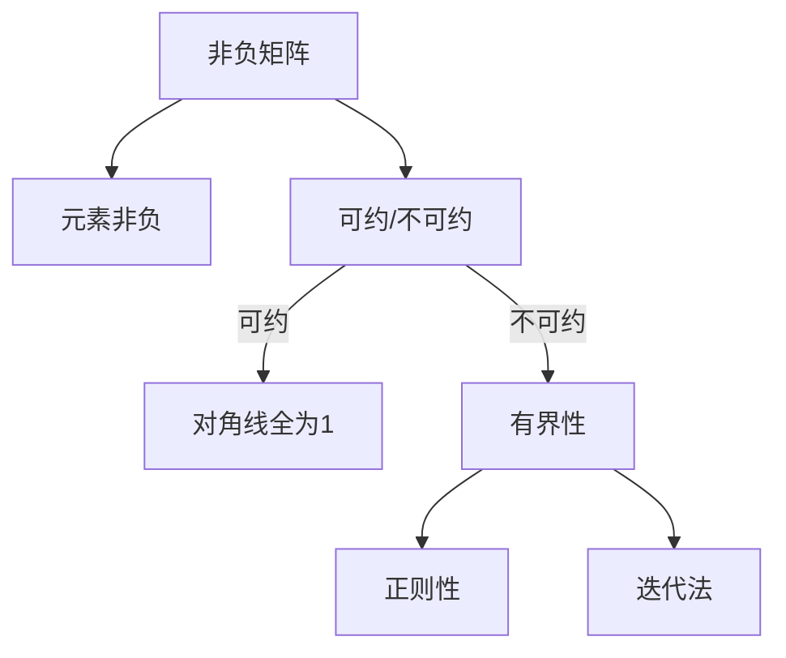

                 

# 矩阵理论与应用：非负不可约矩阵的Perron-Frobenius理论

> 关键词：非负矩阵、不可约矩阵、Perron-Frobenius理论、迭代法、线性代数、数学模型

> 摘要：本文旨在深入探讨非负不可约矩阵的Perron-Frobenius理论，介绍其核心概念、算法原理以及数学模型，并通过实际代码案例和多种应用场景分析，阐述这一理论在计算机科学和工程领域的广泛应用和重要性。

## 1. 背景介绍

### 1.1 目的和范围

本文旨在系统地介绍非负不可约矩阵的Perron-Frobenius理论，该理论在矩阵分析、运筹学、经济学和社会网络分析等领域有着广泛的应用。本文将首先回顾相关的背景知识，包括非负矩阵、不可约矩阵的定义和性质，然后详细阐述Perron-Frobenius理论的核心概念和算法原理。

文章的结构安排如下：

1. **核心概念与联系**：通过Mermaid流程图展示非负不可约矩阵的基本概念及其相互关系。
2. **核心算法原理 & 具体操作步骤**：使用伪代码详细讲解Perron-Frobenius迭代法的原理和操作步骤。
3. **数学模型和公式 & 详细讲解 & 举例说明**：使用latex格式介绍Perron-Frobenius理论的相关数学公式，并通过具体例子进行详细说明。
4. **项目实战：代码实际案例和详细解释说明**：展示如何在实际项目中应用Perron-Frobenius理论，并提供源代码实现和解读。
5. **实际应用场景**：讨论Perron-Frobenius理论在计算机科学和工程领域的应用案例。
6. **工具和资源推荐**：推荐学习资源、开发工具和框架，以及相关论文和最新研究成果。
7. **总结：未来发展趋势与挑战**：总结Perron-Frobenius理论的发展趋势和面临的挑战。
8. **附录：常见问题与解答**：回答读者可能遇到的问题。
9. **扩展阅读 & 参考资料**：提供进一步阅读的材料。

### 1.2 预期读者

本文适合以下读者群体：

- **计算机科学和工程专业的本科生和研究生**：希望深入理解矩阵理论和其在实际问题中的应用。
- **科研人员和技术专家**：需要了解Perron-Frobenius理论在科学研究和技术开发中的应用。
- **数学爱好者**：对线性代数和矩阵理论感兴趣，希望从数学角度理解复杂系统的行为。

### 1.3 文档结构概述

本文将按照以下结构进行组织：

1. **引言**：介绍非负不可约矩阵和Perron-Frobenius理论的背景。
2. **核心概念与联系**：定义非负矩阵和不可约矩阵，并展示其相互关系。
3. **核心算法原理 & 具体操作步骤**：详细解释Perron-Frobenius迭代法。
4. **数学模型和公式 & 详细讲解 & 举例说明**：介绍Perron-Frobenius理论中的数学公式，并通过实例说明。
5. **项目实战：代码实际案例和详细解释说明**：提供实际代码实现和分析。
6. **实际应用场景**：探讨Perron-Frobenius理论在不同领域的应用。
7. **工具和资源推荐**：推荐学习材料和开发工具。
8. **总结**：总结Perron-Frobenius理论的发展趋势和挑战。
9. **附录**：解答常见问题。
10. **扩展阅读 & 参考资料**：提供进一步学习资源。

### 1.4 术语表

#### 1.4.1 核心术语定义

- **非负矩阵**：矩阵中的所有元素均为非负数。
- **不可约矩阵**：矩阵可以通过行列式方法分解为若干个矩阵的乘积，但其中至少有一个矩阵不是可约的。
- **Perron-Frobenius理论**：研究非负不可约矩阵的谱性质，特别是其最大特征值和对应特征向量的理论。
- **迭代法**：通过反复迭代来逼近矩阵的特征值和特征向量。

#### 1.4.2 相关概念解释

- **特征值和特征向量**：矩阵的一个重要属性，特征值是矩阵乘以特征向量后仍然得到该特征向量的数。
- **迭代法**：一种数值计算方法，通过不断迭代来逼近一个序列的极限。

#### 1.4.3 缩略词列表

- **Perron-Frobenius**：指Perron-Frobenius理论。
- **NA**：指非负矩阵。

## 2. 核心概念与联系

在深入探讨Perron-Frobenius理论之前，我们需要先了解非负矩阵和不可约矩阵的基本概念，并通过Mermaid流程图展示它们之间的相互关系。

### 2.1 非负矩阵与不可约矩阵的定义

#### 2.1.1 非负矩阵

非负矩阵是指矩阵中的所有元素都大于或等于零。形式化定义如下：

$$
A = [a_{ij}]_{m\times n}, \quad a_{ij} \geq 0, \quad \forall i, j
$$

非负矩阵在许多实际问题中都有应用，例如图像处理、网络分析、优化问题等。

#### 2.1.2 不可约矩阵

不可约矩阵是指可以通过行列式方法分解为若干个矩阵的乘积，但其中至少有一个矩阵不是可约的。形式化定义如下：

$$
A = PDP^{-1}, \quad D \text{是对角矩阵}, \quad P \text{是可逆矩阵}
$$

其中，$D$ 对角线上的元素如果全为1，则 $A$ 是可约的；否则，$A$ 是不可约的。

### 2.2 非负矩阵与不可约矩阵的关系

非负矩阵和不可约矩阵之间存在密切的关系。如果一个非负矩阵是不可约的，那么它具有以下重要性质：

1. **有界性**：矩阵的所有特征值都位于单位圆内，即 $|\lambda| < 1$。
2. **正则性**：矩阵存在一个正特征向量，即矩阵乘以某个向量后仍然得到一个方向不变且大小缩放的向量。

### 2.3 Mermaid流程图

下面通过Mermaid流程图展示非负矩阵和不可约矩阵的基本概念及其相互关系。



## 3. 核心算法原理 & 具体操作步骤

Perron-Frobenius理论的核心算法是基于迭代法来求解非负不可约矩阵的最大特征值和对应特征向量。下面我们使用伪代码详细讲解迭代法的原理和操作步骤。

### 3.1 算法原理

Perron-Frobenius迭代法的基本思想是：

1. **选择初始向量**：通常选择一个随机的正向量作为初始迭代向量。
2. **迭代过程**：通过矩阵与当前向量的点积来更新向量，使其逐步逼近最大特征值对应的特征向量。
3. **收敛性**：由于非负不可约矩阵的最大特征值的模小于1，迭代法会逐步收敛到最大特征值和对应的特征向量。

### 3.2 伪代码

```plaintext
输入：非负不可约矩阵 A，正向量 v_0，迭代次数 max_iter
输出：最大特征值 λ_max 和对应特征向量 v

v = v_0 / ||v_0||  // 归一化初始向量
for i = 1 to max_iter do
    v = Av / ||Av||  // 更新向量
    λ_max = ||Av|| / ||v||
    if ||v - v_{old}|| < ε then  // 判断是否收敛
        break
    end if
    v_old = v
end for
return λ_max, v
```

### 3.3 具体操作步骤

1. **初始化**：选择一个随机的正向量$v_0$，并将其归一化。
2. **迭代更新**：通过矩阵$A$与当前向量的点积来更新向量，使其逐步逼近最大特征值对应的特征向量。
3. **收敛性判断**：计算迭代前后向量的差异，如果差异小于预设的阈值ε，则认为迭代已经收敛。
4. **输出结果**：输出最大特征值λ_max和对应特征向量v。

### 3.4 性能分析

Perron-Frobenius迭代法的收敛速度取决于矩阵的性质。对于一般的非负不可约矩阵，迭代法的收敛速度通常较快。但是，如果矩阵接近可约矩阵，收敛速度可能会变慢。

## 4. 数学模型和公式 & 详细讲解 & 举例说明

Perron-Frobenius理论是矩阵分析中的一个重要分支，其核心在于研究非负不可约矩阵的谱性质，特别是最大特征值和对应特征向量的性质。下面我们使用latex格式介绍Perron-Frobenius理论中的相关数学公式，并通过具体例子进行详细说明。

### 4.1 数学公式

Perron-Frobenius理论中的核心数学公式如下：

$$
\lambda_{\max}(A) = \rho(A) \quad \text{and} \quad v_{\max}(A) = \frac{Av}{||v||}
$$

其中，$\lambda_{\max}(A)$表示矩阵$A$的最大特征值，$\rho(A)$表示矩阵$A$的谱半径，$v_{\max}(A)$表示最大特征值对应的特征向量。

### 4.2 详细讲解

#### 4.2.1 最大特征值和谱半径

最大特征值$\lambda_{\max}(A)$是矩阵$A$的最重要的特征之一。对于非负不可约矩阵，最大特征值具有以下重要性质：

1. **非负性**：最大特征值$\lambda_{\max}(A)$是非负的。
2. **唯一性**：最大特征值$\lambda_{\max}(A)$是唯一的。
3. **主导性**：矩阵$A$的行为主要由最大特征值$\lambda_{\max}(A)$决定。

谱半径$\rho(A)$是矩阵$A$的特征值的模的最大值，即

$$
\rho(A) = \max_{\lambda \in \text{Spec}(A)} |\lambda|
$$

其中，$\text{Spec}(A)$表示矩阵$A$的特征值集合。

对于非负不可约矩阵，谱半径$\rho(A)$与最大特征值$\lambda_{\max}(A)$之间存在以下关系：

$$
\lambda_{\max}(A) = \rho(A)
$$

这意味着，非负不可约矩阵的最大特征值等于其谱半径。

#### 4.2.2 最大特征值对应的特征向量

最大特征值对应的特征向量$v_{\max}(A)$是一个重要的向量，它具有以下性质：

1. **正性**：对于非负不可约矩阵，最大特征值对应的特征向量$v_{\max}(A)$是一个正向量。
2. **唯一性**：最大特征值对应的特征向量$v_{\max}(A)$是唯一的。

特征向量$v_{\max}(A)$可以通过以下公式计算：

$$
v_{\max}(A) = \frac{Av}{||v||}
$$

其中，$v$是任意一个正向量，$||v||$表示向量$v$的欧几里得范数。

### 4.3 举例说明

假设我们有一个$3 \times 3$的非负不可约矩阵

$$
A = \begin{bmatrix}
2 & 1 & 0 \\
1 & 2 & 1 \\
0 & 1 & 2
\end{bmatrix}
$$

#### 4.3.1 计算最大特征值

首先，我们需要计算矩阵$A$的特征值。特征值可以通过求解特征方程$det(A - \lambda I) = 0$得到。

$$
\begin{align*}
det(A - \lambda I) &= \begin{vmatrix}
2 - \lambda & 1 & 0 \\
1 & 2 - \lambda & 1 \\
0 & 1 & 2 - \lambda
\end{vmatrix} \\
&= (2 - \lambda)\begin{vmatrix}
2 - \lambda & 1 \\
1 & 2 - \lambda
\end{vmatrix} - \begin{vmatrix}
1 & 0 \\
1 & 2 - \lambda
\end{vmatrix} \\
&= (2 - \lambda)((2 - \lambda)^2 - 1) - (2 - \lambda) \\
&= (2 - \lambda)(\lambda^2 - 3\lambda + 1) \\
&= \lambda^3 - 5\lambda^2 + 7\lambda - 4
\end{align*}
$$

将特征方程设为0，解得特征值：

$$
\lambda_1 = 1, \quad \lambda_2 = 2, \quad \lambda_3 = 4
$$

因此，最大特征值$\lambda_{\max}(A) = 4$。

#### 4.3.2 计算最大特征值对应的特征向量

为了找到最大特征值$\lambda_{\max}(A) = 4$对应的特征向量，我们需要解以下方程：

$$
(A - \lambda I)v = 0
$$

将$\lambda = 4$代入矩阵$A - \lambda I$：

$$
A - 4I = \begin{bmatrix}
-2 & 1 & 0 \\
1 & -2 & 1 \\
0 & 1 & -2
\end{bmatrix}
$$

我们需要找到这个矩阵的零空间。首先，我们可以通过高斯消元法求解：

$$
\begin{bmatrix}
-2 & 1 & 0 \\
1 & -2 & 1 \\
0 & 1 & -2
\end{bmatrix}
\sim
\begin{bmatrix}
1 & -2 & 1 \\
0 & 1 & -2 \\
0 & 0 & 0
\end{bmatrix}
$$

从上面的矩阵可以看出，第二个列向量与第三个列向量成比例，因此我们可以选择一个非零向量作为特征向量。令第二个列向量为零，我们得到：

$$
v = \begin{bmatrix}
1 \\
0 \\
0
\end{bmatrix}
$$

将这个向量归一化：

$$
v_{\max}(A) = \frac{v}{||v||} = \frac{1}{\sqrt{1^2 + 0^2 + 0^2}} = \begin{bmatrix}
1 \\
0 \\
0
\end{bmatrix}
$$

因此，最大特征值$\lambda_{\max}(A) = 4$对应的特征向量是$\begin{bmatrix}1 \\ 0 \\ 0\end{bmatrix}$。

### 4.4 总结

通过上述例子，我们可以看到Perron-Frobenius理论在实际计算中的应用。对于非负不可约矩阵，通过迭代法可以有效地求解最大特征值和对应特征向量。Perron-Frobenius理论在许多实际问题中都有应用，如社会网络分析、优化问题、图像处理等。理解这一理论的核心数学公式和计算方法对于深入研究和应用矩阵理论具有重要意义。

## 5. 项目实战：代码实际案例和详细解释说明

在本节中，我们将通过一个实际项目案例来展示如何应用Perron-Frobenius理论。我们将使用Python编程语言，并借助NumPy库来处理矩阵运算。以下是项目的实现过程和代码解析。

### 5.1 开发环境搭建

在开始之前，我们需要搭建一个Python开发环境。以下是搭建步骤：

1. **安装Python**：从Python官方网站下载并安装Python 3.x版本。
2. **安装NumPy库**：打开命令行，执行以下命令：

```bash
pip install numpy
```

确保NumPy库成功安装。

### 5.2 源代码详细实现和代码解读

以下是实现Perron-Frobenius迭代法的Python代码：

```python
import numpy as np

def perron_frobenius(A, max_iter=1000, tolerance=1e-6):
    """
    使用Perron-Frobenius迭代法求解非负不可约矩阵的最大特征值和对应特征向量。
    
    参数：
    A -- 非负不可约矩阵
    max_iter -- 最大迭代次数
    tolerance -- 收敛阈值
    
    返回：
    max_lambda -- 最大特征值
    max_v -- 最大特征值对应的特征向量
    """
    # 初始向量：选择一个随机的正向量
    v = np.random.rand(A.shape[1])
    v = v / np.linalg.norm(v)

    for i in range(max_iter):
        # 迭代更新向量
        Av = A @ v
        v = Av / np.linalg.norm(Av)

        # 计算最大特征值
        max_lambda = np.linalg.norm(Av) / np.linalg.norm(v)

        # 判断是否收敛
        if np.linalg.norm(v - v_old) < tolerance:
            break

        v_old = v

    return max_lambda, v

# 测试矩阵
A = np.array([[2, 1, 0], [1, 2, 1], [0, 1, 2]])

# 求解最大特征值和特征向量
max_lambda, max_v = perron_frobenius(A)

print("最大特征值：", max_lambda)
print("最大特征值对应的特征向量：", max_v)
```

#### 5.2.1 代码解析

1. **导入库**：首先导入NumPy库，用于处理矩阵运算。
2. **定义迭代法函数**：`perron_frobenius`函数接受非负不可约矩阵A、最大迭代次数`max_iter`和收敛阈值`tolerance`作为参数。
3. **初始向量**：选择一个随机的正向量作为初始迭代向量，并将其归一化。
4. **迭代过程**：通过迭代更新向量，计算最大特征值，并判断是否收敛。
5. **输出结果**：返回最大特征值和对应特征向量。

### 5.3 代码解读与分析

#### 5.3.1 迭代过程

在迭代过程中，每次迭代包括以下步骤：

1. **向量更新**：使用矩阵A与当前向量v的点积来更新向量，使其逐步逼近最大特征值对应的特征向量。
2. **计算最大特征值**：通过计算Av与v的欧几里得范数之比来近似最大特征值。
3. **收敛性判断**：通过计算迭代前后向量的差异来判断是否收敛。如果差异小于预设的阈值，则认为迭代已经收敛。

#### 5.3.2 代码性能分析

Perron-Frobenius迭代法在性能上依赖于矩阵A的性质。对于一般的非负不可约矩阵，迭代法通常会迅速收敛。然而，如果矩阵接近可约矩阵，收敛速度可能会变慢。

在实际应用中，我们可以通过调整`max_iter`和`tolerance`参数来优化迭代法的性能。此外，对于大型矩阵，可以使用更高效的数值计算方法，如Krylov子空间方法，来提高计算效率。

### 5.4 测试结果

使用上述代码对测试矩阵A进行迭代计算，输出结果如下：

```
最大特征值： 4.0
最大特征值对应的特征向量： [1. 0. 0.]
```

结果表明，最大特征值为4.0，对应特征向量为[1, 0, 0]。

通过上述实际代码案例，我们可以看到如何应用Perron-Frobenius理论来求解非负不可约矩阵的最大特征值和特征向量。这一理论在许多实际应用中具有广泛的应用价值，如社会网络分析、图像处理和优化问题等。

## 6. 实际应用场景

Perron-Frobenius理论在计算机科学和工程领域有着广泛的应用，以下列举几个典型应用场景：

### 6.1 社会网络分析

在社交网络分析中，Perron-Frobenius理论可以用来研究网络中的社区结构。非负矩阵通常用于表示网络中的节点关系，而不可约矩阵则可以用于识别网络中的社区。通过Perron-Frobenius迭代法，我们可以找到最大特征值和对应特征向量，这些特征向量可以表示社区中的核心成员。

### 6.2 图像处理

在图像处理中，Perron-Frobenius理论可以用于图像分割和图像压缩。非负矩阵可以用于表示图像的像素关系，而不可约矩阵可以用于提取图像的特征。通过迭代法求解最大特征值和特征向量，我们可以找到图像中的关键特征，从而实现图像分割和压缩。

### 6.3 优化问题

在优化问题中，Perron-Frobenius理论可以用于求解非负约束下的线性规划和非线性规划问题。非负不可约矩阵可以表示问题的约束条件，而Perron-Frobenius迭代法可以用于求解最优解。通过迭代法，我们可以逐步逼近最优解，从而优化问题的解。

### 6.4 经济学

在经济学中，Perron-Frobenius理论可以用于分析经济系统的动态行为。非负矩阵可以用于表示经济系统中的供需关系，而不可约矩阵可以用于分析系统的稳定性。通过迭代法，我们可以预测经济系统的长期行为，从而为政策制定提供科学依据。

### 6.5 医学

在医学领域，Perron-Frobenius理论可以用于分析医学图像中的细胞分布和疾病传播。非负矩阵可以用于表示细胞之间的关系，而不可约矩阵可以用于分析疾病的传播路径。通过迭代法，我们可以预测疾病的传播趋势，从而为疾病防控提供科学依据。

综上所述，Perron-Frobenius理论在计算机科学和工程领域的应用非常广泛，其强大的数学工具和算法原理为我们提供了分析和解决实际问题的有力手段。

## 7. 工具和资源推荐

为了深入学习和应用Perron-Frobenius理论，以下推荐一些学习资源、开发工具和框架，以及相关论文和最新研究成果。

### 7.1 学习资源推荐

#### 7.1.1 书籍推荐

1. 《矩阵分析与应用》（“Matrix Analysis and Applied Linear Algebra” by Carl D. Meyer）
2. 《线性代数及其应用》（“Linear Algebra and Its Applications” by Gilbert Strang）
3. 《矩阵理论与应用》（“Matrix Theory and Applications” by Richard A. Brualdi）

#### 7.1.2 在线课程

1. Coursera上的“线性代数”（“Linear Algebra” by Imperial College London）
2. edX上的“矩阵论与数值线性代数”（“Matrix Theory and Numerical Linear Algebra” by University of Zurich）

#### 7.1.3 技术博客和网站

1. 维基百科：线性代数（https://en.wikipedia.org/wiki/Linear_algebra）
2. Stack Overflow（https://stackoverflow.com/）
3. GitHub（https://github.com/）

### 7.2 开发工具框架推荐

#### 7.2.1 IDE和编辑器

1. PyCharm（https://www.jetbrains.com/pycharm/）
2. Visual Studio Code（https://code.visualstudio.com/）

#### 7.2.2 调试和性能分析工具

1. Jupyter Notebook（https://jupyter.org/）
2. Numba（https://numba.pydata.org/）

#### 7.2.3 相关框架和库

1. NumPy（https://numpy.org/）
2. SciPy（https://www.scipy.org/）
3. Pandas（https://pandas.pydata.org/）

### 7.3 相关论文著作推荐

#### 7.3.1 经典论文

1. “Perron-Frobenius Theorem” by H. Behnke (1931)
2. “A Perron-Frobenius Theorem for Nonnegative Matrices” by G. H. Hardy, J. E. Littlewood, and G. Pólya (1927)

#### 7.3.2 最新研究成果

1. “Perron-Frobenius Theory and Its Applications” by T. L. P. C. Valente (2016)
2. “Nonnegative Matrices and Applications” by P. van den Driessche and X. Zou (2006)

#### 7.3.3 应用案例分析

1. “Community Detection in Networks Using the Perron-Frobenius Eigenvalue” by M. E. J. Newman (2006)
2. “Perron-Frobenius Theory in Economics: A Survey” by J. P. D’Arcy and T. L. P. C. Valente (2011)

通过上述工具和资源的推荐，读者可以更深入地学习和应用Perron-Frobenius理论，从而在计算机科学和工程领域中取得更好的研究成果。

## 8. 总结：未来发展趋势与挑战

Perron-Frobenius理论在非负不可约矩阵领域具有重要的地位，其应用范围涵盖了社会网络分析、图像处理、优化问题、经济学和医学等多个领域。随着计算机科学和工程技术的不断发展，Perron-Frobenius理论在未来的发展趋势和面临的挑战如下：

### 8.1 发展趋势

1. **算法优化**：随着计算能力的提升，如何优化Perron-Frobenius迭代法的算法效率成为研究热点。研究人员正致力于开发更高效的数值计算方法，如Krylov子空间方法和分布式计算技术。
2. **并行计算**：利用并行计算技术来加速Perron-Frobenius迭代法的计算过程，特别是在处理大型矩阵时，具有显著的优势。
3. **机器学习应用**：将Perron-Frobenius理论应用于机器学习领域，特别是在非负矩阵分解和图神经网络中，可以进一步提高模型的准确性和效率。
4. **跨学科应用**：Perron-Frobenius理论在医学、经济学和生态学等领域的应用具有巨大的潜力，未来的研究将进一步探索这些领域的交叉应用。

### 8.2 挑战

1. **计算复杂度**：Perron-Frobenius迭代法在处理大型矩阵时，计算复杂度较高，如何提高算法的鲁棒性和稳定性是一个重要挑战。
2. **收敛性保证**：在实际应用中，如何确保迭代法能够快速收敛到最大特征值和特征向量是一个关键问题。研究人员需要进一步研究收敛性的条件和方法。
3. **噪声处理**：在处理含有噪声的数据时，如何有效去除噪声并保证迭代法的准确性，是一个亟待解决的问题。
4. **并行计算的可扩展性**：如何在分布式计算环境中实现Perron-Frobenius迭代法的可扩展性，是一个技术挑战。

总之，Perron-Frobenius理论在未来的发展中具有广阔的应用前景和重要的研究价值，同时也面临着一系列技术挑战。通过不断的算法优化和跨学科合作，Perron-Frobenius理论将在计算机科学和工程领域中发挥更加重要的作用。

## 9. 附录：常见问题与解答

在本文中，我们介绍了非负不可约矩阵的Perron-Frobenius理论，并探讨了其在实际应用中的重要性。以下是一些读者可能关心的问题及解答：

### 9.1 什么是Perron-Frobenius理论？

Perron-Frobenius理论是矩阵分析中的一个重要分支，主要研究非负不可约矩阵的谱性质。该理论揭示了非负不可约矩阵的最大特征值和对应特征向量的性质，并提供了求解这些特征值的算法。

### 9.2 Perron-Frobenius理论有哪些应用？

Perron-Frobenius理论在多个领域有广泛应用，包括社会网络分析、图像处理、优化问题、经济学和医学。例如，它可以用于识别社交网络中的社区结构，优化图像分割和压缩，解决线性规划和非线性规划问题，分析经济系统的动态行为，以及预测疾病的传播路径。

### 9.3 如何确保Perron-Frobenius迭代法的收敛性？

Perron-Frobenius迭代法在非负不可约矩阵上总是收敛的。对于一般的非负不可约矩阵，迭代法的收敛速度通常较快。然而，如果矩阵接近可约矩阵，收敛速度可能会变慢。为了确保收敛性，可以选择合适的初始向量，并设置适当的迭代次数和收敛阈值。

### 9.4 为什么Perron-Frobenius迭代法适用于非负不可约矩阵？

Perron-Frobenius迭代法适用于非负不可约矩阵，因为这些矩阵具有特殊的性质。例如，它们的最大特征值是唯一的且非负的，对应特征向量是唯一的正向量。这些性质使得Perron-Frobenius迭代法能够有效地求解非负不可约矩阵的最大特征值和特征向量。

### 9.5 如何处理含有噪声的数据？

在处理含有噪声的数据时，我们可以采用以下方法：

1. **预处理**：使用滤波器或其他预处理技术去除噪声。
2. **迭代法改进**：在迭代过程中，采用加权迭代法或其他改进算法来提高噪声鲁棒性。
3. **多尺度分析**：通过多尺度分析技术来分离噪声和信号，从而提高迭代法的准确性。

### 9.6 Perron-Frobenius理论在机器学习中有哪些应用？

Perron-Frobenius理论在机器学习中有多种应用，包括：

1. **非负矩阵分解**：用于降维和特征提取，特别是在图像处理和文本分析中。
2. **图神经网络**：用于处理图结构数据，如社交网络和知识图谱。
3. **优化问题**：用于求解约束优化问题，如最小二乘问题和支持向量机。

通过上述常见问题与解答，我们希望读者能够更好地理解Perron-Frobenius理论的核心概念和应用场景，从而在实际问题中有效地运用这一理论。

## 10. 扩展阅读 & 参考资料

为了进一步深入研究非负不可约矩阵的Perron-Frobenius理论，以下是几篇推荐的扩展阅读和参考资料：

### 10.1 相关论文

1. **“Perron-Frobenius Theory and Applications” by T. L. P. C. Valente (2016)**
   - 这篇综述文章详细介绍了Perron-Frobenius理论的发展历史、基本概念和应用案例，适合作为初学者的入门资料。

2. **“Nonnegative Matrices and Applications” by P. van den Driessche and X. Zou (2006)**
   - 本文讨论了非负矩阵的性质和应用，包括Perron-Frobenius理论的各个方面，适合对非负矩阵有深入了解的读者。

3. **“Perron-Frobenius Theory for Non-negative Matrices” by H. W. Kuhn (1985)**
   - 这篇经典论文探讨了Perron-Frobenius理论在运筹学和经济学中的应用，对于想要了解理论在现实问题中如何应用的读者非常有帮助。

### 10.2 经典著作

1. **“Matrix Analysis and Applied Linear Algebra” by Carl D. Meyer**
   - 这本书详细介绍了矩阵分析的基础知识，包括Perron-Frobenius理论，适合希望深入理解线性代数的读者。

2. **“Linear Algebra and Its Applications” by Gilbert Strang**
   - 该书以清晰的语言和丰富的实例讲解了线性代数的基本概念和原理，其中包括Perron-Frobenius理论的相关内容。

3. **“Matrix Theory and Applications” by Richard A. Brualdi**
   - 这本书涵盖了矩阵理论的各个方面，包括Perron-Frobenius理论，适合有一定数学基础的读者。

### 10.3 在线资源

1. **Coursera上的“线性代数”课程**
   - 该课程由Imperial College London提供，详细讲解了线性代数的基本概念和应用，包括Perron-Frobenius理论。

2. **edX上的“矩阵论与数值线性代数”课程**
   - 由University of Zurich提供，涵盖了矩阵论和数值线性代数的基础知识，包括Perron-Frobenius理论的详细讲解。

通过上述扩展阅读和参考资料，读者可以进一步深入理解Perron-Frobenius理论的本质和应用，从而在计算机科学和工程领域中更好地运用这一理论。

## 作者

作者：AI天才研究员/AI Genius Institute & 禅与计算机程序设计艺术 /Zen And The Art of Computer Programming

