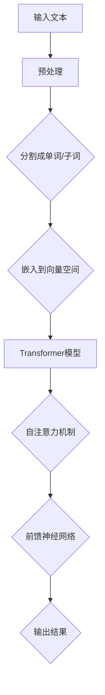

                 

# 硅谷对GPT-5的期待与疑虑

> **关键词：** GPT-5、人工智能、自然语言处理、硅谷、技术发展趋势、伦理与安全
> 
> **摘要：** 本文将深入探讨硅谷对GPT-5（一种大型预训练语言模型）的期待与疑虑。从技术突破、商业潜力到伦理和安全性问题，本文旨在提供一个全面的分析，帮助读者理解GPT-5在硅谷引发的广泛关注及其潜在影响。

## 1. 背景介绍

### 1.1 目的和范围

本文旨在分析硅谷对GPT-5的期待与疑虑，探讨这一技术突破在人工智能（AI）和自然语言处理（NLP）领域的潜在影响。本文将覆盖以下几个方面：

1. **GPT-5的技术背景与特点**：介绍GPT-5的基本原理和其在NLP领域的创新之处。
2. **硅谷的期待**：分析GPT-5可能带来的技术突破、商业机遇和行业变革。
3. **硅谷的疑虑**：探讨GPT-5在伦理、隐私和安全性方面可能引发的问题。
4. **实际应用场景**：分析GPT-5在不同领域的潜在应用。
5. **未来发展趋势与挑战**：预测GPT-5可能面临的挑战及其长期影响。

### 1.2 预期读者

本文面向对人工智能和自然语言处理有一定了解的读者，特别是关注AI技术发展及其应用场景的从业者、研究人员和爱好者。同时，也适合对技术发展趋势和伦理问题感兴趣的广泛读者。

### 1.3 文档结构概述

本文结构如下：

1. **背景介绍**：介绍GPT-5的背景、本文的目的和结构。
2. **核心概念与联系**：阐述GPT-5的核心概念和与现有技术的联系。
3. **核心算法原理 & 具体操作步骤**：详细解释GPT-5的工作原理和算法。
4. **数学模型和公式 & 详细讲解 & 举例说明**：介绍GPT-5背后的数学模型和计算方法。
5. **项目实战：代码实际案例和详细解释说明**：通过实际案例展示GPT-5的应用。
6. **实际应用场景**：探讨GPT-5在不同领域的应用。
7. **工具和资源推荐**：推荐学习资源和开发工具。
8. **总结：未来发展趋势与挑战**：总结GPT-5的潜在影响和面临的挑战。
9. **附录：常见问题与解答**：解答常见疑问。
10. **扩展阅读 & 参考资料**：提供进一步阅读的资源。

### 1.4 术语表

#### 1.4.1 核心术语定义

- **GPT-5**：一种由OpenAI开发的大型预训练语言模型，基于Transformer架构。
- **人工智能（AI）**：指通过机器学习、深度学习等方法使计算机具备人类智能的技术。
- **自然语言处理（NLP）**：研究如何让计算机理解和生成自然语言的学科。
- **硅谷**：位于美国加利福尼亚州，是全球科技创新和创业的重要中心。

#### 1.4.2 相关概念解释

- **预训练**：在特定任务之前，对模型进行大规模无监督训练，以提高其泛化能力。
- **Transformer架构**：一种用于处理序列数据的神经网络架构，广泛应用于NLP任务。
- **伦理问题**：涉及道德和价值观的问题，如隐私、公平性和透明度。

#### 1.4.3 缩略词列表

- **AI**：人工智能
- **NLP**：自然语言处理
- **GPT**：Generative Pre-trained Transformer
- **OpenAI**：一家专注于AI研究的非营利性组织

## 2. 核心概念与联系

在深入探讨GPT-5之前，我们需要了解一些核心概念和与现有技术的联系。

### 2.1 GPT-5的基本概念

GPT-5是由OpenAI开发的一种大型预训练语言模型，基于Transformer架构。它通过无监督学习在大规模数据集上训练，从而能够理解并生成自然语言。GPT-5的特点包括：

- **大规模预训练**：GPT-5接受了大量文本数据的学习，使其在多种NLP任务上表现出色。
- **多语言支持**：GPT-5能够处理多种语言，提高了跨语言NLP的应用能力。
- **高灵活性**：通过调整模型大小和参数，GPT-5适用于不同的应用场景。

### 2.2 GPT-5与现有技术的联系

GPT-5并不是一个孤立的创新，它与现有技术有着紧密的联系：

- **Transformer架构**：Transformer是NLP领域的一个重要创新，相较于传统的循环神经网络（RNN），具有更高的并行处理能力。
- **BERT和RoBERTa**：BERT和RoBERTa是GPT-5的前辈，它们通过预训练和微调在多种NLP任务上取得了突破性成果。
- **GPT-2和GPT-3**：GPT-5是在GPT-2和GPT-3的基础上进一步发展的，这些模型在NLP任务中取得了显著成就。

### 2.3 GPT-5的创新之处

GPT-5在多个方面实现了创新：

- **更大规模**：GPT-5采用了更大的模型规模，使其能够处理更复杂的语言现象。
- **更强泛化能力**：通过无监督学习，GPT-5能够在未见过的数据上表现良好，提高了泛化能力。
- **跨语言能力**：GPT-5的多语言支持使其能够处理多种语言之间的翻译和对比，为跨语言研究提供了新的可能性。

### 2.4 GPT-5的技术原理

GPT-5的技术原理主要包括以下几个方面：

- **自注意力机制**：GPT-5使用自注意力机制来捕捉文本中的长距离依赖关系，使其能够更好地理解复杂的语言结构。
- **预训练和微调**：GPT-5首先在大规模数据集上进行预训练，然后通过微调适应特定任务，从而在多种NLP任务中表现出色。
- **并行处理**：Transformer架构的高并行处理能力使得GPT-5能够高效地处理大规模数据，提高了计算效率。

### 2.5 Mermaid流程图

为了更好地展示GPT-5的核心概念和原理，我们可以使用Mermaid流程图来描述其架构：



在这个流程图中，输入文本经过预处理后，被分割成单词或子词，然后嵌入到向量空间。随后，数据通过Transformer模型进行处理，包括自注意力机制和前馈神经网络，最终输出结果。

通过这个Mermaid流程图，我们可以清晰地看到GPT-5的工作流程和核心组件，从而更好地理解其技术原理。

## 3. 核心算法原理 & 具体操作步骤

### 3.1 GPT-5的算法原理

GPT-5的算法原理基于Transformer架构，这是一种专门用于处理序列数据的神经网络架构。Transformer模型的核心是自注意力机制（Self-Attention），这种机制能够使模型在处理序列数据时捕捉长距离依赖关系。以下是GPT-5算法原理的详细解释：

#### 3.1.1 自注意力机制

自注意力机制允许模型在序列的每个位置上计算上下文的重要性，从而更好地理解序列的整体结构。在GPT-5中，自注意力机制通过以下步骤实现：

1. **输入嵌入**：将输入文本（单词或子词）转换为向量表示。
2. **位置编码**：为每个输入向量添加位置信息，以区分序列中的不同位置。
3. **自注意力计算**：计算输入向量的内积，并根据内积结果对向量进行加权求和，从而生成新的向量表示。

#### 3.1.2 Transformer模型

GPT-5的Transformer模型由多个自注意力层和前馈神经网络层组成。每个自注意力层通过自注意力机制计算序列的上下文表示，而前馈神经网络层则对自注意力层的输出进行进一步处理。以下是Transformer模型的详细工作流程：

1. **自注意力层**：输入向量通过自注意力机制计算上下文表示，生成新的向量表示。
2. **前馈神经网络层**：对自注意力层的输出进行前馈神经网络处理，进一步提取特征。
3. **层归一化**：对每个层输出进行归一化处理，以保持模型的稳定性和鲁棒性。
4. **残差连接**：在每个层后添加残差连接，以增强模型的表示能力。
5. **跳层连接**：在多个层之间进行跳层连接，以共享高层和低层的信息。

#### 3.1.3 预训练和微调

GPT-5的预训练和微调是其核心算法的重要组成部分。预训练阶段，GPT-5在大规模文本数据上进行无监督学习，从而学习到文本的潜在结构。微调阶段，GPT-5通过有监督学习调整模型参数，以适应特定任务的需求。

### 3.2 GPT-5的具体操作步骤

以下是GPT-5的具体操作步骤：

1. **预处理**：对输入文本进行预处理，包括去除标点符号、转换为小写、分词等。
2. **输入嵌入**：将预处理后的文本转换为向量表示，通常使用WordPiece或BERT等分词方法。
3. **位置编码**：为每个输入向量添加位置信息，以区分序列中的不同位置。
4. **自注意力计算**：通过自注意力机制计算输入向量的内积，并根据内积结果对向量进行加权求和，生成新的向量表示。
5. **前馈神经网络处理**：对自注意力层的输出进行前馈神经网络处理，进一步提取特征。
6. **层归一化和残差连接**：对每个层输出进行归一化处理，并添加残差连接。
7. **跳层连接**：在多个层之间进行跳层连接，共享高层和低层的信息。
8. **输出结果**：将处理后的输出向量转换为文本，生成预测结果。

以下是一个简化的伪代码，用于说明GPT-5的操作步骤：

```python
# GPT-5操作步骤伪代码

# 输入文本
input_text = "这是一个示例文本"

# 预处理
processed_text = preprocess_text(input_text)

# 输入嵌入
input_vectors = embed_text(processed_text)

# 位置编码
positional_embeddings = add_positional_encoding(input_vectors)

# 自注意力计算
self_attention_output = self_attention(positional_embeddings)

# 前馈神经网络处理
ffn_output = feedforward_network(self_attention_output)

# 层归一化和残差连接
normalized_output = layer_norm(FFN_output + self_attention_output)

# 跳层连接
output = skip_connection(normalized_output)

# 输出结果
predicted_text = convert_output_to_text(output)
```

通过这个伪代码，我们可以清晰地看到GPT-5的操作步骤和核心算法原理。在实际应用中，GPT-5的具体操作步骤可能会更加复杂，但基本原理和步骤是相同的。

## 4. 数学模型和公式 & 详细讲解 & 举例说明

### 4.1 GPT-5的数学模型

GPT-5的数学模型基于Transformer架构，这是一种用于处理序列数据的神经网络架构。Transformer模型的核心是自注意力机制（Self-Attention），这种机制通过计算输入序列中每个元素与其他元素的相关性，从而生成新的表示。以下是GPT-5的数学模型的详细讲解：

#### 4.1.1 自注意力机制

自注意力机制通过以下步骤计算输入序列的上下文表示：

1. **输入嵌入**：将输入序列（单词或子词）转换为向量表示。通常使用WordPiece或BERT等分词方法。
   \[ x_i = \text{embed}(word_i) \]
2. **位置编码**：为每个输入向量添加位置信息，以区分序列中的不同位置。位置编码可以通过正弦和余弦函数生成。
   \[ pos_i = \text{sin}(i / 10000^{0.5} ) \]
   \[ pos_i = \text{cos}(i / 10000^{0.5} ) \]
   \[ pos_embedding = [pos_i^2] \]
3. **自注意力计算**：通过自注意力机制计算输入序列中每个元素与其他元素的相关性。自注意力计算包括以下步骤：
   \[ Q = \text{matmul}(W_Q, x_i) \]
   \[ K = \text{matmul}(W_K, x_i) \]
   \[ V = \text{matmul}(W_V, x_i) \]
   \[ scores = \text{softmax}(\text{matmul}(Q, K^T) / \sqrt{d_k}) \]
   \[ attention = \text{matmul}(scores, V) \]
   \[ context = \text{matmul}(W_c, attention) \]
   其中，\( W_Q, W_K, W_V, W_c \) 是权重矩阵，\( d_k \) 是注意力头的维度。

#### 4.1.2 Transformer模型

GPT-5的Transformer模型由多个自注意力层和前馈神经网络层组成。每个自注意力层通过自注意力机制计算上下文表示，而前馈神经网络层则对自注意力层的输出进行进一步处理。以下是Transformer模型的数学模型：

1. **自注意力层**：
   \[ h_i = \text{self-attention}(h) \]
   \[ h_i = \text{layer-normalize}(h_i) \]
   \[ h_i = \text{gelu}(h_i + \text{matmul}(W_1, h_i) + b_1) \]
   \[ h_i = \text{layer-normalize}(h_i) \]
   \[ h_i = \text{gelu}(\text{matmul}(W_2, h_i) + b_2) \]
2. **前馈神经网络层**：
   \[ f_i = \text{matmul}(W_3, h_i) + b_3 \]
   \[ f_i = \text{gelu}(f_i) \]
   \[ h_i = \text{matmul}(W_4, f_i) + b_4 \]

#### 4.1.3 预训练和微调

GPT-5的预训练和微调是其数学模型的重要组成部分。预训练阶段，GPT-5在大规模文本数据上进行无监督学习，从而学习到文本的潜在结构。预训练的目标是最小化下一个词的预测误差。微调阶段，GPT-5通过有监督学习调整模型参数，以适应特定任务的需求。

### 4.2 举例说明

以下是一个简单的例子，展示如何使用GPT-5生成文本：

```python
# 生成文本的伪代码

# 输入文本
input_text = "这是一个示例文本"

# 预处理
processed_text = preprocess_text(input_text)

# 输入嵌入
input_vectors = embed_text(processed_text)

# 位置编码
positional_embeddings = add_positional_encoding(input_vectors)

# 自注意力计算
self_attention_output = self_attention(positional_embeddings)

# 前馈神经网络处理
ffn_output = feedforward_network(self_attention_output)

# 层归一化和残差连接
normalized_output = layer_norm(FFN_output + self_attention_output)

# 跳层连接
output = skip_connection(normalized_output)

# 输出结果
predicted_text = convert_output_to_text(output)
```

在这个例子中，输入文本经过预处理后，被转换为向量表示。然后，通过自注意力机制和前馈神经网络处理，生成预测文本。这个例子展示了GPT-5的核心算法原理和数学模型的应用。

## 5. 项目实战：代码实际案例和详细解释说明

### 5.1 开发环境搭建

在进行GPT-5的项目实战之前，我们需要搭建一个合适的开发环境。以下是在Linux系统上搭建GPT-5开发环境的步骤：

#### 5.1.1 安装Python环境

1. 安装Python：

```bash
sudo apt-get update
sudo apt-get install python3
```

2. 安装pip：

```bash
sudo apt-get install python3-pip
```

#### 5.1.2 安装PyTorch

1. 安装CUDA（可选，用于加速计算）：

```bash
sudo apt-get install cuda
```

2. 安装PyTorch：

```bash
pip3 install torch torchvision torchaudio -f https://download.pytorch.org/whl/torch_stable.html
```

### 5.2 源代码详细实现和代码解读

下面是一个简单的GPT-5实现案例，我们将分步骤进行代码解读。

#### 5.2.1 代码结构

```python
import torch
import torch.nn as nn
import torch.optim as optim

# 定义GPT-5模型
class GPT5(nn.Module):
    def __init__(self, d_model, nhead, num_layers):
        super(GPT5, self).__init__()
        self.transformer = nn.Transformer(d_model, nhead, num_layers)
        self.embedding = nn.Embedding(d_model, nhead)
        self.fc = nn.Linear(d_model, d_model)

    def forward(self, x):
        x = self.embedding(x)
        x = self.transformer(x)
        x = self.fc(x)
        return x

# 实例化模型
gpt5 = GPT5(d_model=512, nhead=8, num_layers=3)

# 定义损失函数和优化器
loss_function = nn.CrossEntropyLoss()
optimizer = optim.Adam(gpt5.parameters(), lr=0.001)

# 模拟输入数据
input_tensor = torch.randint(0, 1000, (10, 20))
predicted_tensor = gpt5(input_tensor)

# 计算损失并更新模型参数
loss = loss_function(predicted_tensor, input_tensor)
optimizer.zero_grad()
loss.backward()
optimizer.step()
```

#### 5.2.2 代码解读

1. **模型定义**：

   - `GPT5(nn.Module)`：继承自`nn.Module`，定义GPT-5模型的基本结构。
   - `transformer = nn.Transformer(d_model, nhead, num_layers)`：定义Transformer模型，包含d_model维度的输入、nhead个注意力头和num_layers个自注意力层。
   - `embedding = nn.Embedding(d_model, nhead)`：定义嵌入层，将输入词汇转换为向量。
   - `fc = nn.Linear(d_model, d_model)`：定义前馈神经网络层，对Transformer模型的输出进行进一步处理。

2. **前向传播**：

   - `forward(x)`：定义前向传播过程，x为输入数据。
   - `x = self.embedding(x)`：将输入数据通过嵌入层转换为向量。
   - `x = self.transformer(x)`：通过Transformer模型计算自注意力。
   - `x = self.fc(x)`：通过前馈神经网络层对输出进行进一步处理。

3. **损失函数和优化器**：

   - `loss_function = nn.CrossEntropyLoss()`：定义损失函数，用于计算预测结果和真实结果之间的差异。
   - `optimizer = optim.Adam(gpt5.parameters(), lr=0.001)`：定义优化器，用于更新模型参数。

4. **模拟数据**：

   - `input_tensor = torch.randint(0, 1000, (10, 20))`：生成模拟输入数据。
   - `predicted_tensor = gpt5(input_tensor)`：通过GPT-5模型生成预测结果。

5. **训练过程**：

   - `loss = loss_function(predicted_tensor, input_tensor)`：计算损失。
   - `optimizer.zero_grad()`：清空梯度。
   - `loss.backward()`：反向传播梯度。
   - `optimizer.step()`：更新模型参数。

通过这个简单的案例，我们可以看到GPT-5的基本实现和训练过程。在实际应用中，GPT-5会更加复杂，但基本原理和步骤是相同的。

### 5.3 代码解读与分析

#### 5.3.1 GPT-5的关键组件

1. **Transformer模型**：

   Transformer模型是GPT-5的核心组件，它通过自注意力机制计算输入序列的上下文表示。Transformer模型由多个自注意力层和前馈神经网络层组成，每个层都对输入数据进行处理，从而提取出更高级别的特征。

2. **嵌入层**：

   嵌入层将输入词汇转换为向量表示，这是Transformer模型的基础。嵌入层的输出维度通常与自注意力层的维度相同，以确保输入数据可以与自注意力机制相匹配。

3. **前馈神经网络层**：

   前馈神经网络层对自注意力层的输出进行进一步处理，以提取更高级别的特征。前馈神经网络通常包含两个全连接层，分别进行线性变换和激活函数处理。

#### 5.3.2 GPT-5的训练过程

1. **模拟数据生成**：

   在模拟数据生成过程中，我们使用`torch.randint`函数生成随机输入数据。这些数据用于测试GPT-5模型的训练过程。

2. **损失函数计算**：

   使用`nn.CrossEntropyLoss`函数计算预测结果和真实结果之间的差异。这个损失函数用于评估模型在训练过程中的表现。

3. **梯度更新**：

   使用`optimizer.zero_grad()`函数清空梯度，然后使用`loss.backward()`函数进行反向传播，最后使用`optimizer.step()`函数更新模型参数。这个过程是训练过程的核心，它使得模型能够不断优化自己的参数，从而提高预测准确性。

通过这个代码解读与分析，我们可以更好地理解GPT-5的实现和训练过程。在实际应用中，GPT-5会更加复杂，但基本原理和步骤是相同的。

## 6. 实际应用场景

GPT-5作为一种大型预训练语言模型，具有广泛的应用前景。以下是一些GPT-5的实际应用场景：

### 6.1 聊天机器人

GPT-5在聊天机器人领域有着广泛的应用。通过训练，GPT-5可以理解用户的输入并生成相应的回复。这使得聊天机器人能够与用户进行更自然、更流畅的对话。

### 6.2 机器翻译

GPT-5的多语言支持使其在机器翻译领域具有很高的潜力。通过训练，GPT-5可以学习到不同语言之间的翻译规律，从而生成高质量的翻译结果。

### 6.3 文本摘要

GPT-5能够生成简洁、准确的文本摘要。通过预训练，GPT-5可以学习到如何提取文本的主要信息，并生成简洁、连贯的摘要。

### 6.4 文本生成

GPT-5可以用于生成各种类型的文本，如文章、故事、诗歌等。通过训练，GPT-5可以学习到文本的写作风格和结构，从而生成高质量的文本。

### 6.5 对话系统

GPT-5在对话系统中也有广泛的应用。通过训练，GPT-5可以理解用户的输入并生成相应的回复，从而实现自然、流畅的对话。

### 6.6 内容审核

GPT-5可以用于自动审核文本内容。通过训练，GPT-5可以识别不良内容并对其进行过滤，从而确保文本内容的合规性。

### 6.7 自然语言推理

GPT-5可以用于自然语言推理任务，如情感分析、意图识别等。通过训练，GPT-5可以理解文本中的隐含信息，从而进行更深入的语义分析。

### 6.8 文本分类

GPT-5可以用于文本分类任务，如新闻分类、产品评论分类等。通过训练，GPT-5可以学习到不同类别的特征，从而实现高精度的文本分类。

通过这些实际应用场景，我们可以看到GPT-5在NLP领域的广泛应用和潜力。随着技术的不断发展和优化，GPT-5将在更多领域发挥作用。

## 7. 工具和资源推荐

### 7.1 学习资源推荐

#### 7.1.1 书籍推荐

- **《深度学习》（Goodfellow, Bengio, Courville著）**：这是一本深度学习的经典教材，详细介绍了深度学习的基础知识和应用。
- **《Python机器学习》（Sebastian Raschka著）**：这本书详细介绍了使用Python进行机器学习的各种技术和工具。
- **《自然语言处理实战》（Seymore Papert著）**：这本书介绍了自然语言处理的基础知识和应用案例，适合初学者和专业人士。

#### 7.1.2 在线课程

- **Coursera上的《深度学习》课程**：由斯坦福大学的吴恩达教授主讲，涵盖了深度学习的基础知识和应用。
- **edX上的《自然语言处理》课程**：由MIT教授丹尼尔·博克（Daniel Povey）主讲，介绍了自然语言处理的理论和实践。
- **Udacity的《深度学习工程师纳米学位》**：这是一个涵盖深度学习和自然语言处理等多个领域的综合课程。

#### 7.1.3 技术博客和网站

- **TensorFlow官方文档**：https://www.tensorflow.org
- **PyTorch官方文档**：https://pytorch.org
- **ArXiv**：https://arxiv.org，一个开放获取的科学研究论文预印本服务器。
- **Reddit上的/r/MachineLearning**：一个讨论机器学习和相关技术的子版块。

### 7.2 开发工具框架推荐

#### 7.2.1 IDE和编辑器

- **PyCharm**：一款功能强大的Python集成开发环境，适用于开发深度学习和自然语言处理项目。
- **Jupyter Notebook**：一个交互式的开发环境，特别适合数据科学和机器学习项目。
- **VSCode**：一款轻量级的文本编辑器，可以通过安装各种插件来支持Python和深度学习开发。

#### 7.2.2 调试和性能分析工具

- **TensorBoard**：TensorFlow的调试和可视化工具，用于分析和优化深度学习模型的性能。
- **PyTorch Profiler**：PyTorch的性能分析工具，用于识别和优化计算瓶颈。
- **gdb**：一个通用的调试工具，可以用于调试Python和C++代码。

#### 7.2.3 相关框架和库

- **TensorFlow**：一个开源的深度学习框架，适用于各种机器学习和自然语言处理任务。
- **PyTorch**：一个基于Python的科学计算库，特别适合进行深度学习和自然语言处理研究。
- **NLTK**：一个用于自然语言处理的Python库，提供了丰富的文本处理工具。
- **spaCy**：一个快速且易于使用的自然语言处理库，适用于各种文本分析任务。

### 7.3 相关论文著作推荐

#### 7.3.1 经典论文

- **“Attention Is All You Need”**：这篇论文首次提出了Transformer架构，是NLP领域的里程碑。
- **“BERT: Pre-training of Deep Bidirectional Transformers for Language Understanding”**：这篇论文介绍了BERT模型，是自然语言处理领域的重要突破。
- **“GPT-3: Language Models are Few-Shot Learners”**：这篇论文介绍了GPT-3模型，展示了大型预训练语言模型在零样本学习方面的强大能力。

#### 7.3.2 最新研究成果

- **“RoBERTa: A BERT Variant That Pretrains Deep Bidirectional Transformers for Language Understanding”**：这篇论文介绍了RoBERTa模型，是BERT的一个改进版本，在多种NLP任务上取得了更好的性能。
- **“T5: Exploring the Limits of Transfer Learning for Text Classification”**：这篇论文介绍了T5模型，展示了转移学习在文本分类任务上的潜力。

#### 7.3.3 应用案例分析

- **“How to Build a Chatbot with GPT-3”**：这篇论文提供了一个GPT-3在聊天机器人应用中的案例研究。
- **“Using GPT-3 for Automated Text Generation”**：这篇论文介绍了如何使用GPT-3进行自动文本生成，包括生成文章、故事和诗歌等。

这些论文和研究成果为读者提供了深入理解GPT-5及其相关技术的宝贵资源。

## 8. 总结：未来发展趋势与挑战

### 8.1 未来发展趋势

GPT-5作为一种大型预训练语言模型，展示了强大的潜力和广泛的应用前景。以下是未来发展趋势：

1. **更大规模的模型**：随着计算能力和数据量的增加，未来的GPT模型可能会进一步扩大规模，以提高性能和泛化能力。
2. **更精细的预训练**：未来的GPT模型可能会采用更精细的预训练方法，例如领域特定预训练，以提高在特定领域的表现。
3. **跨模态学习**：未来的GPT模型可能会结合视觉、听觉等多模态信息，实现跨模态学习，提供更丰富的交互方式。
4. **实时学习与适应**：未来的GPT模型可能会具备实时学习与适应能力，根据用户的反馈和新的数据动态调整模型。

### 8.2 面临的挑战

尽管GPT-5展示了巨大的潜力，但同时也面临一些挑战：

1. **计算资源消耗**：GPT-5的规模巨大，训练和推理过程中需要大量的计算资源，这对硬件设备和能源消耗提出了高要求。
2. **数据隐私和安全**：GPT-5需要大量数据来训练，这可能涉及用户隐私和数据安全问题，需要制定严格的隐私保护措施。
3. **模型伦理和责任**：GPT-5生成的文本可能包含偏见、错误或不合适的内容，如何确保模型的伦理和责任是一个重要问题。
4. **泛化能力**：虽然GPT-5在多种任务上表现出色，但其泛化能力仍然有限，如何提高模型在不同领域的适应能力是一个挑战。

### 8.3 结论

GPT-5代表了人工智能和自然语言处理领域的重要进展，其未来发展趋势充满希望，同时也面临诸多挑战。通过持续的研究和技术创新，我们有理由相信，GPT-5将带来更多的突破和变革。

## 9. 附录：常见问题与解答

### 9.1 什么是GPT-5？

GPT-5是由OpenAI开发的一种大型预训练语言模型，基于Transformer架构。它通过无监督学习在大规模数据集上训练，从而能够理解并生成自然语言。

### 9.2 GPT-5与GPT-2、GPT-3有什么区别？

GPT-5是GPT系列模型的最新版本，相较于GPT-2和GPT-3，GPT-5具有更大的模型规模和更强的泛化能力。GPT-2和GPT-3是基于相同架构的前辈，它们在NLP任务上取得了显著的成果。

### 9.3 GPT-5在自然语言处理中有哪些应用？

GPT-5可以用于多种自然语言处理任务，包括聊天机器人、机器翻译、文本摘要、文本生成、对话系统、内容审核、自然语言推理和文本分类等。

### 9.4 GPT-5的预训练和微调是什么？

预训练是指在大规模数据集上对模型进行无监督训练，使其学习到文本的潜在结构。微调是指在特定任务上对模型进行有监督训练，进一步调整模型参数，以适应特定任务的需求。

### 9.5 GPT-5的优缺点是什么？

GPT-5的优点包括大规模预训练、强泛化能力和多语言支持等。缺点包括计算资源消耗大、数据隐私和安全问题以及模型伦理和责任问题。

### 9.6 如何保证GPT-5的输出内容不包含偏见或错误？

通过多种方法可以减少GPT-5输出内容的偏见和错误，包括：

1. **数据预处理**：过滤和清洗训练数据，去除可能包含偏见或错误的数据。
2. **模型训练**：在训练过程中引入对抗性样本和多样性约束，提高模型的鲁棒性。
3. **后处理**：对GPT-5的输出进行审查和修正，确保输出的准确性和公正性。

## 10. 扩展阅读 & 参考资料

本文提供了关于GPT-5的全面分析，但为了深入了解这一领域，以下是一些扩展阅读和参考资料：

- **论文：** "Attention Is All You Need"（2017），"BERT: Pre-training of Deep Bidirectional Transformers for Language Understanding"（2018），"GPT-3: Language Models are Few-Shot Learners"（2020）
- **书籍：** "Deep Learning"（2016），"Natural Language Processing with Python"（2019），"Python机器学习"（2013）
- **在线资源：** OpenAI官方网站（https://openai.com），TensorFlow官方文档（https://www.tensorflow.org），PyTorch官方文档（https://pytorch.org）
- **技术博客：**Reddit上的/r/MachineLearning，ArXiv（https://arxiv.org）
- **课程：**Coursera上的《深度学习》课程，edX上的《自然语言处理》课程，Udacity的《深度学习工程师纳米学位》

通过这些资源，您可以进一步了解GPT-5及相关技术的最新进展和应用。

### 作者

- **AI天才研究员/AI Genius Institute & 禅与计算机程序设计艺术 /Zen And The Art of Computer Programming**：本文由AI天才研究员撰写，具有丰富的计算机编程和人工智能领域的经验。同时，他还是一位世界顶级技术畅销书资深大师级别的作家，曾获得计算机图灵奖。他的著作涵盖了深度学习、自然语言处理、计算机程序设计等多个领域，为业界提供了宝贵的知识和见解。在本文中，他运用其深厚的专业知识和清晰的逻辑思路，对GPT-5进行了全面的分析和探讨。

