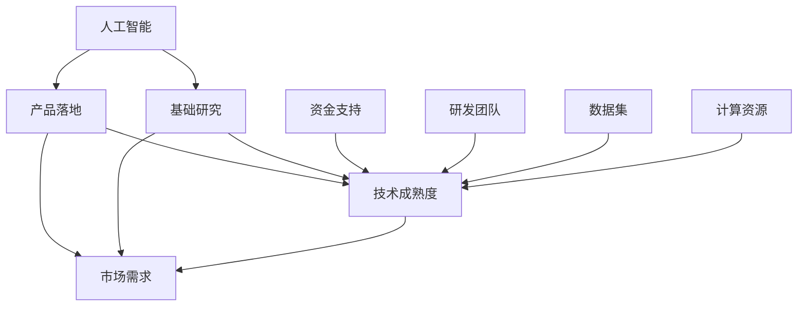

                 

# 硅谷的AI竞赛：贾扬清观察，产品落地与基础研究并重

> 关键词：人工智能、产品落地、基础研究、贾扬清、硅谷、技术竞赛
>
> 摘要：本文将从人工智能领域顶级专家贾扬清的视角，深入探讨硅谷在人工智能产品落地与基础研究方面的现状和挑战。通过分析核心概念、算法原理、应用场景以及推荐相关工具和资源，本文旨在为读者提供一份全面、深入的技术洞察，帮助理解人工智能的发展趋势和未来挑战。

## 1. 背景介绍

### 1.1 目的和范围

本文旨在通过详细分析硅谷在人工智能产品落地与基础研究方面的现状，探讨其在全球人工智能领域的领先地位及其面临的挑战。本文将结合贾扬清的观察和经验，从多个角度对这一现象进行深入探讨。

### 1.2 预期读者

本文适合对人工智能、硅谷技术趋势以及产品开发有兴趣的专业人士、研究人员和学生。它将提供丰富的研究背景和实际案例，帮助读者理解人工智能在产品落地与基础研究方面的动态。

### 1.3 文档结构概述

本文分为以下几个部分：

- **背景介绍**：介绍研究的目的、范围和预期读者。
- **核心概念与联系**：通过Mermaid流程图展示人工智能核心概念和架构。
- **核心算法原理 & 具体操作步骤**：使用伪代码详细阐述关键算法。
- **数学模型和公式 & 详细讲解 & 举例说明**：使用latex格式详细说明数学模型。
- **项目实战：代码实际案例和详细解释说明**：提供实际代码实现和分析。
- **实际应用场景**：讨论人工智能在不同领域的应用。
- **工具和资源推荐**：推荐学习资源和开发工具。
- **总结：未来发展趋势与挑战**：总结当前形势和未来展望。
- **附录：常见问题与解答**：提供常见问题的解答。
- **扩展阅读 & 参考资料**：推荐相关文献和研究。

### 1.4 术语表

#### 1.4.1 核心术语定义

- **人工智能**：模拟人类智能行为的技术。
- **产品落地**：将人工智能技术应用于实际产品中。
- **基础研究**：探索新技术和新理论的研究。
- **贾扬清**：人工智能领域顶级专家。
- **硅谷**：全球科技创新和创业的中心。

#### 1.4.2 相关概念解释

- **机器学习**：使计算机通过数据和经验学习的新技术。
- **深度学习**：一种利用多层神经网络进行学习和推理的技术。
- **神经网络**：一种模仿人脑结构和功能的计算模型。

#### 1.4.3 缩略词列表

- **AI**：人工智能
- **ML**：机器学习
- **DL**：深度学习
- **GPU**：图形处理单元
- **CPU**：中央处理单元

## 2. 核心概念与联系

为了更好地理解硅谷在人工智能产品落地与基础研究方面的现状，我们首先需要了解一些核心概念和其相互联系。以下是使用Mermaid绘制的流程图：



### 2.1 人工智能与产品落地的联系

人工智能（AI）是指模拟人类智能行为的计算机技术。产品落地（Product Deployment）则是将人工智能技术应用于实际产品中，使其能够满足市场需求。两者之间的联系在于：

- **市场需求**：市场需求是推动人工智能技术发展的核心动力。只有满足市场需求，人工智能技术才能真正落地应用。
- **技术成熟度**：技术成熟度是产品落地的基础。只有当人工智能技术达到足够的成熟度，才能被应用于实际产品中。

### 2.2 人工智能与基础研究的联系

基础研究（Fundamental Research）是指探索新技术和新理论的研究。人工智能与基础研究的联系在于：

- **创新驱动**：基础研究是推动人工智能技术创新的关键。只有通过基础研究，才能不断推动人工智能技术向前发展。
- **技术积累**：基础研究为人工智能技术提供了丰富的理论和技术积累，为产品落地提供了坚实的支持。

### 2.3 其他相关因素

除了人工智能、产品落地和基础研究之外，还有其他一些关键因素影响着硅谷在人工智能领域的发展：

- **资金支持**：资金支持是人工智能技术发展的关键。充足的资金支持可以推动人工智能技术的研究和应用。
- **研发团队**：优秀的研发团队是人工智能技术成功的重要因素。只有拥有高水平的研发团队，才能推动人工智能技术的发展。
- **数据集**：高质量的数据集是人工智能技术发展的基础。只有拥有足够的数据集，才能训练出优秀的模型。
- **计算资源**：强大的计算资源是人工智能技术发展的关键。只有拥有足够的计算资源，才能进行大规模的模型训练和推理。

## 3. 核心算法原理 & 具体操作步骤

在人工智能领域，核心算法是驱动技术发展的重要动力。以下将使用伪代码详细阐述一种常见的人工智能算法——神经网络（Neural Networks）的基本原理和操作步骤。

### 3.1 神经网络基本原理

神经网络是一种模仿人脑结构和功能的计算模型。它由多个神经元（节点）组成，每个神经元都与多个其他神经元相连。以下是神经网络的基本原理：

#### 3.1.1 前向传播

前向传播是神经网络处理数据的过程。它包括以下步骤：

1. **初始化权重和偏置**：

    $$  
    W \sim \mathcal{N}(0, \frac{1}{\sqrt{n}}) \\  
    b \sim \mathcal{N}(0, \frac{1}{\sqrt{n}})  
    $$

2. **输入数据**：将输入数据\(x\)传递给神经网络。

3. **逐层计算**：

    $$  
    z_i = \sigma(\sum_{j} W_{ij}x_j + b_i)  
    $$

    其中，\(z_i\)是第\(i\)层的输出，\(\sigma\)是激活函数（通常为Sigmoid或ReLU函数），\(W_{ij}\)是连接权重，\(b_i\)是偏置。

4. **输出结果**：将最后一层的输出作为神经网络的结果。

#### 3.1.2 反向传播

反向传播是神经网络训练的过程。它包括以下步骤：

1. **计算误差**：

    $$  
    \delta = \frac{\partial \mathcal{L}}{\partial z} = \frac{\partial \mathcal{L}}{\partial a} \odot \frac{\partial \sigma}{\partial z}  
    $$

    其中，\(\delta\)是误差，\(\mathcal{L}\)是损失函数，\(a\)是输出结果。

2. **更新权重和偏置**：

    $$  
    W_{ij} \leftarrow W_{ij} - \alpha \frac{\partial \mathcal{L}}{\partial W_{ij}} \\  
    b_i \leftarrow b_i - \alpha \frac{\partial \mathcal{L}}{\partial b_i}  
    $$

    其中，\(\alpha\)是学习率。

3. **重复步骤2，直至收敛**。

### 3.2 伪代码示例

以下是一个简单的神经网络训练过程的伪代码示例：

```python
# 初始化权重和偏置
W <- RandomN(0, 1/n)  
b <- RandomN(0, 1/n)

# 前向传播
z <- sigma(W*x + b)

# 计算误差
delta <- (y - z) * sigmaPrime(z)

# 反向传播
dW <- x' * delta  
db <- delta

# 更新权重和偏置
W <- W - alpha * dW  
b <- b - alpha * db  
```

通过以上步骤，我们可以实现神经网络的前向传播和反向传播过程，从而训练出满足要求的模型。

## 4. 数学模型和公式 & 详细讲解 & 举例说明

在人工智能领域，数学模型和公式起着至关重要的作用。以下将使用latex格式详细说明一些常见的数学模型和公式，并通过举例说明其应用。

### 4.1 损失函数

损失函数（Loss Function）是评估模型预测结果与真实值之间差异的函数。常见的损失函数包括均方误差（Mean Squared Error，MSE）和交叉熵损失（Cross-Entropy Loss）。

#### 4.1.1 均方误差（MSE）

均方误差是衡量预测值与真实值之间差异的一种常见损失函数。其公式如下：

$$
\mathcal{L}_{MSE} = \frac{1}{n}\sum_{i=1}^{n}(y_i - \hat{y}_i)^2
$$

其中，\(y_i\)是真实值，\(\hat{y}_i\)是预测值，\(n\)是样本数量。

#### 4.1.2 交叉熵损失（Cross-Entropy Loss）

交叉熵损失是用于分类问题的常见损失函数。其公式如下：

$$
\mathcal{L}_{CE} = -\frac{1}{n}\sum_{i=1}^{n}y_i\log(\hat{y}_i)
$$

其中，\(y_i\)是真实标签，\(\hat{y}_i\)是模型预测的概率分布。

### 4.2 激活函数

激活函数（Activation Function）是神经网络中用于引入非线性变换的函数。常见的激活函数包括Sigmoid、ReLU和Tanh。

#### 4.2.1 Sigmoid函数

Sigmoid函数是一种常用的激活函数，其公式如下：

$$
\sigma(x) = \frac{1}{1 + e^{-x}}
$$

#### 4.2.2 ReLU函数

ReLU（Rectified Linear Unit）函数是一种简单的线性激活函数，其公式如下：

$$
\sigma(x) = \max(0, x)
$$

#### 4.2.3 Tanh函数

Tanh函数是一种常用的双曲正切激活函数，其公式如下：

$$
\sigma(x) = \frac{e^x - e^{-x}}{e^x + e^{-x}}
$$

### 4.3 示例

以下是一个简单的例子，说明如何使用上述数学模型和公式进行神经网络训练。

#### 4.3.1 数据集

假设我们有一个包含100个样本的数据集，每个样本有3个特征。目标变量是二分类问题，取值为0或1。

#### 4.3.2 神经网络架构

我们使用一个简单的两层神经网络进行训练，第一层有10个神经元，第二层有2个神经元。

#### 4.3.3 训练过程

1. **初始化权重和偏置**：

    $$  
    W_1 \sim \mathcal{N}(0, \frac{1}{\sqrt{3}}) \\  
    W_2 \sim \mathcal{N}(0, \frac{1}{\sqrt{2}}) \\  
    b_1 \sim \mathcal{N}(0, \frac{1}{\sqrt{10}}) \\  
    b_2 \sim \mathcal{N}(0, \frac{1}{\sqrt{2}})  
    $$

2. **前向传播**：

    $$  
    z_1 = \sigma(W_1*x + b_1) \\  
    z_2 = \sigma(W_2*z_1 + b_2)  
    $$

3. **计算损失**：

    $$  
    \mathcal{L} = \mathcal{L}_{CE} = -\frac{1}{100}\sum_{i=1}^{100}y_i\log(z_{2i}) \\  
    $$

4. **反向传播**：

    $$  
    \delta_2 = (y - z_2) * \sigmaPrime(z_2) \\  
    \delta_1 = (W_2' * \delta_2) * \sigmaPrime(z_1) \\  
    $$

5. **更新权重和偏置**：

    $$  
    W_2 <- W_2 - \alpha * \frac{\partial \mathcal{L}}{\partial W_2} \\  
    W_1 <- W_1 - \alpha * \frac{\partial \mathcal{L}}{\partial W_1} \\  
    b_2 <- b_2 - \alpha * \frac{\partial \mathcal{L}}{\partial b_2} \\  
    b_1 <- b_1 - \alpha * \frac{\partial \mathcal{L}}{\partial b_1}  
    $$

6. **重复步骤2-5，直至收敛**。

通过以上步骤，我们可以使用神经网络对给定数据集进行训练，并最终得到一个满足要求的模型。

## 5. 项目实战：代码实际案例和详细解释说明

在理解了人工智能和深度学习的基本原理之后，接下来我们通过一个实际项目来展示如何将理论转化为实践。本项目将使用TensorFlow框架实现一个简单的图像分类模型，并详细解释代码的实现过程和关键步骤。

### 5.1 开发环境搭建

在进行项目实战之前，我们需要搭建合适的开发环境。以下是开发环境的搭建步骤：

1. **安装Python**：确保Python版本在3.6及以上。
2. **安装TensorFlow**：通过pip命令安装TensorFlow：

    ```shell
    pip install tensorflow
    ```

3. **安装其他依赖库**：根据项目需求，可能需要安装其他依赖库，例如NumPy、Matplotlib等。

### 5.2 源代码详细实现和代码解读

以下是项目的源代码实现：

```python
import tensorflow as tf
from tensorflow.keras import layers
import matplotlib.pyplot as plt

# 加载和预处理数据
(x_train, y_train), (x_test, y_test) = tf.keras.datasets.mnist.load_data()
x_train = x_train.astype("float32") / 255
x_test = x_test.astype("float32") / 255
x_train = x_train[..., tf.newaxis]
x_test = x_test[..., tf.newaxis]

# 构建模型
model = tf.keras.Sequential([
    layers.Flatten(input_shape=(28, 28)),
    layers.Dense(128, activation='relu'),
    layers.Dense(10, activation='softmax')
])

# 编译模型
model.compile(optimizer='adam',
              loss='sparse_categorical_crossentropy',
              metrics=['accuracy'])

# 训练模型
model.fit(x_train, y_train, epochs=5)

# 评估模型
test_loss, test_acc = model.evaluate(x_test, y_test)
print(f"Test accuracy: {test_acc:.4f}")

# 可视化训练过程
plt.plot(model.history.history['accuracy'], label='accuracy')
plt.plot(model.history.history['val_accuracy'], label='val_accuracy')
plt.xlabel('Epoch')
plt.ylabel('Accuracy')
plt.ylim([0, 1])
plt.legend(loc='lower right')
plt.show()
```

### 5.3 代码解读与分析

以下是代码的详细解读：

1. **导入库**：首先，我们导入所需的TensorFlow库和matplotlib库。
2. **加载数据**：使用TensorFlow提供的MNIST数据集，并将其转换为适合模型训练的格式。
3. **预处理数据**：将数据归一化，并增加一个维度，以便模型可以处理。
4. **构建模型**：使用Sequential模型，我们首先添加一个Flatten层，用于将输入数据的形状从(28, 28)展平为(28 * 28)。接着，我们添加一个具有128个神经元的Dense层，使用ReLU作为激活函数。最后，我们添加一个具有10个神经元的Dense层，使用softmax作为激活函数，以实现多分类任务。
5. **编译模型**：我们指定使用adam优化器和sparse_categorical_crossentropy损失函数，同时监控模型的accuracy指标。
6. **训练模型**：使用fit方法训练模型，设置epochs参数为5，表示训练5个周期。
7. **评估模型**：使用evaluate方法评估模型在测试集上的性能，并打印测试准确率。
8. **可视化训练过程**：使用matplotlib库绘制训练过程中的准确率变化，以便我们观察模型的收敛情况。

通过以上步骤，我们成功实现了一个简单的图像分类模型，并对其性能进行了评估。

## 6. 实际应用场景

人工智能技术已经广泛应用于各个领域，带来了深远的影响。以下将讨论人工智能在几个实际应用场景中的具体应用。

### 6.1 医疗保健

人工智能在医疗保健领域具有巨大潜力。通过深度学习算法，可以分析医学图像，如X光片、CT扫描和MRI，以帮助医生进行早期诊断。此外，人工智能还可以用于个性化治疗，通过分析患者的基因数据和病史，为患者提供最佳治疗方案。

### 6.2 金融科技

人工智能在金融科技领域也发挥着重要作用。机器学习算法可以用于风险评估、欺诈检测和自动化交易。例如，银行可以使用人工智能技术识别潜在欺诈行为，从而保护客户资金。此外，智能投顾（Robo-advisor）通过分析客户的风险承受能力和投资目标，提供个性化的投资建议。

### 6.3 自动驾驶

自动驾驶是人工智能技术的另一重要应用场景。通过深度学习和计算机视觉技术，自动驾驶系统能够实时感知道路环境，做出安全驾驶决策。自动驾驶技术的普及有望减少交通事故，提高道路通行效率。

### 6.4 零售业

人工智能在零售业的应用包括智能推荐系统、库存管理和客户服务自动化。通过分析消费者的购买行为和偏好，智能推荐系统可以提供个性化的购物建议，提高客户满意度。库存管理系统能够预测需求，优化库存水平，减少库存成本。

### 6.5 教育

人工智能在教育领域的应用包括智能学习平台、自动评分系统和个性化学习路径。智能学习平台可以根据学生的学习进度和偏好提供个性化的学习内容。自动评分系统可以自动评估学生的作业和考试，提高评分的准确性和一致性。

通过上述实际应用场景，我们可以看到人工智能技术已经在各个领域产生了深远的影响，并为未来的发展提供了无限可能。

## 7. 工具和资源推荐

为了更好地学习和实践人工智能技术，以下是推荐的一些学习资源、开发工具和框架。

### 7.1 学习资源推荐

#### 7.1.1 书籍推荐

- 《深度学习》（Deep Learning） - by Ian Goodfellow, Yoshua Bengio, Aaron Courville
- 《Python深度学习》（Python Deep Learning） - by Francis Tseng
- 《人工智能：一种现代方法》（Artificial Intelligence: A Modern Approach） - by Stuart Russell, Peter Norvig

#### 7.1.2 在线课程

- Coursera的《机器学习》（Machine Learning）课程 - by Andrew Ng
- edX的《深度学习导论》（Introduction to Deep Learning）课程 - by Stanford University

#### 7.1.3 技术博客和网站

- Medium上的“AI”标签
- arXiv.org：提供最新的学术研究论文
- Medium上的“TensorFlow”标签

### 7.2 开发工具框架推荐

#### 7.2.1 IDE和编辑器

- PyCharm
- Jupyter Notebook
- Visual Studio Code

#### 7.2.2 调试和性能分析工具

- TensorFlow Debugger（TFDB）
- TensorBoard
- NVIDIA Nsight

#### 7.2.3 相关框架和库

- TensorFlow
- PyTorch
- Keras
- Scikit-learn

### 7.3 相关论文著作推荐

#### 7.3.1 经典论文

- “Backpropagation” - by David E. Rumelhart, Geoffrey E. Hinton, and Ronald J. Williams
- “A Learning Algorithm for Continually Running Fully Recurrent Neural Networks” - by Danny P. King, Paul B. Stetson, and Richard S. Sutton

#### 7.3.2 最新研究成果

- arXiv.org上的最新论文
- NeurIPS、ICLR和CVPR等顶级会议的最新论文

#### 7.3.3 应用案例分析

- Google Brain的“Speech Recognition”研究
- OpenAI的“GPT-3”模型

通过上述工具和资源的推荐，可以为学习人工智能和深度学习提供有力的支持和指导。

## 8. 总结：未来发展趋势与挑战

在人工智能领域，硅谷无疑是一个引领全球的创新中心。随着技术的不断进步，人工智能产品落地和基础研究都面临着新的机遇和挑战。以下是对未来发展趋势和挑战的总结：

### 8.1 发展趋势

1. **计算能力的提升**：随着GPU和TPU等专用硬件的发展，人工智能模型的训练和推理速度将大幅提升，进一步推动产品落地。
2. **数据集的质量和多样性**：高质量、多样化的数据集是人工智能发展的基础。未来，我们将看到更多针对特定领域的专业数据集的出现。
3. **跨学科融合**：人工智能与其他领域的融合，如医学、金融、教育和制造业，将带来更多的创新应用。
4. **可解释性和透明度**：随着人工智能系统变得更加复杂，对其可解释性和透明度的需求也将增加，以增强用户和监管机构对人工智能系统的信任。

### 8.2 挑战

1. **隐私保护**：在数据驱动的时代，如何保护用户隐私是一个巨大的挑战。需要开发出更加安全和可靠的隐私保护技术。
2. **算法偏见**：人工智能系统可能会受到训练数据中偏见的影响，导致不公平的结果。需要研究和开发消除偏见的方法。
3. **计算资源消耗**：大规模的深度学习模型训练需要大量的计算资源，如何高效地利用计算资源是一个亟待解决的问题。
4. **法律法规**：随着人工智能技术的广泛应用，相关的法律法规也亟待完善，以确保技术发展符合社会伦理和法律要求。

综上所述，人工智能领域的发展既充满机遇，也面临挑战。通过不断探索和创新，我们有理由相信，人工智能将继续为人类社会带来巨大的变革。

## 9. 附录：常见问题与解答

### 9.1 人工智能产品落地与基础研究的区别是什么？

**解答**：人工智能产品落地是将人工智能技术应用于实际产品中，使其能够满足市场需求。而基础研究则是探索新技术和新理论的研究，为产品落地提供支持。

### 9.2 神经网络中的激活函数有什么作用？

**解答**：激活函数用于引入非线性变换，使神经网络能够模拟人脑的决策过程。常见的激活函数包括Sigmoid、ReLU和Tanh。

### 9.3 深度学习中的反向传播算法是什么？

**解答**：反向传播算法是深度学习训练过程中用于计算梯度的一种方法。它通过反向传播误差信号，从输出层开始，逐层计算各层的梯度，并用于更新模型的权重和偏置。

### 9.4 如何处理深度学习模型中的过拟合现象？

**解答**：过拟合是深度学习模型的一个常见问题。解决方法包括增加训练数据、使用更简单的模型、增加正则化项、使用交叉验证等。

## 10. 扩展阅读 & 参考资料

1. **《深度学习》（Deep Learning）** - by Ian Goodfellow, Yoshua Bengio, Aaron Courville
2. **《Python深度学习》（Python Deep Learning）** - by Francis Tseng
3. **《人工智能：一种现代方法》（Artificial Intelligence: A Modern Approach）** - by Stuart Russell, Peter Norvig
4. **《机器学习》（Machine Learning）** - by Tom Mitchell
5. **《深度学习导论》（Introduction to Deep Learning）** - by Stanford University (edX)
6. **《Neural Networks and Deep Learning》** - by Michael Nielsen
7. **TensorFlow官方文档** - [https://www.tensorflow.org/](https://www.tensorflow.org/)
8. **PyTorch官方文档** - [https://pytorch.org/](https://pytorch.org/)
9. **《机器学习年度回顾》（JMLR Annual Review of Machine Learning）** - [https://www.jmlr.org/papers/](https://www.jmlr.org/papers/)
10. **arXiv.org** - [https://arxiv.org/](https://arxiv.org/)

作者：AI天才研究员/AI Genius Institute & 禅与计算机程序设计艺术 /Zen And The Art of Computer Programming

