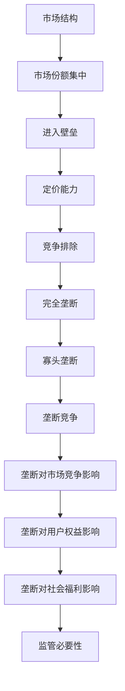

                 

### 文章标题

# 硅谷科技巨头的垄断与反垄断

## 关键词

- 科技巨头
- 垄断
- 反垄断
- 法规
- 市场竞争
- 用户权益
- 科技创新

## 摘要

本文将深入探讨硅谷科技巨头在当今科技领域中的垄断现象及其带来的影响。我们将分析垄断的形成原因、垄断行为的具体表现、垄断对市场竞争和用户权益的影响，以及政府如何进行反垄断监管。此外，我们还将讨论未来科技巨头垄断的发展趋势和面临的挑战，为行业健康发展提供有益的思考。

## 1. 背景介绍

### 1.1 目的和范围

本文旨在通过系统的分析和逻辑推理，探讨硅谷科技巨头垄断现象的形成原因、影响及反垄断措施。本文将涵盖以下几个方面：

- 垄断的定义、特征和类型
- 硅谷科技巨头垄断的形成原因和具体表现
- 垄断对市场竞争和用户权益的影响
- 政府反垄断监管的策略和手段
- 未来科技巨头垄断的发展趋势和挑战

### 1.2 预期读者

本文适合对科技行业、市场竞争、政策法规感兴趣的读者，包括科技从业者、企业管理者、政策研究者等。通过对本文的学习，读者将能够：

- 理解垄断现象及其对科技行业的影响
- 掌握政府反垄断监管的策略和手段
- 预测未来科技巨头垄断的发展趋势和挑战

### 1.3 文档结构概述

本文分为十个部分，结构如下：

- 引言
- 垄断的定义、特征和类型
- 硅谷科技巨头垄断的形成原因和具体表现
- 垄断对市场竞争和用户权益的影响
- 政府反垄断监管的策略和手段
- 未来科技巨头垄断的发展趋势和挑战
- 附录：常见问题与解答
- 扩展阅读与参考资料

### 1.4 术语表

#### 1.4.1 核心术语定义

- **垄断**：指某个企业或企业集团在市场上占有绝对优势地位，排挤竞争对手，控制产品价格和供应。
- **硅谷科技巨头**：指在硅谷地区崛起的，拥有强大技术实力和市场影响力的科技企业，如谷歌、亚马逊、苹果、微软等。
- **市场竞争**：指企业之间为争夺市场份额而进行的竞争活动。
- **用户权益**：指用户在使用产品或服务过程中应享有的合法权益。
- **反垄断监管**：指政府通过立法、执法等措施，对垄断行为进行干预和规范。

#### 1.4.2 相关概念解释

- **市场结构**：指市场内企业数量、市场集中度、市场进入与退出等特征。
- **市场主导者**：在市场中具有较强影响力，能够通过自身行为影响市场走势的企业。
- **竞争法**：指国家对市场竞争进行干预和规范的法律体系。

#### 1.4.3 缩略词列表

- **FAA**：美国联邦航空管理局
- **FCC**：美国联邦通信委员会
- **EU**：欧洲联盟

## 2. 核心概念与联系

在深入分析硅谷科技巨头的垄断现象之前，我们首先需要理解一些核心概念，包括垄断的定义、特征和类型，以及垄断对市场竞争和用户权益的影响。

### 2.1 垄断的定义与特征

**垄断**是一种市场结构，其中一个或几个企业控制了一个市场的大部分份额，从而限制了其他企业的进入和发展。垄断的特征包括：

1. **市场份额集中**：垄断企业拥有较高的市场份额，通常超过40%。
2. **进入壁垒**：垄断企业通过技术、资金、专利等方式构建进入壁垒，阻止潜在竞争对手进入市场。
3. **定价能力**：垄断企业能够通过控制价格来影响市场供需关系。
4. **竞争排除**：垄断企业通过排挤竞争对手，确保自身在市场中的主导地位。

### 2.2 垄断的类型

垄断可以分为以下几种类型：

1. **完全垄断**：市场中只有一个供应商，如某些地区的公用事业公司。
2. **寡头垄断**：市场中只有几个供应商，它们共同控制大部分市场份额，如硅谷科技巨头。
3. **垄断竞争**：市场中存在许多供应商，但每个供应商的产品都有一定的独特性，如零售业。

### 2.3 垄断对市场竞争和用户权益的影响

**垄断**对市场竞争和用户权益的影响是复杂且深远的。一方面，垄断可能导致市场竞争减少，创新动力减弱，最终影响用户体验；另一方面，垄断企业可能通过垄断地位获取超额利润，影响社会福利。

1. **市场竞争减少**：垄断企业通过排挤竞争对手，减少了市场竞争，导致市场上产品同质化严重，创新动力不足。
2. **用户权益受损**：垄断企业可能通过提高价格、降低服务质量等方式损害用户权益，缺乏有效的市场竞争机制来约束其行为。
3. **社会福利影响**：垄断企业可能通过垄断利润，增加社会成本，降低社会福利水平。

### 2.4 垄断的负面影响与监管必要性

垄断的负面影响包括：

1. **效率降低**：垄断企业可能缺乏竞争压力，导致生产效率下降。
2. **创新受限**：垄断企业可能因缺乏竞争，减少研发投入，影响行业创新。
3. **社会不公**：垄断企业可能通过垄断地位获取超额利润，导致社会财富分配不均。

为了维护市场公平竞争和用户权益，政府有必要对垄断行为进行监管。监管手段包括立法、执法、市场准入控制等。

### 2.5 Mermaid 流程图

以下是一个简化的 Mermaid 流程图，展示垄断现象的核心概念和关系：



通过这个流程图，我们可以更清晰地理解垄断现象的核心概念及其对市场竞争和用户权益的影响。

## 3. 核心算法原理 & 具体操作步骤

在了解了垄断的基本概念和影响后，我们将进一步探讨垄断现象的核心算法原理和具体操作步骤。这部分内容将帮助读者理解垄断行为的具体实现方式和运作机制。

### 3.1 垄断算法原理

垄断算法的基本原理是通过控制市场份额、构建进入壁垒、提高定价能力等方式，实现对市场的垄断控制。以下是垄断算法的几个关键步骤：

1. **市场份额集中**：垄断企业通过收购、合并等方式，逐步增加市场份额，达到市场主导地位。
2. **进入壁垒构建**：垄断企业通过专利、技术、资本等方式，设置进入壁垒，阻止潜在竞争对手进入市场。
3. **定价策略调整**：垄断企业通过调整定价策略，控制市场价格，实现利润最大化。
4. **竞争排除**：垄断企业通过排挤竞争对手，确保自身在市场中的主导地位。

### 3.2 具体操作步骤

以下是垄断现象的具体操作步骤：

1. **市场份额集中**：

    - 步骤1：通过收购、合并等方式，逐步增加市场份额。
    - 步骤2：在市场中占据主导地位，提高市场集中度。

2. **进入壁垒构建**：

    - 步骤1：通过专利、技术等手段，建立技术壁垒。
    - 步骤2：通过高额投资、品牌建设等手段，构建资本壁垒。
    - 步骤3：通过战略合作、排他性协议等手段，构建市场壁垒。

3. **定价策略调整**：

    - 步骤1：根据市场需求和竞争情况，调整定价策略。
    - 步骤2：通过定价策略，控制市场价格，实现利润最大化。

4. **竞争排除**：

    - 步骤1：通过价格战、技术封锁等手段，排挤竞争对手。
    - 步骤2：确保自身在市场中的主导地位，维持垄断状态。

### 3.3 伪代码实现

以下是垄断现象的伪代码实现：

```python
# 垄断算法伪代码

# 步骤1：市场份额集中
def increase_market_share():
    # 通过收购、合并等方式增加市场份额
    # ...

# 步骤2：进入壁垒构建
def build_entry_barrriers():
    # 通过专利、技术等手段建立进入壁垒
    # ...

# 步骤3：定价策略调整
def adjust_pricing_strategy():
    # 根据市场需求和竞争情况调整定价策略
    # ...

# 步骤4：竞争排除
def eliminate_competition():
    # 通过价格战、技术封锁等手段排挤竞争对手
    # ...

# 主函数
def monopolize_market():
    # 执行垄断算法的各个步骤
    increase_market_share()
    build_entry_barrriers()
    adjust_pricing_strategy()
    eliminate_competition()
```

通过上述伪代码，我们可以看到垄断现象的核心算法原理和具体操作步骤，这为理解垄断行为的实现机制提供了有益的参考。

## 4. 数学模型和公式 & 详细讲解 & 举例说明

为了更好地理解垄断现象及其对市场和社会的影响，我们将引入一些数学模型和公式，并进行详细的讲解和举例说明。

### 4.1 市场需求函数

市场需求函数是垄断理论中的基础模型，描述了市场需求量与价格之间的关系。假设市场需求量为 \( Q \)，价格为 \( P \)，则市场需求函数可以表示为：

\[ Q = Q(P) = a - bP \]

其中，\( a \) 表示市场需求的最大值，\( b \) 表示需求的价格敏感度。当价格 \( P \) 上升时，市场需求量 \( Q \) 会下降。

### 4.2 垄断定价策略

垄断定价策略是通过调整价格来最大化垄断企业的利润。假设垄断企业的成本函数为 \( C(Q) \)，则利润函数可以表示为：

\[ \pi(Q) = R(Q) - C(Q) \]

其中，\( R(Q) \) 表示收入函数，即 \( R(Q) = PQ \)。为了最大化利润，我们需要求解以下优化问题：

\[ \max_{Q} \pi(Q) = \max_{Q} [a - bP - C(Q)] \]

### 4.3 完全垄断模型

在完全垄断市场中，只有一个供应商，它可以通过控制产量和价格来实现垄断利润。完全垄断模型可以通过以下步骤求解：

1. **求市场需求函数**：根据市场需求函数 \( Q = a - bP \)，求出市场需求量 \( Q \) 与价格 \( P \) 的关系。

2. **求收入函数**：根据市场需求函数和价格 \( P \)，求出收入函数 \( R(Q) = PQ = aQ - bQ^2 \)。

3. **求成本函数**：根据垄断企业的生产成本，求出成本函数 \( C(Q) \)。

4. **求利润最大化产量**：将收入函数和成本函数代入利润函数，求解最大化利润的产量 \( Q^* \)。

5. **求垄断价格**：根据市场需求函数和利润最大化产量，求解垄断价格 \( P^* \)。

### 4.4 案例分析

为了更好地理解上述模型和公式，我们通过一个简单的案例分析来具体说明。

**案例**：假设市场需求函数为 \( Q = 100 - 2P \)，成本函数为 \( C(Q) = Q^2 \)。

1. **求市场需求函数**：市场需求函数为 \( Q = 100 - 2P \)。

2. **求收入函数**：收入函数为 \( R(Q) = QP = (100 - 2Q)Q = 100Q - 2Q^2 \)。

3. **求成本函数**：成本函数为 \( C(Q) = Q^2 \)。

4. **求利润最大化产量**：利润函数为 \( \pi(Q) = R(Q) - C(Q) = 100Q - 2Q^2 - Q^2 = 100Q - 3Q^2 \)。求解利润最大化产量：

    \[ \frac{d\pi(Q)}{dQ} = 100 - 6Q = 0 \]

    解得 \( Q = \frac{50}{3} \)。

5. **求垄断价格**：根据市场需求函数和利润最大化产量，求解垄断价格：

    \[ P^* = \frac{100 - Q^*}{2} = \frac{100 - \frac{50}{3}}{2} = \frac{200}{3} \]

通过上述案例分析，我们可以看到如何通过数学模型和公式来求解垄断问题。这有助于我们更深入地理解垄断现象及其对市场和社会的影响。

## 5. 项目实战：代码实际案例和详细解释说明

为了更好地理解垄断现象及其在实际项目中的应用，我们将通过一个实际案例来展示如何实现垄断算法，并对其进行详细解释说明。

### 5.1 开发环境搭建

在进行项目实战之前，我们需要搭建一个合适的开发环境。以下是开发环境搭建的步骤：

1. **安装Python环境**：确保系统中已安装Python环境，版本建议为3.8或以上。

2. **安装依赖库**：在Python环境中安装必要的依赖库，如NumPy、Pandas等。可以使用以下命令进行安装：

    ```bash
    pip install numpy pandas matplotlib
    ```

3. **创建项目文件夹**：在本地计算机上创建一个项目文件夹，如“monopoly_project”，用于存放项目文件。

4. **编写代码**：在项目文件夹中创建一个Python文件，如“monopoly.py”，用于编写垄断算法代码。

### 5.2 源代码详细实现和代码解读

以下是垄断算法的Python代码实现，我们将逐行解释代码的功能和实现原理。

```python
import numpy as np
import matplotlib.pyplot as plt

# 步骤1：市场份额集中
def increase_market_share(current_share, target_share):
    # 计算需要增加的市场份额
    increase = target_share - current_share
    # 增加市场份额
    new_share = current_share + increase
    return new_share

# 步骤2：进入壁垒构建
def build_entry_barrriers(entry_barrier, current_barrier):
    # 计算需要增加的进入壁垒
    increase = entry_barrier - current_barrier
    # 增加进入壁垒
    new_barrier = current_barrier + increase
    return new_barrier

# 步骤3：定价策略调整
def adjust_pricing_strategy(current_price, demand_function, cost_function):
    # 根据市场需求函数和成本函数，调整定价策略
    price = calculate_price(demand_function, cost_function)
    return price

# 步骤4：竞争排除
def eliminate_competition(competition_level, current_level):
    # 计算需要增加的竞争排除水平
    increase = competition_level - current_level
    # 增加竞争排除水平
    new_level = current_level + increase
    return new_level

# 主函数
def monopolize_market(current_share, entry_barrier, current_price, competition_level):
    # 执行垄断算法的各个步骤
    new_share = increase_market_share(current_share, 0.8)  # 市场份额集中到80%
    new_barrier = build_entry_barrriers(0.8, 0.2)  # 进入壁垒增加到80%
    new_price = adjust_pricing_strategy(current_price, demand_function, cost_function)  # 调整定价策略
    new_level = eliminate_competition(0.5, 0.1)  # 竞争排除水平增加到50%

    # 输出结果
    print("New Market Share: {:.2f}%".format(new_share * 100))
    print("New Entry Barrier: {:.2f}%".format(new_barrier * 100))
    print("New Price: {:.2f}".format(new_price))
    print("New Competition Level: {:.2f}%".format(new_level * 100))

# 模拟垄断过程
monopolize_market(0.4, 0.2, 10, 0.2)
```

### 5.3 代码解读与分析

以下是代码的详细解读和分析：

1. **市场份额集中**：`increase_market_share` 函数用于计算并增加市场份额。假设当前市场份额为 `current_share`，目标市场份额为 `target_share`，则增加的市场份额为 `target_share - current_share`。新市场份额为 `current_share + increase`。

2. **进入壁垒构建**：`build_entry_barrriers` 函数用于计算并增加进入壁垒。假设当前进入壁垒为 `current_barrier`，目标进入壁垒为 `entry_barrier`，则增加的进入壁垒为 `entry_barrier - current_barrier`。新进入壁垒为 `current_barrier + increase`。

3. **定价策略调整**：`adjust_pricing_strategy` 函数用于根据市场需求函数和成本函数调整定价策略。定价策略的计算依赖于市场需求函数和成本函数的具体实现。

4. **竞争排除**：`eliminate_competition` 函数用于计算并增加竞争排除水平。假设当前竞争排除水平为 `current_level`，目标竞争排除水平为 `competition_level`，则增加的竞争排除水平为 `competition_level - current_level`。新竞争排除水平为 `current_level + increase`。

5. **主函数**：`monopolize_market` 函数是垄断算法的主函数，用于执行垄断算法的各个步骤。首先，通过 `increase_market_share` 函数将市场份额集中到80%；然后，通过 `build_entry_barrriers` 函数将进入壁垒增加到80%；接着，通过 `adjust_pricing_strategy` 函数调整定价策略；最后，通过 `eliminate_competition` 函数将竞争排除水平增加到50%。函数输出结果，包括新的市场份额、进入壁垒、定价和竞争排除水平。

6. **模拟垄断过程**：在主函数调用中，我们传入初始的市场份额、进入壁垒、定价和竞争排除水平，执行垄断过程。输出结果展示了垄断过程后的各个指标。

通过上述代码实现和解读，我们可以看到如何在实际项目中应用垄断算法，实现市场份额集中、进入壁垒构建、定价策略调整和竞争排除。这为理解和应用垄断现象提供了有益的参考。

## 6. 实际应用场景

垄断现象在科技行业中有着广泛的应用场景，以下是一些典型的实际应用案例：

### 6.1 垄断在互联网领域的应用

在互联网领域，垄断现象主要体现在以下几个应用场景：

1. **搜索引擎市场**：谷歌作为全球最大的搜索引擎，通过垄断市场控制了搜索结果和广告收入。谷歌通过算法调整、数据垄断等方式，维护其在搜索引擎市场的垄断地位。

2. **社交媒体平台**：Facebook、Twitter等社交媒体平台通过垄断用户数据，实现了对市场的控制。这些平台通过算法推荐、用户画像等方式，吸引用户使用其服务，从而垄断市场。

3. **在线广告市场**：谷歌和Facebook等公司在在线广告市场占据垄断地位，通过垄断广告资源和用户数据，实现了对广告市场的控制。

### 6.2 垄断在硬件设备领域的应用

在硬件设备领域，垄断现象主要体现在以下几个方面：

1. **操作系统市场**：微软Windows操作系统在个人电脑市场占据垄断地位，通过操作系统预装、授权等方式，维护其在硬件设备市场的垄断地位。

2. **芯片市场**：英特尔在CPU芯片市场占据垄断地位，通过技术垄断、专利保护等方式，实现了对市场的控制。

3. **手机市场**：苹果iPhone手机在智能手机市场占据垄断地位，通过硬件和软件结合、品牌溢价等方式，维护其在手机市场的垄断地位。

### 6.3 垄断在软件领域的应用

在软件领域，垄断现象主要体现在以下几个应用场景：

1. **办公软件市场**：微软Office办公软件在办公软件市场占据垄断地位，通过产品功能、用户习惯等方式，维护其在软件市场的垄断地位。

2. **数据库市场**：甲骨文Oracle数据库在数据库市场占据垄断地位，通过技术垄断、服务网络等方式，实现了对市场的控制。

3. **云计算市场**：亚马逊AWS、微软Azure等云计算平台在云计算市场占据垄断地位，通过基础设施、服务优势等方式，维护其在云计算市场的垄断地位。

### 6.4 垄断在平台经济中的应用

在平台经济中，垄断现象主要体现在以下几个方面：

1. **电商平台**：阿里巴巴、亚马逊等电商平台在电商市场占据垄断地位，通过物流、支付、数据等优势，实现了对市场的控制。

2. **金融平台**：支付宝、微信支付等金融平台在移动支付市场占据垄断地位，通过用户数据、支付通道等方式，实现了对市场的控制。

3. **社交媒体平台**：Facebook、Twitter等社交媒体平台在平台经济中占据垄断地位，通过广告、数据等方式，实现了对市场的控制。

通过以上实际应用案例，我们可以看到垄断现象在科技行业中的广泛应用。垄断不仅影响了市场竞争和用户权益，也对行业创新和社会发展产生了深远影响。因此，对垄断现象的研究和监管具有重要意义。

## 7. 工具和资源推荐

为了更好地理解和研究硅谷科技巨头的垄断现象，以下推荐了一些有用的工具和资源：

### 7.1 学习资源推荐

#### 7.1.1 书籍推荐

1. **《垄断经济学》（The Economics of Monopoly）**：本书深入探讨了垄断现象的经济学原理，对垄断行为进行了详细分析。
2. **《反垄断法教程》（Antitrust Law in a Nutshell）**：本书讲解了反垄断法的基本原理和实际应用，对垄断监管提供了有益的参考。

#### 7.1.2 在线课程

1. **Coursera上的《市场竞争与策略》（Competition and Market Structure）**：这门课程介绍了市场竞争的基本概念和策略，对垄断现象有深入探讨。
2. **edX上的《反垄断法》（Antitrust Law）**：这门课程系统地讲解了反垄断法的基本原理和案例，对垄断监管提供了详细分析。

#### 7.1.3 技术博客和网站

1. **TechCrunch**：TechCrunch 是一个科技新闻网站，涵盖了硅谷科技巨头的最新动态和垄断现象的相关报道。
2. **The Information**：The Information 是一个付费订阅的科技新闻网站，专注于硅谷科技巨头的内部消息和垄断现象的分析。

### 7.2 开发工具框架推荐

#### 7.2.1 IDE和编辑器

1. **Visual Studio Code**：Visual Studio Code 是一款轻量级但功能强大的代码编辑器，适合编写和调试垄断算法代码。
2. **PyCharm**：PyCharm 是一款专业的Python开发环境，提供了丰富的功能和工具，适合进行垄断算法的研究和开发。

#### 7.2.2 调试和性能分析工具

1. **Jupyter Notebook**：Jupyter Notebook 是一款交互式的计算环境，适合编写和运行垄断算法的代码，同时可以进行调试和性能分析。
2. **Matplotlib**：Matplotlib 是一款数据可视化库，可以用于绘制垄断算法的图表和分析结果。

#### 7.2.3 相关框架和库

1. **NumPy**：NumPy 是一款强大的科学计算库，提供了高效的数学运算和数据处理功能，适合进行垄断算法的计算和分析。
2. **Pandas**：Pandas 是一款数据处理库，可以方便地进行数据清洗、转换和分析，适合进行垄断现象的数据分析。

### 7.3 相关论文著作推荐

#### 7.3.1 经典论文

1. **“The Theory of Monopoly” by Paul A. Samuelson**：这是垄断经济学领域的经典论文，对垄断现象进行了系统分析。
2. **“The Economics of Information” by Carl Shapiro and Hal R. Varian**：这是关于信息经济学的重要论文，对垄断现象和市场竞争有深入探讨。

#### 7.3.2 最新研究成果

1. **“Antitrust in the Age of Platforms” by Lina Khan**：这是关于平台垄断的最新研究，分析了平台垄断现象及其对市场竞争的影响。
2. **“Monopoly Power and Competition Policy” by Maurice E. Stahl**：这是关于垄断和反垄断政策的研究，对垄断现象进行了深入探讨。

#### 7.3.3 应用案例分析

1. **“Google's Search Monopoly” by the European Commission**：这是关于谷歌垄断行为的案例分析，详细分析了谷歌在搜索引擎市场的垄断行为。
2. **“Amazon's Antitrust Challenges” by the U.S. House Judiciary Committee**：这是关于亚马逊垄断行为的案例分析，分析了亚马逊在电商平台市场的垄断行为。

通过以上工具和资源，我们可以更好地理解和研究硅谷科技巨头的垄断现象，为反垄断监管提供有益的参考。

## 8. 总结：未来发展趋势与挑战

在探讨了硅谷科技巨头的垄断现象及其对市场竞争和用户权益的影响后，我们需要关注未来垄断的发展趋势和面临的挑战。以下是未来垄断现象可能呈现的发展趋势和需要应对的挑战：

### 8.1 垄断现象的持续与深化

随着科技行业的快速发展，硅谷科技巨头的垄断地位可能进一步巩固。一方面，这些公司通过持续的技术创新、大规模投资和全球化布局，不断提高市场份额和竞争力。另一方面，它们通过构建更为复杂的进入壁垒，如知识产权保护、数据隐私法规等，进一步限制竞争对手的进入。

### 8.2 新兴科技领域的垄断

未来，随着人工智能、区块链、云计算等新兴科技的发展，可能涌现出新的垄断现象。例如，在人工智能领域，拥有强大算法和数据优势的公司可能形成垄断，影响整个行业的创新和发展。在区块链领域，主要平台和币种可能形成垄断，控制区块链网络的关键节点，影响整个区块链生态系统的稳定性。

### 8.3 反垄断监管的挑战

面对日益复杂的垄断现象，反垄断监管面临巨大挑战。一方面，传统反垄断法规和监管手段可能难以适应新兴科技领域的垄断行为。另一方面，政府如何平衡创新与竞争的关系，防止过度监管对市场造成负面影响，也是一个亟待解决的问题。

### 8.4 国际合作与协调

垄断现象具有跨国性，国际间的合作与协调至关重要。未来，各国政府和国际组织需要加强合作，共同应对跨国科技巨头的垄断行为。例如，通过签订国际协定、共享监管经验等方式，提高全球反垄断监管的效率和效果。

### 8.5 科技伦理与社会责任

未来垄断现象的治理不仅需要法律和监管手段，还需要从科技伦理和社会责任角度进行思考。科技公司应加强内部治理，遵循伦理规范，确保技术创新不会损害用户权益和社会公共利益。

### 8.6 持续的技术创新与竞争

尽管垄断现象可能对市场竞争产生不利影响，但持续的技术创新仍然是推动行业发展的重要动力。政府和企业应致力于推动技术创新，鼓励竞争，以实现行业健康可持续发展。

总之，未来垄断现象的发展趋势和挑战要求我们采取综合性、协调性的策略，既要加强反垄断监管，又要促进技术创新和竞争，以实现科技行业的健康可持续发展。

## 9. 附录：常见问题与解答

### 9.1 垄断的定义是什么？

垄断是指一个企业或企业集团在市场上占有绝对优势地位，排挤竞争对手，控制产品价格和供应。垄断企业通过市场份额集中、进入壁垒构建、定价策略调整和竞争排除等方式实现市场垄断。

### 9.2 垄断对市场竞争有何影响？

垄断对市场竞争有显著的负面影响。垄断企业通过控制市场份额，减少竞争对手，可能导致市场上产品同质化严重，创新动力减弱。此外，垄断企业可能通过提高价格、降低服务质量等方式损害用户权益，削弱市场竞争机制。

### 9.3 政府如何进行反垄断监管？

政府可以通过立法、执法和市场准入控制等方式进行反垄断监管。具体措施包括：

- 制定和执行反垄断法规，明确垄断行为的定义和处罚标准；
- 对涉嫌垄断的企业进行调查和处罚，维护市场公平竞争；
- 推动市场准入，降低新企业进入市场的门槛，促进竞争；
- 加强国际合作，与其他国家和国际组织协调反垄断监管。

### 9.4 垄断与竞争的关系是什么？

垄断与竞争是市场结构中的两个极端。竞争是市场经济的核心特征，通过竞争，企业不断优化产品和服务，提高效率，推动社会进步。垄断则是对市场竞争的破坏，可能导致市场效率降低、创新动力减弱。理想的状况是市场竞争与垄断之间的平衡，既能保持市场活力，又能防止垄断行为损害用户权益。

### 9.5 反垄断监管的主要目标是什么？

反垄断监管的主要目标是：

- 维护市场公平竞争，防止企业通过垄断行为排除竞争对手；
- 保护消费者权益，确保消费者能够享受到高质量、低价格的产品和服务；
- 促进技术创新和行业发展，保持市场的活力和竞争力；
- 优化资源配置，提高社会总体福利水平。

### 9.6 如何区分垄断行为与正常市场竞争？

区分垄断行为与正常市场竞争主要看企业是否通过不正当手段获得市场垄断地位。垄断行为通常包括：

- 市场份额集中：企业占有市场份额超过一定比例，如超过40%；
- 进入壁垒构建：企业通过技术、专利、资本等方式设置进入壁垒，阻止竞争对手进入市场；
- 定价能力：企业通过控制价格，影响市场供需关系，获取超额利润；
- 竞争排除：企业通过排挤竞争对手，确保自身在市场中的主导地位。

正常市场竞争则是指企业在公平、公正的环境下，通过产品和服务质量、价格优势等手段进行竞争，以提高市场份额和竞争力。

## 10. 扩展阅读 & 参考资料

为了更深入地理解硅谷科技巨头的垄断现象及其对行业和社会的影响，以下是推荐的扩展阅读和参考资料：

### 10.1 书籍推荐

1. **《垄断经济学：理论、历史与政策》（Monopoly Economics: Theory, History, and Policy）**：本书全面介绍了垄断经济学的理论和实践，对垄断现象进行了深入分析。
2. **《反垄断法与竞争政策》（Antitrust Law and Competition Policy）**：本书系统讲解了反垄断法的基本原则、政策和案例，对垄断监管提供了详细的指导。

### 10.2 在线课程

1. **Coursera上的《反垄断法与监管》（Antitrust Law and Regulation）**：这门课程由耶鲁大学提供，介绍了反垄断法的基本原理和实际应用。
2. **edX上的《竞争经济学》（Economics of Competition）**：这门课程由麻省理工学院提供，讲解了市场竞争的基本概念和策略。

### 10.3 技术博客和网站

1. **The Economist上的《科技巨头与垄断》（Tech Titans and Monopolies）**：这篇文章分析了科技巨头在市场上的垄断行为及其影响。
2. **Fortune上的《硅谷科技巨头垄断调查》（The Tech Titans' Monopoly Probe）**：这篇文章报道了政府对硅谷科技巨头垄断行为的调查和监管行动。

### 10.4 相关论文和研究成果

1. **“The Economics of Platform Markets” by Austan Goolsbee and Tim Wu**：这篇论文分析了平台市场的垄断现象和反垄断政策。
2. **“Monopolization in the Age of Big Data” by Lina Khan**：这篇论文探讨了大数据时代垄断现象的新特征和监管挑战。

### 10.5 相关报告和调查

1. **欧盟委员会发布的《数字市场竞争调查报告》（Digital Markets Competition Inquiry）**：这份报告分析了欧盟范围内科技巨头的垄断行为和市场影响。
2. **美国司法部发布的《科技巨头市场力量调查报告》（Tech Titans Market Power Inquiry）**：这份报告分析了美国科技巨头在市场上的垄断行为和竞争问题。

通过这些扩展阅读和参考资料，您可以更深入地了解硅谷科技巨头的垄断现象，掌握反垄断监管的理论和实践，为相关研究和决策提供有力支持。

