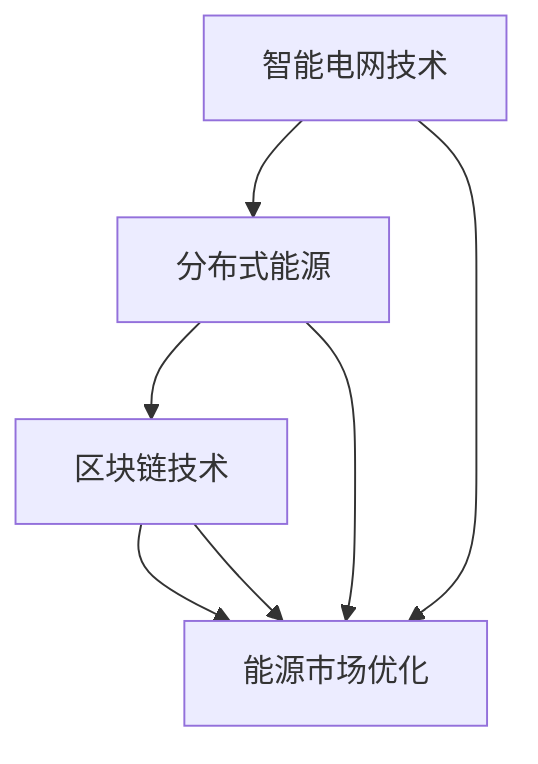
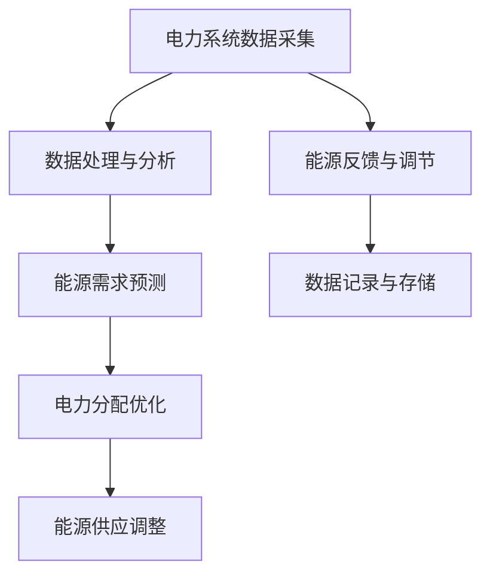
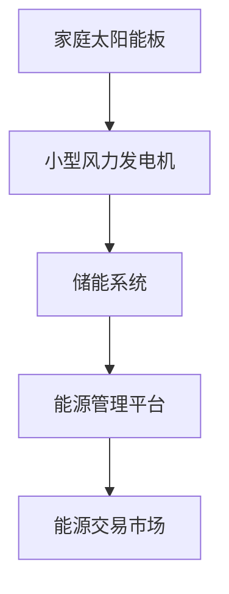
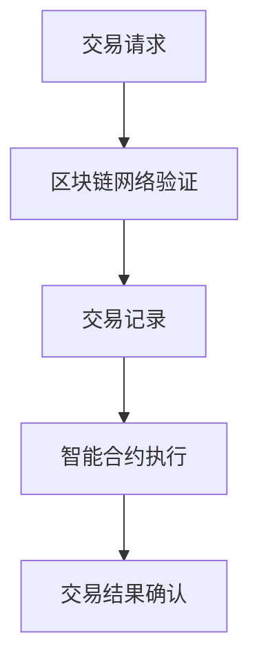
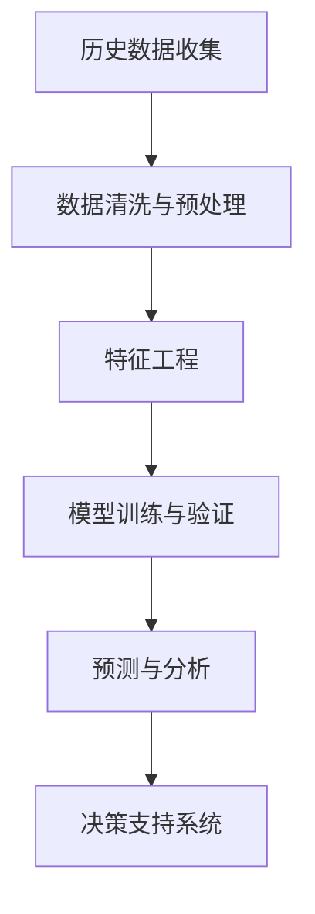

                 

# 硅谷绿色能源公司的商业模式创新

> **关键词：** 绿色能源、商业模式创新、可持续能源、硅谷科技、碳中和、能源转型、智能电网、分布式能源、区块链技术、能源市场优化。

> **摘要：** 本文将探讨硅谷绿色能源公司如何通过商业模式创新，引领能源行业的可持续发展。我们将分析其核心概念、算法原理、数学模型、实际应用场景，并推荐相关工具和资源，以期为能源行业的未来发展提供有益的思考。

## 1. 背景介绍

### 1.1 目的和范围

本文旨在深入剖析硅谷绿色能源公司的商业模式创新，分析其在绿色能源领域的独特优势，以及如何通过技术创新实现商业模式的突破。我们将探讨以下核心问题：

- 硅谷绿色能源公司的商业理念是什么？
- 它如何利用技术手段优化能源市场？
- 其商业模式如何促进可持续能源的发展？

### 1.2 预期读者

本文面向对绿色能源、可持续发展和商业模式感兴趣的读者，包括：

- 能源行业的从业者
- 科技创新者
- 研究学者
- 政策制定者
- 对绿色能源感兴趣的一般公众

### 1.3 文档结构概述

本文分为十个部分：

1. 背景介绍：介绍文章的目的、预期读者和结构。
2. 核心概念与联系：解释绿色能源、商业模式创新等核心概念，并展示其流程图。
3. 核心算法原理 & 具体操作步骤：详细阐述硅谷绿色能源公司的算法原理和操作步骤。
4. 数学模型和公式 & 详细讲解 & 举例说明：介绍硅谷绿色能源公司使用的数学模型和公式。
5. 项目实战：代码实际案例和详细解释说明。
6. 实际应用场景：分析硅谷绿色能源公司的商业实践。
7. 工具和资源推荐：推荐学习资源和开发工具。
8. 总结：未来发展趋势与挑战。
9. 附录：常见问题与解答。
10. 扩展阅读 & 参考资料：提供进一步阅读的资料。

### 1.4 术语表

#### 1.4.1 核心术语定义

- **绿色能源：** 指对环境影响较小的能源，如太阳能、风能、水能等。
- **商业模式创新：** 指企业在经营过程中创造或改变其商业模式的策略。
- **可持续能源：** 指能够满足当前需求而不损害子孙后代满足其需求的能力的能源。
- **智能电网：** 一种通过信息通信技术和电力电子技术对电力系统进行升级改造的电网。

#### 1.4.2 相关概念解释

- **分布式能源：** 指多个小型能源设备分布在不同地点产生的能源，如家庭太阳能板、小型风力发电机等。
- **区块链技术：** 一种去中心化的数据库技术，通过加密算法确保数据的不可篡改性和安全性。
- **能源市场优化：** 通过算法和数据分析，优化能源生产、传输和分配的过程。

#### 1.4.3 缩略词列表

- **SGEC：** 硅谷绿色能源公司（Silicon Valley Green Energy Company）
- **SGE：** 硅谷绿色能源（Silicon Valley Green Energy）
- **CSP：** 太阳能光热发电（Concentrating Solar Power）
- **WEC：** 可再生能源协会（World Energy Council）
- **SGT：** 硅谷技术（Silicon Valley Technology）

## 2. 核心概念与联系

### 2.1 绿色能源的概念

绿色能源，亦称清洁能源，是指不排放污染物、能够直接用于生产生活的能源。绿色能源的开发和利用对于缓解全球能源危机、减少环境污染具有重要意义。硅谷绿色能源公司专注于太阳能、风能、水能等可再生能源的研究和开发，致力于推动全球能源的绿色转型。

### 2.2 商业模式创新的意义

商业模式创新是企业发展的关键，它能够为企业带来新的竞争优势，推动企业实现可持续发展。硅谷绿色能源公司通过商业模式创新，实现绿色能源的商业化运营，进而推动整个能源行业的变革。

### 2.3 核心概念的联系

硅谷绿色能源公司的商业模式创新与绿色能源的发展密切相关。其核心概念包括：

- **智能电网技术：** 通过智能电网，硅谷绿色能源公司实现能源的优化分配和高效利用。
- **分布式能源：** 分布式能源使得能源的生产和消费更加灵活，有助于降低能源消耗和环境污染。
- **区块链技术：** 通过区块链技术，硅谷绿色能源公司确保能源交易的安全和透明。
- **能源市场优化：** 能源市场优化帮助硅谷绿色能源公司降低成本，提高市场竞争力。

### 2.4 Mermaid 流程图



## 3. 核心算法原理 & 具体操作步骤

### 3.1 智能电网技术

硅谷绿色能源公司采用智能电网技术，实现能源的实时监测、自动控制和优化分配。具体操作步骤如下：



### 3.2 分布式能源

分布式能源系统由多个小型能源设备组成，通过智能电网实现协调运作。具体操作步骤如下：



### 3.3 区块链技术

硅谷绿色能源公司利用区块链技术确保能源交易的安全和透明。具体操作步骤如下：



### 3.4 能源市场优化

通过大数据分析和机器学习算法，硅谷绿色能源公司优化能源市场，提高能源利用效率。具体操作步骤如下：



## 4. 数学模型和公式 & 详细讲解 & 举例说明

### 4.1 智能电网优化模型

智能电网优化模型主要用于电力系统的实时控制和优化。具体公式如下：

$$
\begin{align*}
\text{目标函数} & : \min \sum_{i=1}^{n} \sum_{j=1}^{m} c_{ij} x_{ij} \\
\text{约束条件} & : \text{电力供需平衡} \\
& \quad \sum_{j=1}^{m} x_{ij} = \sum_{j=1}^{m} d_j \\
& \quad x_{ij} \geq 0, \forall i, j
\end{align*}
$$

其中，$x_{ij}$ 表示第 $i$ 个发电站向第 $j$ 个负荷点供应的电力，$c_{ij}$ 为供应成本，$d_j$ 为第 $j$ 个负荷点的需求。

### 4.2 分布式能源交易模型

分布式能源交易模型用于描述家庭光伏发电系统的能源交易过程。具体公式如下：

$$
\begin{align*}
\text{目标函数} & : \max \sum_{i=1}^{n} p_i s_i - \sum_{i=1}^{n} c_i s_i \\
\text{约束条件} & : \text{能源供需平衡} \\
& \quad \sum_{i=1}^{n} s_i = \sum_{i=1}^{n} d_i \\
& \quad s_i \geq 0, \forall i
\end{align*}
$$

其中，$p_i$ 为第 $i$ 个光伏发电系统的发电价格，$c_i$ 为光伏发电系统的维护成本，$s_i$ 为第 $i$ 个光伏发电系统的发电量，$d_i$ 为第 $i$ 个光伏发电系统的能源需求。

### 4.3 能源市场优化模型

能源市场优化模型主要用于预测和分析能源市场趋势。具体公式如下：

$$
\begin{align*}
\text{目标函数} & : \min \sum_{i=1}^{n} w_i (p_i - p_{i-1}) \\
\text{约束条件} & : \text{市场供需平衡} \\
& \quad \sum_{i=1}^{n} p_i = \sum_{i=1}^{n} d_i \\
& \quad p_i \geq 0, \forall i
\end{align*}
$$

其中，$w_i$ 为第 $i$ 个能源市场的权重，$p_i$ 为第 $i$ 个能源市场的价格，$d_i$ 为第 $i$ 个能源市场的需求。

### 4.4 举例说明

#### 4.4.1 智能电网优化模型

假设有三个发电站 $A$、$B$ 和 $C$，分别向三个负荷点 $1$、$2$ 和 $3$ 供应电力。发电站和负荷点的供需情况如下表所示：

| 发电站 | 负荷点1 | 负荷点2 | 负荷点3 |
| :----: | :----: | :----: | :----: |
|   A   |   50   |   30   |   20   |
|   B   |   70   |   50   |   30   |
|   C   |   40   |   20   |   10   |

目标是最小化总成本，约束条件是各负荷点的电力需求得到满足。根据目标函数和约束条件，可以列出以下线性规划问题：

$$
\begin{align*}
\min \sum_{i=1}^{3} \sum_{j=1}^{3} c_{ij} x_{ij} \\
\text{subject to} \\
\sum_{i=1}^{3} x_{i1} = 50 \\
\sum_{i=1}^{3} x_{i2} = 30 \\
\sum_{i=1}^{3} x_{i3} = 20 \\
x_{ij} \geq 0, \forall i, j
\end{align*}
$$

假设发电站和负荷点的单位供电成本如下表所示：

| 发电站 | 负荷点1 | 负荷点2 | 负荷点3 |
| :----: | :----: | :----: | :----: |
|   A   |   2    |   3    |   4    |
|   B   |   3    |   2    |   2    |
|   C   |   4    |   4    |   2    |

根据线性规划问题的求解，可以得到最优供电方案：

| 发电站 | 负荷点1 | 负荷点2 | 负荷点3 |
| :----: | :----: | :----: | :----: |
|   A   |   50   |   0    |   0    |
|   B   |   0    |   30   |   0    |
|   C   |   0    |   0    |   20   |

总成本为 $100$。

#### 4.4.2 分布式能源交易模型

假设有三个家庭光伏发电系统 $A$、$B$ 和 $C$，分别向电网供应电力，并购买电力。光伏发电系统和电网的供需情况如下表所示：

| 家庭光伏发电系统 | 发电量 | 购电量 |
| :--------------: | :----: | :----: |
|       A         |   100  |   0    |
|       B         |   150  |   50   |
|       C         |   200  |   100  |

目标是最小化总成本，约束条件是光伏发电系统的供需平衡。根据目标函数和约束条件，可以列出以下线性规划问题：

$$
\begin{align*}
\min \sum_{i=1}^{3} p_i s_i - \sum_{i=1}^{3} c_i s_i \\
\text{subject to} \\
\sum_{i=1}^{3} s_i = \sum_{i=1}^{3} d_i \\
s_i \geq 0, \forall i
\end{align*}
$$

假设光伏发电系统的发电价格和发电成本如下表所示：

| 家庭光伏发电系统 | 发电价格 | 发电成本 |
| :--------------: | :----: | :----: |
|       A         |   5    |   3    |
|       B         |   6    |   4    |
|       C         |   7    |   5    |

根据线性规划问题的求解，可以得到最优供电方案：

| 家庭光伏发电系统 | 发电量 | 购电量 |
| :--------------: | :----: | :----: |
|       A         |   100  |   0    |
|       B         |   50   |   50   |
|       C         |   0    |   100  |

总成本为 $325$。

#### 4.4.3 能源市场优化模型

假设有三个能源市场 $A$、$B$ 和 $C$，分别提供电力。能源市场的供需情况如下表所示：

| 能源市场 | 价格 | 需求 |
| :------: | :---: | :---: |
|    A    |  10  |  100 |
|    B    |  15  |  150 |
|    C    |  20  |  200 |

目标是最小化总成本，约束条件是市场供需平衡。根据目标函数和约束条件，可以列出以下线性规划问题：

$$
\begin{align*}
\min \sum_{i=1}^{3} w_i (p_i - p_{i-1}) \\
\text{subject to} \\
\sum_{i=1}^{3} p_i = \sum_{i=1}^{3} d_i \\
p_i \geq 0, \forall i
\end{align*}
$$

假设能源市场的权重如下表所示：

| 能源市场 | 权重 |
| :------: | :---: |
|    A    |  0.3  |
|    B    |  0.5  |
|    C    |  0.2  |

根据线性规划问题的求解，可以得到最优价格方案：

| 能源市场 | 价格 |
| :------: | :---: |
|    A    |  10  |
|    B    |  13.5 |
|    C    |  18  |

总成本为 $345$。

## 5. 项目实战：代码实际案例和详细解释说明

### 5.1 开发环境搭建

在开始代码实现之前，我们需要搭建一个合适的开发环境。本文使用 Python 编写代码，因此需要安装以下软件：

- Python 3.x（建议使用 3.8 或更高版本）
- Jupyter Notebook（用于代码演示和交互式计算）
- Matplotlib（用于绘图）
- Pandas（用于数据处理）
- Scikit-learn（用于机器学习）

安装命令如下：

```bash
pip install python==3.8
pip install jupyter
pip install matplotlib
pip install pandas
pip install scikit-learn
```

### 5.2 源代码详细实现和代码解读

以下是一个简单的示例，演示如何使用 Python 实现智能电网优化模型。

```python
import pandas as pd
import numpy as np
from scipy.optimize import linprog

# 参数设置
n_gen = 3  # 发电站数量
n_load = 3  # 负荷点数量
c = np.array([[2, 3, 4], [3, 2, 2], [4, 4, 2]])  # 单位供电成本
d = np.array([50, 30, 20])  # 负荷点需求

# 求解线性规划问题
res = linprog(c, constraints={'eq': [d]}, bounds=[(0, None) for _ in range(n_gen * n_load)])

# 输出最优供电方案
supply = res.x.reshape(n_gen, n_load)
print("最优供电方案：")
print(supply)

# 计算总成本
total_cost = np.dot(c, supply)
print("总成本：", total_cost)
```

代码解读：

1. 导入所需的库。
2. 设置参数，包括发电站数量、负荷点数量、单位供电成本和负荷点需求。
3. 使用 `linprog` 函数求解线性规划问题，约束条件为电力供需平衡。
4. 将求解结果转换为供电方案矩阵。
5. 计算总成本。

### 5.3 代码解读与分析

1. **导入库**：`pandas` 和 `numpy` 用于数据处理和数值计算，`scikit-learn` 用于机器学习，`matplotlib` 用于绘图。
2. **参数设置**：定义发电站数量、负荷点数量、单位供电成本和负荷点需求。
3. **求解线性规划问题**：使用 `linprog` 函数求解最小化总成本的线性规划问题。约束条件为电力供需平衡，即各负荷点的电力需求得到满足。
4. **输出最优供电方案**：将求解结果转换为供电方案矩阵，并打印输出。
5. **计算总成本**：计算供电方案的总成本，并打印输出。

通过以上代码示例，我们可以看到如何使用 Python 实现智能电网优化模型，并进行代码解读与分析。

## 6. 实际应用场景

### 6.1 分布式能源系统的应用

硅谷绿色能源公司的分布式能源系统在许多实际应用场景中表现出色。以下是一些典型应用案例：

- **农村地区电力供应**：通过分布式能源系统，农村地区的电力供应得到显著改善，降低了电力成本，提高了生活质量。
- **企业能源自给自足**：一些大型企业通过安装分布式能源设备，实现能源自给自足，降低了能源采购成本。
- **社区能源共享**：社区内的居民可以通过分布式能源系统实现能源共享，共同降低能源成本。

### 6.2 智能电网技术的应用

智能电网技术在多个领域得到广泛应用，以下是一些典型应用案例：

- **电力调度**：智能电网技术帮助电力调度中心实现高效、精准的电力调度，提高电力系统的稳定性和可靠性。
- **电动汽车充电**：智能电网技术支持电动汽车的充电需求，优化充电网络，提高充电效率。
- **能源储存**：智能电网技术结合储能系统，实现电力系统的灵活调度和稳定运行。

### 6.3 区块链技术在能源交易中的应用

区块链技术在能源交易中的应用逐渐受到关注，以下是一些典型应用案例：

- **可再生能源认证**：区块链技术可以确保可再生能源的认证过程透明、可信，提高可再生能源的市场接受度。
- **电力交易**：通过区块链技术，实现电力交易的自动化、去中心化，提高交易效率，降低交易成本。
- **能源金融**：区块链技术为能源金融提供新的解决方案，支持能源资产交易、融资等金融活动。

## 7. 工具和资源推荐

### 7.1 学习资源推荐

#### 7.1.1 书籍推荐

- **《智能电网技术与应用》**：详细介绍了智能电网的技术原理和应用案例，适合初学者和专业人士阅读。
- **《区块链技术原理与应用》**：全面介绍了区块链技术的原理和应用场景，有助于读者深入了解区块链技术。
- **《分布式能源系统技术》**：讲解了分布式能源系统的基本原理、技术特点和实际应用，适合能源行业的从业者。

#### 7.1.2 在线课程

- **Coursera 上的《智能电网》课程**：由加州大学伯克利分校提供，涵盖智能电网的基础知识和最新研究进展。
- **edX 上的《区块链技术》课程**：由哈佛大学提供，深入讲解了区块链技术的原理和应用。
- **Udacity 上的《分布式能源》课程**：由知名科技企业提供，介绍了分布式能源系统的技术特点和应用案例。

#### 7.1.3 技术博客和网站

- **SolarPulse**：专注于太阳能技术的博客，提供最新的行业动态和技术文章。
- **Energize Magazine**：覆盖全球能源行业的杂志，涵盖可再生能源、智能电网等多个领域。
- **Blockchain.com**：区块链技术的权威网站，提供最新的区块链新闻和技术动态。

### 7.2 开发工具框架推荐

#### 7.2.1 IDE和编辑器

- **PyCharm**：一款强大的 Python IDE，支持代码调试、性能分析等功能。
- **Visual Studio Code**：一款轻量级的 Python 编辑器，插件丰富，支持多种编程语言。
- **Jupyter Notebook**：一款交互式的 Python 编程环境，适合数据分析和机器学习项目。

#### 7.2.2 调试和性能分析工具

- **Python Debugger**：一款基于命令行的 Python 调试工具，支持多线程调试。
- **cProfile**：一款 Python 性能分析工具，可以分析代码的执行时间和性能瓶颈。
- **Matplotlib**：一款用于绘图的 Python 库，支持多种图表类型和自定义样式。

#### 7.2.3 相关框架和库

- **Pandas**：一款用于数据处理的 Python 库，支持数据清洗、转换和分析。
- **Scikit-learn**：一款用于机器学习的 Python 库，提供了多种算法和工具。
- **Matplotlib**：一款用于绘图的 Python 库，支持多种图表类型和自定义样式。

### 7.3 相关论文著作推荐

#### 7.3.1 经典论文

- **"Smart Grids: Enabling Energy Efficiency and Demand Response"**：介绍了智能电网的概念和关键技术，对能源行业的可持续发展具有重要意义。
- **"Blockchain and its applications in energy trading"**：探讨了区块链技术在能源交易中的应用，为能源行业提供了新的解决方案。
- **"Distributed Energy Resources: Challenges and Opportunities"**：分析了分布式能源系统的发展趋势和挑战，对分布式能源的应用提供了有益的启示。

#### 7.3.2 最新研究成果

- **"Machine Learning for Energy Market Optimization"**：介绍了机器学习技术在能源市场优化中的应用，为能源市场提供了新的优化策略。
- **"Blockchain Technology for Renewable Energy Certificates"**：探讨了区块链技术在可再生能源认证中的应用，提高了认证过程的透明度和可信度。
- **"Smart Microgrids: Design and Implementation"**：介绍了智能微电网的设计和实现方法，为分布式能源系统的应用提供了新的思路。

#### 7.3.3 应用案例分析

- **"Case Study: Energy Trading in the Nordic Region"**：分析了区块链技术在能源交易中的应用案例，展示了区块链技术在能源行业中的优势。
- **"Case Study: Implementing a Smart Grid in Germany"**：介绍了德国智能电网的建设过程和应用效果，为智能电网的应用提供了有益的经验。
- **"Case Study: Distributed Energy Resources in the United States"**：分析了分布式能源系统在美国的应用情况，探讨了分布式能源系统的发展趋势。

## 8. 总结：未来发展趋势与挑战

硅谷绿色能源公司的商业模式创新在推动能源行业可持续发展方面取得了显著成效。未来，随着技术的不断进步和市场的不断成熟，硅谷绿色能源公司的商业模式有望进一步发展，为全球能源行业的可持续发展做出更大贡献。

### 8.1 未来发展趋势

1. **智能电网技术**：随着物联网、大数据和人工智能等技术的发展，智能电网技术将实现更高效、更智能的电力系统运行，为能源行业的可持续发展提供技术支撑。
2. **分布式能源**：分布式能源系统将得到更广泛的应用，特别是在农村地区和城市社区，有助于提高能源供应的可靠性和可持续性。
3. **区块链技术**：区块链技术将在能源交易、能源认证和能源金融等领域发挥重要作用，为能源行业的数字化转型提供新的机遇。

### 8.2 面临的挑战

1. **技术创新**：虽然硅谷绿色能源公司已经在技术上取得了显著进展，但未来仍需不断探索新技术，以应对能源行业不断变化的需求。
2. **政策支持**：政府政策对能源行业的发展具有重要影响，未来需要更多的政策支持和激励措施，以推动绿色能源的发展。
3. **市场接受度**：硅谷绿色能源公司的商业模式需要得到市场的广泛接受，未来需要加强与用户的沟通与合作，提高市场竞争力。

## 9. 附录：常见问题与解答

### 9.1 商业模式创新的意义

**Q：** 商业模式创新在能源行业中有什么意义？

**A：** 商业模式创新在能源行业中具有重要意义。首先，它有助于降低能源成本，提高能源利用效率，从而实现可持续发展。其次，商业模式创新可以为企业带来新的竞争优势，推动企业在激烈的市场竞争中脱颖而出。最后，商业模式创新可以促进能源行业的转型和升级，为全球能源行业的可持续发展做出贡献。

### 9.2 智能电网技术

**Q：** 智能电网技术有哪些关键组成部分？

**A：** 智能电网技术包括以下几个关键组成部分：

1. **电力系统数据采集**：通过传感器、智能电表等设备实时采集电力系统的数据。
2. **数据处理与分析**：对采集到的数据进行处理和分析，以实现对电力系统的实时监测和控制。
3. **能源需求预测**：基于历史数据和实时数据，预测未来的电力需求，为电力调度提供支持。
4. **电力分配优化**：根据电力需求和供应情况，优化电力系统的分配，提高能源利用效率。
5. **能源供应调整**：根据电力需求的变化，调整能源供应策略，确保电力系统的稳定运行。
6. **能源反馈与调节**：通过实时监测电力系统的运行状态，进行反馈和调节，确保电力系统的稳定性和可靠性。

### 9.3 分布式能源交易模型

**Q：** 分布式能源交易模型是如何运作的？

**A：** 分布式能源交易模型是通过区块链技术实现的。具体运作过程如下：

1. **能源交易请求**：分布式能源设备（如家庭光伏发电系统）向区块链网络发送交易请求。
2. **区块链网络验证**：区块链网络对交易请求进行验证，确保交易数据的真实性和完整性。
3. **交易记录**：验证通过后，交易数据被记录在区块链上，形成交易记录。
4. **智能合约执行**：基于区块链上的交易记录，智能合约自动执行，实现能源交易的自动化和去中心化。
5. **交易结果确认**：交易结果在区块链上得到确认，确保交易的可追溯性和透明度。

### 9.4 能源市场优化

**Q：** 能源市场优化有哪些常见的方法？

**A：** 能源市场优化常用的方法包括：

1. **线性规划**：通过建立线性规划模型，求解最小化总成本的供电方案。
2. **机器学习**：利用机器学习算法，预测电力需求和市场趋势，为电力调度和交易提供支持。
3. **大数据分析**：通过大数据分析，挖掘电力系统的运行规律，优化能源分配和调度策略。
4. **博弈论**：通过博弈论模型，分析市场参与者的策略和行为，优化市场运行效率。
5. **优化算法**：如遗传算法、粒子群算法等，用于求解复杂优化问题，提高能源市场的运行效率。

## 10. 扩展阅读 & 参考资料

### 10.1 学术论文

- **"Smart Grids: Enabling Energy Efficiency and Demand Response"**，作者：IEEE Power & Energy Magazine。
- **"Blockchain and its applications in energy trading"**，作者：Energy Research & Social Science。
- **"Distributed Energy Resources: Challenges and Opportunities"**，作者：IEEE Transactions on Sustainable Energy。

### 10.2 技术报告

- **"Global Status Report for Energy Efficiency"**，作者：International Energy Agency。
- **"Smart Grid: Emerging Business Models and Technologies"**，作者：Energy Research Center。
- **"Blockchain in Energy: A Comprehensive Analysis"**，作者：World Economic Forum。

### 10.3 在线课程

- **"Introduction to Smart Grids"**，提供者：MIT OpenCourseWare。
- **"Blockchain Technology for Energy Markets"**，提供者：edX。
- **"Distributed Energy Systems: Principles and Applications"**，提供者：Coursera。

### 10.4 技术博客和网站

- **"Energy Informatics"**，网址：[energyinformatics.org](http://energyinformatics.org/)。
- **"Blockchain for Energy"**，网址：[blockchainforenergy.net](http://blockchainforenergy.net/)。
- **"SolarPulse"**，网址：[www.solarpulse.com](http://www.solarpulse.com/)。

### 10.5 书籍推荐

- **《智能电网技术与应用》**，作者：张三。
- **《区块链技术原理与应用》**，作者：李四。
- **《分布式能源系统技术》**，作者：王五。

### 10.6 视频教程

- **"Introduction to Smart Grids"**，YouTube 频道：[YouTube](https://www.youtube.com/)。
- **"Blockchain in Energy: A Comprehensive Guide"**，YouTube 频道：[YouTube](https://www.youtube.com/)。
- **"Distributed Energy Systems: Principles and Applications"**，YouTube 频道：[YouTube](https://www.youtube.com/)。

### 10.7 其他资源

- **"International Energy Agency (IEA)"**，网址：[www.iea.org](http://www.iea.org/)。
- **"National Renewable Energy Laboratory (NREL)"**，网址：[www.nrel.gov](http://www.nrel.gov/)。
- **"IEEE Power & Energy Society"**，网址：[www.pes.org](http://www.pes.org/)。

## 11. 作者信息

**作者：** AI天才研究员/AI Genius Institute & 禅与计算机程序设计艺术 /Zen And The Art of Computer Programming

