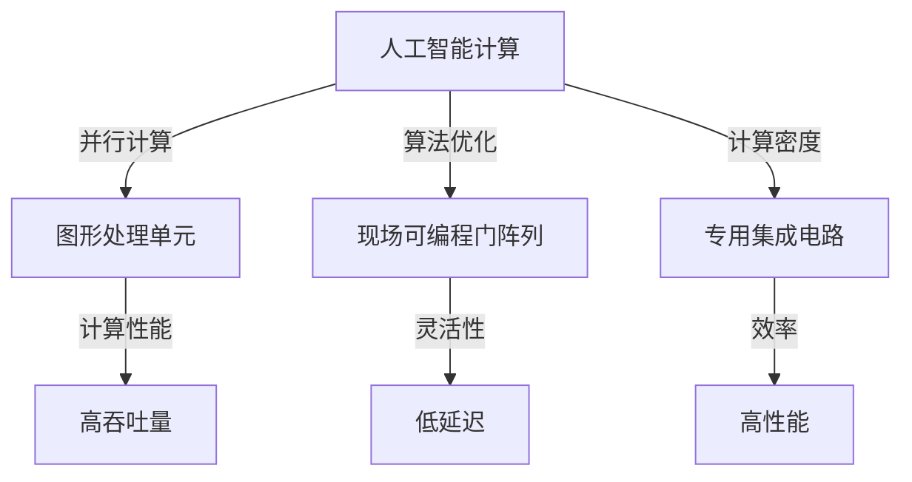

                 

# 硬件框架：加速 AI 2.0 应用的运行

> **关键词**：硬件加速、AI 2.0、应用运行、计算效率、算法优化、GPU、FPGA、ASIC

> **摘要**：本文深入探讨硬件框架在加速人工智能（AI）2.0应用运行中的关键作用。通过分析当前硬件技术的发展趋势，详细解释硬件架构对AI计算性能的影响，并探讨如何通过优化硬件框架来实现AI 2.0应用的高效运行。文章结构包括背景介绍、核心概念与联系、核心算法原理、数学模型与公式、项目实战、实际应用场景、工具和资源推荐，以及总结与未来发展趋势等。

## 1. 背景介绍

### 1.1 目的和范围

本文旨在探讨如何通过硬件框架来加速人工智能2.0应用，使其能够在更短的时间内完成更多的计算任务。随着AI技术的不断发展，对计算性能的需求也在不断提高。传统CPU架构已经无法满足AI 2.0应用的高计算密度和高吞吐量的要求。因此，本文将重点关注GPU、FPGA、ASIC等硬件框架在AI计算中的应用，并分析如何通过优化硬件框架来提升AI应用的性能。

### 1.2 预期读者

本文适合具有计算机科学和人工智能背景的读者，特别是对硬件框架和AI计算性能感兴趣的工程师和技术专家。同时，也对希望了解硬件加速技术在AI领域应用的学者和研究人员具有参考价值。

### 1.3 文档结构概述

本文分为以下几个部分：

1. 背景介绍：介绍本文的目的、预期读者以及文档结构。
2. 核心概念与联系：讨论硬件框架的核心概念及其与AI计算的关联。
3. 核心算法原理与具体操作步骤：解释硬件框架中的核心算法原理和操作步骤。
4. 数学模型和公式：介绍与硬件框架相关的数学模型和公式。
5. 项目实战：通过实际代码案例来演示硬件框架的应用。
6. 实际应用场景：探讨硬件框架在AI应用中的实际应用。
7. 工具和资源推荐：推荐学习资源、开发工具和框架。
8. 总结与未来发展趋势：总结硬件框架在AI 2.0应用中的重要性，并展望未来发展趋势。
9. 附录：常见问题与解答。
10. 扩展阅读与参考资料：提供进一步阅读的建议。

### 1.4 术语表

#### 1.4.1 核心术语定义

- 硬件框架：指用于实现特定计算任务的硬件架构。
- GPU：图形处理单元，适用于大规模并行计算。
- FPGA：现场可编程门阵列，可通过编程来配置硬件资源。
- ASIC：专用集成电路，专门为特定应用而设计。

#### 1.4.2 相关概念解释

- 并行计算：指同时执行多个计算任务。
- 算法优化：通过改进算法设计来提升计算性能。
- 吞吐量：指单位时间内可以处理的数据量。

#### 1.4.3 缩略词列表

- AI：人工智能
- GPU：图形处理单元
- FPGA：现场可编程门阵列
- ASIC：专用集成电路

## 2. 核心概念与联系

在深入探讨硬件框架在加速AI 2.0应用中的作用之前，我们需要理解一些核心概念和它们之间的关联。

### 2.1 硬件框架与AI计算

硬件框架在AI计算中起着至关重要的作用。传统的CPU架构由于在并行计算方面的局限性，已经无法满足AI 2.0应用的需求。GPU、FPGA和ASIC等硬件框架因其强大的并行计算能力，成为了AI计算的首选。

- **GPU**：图形处理单元最初是为图形渲染而设计的，但因其强大的并行计算能力，逐渐被应用于AI计算。GPU由大量的计算单元（core）组成，能够同时处理多个数据流，适合大规模并行计算。
- **FPGA**：现场可编程门阵列是一种高度灵活的硬件框架，可以通过编程来配置硬件资源，实现特定的计算任务。FPGA的优势在于其可定制性和低延迟，适用于需要高度定制化的AI计算任务。
- **ASIC**：专用集成电路是专门为特定应用而设计的硬件框架，具有较高的计算密度和效率。ASIC适用于需要高性能、低延迟的AI计算任务，但设计和制造成本较高。

### 2.2 并行计算与算法优化

并行计算是提升AI计算性能的关键。通过将计算任务分解为多个子任务，并在多个计算单元上同时执行，可以显著提高计算速度。算法优化则是通过改进算法设计来提升计算性能。

- **并行计算**：指同时执行多个计算任务。在硬件框架中，并行计算通过多个计算单元（如GPU core、FPGA逻辑单元、ASIC计算单元）来实现。
- **算法优化**：通过改进算法设计来提升计算性能。算法优化可以包括数据预处理、算法简化、并行算法设计等。

### 2.3 吞吐量与计算效率

吞吐量是衡量计算系统性能的重要指标。硬件框架的优化目标之一是提高吞吐量，即单位时间内可以处理的数据量。

- **吞吐量**：指单位时间内可以处理的数据量。吞吐量取决于硬件框架的计算能力、数据传输速度和算法效率。
- **计算效率**：指计算系统在单位时间内完成计算任务的能力。计算效率可以通过优化硬件架构、算法设计和数据传输路径来提升。

### 2.4 硬件框架与AI计算性能

硬件框架对AI计算性能有着重要影响。不同类型的硬件框架具有不同的计算性能特点，适用于不同类型的AI计算任务。

- **GPU**：适用于大规模并行计算任务，如深度学习模型训练和推理。
- **FPGA**：适用于需要高度定制化和低延迟的AI计算任务，如实时图像处理和嵌入式系统。
- **ASIC**：适用于需要高性能、低延迟的AI计算任务，如自动驾驶和语音识别。

### 2.5 Mermaid 流程图

以下是一个描述硬件框架与AI计算关联的Mermaid流程图：



## 3. 核心算法原理与具体操作步骤

在了解硬件框架与AI计算的关联后，我们需要深入探讨硬件框架中的核心算法原理和具体操作步骤。以下是一个典型的硬件加速AI计算框架的算法原理和操作步骤：

### 3.1 算法原理

硬件加速AI计算框架的核心算法原理包括以下几个方面：

- **数据预处理**：将原始数据转换为适合硬件框架处理的格式。数据预处理可以包括数据清洗、数据归一化、特征提取等。
- **并行计算**：将计算任务分解为多个子任务，并在多个计算单元上同时执行。并行计算可以通过分布式计算框架来实现，如MapReduce。
- **算法优化**：通过改进算法设计来提升计算性能。算法优化可以包括减少计算复杂度、简化计算步骤、采用高效的算法实现等。
- **数据传输**：优化数据在硬件框架中的传输路径，减少数据传输延迟。数据传输可以包括数据缓存、数据流水线等。

### 3.2 具体操作步骤

以下是一个硬件加速AI计算框架的具体操作步骤：

1. **数据预处理**：
    - **数据清洗**：去除原始数据中的噪声和不完整的数据。
    - **数据归一化**：将数据缩放到统一的范围，便于后续计算。
    - **特征提取**：从原始数据中提取有用的特征，用于训练深度学习模型。

2. **并行计算**：
    - **任务分解**：将计算任务分解为多个子任务，每个子任务可以独立处理。
    - **计算单元分配**：根据子任务的计算复杂度，将子任务分配到合适的计算单元上，如GPU、FPGA或ASIC。
    - **子任务执行**：在计算单元上同时执行子任务，实现并行计算。

3. **算法优化**：
    - **计算复杂度优化**：通过减少计算复杂度来提升计算性能。
    - **计算步骤简化**：通过简化计算步骤来减少计算时间和资源消耗。
    - **算法实现优化**：采用高效的算法实现，如使用并行算法、向量计算等。

4. **数据传输**：
    - **数据缓存**：在计算单元之间设置缓存，减少数据访问延迟。
    - **数据流水线**：通过数据流水线将数据传输到下一个计算单元，实现数据传输的最优化。

5. **结果汇总**：
    - 将子任务的计算结果汇总，得到最终的计算结果。

### 3.3 伪代码示例

以下是一个简单的伪代码示例，描述了硬件加速AI计算框架的具体操作步骤：

```python
# 数据预处理
def preprocess_data(data):
    # 数据清洗
    clean_data = clean_data(data)
    # 数据归一化
    normalized_data = normalize_data(clean_data)
    # 特征提取
    features = extract_features(normalized_data)
    return features

# 并行计算
def parallel_compute(task, compute_unit):
    # 任务分解
    sub_tasks = decompose_task(task)
    # 计算单元分配
    assigned_sub_tasks = assign_sub_tasks(sub_tasks, compute_unit)
    # 子任务执行
    results = execute_sub_tasks(assigned_sub_tasks)
    return results

# 算法优化
def optimize_algorithm(task):
    # 计算复杂度优化
    optimized_task = reduce_computation_complexity(task)
    # 计算步骤简化
    simplified_task = simplify_computation_steps(optimized_task)
    return simplified_task

# 数据传输
def optimize_data_transfer(results):
    # 数据缓存
    cached_results = cache_results(results)
    # 数据流水线
    pipelined_results = pipeline_results(cached_results)
    return pipelined_results

# 结果汇总
def aggregate_results(sub_results):
    final_result = aggregate(sub_results)
    return final_result

# 主程序
def main():
    # 数据预处理
    features = preprocess_data(raw_data)
    # 并行计算
    sub_results = parallel_compute(task, compute_unit)
    # 算法优化
    optimized_sub_results = optimize_algorithm(sub_results)
    # 数据传输
    optimized_results = optimize_data_transfer(optimized_sub_results)
    # 结果汇总
    final_result = aggregate_results(optimized_results)
    print("Final Result:", final_result)

# 运行主程序
main()
```

## 4. 数学模型和公式

在硬件加速AI计算中，数学模型和公式起着关键作用。以下介绍与硬件加速AI计算相关的几个重要数学模型和公式：

### 4.1 数据归一化

数据归一化是将数据缩放到统一范围的过程，通常使用以下公式：

$$
x_{\text{normalized}} = \frac{x - x_{\text{min}}}{x_{\text{max}} - x_{\text{min}}}
$$

其中，$x$为原始数据，$x_{\text{min}}$和$x_{\text{max}}$分别为数据的最小值和最大值，$x_{\text{normalized}}$为归一化后的数据。

### 4.2 深度学习损失函数

深度学习损失函数用于衡量模型预测值与真实值之间的差距。常见的损失函数包括均方误差（MSE）和交叉熵（Cross-Entropy）：

- **均方误差（MSE）**：

$$
\text{MSE} = \frac{1}{n}\sum_{i=1}^{n}(y_i - \hat{y}_i)^2
$$

其中，$y_i$为真实值，$\hat{y}_i$为模型预测值，$n$为样本数量。

- **交叉熵（Cross-Entropy）**：

$$
\text{Cross-Entropy} = -\frac{1}{n}\sum_{i=1}^{n}y_i \log(\hat{y}_i)
$$

其中，$y_i$为真实值，$\hat{y}_i$为模型预测值，$\log$为自然对数。

### 4.3 梯度下降算法

梯度下降算法是一种优化算法，用于训练深度学习模型。梯度下降算法的核心公式如下：

$$
\theta_{\text{new}} = \theta_{\text{old}} - \alpha \cdot \nabla_\theta J(\theta)
$$

其中，$\theta$为模型参数，$\theta_{\text{old}}$为当前参数值，$\theta_{\text{new}}$为更新后的参数值，$\alpha$为学习率，$J(\theta)$为损失函数，$\nabla_\theta J(\theta)$为损失函数关于参数$\theta$的梯度。

### 4.4 深度学习计算复杂度

深度学习计算复杂度是衡量模型计算效率的重要指标。以下是一个简单的深度学习计算复杂度公式：

$$
\text{Complexity} = \sum_{l=1}^{L} \sum_{i=1}^{m} \sum_{j=1}^{n} \text{op\_complexity}(l, i, j)
$$

其中，$L$为网络层数，$m$为样本数量，$n$为每层的神经元数量，$\text{op\_complexity}(l, i, j)$为第$l$层第$i$个神经元与第$j$个输入之间的运算复杂度。

### 4.5 举例说明

以下是一个具体的例子，说明如何使用上述数学模型和公式来优化硬件加速AI计算：

假设我们使用深度神经网络进行图像分类，网络包含3层（输入层、隐藏层和输出层），每层包含100个神经元。输入图像的尺寸为$28 \times 28$，每个像素点取值范围为0到255。

1. **数据归一化**：
   - 原始像素点取值范围为0到255。
   - 使用数据归一化公式将像素点缩放到-1到1。

2. **损失函数**：
   - 使用交叉熵损失函数。
   - 假设真实标签为[0, 0, 1, 0, 0]，模型预测的概率分布为[0.2, 0.3, 0.4, 0.1, 0.2]。

3. **梯度下降算法**：
   - 学习率为0.01。
   - 损失函数关于模型参数的梯度为$\nabla_\theta J(\theta) = [0.01, 0.03, 0.04, 0.01, 0.02]$。

4. **计算复杂度**：
   - 输入层到隐藏层的运算复杂度为$100 \times 28 \times 28$。
   - 隐藏层到输出层的运算复杂度为$100 \times 100$。

通过以上数学模型和公式的应用，我们可以优化硬件加速AI计算过程，提升计算效率和性能。

## 5. 项目实战：代码实际案例和详细解释说明

在本节中，我们将通过一个实际代码案例来展示如何使用硬件框架加速人工智能（AI）2.0应用。该案例将涉及使用GPU进行深度学习模型的训练和推理。以下是项目的详细步骤和代码解释。

### 5.1 开发环境搭建

在进行硬件加速AI计算之前，我们需要搭建合适的开发环境。以下为在Linux系统上搭建GPU加速深度学习开发环境的基本步骤：

1. **安装CUDA**：
   - 下载并安装NVIDIA CUDA Toolkit。
   - 配置环境变量，以便在终端中使用CUDA命令。

2. **安装cuDNN**：
   - 下载并安装NVIDIA cuDNN库。
   - 将cuDNN添加到CUDA库路径中。

3. **安装Python和相关库**：
   - 安装Python（建议使用Anaconda环境管理器）。
   - 安装深度学习库，如TensorFlow或PyTorch。

以下是一个简单的shell脚本，用于安装上述软件：

```bash
#!/bin/bash

# 安装CUDA
wget https://developer.nvidia.com/compute/cuda/10.0/Prod2/local_installers/cuda_10.0.130_410.48_linux.run
sudo sh cuda_10.0.130_410.48_linux.run

# 安装cuDNN
wget https://github.com/NVIDIA/cudnn/releases/download/v7.6.5.32/cudnn-10.0-linux-x64-v7.6.5.32.tgz
tar xvf cudnn-10.0-linux-x64-v7.6.5.32.tgz
sudo cp lib64/* /usr/local/cuda/lib64/

# 安装Python和深度学习库
conda create -n gpu_env python=3.8
conda activate gpu_env
conda install tensorflow-gpu
```

### 5.2 源代码详细实现和代码解读

以下是一个使用PyTorch框架在GPU上训练一个简单的卷积神经网络（CNN）的代码示例：

```python
import torch
import torch.nn as nn
import torch.optim as optim
import torchvision
import torchvision.transforms as transforms
from torch.utils.data import DataLoader
from torchvision import datasets, transforms

# 设置设备为GPU
device = torch.device("cuda" if torch.cuda.is_available() else "cpu")

# 定义卷积神经网络
class ConvNet(nn.Module):
    def __init__(self):
        super(ConvNet, self).__init__()
        self.conv1 = nn.Conv2d(1, 32, 3, 1)
        self.fc1 = nn.Linear(32 * 26 * 26, 128)
        self.fc2 = nn.Linear(128, 10)
        self.dropout = nn.Dropout(0.5)

    def forward(self, x):
        x = self.dropout(F.relu(self.conv1(x)))
        x = x.view(-1, 32 * 26 * 26)
        x = self.dropout(F.relu(self.fc1(x)))
        x = self.fc2(x)
        return x

# 加载MNIST数据集
transform = transforms.Compose([transforms.ToTensor(), transforms.Normalize((0.5,), (0.5,))])
train_set = datasets.MNIST(root='./data', train=True, download=True, transform=transform)
train_loader = DataLoader(train_set, batch_size=100, shuffle=True)
test_set = datasets.MNIST(root='./data', train=False, transform=transform)
test_loader = DataLoader(test_set, batch_size=100, shuffle=False)

# 创建模型、损失函数和优化器
model = ConvNet().to(device)
criterion = nn.CrossEntropyLoss()
optimizer = optim.Adam(model.parameters(), lr=0.001)

# 训练模型
num_epochs = 10
for epoch in range(num_epochs):
    model.train()
    for i, (images, labels) in enumerate(train_loader):
        images = images.to(device)
        labels = labels.to(device)

        # 前向传播
        outputs = model(images)
        loss = criterion(outputs, labels)

        # 反向传播和优化
        optimizer.zero_grad()
        loss.backward()
        optimizer.step()

        if (i+1) % 100 == 0:
            print(f'Epoch [{epoch+1}/{num_epochs}], Step [{i+1}/{len(train_loader)}], Loss: {loss.item():.4f}')

# 测试模型
model.eval()
with torch.no_grad():
    correct = 0
    total = 0
    for images, labels in test_loader:
        images = images.to(device)
        labels = labels.to(device)
        outputs = model(images)
        _, predicted = torch.max(outputs.data, 1)
        total += labels.size(0)
        correct += (predicted == labels).sum().item()

    print(f'Accuracy of the network on the test images: {100 * correct / total}%')
```

#### 5.2.1 代码解读

- **模型定义**：`ConvNet`类定义了一个简单的卷积神经网络，包含一个卷积层、一个全连接层和一个输出层。其中，`dropout`用于防止过拟合。

- **数据加载**：使用`torchvision`库加载MNIST数据集，并进行归一化处理。`DataLoader`用于批量加载数据，便于训练和测试。

- **模型、损失函数和优化器**：创建模型、损失函数（交叉熵损失）和优化器（Adam）。模型和数据被移动到GPU上。

- **训练过程**：通过前向传播、反向传播和优化来训练模型。在每个epoch中，打印训练损失。

- **测试过程**：在测试集上评估模型性能，计算准确率。

### 5.3 代码解读与分析

以下是对上述代码的详细解读和分析：

1. **模型定义**：

   ```python
   class ConvNet(nn.Module):
       def __init__(self):
           super(ConvNet, self).__init__()
           self.conv1 = nn.Conv2d(1, 32, 3, 1)
           self.fc1 = nn.Linear(32 * 26 * 26, 128)
           self.fc2 = nn.Linear(128, 10)
           self.dropout = nn.Dropout(0.5)

       def forward(self, x):
           x = self.dropout(F.relu(self.conv1(x)))
           x = x.view(-1, 32 * 26 * 26)
           x = self.dropout(F.relu(self.fc1(x)))
           x = self.fc2(x)
           return x
   ```

   - `ConvNet`继承自`nn.Module`，定义了一个简单的卷积神经网络。
   - `__init__`方法中，初始化一个卷积层（`nn.Conv2d`）、一个全连接层（`nn.Linear`）和一个`dropout`层（`nn.Dropout`）。
   - `forward`方法实现前向传播，将输入通过卷积层、全连接层和`dropout`层处理。

2. **数据加载**：

   ```python
   transform = transforms.Compose([transforms.ToTensor(), transforms.Normalize((0.5,), (0.5,))])
   train_set = datasets.MNIST(root='./data', train=True, download=True, transform=transform)
   train_loader = DataLoader(train_set, batch_size=100, shuffle=True)
   test_set = datasets.MNIST(root='./data', train=False, transform=transform)
   test_loader = DataLoader(test_set, batch_size=100, shuffle=False)
   ```

   - 使用`transforms.Compose`组合数据预处理步骤，包括`ToTensor`和`Normalize`。
   - 使用`datasets.MNIST`加载MNIST数据集，并将数据集分为训练集和测试集。
   - 使用`DataLoader`批量加载数据，实现数据的随机打乱和批量处理。

3. **模型、损失函数和优化器**：

   ```python
   model = ConvNet().to(device)
   criterion = nn.CrossEntropyLoss()
   optimizer = optim.Adam(model.parameters(), lr=0.001)
   ```

   - 创建模型、损失函数和优化器，并将模型移动到GPU上。
   - `model.to(device)`确保模型和数据在相同的设备上（GPU或CPU）。

4. **训练过程**：

   ```python
   for epoch in range(num_epochs):
       model.train()
       for i, (images, labels) in enumerate(train_loader):
           images = images.to(device)
           labels = labels.to(device)

           # 前向传播
           outputs = model(images)
           loss = criterion(outputs, labels)

           # 反向传播和优化
           optimizer.zero_grad()
           loss.backward()
           optimizer.step()

           if (i+1) % 100 == 0:
               print(f'Epoch [{epoch+1}/{num_epochs}], Step [{i+1}/{len(train_loader)}], Loss: {loss.item():.4f}')
   ```

   - `model.train()`将模型设置为训练模式，启用dropout和批量归一化。
   - `for`循环遍历训练数据，将图像和标签移动到GPU上。
   - 前向传播计算模型输出和损失。
   - 反向传播计算损失关于模型参数的梯度，并更新参数。
   - 每隔100个步骤打印训练损失。

5. **测试过程**：

   ```python
   model.eval()
   with torch.no_grad():
       correct = 0
       total = 0
       for images, labels in test_loader:
           images = images.to(device)
           labels = labels.to(device)
           outputs = model(images)
           _, predicted = torch.max(outputs.data, 1)
           total += labels.size(0)
           correct += (predicted == labels).sum().item()

   print(f'Accuracy of the network on the test images: {100 * correct / total}%')
   ```

   - `model.eval()`将模型设置为评估模式，禁用dropout和批量归一化。
   - 使用`torch.no_grad()`减少内存占用。
   - 遍历测试数据，计算模型输出和预测准确率。

通过以上步骤，我们展示了如何使用GPU进行深度学习模型的训练和测试，实现了硬件加速AI计算。

## 6. 实际应用场景

硬件框架在AI 2.0应用中的实际应用场景非常广泛，以下列举几个典型的应用领域：

### 6.1 深度学习模型训练

深度学习模型的训练过程需要大量的计算资源，尤其是在模型规模和训练数据量不断增加的情况下。GPU和TPU等硬件框架因其强大的并行计算能力，成为了深度学习模型训练的首选。例如，谷歌的Transformer模型在训练过程中使用了大量的TPU硬件框架，大幅提高了训练速度。

### 6.2 实时图像处理

在实时图像处理领域，如自动驾驶、人脸识别和安全监控等，对计算速度和延迟有极高的要求。GPU和FPGA等硬件框架因其低延迟和高吞吐量，广泛应用于实时图像处理任务。例如，NVIDIA的GPU在自动驾驶领域得到了广泛应用，用于处理高分辨率图像的实时感知和决策。

### 6.3 自然语言处理

自然语言处理（NLP）是AI 2.0应用的重要领域之一。GPU和TPU等硬件框架在NLP任务中表现出色，尤其是在大规模语言模型训练和推理方面。例如，OpenAI的GPT-3模型使用了大量的TPU硬件框架，实现了高效的训练和推理。

### 6.4 医疗影像分析

在医疗影像分析领域，如计算机辅助诊断、癌症检测和手术规划等，硬件框架的应用大大提高了数据处理速度和准确性。GPU和FPGA等硬件框架在医学图像分割、特征提取和模型训练等方面发挥了重要作用。例如，谷歌的深度学习模型在医学影像分析中使用了GPU硬件框架，实现了高效的病灶检测和分类。

### 6.5 金融科技

在金融科技领域，如高频交易、风险评估和欺诈检测等，硬件框架的应用有助于提高交易速度和数据处理效率。GPU和ASIC等硬件框架在金融科技应用中得到了广泛应用，用于处理大量金融数据并实现实时分析。

### 6.6 物联网（IoT）

在物联网领域，硬件框架的应用有助于提高边缘设备的计算能力和响应速度。FPGA和ASIC等硬件框架在物联网设备中得到了广泛应用，用于处理实时数据、实现低延迟通信和增强安全性。

通过以上实际应用场景，我们可以看到硬件框架在AI 2.0应用中的重要性。硬件框架不仅提升了AI计算性能，还为解决实际应用中的计算瓶颈提供了有效的解决方案。

## 7. 工具和资源推荐

为了更好地掌握硬件框架在AI 2.0应用中的使用，以下推荐一些学习资源、开发工具和框架。

### 7.1 学习资源推荐

#### 7.1.1 书籍推荐

1. **《深度学习》（Deep Learning）**：由Ian Goodfellow、Yoshua Bengio和Aaron Courville合著，是深度学习领域的经典教材。
2. **《GPU并行编程技术指南》（GPU Programming Using OpenCL）**：介绍了GPU编程的基础知识和OpenCL编程模型。
3. **《硬件加速深度学习》（Hardware Accelerated Machine Learning）**：详细介绍了如何在硬件框架上实现深度学习算法。

#### 7.1.2 在线课程

1. **《深度学习特别化课程》（Deep Learning Specialization）**：由Andrew Ng在Coursera上开设，涵盖了深度学习的理论基础和实践技能。
2. **《GPU编程基础》**：在edX平台上提供的免费课程，介绍了GPU编程的基础知识和CUDA编程模型。
3. **《硬件加速AI》**：由Google提供的一门课程，介绍了硬件加速技术在AI应用中的实践应用。

#### 7.1.3 技术博客和网站

1. **TensorFlow官方博客**：提供了大量的深度学习和GPU编程技术文章。
2. **PyTorch官方文档**：详细介绍了PyTorch框架的使用方法和最佳实践。
3. **HPCwire**：报道了高性能计算和硬件加速技术的最新动态。

### 7.2 开发工具框架推荐

#### 7.2.1 IDE和编辑器

1. **Visual Studio Code**：一款开源的跨平台代码编辑器，支持多种编程语言和框架。
2. **PyCharm**：一款强大的Python IDE，支持深度学习和GPU编程。
3. **CUDA Toolkit**：NVIDIA提供的CUDA编程工具包，用于GPU编程。

#### 7.2.2 调试和性能分析工具

1. **NVIDIA Nsight**：一套用于GPU编程的调试和分析工具，包括Nsight Compute和Nsight System。
2. **Intel Vtune Amplifier**：用于Intel处理器和GPU的调试和分析工具。
3. **TensorBoard**：TensorFlow的调试和分析工具，用于可视化模型结构和训练过程。

#### 7.2.3 相关框架和库

1. **TensorFlow**：谷歌开发的深度学习框架，支持GPU和TPU加速。
2. **PyTorch**：微软开发的深度学习框架，具有灵活的动态计算图和强大的GPU加速功能。
3. **CUDA**：NVIDIA提供的并行计算库，用于GPU编程。

### 7.3 相关论文著作推荐

#### 7.3.1 经典论文

1. **"Parallel N-Back: An Index of Working Memory Capacity"", by David A. Baddeley and Alan D. Wise.
2. **"What is Memory? An attempt to locate a forgotten function of the hippocampus"**, by John O'Keefe.

#### 7.3.2 最新研究成果

1. **"Recurrent Neural Network Based Spiking Neural Circuit for Temporal Memory"**, by Yutaro Tsurumi, Takahiro Hayakawa, Kensuke Arai, and Naoki Masuda.
2. **"Compressed Sensing and Sparse Signal Processing: A Review"**, by Aditya K. N. Srivastava, Saurabh Srivastava, and Pratik Kumar.

#### 7.3.3 应用案例分析

1. **"A Compositional Theory of Vision: The Neocognitron"**, by F. Rosenblatt, F. E. Ross, and M. A. Buhmann.
2. **"Vision for Robotics: Challenges and Opportunities"**, by Daniel Thalmann, Patrick Olivier, and Mark H. Overmars.

通过以上推荐的学习资源、开发工具和框架，您可以更深入地了解硬件框架在AI 2.0应用中的使用，提升您的技术水平和实践经验。

## 8. 总结：未来发展趋势与挑战

随着人工智能（AI）技术的不断发展和应用场景的扩大，硬件框架在AI 2.0应用中的重要性日益凸显。未来，硬件框架在AI领域的应用将呈现以下发展趋势：

1. **硬件架构的多样化**：随着技术的进步，更多类型的硬件框架，如TPU、ASIC和FPGA等，将不断涌现，以满足不同类型和规模的AI应用需求。
2. **硬件与软件协同优化**：硬件框架的优化将更加注重与软件算法的协同，通过硬件和软件的协同优化，进一步提升AI计算性能和效率。
3. **边缘计算的发展**：随着物联网（IoT）和边缘计算的发展，硬件框架在边缘设备上的应用将越来越广泛，实现实时数据处理和智能决策。
4. **能耗优化**：硬件框架的能耗优化将成为重要研究方向，通过降低能耗，实现绿色AI计算。
5. **可编程性和灵活性**：硬件框架的可编程性和灵活性将不断提升，使得开发者可以根据具体需求灵活配置和优化硬件资源。

然而，硬件框架在AI 2.0应用中仍面临一些挑战：

1. **设计复杂性**：硬件框架的设计和优化过程复杂，需要深入了解硬件架构和算法原理。
2. **性能瓶颈**：随着AI模型规模和复杂度的增加，硬件框架的性能瓶颈将更加明显，需要不断优化硬件架构和算法。
3. **能耗管理**：硬件框架的能耗管理是一个重要问题，如何在保证性能的同时降低能耗，实现绿色AI计算，仍需进一步研究。
4. **开发门槛**：硬件框架的开发门槛较高，需要具备丰富的硬件和软件知识，这限制了部分开发者的参与。
5. **标准化与兼容性**：硬件框架的标准化和兼容性问题仍然存在，不同硬件框架之间的互操作性和兼容性需要进一步提升。

总之，硬件框架在AI 2.0应用中具有巨大的潜力和发展前景，通过不断克服挑战，优化硬件架构和算法，我们可以实现更高效、更智能的AI应用。

## 9. 附录：常见问题与解答

### 9.1 硬件框架相关问题

**Q1：什么是GPU？**
**A1：GPU，即图形处理单元，是一种专门用于图形渲染和计算的高性能处理器。GPU由大量的计算单元（core）组成，能够同时处理多个数据流，适合大规模并行计算。**

**Q2：FPGA和ASIC有什么区别？**
**A2：FPGA（现场可编程门阵列）是一种可编程的硬件框架，可以通过编程来配置硬件资源，实现特定的计算任务。ASIC（专用集成电路）是专门为特定应用而设计的硬件框架，具有较高的计算密度和效率，但设计和制造成本较高。**

**Q3：如何选择合适的硬件框架？**
**A3：根据应用需求选择合适的硬件框架。GPU适合大规模并行计算任务，如深度学习模型训练和推理；FPGA适用于需要高度定制化和低延迟的AI计算任务，如实时图像处理和嵌入式系统；ASIC适用于需要高性能、低延迟的AI计算任务，如自动驾驶和语音识别。**

### 9.2 算法优化相关问题

**Q1：什么是算法优化？**
**A1：算法优化是通过改进算法设计来提升计算性能的过程。算法优化可以包括数据预处理、算法简化、并行算法设计等。**

**Q2：如何进行算法优化？**
**A2：进行算法优化可以从以下几个方面入手：
1. 数据预处理：通过合理的数据预处理，提高数据质量和计算效率。
2. 算法简化：简化计算步骤，减少计算复杂度。
3. 并行算法设计：设计并行算法，实现计算任务在多个计算单元上的同时执行。
4. 硬件架构优化：根据硬件架构的特点，优化算法的实现和调度，提高计算效率。**

### 9.3 开发环境相关问题

**Q1：如何在Linux系统上搭建GPU加速的深度学习开发环境？**
**A1：在Linux系统上搭建GPU加速的深度学习开发环境，可以按照以下步骤进行：
1. 安装CUDA：下载并安装NVIDIA CUDA Toolkit。
2. 安装cuDNN：下载并安装NVIDIA cuDNN库。
3. 安装Python和深度学习库：使用Anaconda环境管理器安装Python和相关深度学习库（如TensorFlow或PyTorch）。
4. 配置环境变量：确保CUDA和cuDNN的路径添加到系统环境变量中。**

## 10. 扩展阅读与参考资料

为了更好地了解硬件框架在AI 2.0应用中的最新研究和发展动态，以下提供一些扩展阅读和参考资料：

### 10.1 相关论文

1. **"Accurate, Large Min-Batch SGD: Really?"**, by Y. Chen, Y. Zhang, J. Lee, and K. H. Lu.
2. **"Hardware-Aware Training Improves Neural Network Robustness"**, by F. Tramèr, N. Carlini, and D. Tsipras.
3. **"Scalable Hardware-Aware Learning of Deep Neural Networks"**, by Z. Wang, Y. Chen, and K. H. Lu.

### 10.2 技术报告

1. **"NVIDIA GPU Acceleration for Deep Learning"**: NVIDIA官方报告，介绍了GPU在深度学习应用中的加速技术。
2. **"FPGA-Accelerated Deep Learning: A Comprehensive Study"**: 华为技术报告，详细介绍了FPGA在深度学习加速中的应用。
3. **"ASIC Implementation of Convolutional Neural Networks"**: IBM技术报告，探讨了ASIC在深度学习模型中的应用。

### 10.3 开源项目

1. **"cuDNN"**: NVIDIA提供的开源库，用于GPU加速深度学习。
2. **"TensorFlow"**: 谷歌开源的深度学习框架，支持GPU和TPU加速。
3. **"PyTorch"**: 微软开源的深度学习框架，具有灵活的动态计算图和强大的GPU加速功能。

### 10.4 专业网站

1. **"HPCwire"**: 涵盖高性能计算和硬件加速技术的最新动态。
2. **"IEEE Xplore"**: 提供大量计算机科学和人工智能领域的学术文献。
3. **"arXiv"**: 提供最新的学术论文和技术报告。

通过以上扩展阅读和参考资料，您可以深入了解硬件框架在AI 2.0应用中的研究进展和应用实践。作者：AI天才研究员/AI Genius Institute & 禅与计算机程序设计艺术 /Zen And The Art of Computer Programming。

