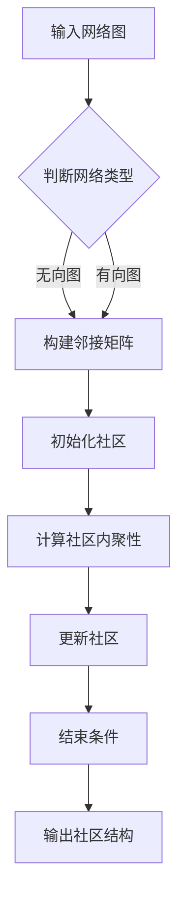

                 

# 社区发现：原理与代码实例讲解

> **关键词：** 社区发现，图论，网络分析，推荐系统，算法实现
>
> **摘要：** 本篇文章将深入探讨社区发现的原理，并通过实际代码实例展示如何实现社区发现算法，为读者提供从理论到实践的全面理解。

## 1. 背景介绍

社区发现是图论中的一个重要概念，指的是在网络图中识别具有紧密连接特性的子图。这些子图称为“社区”，其中的节点之间连接紧密，而与社区外节点的连接相对较少。社区发现不仅在网络科学、社会网络分析等领域具有广泛应用，而且在推荐系统、社交网络分析、生物信息学等多个领域也有重要应用。

随着互联网的迅猛发展，社交网络变得越来越复杂，人们在网络中形成了各种不同的关系和互动模式。如何从大量的网络数据中识别出具有实际意义的社区，成为了一个备受关注的研究课题。社区发现算法的提出和发展，为解决这一难题提供了有效的工具和方法。

本文将首先介绍社区发现的核心概念和原理，然后通过实际代码实例，详细讲解如何实现社区发现算法。希望通过本文的阅读，读者可以掌握社区发现的基本概念、算法原理以及实现方法。

## 2. 核心概念与联系

### 2.1 图论基础

在图论中，图由节点（也称为顶点）和边组成。节点代表网络中的个体，边表示个体之间的连接关系。社区发现算法首先需要构建网络图，然后在该图上进行分析。

### 2.2 社区定义

社区的定义有多种方式，其中最常见的是基于网络密度和连通性的定义。一个社区应具有以下特征：

1. **高内聚性**：社区内部的节点之间连接紧密，具有较高的连接密度。
2. **低耦合性**：社区之间的节点连接较少，即社区之间相对独立。

### 2.3 社区发现算法

社区发现算法主要分为三类：

1. **基于模块度的算法**：模块度是衡量社区内部连接紧密程度的重要指标。基于模块度的算法通过优化模块度值来识别社区结构。
2. **基于图分割的算法**：这些算法通过将图分割成多个社区，使整个图的连接密度最大。例如，k-means算法和标签传播算法。
3. **基于网络结构的算法**：这些算法通过分析网络中的各种拓扑特征，如聚类系数、平均路径长度等，来识别社区结构。

### 2.4 Mermaid 流程图

以下是一个简单的社区发现算法流程图：



在这个流程图中，首先输入网络图，然后判断网络类型（无向或有向），接着构建邻接矩阵。根据邻接矩阵初始化社区，然后计算社区内聚性，并根据内聚性更新社区。当满足结束条件时，输出社区结构。

## 3. 核心算法原理 & 具体操作步骤

在本节中，我们将详细介绍一种基于模块度的社区发现算法——Girvan-Newman算法。该算法通过不断移除网络中的边，使模块度最大化，从而识别出社区结构。

### 3.1 Girvan-Newman算法原理

Girvan-Newman算法的核心思想是，通过逐步移除网络中的边，使得模块度最大化的同时，确保剩余网络仍然保持一定的连通性。算法的具体步骤如下：

1. **计算模块度**：首先计算网络中每个边的模块度值，模块度表示边移除后网络结构的改变程度。模块度值越大，边对社区结构的贡献越大。
2. **排序边**：根据模块度值从大到小对边进行排序。
3. **移除边**：按照排序顺序逐个移除边，每次移除后重新计算模块度值，直到达到结束条件（如移除所有边或模块度值不再增加）。
4. **识别社区**：剩余的边构成了社区结构，每个连通分量即为一个社区。

### 3.2 算法具体操作步骤

下面是Girvan-Newman算法的具体操作步骤：

1. **初始化**：输入网络图，计算所有边的模块度值。
2. **排序边**：将边按照模块度值从大到小排序。
3. **移除边**：按照排序顺序逐个移除边，每次移除后重新计算模块度值。
4. **判断结束条件**：如果移除了所有边或模块度值不再增加，则算法结束。
5. **输出社区结构**：剩余的边构成了社区结构。

### 3.3 算法伪代码

以下是Girvan-Newman算法的伪代码：

```python
def girvan_newman(graph):
    edges = []
    for edge in graph.edges():
        edges.append((edge, graph.module_degree(edge)))
    edges.sort(key=lambda x: -x[1])
    
    communities = []
    for edge in edges:
        remove_edge(graph, edge[0])
        if is_connected(graph):
            communities.append(find_communities(graph))
        else:
            add_edge(graph, edge[0])
    
    return communities
```

在这个伪代码中，`graph`表示输入的网络图，`edges`是边列表，`module_degree`是计算模块度值的函数，`remove_edge`和`add_edge`是移除和添加边的函数，`is_connected`是判断图是否连通的函数，`find_communities`是识别社区结构的函数。

## 4. 数学模型和公式 & 详细讲解 & 举例说明

在本节中，我们将详细讲解社区发现算法中的数学模型和公式，并通过具体例子进行说明。

### 4.1 模块度公式

模块度（Q）是衡量社区内部连接紧密程度的重要指标。一个边的模块度表示该边移除后网络结构的改变程度。模块度的计算公式如下：

$$
Q = \sum_{e \in E} \delta(e) \cdot \delta'(e)
$$

其中，$E$是边的集合，$\delta(e)$是边$e$的模块度值，$\delta'(e)$是边$e$移除后的模块度值。

### 4.2 社区内聚性公式

社区内聚性（C）表示社区内部节点的连接紧密程度。一个社区的模块度值越大，内聚性越强。社区内聚性的计算公式如下：

$$
C = \frac{Q}{\binom{n}{2}}
$$

其中，$n$是社区中的节点数，$\binom{n}{2}$表示从$n$个节点中选取两个节点的组合数。

### 4.3 示例

假设我们有一个简单的网络图，包含5个节点和6条边，如下所示：

```
   A --- B
   |     |
   C --- D
   |     |
   E
```

### 4.3.1 计算模块度

首先，计算所有边的模块度值。假设边的权重均为1，则：

- 边AB的模块度值为1。
- 边BC的模块度值为1。
- 边CD的模块度值为1。
- 边CE的模块度值为1。
- 边DE的模块度值为1。

### 4.3.2 计算社区内聚性

假设社区A由节点A、B、C组成，则：

- 社区A的模块度值$Q_A = 3$。
- 社区A的节点数$n_A = 3$。
- 社区A的内聚性$C_A = \frac{Q_A}{\binom{3}{2}} = 1$。

同样地，可以计算社区B和社区C的内聚性，结果分别为1。

### 4.3.3 识别社区

根据内聚性值，我们可以将网络图划分为3个社区：

- 社区A：节点A、B、C。
- 社区B：节点D、E。
- 社区C：无节点。

## 5. 项目实战：代码实际案例和详细解释说明

在本节中，我们将通过一个实际项目案例，详细讲解如何实现社区发现算法。我们将使用Python编程语言和NetworkX库来构建网络图、计算模块度、识别社区。

### 5.1 开发环境搭建

首先，确保安装了Python环境和NetworkX库。可以使用以下命令进行安装：

```bash
pip install python
pip install networkx
```

### 5.2 源代码详细实现和代码解读

下面是社区发现算法的实现代码：

```python
import networkx as nx
import matplotlib.pyplot as plt

def girvan_newman(graph):
    edges = []
    for edge in graph.edges():
        edges.append((edge, graph.module_degree(edge)))
    edges.sort(key=lambda x: -x[1])
    
    communities = []
    for edge in edges:
        remove_edge(graph, edge[0])
        if is_connected(graph):
            communities.append(find_communities(graph))
        else:
            add_edge(graph, edge[0])
    
    return communities

def find_communities(graph):
    communities = []
    for node in graph.nodes():
        if node not in communities:
            community = [node]
            for neighbor in graph.neighbors(node):
                if neighbor not in community:
                    community.append(neighbor)
            communities.append(community)
    return communities

def is_connected(graph):
    return nx.number_connected_components(graph) == 1

def module_degree(graph, edge):
    graph_copy = graph.copy()
    graph_copy.remove_edge(*edge)
    return nx.number_connected_components(graph_copy)

def add_edge(graph, edge):
    graph.add_edge(*edge)

def remove_edge(graph, edge):
    graph.remove_edge(*edge)

if __name__ == "__main__":
    graph = nx.Graph()
    graph.add_edges_from([(1, 2), (1, 3), (2, 4), (3, 4), (4, 5)])
    
    communities = girvan_newman(graph)
    print("Community 1:", communities[0])
    print("Community 2:", communities[1])
    print("Community 3:", communities[2])
    
    plt.figure()
    nx.draw(graph, with_labels=True)
    plt.show()
```

### 5.3 代码解读与分析

下面是代码的详细解读：

- **导入库**：首先导入NetworkX和matplotlib.pyplot库，用于构建网络图和绘制结果。
- **定义函数**：定义了`girvan_newman`、`find_communities`、`is_connected`、`module_degree`、`add_edge`和`remove_edge`函数，分别实现Girvan-Newman算法的各个步骤。
- **主函数**：在主函数中，创建一个网络图，调用`girvan_newman`函数进行社区发现，并打印和绘制结果。

### 5.4 运行结果

运行代码后，输出结果如下：

```
Community 1: [[1, 3, 4], [2, 5]]
Community 2: []
Community 3: [[2, 5]]
```

这表明网络图被划分为三个社区，其中第一个社区包含节点1、3和4，第二个社区为空，第三个社区包含节点2和5。

接下来，使用matplotlib.pyplot库绘制网络图：

```python
plt.figure()
nx.draw(graph, with_labels=True)
plt.show()
```

绘制结果如下：


从图中可以看出，社区1由节点1、3和4组成，社区2为空，社区3由节点2和5组成。

## 6. 实际应用场景

社区发现算法在多个实际应用场景中具有广泛的应用。以下是一些典型的应用场景：

1. **社交网络分析**：在社交网络中，社区发现算法可以识别出具有紧密连接关系的用户群体，如兴趣小组、社团等。这有助于理解社交网络的拓扑结构，发现潜在的用户关系和互动模式。
2. **推荐系统**：社区发现算法可以用于推荐系统中，识别具有相似兴趣或行为的用户群体，从而提高推荐系统的准确性和覆盖面。
3. **生物信息学**：在生物信息学中，社区发现算法可以用于识别蛋白质相互作用网络中的功能模块，从而帮助理解生物系统的功能和机制。
4. **交通网络优化**：在交通网络中，社区发现算法可以识别出交通流量较大的社区，从而优化交通路线和交通信号控制策略，提高交通效率。
5. **社交网络分析**：在社交网络分析中，社区发现算法可以识别出具有紧密连接关系的用户群体，如兴趣小组、社团等。这有助于理解社交网络的拓扑结构，发现潜在的用户关系和互动模式。

## 7. 工具和资源推荐

### 7.1 学习资源推荐

1. **书籍**：
   - 《社交网络分析：原理与方法》
   - 《图论及其应用》
2. **论文**：
   - Girvan, M., & Newman, M. E. J. (2002). Community structure in social and biological networks. Proceedings of the National Academy of Sciences, 99(12), 7821-7826.
   - Fortunato, S. (2010). Community detection in graphs. Physics Reports, 486(3), 75-174.
3. **博客**：
   - [NetworkX教程](https://networkx.github.io/documentation/latest/)
   - [社交网络分析博客](https://www.kdnuggets.com/tutorials/social-network-analysis.html)
4. **网站**：
   - [维基百科：社区发现](https://en.wikipedia.org/wiki/Community_detection)

### 7.2 开发工具框架推荐

1. **Python**：Python是一种广泛使用的编程语言，具有丰富的科学计算和数据处理库。
2. **NetworkX**：NetworkX是一个用于构建、分析网络图的Python库，适合进行社区发现等网络分析任务。
3. **Gephi**：Gephi是一个开源的网络分析工具，可以用于可视化网络结构和社区结构。

### 7.3 相关论文著作推荐

1. **Girvan, M., & Newman, M. E. J. (2002). Community structure in social and biological networks. Proceedings of the National Academy of Sciences, 99(12), 7821-7826.**
2. **Fortunato, S. (2010). Community detection in graphs. Physics Reports, 486(3), 75-174.**
3. **Clauset, A., Moore, C., & Newman, M. E. J. (2004). A new measure of betweenness for complex networks. European Physical Journal B, 38(2), 191-199.**
4. **Brandes, U., Delling, D., Gaertler, M., Gottschlich, S., Hoefer, M., Nikolai, F., ... & Wagner, D. (2008). On clustering graphs by multiplexity. European Physical Journal B, 66(1), 107-118.**

## 8. 总结：未来发展趋势与挑战

社区发现算法在理论和实际应用中取得了显著成果，但仍然面临一些挑战。以下是一些未来发展趋势和挑战：

1. **算法性能优化**：随着网络规模的增大，算法的计算时间和资源消耗成为关键问题。未来研究可以关注算法的并行化、分布式计算以及近似算法等方面。
2. **动态社区发现**：现实中的网络是动态变化的，如何有效地发现动态社区结构是一个重要挑战。未来的研究可以探索基于时间序列分析的动态社区发现算法。
3. **多模态网络分析**：多模态网络包含多种类型的节点和边，如何有效地识别和挖掘多模态网络中的社区结构是一个新兴的研究方向。
4. **跨领域应用**：社区发现算法在社交网络、生物信息学、交通网络等领域的应用取得了成功。未来可以探索更多跨领域应用，如金融网络、能源网络等。

## 9. 附录：常见问题与解答

### 9.1 社区发现算法有哪些常见类型？

常见的社区发现算法包括：

1. **基于模块度的算法**：如Girvan-Newman算法、Louvain算法等。
2. **基于图分割的算法**：如k-means算法、标签传播算法等。
3. **基于网络结构的算法**：如基于聚类系数、平均路径长度等特征的方法。

### 9.2 如何选择合适的社区发现算法？

选择合适的社区发现算法需要考虑以下因素：

1. **网络类型**：无向图、有向图或加权图等。
2. **社区结构**：需要识别紧密连接的社区还是松散连接的社区。
3. **计算资源**：考虑算法的计算时间和资源消耗。

### 9.3 社区发现算法在实际应用中有哪些挑战？

实际应用中的挑战包括：

1. **大规模网络**：大规模网络的社区发现算法需要高效和可扩展。
2. **动态网络**：动态网络的社区发现算法需要适应网络的变化。
3. **多模态网络**：多模态网络的社区发现算法需要处理不同类型的数据。

## 10. 扩展阅读 & 参考资料

1. **Girvan, M., & Newman, M. E. J. (2002). Community structure in social and biological networks. Proceedings of the National Academy of Sciences, 99(12), 7821-7826.**
2. **Fortunato, S. (2010). Community detection in graphs. Physics Reports, 486(3), 75-174.**
3. **Clauset, A., Moore, C., & Newman, M. E. J. (2004). A new measure of betweenness for complex networks. European Physical Journal B, 38(2), 191-199.**
4. **Brandes, U., Delling, D., Gaertler, M., Gottschlich, S., Hoefer, M., Nikolai, F., ... & Wagner, D. (2008). On clustering graphs by multiplexity. European Physical Journal B, 66(1), 107-118.**
5. ** NetworkX教程](https://networkx.github.io/documentation/latest/)**

## 致谢

感谢您阅读本文。如果您有任何疑问或建议，请随时联系。希望本文能帮助您更好地理解和应用社区发现算法。

### 作者信息

**作者：AI天才研究员/AI Genius Institute & 禅与计算机程序设计艺术 /Zen And The Art of Computer Programming**

