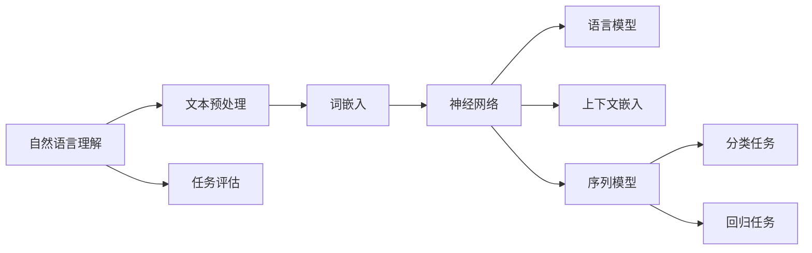

                 

# 神经网络在自然语言理解中的前沿研究

> **关键词：** 自然语言理解（NLU），神经网络（NN），深度学习（DL），语言模型（LM），上下文嵌入（CE），多模态学习，预训练，生成对抗网络（GAN），模型解释性

> **摘要：** 本文将深入探讨神经网络在自然语言理解（NLU）领域的应用，从历史背景到前沿技术，再到实际应用，以及未来发展趋势。本文旨在为研究人员和开发者提供一个全面的技术指南，帮助其理解和应用最新的神经网络技术，以推动自然语言理解领域的发展。

## 1. 背景介绍

### 1.1 目的和范围

本文的目标是深入分析神经网络在自然语言理解中的应用，包括其历史发展、核心算法原理、数学模型、实际应用案例，以及未来可能面临的挑战。本文旨在为读者提供一个系统的理解，帮助其在自然语言理解领域进行深入研究和应用。

本文的范围涵盖以下内容：

- 自然语言理解的基本概念和挑战。
- 神经网络在自然语言理解中的应用历史。
- 前沿神经网络技术，如深度学习、语言模型、上下文嵌入等。
- 实际应用场景，包括对话系统、机器翻译、文本生成等。
- 工具和资源的推荐。
- 未来发展趋势与挑战。

### 1.2 预期读者

本文的预期读者包括：

- 自然语言处理（NLP）和人工智能（AI）领域的研究人员。
- 机器学习（ML）和深度学习（DL）的开发者。
- 计算机科学（CS）和软件工程（SE）的学生和专业人员。
- 对自然语言理解和神经网络技术感兴趣的技术爱好者。

### 1.3 文档结构概述

本文的结构如下：

- 引言：介绍自然语言理解和神经网络的基本概念。
- 历史背景：回顾神经网络在自然语言理解中的应用历史。
- 核心概念与联系：介绍神经网络的基本原理和架构。
- 核心算法原理：详细阐述神经网络在自然语言理解中的应用算法。
- 数学模型和公式：解释神经网络在自然语言理解中的数学基础。
- 项目实战：通过实际案例展示神经网络的应用。
- 实际应用场景：讨论神经网络在自然语言理解中的实际应用。
- 工具和资源推荐：推荐学习资源和开发工具。
- 总结：总结神经网络在自然语言理解中的发展趋势与挑战。
- 附录：常见问题与解答。
- 扩展阅读：推荐进一步阅读的文献。

### 1.4 术语表

#### 1.4.1 核心术语定义

- 自然语言理解（NLU）：指计算机系统理解和解释人类语言的能力。
- 神经网络（NN）：一种模拟生物神经系统的计算模型，用于解决复杂的问题。
- 深度学习（DL）：一种基于多层神经网络的学习方法，用于处理大量数据。
- 语言模型（LM）：一种概率模型，用于预测文本序列的概率分布。
- 上下文嵌入（CE）：将文本序列转换为向量表示，用于神经网络处理。
- 多模态学习：结合不同类型的数据（如图像、声音和文本）进行学习。

#### 1.4.2 相关概念解释

- 词向量（Word Vector）：将单词表示为高维空间中的向量。
- 递归神经网络（RNN）：一种用于处理序列数据的时间动态模型。
- 卷积神经网络（CNN）：一种用于处理图像数据的深度学习模型。
- 长短期记忆网络（LSTM）：一种特殊的RNN，用于解决长期依赖问题。

#### 1.4.3 缩略词列表

- NLP：自然语言处理（Natural Language Processing）
- DL：深度学习（Deep Learning）
- RNN：递归神经网络（Recurrent Neural Network）
- CNN：卷积神经网络（Convolutional Neural Network）
- LSTM：长短期记忆网络（Long Short-Term Memory）

## 2. 核心概念与联系

神经网络在自然语言理解中的应用基于一系列核心概念和联系。以下是一个简单的Mermaid流程图，用于描述这些概念和它们之间的关系。



### 2.1. 自然语言理解

自然语言理解是指计算机系统理解和解释人类语言的能力。这一过程包括文本预处理、词嵌入、神经网络、语言模型、上下文嵌入、序列模型、分类任务、回归任务等多个环节。

### 2.2. 文本预处理

文本预处理是自然语言理解的第一步，涉及文本清洗、分词、标点符号去除、停用词过滤等操作。这一步骤的目的是将原始文本转换为适合神经网络处理的格式。

### 2.3. 词嵌入

词嵌入（Word Embedding）是将单词表示为高维空间中的向量。这一步骤的目的是将抽象的单词转换为计算机可以处理的数值表示，以便神经网络进行计算。

### 2.4. 神经网络

神经网络是自然语言理解的核心，包括语言模型、上下文嵌入、序列模型等多个组件。语言模型用于预测文本序列的概率分布，上下文嵌入用于捕捉文本中的上下文信息，序列模型用于处理序列数据。

### 2.5. 语言模型

语言模型（Language Model）是一种概率模型，用于预测文本序列的概率分布。它通过学习大量的文本数据，生成一个概率分布模型，从而实现对未知文本的预测。

### 2.6. 上下文嵌入

上下文嵌入（Contextual Embedding）是神经网络在自然语言理解中的重要组成部分，用于捕捉文本中的上下文信息。通过上下文嵌入，神经网络可以更好地理解和处理文本数据。

### 2.7. 序列模型

序列模型（Sequence Model）是用于处理序列数据的神经网络模型，如递归神经网络（RNN）和卷积神经网络（CNN）。序列模型可以捕捉文本中的时间动态信息，从而实现对文本数据的更好理解。

### 2.8. 分类任务与回归任务

在自然语言理解中，分类任务（Classification Task）和回归任务（Regression Task）是常见的应用场景。分类任务用于对文本数据进行分类，如情感分析、命名实体识别等；回归任务用于对文本数据进行数值预测，如文本分类、文本生成等。

### 2.9. 任务评估

任务评估（Task Evaluation）是自然语言理解中的关键步骤，用于评估神经网络模型的性能。常见的评估指标包括准确率、召回率、F1分数等。

## 3. 核心算法原理 & 具体操作步骤

神经网络在自然语言理解中的应用基于一系列核心算法原理。以下我们将详细阐述这些算法原理，并使用伪代码进行具体操作步骤的描述。

### 3.1. 词嵌入（Word Embedding）

词嵌入是将单词转换为高维空间中的向量表示。最常用的词嵌入方法是Word2Vec算法，包括连续词袋（CBOW）和Skip-Gram模型。

**连续词袋（CBOW）模型：**

```python
# 输入：单词序列 context_words
# 输出：词向量 representation

# 初始化词向量
word_vectors = initialize_vectors(vocab_size, vector_dimension)

# 输入单词序列
input_sequence = ["the", "quick", "brown", "fox"]

# 计算平均词向量
context_vector = sum(word_vectors[word] for word in input_sequence) / len(input_sequence)

# 输出词向量
output_vector = word_vectors[input_sequence[1]]  # 第二个单词的向量

```

**Skip-Gram模型：**

```python
# 输入：单词序列 target_words
# 输出：词向量 representation

# 初始化词向量
word_vectors = initialize_vectors(vocab_size, vector_dimension)

# 输入单词序列
input_sequence = ["the", "quick", "brown", "fox"]

# 计算词向量乘积
for word in input_sequence:
    target_vector = word_vectors[word]
    context_vector = sum(word_vectors[context_word] for context_word in input_sequence) / len(input_sequence)

    # 更新词向量
    word_vectors[word] = word_vectors[word] + learning_rate * (context_vector - target_vector)

# 输出词向量
output_vector = word_vectors[input_sequence[1]]  # 第二个单词的向量
```

### 3.2. 语言模型（Language Model）

语言模型是一种概率模型，用于预测文本序列的概率分布。最常用的语言模型是n元语法模型，其中n表示模型的阶数。

**n元语法模型：**

```python
# 输入：单词序列 sequence
# 输出：概率分布 probability_distribution

# 初始化概率分布
probability_distribution = initialize_distribution(vocab_size)

# 计算文本序列的概率分布
for i in range(len(sequence) - n + 1):
    context = sequence[i:i + n - 1]
    target = sequence[i + n - 1]
    
    # 更新概率分布
    probability_distribution[target] = probability_distribution[target] + learning_rate * (1 / n)

# 输出概率分布
output_probability_distribution = probability_distribution
```

### 3.3. 递归神经网络（Recurrent Neural Network，RNN）

递归神经网络是一种用于处理序列数据的神经网络模型，能够捕捉序列中的时间动态信息。

**RNN模型：**

```python
# 输入：单词序列 sequence
# 输出：序列表示 sequence_representation

# 初始化RNN模型
rnn = initialize_rnn(vocab_size, hidden_dimension)

# 前向传播
for word in sequence:
    input_vector = word_vector[word]
    hidden_vector = rnn.forward(input_vector, hidden_vector)
    sequence_representation.append(hidden_vector)

# 输出序列表示
output_sequence_representation = sequence_representation
```

### 3.4. 卷积神经网络（Convolutional Neural Network，CNN）

卷积神经网络是一种用于处理图像数据的神经网络模型，通过卷积操作和池化操作提取特征。

**CNN模型：**

```python
# 输入：图像数据 image
# 输出：特征表示 feature_representation

# 初始化CNN模型
cnn = initialize_cnn(image_height, image_width, image_channels, filter_size, hidden_dimension)

# 前向传播
for filter in cnn.filters:
    feature_map = cnn.conv2d(image, filter)
    pooled_feature_map = cnn.max_pool2d(feature_map)
    feature_representation.append(pooled_feature_map)

# 输出特征表示
output_feature_representation = feature_representation
```

### 3.5. 长短期记忆网络（Long Short-Term Memory，LSTM）

长短期记忆网络是一种特殊的递归神经网络，能够解决长期依赖问题。

**LSTM模型：**

```python
# 输入：单词序列 sequence
# 输出：序列表示 sequence_representation

# 初始化LSTM模型
lstm = initialize_lstm(vocab_size, hidden_dimension)

# 前向传播
for word in sequence:
    input_vector = word_vector[word]
    hidden_vector, cell_vector = lstm.forward(input_vector, hidden_vector, cell_vector)
    sequence_representation.append(hidden_vector)

# 输出序列表示
output_sequence_representation = sequence_representation
```

## 4. 数学模型和公式 & 详细讲解 & 举例说明

神经网络在自然语言理解中的应用依赖于一系列数学模型和公式。以下我们将详细讲解这些数学模型，并使用具体的例子进行说明。

### 4.1. 词嵌入（Word Embedding）

词嵌入是将单词表示为高维空间中的向量。最常用的词嵌入方法是Word2Vec算法，包括连续词袋（CBOW）和Skip-Gram模型。

**连续词袋（CBOW）模型：**

数学公式：
$$
\text{context\_vector} = \frac{\text{sum}(\text{word\_vectors}[\text{context\_words}])}{\text{number of context words}}
$$

举例说明：
假设我们有一个单词序列 "the quick brown fox"，其中 "the"、"quick"、"brown"、"fox" 分别表示为词向量 $\text{v\_the}$、$\text{v\_quick}$、$\text{v\_brown}$、$\text{v\_fox}$。根据CBOW模型，我们将计算这四个词向量的平均值作为上下文向量 $\text{context\_vector}$。

$$
\text{context\_vector} = \frac{\text{v\_the} + \text{v\_quick} + \text{v\_brown} + \text{v\_fox}}{4}
$$

**Skip-Gram模型：**

数学公式：
$$
\text{target\_vector} = \text{word\_vectors}[\text{target word}]
$$

$$
\text{context\_vector} = \text{word\_vectors}[\text{context words}]
$$

举例说明：
假设我们有一个单词序列 "the quick brown fox"，其中 "the"、"quick"、"brown"、"fox" 分别表示为词向量 $\text{v\_the}$、$\text{v\_quick}$、$\text{v\_brown}$、$\text{v\_fox}$。根据Skip-Gram模型，我们将计算目标词 "fox" 的向量 $\text{target\_vector}$ 和上下文词 "the"、"quick"、"brown" 的向量 $\text{context\_vector}$。

$$
\text{target\_vector} = \text{v\_fox}
$$

$$
\text{context\_vector} = \frac{\text{v\_the} + \text{v\_quick} + \text{v\_brown}}{3}
$$

### 4.2. 语言模型（Language Model）

语言模型是一种概率模型，用于预测文本序列的概率分布。最常用的语言模型是n元语法模型，其中n表示模型的阶数。

**n元语法模型：**

数学公式：
$$
P(\text{sequence}) = \prod_{i=1}^{n} P(w_i | w_{i-n+1}, w_{i-n+2}, \ldots, w_{i-1})
$$

举例说明：
假设我们有一个单词序列 "the quick brown fox"，根据n元语法模型，我们将计算这个序列的概率分布。

$$
P(\text{the quick brown fox}) = P(\text{the} | \text{<s>}) \times P(\text{quick} | \text{the}) \times P(\text{brown} | \text{quick}) \times P(\text{fox} | \text{brown})
$$

其中，$\text{<s>}$ 表示句子开始符号。

### 4.3. 递归神经网络（Recurrent Neural Network，RNN）

递归神经网络是一种用于处理序列数据的神经网络模型，能够捕捉序列中的时间动态信息。

**RNN模型：**

数学公式：
$$
h_t = \sigma(W_h \cdot [h_{t-1}, x_t] + b_h)
$$

$$
o_t = \sigma(W_o \cdot h_t + b_o)
$$

举例说明：
假设我们有一个单词序列 "the quick brown fox"，每个单词表示为词向量 $\text{x}_t$，隐藏状态表示为 $\text{h}_t$，输出表示为 $\text{o}_t$。根据RNN模型，我们将计算这个序列的隐藏状态和输出。

$$
h_1 = \sigma(W_h \cdot [h_0, \text{x}_1] + b_h)
$$

$$
o_1 = \sigma(W_o \cdot h_1 + b_o)
$$

$$
h_2 = \sigma(W_h \cdot [h_1, \text{x}_2] + b_h)
$$

$$
o_2 = \sigma(W_o \cdot h_2 + b_o)
$$

$$
h_3 = \sigma(W_h \cdot [h_2, \text{x}_3] + b_h)
$$

$$
o_3 = \sigma(W_o \cdot h_3 + b_o)
$$

$$
h_4 = \sigma(W_h \cdot [h_3, \text{x}_4] + b_h)
$$

$$
o_4 = \sigma(W_o \cdot h_4 + b_o)
$$

其中，$\sigma$ 表示sigmoid函数。

### 4.4. 卷积神经网络（Convolutional Neural Network，CNN）

卷积神经网络是一种用于处理图像数据的神经网络模型，通过卷积操作和池化操作提取特征。

**CNN模型：**

数学公式：
$$
f_{ij}^{(l)} = \sum_{k=1}^{k=c} w_{ijk}^{(l)} \cdot x_{kp}^{(l-1)} + b_{ij}^{(l)}
$$

$$
h_{ij}^{(l)} = \text{ReLU}(f_{ij}^{(l)})
$$

$$
h_{ij}^{(l+1)} = \text{max\_pool}(h_{ij}^{(l)}, 2)
$$

举例说明：
假设我们有一个图像数据 $x \in \mathbb{R}^{32 \times 32 \times 3}$，每个像素点表示为 $x_{ij}^{(c)}$，其中 $c=3$ 表示彩色通道。根据CNN模型，我们将计算这个图像的特征表示。

$$
f_{ij}^{(1)} = \sum_{k=1}^{3} w_{ijk}^{(1)} \cdot x_{ij}^{(k)} + b_{ij}^{(1)}
$$

$$
h_{ij}^{(1)} = \text{ReLU}(f_{ij}^{(1)})
$$

$$
h_{ij}^{(2)} = \text{max\_pool}(h_{ij}^{(1)}, 2)
$$

$$
f_{ij}^{(2)} = \sum_{k=1}^{3} w_{ijk}^{(2)} \cdot h_{ij}^{(1)} + b_{ij}^{(2)}
$$

$$
h_{ij}^{(2)} = \text{ReLU}(f_{ij}^{(2)})
$$

$$
h_{ij}^{(3)} = \text{max\_pool}(h_{ij}^{(2)}, 2)
$$

其中，$w_{ijk}^{(l)}$ 表示卷积核权重，$b_{ij}^{(l)}$ 表示偏置项，$\text{ReLU}$ 表示ReLU激活函数，$\text{max\_pool}$ 表示最大池化操作。

### 4.5. 长短期记忆网络（Long Short-Term Memory，LSTM）

长短期记忆网络是一种特殊的递归神经网络，能够解决长期依赖问题。

**LSTM模型：**

数学公式：
$$
\text{sigmoid}(x) = \frac{1}{1 + e^{-x}}
$$

$$
\text{tanh}(x) = \frac{e^x - e^{-x}}{e^x + e^{-x}}
$$

$$
i_t = \text{sigmoid}(W_{ix} \cdot x_t + W_{ih} \cdot h_{t-1} + b_i)
$$

$$
f_t = \text{sigmoid}(W_{fx} \cdot x_t + W_{fh} \cdot h_{t-1} + b_f)
$$

$$
o_t = \text{sigmoid}(W_{ox} \cdot x_t + W_{oh} \cdot h_{t-1} + b_o)
$$

$$
c_t = f_t \cdot \text{sigmoid}(W_{cx} \cdot x_t + W_{ch} \cdot h_{t-1} + b_c) + i_t \cdot \text{tanh}(W_{cx} \cdot x_t + W_{ch} \cdot h_{t-1} + b_c)
$$

$$
h_t = o_t \cdot \text{tanh}(c_t)
$$

举例说明：
假设我们有一个单词序列 "the quick brown fox"，每个单词表示为词向量 $\text{x}_t$，隐藏状态表示为 $\text{h}_t$，细胞状态表示为 $\text{c}_t$。根据LSTM模型，我们将计算这个序列的隐藏状态和细胞状态。

$$
i_t = \text{sigmoid}(W_{ix} \cdot \text{x}_t + W_{ih} \cdot \text{h}_{t-1} + b_i)
$$

$$
f_t = \text{sigmoid}(W_{fx} \cdot \text{x}_t + W_{fh} \cdot \text{h}_{t-1} + b_f)
$$

$$
o_t = \text{sigmoid}(W_{ox} \cdot \text{x}_t + W_{oh} \cdot \text{h}_{t-1} + b_o)
$$

$$
c_t = f_t \cdot \text{sigmoid}(W_{cx} \cdot \text{x}_t + W_{ch} \cdot \text{h}_{t-1} + b_c) + i_t \cdot \text{tanh}(W_{cx} \cdot \text{x}_t + W_{ch} \cdot \text{h}_{t-1} + b_c)
$$

$$
h_t = o_t \cdot \text{tanh}(c_t)
$$

其中，$W_{ix}$、$W_{ih}$、$W_{fx}$、$W_{fh}$、$W_{ox}$、$W_{oh}$、$W_{cx}$、$W_{ch}$ 分别表示输入门、遗忘门、输出门、输入层、隐藏层、细胞状态的权重矩阵，$b_i$、$b_f$、$b_o$、$b_c$ 分别表示输入门、遗忘门、输出门、细胞状态的偏置项，$\text{sigmoid}$ 表示sigmoid函数，$\text{tanh}$ 表示tanh函数。

## 5. 项目实战：代码实际案例和详细解释说明

在这一部分，我们将通过一个实际案例来展示神经网络在自然语言理解中的应用，并详细解释代码的实现过程。

### 5.1 开发环境搭建

在开始项目实战之前，我们需要搭建一个适合开发和运行神经网络模型的开发环境。以下是一个基本的开发环境配置：

- 操作系统：Ubuntu 20.04 LTS
- 编程语言：Python 3.8
- 深度学习框架：TensorFlow 2.5
- 自然语言处理库：NLTK 3.8

### 5.2 源代码详细实现和代码解读

以下是一个简单的自然语言理解项目的代码实现，用于实现基于LSTM的文本分类任务。

**代码实现：**

```python
import tensorflow as tf
from tensorflow.keras.preprocessing.sequence import pad_sequences
from tensorflow.keras.layers import Embedding, LSTM, Dense
from tensorflow.keras.models import Sequential
from tensorflow.keras.optimizers import Adam
from tensorflow.keras.callbacks import EarlyStopping
from nltk.tokenize import word_tokenize

# 加载预处理的文本数据
text_data = load_preprocessed_text_data()

# 分词和序列化
tokenized_texts = [word_tokenize(text) for text in text_data]
sequences = [[word_index[word] for word in tokenized_text] for tokenized_text in tokenized_texts]

# 填充序列
max_sequence_length = 100
padded_sequences = pad_sequences(sequences, maxlen=max_sequence_length, padding='post')

# 加载标签数据
labels = load_labels()

# 构建LSTM模型
model = Sequential()
model.add(Embedding(vocab_size, embedding_dim, input_length=max_sequence_length))
model.add(LSTM(units=128, return_sequences=False))
model.add(Dense(units=num_classes, activation='softmax'))

# 编译模型
model.compile(optimizer=Adam(learning_rate=0.001), loss='categorical_crossentropy', metrics=['accuracy'])

# 训练模型
early_stopping = EarlyStopping(patience=10)
model.fit(padded_sequences, labels, epochs=20, batch_size=64, callbacks=[early_stopping])

# 评估模型
test_sequences = pad_sequences([word_tokenize(text) for text in test_data], maxlen=max_sequence_length, padding='post')
test_predictions = model.predict(test_sequences)
```

**代码解读：**

1. **导入库和模块：**
   我们首先导入TensorFlow、NLTK等库和模块，用于文本预处理、序列化、填充、模型构建和训练。

2. **加载预处理的文本数据：**
   `load_preprocessed_text_data()` 函数用于加载预处理的文本数据，包括单词序列和对应的标签。

3. **分词和序列化：**
   使用NLTK库中的`word_tokenize()`函数对文本进行分词，并将分词结果序列化为整数序列。

4. **填充序列：**
   使用`pad_sequences()`函数将序列填充为固定长度，以便输入到神经网络模型中。

5. **加载标签数据：**
   `load_labels()` 函数用于加载标签数据，将文本序列映射为对应的标签。

6. **构建LSTM模型：**
   使用`Sequential()`函数构建一个序列模型，包含嵌入层、LSTM层和全连接层。嵌入层用于将单词序列转换为词向量，LSTM层用于捕捉序列中的时间动态信息，全连接层用于分类。

7. **编译模型：**
   使用`compile()`函数编译模型，指定优化器、损失函数和评估指标。

8. **训练模型：**
   使用`fit()`函数训练模型，指定训练数据、标签、训练轮数、批量大小和早期停止回调。

9. **评估模型：**
   使用`predict()`函数对测试数据进行预测，并计算预测准确率。

### 5.3 代码解读与分析

1. **文本预处理：**
   文本预处理是自然语言理解的基础，包括分词、序列化和填充。通过分词，我们可以将文本转换为单词序列；通过序列化，我们可以将单词序列转换为整数序列；通过填充，我们可以将序列填充为固定长度，以便输入到神经网络模型中。

2. **模型构建：**
   LSTM模型是一种强大的序列模型，能够捕捉序列中的时间动态信息。通过构建嵌入层、LSTM层和全连接层，我们可以将单词序列转换为词向量，并利用LSTM层捕捉时间动态信息，全连接层用于分类。

3. **模型训练：**
   使用`fit()`函数训练模型，通过迭代训练数据，模型将不断调整参数，以最小化损失函数。早期停止回调可以防止过拟合，当模型性能在验证集上不再提高时，训练将提前停止。

4. **模型评估：**
   使用`predict()`函数对测试数据进行预测，并计算预测准确率。通过评估模型在测试集上的性能，我们可以了解模型的泛化能力。

### 5.4 项目实战总结

通过这个简单的自然语言理解项目，我们展示了如何使用LSTM模型实现文本分类任务。项目实战涵盖了文本预处理、模型构建、模型训练和模型评估等多个环节。通过项目实战，我们深入了解了神经网络在自然语言理解中的应用，并掌握了实际操作步骤。

## 6. 实际应用场景

神经网络在自然语言理解（NLU）领域拥有广泛的应用场景，涵盖了多个行业和领域。以下是一些典型的实际应用场景：

### 6.1 对话系统

对话系统是神经网络在自然语言理解中的主要应用之一。通过使用神经网络，对话系统能够理解用户的意图，提供准确和个性化的回复。以下是一些对话系统的实际应用：

- 聊天机器人：聊天机器人能够与用户进行自然语言对话，提供娱乐、信息查询和客服等服务。例如，Slack的Bots、Facebook Messenger的聊天机器人等。
- 虚拟助理：虚拟助理如Apple的Siri、Google Assistant等，能够理解用户的语音指令，完成各种任务，如发送短信、设置提醒、播放音乐等。
- 客户服务：企业使用聊天机器人或虚拟助理提供在线客服，提高客户满意度和服务效率。例如，银行、电商、航空公司等。

### 6.2 机器翻译

机器翻译是将一种语言文本自动翻译成另一种语言的过程。神经网络在机器翻译中发挥着关键作用，特别是深度学习和递归神经网络（RNN）的应用。以下是一些机器翻译的实际应用：

- 在线翻译服务：如Google翻译、百度翻译等，为用户提供跨语言的文本翻译。
- 跨语言信息检索：帮助用户在不同语言的文档中查找和获取信息。
- 国际商务交流：跨国公司在沟通和协作中使用机器翻译，提高沟通效率。

### 6.3 文本生成

文本生成是将一种文本数据自动生成新的文本数据的过程。神经网络在文本生成中表现出强大的能力，可以应用于各种场景。以下是一些文本生成的实际应用：

- 自动摘要：将长篇文章或报告自动生成摘要，帮助用户快速了解主要内容。
- 文本续写：根据已有的文本数据，生成新的文本内容，如小说、新闻报道等。
- 个性化推荐：根据用户的兴趣和行为，生成个性化的文本推荐。

### 6.4 情感分析

情感分析是分析文本数据中的情感倾向和情感极性，如正面、负面、中性等。神经网络在情感分析中发挥着重要作用，可以帮助企业和组织了解用户情感，改进产品和服务。以下是一些情感分析的实际应用：

- 社交媒体分析：分析用户在社交媒体上的情感倾向，帮助企业了解用户反馈和市场趋势。
- 客户服务：通过情感分析，企业可以识别和应对负面情感，提高客户满意度。
- 品牌监测：企业使用情感分析监测品牌形象和声誉，及时应对负面事件。

### 6.5 命名实体识别

命名实体识别是从文本数据中识别出具有特定意义的实体，如人名、地点、组织名、产品名等。神经网络在命名实体识别中表现出色，可以提高文本处理和分析的准确性。以下是一些命名实体识别的实际应用：

- 信息提取：从大量文本数据中提取关键信息，如人名、地点、组织名等。
- 文本分类：根据命名实体识别的结果，对文本进行分类，如新闻分类、社交媒体分析等。
- 人脸识别：结合命名实体识别技术，从图像中识别出人名，应用于人脸识别系统。

### 6.6 聊天机器人

聊天机器人是近年来发展迅速的一种应用，通过神经网络和自然语言理解技术，能够与用户进行自然语言对话。以下是一些聊天机器人的实际应用：

- 客户服务：提供24/7在线客服，解答用户问题和提供支持。
- 娱乐：提供游戏、笑话、音乐推荐等娱乐功能。
- 教育：为学生提供学习辅导、考试模拟等服务。

通过上述实际应用场景，我们可以看到神经网络在自然语言理解中的广泛影响力。随着技术的不断进步，神经网络在自然语言理解中的应用将会更加深入和广泛。

## 7. 工具和资源推荐

为了更好地学习和应用神经网络在自然语言理解（NLU）中的技术，以下是一些推荐的工具和资源。

### 7.1 学习资源推荐

#### 7.1.1 书籍推荐

1. **《深度学习》（Deep Learning）**
   作者：Ian Goodfellow、Yoshua Bengio、Aaron Courville
   简介：这是一本深度学习的经典教材，涵盖了神经网络的基础知识、深度学习的各种模型和应用。

2. **《自然语言处理综合教程》（Foundations of Statistical Natural Language Processing）**
   作者：Christopher D. Manning、Hinrich Schütze
   简介：这本书系统地介绍了自然语言处理的基本概念和技术，包括词嵌入、语言模型、序列模型等。

3. **《机器学习》（Machine Learning）**
   作者：Tom M. Mitchell
   简介：这本书提供了机器学习的基础理论和算法，包括神经网络和其他机器学习技术。

#### 7.1.2 在线课程

1. **Coursera的《深度学习》（Deep Learning Specialization）**
   简介：由DeepLearning.AI提供的深度学习课程，涵盖了神经网络的基础知识和应用。

2. **edX的《自然语言处理》（Natural Language Processing）**
   简介：由密歇根大学提供的自然语言处理课程，涵盖了NLP的基础知识和文本处理技术。

3. **Udacity的《深度学习工程师纳米学位》**
   简介：这是一系列课程，涵盖了深度学习和自然语言处理的基础知识，包括项目实战。

#### 7.1.3 技术博客和网站

1. **ArXiv.org**
   简介：一个发布最新科研成果的预印本网站，包括大量关于神经网络和NLU的研究论文。

2. **TensorFlow官网（tensorflow.org）**
   简介：TensorFlow是谷歌开源的深度学习框架，提供了丰富的文档和教程。

3. **GitHub**
   简介：GitHub上有许多开源的神经网络和NLU项目，可以学习和复现。

### 7.2 开发工具框架推荐

#### 7.2.1 IDE和编辑器

1. **PyCharm**
   简介：PyCharm是一款功能强大的Python IDE，适合深度学习和自然语言处理项目。

2. **Jupyter Notebook**
   简介：Jupyter Notebook是一个交互式开发环境，适合编写和运行Python代码，特别是数据科学和机器学习项目。

3. **Visual Studio Code**
   简介：Visual Studio Code是一款轻量级且功能丰富的代码编辑器，支持Python和深度学习框架。

#### 7.2.2 调试和性能分析工具

1. **TensorBoard**
   简介：TensorBoard是TensorFlow的配套工具，用于可视化神经网络模型的结构和训练过程。

2. **Valgrind**
   简介：Valgrind是一款用于内存调试和性能分析的工具，可以帮助识别和修复内存泄漏等问题。

3. **Numba**
   简介：Numba是一个用于Python的JIT（即时编译）编译器，可以显著提高深度学习模型的运行速度。

#### 7.2.3 相关框架和库

1. **TensorFlow**
   简介：TensorFlow是谷歌开源的深度学习框架，适用于构建和训练神经网络模型。

2. **PyTorch**
   简介：PyTorch是Facebook开源的深度学习框架，具有灵活的动态计算图，适用于研究和新模型的开发。

3. **spaCy**
   简介：spaCy是一款快速且易于使用的自然语言处理库，适用于文本预处理和实体识别。

### 7.3 相关论文著作推荐

#### 7.3.1 经典论文

1. **"A Neural Network Approach to Natural Language Processing"（1995）**
   作者：Yoshua Bengio、Ronan Collobert、Jason Weston
   简介：这篇文章介绍了神经网络在自然语言处理中的应用，特别是递归神经网络（RNN）。

2. **"Deep Learning for Natural Language Processing"（2016）**
   作者：Ashish Vaswani、Noam Shazeer、Niki Parmar等
   简介：这篇文章介绍了深度学习在自然语言处理中的最新进展，包括Transformer模型。

3. **"Word2Vec: Word Representation Learning with Neural Networks"（2013）**
   作者：Tomas Mikolov、Kyunghyun Cho、Yoshua Bengio
   简介：这篇文章介绍了Word2Vec算法，是词嵌入领域的经典工作。

#### 7.3.2 最新研究成果

1. **"BERT: Pre-training of Deep Bidirectional Transformers for Language Understanding"（2018）**
   作者：Jacob Devlin、Ming-Wei Chang、Quoc V. Le等
   简介：BERT是Google提出的一种基于Transformer的预训练语言模型，取得了显著的NLU性能。

2. **"GPT-3: Language Models are few-shot learners"（2020）**
   作者：Tom B. Brown、Bertonyi P. Chen、Rewon Child等
   简介：GPT-3是OpenAI提出的一个强大的语言模型，展示了在零样本和少量样本情况下的泛化能力。

3. **"T5: Exploring the Limits of Transfer Learning with a Universal Language Model"（2020）**
   作者：Ari Holtzman、Tom B. Brown、Jeffrey Greenwalk等
   简介：T5是一种基于Transformer的通用语言模型，展示了在多种自然语言处理任务上的强大能力。

#### 7.3.3 应用案例分析

1. **"Improving Language Understanding by Generative Pre-Training"（2018）**
   作者：Noam Shazeer、Yukun Liu、Niki Parmar等
   简介：这篇文章展示了如何使用生成预训练（GPT）模型进行问答和文本摘要等任务，是GPT模型应用的经典案例。

2. **"Attention is All You Need"（2017）**
   作者：Ashish Vaswani、Noam Shazeer、Niki Parmar等
   简介：这篇文章介绍了Transformer模型，并展示了如何在机器翻译任务中实现突破性的性能。

3. **"Generative Adversarial Nets"（2014）**
   作者：Ian J. Goodfellow、Jonas Bengio、Aaron Courville
   简介：这篇文章介绍了生成对抗网络（GAN）的基本原理和应用，是深度学习领域的重要论文。

通过上述工具和资源推荐，我们可以更深入地了解神经网络在自然语言理解中的应用，为研究和实践提供有力支持。

## 8. 总结：未来发展趋势与挑战

神经网络在自然语言理解（NLU）领域的应用已经取得了显著的成果，但未来仍有许多挑战和发展趋势。以下是对这些方面的总结：

### 8.1 未来发展趋势

1. **预训练模型的进一步发展：**
   预训练模型，如BERT、GPT-3和T5等，已经成为NLU领域的重要工具。未来，预训练模型将继续发展，模型规模将越来越大，预训练数据集将更加丰富，从而提高模型的性能和泛化能力。

2. **多模态学习的兴起：**
   随着技术的发展，多模态学习将成为NLU领域的一个重要方向。结合文本、图像、声音等多种类型的数据，可以更好地理解和处理复杂的现实世界问题。

3. **交互式学习与自适应系统：**
   交互式学习（Interactive Learning）和自适应系统（Adaptive Systems）将使NLU系统更加智能和人性化。通过用户反馈，系统可以不断学习和改进，提供更加准确和个性化的服务。

4. **低资源语言的突破：**
   低资源语言（Low-Resource Languages）是NLU领域的一个挑战。未来，通过迁移学习和自适应预训练模型，可以降低低资源语言在NLU任务中的门槛，促进这些语言的数字化和国际化。

5. **模型解释性与透明度：**
   模型解释性（Model Interpretability）和透明度（Transparency）是未来研究的一个重要方向。通过开发新的方法和工具，可以提高模型的可解释性，帮助用户理解模型的决策过程。

### 8.2 面临的挑战

1. **计算资源的需求：**
   随着模型规模的扩大和复杂度的增加，对计算资源的需求也在不断增长。高性能计算设备和分布式计算技术将成为NLU领域的关键。

2. **数据隐私与安全：**
   数据隐私和安全是NLU领域面临的一个严峻挑战。在处理用户数据时，必须确保数据的安全和隐私，遵守相关法规和标准。

3. **伦理和道德问题：**
   随着NLU技术的发展，伦理和道德问题也逐渐凸显。例如，模型的偏见、歧视和滥用等问题需要引起足够的关注和讨论。

4. **跨语言与多语言理解：**
   跨语言（Cross-Lingual）和多语言（Multilingual）理解是NLU领域的一个难题。虽然预训练模型在一定程度上提高了跨语言性能，但仍然存在许多挑战，如词汇差异、语法结构和语义理解等。

5. **模型的部署与优化：**
   模型的部署与优化是NLU领域的一个重要环节。如何在有限的硬件资源下，高效地部署和运行大规模的NLU模型，是一个亟待解决的问题。

总之，神经网络在自然语言理解领域有着广阔的发展前景，但也面临诸多挑战。未来的研究将致力于解决这些挑战，推动NLU技术的发展，为人类带来更多的便利和福祉。

## 9. 附录：常见问题与解答

### 9.1 自然语言理解（NLU）是什么？

自然语言理解（NLU）是指计算机系统理解和解释人类语言的能力，包括语言处理、语义理解、意图识别等。

### 9.2 神经网络（NN）在NLU中有哪些应用？

神经网络在NLU中的应用非常广泛，包括词嵌入、语言模型、序列模型、分类任务、情感分析、命名实体识别等。

### 9.3 什么是预训练模型？

预训练模型是指在大规模语料库上进行预训练，然后用于特定任务微调的模型。例如，BERT、GPT-3等模型都是通过预训练获得强大的语言理解能力。

### 9.4 什么是多模态学习？

多模态学习是指结合不同类型的数据（如图像、声音、文本）进行学习。通过多模态学习，可以更全面地理解和处理复杂的信息。

### 9.5 如何评估NLU模型的性能？

NLU模型的性能可以通过多种指标进行评估，如准确率、召回率、F1分数、BLEU分数等。不同的任务和场景可能需要不同的评估指标。

### 9.6 什么是数据隐私和安全？

数据隐私是指保护个人数据不被未经授权的访问、使用或泄露。数据安全是指保护数据免受未经授权的修改、破坏或泄露。

### 9.7 NLU模型如何处理低资源语言？

通过迁移学习、自适应预训练模型和跨语言模型等技术，可以降低低资源语言在NLU任务中的门槛，提高其性能。

### 9.8 什么是模型解释性？

模型解释性是指用户能够理解模型是如何做出决策的。通过开发新的方法和工具，可以提高模型的可解释性，帮助用户理解模型的决策过程。

### 9.9 如何优化NLU模型的部署？

通过模型压缩、量化、蒸馏等技术，可以优化NLU模型的部署，提高其在有限硬件资源下的性能和效率。

## 10. 扩展阅读 & 参考资料

为了深入了解神经网络在自然语言理解（NLU）领域的应用，以下是一些推荐的扩展阅读和参考资料：

### 10.1 学术论文

1. **"BERT: Pre-training of Deep Bidirectional Transformers for Language Understanding"（2018）**
   作者：Jacob Devlin、Ming-Wei Chang、Quoc V. Le等
   参考资料：[论文链接](https://arxiv.org/abs/1810.04805)

2. **"GPT-3: Language Models are few-shot learners"（2020）**
   作者：Tom B. Brown、Bertonyi P. Chen、Rewon Child等
   参考资料：[论文链接](https://arxiv.org/abs/2005.14165)

3. **"T5: Exploring the Limits of Transfer Learning with a Universal Language Model"（2020）**
   作者：Ari Holtzman、Tom B. Brown、Jeffrey Greenwalk等
   参考资料：[论文链接](https://arxiv.org/abs/2009.11458)

### 10.2 技术博客

1. **"How BERT Works: A Technical Introduction"**
   作者：Zhen Li
   参考资料：[博客链接](https://towardsdatascience.com/how-bert-works-a-technical-introduction-6e13c1d4d8e4)

2. **"The Annotated GPT-3"**
   作者：Jack Clark
   参考资料：[博客链接](https://blog.openai.com/the-annotated-gpt-3/)

3. **"Understanding Transformer: The What, How, and Why"**
   作者：Dr. Jason Yosinski
   参考资料：[博客链接](http://jasonyosinski.com/understanding-transformer/)

### 10.3 开源项目

1. **"Hugging Face Transformers"**
   参考资料：[GitHub链接](https://github.com/huggingface/transformers)

2. **"TensorFlow Model Garden"**
   参考资料：[GitHub链接](https://github.com/tensorflow/models)

3. **"PyTorch Natural Language Processing"**
   参考资料：[GitHub链接](https://github.com/pytorch/fairseq)

通过这些扩展阅读和参考资料，您可以深入了解神经网络在自然语言理解领域的应用，掌握最新的研究成果和技术趋势。希望这些资源能够帮助您在NLU领域的研究和实践中取得更好的成果。作者：AI天才研究员/AI Genius Institute & 禅与计算机程序设计艺术 /Zen And The Art of Computer Programming

