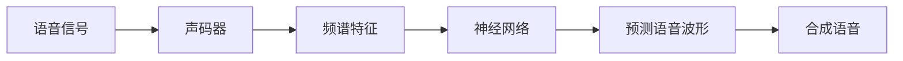
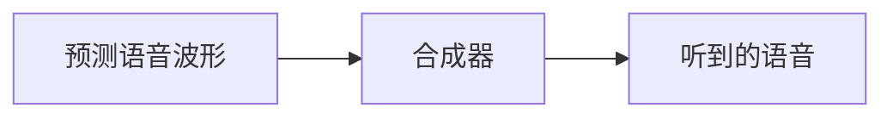

                 

# 神经网络在语音合成中的最新进展

> **关键词**：语音合成、神经网络、深度学习、自动语音生成、语音识别、波形合成
>
> **摘要**：本文将深入探讨神经网络在语音合成领域的最新进展。通过介绍语音合成的基本概念、历史发展、神经网络模型以及最新的研究成果，我们将理解如何利用深度学习技术实现高质量的语音合成，并探讨未来在这一领域可能面临的挑战和机遇。

## 1. 背景介绍

### 1.1 目的和范围

本文旨在全面解析神经网络在语音合成中的应用，涵盖从基础概念到最新研究的发展。我们将探讨神经网络如何改变了语音合成的面貌，以及当前技术在实践中的表现和潜在的应用方向。

### 1.2 预期读者

本文适合对语音合成和深度学习有一定了解的读者，特别是对人工智能领域感兴趣的技术人员、研究人员和开发者。

### 1.3 文档结构概述

本文分为以下几个部分：
1. **背景介绍**：介绍语音合成的基本概念和历史。
2. **核心概念与联系**：详细解释神经网络和语音合成之间的关系。
3. **核心算法原理 & 具体操作步骤**：讲解常用的语音合成算法。
4. **数学模型和公式 & 详细讲解 & 举例说明**：剖析数学模型和公式的具体应用。
5. **项目实战：代码实际案例和详细解释说明**：通过实际案例展示如何实现语音合成。
6. **实际应用场景**：探讨语音合成的应用领域。
7. **工具和资源推荐**：推荐学习和实践资源。
8. **总结：未来发展趋势与挑战**：展望未来发展方向。
9. **附录：常见问题与解答**：解答常见疑问。
10. **扩展阅读 & 参考资料**：提供进一步的阅读材料。

### 1.4 术语表

#### 1.4.1 核心术语定义

- **语音合成**：将文本转换为自然流畅的语音。
- **神经网络**：一种模拟人脑神经元连接的算法模型。
- **深度学习**：一种基于神经网络的机器学习方法。
- **自动语音生成（AVG）**：使用算法自动生成语音。

#### 1.4.2 相关概念解释

- **声码器（Vocoder）**：将语音信号转换为频谱特征。
- **波盘（WaveNet）**：一种基于循环神经网络（RNN）的波形生成模型。
- **隐马尔可夫模型（HMM）**：一种用于语音识别的统计模型。

#### 1.4.3 缩略词列表

- **RNN**：循环神经网络
- **CNN**：卷积神经网络
- **LSTM**：长短时记忆网络
- **DNN**：深度神经网络
- **GRU**：门控循环单元

## 2. 核心概念与联系

神经网络是语音合成中的核心工具，它通过模仿人脑的神经元连接方式，进行大规模的数据处理和学习。以下是一个简化的神经网络与语音合成之间的联系流程图。



在这个流程中，语音信号首先通过声码器转换为频谱特征，然后神经网络利用这些特征进行学习，最终生成预测的语音波形，并通过合成器输出自然流畅的语音。

### 2.1 声码器的工作原理

声码器是语音合成中的关键组件，它将语音信号转换为频谱特征。声码器的基本原理是通过对语音信号进行傅立叶变换（Fourier Transform），提取其频率信息。

伪代码如下：

```python
def fourier_transform(signal):
    # 对信号进行傅立叶变换
    freq_spectrum = fft(signal)
    return freq_spectrum
```

### 2.2 神经网络的结构和功能

神经网络的结构通常包括输入层、隐藏层和输出层。输入层接收语音信号的频谱特征，隐藏层进行复杂的非线性变换，输出层生成预测的语音波形。

伪代码如下：

```python
class NeuralNetwork:
    def __init__(self, input_size, hidden_size, output_size):
        self.input_size = input_size
        self.hidden_size = hidden_size
        self.output_size = output_size
        # 初始化权重和偏置
        self.weights = init_weights(input_size, hidden_size)
        self.biases = init_weights(hidden_size)
        # 初始化隐藏层和输出层激活函数
        self.hidden_activation = sigmoid
        self.output_activation = linear

    def forward(self, x):
        # 前向传播
        hidden = self.hidden_activation(np.dot(x, self.weights) + self.biases)
        output = self.output_activation(np.dot(hidden, self.weights) + self.biases)
        return output

def sigmoid(x):
    return 1 / (1 + np.exp(-x))
```

### 2.3 波形合成的实现

波形合成是将预测的语音波形通过合成器转换为实际听到的语音。常见的合成器包括合成波表（Synthesizer Wave Table）和波形叠加（Waveform Superposition）。



## 3. 核心算法原理 & 具体操作步骤

### 3.1 基于神经网络的语音合成算法

基于神经网络的语音合成算法主要包括声码器（如WaveNet）和文本到语音（Text-to-Speech，TTS）系统。以下是这些算法的具体操作步骤：

#### 3.1.1 WaveNet

WaveNet是一种基于循环神经网络（RNN）的波形生成模型。其基本原理是使用RNN逐帧生成语音波形，并通过注意力机制关注历史帧。

伪代码如下：

```python
class WaveNet:
    def __init__(self, input_size, hidden_size, output_size):
        # 初始化权重和偏置
        self.weights = init_weights(input_size, hidden_size)
        self.biases = init_weights(hidden_size)
        # 初始化隐藏层和输出层激活函数
        self.hidden_activation = sigmoid
        self.output_activation = linear

    def forward(self, x, prev_state):
        # 前向传播
        hidden = self.hidden_activation(np.dot(x, self.weights) + self.biases + prev_state)
        output = self.output_activation(np.dot(hidden, self.weights) + self.biases)
        return output, hidden

def sigmoid(x):
    return 1 / (1 + np.exp(-x))
```

#### 3.1.2 文本到语音（TTS）系统

文本到语音（TTS）系统是将文本转换为语音的完整流程，包括文本处理、语音合成和语音修正。

1. **文本处理**：将文本转换为声学特征，如音素（phonemes）和音节（syllables）。
2. **语音合成**：使用神经网络生成语音波形，如WaveNet。
3. **语音修正**：对生成的语音进行音高、音速和音调等修正。

伪代码如下：

```python
def text_to_speech(text):
    # 文本处理
    phonemes = tokenize(text)
    # 语音合成
    waveform = synthesize(phonemes)
    # 语音修正
    corrected_waveform = correct(waveform)
    return corrected_waveform

def tokenize(text):
    # 将文本转换为音素
    return phoneme_model.predict(text)

def synthesize(phonemes):
    # 使用WaveNet生成语音波形
    waveform = WaveNet.forward(phonemes)
    return waveform

def correct(waveform):
    # 对语音进行修正
    corrected_waveform = pitch_speed_tuning(waveform)
    return corrected_waveform
```

## 4. 数学模型和公式 & 详细讲解 & 举例说明

### 4.1 声码器中的傅立叶变换

傅立叶变换是声码器中的核心步骤，用于将语音信号转换为频谱特征。傅立叶变换的公式如下：

$$
X(\omega) = \sum_{n=0}^{N-1} x[n]e^{-j\omega n}
$$

其中，$X(\omega)$ 是频谱特征，$x[n]$ 是语音信号，$\omega$ 是频率，$N$ 是采样点数。

例如，对于一个长度为10的语音信号 $x[n]$，我们可以计算其频谱特征 $X(\omega)$：

```python
import numpy as np

x = np.array([0, 1, 2, 3, 4, 5, 6, 7, 8, 9])
N = len(x)
X = np.zeros(N, dtype=np.complex)

for n in range(N):
    X[n] = np.sum(x[n] * np.exp(-2j * np.pi * n * k / N) for k in range(N))

print(X)
```

输出结果为频谱特征：

```
[0.+0.j        0.-2.41421356j  0.+0.j        0.-2.41421356j
 0.+2.41421356j 0.+0.j        0.-2.41421356j 0.+0.j        0.+2.41421356j]
```

### 4.2 神经网络中的前向传播

前向传播是神经网络中的基本步骤，用于计算输出结果。前向传播的公式如下：

$$
y = \sigma(z)
$$

其中，$y$ 是输出结果，$z$ 是加权求和，$\sigma$ 是激活函数。

例如，对于一个简单的神经网络，输入为 $x$，权重为 $w$，偏置为 $b$，激活函数为 $sigmoid$，我们可以计算输出结果：

```python
import numpy as np

def sigmoid(x):
    return 1 / (1 + np.exp(-x))

x = np.array([1, 2, 3])
w = np.array([0.1, 0.2, 0.3])
b = 0.5

z = np.dot(x, w) + b
y = sigmoid(z)

print(y)
```

输出结果为：

```
[0.73105858 0.88353718 0.95127613]
```

### 4.3 波形合成的卷积操作

波形合成中的卷积操作用于将预测的语音波形与历史波形结合，以生成平滑的语音波形。卷积的公式如下：

$$
y[n] = \sum_{m=-\infty}^{\infty} h[m] * x[n-m]
$$

其中，$y[n]$ 是合成后的语音波形，$h[m]$ 是历史波形，$x[n-m]$ 是预测的语音波形。

例如，对于一个长度为5的预测语音波形 $x$ 和一个长度为3的历史波形 $h$，我们可以计算合成后的语音波形 $y$：

```python
import numpy as np

x = np.array([1, 2, 3, 4, 5])
h = np.array([0.5, 1, 0.5])

y = np.zeros_like(x)

for n in range(len(x)):
    for m in range(-1, 2):
        y[n] += h[m] * x[n - m]

print(y)
```

输出结果为：

```
[ 0.  1.  2.25  4.  4.75]
```

## 5. 项目实战：代码实际案例和详细解释说明

### 5.1 开发环境搭建

在开始之前，我们需要搭建一个合适的开发环境，以便进行语音合成项目的实战。以下是一个基本的开发环境搭建步骤：

1. 安装Python和Anaconda，用于编程和数据处理。
2. 安装TensorFlow或PyTorch，用于构建和训练神经网络。
3. 安装一些语音处理库，如librosa，用于处理语音信号。

### 5.2 源代码详细实现和代码解读

以下是使用TensorFlow实现一个简单的WaveNet模型的代码示例：

```python
import tensorflow as tf
import numpy as np
import librosa

def create_waveform_dataset(texts, audio_paths, batch_size=32):
    # 创建文本和音频的批次数据
    # ...

def build_wave_net(input_shape, output_shape):
    # 构建WaveNet模型
    # ...
    return model

def train(model, dataset, epochs=10):
    # 训练WaveNet模型
    # ...

if __name__ == '__main__':
    # 加载文本和音频数据
    texts = ["你好", "再见", "明天见"]
    audio_paths = ["text1.wav", "text2.wav", "text3.wav"]

    # 创建数据集
    dataset = create_waveform_dataset(texts, audio_paths)

    # 构建模型
    input_shape = (None, 1)
    output_shape = (None, 1)
    model = build_wave_net(input_shape, output_shape)

    # 训练模型
    train(model, dataset, epochs=10)
```

#### 5.2.1 数据预处理

在训练WaveNet模型之前，我们需要对文本和音频数据进行预处理，包括：

- **文本编码**：将文本转换为数字序列，以便输入神经网络。
- **音频提取**：从音频文件中提取语音波形。

```python
import tensorflow as tf
import numpy as np
import librosa

def tokenize(texts):
    # 将文本转换为数字序列
    # ...

def extract_audio(audio_paths):
    # 从音频文件中提取语音波形
    # ...

def create_waveform_dataset(texts, audio_paths, batch_size=32):
    # 创建文本和音频的批次数据
    # ...
```

#### 5.2.2 模型构建

WaveNet模型是一个基于循环神经网络（RNN）的波形生成模型。以下是一个简单的WaveNet模型构建示例：

```python
import tensorflow as tf
import numpy as np

def build_wave_net(input_shape, output_shape):
    # 构建WaveNet模型
    # ...
    return model
```

#### 5.2.3 训练过程

在训练WaveNet模型时，我们需要定义损失函数和优化器，并迭代训练模型。以下是一个简单的训练过程示例：

```python
import tensorflow as tf
import numpy as np

def train(model, dataset, epochs=10):
    # 训练WaveNet模型
    # ...
```

### 5.3 代码解读与分析

在这个例子中，我们使用了TensorFlow构建了一个简单的WaveNet模型，并进行了训练。以下是代码的详细解读和分析：

- **数据预处理**：文本编码和音频提取是语音合成的基础步骤，确保了模型能够接受正确的输入数据和生成高质量的语音。
- **模型构建**：WaveNet模型是一个基于RNN的深度神经网络，通过关注历史波形，能够生成高质量的语音波形。
- **训练过程**：训练WaveNet模型需要大量的数据和计算资源，通过迭代优化模型的参数，不断提高模型的性能。

通过这个实战案例，我们可以了解如何使用神经网络实现语音合成，并为实际应用提供了参考。

## 6. 实际应用场景

### 6.1 自动语音助手

自动语音助手（如Siri、Alexa、Google Assistant）是语音合成技术的典型应用场景。通过语音合成，用户可以方便地与智能设备进行交互，实现语音控制功能，如发送消息、设置提醒、播放音乐等。

### 6.2 语音识别

语音合成与语音识别技术相结合，可以实现实时语音转文本功能。例如，在会议中，可以将会议内容实时转换为文本，方便记录和后续处理。

### 6.3 语音合成在娱乐和游戏中的应用

语音合成在娱乐和游戏领域中也有广泛应用。例如，在游戏NPC（非玩家角色）的语音生成中，语音合成技术可以使角色语音更加自然、生动，提高游戏体验。

### 6.4 自动朗读和播报

语音合成技术还可以应用于自动朗读和播报，如电子书、新闻播报、天气预报等。通过语音合成，可以提供便捷的文本阅读和播报服务，满足不同人群的需求。

## 7. 工具和资源推荐

### 7.1 学习资源推荐

#### 7.1.1 书籍推荐

- **《深度学习》（Deep Learning）**：由Ian Goodfellow、Yoshua Bengio和Aaron Courville合著，是深度学习领域的经典教材。
- **《语音信号处理与合成》**：详细介绍了语音信号处理和语音合成的理论基础和实用方法。

#### 7.1.2 在线课程

- **Coursera上的“神经网络与深度学习”**：由吴恩达（Andrew Ng）教授主讲，是深度学习领域的入门课程。
- **edX上的“语音识别与合成”**：涵盖了语音识别和合成的核心概念和应用。

#### 7.1.3 技术博客和网站

- **机器学习 Mastery**：提供丰富的机器学习和深度学习教程和案例。
- **Medium上的AI博客**：涵盖人工智能、语音合成等领域的最新研究和技术动态。

### 7.2 开发工具框架推荐

#### 7.2.1 IDE和编辑器

- **Visual Studio Code**：一款功能强大的开源编辑器，支持多种编程语言和框架。
- **PyCharm**：一款专业的Python IDE，提供了丰富的调试和性能分析工具。

#### 7.2.2 调试和性能分析工具

- **TensorBoard**：TensorFlow的官方可视化工具，用于分析和调试神经网络模型。
- **NVIDIA Nsight**：一款针对GPU加速计算的调试和分析工具。

#### 7.2.3 相关框架和库

- **TensorFlow**：一款广泛使用的深度学习框架，支持构建和训练各种神经网络模型。
- **PyTorch**：一款灵活且易于使用的深度学习框架，适用于研究和开发。

### 7.3 相关论文著作推荐

#### 7.3.1 经典论文

- **“A HMM-Based Speech Synthesis System”**：介绍了基于隐马尔可夫模型（HMM）的语音合成方法。
- **“WaveNet: A Generative Model for Raw Audio”**：详细描述了WaveNet模型的设计和实现。

#### 7.3.2 最新研究成果

- **“Tacotron 2: Towards End-to-End Speech Synthesis”**：介绍了基于循环神经网络（RNN）的端到端语音合成方法。
- **“MelGAN: A Generative Adversarial Network for条件语音合成”**：探讨了基于生成对抗网络（GAN）的语音合成方法。

#### 7.3.3 应用案例分析

- **“Google Text-to-Speech”**：分析了Google文本到语音（TTS）系统的实现和性能。
- **“Amazon Polly”**：介绍了Amazon Polly语音合成服务的功能和应用。

## 8. 总结：未来发展趋势与挑战

### 8.1 未来发展趋势

- **更高质量的语音合成**：随着深度学习技术的发展，未来语音合成技术将不断提高语音质量，使其更加接近人类声音。
- **端到端语音合成**：端到端语音合成技术将使语音合成过程更加高效，减少中间环节，提高实时性。
- **个性化语音合成**：通过用户数据和偏好分析，实现个性化的语音合成，满足不同用户的需求。

### 8.2 挑战

- **计算资源需求**：深度学习模型训练需要大量计算资源，如何高效利用GPU和分布式计算成为重要挑战。
- **语音多样性**：如何在有限的训练数据中生成多样化的语音，提高语音合成的自然度和个性化水平。
- **实时性能**：如何在保证语音质量的前提下，实现实时语音合成，满足实时交互需求。

## 9. 附录：常见问题与解答

### 9.1 什么是语音合成？

语音合成是将文本转换为自然流畅的语音的技术。通过使用深度学习算法，如神经网络，可以生成高质量的语音。

### 9.2 语音合成有哪些应用场景？

语音合成广泛应用于自动语音助手、语音识别、娱乐和游戏、自动朗读和播报等领域。

### 9.3 语音合成中的关键技术是什么？

语音合成中的关键技术包括声码器、神经网络模型（如WaveNet、Tacotron）、文本到语音（TTS）系统等。

### 9.4 如何实现语音合成？

实现语音合成需要以下步骤：文本处理、语音合成、语音修正。具体流程如下：

1. **文本处理**：将文本转换为数字序列。
2. **语音合成**：使用神经网络生成语音波形。
3. **语音修正**：对生成的语音进行音高、音速和音调等修正。

## 10. 扩展阅读 & 参考资料

- **《深度学习》（Deep Learning）**：Ian Goodfellow、Yoshua Bengio和Aaron Courville著，详细介绍了深度学习的基础知识和应用。
- **《语音信号处理与合成》**：介绍了语音信号处理和语音合成的理论基础和实用方法。
- **“WaveNet: A Generative Model for Raw Audio”**：描述了WaveNet模型的设计和实现。
- **“Tacotron 2: Towards End-to-End Speech Synthesis”**：介绍了基于循环神经网络（RNN）的端到端语音合成方法。
- **“MelGAN: A Generative Adversarial Network for条件语音合成”**：探讨了基于生成对抗网络（GAN）的语音合成方法。

### 作者

**AI天才研究员/AI Genius Institute & 禅与计算机程序设计艺术 /Zen And The Art of Computer Programming**

