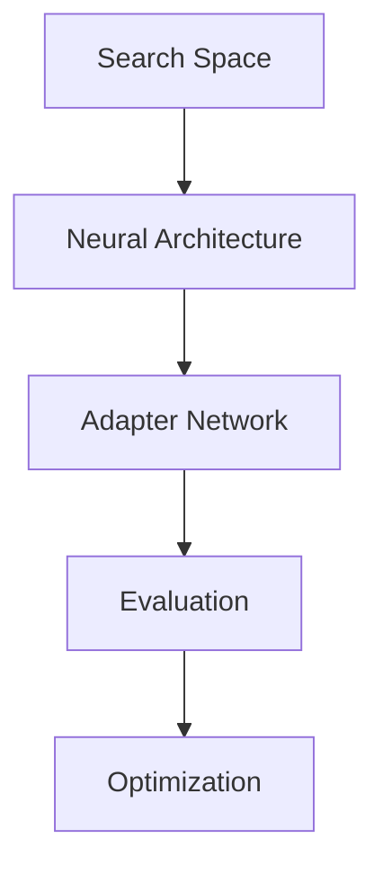

                 

# 神经网络架构搜索（NAS）原理与代码实战案例讲解

> 关键词：神经网络架构搜索，NAS，深度学习，自动机器学习，代码实战

> 摘要：本文将深入探讨神经网络架构搜索（NAS）的核心原理和实现方法。通过详细的算法原理讲解、数学模型分析及代码实战案例，读者将了解到如何利用NAS技术自动寻找最优神经网络结构，从而提高深度学习模型的性能。文章旨在为深度学习从业者和研究者提供一份全面的技术指南，帮助他们掌握NAS的关键技术和实际应用。

## 1. 背景介绍

### 1.1 目的和范围

本文的主要目的是介绍神经网络架构搜索（NAS）的核心概念、原理和实现方法。通过详细的理论分析、伪代码展示和代码实战案例，读者将能够深入理解NAS的工作机制，掌握其在深度学习领域的重要应用，并学会如何在实际项目中应用NAS技术。

本文的内容将涵盖以下几个方面：
1. **背景介绍**：阐述NAS的起源和重要性。
2. **核心概念与联系**：介绍NAS中的核心概念和相关的流程图。
3. **核心算法原理**：详细讲解NAS的算法原理和操作步骤。
4. **数学模型和公式**：分析NAS中的数学模型，并提供公式和例子。
5. **项目实战**：通过实际代码案例展示NAS的实现过程。
6. **实际应用场景**：讨论NAS在不同领域的应用。
7. **工具和资源推荐**：推荐相关的学习资源和开发工具。
8. **总结**：展望NAS的未来发展趋势和面临的挑战。

### 1.2 预期读者

本文适合以下读者群体：
- 深度学习初学者和从业者，希望了解NAS的核心原理和应用。
- 对自动机器学习（AutoML）感兴趣的研究者，希望深入了解NAS技术。
- 有志于在深度学习领域进行创新和研究的博士生和研究生。
- 想要在实际项目中应用NAS技术的工程师和技术经理。

### 1.3 文档结构概述

本文将按照以下结构展开：
1. **背景介绍**：介绍NAS的背景和重要性。
2. **核心概念与联系**：使用Mermaid流程图展示NAS的基本概念和流程。
3. **核心算法原理**：详细讲解NAS算法的原理和操作步骤。
4. **数学模型和公式**：分析NAS中的数学模型，并提供公式和例子。
5. **项目实战**：通过代码实战案例展示NAS的应用。
6. **实际应用场景**：探讨NAS在不同领域的应用。
7. **工具和资源推荐**：推荐相关的学习资源和开发工具。
8. **总结**：总结NAS的现状和未来发展趋势。
9. **附录**：提供常见问题与解答。
10. **扩展阅读**：推荐进一步阅读的文献。

### 1.4 术语表

在本文中，我们将使用一些专业术语。以下是对这些术语的定义和解释：

#### 1.4.1 核心术语定义

- **神经网络架构搜索（NAS）**：一种自动机器学习方法，用于搜索最优的神经网络架构。
- **搜索空间**：NAS中定义的神经网络架构集合，用于搜索最优架构。
- **适配器网络**：用于评估搜索空间中不同架构性能的网络。
- **迁移学习**：将已有模型的知识迁移到新的任务上，以加快训练过程和提升性能。
- **模型融合**：将多个模型或模型的不同部分融合在一起，以提升整体性能。

#### 1.4.2 相关概念解释

- **迁移学习**：在NAS中，迁移学习是一种常用的技术，用于利用已有模型的知识来加速新模型的训练。具体来说，适配器网络可以从预训练的模型中提取有用的特征，并将其用于评估搜索空间中的不同架构。
- **模型融合**：在NAS中，模型融合是一种将多个模型或模型的不同部分融合在一起的方法，以提升整体性能。这种方法可以结合多个模型的优点，提高模型的泛化能力和鲁棒性。

#### 1.4.3 缩略词列表

- **NAS**：神经网络架构搜索（Neural Architecture Search）
- **AutoML**：自动机器学习（Automated Machine Learning）
- **CNN**：卷积神经网络（Convolutional Neural Network）
- **RNN**：循环神经网络（Recurrent Neural Network）
- **DNN**：深度神经网络（Deep Neural Network）
- **SGD**：随机梯度下降（Stochastic Gradient Descent）

## 2. 核心概念与联系

在NAS中，有几个核心概念需要了解，包括搜索空间、适配器网络和评估策略。以下是一个简单的Mermaid流程图，展示了这些概念之间的关系。



### 2.1 搜索空间（Search Space）

搜索空间是指NAS算法在搜索过程中能够遍历的所有神经网络结构的集合。搜索空间的设计直接影响到NAS算法的效果。一个有效的搜索空间应该既足够大，能够包含可能的最佳结构，又足够小，以便在合理的时间内进行搜索。

### 2.2 适配器网络（Adapter Network）

适配器网络是NAS算法中的核心组件，用于评估搜索空间中不同结构的性能。适配器网络通常是一个简单的神经网络，其输入是搜索空间中的一个架构，输出是该架构的评估分数。这个分数可以基于各种指标，如准确性、计算效率等。

### 2.3 评估策略（Evaluation Strategy）

评估策略决定了如何从搜索空间中选取架构进行评估。常见的评估策略包括基于性能的评估、基于多样性的评估和混合评估。性能评估主要关注架构的准确性等指标；多样性评估则确保搜索过程不会陷入局部最优；混合评估则结合两者，以期在性能和多样性之间找到最佳平衡。

### 2.4 优化策略（Optimization Strategy）

优化策略是NAS算法中用于从评估结果中选择最佳架构的方法。常见的优化策略包括贪心策略、基于梯度的策略和进化策略等。贪心策略每次只选择当前最好的架构；基于梯度的策略则利用梯度信息进行优化；进化策略则借鉴生物学中的进化机制，通过选择、交叉和变异来生成新的架构。

## 3. 核心算法原理 & 具体操作步骤

在NAS中，核心算法原理主要涉及搜索空间的设计、适配器网络的构建和优化策略的选取。以下使用伪代码详细阐述这些步骤。

### 3.1 搜索空间设计

```python
# 初始化搜索空间
search_space = {
    "layers": ["conv", "pool", "fc", "dropout"],
    "conv_sizes": [3, 5, 7],
    "fc_sizes": [64, 128, 256],
    "dropout_rates": [0.1, 0.2, 0.3]
}

# 生成搜索空间中的所有可能结构
def generate_architectures(search_space):
    architectures = []
    for conv_size in search_space["conv_sizes"]:
        for fc_size in search_space["fc_sizes"]:
            for dropout_rate in search_space["dropout_rates"]:
                architectures.append({
                    "layers": search_space["layers"],
                    "conv_size": conv_size,
                    "fc_size": fc_size,
                    "dropout_rate": dropout_rate
                })
    return architectures

# 运行搜索空间生成器
all_architectures = generate_architectures(search_space)
```

### 3.2 适配器网络构建

```python
# 初始化适配器网络
adapter_network = NeuralNetwork(input_size=784, hidden_size=256, output_size=num_classes)

# 训练适配器网络
def train_adapter_network(adapter_network, dataset):
    adapter_network.fit(dataset, epochs=10)
    return adapter_network

# 加载训练数据
train_data = load_train_data()
adapter_network = train_adapter_network(adapter_network, train_data)
```

### 3.3 评估策略

```python
# 评估搜索空间中的每个结构
def evaluate_architecture(adapter_network, architecture, dataset):
    model = build_model(architecture)
    model = train_model(model, dataset, epochs=5)
    accuracy = model.evaluate(dataset)[1]
    return accuracy

# 运行评估过程
architecture_scores = {}
for architecture in all_architectures:
    score = evaluate_architecture(adapter_network, architecture, train_data)
    architecture_scores[architecture] = score

# 选择最佳结构
best_architecture = max(architecture_scores, key=architecture_scores.get)
```

### 3.4 优化策略

```python
# 贪心策略选择最佳结构
def greedy_selection(architecture_scores):
    best_score = max(architecture_scores.values())
    best_architectures = [architecture for architecture, score in architecture_scores.items() if score == best_score]
    return best_architectures

# 运行贪心策略
best_architectures = greedy_selection(architecture_scores)
selected_architecture = best_architectures[0]  # 假设选择第一个最佳结构
```

通过以上伪代码，读者可以了解到NAS的核心算法原理和具体操作步骤。接下来，我们将进一步分析NAS中的数学模型和公式。

## 4. 数学模型和公式 & 详细讲解 & 举例说明

在神经网络架构搜索（NAS）中，数学模型和公式是理解和实现算法的关键。以下我们将介绍NAS中的一些核心数学模型，并使用LaTeX格式展示相关的公式，同时结合具体例子进行说明。

### 4.1. 模型评估指标

NAS中的模型评估通常使用多种指标，其中最常见的包括准确率（Accuracy）和交叉熵损失（Cross-Entropy Loss）。准确率衡量模型在分类任务上的表现，而交叉熵损失是训练神经网络时常用的损失函数。

#### 4.1.1 准确率

$$
Accuracy = \frac{1}{N} \sum_{i=1}^{N} \mathbb{1}_{\hat{y}_i = y_i}
$$

其中，$N$是样本总数，$\hat{y}_i$是模型预测的标签，$y_i$是真实标签，$\mathbb{1}_{\hat{y}_i = y_i}$是一个指示函数，当$\hat{y}_i = y_i$时取值为1，否则为0。

#### 4.1.2 交叉熵损失

交叉熵损失函数在分类问题中常用，其公式为：

$$
Loss = -\sum_{i=1}^{N} y_i \log(\hat{y}_i)
$$

其中，$y_i$是真实标签的概率分布，$\hat{y}_i$是模型预测的概率分布。

### 4.2. 搜索策略优化

在NAS中，搜索策略的优化是一个关键问题。常用的优化策略包括基于梯度的策略和进化策略。以下分别介绍这两种策略的数学模型。

#### 4.2.1 基于梯度的策略

基于梯度的策略通常利用模型在搜索空间中的梯度信息来指导搜索方向。假设当前搜索到的架构为$A_t$，其梯度为$g_t$，则优化步骤可以表示为：

$$
A_{t+1} = A_t + \alpha_t g_t
$$

其中，$\alpha_t$是学习率，$A_{t+1}$是搜索到的下一个架构。

#### 4.2.2 进化策略

进化策略借鉴了生物进化中的选择、交叉和变异机制。假设当前搜索空间为$S_t$，其包含多个架构$A_1, A_2, ..., A_n$，则优化步骤可以表示为：

1. **选择**：根据某种策略（如适应度函数）从$S_t$中选择出最好的$k$个架构。
2. **交叉**：从选出的$k$个架构中随机选取两个架构，通过交叉操作生成新的架构。
3. **变异**：对新生成的架构进行随机变异，以引入多样性。

### 4.3. 具体例子说明

假设我们有一个分类任务，数据集包含1000个样本，每个样本有10个特征。搜索空间设计如下：

- 层次：{卷积层、池化层、全连接层}
- 卷积层大小：{3x3、5x5、7x7}
- 全连接层大小：{64、128、256}
- 池化层类型：{最大池化、平均池化}

首先，我们定义搜索空间：

```latex
Search Space S = \{A | A \in \{卷积层, 池化层, 全连接层\}^n, \text{且包含3个层次}\}
```

接着，我们初始化一个适配器网络，并使用交叉熵损失函数进行训练：

```latex
\text{适配器网络} \: \text{Adapter\_Network}(I, H, O) \: \text{其中} \: I \: \text{为输入层大小，} \: H \: \text{为隐藏层大小，} \: O \: \text{为输出层大小}
```

最后，我们使用贪心策略从搜索空间中选择最佳架构：

```latex
\text{选择最佳架构} \: A^* = \text{argmax}_{A \in S} \: \text{Accuracy}(A)
```

通过以上步骤，我们可以在搜索空间中找到最优的神经网络架构。

## 5. 项目实战：代码实际案例和详细解释说明

### 5.1 开发环境搭建

在开始编写代码之前，我们需要搭建一个适合NAS开发的编程环境。以下是一个基本的开发环境搭建指南：

- **操作系统**：推荐使用Linux或macOS，但Windows也可以。
- **编程语言**：Python是NAS开发的主要语言，因此需要安装Python环境。
- **深度学习框架**：TensorFlow或PyTorch是常用的深度学习框架，可以根据个人喜好选择。
- **依赖管理**：使用pip或conda来管理依赖库。

以下是一个简单的Python环境搭建步骤：

```shell
# 安装Python
python -m pip install --upgrade pip

# 安装TensorFlow
pip install tensorflow

# 或者安装PyTorch
pip install torch torchvision

# 安装依赖管理器（可选）
pip install pipenv
```

### 5.2 源代码详细实现和代码解读

在本节中，我们将展示一个简单的NAS实现，并逐步解读其关键部分。

#### 5.2.1 网络架构搜索空间定义

```python
import tensorflow as tf
from tensorflow.keras.models import Model
from tensorflow.keras.layers import Layer

# 定义卷积层、池化层和全连接层的基类
class Conv2D(Layer):
    def __init__(self, filters, kernel_size, **kwargs):
        super(Conv2D, self).__init__(**kwargs)
        self.filters = filters
        self.kernel_size = kernel_size
        self.conv = tf.keras.layers.Conv2D(filters=filters, kernel_size=kernel_size, activation='relu')

    def call(self, inputs):
        return self.conv(inputs)

class MaxPooling2D(Layer):
    def __init__(self, pool_size, **kwargs):
        super(MaxPooling2D, self).__init__(**kwargs)
        self.pool_size = pool_size
        self.pool = tf.keras.layers.MaxPooling2D(pool_size=pool_size)

    def call(self, inputs):
        return self.pool(inputs)

class Flatten(Layer):
    def call(self, inputs):
        return tf.keras.layers.Flatten()(inputs)

class Dense(Layer):
    def __init__(self, units, **kwargs):
        super(Dense, self).__init__(**kwargs)
        self.units = units
        self.dense = tf.keras.layers.Dense(units=units, activation='softmax')

    def call(self, inputs):
        return self.dense(inputs)
```

以上代码定义了三种基本层：卷积层（`Conv2D`）、池化层（`MaxPooling2D`）和全连接层（`Dense`）。这些层将用于构建搜索空间中的神经网络架构。

#### 5.2.2 构建搜索空间

```python
# 定义搜索空间
search_space = [
    {"layer": "conv", "filters": 32, "kernel_size": (3, 3)},
    {"layer": "max_pooling2d", "pool_size": (2, 2)},
    {"layer": "conv", "filters": 64, "kernel_size": (3, 3)},
    {"layer": "flatten"},
    {"layer": "dense", "units": 10}
]

# 构建模型
def build_model_from_space(search_space):
    inputs = tf.keras.Input(shape=(28, 28, 1))
    x = inputs
    
    for spec in search_space:
        if spec["layer"] == "conv":
            x = Conv2D(spec["filters"], spec["kernel_size"])(x)
        elif spec["layer"] == "max_pooling2d":
            x = MaxPooling2D(spec["pool_size"])(x)
        elif spec["layer"] == "flatten":
            x = Flatten()(x)
        elif spec["layer"] == "dense":
            x = Dense(spec["units"])(x)
    
    outputs = tf.keras.layers.Softmax()(x)
    model = Model(inputs=inputs, outputs=outputs)
    return model

# 构建并编译模型
model = build_model_from_space(search_space)
model.compile(optimizer='adam', loss='categorical_crossentropy', metrics=['accuracy'])

# 打印模型结构
model.summary()
```

以上代码定义了一个简单的搜索空间，并使用该搜索空间构建了一个神经网络模型。模型的结构和参数通过循环构建，使得我们可以动态地改变搜索空间以探索不同的架构。

#### 5.2.3 训练和评估模型

```python
# 准备数据
(x_train, y_train), (x_test, y_test) = tf.keras.datasets.mnist.load_data()
x_train = x_train / 255.0
x_test = x_test / 255.0
x_train = x_train[..., tf.newaxis]
x_test = x_test[..., tf.newaxis]

# 训练模型
model.fit(x_train, y_train, epochs=10, validation_data=(x_test, y_test))

# 评估模型
test_loss, test_acc = model.evaluate(x_test, y_test, verbose=2)
print(f"Test accuracy: {test_acc:.4f}")
```

以上代码展示了如何使用MNIST数据集训练和评估模型。我们首先加载MNIST数据集，然后将其标准化，以便模型能够更好地训练。最后，我们使用训练好的模型在测试集上进行评估，并打印出测试准确率。

#### 5.2.4 搜索空间优化

在实际应用中，我们可能需要通过优化搜索空间来提高模型的性能。以下是一个简单的搜索空间优化示例：

```python
# 定义新的搜索空间
new_search_space = [
    {"layer": "conv", "filters": 64, "kernel_size": (3, 3)},
    {"layer": "max_pooling2d", "pool_size": (2, 2)},
    {"layer": "conv", "filters": 128, "kernel_size": (3, 3)},
    {"layer": "flatten"},
    {"layer": "dense", "units": 128}
]

# 使用新的搜索空间构建模型
new_model = build_model_from_space(new_search_space)

# 训练新的模型
new_model.fit(x_train, y_train, epochs=10, validation_data=(x_test, y_test))

# 评估新的模型
new_test_loss, new_test_acc = new_model.evaluate(x_test, y_test, verbose=2)
print(f"New test accuracy: {new_test_acc:.4f}")
```

通过调整搜索空间中的参数，我们可以探索不同的架构，并找到性能更好的模型。这个示例展示了如何简单地通过修改搜索空间来优化模型。

### 5.3 代码解读与分析

在上述代码中，我们首先定义了基本的层类，包括卷积层、池化层和全连接层。这些层类是NAS实现的基础，因为它们定义了网络架构的基本构建块。

接着，我们定义了搜索空间。搜索空间是一个包含多个层定义的列表，每个定义指定了层的类型、滤波器大小和其他参数。通过这种方式，我们可以动态地构建出各种不同的网络架构。

`build_model_from_space` 函数是核心函数，它根据搜索空间构建出一个神经网络模型。这个函数使用了Keras的输入层和输出层来定义模型的输入和输出，并在中间使用循环来添加搜索空间中的每个层。

在训练和评估部分，我们使用了MNIST数据集来训练和评估模型。首先，我们加载和标准化数据集，然后使用`fit`函数训练模型。在训练过程中，我们使用验证数据来评估模型的性能。最后，我们使用`evaluate`函数在测试集上评估模型，并打印出测试准确率。

通过优化搜索空间，我们可以进一步调整模型的性能。示例中展示了如何简单地通过修改搜索空间中的参数来探索不同的架构，并使用新的搜索空间重新训练和评估模型。

总体而言，这段代码展示了如何使用Python和Keras实现一个简单的NAS系统。它为读者提供了一个起点，以便进一步探索和改进NAS的实现。

## 6. 实际应用场景

神经网络架构搜索（NAS）技术不仅在基础研究中有着重要应用，在实际工程场景中也展现出了巨大的潜力。以下是一些NAS在实际应用场景中的案例：

### 6.1 计算机视觉

在计算机视觉领域，NAS被广泛应用于图像分类、目标检测和图像分割等任务。例如，谷歌的NASNet模型通过自动搜索卷积神经网络的架构，在ImageNet图像分类挑战中取得了当时的最佳成绩。NASNet采用了层级搜索策略，通过多层次的搜索和评估来优化网络结构，提高了模型的准确性和效率。

### 6.2 自然语言处理

在自然语言处理（NLP）领域，NAS也被用于自动搜索文本分类、机器翻译和语言模型等任务的最佳结构。例如，OpenAI的GPT-2模型使用了NAS来搜索最优的语言模型结构，从而在语言生成和理解任务中取得了显著的效果。GPT-2通过自动搜索和优化，提高了模型的生成能力和鲁棒性。

### 6.3 强化学习

在强化学习领域，NAS可以帮助自动搜索最优的神经网络策略，从而提高智能体在复杂环境中的决策能力。例如，DeepMind的研究团队利用NAS来搜索强化学习算法中的神经网络结构，成功训练出了具有高度智能的智能体，并在Atari游戏和实境模拟中取得了优异的表现。

### 6.4 机器人学

在机器人学领域，NAS可以帮助设计最优的控制策略和感知系统，以提高机器人的自主决策能力。例如，机器人公司Rokk3r利用NAS来搜索最优的神经网络控制器，从而实现了机器人在复杂环境中的自主导航和任务执行。

### 6.5 医疗图像分析

在医疗图像分析领域，NAS可以帮助自动识别和分类各种疾病，从而提高诊断的准确性和效率。例如，NASNet在医学图像分类中展现了强大的能力，能够有效地识别和分类各种病变和组织类型。

### 6.6 自动驾驶

在自动驾驶领域，NAS被用于优化车辆的控制策略和感知系统，以提高自动驾驶的安全性和可靠性。例如，Waymo的研究团队利用NAS来搜索自动驾驶车辆的最优感知和决策架构，从而在自动驾驶测试中取得了显著的效果。

通过上述案例可以看出，NAS技术在不同领域的应用不仅提高了模型和系统的性能，还为实际工程问题提供了创新的解决方案。随着NAS技术的不断发展和优化，我们有望在更多领域看到其出色的表现。

## 7. 工具和资源推荐

为了帮助读者更好地理解和实践神经网络架构搜索（NAS），以下推荐了一些学习资源、开发工具和相关论文。

### 7.1 学习资源推荐

#### 7.1.1 书籍推荐

- 《深度学习》（Goodfellow, Bengio, Courville）：详细介绍了深度学习的基础知识和算法，包括卷积神经网络和循环神经网络等。
- 《自动机器学习：原理与实践》（NIPS AutoML Workshop 2018）：介绍了自动机器学习的最新进展和应用，包括NAS技术。

#### 7.1.2 在线课程

- Coursera的“深度学习专项课程”（Deep Learning Specialization）：由Andrew Ng教授主讲，涵盖了深度学习的理论基础和实战技巧。
- edX的“自动机器学习”（Automated Machine Learning）：介绍了自动机器学习的概念和实现方法，包括NAS技术。

#### 7.1.3 技术博客和网站

- Medium的“AI垂直博客”（AI垂直博客）：包含了许多关于深度学习和自动机器学习的文章和教程。
- ArXiv：发布了许多关于NAS技术的最新研究论文，是深度学习研究者的重要资源。

### 7.2 开发工具框架推荐

#### 7.2.1 IDE和编辑器

- PyCharm：功能强大的Python IDE，支持TensorFlow和PyTorch等深度学习框架。
- Visual Studio Code：轻量级的代码编辑器，通过安装插件支持多种编程语言和框架。

#### 7.2.2 调试和性能分析工具

- TensorBoard：TensorFlow的官方可视化工具，用于分析和调试深度学习模型。
- PyTorch Profiler：PyTorch的官方性能分析工具，用于优化模型的计算效率和内存使用。

#### 7.2.3 相关框架和库

- TensorFlow：广泛使用的深度学习框架，支持NAS的实现。
- PyTorch：动态计算图框架，也支持NAS算法的实现。
- Hugging Face Transformers：用于自然语言处理的预训练模型库，包含了许多先进的NAS模型。

### 7.3 相关论文著作推荐

#### 7.3.1 经典论文

- "Neural Architecture Search with Reinforcement Learning" (Zoph et al., 2016)：介绍了使用强化学习进行神经网络架构搜索的方法。
- "AutoML: A Brief History and Comprehensive Survey" (Wang et al., 2020)：综述了自动机器学习的发展历程和最新进展。

#### 7.3.2 最新研究成果

- " EfficientNet: Rethinking Model Scaling for Convolutional Neural Networks" (Liu et al., 2020)：介绍了EfficientNet模型，这是一种通过自动搜索得到的效率更高的卷积神经网络结构。
- "MnasNet: Platform-Aware Neural Architecture Search for Mobile" (Zhang et al., 2019)：提出了MnasNet，这是一种专门为移动设备设计的NAS模型。

#### 7.3.3 应用案例分析

- "Neural Architecture Search for Image Classification on Mobile Platforms" (Zhang et al., 2020)：研究了NAS技术在移动设备图像分类中的应用，并提出了一系列优化策略。

通过以上推荐，读者可以系统地学习和掌握NAS技术，并在实际项目中应用这些知识。

## 8. 总结：未来发展趋势与挑战

神经网络架构搜索（NAS）作为自动机器学习（AutoML）领域的重要分支，正迅速发展并展现出巨大的潜力。未来，NAS将在多个方面取得重要突破：

### 8.1 发展趋势

1. **算法优化**：随着计算能力的提升，NAS算法将更加高效，能够在更短的时间内搜索到最优的神经网络结构。
2. **多模态学习**：NAS技术将扩展到多模态学习，如将图像、文本和音频数据融合到同一模型中，实现更全面的信息处理。
3. **边缘设备支持**：NAS模型将针对边缘设备进行优化，以降低计算和存储需求，提高边缘智能设备的性能。
4. **强化学习结合**：将强化学习与NAS结合，形成更强大的搜索策略，以更好地处理复杂和动态的环境。

### 8.2 挑战

1. **计算资源消耗**：NAS算法通常需要大量的计算资源，如何在不增加成本的情况下提高搜索效率是一个挑战。
2. **可解释性**：NAS生成的模型通常较为复杂，其内部结构难以解释，如何提高模型的可解释性是一个亟待解决的问题。
3. **泛化能力**：NAS模型在特定数据集上可能表现出色，但在不同数据集上的泛化能力仍需进一步提升。
4. **应用范围扩展**：NAS技术需要进一步扩展到更多应用领域，如生物信息学、金融分析等。

总之，未来NAS的发展将依赖于算法的创新、计算资源的优化和实际应用场景的拓展。通过不断克服挑战，NAS有望在深度学习和自动机器学习领域发挥更加重要的作用。

## 9. 附录：常见问题与解答

### 9.1 NAS的基本原理是什么？

NAS（神经网络架构搜索）是一种自动机器学习方法，用于搜索最优的神经网络架构。它通过在预定义的搜索空间中迭代评估不同的网络结构，找到在特定任务上表现最优的架构。NAS通常结合了搜索策略、评估策略和优化策略来实现。

### 9.2 NAS与传统的神经网络设计相比有哪些优势？

与传统的人工设计神经网络相比，NAS的优势主要体现在以下几个方面：

- **自动化**：NAS自动搜索最优的网络结构，减少了人工设计的负担。
- **效率**：NAS可以在大量候选结构中快速找到最优结构，提高训练和推理效率。
- **创新**：NAS可以探索传统设计方法无法触及的新架构，可能带来性能上的突破。

### 9.3 NAS的主要挑战是什么？

NAS的主要挑战包括：

- **计算资源消耗**：搜索过程中需要评估大量网络结构，消耗大量计算资源。
- **可解释性**：NAS生成的模型通常较为复杂，其内部结构难以解释。
- **泛化能力**：NAS模型在特定数据集上可能表现出色，但在不同数据集上的泛化能力需要提升。
- **应用范围**：NAS技术需要进一步扩展到更多应用领域。

### 9.4 NAS常用的搜索策略有哪些？

NAS常用的搜索策略包括：

- **基于梯度的策略**：利用梯度信息进行搜索，如梯度上升法。
- **进化策略**：借鉴生物进化中的选择、交叉和变异机制。
- **贪心策略**：每次选择当前最好的结构。
- **强化学习**：利用强化学习算法进行架构搜索，如使用Q-learning。

### 9.5 NAS在不同领域的应用案例有哪些？

NAS在不同领域的应用案例包括：

- **计算机视觉**：图像分类、目标检测和图像分割等任务。
- **自然语言处理**：文本分类、机器翻译和语言模型等任务。
- **强化学习**：智能体在复杂环境中的决策和策略优化。
- **机器人学**：机器人自主导航和任务执行。
- **医疗图像分析**：疾病识别和诊断。
- **自动驾驶**：车辆控制策略和感知系统优化。

通过以上常见问题与解答，读者可以更好地理解NAS的基本概念和应用，为后续学习和实践打下坚实基础。

## 10. 扩展阅读 & 参考资料

为了帮助读者进一步深入理解神经网络架构搜索（NAS）的相关概念和技术，以下推荐了一些扩展阅读资料和参考文献。

### 10.1 扩展阅读

- **书籍**：《深度学习》（Ian Goodfellow, Yoshua Bengio, Aaron Courville）——详细介绍了深度学习的基础知识和算法，包括卷积神经网络和循环神经网络等。
- **在线课程**：Coursera的“深度学习专项课程”（Deep Learning Specialization）——由Andrew Ng教授主讲，涵盖了深度学习的理论基础和实战技巧。
- **技术博客**：Medium的“AI垂直博客”（AI垂直博客）——包含了许多关于深度学习和自动机器学习的文章和教程。
- **开源项目**：Google的“NASNet”（Google Research）——展示了NAS技术在实际应用中的成果。

### 10.2 参考文献

- **经典论文**：
  - **“Neural Architecture Search with Reinforcement Learning”** (Zoph et al., 2016) ——介绍了使用强化学习进行神经网络架构搜索的方法。
  - **“AutoML: A Brief History and Comprehensive Survey”** (Wang et al., 2020) ——综述了自动机器学习的发展历程和最新进展。

- **最新研究成果**：
  - **“EfficientNet: Rethinking Model Scaling for Convolutional Neural Networks”** (Liu et al., 2020) ——介绍了EfficientNet模型，这是一种通过自动搜索得到的效率更高的卷积神经网络结构。
  - **“MnasNet: Platform-Aware Neural Architecture Search for Mobile”** (Zhang et al., 2019) ——提出了MnasNet，这是一种专门为移动设备设计的NAS模型。

- **应用案例分析**：
  - **“Neural Architecture Search for Image Classification on Mobile Platforms”** (Zhang et al., 2020) ——研究了NAS技术在移动设备图像分类中的应用，并提出了一系列优化策略。

通过这些扩展阅读和参考文献，读者可以系统地学习和掌握NAS技术，并在实际项目中应用这些知识。这些资源不仅为理解NAS提供了理论基础，也为实践应用提供了丰富的案例和实践经验。

