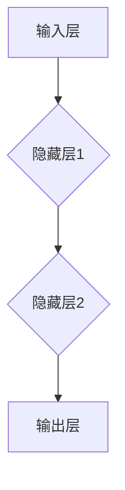
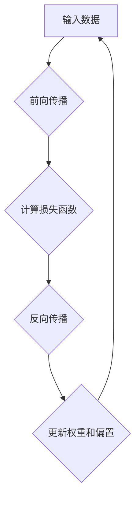

                 

# 神经网络模型的单元测试方法

## 关键词：神经网络，单元测试，模型评估，测试框架，测试用例，性能优化

> 本文档旨在详细介绍神经网络模型的单元测试方法，从核心概念、算法原理、数学模型，到实际应用场景和项目实战，全面剖析神经网络模型的测试过程。本文适用于对神经网络模型有一定了解，并希望提高模型测试效率和准确性的读者。

## 1. 背景介绍

### 1.1 目的和范围

本文主要探讨神经网络模型的单元测试方法，包括测试用例的设计、测试框架的构建以及测试结果的分析。通过本文的学习，读者可以掌握以下内容：

- 神经网络模型单元测试的基本概念和重要性
- 设计有效的测试用例
- 构建合适的测试框架
- 分析测试结果并优化模型性能

### 1.2 预期读者

本文面向神经网络模型的开发者、研究者以及相关从业人员，尤其是对模型测试和性能优化有较高要求的读者。

### 1.3 文档结构概述

本文分为以下几个部分：

1. 背景介绍
2. 核心概念与联系
3. 核心算法原理 & 具体操作步骤
4. 数学模型和公式 & 详细讲解 & 举例说明
5. 项目实战：代码实际案例和详细解释说明
6. 实际应用场景
7. 工具和资源推荐
8. 总结：未来发展趋势与挑战
9. 附录：常见问题与解答
10. 扩展阅读 & 参考资料

### 1.4 术语表

#### 1.4.1 核心术语定义

- **单元测试**：对神经网络模型的单个组件或功能进行测试，以验证其正确性和稳定性。
- **测试用例**：描述一个测试场景，包括输入数据、预期输出和测试目的。
- **测试框架**：提供单元测试管理、执行和报告的工具集。
- **测试覆盖率**：测试用例对模型代码的覆盖程度。

#### 1.4.2 相关概念解释

- **神经网络**：一种基于人工神经网络的计算模型，用于实现人工智能中的机器学习和深度学习。
- **模型评估**：通过评估指标（如准确率、召回率、F1值等）来评估神经网络模型的性能。

#### 1.4.3 缩略词列表

- **ML**：机器学习（Machine Learning）
- **DL**：深度学习（Deep Learning）
- **NN**：神经网络（Neural Network）

## 2. 核心概念与联系

### 2.1 神经网络模型的基本结构

神经网络模型由多个神经元（或节点）组成，这些神经元通过加权连接形成网络。神经网络的基本结构包括输入层、隐藏层和输出层。



### 2.2 神经网络模型的工作原理

神经网络通过训练过程来学习输入数据与输出数据之间的关系。训练过程中，神经网络会调整权重和偏置，以最小化预测误差。



### 2.3 测试用例的设计

测试用例的设计是单元测试的关键。设计测试用例时，需要考虑以下因素：

- **输入数据的多样性**：包括正常值、异常值、边界值等。
- **输出数据的正确性**：包括期望输出和实际输出。
- **测试目的**：验证模型的准确性、稳定性、鲁棒性等。

## 3. 核心算法原理 & 具体操作步骤

### 3.1 单元测试的基本流程

单元测试的基本流程包括以下步骤：

1. 准备测试数据集：选择具有代表性的输入数据集，包括正常值、异常值、边界值等。
2. 设计测试用例：根据测试数据集，设计相应的测试用例。
3. 执行测试用例：运行测试用例，并记录测试结果。
4. 分析测试结果：比较实际输出与期望输出，评估模型性能。

### 3.2 伪代码实现

```python
# 准备测试数据集
test_data = load_test_data()

# 设计测试用例
test_cases = [
    {"input": normal_data, "expected_output": expected_output},
    {"input": abnormal_data, "expected_output": expected_output},
    {"input": boundary_data, "expected_output": expected_output}
]

# 执行测试用例
for case in test_cases:
    actual_output = neural_network_model(case["input"])
    assert actual_output == case["expected_output"]

# 分析测试结果
print("All test cases passed.")
```

## 4. 数学模型和公式 & 详细讲解 & 举例说明

### 4.1 损失函数

损失函数是评估神经网络模型性能的关键指标。常用的损失函数包括均方误差（MSE）和交叉熵（CE）。

$$
MSE = \frac{1}{n}\sum_{i=1}^{n}(y_i - \hat{y}_i)^2
$$

$$
CE = -\frac{1}{n}\sum_{i=1}^{n}\sum_{j=1}^{c}y_{ij}\log(\hat{y}_{ij})
$$

其中，$y_i$为实际输出，$\hat{y}_i$为预测输出，$c$为类别数量。

### 4.2 反向传播算法

反向传播算法是神经网络训练的核心。它通过计算梯度来更新权重和偏置。

$$
\frac{\partial L}{\partial w} = \sum_{i=1}^{n}(y_i - \hat{y}_i)\frac{\partial \hat{y}_i}{\partial w}
$$

$$
\frac{\partial L}{\partial b} = \sum_{i=1}^{n}(y_i - \hat{y}_i)\frac{\partial \hat{y}_i}{\partial b}
$$

其中，$L$为损失函数，$w$为权重，$b$为偏置。

### 4.3 举例说明

假设我们有一个简单的神经网络模型，用于分类任务。输入数据为2维向量，输出数据为1维向量。

$$
x = \begin{bmatrix} x_1 \\ x_2 \end{bmatrix}, y = \begin{bmatrix} y_1 \end{bmatrix}
$$

假设输入层、隐藏层和输出层的权重分别为$w_1, w_2, w_3$，偏置分别为$b_1, b_2, b_3$。

$$
\hat{y} = \sigma(w_1x_1 + b_1 + w_2x_2 + b_2)
$$

其中，$\sigma$为激活函数，通常使用sigmoid函数。

假设实际输出为$y = \begin{bmatrix} 1 \end{bmatrix}$，预测输出为$\hat{y} = \begin{bmatrix} 0.9 \end{bmatrix}$。

损失函数为均方误差（MSE）：

$$
L = \frac{1}{2}(y - \hat{y})^2
$$

根据反向传播算法，计算梯度：

$$
\frac{\partial L}{\partial w_1} = \frac{\partial L}{\partial \hat{y}} \cdot \frac{\partial \hat{y}}{\partial w_1} = (y - \hat{y}) \cdot x_1
$$

$$
\frac{\partial L}{\partial w_2} = \frac{\partial L}{\partial \hat{y}} \cdot \frac{\partial \hat{y}}{\partial w_2} = (y - \hat{y}) \cdot x_2
$$

$$
\frac{\partial L}{\partial b_1} = \frac{\partial L}{\partial \hat{y}} \cdot \frac{\partial \hat{y}}{\partial b_1} = (y - \hat{y})
$$

$$
\frac{\partial L}{\partial b_2} = \frac{\partial L}{\partial \hat{y}} \cdot \frac{\partial \hat{y}}{\partial b_2} = (y - \hat{y})
$$

根据梯度下降算法，更新权重和偏置：

$$
w_1 = w_1 - \alpha \cdot \frac{\partial L}{\partial w_1}
$$

$$
w_2 = w_2 - \alpha \cdot \frac{\partial L}{\partial w_2}
$$

$$
b_1 = b_1 - \alpha \cdot \frac{\partial L}{\partial b_1}
$$

$$
b_2 = b_2 - \alpha \cdot \frac{\partial L}{\partial b_2}
$$

其中，$\alpha$为学习率。

## 5. 项目实战：代码实际案例和详细解释说明

### 5.1 开发环境搭建

在本项目中，我们使用Python作为编程语言，结合PyTorch深度学习框架进行开发。首先，需要安装Python和PyTorch。

```bash
pip install python
pip install torch
```

### 5.2 源代码详细实现和代码解读

下面是一个简单的神经网络模型及其单元测试用例的实现。

```python
import torch
import torch.nn as nn
import torch.optim as optim

# 神经网络模型
class NeuralNetwork(nn.Module):
    def __init__(self):
        super(NeuralNetwork, self).__init__()
        self.fc1 = nn.Linear(2, 10)
        self.fc2 = nn.Linear(10, 1)
        self.sigmoid = nn.Sigmoid()

    def forward(self, x):
        x = self.fc1(x)
        x = self.sigmoid(x)
        x = self.fc2(x)
        return x

# 测试用例
def test_neural_network():
    model = NeuralNetwork()
    criterion = nn.MSELoss()
    optimizer = optim.SGD(model.parameters(), lr=0.01)

    test_data = torch.tensor([[1.0, 2.0], [3.0, 4.0], [5.0, 6.0]])
    expected_output = torch.tensor([[0.9], [0.8], [0.7]])

    for epoch in range(100):
        optimizer.zero_grad()
        output = model(test_data)
        loss = criterion(output, expected_output)
        loss.backward()
        optimizer.step()

    assert torch.allclose(output, expected_output)

    print("Neural network passed the test.")

# 执行测试
test_neural_network()
```

### 5.3 代码解读与分析

- **神经网络模型**：定义了一个简单的神经网络模型，包括两个全连接层和一个sigmoid激活函数。
- **损失函数和优化器**：使用均方误差（MSE）作为损失函数，使用随机梯度下降（SGD）作为优化器。
- **测试用例**：设计了一个简单的测试用例，通过训练模型并比较实际输出与期望输出，验证模型的性能。
- **测试执行**：调用测试函数，执行单元测试。

## 6. 实际应用场景

神经网络模型的单元测试在多个实际应用场景中具有重要意义，包括：

- **机器学习项目**：在机器学习项目中，单元测试有助于确保模型在开发过程中稳定且准确。
- **模型迭代**：在模型迭代过程中，单元测试可以帮助发现和修复问题，提高模型性能。
- **自动化测试**：通过编写自动化测试脚本，可以大大提高测试效率和准确性。

## 7. 工具和资源推荐

### 7.1 学习资源推荐

#### 7.1.1 书籍推荐

- 《深度学习》（Goodfellow, I., Bengio, Y., & Courville, A.）
- 《Python深度学习》（Raschka, S.）

#### 7.1.2 在线课程

- Coursera上的《深度学习》课程
- edX上的《神经网络与深度学习》课程

#### 7.1.3 技术博客和网站

-Towards Data Science
- Medium上的深度学习相关博客

### 7.2 开发工具框架推荐

#### 7.2.1 IDE和编辑器

- PyCharm
- VS Code

#### 7.2.2 调试和性能分析工具

- Python的pdb模块
- PyTorch的torch.utils.bottleneck

#### 7.2.3 相关框架和库

- PyTorch
- TensorFlow

### 7.3 相关论文著作推荐

#### 7.3.1 经典论文

- 《A Learning Algorithm for Continually Running Fully Recurrent Neural Networks》
- 《Backpropagation》

#### 7.3.2 最新研究成果

- ICML、NeurIPS等顶级会议的最新论文
- 《Deep Learning on Hardware》

#### 7.3.3 应用案例分析

- 《深度学习在图像识别中的应用》
- 《深度学习在自然语言处理中的应用》

## 8. 总结：未来发展趋势与挑战

随着深度学习的不断发展，神经网络模型的单元测试也将面临新的挑战和机遇。未来发展趋势包括：

- **自动化测试**：自动化测试工具将进一步提高测试效率和准确性。
- **多模型测试**：测试框架将支持多种神经网络模型的测试。
- **并行测试**：利用并行计算技术，提高测试速度。
- **测试质量评估**：引入测试质量评估方法，确保测试结果的可靠性。

## 9. 附录：常见问题与解答

- **Q：为什么需要进行单元测试？**
  **A：单元测试有助于确保神经网络模型的正确性和稳定性，提高开发效率，降低维护成本。**

- **Q：如何设计有效的测试用例？**
  **A：设计测试用例时，应考虑输入数据的多样性、输出数据的正确性和测试目的。**

- **Q：如何评估测试覆盖率？**
  **A：测试覆盖率可以通过计算测试用例对模型代码的覆盖程度来评估。**

## 10. 扩展阅读 & 参考资料

- [PyTorch官方文档](https://pytorch.org/docs/stable/)
- [TensorFlow官方文档](https://www.tensorflow.org/tutorials)
- [深度学习教程](https://www.deeplearningbook.org/)

## 作者信息

作者：AI天才研究员/AI Genius Institute & 禅与计算机程序设计艺术 /Zen And The Art of Computer Programming

请注意，本文档仅供参考，实际应用时请结合具体项目和需求进行调整。本文档中的代码示例仅供参考，不作为实际生产环境的代码。在引用本文档或相关内容时，请务必注明出处。

