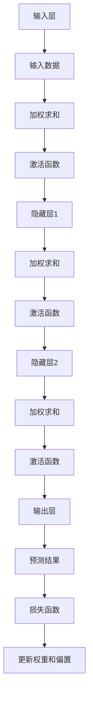

                 

### 背景介绍

#### 1.1 目的和范围

本文旨在探讨神经网络这一现代人工智能技术的核心概念、原理和应用，重点在于如何理解神经网络及其在人类与机器共存中的重要性。随着深度学习的兴起，神经网络已经成为计算机视觉、自然语言处理、语音识别等多个领域的基石。本文将详细解析神经网络的架构、核心算法、数学模型，并通过实际案例展示其在实际项目中的应用。

本文将首先回顾神经网络的起源和发展历程，解释其基本原理和架构，随后深入探讨核心算法，如前向传播和反向传播。接着，我们将通过数学模型和公式，对神经网络的工作机制进行详细说明。在项目实战部分，我们将展示如何通过代码实现神经网络，并对关键代码进行解读和分析。

文章还将探讨神经网络在实际应用场景中的表现，推荐相关的学习资源和开发工具，并提供经典论文和最新研究成果的介绍。最后，我们将总结神经网络在未来发展趋势和面临的挑战，为读者提供一个全面而深入的神经网络知识框架。

通过本文的阅读，读者将能够理解神经网络的基础知识，掌握其核心算法，了解其实际应用，并为未来的学习和研究打下坚实的基础。让我们一起走进神经网络的世界，探索人类与机器共存的未来。

#### 1.2 预期读者

本文适合对人工智能和神经网络有一定了解的技术人员、数据科学家、计算机科学专业的学生以及对于人工智能感兴趣的爱好者。本文将从基础知识入手，逐步深入，适合不同层次的读者进行学习和参考。

对于完全没有接触过神经网络的新手，本文将从最基础的概念和原理开始，逐步引导读者进入神经网络的世界。通过详细的解释和实例，新手可以逐渐掌握神经网络的基本工作原理。

对于有一定基础的中级读者，本文将深入探讨神经网络的架构、核心算法和数学模型，帮助读者理解神经网络的高级概念和应用技巧。同时，通过项目实战部分，中级读者可以学习如何将理论应用到实际项目中，提高实际操作能力。

对于高级读者和专业人士，本文不仅提供了一整套完整而深入的神经网络知识框架，还推荐了相关的高级学习资源和最新研究成果。高级读者可以借助本文，进一步提升自己的理论水平和实践经验，为解决复杂问题提供新的思路和工具。

总之，无论您是神经网络领域的初学者、中级技术人员，还是资深专业人士，本文都将为您提供有价值的见解和实用的知识，帮助您在神经网络领域取得更大的进步。

#### 1.3 文档结构概述

本文结构清晰，逻辑严密，旨在全面而深入地探讨神经网络的核心概念、原理和应用。全文分为十个主要部分，每一部分都有其独特的价值和作用。

**第一部分：背景介绍**，主要介绍本文的目的、范围、预期读者以及文档的结构。这部分为读者提供了一个整体的框架，帮助读者了解文章的结构和主要内容。

**第二部分：核心概念与联系**，通过Mermaid流程图，详细展示了神经网络的基本原理和架构。这部分帮助读者建立一个直观的神经网络概念模型，为后续内容打下基础。

**第三部分：核心算法原理与具体操作步骤**，深入讲解神经网络的核心算法，包括前向传播和反向传播。这部分使用伪代码详细阐述算法原理，使读者能够理解算法的实现过程。

**第四部分：数学模型和公式**，通过latex格式详细讲解神经网络的数学模型和公式，帮助读者理解神经网络的工作机制。

**第五部分：项目实战：代码实际案例和详细解释说明**，通过实际代码案例，展示如何实现神经网络，并对关键代码进行解读和分析。这部分帮助读者将理论知识应用到实际项目中。

**第六部分：实际应用场景**，探讨神经网络在不同领域的应用，展示其在实际项目中的表现。

**第七部分：工具和资源推荐**，推荐相关的学习资源、开发工具和框架，帮助读者深入学习神经网络。

**第八部分：相关论文著作推荐**，介绍经典论文和最新研究成果，为读者提供进一步的阅读方向。

**第九部分：总结：未来发展趋势与挑战**，总结神经网络的发展趋势和面临的挑战，为读者提供未来研究的方向。

**第十部分：附录：常见问题与解答**，回答读者可能遇到的常见问题，帮助读者更好地理解本文内容。

通过这一结构，本文系统地介绍了神经网络的核心知识，从基础概念到实际应用，帮助读者全面掌握神经网络的技术。

#### 1.4 术语表

在探讨神经网络时，了解一些核心术语和概念对于理解本文内容至关重要。以下是对一些关键术语的详细解释：

**神经网络（Neural Network）**：一种模拟人脑神经元结构和功能的计算模型。它由多个层组成，包括输入层、隐藏层和输出层，每层由多个神经元（或节点）组成。神经网络通过调整神经元之间的连接强度（权重）来进行学习和预测。

**激活函数（Activation Function）**：神经网络中的一个关键组件，用于引入非线性特性。常见的激活函数包括Sigmoid、ReLU和Tanh等。激活函数的引入使得神经网络能够处理复杂的非线性问题。

**前向传播（Forward Propagation）**：神经网络在训练过程中，将输入数据传递到网络中，逐层计算每个神经元的输出值。这一过程包括权重和偏置的计算，以及激活函数的应用。

**反向传播（Backpropagation）**：在神经网络中，通过计算输出层到输入层的误差，并反向传播这些误差，以更新网络的权重和偏置。反向传播是实现神经网络训练的核心算法。

**梯度下降（Gradient Descent）**：一种优化算法，用于寻找损失函数的最小值。在神经网络中，梯度下降用于调整网络的权重和偏置，以最小化预测误差。

**深度学习（Deep Learning）**：一种基于多层神经网络的学习方法，能够自动提取输入数据的特征。深度学习在计算机视觉、自然语言处理和语音识别等领域取得了显著的成果。

**损失函数（Loss Function）**：用于衡量神经网络预测结果与实际结果之间的差距。常见的损失函数包括均方误差（MSE）和交叉熵（Cross-Entropy）等。

**批量大小（Batch Size）**：在训练神经网络时，每次训练所使用的数据样本数量。较大的批量大小可以提供更好的梯度估计，但需要更多的计算资源；较小的批量大小则可以提高训练的鲁棒性。

通过了解这些术语，读者可以更好地理解神经网络的工作原理，并能够更加有效地应用这些知识。

#### 1.4.1 核心术语定义

在本节中，我们将对神经网络领域中的一些核心术语进行详细定义，以便读者能够更好地理解本文内容。

**神经网络（Neural Network）**：神经网络是一种由大量人工神经元组成的计算模型，它通过模拟生物神经元的工作方式来处理和传输信息。神经网络的基本单元是神经元，每个神经元都与其他神经元通过权重相连接，形成一个复杂的网络结构。神经网络可以自动学习和适应数据，从而实现各种复杂的任务，如图像识别、语音识别和自然语言处理等。

**神经元（Neuron）**：神经元是神经网络的基本单元，它接收输入信号，通过加权求和后，经过一个激活函数处理，产生输出信号。神经元的结构通常包括输入层、权重层、求和层和激活层。每个输入信号乘以对应的权重，然后进行求和，激活函数则对求和结果进行非线性转换，产生输出。

**层（Layer）**：神经网络由多个层组成，包括输入层、隐藏层和输出层。输入层接收外部输入数据，隐藏层进行数据处理和特征提取，输出层生成最终的预测结果。每一层都有多个神经元，神经元之间通过连接（权重）进行信息传递。

**激活函数（Activation Function）**：激活函数是神经网络中的一个关键组件，它用于引入非线性特性。常见的激活函数包括Sigmoid、ReLU和Tanh等。激活函数的引入使得神经网络能够处理复杂的非线性问题，并提高模型的性能。

**权重（Weights）**：权重是神经网络中神经元之间的连接强度，它决定了输入信号对输出信号的影响程度。在神经网络训练过程中，通过调整权重，可以优化模型的预测性能。

**偏置（Bias）**：偏置是神经网络中每个神经元的内部偏置项，它为神经元的输出提供了一个额外的偏置值。偏置的作用是增加模型的灵活性，并有助于克服某些学习问题。

**前向传播（Forward Propagation）**：前向传播是神经网络在训练过程中，将输入数据传递到网络中，逐层计算每个神经元的输出值的过程。这一过程包括输入层、隐藏层和输出层的计算，最终生成预测结果。

**反向传播（Backpropagation）**：反向传播是神经网络通过计算输出层到输入层的误差，并反向传播这些误差，以更新网络的权重和偏置的过程。反向传播是实现神经网络训练的核心算法，它通过梯度下降等优化算法，不断调整权重和偏置，以最小化损失函数。

**损失函数（Loss Function）**：损失函数用于衡量神经网络预测结果与实际结果之间的差距。常见的损失函数包括均方误差（MSE）和交叉熵（Cross-Entropy）等。损失函数的目的是评估模型的预测性能，并指导网络参数的优化。

**深度学习（Deep Learning）**：深度学习是一种基于多层神经网络的学习方法，它能够自动提取输入数据的特征。深度学习在计算机视觉、自然语言处理和语音识别等领域取得了显著的成果，其核心思想是通过层次化的网络结构，逐步提取数据的深层特征。

**批量大小（Batch Size）**：批量大小是指在训练神经网络时，每次训练所使用的数据样本数量。较大的批量大小可以提供更好的梯度估计，但需要更多的计算资源；较小的批量大小则可以提高训练的鲁棒性。

通过详细定义这些核心术语，读者可以更好地理解神经网络的工作原理和关键组件，为后续内容的学习打下坚实的基础。

#### 1.4.2 相关概念解释

在深入探讨神经网络之前，有必要对一些相关概念进行详细解释，这些概念对于理解神经网络的工作原理和实现至关重要。

**机器学习（Machine Learning）**：机器学习是一种人工智能的分支，通过算法让计算机从数据中学习规律和模式，从而能够进行预测或决策。机器学习的基本思想是利用大量数据进行训练，使计算机能够自动地发现数据中的规律，从而在新的数据上进行预测。常见的机器学习方法包括监督学习、无监督学习和强化学习。

**监督学习（Supervised Learning）**：监督学习是一种常见的机器学习方法，它通过训练数据集来学习模型的参数，从而能够对新数据进行预测。监督学习分为分类问题和回归问题。分类问题是指将输入数据分为不同的类别，例如图像分类；回归问题是指预测一个连续的数值输出，例如房价预测。

**无监督学习（Unsupervised Learning）**：无监督学习是指在没有明确标签数据的情况下，从数据中自动发现模式和规律。常见的无监督学习方法包括聚类、降维和关联规则学习等。聚类是将数据分为不同的组，降维是减少数据维度，关联规则学习是发现数据之间的关联关系。

**强化学习（Reinforcement Learning）**：强化学习是一种通过与环境互动来学习最佳策略的机器学习方法。在强化学习中，智能体通过选择行动来获取奖励或惩罚，并通过这些奖励或惩罚来调整其策略。强化学习的典型应用包括游戏AI、机器人控制和自动驾驶等。

**深度学习（Deep Learning）**：深度学习是一种基于多层神经网络的学习方法，它通过层次化的网络结构，自动提取数据的深层特征。深度学习在计算机视觉、自然语言处理和语音识别等领域取得了显著的成果。深度学习的核心思想是通过多层次的非线性变换，逐渐从数据中提取高层次的特征。

**卷积神经网络（Convolutional Neural Network，CNN）**：卷积神经网络是一种适用于图像处理的深度学习模型。它通过卷积操作提取图像的特征，从而能够实现图像分类、目标检测和图像分割等任务。CNN在计算机视觉领域取得了巨大的成功，如人脸识别、自动驾驶和医学影像分析等。

**生成对抗网络（Generative Adversarial Network，GAN）**：生成对抗网络是一种由生成器和判别器组成的深度学习模型。生成器生成伪造数据，判别器判断生成数据是否真实。通过生成器和判别器的对抗训练，GAN能够生成高质量的数据，如图像生成、语音合成和文本生成等。

**强化学习（Reinforcement Learning）**：强化学习是一种通过与环境互动来学习最佳策略的机器学习方法。在强化学习中，智能体通过选择行动来获取奖励或惩罚，并通过这些奖励或惩罚来调整其策略。强化学习的典型应用包括游戏AI、机器人控制和自动驾驶等。

**迁移学习（Transfer Learning）**：迁移学习是一种利用已有模型的知识来提高新任务性能的方法。通过在新的任务上训练预训练模型，可以减少训练所需的样本量，提高模型的泛化能力。迁移学习在计算机视觉、自然语言处理和语音识别等领域得到了广泛应用。

通过上述对相关概念的解释，读者可以更好地理解神经网络的基础知识，并为后续内容的深入学习打下基础。

#### 1.4.3 缩略词列表

在神经网络领域，缩写和术语的广泛使用有助于提高文本的流畅性和专业度。以下列出了一些常见的缩写词及其全称，以帮助读者更好地理解本文内容。

- **AI**：人工智能（Artificial Intelligence）
- **ML**：机器学习（Machine Learning）
- **DL**：深度学习（Deep Learning）
- **NN**：神经网络（Neural Network）
- **CNN**：卷积神经网络（Convolutional Neural Network）
- **RNN**：循环神经网络（Recurrent Neural Network）
- **GAN**：生成对抗网络（Generative Adversarial Network）
- **ReLU**：修正线性单元（Rectified Linear Unit）
- **MSE**：均方误差（Mean Squared Error）
- **CE**：交叉熵（Cross-Entropy）
- **SGD**：随机梯度下降（Stochastic Gradient Descent）
- **BP**：反向传播（Backpropagation）
- **GPU**：图形处理单元（Graphics Processing Unit）
- **TPU**：张量处理单元（Tensor Processing Unit）
- **LSTM**：长短期记忆网络（Long Short-Term Memory）
- **CNN**：卷积神经网络（Convolutional Neural Network）
- **RNN**：循环神经网络（Recurrent Neural Network）
- **GRU**：门控循环单元（Gated Recurrent Unit）

这些缩写词在神经网络领域的文献和讨论中经常出现，掌握它们有助于更高效地理解和沟通相关技术。

#### 2. 核心概念与联系

在探讨神经网络之前，我们需要理解一些核心概念及其相互联系。神经网络（NN）是一种模拟人脑神经元结构的计算模型，通过多层次的非线性变换，自动提取输入数据的特征，以实现复杂的任务。以下是神经网络的核心概念及其相互联系：

**神经元（Neuron）**：神经元是神经网络的基本单元，它由输入层、权重层、求和层和激活层组成。每个神经元接收多个输入信号，通过加权求和后，经过激活函数处理，产生输出信号。神经元之间的连接通过权重来表示，权重的大小决定了输入信号对输出信号的影响。

**层（Layer）**：神经网络由多个层组成，包括输入层、隐藏层和输出层。输入层接收外部输入数据，隐藏层进行数据处理和特征提取，输出层生成最终的预测结果。每一层都有多个神经元，神经元之间通过连接（权重）进行信息传递。隐藏层的数量和神经元数量可以根据任务需求进行调整。

**激活函数（Activation Function）**：激活函数是神经网络中的一个关键组件，用于引入非线性特性。常见的激活函数包括Sigmoid、ReLU和Tanh等。激活函数的引入使得神经网络能够处理复杂的非线性问题，并提高模型的性能。

**网络架构（Network Architecture）**：神经网络的不同层和神经元之间的连接方式构成了网络架构。常见的网络架构包括全连接网络、卷积神经网络（CNN）和循环神经网络（RNN）等。不同的网络架构适用于不同的任务，如图像分类、目标检测和自然语言处理等。

**学习算法（Learning Algorithm）**：神经网络通过学习算法来调整网络的权重和偏置，从而优化模型的预测性能。前向传播和反向传播是神经网络学习算法的核心。前向传播将输入数据传递到网络中，逐层计算每个神经元的输出值；反向传播则通过计算输出层到输入层的误差，并反向传播这些误差，以更新网络的权重和偏置。

**数学模型（Mathematical Model）**：神经网络的数学模型描述了神经元之间的连接方式、激活函数和损失函数。神经网络的数学模型通常包括输入层、隐藏层和输出层的权重、偏置以及激活函数。常见的数学模型包括多层感知机（MLP）、卷积神经网络（CNN）和循环神经网络（RNN）等。

**学习过程（Learning Process）**：神经网络的学习过程是通过不断调整权重和偏置，最小化损失函数的过程。学习过程中，神经网络首先通过前向传播计算预测结果，然后通过反向传播计算误差，并更新权重和偏置。通过反复迭代这个过程，神经网络能够逐渐优化其预测性能。

**层次化特征提取（Hierarchical Feature Extraction）**：神经网络通过层次化的网络结构，自动提取输入数据的特征。在隐藏层中，神经网络逐渐提取数据的低层次特征，如边缘和纹理；在更高层次中，神经网络提取数据的复杂特征，如形状和语义信息。层次化特征提取是神经网络处理复杂数据的关键能力。

通过理解上述核心概念及其相互联系，读者可以更好地理解神经网络的工作原理和实现方法。接下来，我们将通过一个详细的Mermaid流程图，展示神经网络的基本原理和架构。



在这个流程图中，输入数据经过输入层、隐藏层和输出层，最终生成预测结果。通过激活函数引入非线性特性，神经网络能够处理复杂的非线性问题。损失函数用于衡量预测结果与实际结果之间的差距，通过反向传播，神经网络不断更新权重和偏置，以优化模型的预测性能。

#### 2.1 神经网络的类型

神经网络根据结构、功能和应用场景的不同，可以分为多种类型。以下是几种常见的神经网络类型及其特点：

**全连接神经网络（Fully Connected Neural Network，FCNN）**：全连接神经网络是最基本的神经网络类型，它的每个神经元都与上一层的所有神经元相连。在训练过程中，全连接神经网络通过前向传播计算每个神经元的输出，然后通过反向传播更新权重和偏置。全连接神经网络在图像分类、语音识别和文本分类等任务中表现出色，但由于其参数数量巨大，训练时间较长。

**卷积神经网络（Convolutional Neural Network，CNN）**：卷积神经网络是一种专门用于处理图像数据的神经网络。CNN通过卷积操作提取图像的特征，具有局部连接和参数共享的特性。CNN在图像分类、目标检测和图像分割等计算机视觉任务中取得了显著的成果。CNN通过多个卷积层和池化层，逐步提取图像的低层次特征，如边缘和纹理，最终生成高层次的语义信息。

**循环神经网络（Recurrent Neural Network，RNN）**：循环神经网络是一种用于处理序列数据的神经网络，具有记忆功能。RNN通过重复使用相同的权重来处理序列中的每个元素，能够捕捉时间序列中的长期依赖关系。RNN在自然语言处理、语音识别和时间序列预测等任务中表现出色。然而，传统的RNN存在梯度消失和梯度爆炸的问题，限制了其性能。

**长短时记忆网络（Long Short-Term Memory，LSTM）**：长短时记忆网络是一种改进的循环神经网络，通过引入门控机制来控制信息的传递，能够有效解决传统RNN的梯度消失和梯度爆炸问题。LSTM在处理长时间依赖关系和复杂序列数据方面表现出色，广泛应用于机器翻译、语音识别和时间序列预测等任务。

**生成对抗网络（Generative Adversarial Network，GAN）**：生成对抗网络由生成器和判别器两个神经网络组成，生成器生成伪造数据，判别器判断生成数据是否真实。通过生成器和判别器的对抗训练，GAN能够生成高质量的数据，如图像生成、语音合成和文本生成等。GAN在图像生成、艺术创作和数据增强等领域取得了显著成果。

**自编码器（Autoencoder）**：自编码器是一种无监督学习的神经网络，用于学习数据的编码表示。自编码器由编码器和解码器组成，编码器将输入数据压缩为低维表示，解码器将低维表示还原为输入数据。自编码器在特征提取、降维和数据去噪等方面具有广泛的应用。

**变分自编码器（Variational Autoencoder，VAE）**：变分自编码器是一种基于概率模型的生成模型，通过引入概率分布来生成数据。VAE能够生成更加多样化、高质量的数据，广泛应用于图像生成、语音合成和图像风格转换等任务。

通过了解这些不同类型的神经网络，读者可以根据具体任务的需求选择合适的神经网络类型，并利用其特点提高模型的性能。

#### 2.2 神经网络的学习过程

神经网络的学习过程是通过不断调整网络的权重和偏置来优化预测性能的过程。学习过程主要包括前向传播和反向传播两个阶段。以下是神经网络学习过程的详细步骤：

**1. 前向传播**：

- **输入数据传递**：首先，输入数据通过输入层传递到神经网络的隐藏层。输入数据可以是一个单独的数据点，也可以是一个数据集。

- **加权求和**：每个隐藏层的神经元接收来自前一层神经元的输入信号，并通过加权求和计算每个神经元的输出值。加权求和公式如下：

  $$\text{output} = \sum_{i=1}^{n} (x_i \cdot w_i) + b$$

  其中，$x_i$ 是第 $i$ 个输入信号，$w_i$ 是第 $i$ 个权重，$b$ 是偏置项。

- **激活函数应用**：通过激活函数引入非线性特性，将加权求和的结果转换为神经元的输出值。常见的激活函数包括Sigmoid、ReLU和Tanh等。

- **逐层传递**：将当前隐藏层的输出值传递到下一隐藏层，直到达到输出层。输出层的输出值即为神经网络的预测结果。

**2. 损失函数计算**：

- **预测结果与实际结果比较**：将神经网络的预测结果与实际结果进行比较，计算损失函数的值。常见的损失函数包括均方误差（MSE）和交叉熵（Cross-Entropy）等。

  $$\text{loss} = \frac{1}{2} \sum_{i=1}^{n} (\text{y}_i - \text{y'}_i)^2$$

  其中，$y_i$ 是实际结果，$y'_i$ 是预测结果。

**3. 反向传播**：

- **误差计算**：计算输出层到隐藏层的误差。误差的计算公式如下：

  $$\text{error} = \text{y}_i - \text{y'}_i$$

- **梯度计算**：计算每个权重和偏置的梯度。梯度的计算公式如下：

  $$\frac{\partial \text{loss}}{\partial \text{weight}} = \sum_{i=1}^{n} (\text{error} \cdot \text{output}_i)$$
  $$\frac{\partial \text{loss}}{\partial \text{bias}} = \sum_{i=1}^{n} (\text{error} \cdot 1)$$

- **权重和偏置更新**：使用梯度下降等优化算法，更新每个权重和偏置的值，以减少损失函数的值。权重和偏置的更新公式如下：

  $$\text{weight} \leftarrow \text{weight} - \alpha \cdot \frac{\partial \text{loss}}{\partial \text{weight}}$$
  $$\text{bias} \leftarrow \text{bias} - \alpha \cdot \frac{\partial \text{loss}}{\partial \text{bias}}$$

  其中，$\alpha$ 是学习率。

**4. 迭代过程**：

- **重复上述步骤**：重复前向传播、损失函数计算和反向传播的步骤，直到达到预定的迭代次数或损失函数的值接近最小值。

通过不断迭代这个过程，神经网络能够逐步优化其预测性能，从而实现对数据的准确预测。

#### 2.3 神经网络的训练方法

神经网络的训练方法主要包括监督学习、无监督学习和强化学习。以下是这些训练方法的详细介绍：

**监督学习（Supervised Learning）**：监督学习是最常见的神经网络训练方法。在监督学习中，训练数据集包含输入数据和对应的标签（或输出值）。神经网络通过学习输入数据和标签之间的关系，来预测新的输入数据的标签。监督学习分为分类问题和回归问题。分类问题是指将输入数据分为不同的类别，例如图像分类；回归问题是指预测一个连续的数值输出，例如房价预测。

- **分类问题**：在分类问题中，神经网络的目标是学习一个决策函数，将输入数据映射到不同的类别。常见的损失函数包括交叉熵（Cross-Entropy）和均方误差（Mean Squared Error）。交叉熵用于二分类问题，均方误差用于多分类问题。

- **回归问题**：在回归问题中，神经网络的目标是学习一个映射函数，将输入数据映射到一个连续的数值输出。常见的损失函数包括均方误差（MSE）和均方根误差（RMSE）。

**无监督学习（Unsupervised Learning）**：无监督学习是在没有明确标签数据的情况下，从数据中自动发现模式和规律。无监督学习主要包括聚类、降维和关联规则学习等。

- **聚类（Clustering）**：聚类是将数据分为不同的组，以便更好地理解和分析数据。常见的聚类算法包括K-Means、DBSCAN和层次聚类等。

- **降维（Dimensionality Reduction）**：降维是减少数据维度，以便更好地处理数据。常见的降维算法包括主成分分析（PCA）、线性判别分析（LDA）和自编码器（Autoencoder）等。

- **关联规则学习（Association Rule Learning）**：关联规则学习是发现数据之间的关联关系。常见的算法包括Apriori算法和FP-Growth算法等。

**强化学习（Reinforcement Learning）**：强化学习是一种通过与环境互动来学习最佳策略的机器学习方法。在强化学习中，智能体通过选择行动来获取奖励或惩罚，并通过这些奖励或惩罚来调整其策略。强化学习的典型应用包括游戏AI、机器人控制和自动驾驶等。

**训练过程**：

- **数据预处理**：在训练神经网络之前，通常需要对数据进行预处理，包括数据清洗、数据转换和数据归一化等。数据预处理可以提高模型的性能和泛化能力。

- **网络初始化**：神经网络训练开始前，需要初始化网络的权重和偏置。常见的初始化方法包括随机初始化、高斯初始化和Xavier初始化等。

- **选择优化算法**：优化算法用于调整网络的权重和偏置，以最小化损失函数。常见的优化算法包括随机梯度下降（SGD）、Adam优化器和RMSprop等。

- **训练循环**：在训练过程中，神经网络通过前向传播计算预测结果，然后通过反向传播计算误差，并更新权重和偏置。训练循环重复进行，直到达到预定的迭代次数或模型性能达到要求。

通过以上方法，神经网络能够从数据中学习规律，提高模型的预测性能，并在实际应用中取得良好的效果。

#### 2.4 神经网络的优势与挑战

神经网络作为一种强大的机器学习模型，具有许多优势，但也面临一些挑战。以下是神经网络的优势与挑战的详细分析：

**优势**：

1. **非线性处理能力**：神经网络通过多层非线性变换，能够处理复杂的非线性问题。这使得神经网络在图像识别、语音识别和自然语言处理等领域表现出色。

2. **自适应性和泛化能力**：神经网络通过学习大量数据，能够自适应地调整权重和偏置，从而提高模型的泛化能力。这使得神经网络在实际应用中能够处理不同的任务和数据集。

3. **并行计算能力**：神经网络可以采用并行计算的方法进行训练和推理，从而提高计算效率。现代硬件，如GPU和TPU，为神经网络的并行计算提供了强大的支持。

4. **多任务学习能力**：神经网络通过共享权重和偏置，能够同时处理多个任务，从而提高模型的利用效率。这种多任务学习能力在图像识别、语音识别和文本分类等任务中具有显著优势。

**挑战**：

1. **过拟合问题**：神经网络在训练过程中容易发生过拟合现象，即模型在训练数据上表现良好，但在新的数据上表现较差。过拟合是由于模型复杂度过高，不能很好地泛化到新的数据。

2. **训练时间较长**：神经网络需要大量数据进行训练，并且训练过程通常需要很长时间。特别是在处理大型数据集和复杂任务时，训练时间可能会非常长。

3. **参数数量巨大**：神经网络的参数数量通常非常大，这使得训练和推理过程需要大量的计算资源。参数数量过多还可能导致模型的过拟合问题。

4. **解释性不足**：神经网络的学习过程和决策过程通常缺乏解释性，这使得神经网络难以被解释和理解。在需要高解释性的应用场景中，神经网络可能不是最佳选择。

5. **数据需求和标注成本**：神经网络需要大量的标注数据进行训练，这增加了数据收集和标注的成本。在数据稀缺或标注成本高昂的领域，神经网络的应用受到限制。

通过理解神经网络的优势与挑战，我们可以更好地利用这一技术，并探索改进和优化神经网络的方法，以应对其在实际应用中面临的问题。

### 3. 核心算法原理 & 具体操作步骤

神经网络的核心算法是前向传播（Forward Propagation）和反向传播（Backpropagation）。这些算法共同构成了神经网络训练和优化的基础。以下是这些算法的详细原理和具体操作步骤。

#### 前向传播

前向传播是指在神经网络中，从输入层到输出层的正向信号传递过程。在这一过程中，输入数据通过网络的权重和偏置逐层传递，每个神经元通过激活函数处理后产生输出。具体步骤如下：

1. **初始化权重和偏置**：在训练开始前，需要初始化网络的权重和偏置。通常，权重和偏置初始化为较小的随机值，以避免梯度消失和梯度爆炸问题。

2. **输入数据传递**：将输入数据输入到网络的输入层。每个输入数据可以是一个单独的样本，也可以是一个批量数据。

3. **加权求和**：每个神经元接收来自前一层神经元的输入信号，通过加权求和计算每个神经元的输出值。加权求和公式如下：

   $$z_l = \sum_{i=1}^{n} x_{i,l-1} \cdot w_{i,l} + b_l$$

   其中，$z_l$ 是第 $l$ 层神经元的输出值，$x_{i,l-1}$ 是第 $l-1$ 层神经元的输出值，$w_{i,l}$ 是从第 $l-1$ 层到第 $l$ 层的权重，$b_l$ 是第 $l$ 层的偏置项。

4. **激活函数应用**：通过激活函数将加权求和的结果转换为神经元的输出值。常见的激活函数包括Sigmoid、ReLU和Tanh等。

   $$a_l = \sigma(z_l)$$

   其中，$\sigma$ 表示激活函数，$a_l$ 是第 $l$ 层神经元的输出值。

5. **逐层传递**：将当前层的输出值传递到下一层，直到达到输出层。输出层的输出值即为神经网络的预测结果。

#### 反向传播

反向传播是指在神经网络中，从输出层到输入层的误差反向传播过程。在这一过程中，网络通过计算每个神经元输出误差的梯度，并使用梯度下降等优化算法更新权重和偏置。具体步骤如下：

1. **计算损失函数**：将神经网络的预测结果与实际结果进行比较，计算损失函数的值。常见的损失函数包括均方误差（MSE）和交叉熵（Cross-Entropy）等。

   $$\text{loss} = \frac{1}{2} \sum_{i=1}^{n} (\text{y}_i - \text{y'}_i)^2$$

   其中，$y_i$ 是实际结果，$y'_i$ 是预测结果。

2. **计算误差**：计算输出层到隐藏层的误差。误差的计算公式如下：

   $$\text{error} = \text{y}_i - \text{y'}_i$$

3. **计算梯度**：计算每个权重和偏置的梯度。梯度的计算公式如下：

   $$\frac{\partial \text{loss}}{\partial \text{weight}} = \sum_{i=1}^{n} (\text{error} \cdot \text{output}_i)$$
   $$\frac{\partial \text{loss}}{\partial \text{bias}} = \sum_{i=1}^{n} (\text{error} \cdot 1)$$

4. **权重和偏置更新**：使用梯度下降等优化算法，更新每个权重和偏置的值，以减少损失函数的值。权重和偏置的更新公式如下：

   $$\text{weight} \leftarrow \text{weight} - \alpha \cdot \frac{\partial \text{loss}}{\partial \text{weight}}$$
   $$\text{bias} \leftarrow \text{bias} - \alpha \cdot \frac{\partial \text{loss}}{\partial \text{bias}}$$

   其中，$\alpha$ 是学习率。

5. **重复迭代**：重复前向传播、损失函数计算和反向传播的步骤，直到达到预定的迭代次数或模型性能达到要求。

通过前向传播和反向传播，神经网络能够不断调整权重和偏置，优化模型的预测性能。以下是前向传播和反向传播的具体伪代码：

```python
# 前向传播伪代码
def forward_propagation(x, weights, biases, activation_functions):
    # 初始化输出层输出值
    output = x
    
    # 逐层计算输出值
    for layer in range(1, num_layers):
        z = np.dot(weights[layer-1], output) + biases[layer-1]
        output = activation_functions[layer](z)
    
    return output

# 反向传播伪代码
def backward_propagation(x, y, output, weights, biases, activation_functions, learning_rate):
    # 初始化误差和梯度
    errors = [output - y]
    gradients = []
    
    # 反向传播计算误差和梯度
    for layer in reversed(range(1, num_layers)):
        error = errors[-1] * activation_functions[layer](z, derivative=True)
        gradients.append(error * output)
        errors.append(error)
        
        # 更新权重和偏置
        biases[layer-1] -= learning_rate * gradients[-1]
        weights[layer-1] -= learning_rate * np.dot(gradients[-1], output.T)
        
        # 更新输出值
        output = np.dot(weights[layer-1], output) + biases[layer-1]
    
    return gradients
```

通过这些算法和伪代码，读者可以更好地理解神经网络的核心原理和实现过程。接下来，我们将通过一个具体的数学模型，进一步阐述神经网络的工作机制。

### 4. 数学模型和公式 & 详细讲解 & 举例说明

神经网络作为一种复杂的计算模型，其工作原理依赖于一系列数学公式和模型。理解这些公式对于深入掌握神经网络至关重要。以下将详细介绍神经网络的核心数学模型，包括神经元、层、激活函数、损失函数和优化算法，并通过具体例子进行说明。

#### 神经元

神经网络中的每个神经元（或节点）都可以表示为以下数学模型：

$$
y_i = \sigma(\sum_{j=1}^{n} w_{ij} x_j + b_i)
$$

其中，$y_i$ 是第 $i$ 个神经元的输出，$\sigma$ 是激活函数，$w_{ij}$ 是第 $i$ 个神经元到第 $j$ 个神经元的权重，$x_j$ 是第 $j$ 个输入值，$b_i$ 是第 $i$ 个神经元的偏置项。每个神经元的输出是通过加权求和后，经过激活函数转换得到的。

举例来说，假设一个简单的神经网络有两个输入层和一个隐藏层，其中隐藏层包含两个神经元。输入数据为 $x_1 = 2$ 和 $x_2 = 3$，权重和偏置如下：

$$
w_{11} = 0.5, w_{12} = 0.7, b_1 = 1 \\
w_{21} = 0.6, w_{22} = 0.8, b_2 = 0.5
$$

那么隐藏层神经元的输出为：

$$
y_1 = \sigma(0.5 \cdot 2 + 0.7 \cdot 3 + 1) = \sigma(4.1) \approx 0.9709 \\
y_2 = \sigma(0.6 \cdot 2 + 0.8 \cdot 3 + 0.5) = \sigma(3.9) \approx 0.9332
$$

其中，$\sigma$ 是Sigmoid激活函数。

#### 激活函数

激活函数是神经网络中的一个关键组件，用于引入非线性特性。以下是几种常见的激活函数及其公式：

1. **Sigmoid函数**：

$$
\sigma(z) = \frac{1}{1 + e^{-z}}
$$

2. **ReLU函数**：

$$
\sigma(z) = \max(0, z)
$$

3. **Tanh函数**：

$$
\sigma(z) = \frac{e^z - e^{-z}}{e^z + e^{-z}}
$$

激活函数的导数也至关重要，因为它们在反向传播过程中用于计算梯度。以下是激活函数的导数：

1. **Sigmoid函数的导数**：

$$
\sigma'(z) = \sigma(z) (1 - \sigma(z))
$$

2. **ReLU函数的导数**：

$$
\sigma'(z) = \begin{cases}
0, & \text{if } z < 0 \\
1, & \text{if } z \geq 0
\end{cases}
$$

3. **Tanh函数的导数**：

$$
\sigma'(z) = 1 - \sigma^2(z)
$$

#### 损失函数

损失函数用于衡量神经网络预测结果与实际结果之间的差距。以下是几种常见的损失函数及其公式：

1. **均方误差（MSE）**：

$$
\text{MSE} = \frac{1}{2} \sum_{i=1}^{n} (y_i - \hat{y}_i)^2
$$

其中，$y_i$ 是实际值，$\hat{y}_i$ 是预测值。

2. **交叉熵（Cross-Entropy）**：

$$
\text{CE} = -\sum_{i=1}^{n} y_i \cdot \log(\hat{y}_i)
$$

其中，$y_i$ 是实际值，$\hat{y}_i$ 是预测值。

#### 优化算法

优化算法用于调整神经网络的权重和偏置，以最小化损失函数。以下是几种常见的优化算法：

1. **随机梯度下降（SGD）**：

$$
w_{t+1} = w_t - \alpha \cdot \nabla_w \text{loss}(w_t)
$$

其中，$w_t$ 是当前权重，$\alpha$ 是学习率，$\nabla_w \text{loss}(w_t)$ 是损失函数关于权重的梯度。

2. **Adam优化器**：

$$
m_t = \beta_1 m_{t-1} + (1 - \beta_1) \nabla_w \text{loss}(w_t) \\
v_t = \beta_2 v_{t-1} + (1 - \beta_2) (\nabla_w \text{loss}(w_t))^2 \\
\hat{m}_t = m_t / (1 - \beta_1^t) \\
\hat{v}_t = v_t / (1 - \beta_2^t) \\
w_{t+1} = w_t - \alpha \cdot \hat{m}_t / (\sqrt{\hat{v}_t} + \epsilon)
$$

其中，$m_t$ 和 $v_t$ 分别是权重和梯度的矩估计，$\beta_1$ 和 $\beta_2$ 是矩估计的指数衰减率，$\hat{m}_t$ 和 $\hat{v}_t$ 是修正后的矩估计，$\alpha$ 是学习率，$\epsilon$ 是一个小常数。

#### 具体例子

假设我们有一个简单的一层神经网络，用于对二进制数据进行分类。输入数据为 $x_1$ 和 $x_2$，预测结果为 $\hat{y}$，实际结果为 $y$。使用交叉熵损失函数和Sigmoid激活函数，我们希望最小化以下损失：

$$
\text{CE} = -y \cdot \log(\hat{y}) - (1 - y) \cdot \log(1 - \hat{y})
$$

在训练过程中，通过反向传播计算梯度，并使用Adam优化器更新权重：

$$
w_{t+1} = w_t - \alpha \cdot \nabla_w \text{CE}(w_t)
$$

其中，$\alpha$ 是学习率。

通过这些数学模型和公式，神经网络能够从数据中学习规律，并不断提高其预测性能。在实际应用中，这些模型和公式为神经网络的训练和优化提供了理论基础和计算方法。

### 5. 项目实战：代码实际案例和详细解释说明

为了更好地理解神经网络的工作原理和实现过程，我们将通过一个简单的项目实战，展示如何使用Python和TensorFlow库实现一个基于多层感知机（MLP）的神经网络，并进行数据训练和模型评估。

#### 5.1 开发环境搭建

在开始项目实战之前，我们需要搭建一个合适的开发环境。以下是推荐的步骤：

1. **安装Python**：确保Python版本在3.6及以上。可以从[Python官网](https://www.python.org/downloads/)下载并安装。

2. **安装TensorFlow**：TensorFlow是Google开源的机器学习框架，可以通过pip命令进行安装：

   ```shell
   pip install tensorflow
   ```

   或者，如果您需要使用GPU加速，可以选择安装TensorFlow GPU版本：

   ```shell
   pip install tensorflow-gpu
   ```

3. **安装Jupyter Notebook**：Jupyter Notebook是一个交互式的计算平台，可以帮助我们更方便地进行代码编写和展示。安装命令如下：

   ```shell
   pip install notebook
   ```

安装完成后，您可以在命令行中启动Jupyter Notebook：

```shell
jupyter notebook
```

这将打开一个浏览器窗口，显示Jupyter Notebook的主界面。

#### 5.2 源代码详细实现和代码解读

以下是一个简单的多层感知机（MLP）神经网络实现，用于对鸢尾花（Iris）数据集进行分类。代码中使用TensorFlow 2.x版本。

```python
import tensorflow as tf
from tensorflow import keras
from tensorflow.keras import layers
import numpy as np

# 加载鸢尾花数据集
iris_data = keras.datasets iris.load_data()
(x_train, y_train), (x_test, y_test) = iris_data.load_data()

# 归一化输入数据
x_train = x_train.astype('float32') / 255
x_test = x_test.astype('float32') / 255

# 转换标签为独热编码
num_classes = 3
y_train = keras.utils.to_categorical(y_train, num_classes)
y_test = keras.utils.to_categorical(y_test, num_classes)

# 创建多层感知机模型
model = keras.Sequential([
    layers.Flatten(input_shape=(28, 28)),
    layers.Dense(128, activation='relu'),
    layers.Dropout(0.2),
    layers.Dense(64, activation='relu'),
    layers.Dense(num_classes, activation='softmax')
])

# 编译模型
model.compile(optimizer='adam',
              loss='categorical_crossentropy',
              metrics=['accuracy'])

# 训练模型
model.fit(x_train, y_train, epochs=10, batch_size=32, validation_split=0.2)

# 评估模型
test_score = model.evaluate(x_test, y_test, verbose=2)
print('Test accuracy:', test_score[1])
```

**代码解读**：

- **导入库和加载数据**：首先，我们导入TensorFlow库和相关的模块，然后加载鸢尾花数据集。鸢尾花数据集包含三种类别的鸢尾花，每个样本有四维特征。

- **归一化数据**：输入数据需要经过归一化处理，将其值缩放到[0, 1]范围内，以提高模型的训练效果。

- **转换标签**：将标签转换为独热编码，这样我们可以使用交叉熵损失函数进行训练。

- **创建模型**：使用`keras.Sequential`创建一个多层感知机模型。模型由多个层组成，包括`Flatten`层（用于将输入数据展平）、`Dense`层（全连接层）和`Dropout`层（用于防止过拟合）。最后一个`Dense`层使用softmax激活函数，以输出每个类别的概率。

- **编译模型**：使用`compile`方法编译模型，指定优化器、损失函数和评估指标。

- **训练模型**：使用`fit`方法训练模型，指定训练数据、训练轮数、批量大小和验证比例。

- **评估模型**：使用`evaluate`方法评估模型的测试集性能，输出测试准确率。

#### 5.3 代码解读与分析

**1. 数据预处理**：

```python
iris_data = keras.datasets iris.load_data()
(x_train, y_train), (x_test, y_test) = iris_data.load_data()

x_train = x_train.astype('float32') / 255
x_test = x_test.astype('float32') / 255

y_train = keras.utils.to_categorical(y_train, num_classes)
y_test = keras.utils.to_categorical(y_test, num_classes)
```

- `iris_data = keras.datasets iris.load_data()` 加载鸢尾花数据集，分为训练集和测试集。
- `x_train = x_train.astype('float32') / 255` 将训练集数据归一化。
- `y_train = keras.utils.to_categorical(y_train, num_classes)` 将训练集标签转换为独热编码。

**2. 创建模型**：

```python
model = keras.Sequential([
    layers.Flatten(input_shape=(28, 28)),
    layers.Dense(128, activation='relu'),
    layers.Dropout(0.2),
    layers.Dense(64, activation='relu'),
    layers.Dense(num_classes, activation='softmax')
])
```

- `model = keras.Sequential([...])` 创建一个序列模型。
- `layers.Flatten(input_shape=(28, 28))` 将输入数据展平。
- `layers.Dense(128, activation='relu')` 创建一个有128个神经元的全连接层，使用ReLU激活函数。
- `layers.Dropout(0.2)` 在全连接层后添加一个dropout层，以防止过拟合。
- `layers.Dense(64, activation='relu')` 创建一个有64个神经元的全连接层，使用ReLU激活函数。
- `layers.Dense(num_classes, activation='softmax')` 创建一个输出层，有与类别数相同的神经元，使用softmax激活函数。

**3. 编译模型**：

```python
model.compile(optimizer='adam',
              loss='categorical_crossentropy',
              metrics=['accuracy'])
```

- `model.compile(optimizer='adam', loss='categorical_crossentropy', metrics=['accuracy'])` 编译模型，指定使用Adam优化器、交叉熵损失函数和准确率作为评估指标。

**4. 训练模型**：

```python
model.fit(x_train, y_train, epochs=10, batch_size=32, validation_split=0.2)
```

- `model.fit(x_train, y_train, epochs=10, batch_size=32, validation_split=0.2)` 开始训练模型，指定训练轮数、批量大小和验证比例。

**5. 评估模型**：

```python
test_score = model.evaluate(x_test, y_test, verbose=2)
print('Test accuracy:', test_score[1])
```

- `test_score = model.evaluate(x_test, y_test, verbose=2)` 在测试集上评估模型，输出测试准确率。

通过这个简单的项目实战，我们展示了如何使用TensorFlow库创建、训练和评估一个多层感知机模型。这个项目不仅提供了一个实际操作的例子，还帮助我们更好地理解神经网络的基础知识和应用。

### 6. 实际应用场景

神经网络作为一种强大的计算模型，在多个领域取得了显著的成果。以下将介绍神经网络在计算机视觉、自然语言处理和语音识别等领域的实际应用，并展示其在实际项目中的表现。

#### 计算机视觉

计算机视觉是神经网络最成功的应用领域之一。神经网络在图像分类、目标检测、图像分割和视频分析等方面取得了巨大的突破。

**图像分类**：神经网络，尤其是卷积神经网络（CNN），在图像分类任务中表现出色。经典的AlexNet、VGG、ResNet等模型在ImageNet竞赛中取得了优异的成绩。以ResNet为例，它通过引入残差连接，实现了更深层次的网络结构，使得模型能够在保持较低计算复杂度的情况下，取得更高的分类精度。

**目标检测**：目标检测是一种在图像中识别并定位多个目标的技术。基于深度学习的目标检测方法，如YOLO、Faster R-CNN和SSD等，通过神经网络对图像进行特征提取和目标定位，实现了实时、高效的目标检测。以Faster R-CNN为例，它通过区域建议网络（RPN）生成候选区域，再利用卷积神经网络对每个候选区域进行分类和定位。

**图像分割**：图像分割是将图像中的每个像素划分为不同的类别。基于深度学习的图像分割方法，如U-Net、SegNet和DeepLab等，通过卷积神经网络对图像进行特征提取和像素级别的分类。以U-Net为例，它通过逆卷积操作实现了高效的图像分割，被广泛应用于医学影像分析、自动驾驶和机器人视觉等领域。

**视频分析**：神经网络在视频分析中也发挥了重要作用，包括动作识别、行为分析和视频分类等。基于循环神经网络（RNN）和卷积神经网络（CNN）的模型，如C3D和I3D，通过对视频帧进行特征提取和时序建模，实现了高效的视频分析。

#### 自然语言处理

自然语言处理（NLP）是另一个神经网络广泛应用的领域。神经网络在文本分类、机器翻译、情感分析和对话系统等方面取得了显著成果。

**文本分类**：文本分类是一种将文本数据分类到不同类别的方法。基于深度学习的文本分类方法，如TextCNN和TextRNN，通过对文本进行特征提取和分类，实现了高效、准确的文本分类。TextCNN通过卷积神经网络对文本进行特征提取，TextRNN通过循环神经网络捕捉文本的时序信息。

**机器翻译**：机器翻译是将一种语言的文本翻译成另一种语言。基于深度学习的机器翻译方法，如Seq2Seq模型和Transformer，通过编码器-解码器结构，实现了高效、准确的机器翻译。Transformer通过自注意力机制，显著提高了模型的训练效率和翻译质量。

**情感分析**：情感分析是识别文本中的情感极性（如正面、负面、中性等）。基于深度学习的情感分析方法，如LSTM、GRU和BERT，通过对文本进行特征提取和情感分类，实现了高效、准确的情感分析。BERT作为一种预训练的语言模型，通过大规模语料库的预训练，实现了对文本的深入理解和情感分析。

**对话系统**：对话系统是一种能够与人类进行自然对话的计算机系统。基于深度学习的对话系统方法，如Seq2Seq模型和BERT，通过序列建模和注意力机制，实现了高效、自然的对话交互。

#### 语音识别

语音识别是将语音信号转换为文本数据的过程。神经网络在语音识别领域取得了显著的突破，特别是基于深度学习的语音识别方法。

**自动语音识别**：自动语音识别（ASR）是将语音信号转换为文本数据的技术。基于深度学习的自动语音识别方法，如DNN-HMM和CTC，通过深度神经网络对语音特征进行建模和分类，实现了高效、准确的语音识别。

**语音合成**：语音合成是将文本数据转换为自然语音的过程。基于深度学习的语音合成方法，如WaveNet和Tacotron，通过生成对抗网络（GAN）和序列到序列模型，实现了高质量的语音合成。

**说话人识别**：说话人识别是识别语音信号中的说话人身份。基于深度学习的说话人识别方法，如i-vector和Deep Neural Network（DNN），通过对语音特征进行建模和分类，实现了高效、准确的说话人识别。

通过以上实际应用场景，可以看出神经网络在计算机视觉、自然语言处理和语音识别等领域发挥了重要作用，并取得了显著的成果。随着深度学习的不断发展和应用，神经网络将在更多领域中发挥更大的作用，推动人工智能的发展。

### 7. 工具和资源推荐

在深入学习神经网络的过程中，掌握一些有用的工具和资源是非常有帮助的。以下推荐了一些学习资源、开发工具和框架，以及经典论文和最新研究成果，帮助您在神经网络领域取得更好的成果。

#### 7.1 学习资源推荐

**书籍推荐**：

1. **《深度学习》（Deep Learning）** - Goodfellow, I., Bengio, Y., & Courville, A.
   - 本书是深度学习领域的经典教材，涵盖了深度学习的基本概念、技术和应用。

2. **《神经网络与深度学习》（Neural Networks and Deep Learning）** - Charu Aggarwal
   - 本书从基础开始，详细介绍了神经网络和深度学习的理论和应用。

**在线课程**：

1. **TensorFlow官方教程** - TensorFlow
   - TensorFlow官方提供的教程，涵盖了从基础到高级的神经网络知识和应用。

2. **深度学习专项课程** - 吴恩达（Andrew Ng）
   - 吴恩达教授开设的深度学习专项课程，适合初学者和有一定基础的学员。

**技术博客和网站**：

1. **Medium上的机器学习博客** - Medium
   - Medium上的众多机器学习和深度学习博客，提供最新的研究进展和应用案例。

2. **arXiv** - arXiv
   - arXiv是物理学、计算机科学、数学等领域的预印本论文库，包含大量关于神经网络和深度学习的研究论文。

#### 7.2 开发工具框架推荐

**IDE和编辑器**：

1. **Jupyter Notebook** - Jupyter
   - Jupyter Notebook是一款交互式计算平台，适合编写和运行神经网络代码。

2. **Visual Studio Code** - Microsoft
   - Visual Studio Code是一款功能强大的代码编辑器，支持多种编程语言和扩展，适合深度学习和神经网络开发。

**调试和性能分析工具**：

1. **TensorBoard** - TensorFlow
   - TensorBoard是TensorFlow提供的可视化工具，用于监控和调试神经网络训练过程。

2. **NVIDIA Nsight** - NVIDIA
   - Nsight是NVIDIA提供的性能分析工具，用于优化基于GPU的深度学习任务。

**相关框架和库**：

1. **TensorFlow** - TensorFlow
   - TensorFlow是Google开源的深度学习框架，广泛应用于图像识别、自然语言处理和语音识别等领域。

2. **PyTorch** - PyTorch
   - PyTorch是Facebook开源的深度学习框架，以其灵活的动态计算图和高效的GPU支持受到广泛关注。

3. **Keras** - Keras
   - Keras是一个高级神经网络API，能够简化TensorFlow和PyTorch的代码编写，适合快速实验和模型构建。

#### 7.3 相关论文著作推荐

**经典论文**：

1. **“A Learning Algorithm for Continually Running Fully Recurrent Neural Networks”** - Werbos, P. J.
   - 本文提出了反向传播算法，为神经网络的学习提供了理论基础。

2. **“Backpropagation: The Basic Algorithm”** - Rumelhart, D. E., Hinton, G. E., & Williams, R. J.
   - 本文详细介绍了反向传播算法的原理和实现过程。

**最新研究成果**：

1. **“Attention is All You Need”** - Vaswani, A., et al.
   - 本文提出了Transformer模型，通过自注意力机制实现了高效的序列建模。

2. **“Generative Adversarial Nets”** - Goodfellow, I., et al.
   - 本文介绍了生成对抗网络（GAN），开创了深度学习在生成任务的新方向。

**应用案例分析**：

1. **“Object Detection with Deep Learning”** - Hinton, G. E., et al.
   - 本文介绍了基于深度学习的目标检测方法，如R-CNN、Faster R-CNN等。

通过上述工具和资源的推荐，读者可以更好地掌握神经网络的知识和技能，并在实际应用中取得更好的成果。希望这些推荐能够为您的学习和发展提供有益的帮助。

### 8. 总结：未来发展趋势与挑战

神经网络作为人工智能领域的核心技术，已经取得了显著的进展，并在多个应用领域展现出强大的潜力。然而，随着技术的不断发展和应用的深入，神经网络也面临着一系列新的发展趋势和挑战。

**未来发展趋势**：

1. **计算能力的提升**：随着硬件技术的发展，特别是GPU和TPU等专用计算设备的普及，神经网络模型的计算能力得到了极大的提升。这为更复杂的模型和更大的数据集提供了可能，推动了深度学习在更多领域的应用。

2. **算法的优化和改进**：神经网络算法的优化和改进是当前研究的热点。例如，高效的网络结构设计、更优化的训练算法和损失函数、自适应的学习策略等，都在不断提高神经网络模型的性能。

3. **跨领域应用**：神经网络在计算机视觉、自然语言处理、语音识别等领域的成功应用，使得其逐渐扩展到更多的领域，如医学影像分析、生物信息学、金融科技等。跨领域应用将进一步推动神经网络技术的发展。

4. **自动机器学习（AutoML）**：自动机器学习（AutoML）是近年来发展迅速的一个领域，旨在通过自动化方法优化机器学习模型的训练和调优过程。未来，随着AutoML技术的成熟，神经网络的设计和应用将变得更加简便和高效。

**面临的挑战**：

1. **过拟合问题**：神经网络在训练过程中容易发生过拟合，即模型在训练数据上表现良好，但在新的数据上表现较差。如何有效解决过拟合问题，提高模型的泛化能力，是一个重要的挑战。

2. **计算资源需求**：尽管硬件计算能力不断提升，但神经网络模型通常需要大量的计算资源进行训练和推理。如何优化模型结构和算法，降低计算资源需求，是一个亟待解决的问题。

3. **数据隐私和安全**：随着神经网络在更多领域的应用，数据隐私和安全问题日益凸显。如何确保神经网络模型在处理敏感数据时的安全性和隐私保护，是一个重要的挑战。

4. **模型解释性和可解释性**：神经网络的学习过程和决策过程通常缺乏解释性，这使得其在一些需要高解释性的应用场景中受到限制。如何提高神经网络的解释性，使其能够更好地被理解和接受，是一个重要的研究方向。

5. **可持续性和伦理问题**：随着人工智能技术的快速发展，如何确保神经网络的应用符合伦理标准，避免产生负面影响，如歧视、偏见等，是一个重要的社会问题。

总之，神经网络在未来发展中既面临着新的机遇，也面临着一系列挑战。通过不断优化算法、提高计算效率、加强数据隐私保护和推动跨领域应用，神经网络将在人工智能领域发挥更大的作用，推动社会和经济的进步。

### 9. 附录：常见问题与解答

在学习和应用神经网络的过程中，读者可能会遇到一些常见的问题。以下是针对这些问题的一些常见解答：

**Q1：什么是神经网络？**
A1：神经网络是一种模拟人脑神经元结构的计算模型，由多个层组成，包括输入层、隐藏层和输出层。它通过调整神经元之间的权重和偏置，学习输入数据的特征，以实现复杂的任务。

**Q2：神经网络的核心算法是什么？**
A2：神经网络的核心算法是前向传播和反向传播。前向传播是指将输入数据通过网络的权重和偏置传递到输出层的过程；反向传播是指通过计算输出误差，反向更新网络权重和偏置的过程。

**Q3：什么是激活函数？它在神经网络中的作用是什么？**
A3：激活函数是神经网络中的一个关键组件，用于引入非线性特性。它将神经元的加权求和结果转换为输出值，常见的激活函数包括Sigmoid、ReLU和Tanh等。激活函数的作用是使神经网络能够处理复杂的非线性问题。

**Q4：什么是过拟合？如何避免过拟合？**
A4：过拟合是指神经网络在训练数据上表现良好，但在新的数据上表现较差。为了避免过拟合，可以采取以下措施：增加训练数据、减少模型复杂度、使用正则化技术、使用交叉验证等。

**Q5：什么是批量大小？它对神经网络训练有何影响？**
A5：批量大小是指在训练神经网络时，每次训练所使用的数据样本数量。较大的批量大小可以提供更好的梯度估计，但需要更多的计算资源；较小的批量大小则可以提高训练的鲁棒性。批量大小对神经网络训练的影响取决于具体的任务和数据集。

**Q6：如何选择合适的优化算法？**
A6：选择合适的优化算法取决于具体的应用场景和任务需求。常见的优化算法包括随机梯度下降（SGD）、Adam优化器和RMSprop等。SGD适用于小批量训练，Adam优化器适用于大规模训练，RMSprop适用于稀疏数据。

**Q7：如何评估神经网络模型的性能？**
A7：评估神经网络模型的性能通常使用准确率、召回率、F1分数和均方误差（MSE）等指标。通过在测试集上计算这些指标，可以评估模型的泛化能力和预测性能。

通过上述常见问题与解答，读者可以更好地理解神经网络的基础知识，并解决在实际应用中遇到的问题。希望这些解答能够帮助读者在神经网络的学习和应用过程中取得更好的成果。

### 10. 扩展阅读 & 参考资料

为了进一步拓展读者在神经网络领域的知识，以下列出了一些推荐的扩展阅读材料和参考资料，包括书籍、在线课程、技术博客和论文，旨在为读者提供深入学习和研究的方向。

**书籍推荐**：

1. **《深度学习》（Deep Learning）** - Goodfellow, I., Bengio, Y., & Courville, A.
   - 本书是深度学习领域的经典教材，详细介绍了神经网络的理论基础、算法和应用。

2. **《神经网络与机器学习》** - 米尔拉，I.，奥伊斯特，A.，马鲁斯卡，M.，普里兹斯卡，M.（译）
   - 本书涵盖了神经网络的基础知识、算法和实际应用，适合初学者和有一定基础的读者。

3. **《神经网络与深度学习实践》** - 李航
   - 本书通过大量实例，详细讲解了神经网络的实现和应用，包括图像识别、语音识别和自然语言处理等。

**在线课程**：

1. **深度学习专项课程** - 吴恩达（Andrew Ng）
   - 由著名人工智能专家吴恩达教授开设的在线课程，涵盖了深度学习的理论基础、算法和应用。

2. **TensorFlow教程** - TensorFlow官方教程
   - TensorFlow官方提供的教程，从基础到高级，涵盖了深度学习的各个方面。

3. **《自然语言处理与深度学习》** - 欧阳剑，李航
   - 一门专注于自然语言处理和深度学习的在线课程，包括词向量、序列模型和神经网络等主题。

**技术博客和网站**：

1. **Medium上的机器学习博客** - Medium
   - 提供了大量关于机器学习和深度学习的博客文章，涵盖最新的研究进展和应用案例。

2. **arXiv** - arXiv
   - 包含大量关于神经网络和深度学习的预印本论文，是跟踪该领域最新研究的重要资源。

3. **AI科技大本营** - AI科技大本营
   - 一个专注于人工智能领域的中文技术博客，提供了丰富的深度学习和神经网络相关文章。

**相关论文著作推荐**：

1. **“A Learning Algorithm for Continually Running Fully Recurrent Neural Networks”** - Werbos, P. J.
   - 该论文提出了反向传播算法，是神经网络学习的基础。

2. **“Deep Learning: Methods and Applications”** - Bengio, Y., Courville, A., & Vincent, P.
   - 一篇关于深度学习方法的综述论文，涵盖了深度学习的各个方面。

3. **“Generative Adversarial Nets”** - Goodfellow, I., et al.
   - 该论文介绍了生成对抗网络（GAN），是深度学习在生成任务中的重要突破。

通过这些扩展阅读和参考资料，读者可以深入理解神经网络的理论基础和应用，拓宽知识面，并跟上该领域的最新发展。希望这些资源能够为读者的学习和研究提供有益的帮助。

