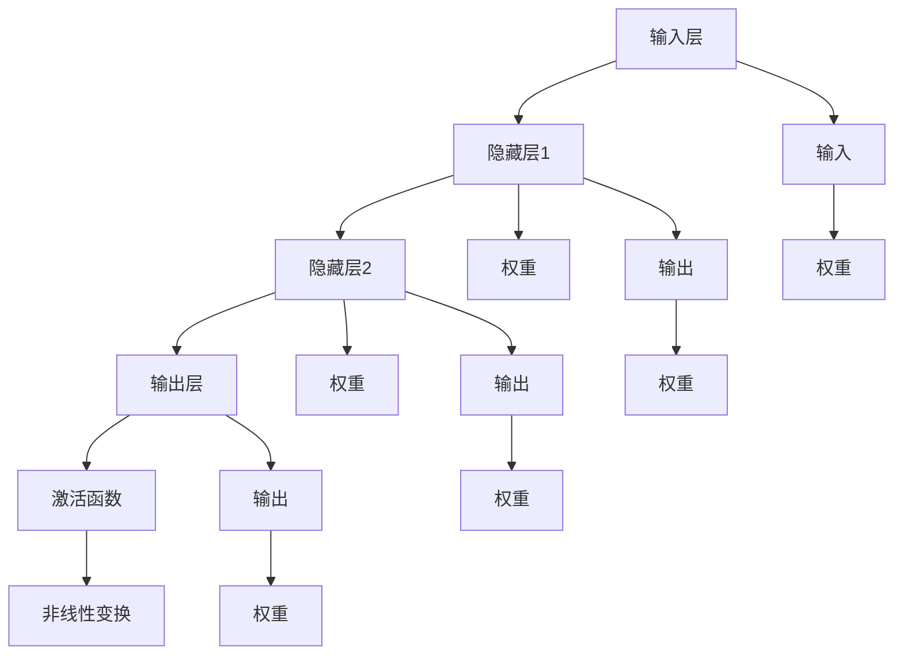

                 

### 神经网络：人类智慧的延伸

> **关键词：** 神经网络、机器学习、人工智能、深度学习、神经计算、智能优化、模式识别
>
> **摘要：** 本文将深入探讨神经网络的发展历程、核心概念、算法原理及其在人工智能领域的广泛应用。通过一步步的分析和推理，我们将揭示神经网络如何成为人类智慧的延伸，并探讨其未来的发展趋势与挑战。

神经网络作为人工智能的核心技术之一，起源于20世纪40年代。在经历了数十年的发展后，神经网络逐渐从理论走向实践，并成为了当今最具影响力的机器学习技术之一。神经网络的基本思想是模拟人脑的计算方式，通过大量神经元之间的相互连接和协同工作，实现复杂模式的识别和预测。

本文将从以下几个部分展开讨论：

1. **背景介绍**：介绍神经网络的发展历程、目的和范围，以及预期读者和文档结构概述。
2. **核心概念与联系**：通过Mermaid流程图，展示神经网络的基本架构和关键概念。
3. **核心算法原理 & 具体操作步骤**：详细讲解神经网络的核心算法原理，并提供伪代码示例。
4. **数学模型和公式 & 详细讲解 & 举例说明**：介绍神经网络的数学模型，并提供具体公式和示例。
5. **项目实战：代码实际案例和详细解释说明**：通过一个实际案例，展示神经网络的应用和实现。
6. **实际应用场景**：探讨神经网络在不同领域的应用。
7. **工具和资源推荐**：推荐学习资源、开发工具框架和相关论文著作。
8. **总结：未来发展趋势与挑战**：总结神经网络的发展趋势和面临的挑战。
9. **附录：常见问题与解答**：回答读者可能关心的问题。
10. **扩展阅读 & 参考资料**：提供进一步阅读的资源。

让我们一步步深入探讨神经网络的世界，揭示其如何成为人类智慧的延伸。

---

### 1. 背景介绍

#### 1.1 目的和范围

本文旨在为读者提供一个全面而深入的神经网络技术指南，从基础概念到实际应用，帮助读者理解和掌握神经网络的核心原理和技术。本文不仅适合初学者，也为专业人士提供了深入研究和探讨的视角。

本文的范围涵盖了神经网络的基本原理、核心算法、数学模型、实际应用以及未来发展趋势。具体包括：

- 神经网络的发展历程和核心概念。
- 神经网络的架构和关键组成部分。
- 神经网络的核心算法原理和具体操作步骤。
- 神经网络的数学模型和公式。
- 神经网络的实际应用案例和代码实现。
- 神经网络在不同领域的应用场景。
- 神经网络工具和资源的推荐。
- 神经网络未来发展趋势和挑战。

#### 1.2 预期读者

本文的预期读者包括以下几类：

1. **初学者**：对神经网络感兴趣，希望了解神经网络的基本概念和原理的读者。
2. **专业人士**：在人工智能、机器学习领域工作的专业人士，希望深入了解神经网络的读者。
3. **研究人员**：对神经网络有深入研究需求，希望了解最新研究成果和未来发展趋势的读者。

无论您属于哪一类读者，本文都将为您提供有价值的内容和深入的分析。

#### 1.3 文档结构概述

本文的文档结构如下：

1. **背景介绍**：介绍神经网络的发展历程、目的和范围，以及预期读者和文档结构概述。
2. **核心概念与联系**：通过Mermaid流程图，展示神经网络的基本架构和关键概念。
3. **核心算法原理 & 具体操作步骤**：详细讲解神经网络的核心算法原理，并提供伪代码示例。
4. **数学模型和公式 & 详细讲解 & 举例说明**：介绍神经网络的数学模型，并提供具体公式和示例。
5. **项目实战：代码实际案例和详细解释说明**：通过一个实际案例，展示神经网络的应用和实现。
6. **实际应用场景**：探讨神经网络在不同领域的应用。
7. **工具和资源推荐**：推荐学习资源、开发工具框架和相关论文著作。
8. **总结：未来发展趋势与挑战**：总结神经网络的发展趋势和面临的挑战。
9. **附录：常见问题与解答**：回答读者可能关心的问题。
10. **扩展阅读 & 参考资料**：提供进一步阅读的资源。

通过本文，您将全面了解神经网络的基本原理、核心算法、数学模型和应用，为您的学习和研究提供有力支持。

#### 1.4 术语表

在本文中，我们将使用一些专业术语，以下是对这些术语的定义和解释：

##### 1.4.1 核心术语定义

- **神经网络（Neural Network）**：一种模拟人脑神经元连接和计算方式的计算模型，用于处理和识别复杂数据。
- **神经元（Neuron）**：神经网络的基本计算单元，通过输入信号加权求和处理，产生输出。
- **权重（Weight）**：神经元之间的连接强度，用于调整输入信号的权重，影响输出结果。
- **激活函数（Activation Function）**：用于对神经元的输出进行非线性变换，增加模型的复杂度和表达能力。
- **损失函数（Loss Function）**：用于衡量模型预测结果与真实结果之间的差异，指导模型优化。
- **反向传播（Backpropagation）**：一种用于训练神经网络的算法，通过计算误差梯度，更新权重，优化模型参数。

##### 1.4.2 相关概念解释

- **深度学习（Deep Learning）**：一种基于多层神经网络的机器学习方法，能够自动提取层次化的特征表示，实现高效的模式识别和预测。
- **卷积神经网络（CNN）**：一种专门用于处理图像数据的神经网络，通过卷积操作提取图像特征，实现图像分类、目标检测等任务。
- **循环神经网络（RNN）**：一种能够处理序列数据的神经网络，通过记忆机制处理前后依赖关系，实现自然语言处理、时间序列预测等任务。
- **生成对抗网络（GAN）**：一种基于两个神经网络（生成器和判别器）的对抗训练模型，用于生成逼真的图像、音频和文本。

##### 1.4.3 缩略词列表

- **CNN**：卷积神经网络（Convolutional Neural Network）
- **RNN**：循环神经网络（Recurrent Neural Network）
- **GAN**：生成对抗网络（Generative Adversarial Network）
- **MLP**：多层感知机（Multilayer Perceptron）

通过理解这些核心术语和概念，您将为本文的进一步学习打下坚实基础。

---

### 2. 核心概念与联系

在深入了解神经网络之前，我们需要了解其核心概念和组成部分。以下是通过Mermaid流程图展示的神经网络的基本架构和关键概念：



该流程图展示了神经网络的基本结构，包括输入层、隐藏层和输出层，以及神经元之间的连接、权重和激活函数。以下是各个部分的具体解释：

- **输入层（Input Layer）**：接收外部输入数据，如图像、文本、声音等，并将其传递到隐藏层。
- **隐藏层（Hidden Layer）**：对输入数据进行处理和特征提取，实现从输入到输出的映射。神经网络可以包含一个或多个隐藏层。
- **输出层（Output Layer）**：生成预测结果或决策，如分类标签、概率分布等。
- **神经元（Neuron）**：神经网络的基本计算单元，接收输入信号，通过加权求和处理和激活函数变换，产生输出。
- **权重（Weight）**：神经元之间的连接强度，用于调整输入信号的权重，影响输出结果。权重是通过学习过程优化的。
- **激活函数（Activation Function）**：对神经元的输出进行非线性变换，增加模型的复杂度和表达能力。常见的激活函数有Sigmoid、ReLU和Tanh等。

通过该流程图，我们可以直观地了解神经网络的基本结构和关键概念，为进一步探讨神经网络的核心算法原理和实际应用打下基础。

---

### 3. 核心算法原理 & 具体操作步骤

在了解了神经网络的基本架构和关键概念后，我们将深入探讨其核心算法原理和具体操作步骤。神经网络的训练过程主要包括以下几个步骤：

1. **前向传播（Forward Propagation）**：将输入数据传递到神经网络中，通过逐层计算，得到输出结果。
2. **损失计算（Loss Calculation）**：计算输出结果与真实结果之间的差异，即损失（Loss），用于评估模型的性能。
3. **反向传播（Backpropagation）**：根据损失梯度，反向传播误差，更新神经网络的权重。
4. **优化更新（Optimization Update）**：使用优化算法（如梯度下降），更新权重，优化模型参数。
5. **重复迭代（Iteration）**：重复前向传播、损失计算和反向传播等步骤，逐步优化模型。

以下是神经网络训练过程的伪代码示例：

```python
# 定义神经网络结构
layers = [InputLayer(), HiddenLayer(), HiddenLayer(), OutputLayer()]

# 初始化权重和偏置
for layer in layers:
    layer.initialize_weights()

# 前向传播
def forward_propagation(input_data):
    output = input_data
    for layer in layers:
        output = layer.forward(output)
    return output

# 损失计算
def calculate_loss(output, target):
    return loss_function(output, target)

# 反向传播
def backward_propagation(output, target):
    d_output = loss_function.derivative(output, target)
    for layer in reversed(layers):
        d_output = layer.backward(d_output)

# 优化更新
def update_weights(learning_rate):
    for layer in layers:
        layer.update_weights(learning_rate)

# 训练神经网络
for epoch in range(num_epochs):
    for input_data, target in dataset:
        output = forward_propagation(input_data)
        loss = calculate_loss(output, target)
        backward_propagation(output, target)
        update_weights(learning_rate)

# 输出最终模型
output = forward_propagation(test_data)
```

在这个伪代码中，我们定义了神经网络的结构，包括输入层、隐藏层和输出层。初始化权重和偏置后，通过前向传播计算输出结果，计算损失并使用反向传播更新权重。最后，通过优化更新逐步优化模型参数。

通过这个简单的伪代码示例，我们可以直观地理解神经网络训练的核心算法原理和具体操作步骤。接下来，我们将进一步探讨神经网络的数学模型和公式。

---

### 4. 数学模型和公式 & 详细讲解 & 举例说明

神经网络的数学模型是理解和实现神经网络算法的基础。在这个部分，我们将详细讲解神经网络的数学模型，包括神经元激活函数、权重更新和损失函数等，并通过具体公式和示例来说明这些概念。

#### 4.1 神经元激活函数

神经元的激活函数是神经网络中实现非线性变换的重要部分。常见的激活函数包括Sigmoid、ReLU和Tanh等。

- **Sigmoid函数**：Sigmoid函数是一种常用的非线性激活函数，其公式为：
  $$ f(x) = \frac{1}{1 + e^{-x}} $$
  Sigmoid函数的输出范围在0到1之间，能够将输入映射到概率分布。

- **ReLU函数**：ReLU（Rectified Linear Unit）函数是一种简单的非线性激活函数，其公式为：
  $$ f(x) = \max(0, x) $$
  ReLU函数在输入为负值时输出为0，在输入为正值时输出为输入值本身，具有简单且易于优化的特性。

- **Tanh函数**：Tanh函数是一种双曲正切函数，其公式为：
  $$ f(x) = \frac{e^x - e^{-x}}{e^x + e^{-x}} $$
  Tanh函数的输出范围在-1到1之间，具有较好的平滑性。

#### 4.2 权重更新

在神经网络中，权重是通过学习过程进行优化的。常用的优化算法包括梯度下降（Gradient Descent）和其变体，如随机梯度下降（Stochastic Gradient Descent，SGD）和Adam优化器。

- **梯度下降算法**：梯度下降是一种基于损失函数梯度的优化算法，其公式为：
  $$ \Delta w = -\alpha \cdot \frac{\partial L}{\partial w} $$
  其中，$\Delta w$表示权重的更新量，$\alpha$为学习率，$\frac{\partial L}{\partial w}$为损失函数关于权重的梯度。

- **随机梯度下降（SGD）**：随机梯度下降是在每个样本上计算梯度并更新权重，其公式为：
  $$ \Delta w = -\alpha \cdot \frac{\partial L}{\partial w} $$
  其中，$L$为损失函数，$w$为权重。

- **Adam优化器**：Adam优化器是一种基于自适应学习率的优化算法，其公式为：
  $$ \beta_1 = 0.9, \beta_2 = 0.999 $$
  $$ m_t = \beta_1 \cdot m_{t-1} + (1 - \beta_1) \cdot \frac{\partial L}{\partial w} $$
  $$ v_t = \beta_2 \cdot v_{t-1} + (1 - \beta_2) \cdot (\frac{\partial L}{\partial w})^2 $$
  $$ \hat{m}_t = \frac{m_t}{1 - \beta_1^t} $$
  $$ \hat{v}_t = \frac{v_t}{1 - \beta_2^t} $$
  $$ \Delta w = -\alpha \cdot \frac{\hat{m}_t}{\sqrt{\hat{v}_t} + \epsilon} $$
  其中，$\beta_1$和$\beta_2$分别为一阶和二阶矩估计的指数衰减率，$m_t$和$v_t$分别为一阶和二阶矩估计，$\hat{m}_t$和$\hat{v}_t$分别为修正的一阶和二阶矩估计，$\epsilon$为小值用于避免除以零。

#### 4.3 损失函数

损失函数用于衡量模型预测结果与真实结果之间的差异。常见的损失函数包括均方误差（Mean Squared Error，MSE）和交叉熵损失（Cross-Entropy Loss）等。

- **均方误差（MSE）**：均方误差是预测值与真实值之间差的平方的平均值，其公式为：
  $$ L = \frac{1}{n} \sum_{i=1}^{n} (y_i - \hat{y}_i)^2 $$
  其中，$y_i$为真实值，$\hat{y}_i$为预测值，$n$为样本数量。

- **交叉熵损失（Cross-Entropy Loss）**：交叉熵损失用于分类问题，其公式为：
  $$ L = -\sum_{i=1}^{n} y_i \log(\hat{y}_i) $$
  其中，$y_i$为真实标签，$\hat{y}_i$为预测概率。

#### 4.4 具体示例

假设我们有一个简单的神经网络，包括一个输入层、一个隐藏层和一个输出层。输入层有3个神经元，隐藏层有4个神经元，输出层有2个神经元。使用ReLU函数作为激活函数，损失函数为均方误差（MSE）。下面是具体的实现示例：

```python
import numpy as np

# 初始化权重和偏置
weights_input_hidden = np.random.randn(3, 4)
weights_hidden_output = np.random.randn(4, 2)

# 前向传播
def forward_propagation(x):
    hidden_layer = np.dot(x, weights_input_hidden)
    hidden_layer = np.maximum(0, hidden_layer)  # ReLU激活函数
    output_layer = np.dot(hidden_layer, weights_hidden_output)
    return output_layer

# 损失计算
def calculate_loss(y_true, y_pred):
    return np.mean((y_true - y_pred) ** 2)

# 反向传播
def backward_propagation(x, y_true, y_pred):
    d_output = 2 * (y_true - y_pred)
    hidden_layer = x
    d_hidden = d_output.dot(weights_hidden_output.T)
    d_hidden[hidden_layer <= 0] = 0  # ReLU激活函数的梯度

# 优化更新
def update_weights(learning_rate):
    weights_input_hidden -= learning_rate * d_output.dot(hidden_layer.T)
    weights_hidden_output -= learning_rate * d_output.dot(hidden_layer.T)

# 训练神经网络
for epoch in range(num_epochs):
    for x, y_true in dataset:
        y_pred = forward_propagation(x)
        loss = calculate_loss(y_true, y_pred)
        backward_propagation(x, y_true, y_pred)
        update_weights(learning_rate)

# 输出最终模型
output = forward_propagation(test_data)
```

在这个示例中，我们初始化了输入层、隐藏层和输出层的权重，并使用ReLU函数作为激活函数。通过前向传播计算输出结果，计算损失并使用反向传播更新权重。最后，我们使用训练好的模型进行测试数据的预测。

通过这个具体的示例，我们可以直观地理解神经网络的数学模型和公式，为进一步应用神经网络提供实践基础。

---

### 5. 项目实战：代码实际案例和详细解释说明

为了更好地理解神经网络的应用和实现，我们将通过一个实际案例展示神经网络在图像分类任务中的应用。在这个案例中，我们将使用TensorFlow和Keras库实现一个简单的卷积神经网络（CNN）模型，用于对MNIST手写数字数据进行分类。

#### 5.1 开发环境搭建

在开始项目之前，我们需要搭建开发环境。以下是搭建开发环境的步骤：

1. **安装Python**：确保已安装Python 3.x版本，可以从[Python官网](https://www.python.org/)下载并安装。
2. **安装TensorFlow**：在终端或命令行中运行以下命令安装TensorFlow：
   ```bash
   pip install tensorflow
   ```
3. **安装Keras**：TensorFlow附带Keras库，因此在安装TensorFlow时已经包含了Keras。您可以通过以下命令验证Keras的安装：
   ```python
   import keras
   print(keras.__version__)
   ```
4. **导入相关库**：在Python代码中，我们需要导入TensorFlow和Keras库，以及其他相关库：
   ```python
   import tensorflow as tf
   from tensorflow.keras import layers
   from tensorflow.keras.datasets import mnist
   import numpy as np
   ```

#### 5.2 源代码详细实现和代码解读

以下是实现神经网络模型的代码，并对代码进行详细解读：

```python
# 导入相关库
import tensorflow as tf
from tensorflow.keras import layers
from tensorflow.keras.datasets import mnist
import numpy as np

# 加载MNIST数据集
(x_train, y_train), (x_test, y_test) = mnist.load_data()

# 数据预处理
x_train = x_train.astype('float32') / 255.0
x_test = x_test.astype('float32') / 255.0
x_train = np.reshape(x_train, (-1, 28, 28, 1))
x_test = np.reshape(x_test, (-1, 28, 28, 1))

# 标签转换为one-hot编码
y_train = tf.keras.utils.to_categorical(y_train, 10)
y_test = tf.keras.utils.to_categorical(y_test, 10)

# 构建卷积神经网络模型
model = tf.keras.Sequential([
    layers.Conv2D(32, (3, 3), activation='relu', input_shape=(28, 28, 1)),
    layers.MaxPooling2D((2, 2)),
    layers.Conv2D(64, (3, 3), activation='relu'),
    layers.MaxPooling2D((2, 2)),
    layers.Conv2D(64, (3, 3), activation='relu'),
    layers.Flatten(),
    layers.Dense(64, activation='relu'),
    layers.Dense(10, activation='softmax')
])

# 编译模型
model.compile(optimizer='adam',
              loss='categorical_crossentropy',
              metrics=['accuracy'])

# 训练模型
model.fit(x_train, y_train, batch_size=128, epochs=10, validation_split=0.2)

# 评估模型
test_loss, test_acc = model.evaluate(x_test, y_test)
print('Test accuracy:', test_acc)
```

以下是代码的详细解读：

1. **导入相关库**：
   我们首先导入了TensorFlow、Keras和其他相关库，包括numpy库用于数据预处理。

2. **加载MNIST数据集**：
   使用Keras的`mnist.load_data()`方法加载MNIST手写数字数据集。该数据集包括训练集和测试集，每个集包含60000个和10000个手写数字图像，以及相应的标签。

3. **数据预处理**：
   我们将图像数据转换为浮点数，并将像素值归一化到0到1之间。然后，我们将图像数据reshape为适合卷积层输入的形状，即(28, 28, 1)。标签数据使用one-hot编码转换为10个类别的概率分布。

4. **构建卷积神经网络模型**：
   使用Keras的`Sequential`模型，我们依次添加了卷积层、池化层、全连接层和softmax层，构建了一个简单的卷积神经网络模型。其中，第一个卷积层使用了32个3x3的卷积核，激活函数为ReLU。接着，我们使用了两个MaxPooling层进行下采样。随后，我们添加了一个卷积层，然后是全连接层和softmax层，用于分类。

5. **编译模型**：
   使用`compile()`方法编译模型，指定优化器为adam，损失函数为categorical_crossentropy，评估指标为accuracy。

6. **训练模型**：
   使用`fit()`方法训练模型，指定训练数据、标签、批量大小、训练轮数和验证比例。

7. **评估模型**：
   使用`evaluate()`方法评估模型在测试集上的性能，并打印测试准确率。

通过这个实际案例，我们展示了如何使用TensorFlow和Keras构建和训练一个简单的卷积神经网络模型，实现了对MNIST手写数字数据的分类。接下来，我们将对代码进行解读和分析。

#### 5.3 代码解读与分析

以下是对代码的进一步解读和分析，重点关注模型构建、训练和评估的关键步骤：

1. **模型构建**：
   在模型构建过程中，我们使用了Keras的`Sequential`模型，这是一种线性堆叠层的方法。这种方法使得模型构建更加直观和简洁。我们依次添加了卷积层（`Conv2D`）、池化层（`MaxPooling2D`）、全连接层（`Dense`）和softmax层（`softmax`），形成了卷积神经网络的基本结构。

   - **卷积层（`Conv2D`）**：卷积层是CNN的核心部分，用于提取图像特征。在这个案例中，我们使用了两个卷积层，第一个卷积层使用了32个3x3的卷积核，激活函数为ReLU。ReLU函数引入了非线性变换，使得模型能够更好地拟合复杂的数据。第二个卷积层使用了64个3x3的卷积核，进一步增强了模型的特征提取能力。

   - **池化层（`MaxPooling2D`）**：池化层用于降低数据维度和减少模型参数数量。在这个案例中，我们使用了两个MaxPooling层，每个层使用了2x2的窗口大小。MaxPooling通过取窗口内最大值的方式实现了数据降维，同时保留重要的特征信息。

   - **全连接层（`Dense`）**：全连接层用于将卷积层提取的特征映射到具体的类别。在这个案例中，我们使用了两个全连接层，第一个层有64个神经元，第二个层有10个神经元。最后一个全连接层使用了softmax激活函数，实现了多分类任务。

2. **模型训练**：
   在模型训练过程中，我们使用了`fit()`方法，这是一种监督学习算法，用于训练神经网络模型。`fit()`方法接受训练数据、标签、批量大小、训练轮数和验证比例作为输入。在这个案例中，我们指定了批量大小为128，训练轮数为10，验证比例为0.2。通过这些参数，我们控制了训练过程的收敛速度和模型性能。

   - **批量大小**：批量大小决定了每次训练过程中参与梯度计算的样本数量。较小的批量大小可以加快模型收敛，但可能引入更多的噪声。较大的批量大小可以提供更稳定的梯度估计，但训练速度较慢。

   - **训练轮数**：训练轮数决定了模型在训练集上迭代的次数。每轮迭代都会更新模型的参数，以最小化损失函数。通常，较大的训练轮数可以更好地优化模型参数，但也可能导致过拟合。

   - **验证比例**：验证比例用于从训练集中划分一部分数据作为验证集，用于评估模型在未见数据上的性能。在这个案例中，我们将20%的训练数据作为验证集，用于监控模型性能和调整超参数。

3. **模型评估**：
   在模型评估过程中，我们使用了`evaluate()`方法，这是一种评估模型性能的方法。`evaluate()`方法接受测试数据和标签作为输入，返回模型在测试集上的损失和准确率。在这个案例中，我们打印了测试集上的准确率，用于评估模型性能。

   - **测试集**：测试集用于评估模型在未见数据上的性能，是评估模型泛化能力的重要指标。在这个案例中，我们使用了10000个测试样本来评估模型的性能。

通过这个案例，我们详细解读了神经网络模型构建、训练和评估的过程。这个案例展示了如何使用Keras构建简单的卷积神经网络模型，并实现手写数字分类任务。接下来，我们将进一步探讨神经网络的实际应用场景。

---

### 6. 实际应用场景

神经网络作为一种强大的机器学习技术，在多个领域取得了显著的应用成果。以下是一些主要的应用场景：

#### 6.1 计算机视觉

计算机视觉是神经网络最具代表性的应用领域之一。通过卷积神经网络（CNN），神经网络可以在图像分类、目标检测和图像分割等领域实现高效的任务。例如，CNN被广泛应用于人脸识别、自动驾驶和医疗图像分析等场景。在人脸识别中，神经网络通过学习人脸图像的特征，实现了高准确度的人脸识别；在自动驾驶中，神经网络用于处理摄像头捕捉的图像，实现车道线检测、障碍物识别和行人检测等功能；在医疗图像分析中，神经网络可以帮助医生识别和诊断病变区域。

#### 6.2 自然语言处理

自然语言处理（NLP）是神经网络另一个重要的应用领域。循环神经网络（RNN）和其变体，如长短期记忆网络（LSTM）和门控循环单元（GRU），被广泛应用于文本分类、机器翻译和情感分析等任务。在文本分类中，神经网络可以通过学习文本特征，实现新闻分类、情感分类等任务；在机器翻译中，神经网络可以自动生成目标语言的翻译文本，大大提高了翻译质量；在情感分析中，神经网络可以分析文本中的情感倾向，应用于情感监控和客户反馈分析等领域。

#### 6.3 语音识别

语音识别是神经网络在语音处理领域的应用，通过训练神经网络模型，可以实现高准确度的语音到文本转换。深度神经网络（DNN）和循环神经网络（RNN）在语音识别任务中发挥了重要作用。例如，神经网络被广泛应用于智能助手、语音搜索和语音助手等场景。在这些应用中，神经网络通过学习语音信号的特征，实现了实时语音识别和语音合成。

#### 6.4 推荐系统

推荐系统是神经网络在电子商务和社交媒体等领域的应用，通过训练神经网络模型，可以实现用户行为分析和推荐算法。神经网络可以通过学习用户的历史行为和偏好，预测用户的兴趣和行为，从而实现个性化推荐。例如，在电子商务平台上，神经网络可以推荐用户可能感兴趣的商品；在社交媒体上，神经网络可以推荐用户可能感兴趣的内容。

#### 6.5 金融风控

金融风控是神经网络在金融领域的应用，通过训练神经网络模型，可以实现信贷风险评估、欺诈检测和投资预测等任务。神经网络可以通过学习大量的历史数据，识别潜在的信贷风险和欺诈行为，帮助金融机构进行风险管理和决策。例如，在信贷风险评估中，神经网络可以通过分析借款人的历史数据和信用记录，预测其违约风险；在欺诈检测中，神经网络可以通过分析交易数据，识别异常交易行为，防范金融欺诈。

#### 6.6 健康医疗

健康医疗是神经网络在医疗领域的应用，通过训练神经网络模型，可以实现疾病诊断、药物发现和健康监测等任务。神经网络可以通过学习医疗数据和患者信息，实现疾病的早期诊断和个性化治疗。例如，在疾病诊断中，神经网络可以通过分析医学影像和患者数据，实现疾病的准确诊断；在药物发现中，神经网络可以通过分析药物分子结构，预测药物的作用效果和副作用；在健康监测中，神经网络可以通过分析生物信号，实现对健康状态的实时监测和预警。

通过这些实际应用场景，我们可以看到神经网络在多个领域的重要作用，推动了人工智能技术的发展和应用的进步。

---

### 7. 工具和资源推荐

为了更好地学习和应用神经网络技术，以下推荐一些优秀的工具、资源和论文，以帮助您深入探索神经网络的世界。

#### 7.1 学习资源推荐

1. **书籍推荐**：

   - 《深度学习》（Deep Learning） - 由Ian Goodfellow、Yoshua Bengio和Aaron Courville合著，这是深度学习领域的经典教材，涵盖了神经网络的原理和应用。
   - 《神经网络与深度学习》 - 李航著，本书详细介绍了神经网络的发展历程、核心算法和数学模型，适合初学者和专业人士。

2. **在线课程**：

   - [吴恩达的深度学习课程](https://www.coursera.org/learn/deep-learning) - 顶级机器学习专家吴恩达开设的深度学习课程，涵盖了神经网络的原理、实现和应用。
   - [斯坦福大学的CS231n课程](https://cs231n.github.io/) - 专注于计算机视觉领域的神经网络课程，深入讲解了卷积神经网络（CNN）的理论和实践。

3. **技术博客和网站**：

   - [Medium上的机器学习和深度学习博客](https://medium.com/topic/machine-learning)
   - [知乎上的机器学习专栏](https://www.zhihu.com专栏/深度学习)

#### 7.2 开发工具框架推荐

1. **IDE和编辑器**：

   - [Visual Studio Code](https://code.visualstudio.com/) - 一款轻量级、可扩展的代码编辑器，适合编写神经网络代码。
   - [PyCharm](https://www.jetbrains.com/pycharm/) - 一款功能强大的Python集成开发环境（IDE），提供丰富的机器学习工具和调试功能。

2. **调试和性能分析工具**：

   - [TensorBoard](https://www.tensorflow.org/tensorboard) - TensorFlow的官方可视化工具，用于监控和调试神经网络训练过程。
   - [NVIDIA Nsight](https://www.nvidia.com/content/nsight/) - NVIDIA推出的调试和性能分析工具，用于优化和调试GPU加速的神经网络代码。

3. **相关框架和库**：

   - [TensorFlow](https://www.tensorflow.org/) - Google开源的机器学习框架，支持深度学习和神经网络的各种应用。
   - [PyTorch](https://pytorch.org/) - Facebook开源的机器学习框架，提供灵活的动态计算图和丰富的神经网络工具。
   - [Keras](https://keras.io/) - 高级神经网络API，提供了简单、可扩展的神经网络构建和训练工具。

#### 7.3 相关论文著作推荐

1. **经典论文**：

   - "Backpropagation" - Paul Werbos，1982年提出的反向传播算法，是神经网络训练的核心算法。
   - "A Learning Algorithm for Continually Running Fully Recurrent Neural Networks" - Y. Bengio，1994年提出的长短期记忆网络（LSTM），解决了RNN的长期依赖问题。

2. **最新研究成果**：

   - "Generative Adversarial Nets" - Ian Goodfellow，2014年提出的生成对抗网络（GAN），用于生成逼真的图像和音频。
   - "Attention is All You Need" - Vaswani等，2017年提出的Transformer模型，颠覆了序列处理领域的传统方法。

3. **应用案例分析**：

   - "Deep Learning for Object Detection" - Rossi等，2017年的论文详细介绍了使用深度学习进行目标检测的方法和应用。
   - "Deep Learning for Natural Language Processing" - Mikolov等，2013年的论文介绍了深度学习在自然语言处理领域的应用，如词向量和语言模型。

通过这些工具和资源的推荐，您将能够更有效地学习和应用神经网络技术，探索人工智能的无限可能。

---

### 8. 总结：未来发展趋势与挑战

神经网络作为人工智能的核心技术，在过去的几十年中取得了显著的进展，并广泛应用于计算机视觉、自然语言处理、语音识别和推荐系统等领域。然而，随着技术的不断演进，神经网络也面临着诸多发展趋势和挑战。

**发展趋势：**

1. **深度学习的发展**：随着计算能力的提升和数据量的增加，深度学习技术在模型复杂度和性能上不断突破。未来的深度学习将更加注重模型的可解释性和泛化能力，实现更高效、更智能的机器学习应用。

2. **泛化能力的提升**：当前神经网络模型的性能依赖于大量的数据和计算资源，如何提升模型的泛化能力，使其在有限数据和资源下仍能保持高性能，是未来研究的重要方向。

3. **多模态学习**：多模态学习是指将不同类型的数据（如文本、图像、音频等）进行融合和协同学习，实现更全面、更精准的信息处理。未来，多模态学习将在人机交互、智能医疗和自动驾驶等领域发挥重要作用。

4. **神经网络的可解释性**：神经网络在复杂任务中的优异表现往往伴随着“黑箱”现象，如何提升神经网络的可解释性，使其决策过程更加透明和可信，是未来研究的热点之一。

**挑战：**

1. **数据隐私和安全**：随着神经网络在各个领域的应用，如何确保数据的隐私和安全，防止数据泄露和滥用，是亟待解决的问题。

2. **计算资源消耗**：神经网络模型训练和推理过程中需要大量的计算资源和存储空间，如何优化模型结构和算法，降低计算资源消耗，是未来研究的关键挑战。

3. **公平性和伦理**：神经网络模型的决策过程可能存在偏见和不公平现象，如何确保模型的公平性和伦理，避免对特定群体产生歧视，是未来研究的重要方向。

4. **可扩展性和效率**：如何构建高效、可扩展的神经网络模型，以满足大规模数据处理和实时应用的需求，是当前和未来研究的重要课题。

总之，神经网络作为人工智能的核心技术，将继续在计算机视觉、自然语言处理、语音识别和推荐系统等领域发挥重要作用。未来，随着技术的不断进步和研究的深入，神经网络将迎来更多的发展机遇和挑战，推动人工智能技术的不断创新和应用。

---

### 9. 附录：常见问题与解答

在阅读本文的过程中，您可能对神经网络的一些概念和技术细节有疑问。以下是一些常见问题及其解答，旨在帮助您更好地理解神经网络的核心内容。

**Q1：神经网络与深度学习有什么区别？**
A1：神经网络（Neural Network）是一种模拟人脑神经元连接和计算方式的计算模型，而深度学习（Deep Learning）是一种基于多层神经网络的机器学习方法。简单来说，深度学习是神经网络的一种特殊形式，通常包含多个隐藏层，能够自动提取层次化的特征表示，实现高效的模式识别和预测。

**Q2：什么是激活函数？它在神经网络中的作用是什么？**
A2：激活函数是神经网络中的一个关键组件，用于对神经元的输出进行非线性变换。激活函数的主要作用是增加模型的复杂度和表达能力，使神经网络能够处理和识别复杂数据。常见的激活函数包括Sigmoid、ReLU和Tanh等。例如，ReLU函数可以加速神经网络的训练，同时保持模型的非线性特性。

**Q3：什么是反向传播算法？它是如何工作的？**
A3：反向传播算法（Backpropagation）是一种用于训练神经网络的算法，通过计算误差梯度，反向传播误差，更新权重，优化模型参数。反向传播算法的工作原理可以分为以下几个步骤：

1. **前向传播**：将输入数据传递到神经网络中，通过逐层计算，得到输出结果。
2. **计算损失**：计算输出结果与真实结果之间的差异，即损失（Loss），用于评估模型的性能。
3. **计算误差梯度**：从输出层开始，逐层计算每个神经元误差的梯度，即损失函数关于每个权重的导数。
4. **反向传播误差**：将误差梯度反向传播到隐藏层和输入层，更新每个神经元的权重。
5. **优化更新**：使用优化算法（如梯度下降），根据误差梯度更新权重，优化模型参数。

**Q4：什么是深度学习中的过拟合问题？如何解决？**
A4：过拟合是指神经网络在训练数据上表现出优异的性能，但在未见数据上表现较差，即模型对训练数据“记忆”过度，无法泛化到新的数据。解决过拟合问题的方法包括：

1. **增加训练数据**：增加训练数据量，使模型有更多的样本来学习。
2. **正则化**：在模型训练过程中引入正则化项，如L1、L2正则化，降低模型复杂度。
3. **数据增强**：通过旋转、缩放、裁剪等方式对训练数据进行增强，增加数据的多样性。
4. **提前停止**：在模型训练过程中，当验证集性能不再提高时，提前停止训练，防止模型过拟合。

**Q5：什么是生成对抗网络（GAN）？它是如何工作的？**
A5：生成对抗网络（Generative Adversarial Network，GAN）是一种基于两个神经网络（生成器和判别器）的对抗训练模型。生成器生成逼真的数据样本，判别器区分生成器和真实数据。GAN的工作原理可以分为以下几个步骤：

1. **生成器（Generator）**：生成器试图生成逼真的数据样本，以欺骗判别器。
2. **判别器（Discriminator）**：判别器用于区分生成器和真实数据，其目标是最大化正确分类的概率。
3. **对抗训练**：生成器和判别器在训练过程中相互对抗，生成器试图生成更逼真的数据，判别器试图准确分类数据。
4. **优化目标**：生成器和判别器的优化目标分别是最大化生成器生成的数据样本的概率和最小化判别器的分类误差。

通过上述问题及解答，我们可以更深入地理解神经网络的核心概念和关键技术，为实际应用和研究打下坚实基础。

---

### 10. 扩展阅读 & 参考资料

为了进一步深入理解神经网络及其在人工智能领域的应用，以下推荐一些扩展阅读和参考资料，涵盖经典论文、最新研究成果和应用案例分析：

1. **经典论文：**
   - "Backpropagation" - Paul Werbos，1982年提出的反向传播算法。
   - "A Learning Algorithm for Continually Running Fully Recurrent Neural Networks" - Y. Bengio，1994年提出的长短期记忆网络（LSTM）。
   - "Deep Learning" - Ian Goodfellow、Yoshua Bengio和Aaron Courville，2016年合著的深度学习领域经典教材。

2. **最新研究成果：**
   - "Generative Adversarial Nets" - Ian Goodfellow，2014年提出的生成对抗网络（GAN）。
   - "Attention is All You Need" - Vaswani等，2017年提出的Transformer模型。
   - "Unsupervised Learning of Visual Representations by Solving Jigsaw Puzzles" - Efthymiou等，2020年提出的通过解决拼图任务学习视觉表示的方法。

3. **应用案例分析：**
   - "Deep Learning for Object Detection" - Rossi等，2017年详细介绍了使用深度学习进行目标检测的方法和应用。
   - "Deep Learning for Natural Language Processing" - Mikolov等，2013年介绍了深度学习在自然语言处理领域的应用，如词向量和语言模型。
   - "Deep Learning in Health Care" - Topol等，2019年探讨了深度学习在医疗健康领域的应用，包括疾病诊断和药物发现。

此外，以下是一些重要的在线资源和社区，供您进一步学习和交流：

- [arXiv](https://arxiv.org/)：提供最新的深度学习和技术论文，是学术研究的宝库。
- [Google Research](https://research.google.com/)：谷歌的研究部门发布了一系列深度学习和人工智能领域的论文和项目。
- [Medium](https://medium.com/topic/deep-learning)和[知乎](https://www.zhihu.com/topics/人工智能)：提供丰富的深度学习和技术博客，适合学习和探讨。
- [Kaggle](https://www.kaggle.com/)：一个在线数据科学社区，提供大量深度学习和数据科学竞赛和项目。

通过这些扩展阅读和参考资料，您可以进一步深入了解神经网络的核心概念、最新研究成果和应用，为您的学习和研究提供有力支持。

