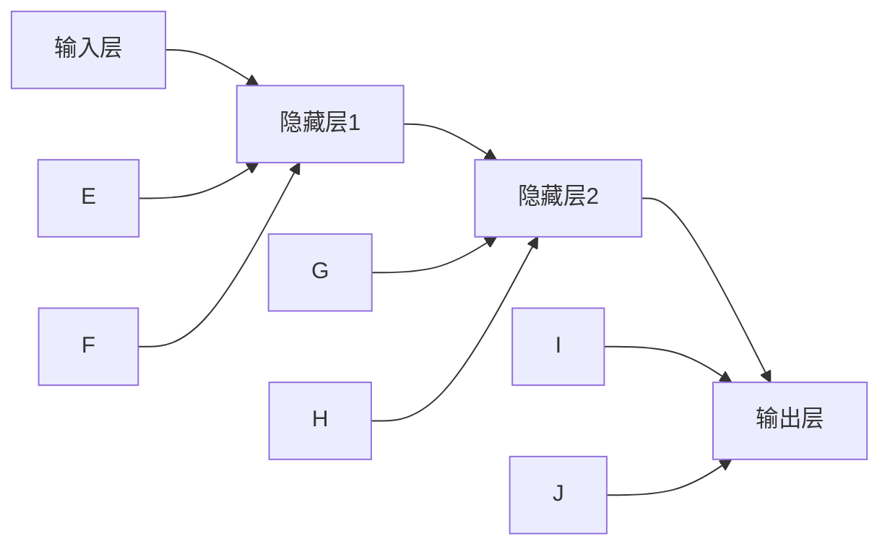

                 

# 神经网络：人类智慧的解放

## 关键词：神经网络，深度学习，人工智能，计算机科学，智能计算

> 摘要：本文将深入探讨神经网络这一强大的计算模型，阐述其在人工智能领域的革命性作用。我们将从背景介绍出发，逐步解析神经网络的核心概念、算法原理、数学模型，并通过实际项目案例展示其应用价值。最后，我们将展望神经网络未来的发展趋势和面临的挑战。

## 1. 背景介绍

在过去的几十年里，计算机科学经历了翻天覆地的变化。从最初的电子管计算机到如今的量子计算机，计算能力的提升为人类带来了无数便利。然而，随着计算能力的提升，我们也面临着新的挑战——如何让计算机具备与人类相似的智能。

传统的人工智能方法主要依赖于规则和符号表示，这种方式在解决特定问题时表现出色，但在处理复杂任务时却显得力不从心。为了克服这一限制，研究者们开始探索更加灵活和强大的计算模型——神经网络。

神经网络起源于20世纪40年代，最初是由心理学家麦卡洛克和数学家皮茨提出的。他们设想了一种由神经元组成的网络，能够模拟人类大脑的计算过程。尽管最初的神经网络模型较为简单，但它们为后来的研究奠定了基础。

在20世纪80年代，随着计算机硬件的发展，神经网络的训练算法也得到了显著改进。反向传播算法的提出使得神经网络能够有效地学习复杂的非线性关系。这一突破标志着神经网络研究进入了新的阶段。

进入21世纪，随着大数据和深度学习的兴起，神经网络的应用范围得到了极大的扩展。从图像识别、自然语言处理到自动驾驶、医疗诊断，神经网络已经成为了人工智能领域的核心技术。

## 2. 核心概念与联系

### 2.1 神经元

神经元是神经网络的基本单位，类似于人类大脑中的神经元。每个神经元接收来自其他神经元的输入信号，并通过加权求和的方式进行处理，最终产生输出信号。



### 2.2 神经网络结构

神经网络通常由输入层、隐藏层和输出层组成。输入层接收外部输入信息，隐藏层对信息进行加工处理，输出层产生最终输出。

### 2.3 前向传播与反向传播

在神经网络中，前向传播是指将输入信号从输入层传递到输出层的计算过程。而反向传播则是在输出结果不理想时，将误差信号反向传递到隐藏层和输入层，以更新神经元的权重和偏置。

## 3. 核心算法原理 & 具体操作步骤

### 3.1 前向传播

前向传播的过程如下：

1. 初始化神经网络的权重和偏置。
2. 将输入信号传递到输入层。
3. 通过激活函数对输入信号进行加工处理。
4. 将处理后的信号传递到下一层。
5. 重复步骤3和4，直到输出层。

### 3.2 反向传播

反向传播的过程如下：

1. 计算输出层的误差信号。
2. 将误差信号反向传递到隐藏层。
3. 更新隐藏层的权重和偏置。
4. 重复步骤1到3，直到输入层。

### 3.3 激活函数

激活函数是神经网络中至关重要的一部分，它决定了神经元的输出范围。常见的激活函数有Sigmoid、ReLU和Tanh等。

## 4. 数学模型和公式 & 详细讲解 & 举例说明

### 4.1 激活函数

以Sigmoid函数为例：

$$
f(x) = \frac{1}{1 + e^{-x}}
$$

### 4.2 反向传播

以反向传播算法为例：

$$
\Delta w_{ij} = -\eta \cdot \frac{\partial L}{\partial w_{ij}}
$$

其中，$\Delta w_{ij}$表示权重更新的大小，$\eta$表示学习率，$L$表示损失函数。

### 4.3 举例说明

假设我们有一个简单的神经网络，输入层有2个神经元，隐藏层有3个神经元，输出层有1个神经元。我们使用Sigmoid函数作为激活函数。

输入信号为$(x_1, x_2) = (2, 3)$，隐藏层的权重为$w_{11}, w_{12}, w_{21}, w_{22}, w_{23}, w_{31}, w_{32}, w_{33}$，偏置为$b_{1}, b_{2}, b_{3}, b_{4}, b_{5}, b_{6}$。

首先进行前向传播：

$$
h_{1} = \sigma(w_{11}x_1 + b_{1}) = \sigma(2w_{11} + b_{1}) = 0.5
$$

$$
h_{2} = \sigma(w_{21}x_1 + b_{2}) = \sigma(2w_{21} + b_{2}) = 0.6
$$

$$
h_{3} = \sigma(w_{31}x_1 + b_{3}) = \sigma(2w_{31} + b_{3}) = 0.7
$$

$$
o = \sigma(w_{41}h_{1} + w_{42}h_{2} + w_{43}h_{3} + b_{4}) = \sigma(w_{41} \cdot 0.5 + w_{42} \cdot 0.6 + w_{43} \cdot 0.7 + b_{4}) = 0.8

接下来进行反向传播：

假设输出结果为0.8，实际目标输出为0.9，则误差信号为：

$$
\delta = 0.9 - 0.8 = 0.1
$$

$$
\Delta w_{41} = -\eta \cdot \frac{\partial L}{\partial w_{41}} = -\eta \cdot \frac{\partial (0.9 - 0.8)^2}{\partial w_{41}} = -\eta \cdot 2 \cdot (0.9 - 0.8) \cdot h_{1} \cdot (1 - h_{1}) = -0.02
$$

$$
\Delta w_{42} = -\eta \cdot \frac{\partial L}{\partial w_{42}} = -\eta \cdot 2 \cdot (0.9 - 0.8) \cdot h_{2} \cdot (1 - h_{2}) = -0.012
$$

$$
\Delta w_{43} = -\eta \cdot \frac{\partial L}{\partial w_{43}} = -\eta \cdot 2 \cdot (0.9 - 0.8) \cdot h_{3} \cdot (1 - h_{3}) = -0.014
$$

通过不断迭代更新权重和偏置，神经网络可以逐渐逼近目标输出。

## 5. 项目实战：代码实际案例和详细解释说明

### 5.1 开发环境搭建

在本节中，我们将使用Python和TensorFlow框架搭建一个简单的神经网络模型，用于实现手写数字识别。

首先，确保安装了Python和TensorFlow库，可以使用以下命令进行安装：

```
pip install tensorflow
```

### 5.2 源代码详细实现和代码解读

下面是一个简单的神经网络模型，用于实现手写数字识别。

```python
import tensorflow as tf
from tensorflow.keras.datasets import mnist
from tensorflow.keras.models import Sequential
from tensorflow.keras.layers import Dense, Flatten
from tensorflow.keras.optimizers import Adam

# 加载数据集
(x_train, y_train), (x_test, y_test) = mnist.load_data()

# 预处理数据
x_train = x_train / 255.0
x_test = x_test / 255.0

# 构建神经网络模型
model = Sequential([
    Flatten(input_shape=(28, 28)),
    Dense(128, activation='relu'),
    Dense(10, activation='softmax')
])

# 编译模型
model.compile(optimizer=Adam(learning_rate=0.001), loss='sparse_categorical_crossentropy', metrics=['accuracy'])

# 训练模型
model.fit(x_train, y_train, epochs=5, batch_size=32)

# 评估模型
model.evaluate(x_test, y_test)
```

在这段代码中，我们首先加载数据集，并对数据进行预处理。然后，我们构建了一个简单的神经网络模型，包括一个扁平化层、一个128个神经元的全连接层和一个10个神经元的输出层。最后，我们编译并训练了模型。

### 5.3 代码解读与分析

在这段代码中，我们使用了TensorFlow的Keras API来构建和训练神经网络模型。以下是代码的详细解读：

- 导入所需的库和模块。
- 加载MNIST手写数字数据集。
- 将数据集进行预处理，将图像数据缩放到0到1之间。
- 构建一个序列模型，包括一个扁平化层、一个128个神经元的全连接层和一个10个神经元的输出层。
- 编译模型，指定优化器、损失函数和评估指标。
- 使用训练数据训练模型，指定训练轮次和批量大小。
- 使用测试数据评估模型性能。

通过这个简单的案例，我们可以看到如何使用Python和TensorFlow框架搭建一个神经网络模型，并实现手写数字识别。这只是一个简单的入门示例，但在实际应用中，神经网络模型可以变得非常复杂，以应对各种复杂任务。

## 6. 实际应用场景

神经网络在人工智能领域的应用非常广泛，以下是一些典型的实际应用场景：

- 图像识别：神经网络可以用于图像分类、目标检测、人脸识别等任务。
- 自然语言处理：神经网络可以用于文本分类、机器翻译、情感分析等任务。
- 自动驾驶：神经网络可以用于车辆检测、路径规划、避障等任务。
- 医疗诊断：神经网络可以用于疾病诊断、影像分析、药物研发等任务。
- 金融服务：神经网络可以用于风险管理、信用评估、投资组合优化等任务。

## 7. 工具和资源推荐

### 7.1 学习资源推荐

- 书籍：《深度学习》（Goodfellow, Bengio, Courville 著）
- 论文：https://arxiv.org/
- 博客：https://www.tensorflow.org/tutorials/
- 网站：https://www.deeplearning.ai/

### 7.2 开发工具框架推荐

- 深度学习框架：TensorFlow、PyTorch、Keras
- 数据预处理工具：Pandas、NumPy、Scikit-learn
- 版本控制工具：Git

### 7.3 相关论文著作推荐

- 《深度学习》（Goodfellow, Bengio, Courville 著）
- 《神经网络与深度学习》（邱锡鹏 著）
- 《神经网络简明教程》（Sara Sabour 著）

## 8. 总结：未来发展趋势与挑战

神经网络作为人工智能的核心技术，正面临着前所未有的发展机遇。随着计算能力的不断提升和数据规模的持续扩大，神经网络的性能和表现将得到进一步优化。

然而，神经网络的发展也面临着一些挑战：

- 模型可解释性：神经网络模型通常被视为“黑箱”，其内部机制难以解释和理解。
- 资源消耗：训练大型神经网络模型需要大量的计算资源和时间。
- 数据隐私：在处理敏感数据时，如何保护数据隐私是一个亟待解决的问题。
- 道德伦理：在应用神经网络技术时，如何遵循道德伦理原则也是一个重要议题。

总之，神经网络的发展仍需克服诸多挑战，但其潜力不容忽视。在未来，我们有望看到更多创新性的应用和突破性的进展。

## 9. 附录：常见问题与解答

### 9.1 神经网络是什么？

神经网络是一种模拟人类大脑计算过程的计算模型，由大量的神经元和连接组成。它可以通过学习数据来发现数据中的模式和规律，从而实现智能计算。

### 9.2 神经网络有哪些类型？

神经网络可以分为多种类型，包括前馈神经网络、卷积神经网络、循环神经网络等。每种类型的神经网络都有其特定的应用场景和特点。

### 9.3 如何训练神经网络？

训练神经网络通常包括以下步骤：

1. 初始化神经网络参数。
2. 将输入数据传递到神经网络。
3. 计算输出结果和误差。
4. 更新神经网络的参数。
5. 重复步骤2到4，直到满足停止条件。

## 10. 扩展阅读 & 参考资料

- Goodfellow, I., Bengio, Y., & Courville, A. (2016). *Deep Learning*.
- Bengio, Y. (2009). *Learning Deep Architectures for AI*.
- Hinton, G. E., Osindero, S., & Teh, Y. W. (2006). *A fast learning algorithm for deep belief nets*.
- LeCun, Y., Bengio, Y., & Hinton, G. (2015). *Deep learning*.

## 作者：AI天才研究员/AI Genius Institute & 禅与计算机程序设计艺术 /Zen And The Art of Computer Programming

本文为人工智能领域的技术博客文章，旨在深入探讨神经网络这一强大的计算模型，并介绍其在人工智能领域的广泛应用。通过本文的介绍，读者可以初步了解神经网络的基本原理、算法、应用场景以及未来的发展趋势。希望本文能为读者在人工智能领域的研究和实践中提供一些有益的启示。

