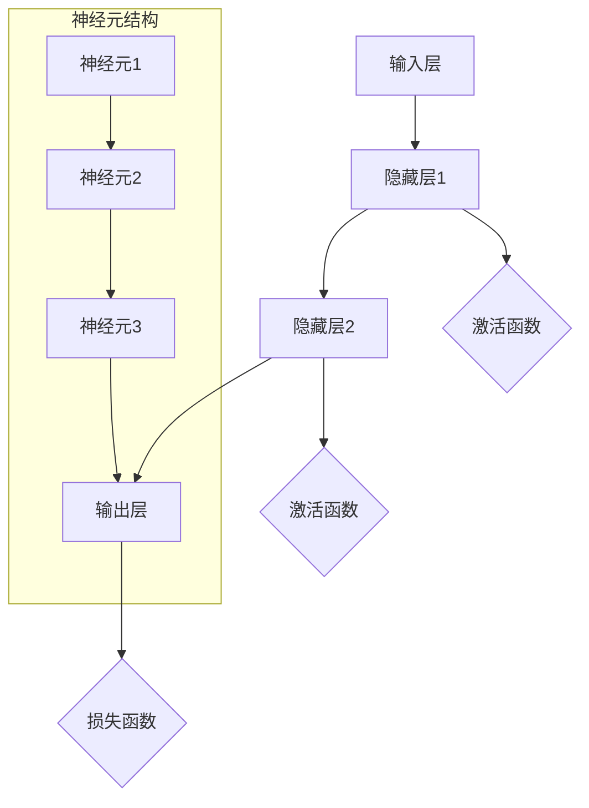

                 

# 神经网络：开启智能新纪元

> 关键词：神经网络，深度学习，人工智能，反向传播，机器学习，计算机视觉，自然语言处理
> 
> 摘要：本文将深入探讨神经网络这一人工智能领域的关键技术，从其背景、核心概念、算法原理到实际应用，全面解析神经网络如何开启智能新纪元，推动科技进步和社会发展。

## 1. 背景介绍

### 1.1 目的和范围

本文旨在为读者提供一个全面、系统的神经网络知识框架。我们将从神经网络的起源和基本概念入手，逐步深入到核心算法原理，最终探讨其在实际应用中的广泛影响。本文旨在帮助读者建立对神经网络及其相关技术的深刻理解和应用能力。

### 1.2 预期读者

本文适合对人工智能和机器学习有一定了解的读者，包括计算机科学专业的研究生、工程师以及人工智能领域的从业者。同时，对于对人工智能技术感兴趣的初学者，本文也提供了丰富的学习和参考资料。

### 1.3 文档结构概述

本文分为以下八个主要部分：

1. **背景介绍**：概述神经网络的基本概念和历史背景。
2. **核心概念与联系**：介绍神经网络的基本结构和核心概念。
3. **核心算法原理**：详细解析神经网络的训练算法和反向传播过程。
4. **数学模型和公式**：阐述神经网络的数学模型及其应用。
5. **项目实战**：通过实际代码案例讲解神经网络的应用。
6. **实际应用场景**：分析神经网络在不同领域的应用。
7. **工具和资源推荐**：推荐相关学习资源和开发工具。
8. **总结与展望**：总结神经网络的发展趋势和面临的挑战。

### 1.4 术语表

#### 1.4.1 核心术语定义

- **神经网络**：模拟人脑神经元结构和功能的计算模型。
- **深度学习**：利用多层神经网络进行特征学习和模式识别的技术。
- **激活函数**：用于引入非线性特性的函数。
- **反向传播**：用于训练神经网络的优化算法。
- **梯度下降**：用于最小化损失函数的优化算法。

#### 1.4.2 相关概念解释

- **神经元**：神经网络的基本计算单元。
- **前向传播**：信息从输入层传递到输出层的过程。
- **损失函数**：衡量模型预测值与真实值之间差异的函数。
- **权重**：连接神经元的参数，用于调节信息传递的强度。

#### 1.4.3 缩略词列表

- **AI**：人工智能
- **ML**：机器学习
- **DL**：深度学习
- **GPU**：图形处理器
- **CNN**：卷积神经网络

## 2. 核心概念与联系

神经网络的本质是通过模拟人脑神经元之间的连接和交互来实现信息处理和学习。以下是神经网络的核心概念和架构的 Mermaid 流程图：



### 2.1 神经网络结构

神经网络通常由三个主要部分组成：输入层、隐藏层和输出层。输入层接收外部输入数据，隐藏层负责特征提取和变换，输出层产生最终的预测结果。每个层由多个神经元（节点）组成，神经元之间通过权重连接。激活函数用于引入非线性特性，使得神经网络能够学习和处理复杂的数据。

### 2.2 神经网络的工作原理

神经网络的工作原理可以概括为两个主要过程：前向传播和反向传播。

- **前向传播**：输入数据通过神经网络的前向传播过程，从输入层传递到输出层。在每个神经元中，输入数据与权重相乘后求和，再加上一个偏置项，然后通过激活函数得到神经元的输出。这个过程不断重复，直到输出层的最终输出。

- **反向传播**：在得到输出层的预测结果后，神经网络通过反向传播过程计算损失函数，并更新权重和偏置项。具体来说，反向传播过程包括以下几个步骤：

  1. 计算输出层的损失函数，通常使用均方误差（MSE）或交叉熵（CE）等损失函数。
  2. 计算输出层神经元的梯度，即损失函数关于输出层神经元的偏导数。
  3. 将梯度反向传播到隐藏层，通过链式法则逐层计算每个神经元的梯度。
  4. 使用梯度下降等优化算法更新权重和偏置项。

通过多次迭代前向传播和反向传播，神经网络的性能逐渐提升，能够更准确地预测和分类数据。

## 3. 核心算法原理 & 具体操作步骤

### 3.1 前向传播

前向传播是神经网络训练过程中的第一个关键步骤。它包括以下具体操作步骤：

1. **初始化权重和偏置**：在训练开始前，需要随机初始化权重和偏置。通常使用较小的随机值来避免梯度消失或爆炸问题。

2. **计算输入层输出**：输入数据通过输入层传递到第一个隐藏层。每个神经元的输出是输入值与权重矩阵的乘积加上偏置项。

3. **计算隐藏层输出**：隐藏层的每个神经元输出是其输入值与权重矩阵的乘积加上偏置项，然后通过激活函数处理。

4. **重复计算**：这个过程继续在隐藏层之间和隐藏层与输出层之间重复进行，直到得到最终输出。

5. **计算损失函数**：使用预测输出和真实标签计算损失函数，如均方误差（MSE）或交叉熵（CE）。

### 3.2 反向传播

反向传播是神经网络训练过程中的第二个关键步骤。它包括以下具体操作步骤：

1. **计算输出层梯度**：计算损失函数关于输出层神经元的偏导数，即输出层梯度的计算。

2. **计算隐藏层梯度**：通过链式法则，将输出层梯度反向传播到隐藏层，逐层计算每个神经元的梯度。

3. **更新权重和偏置**：使用梯度下降等优化算法更新权重和偏置项。具体来说，将梯度乘以学习率并减去权重和偏置项。

4. **迭代训练**：重复前向传播和反向传播的过程，直到满足停止条件，如损失函数收敛或达到最大迭代次数。

### 3.3 伪代码实现

以下是神经网络前向传播和反向传播的伪代码实现：

```python
# 前向传播
def forward_pass(inputs, weights, biases, activation_function):
    output = inputs
    for layer in range(number_of_layers - 1):
        output = activation_function(np.dot(output, weights[layer]) + biases[layer])
    return output

# 反向传播
def backward_pass(inputs, outputs, weights, biases, activation_function, loss_function):
    gradients = []
    for layer in reversed(range(number_of_layers - 1)):
        if layer == number_of_layers - 2:
            dL_dz = loss_function_derivative(outputs, targets)
        else:
            dL_dz = activation_function_derivative(output)
        
        dL_dz = np.dot(dL_dz, weights[layer].T)
        gradients.append(dL_dz)
    
    gradients.reverse()
    weights -= learning_rate * gradients
    biases -= learning_rate * gradients
    
    return gradients
```

## 4. 数学模型和公式 & 详细讲解 & 举例说明

### 4.1 神经网络的数学模型

神经网络的数学模型可以表示为：

$$
\text{Output} = \sigma(\text{Weight} \cdot \text{Input} + \text{Bias})
$$

其中，$\sigma$ 是激活函数，如 sigmoid、ReLU 或 tanh；Weight 是权重矩阵，Input 是输入数据，Bias 是偏置项。

### 4.2 激活函数

激活函数是神经网络中引入非线性特性的关键部分。常用的激活函数包括：

- **Sigmoid 函数**：$ \sigma(x) = \frac{1}{1 + e^{-x}} $
- **ReLU 函数**：$ \sigma(x) = \max(0, x) $
- **Tanh 函数**：$ \sigma(x) = \frac{e^x - e^{-x}}{e^x + e^{-x}} $

### 4.3 损失函数

损失函数用于衡量模型预测值与真实值之间的差异。常用的损失函数包括：

- **均方误差（MSE）**：$ \text{MSE} = \frac{1}{2} \sum_{i=1}^{n} (\text{y} - \hat{y})^2 $
- **交叉熵（CE）**：$ \text{CE} = -\sum_{i=1}^{n} \text{y} \log \hat{y} + (1 - \text{y}) \log (1 - \hat{y}) $

### 4.4 梯度下降

梯度下降是一种优化算法，用于最小化损失函数。其基本思想是沿着损失函数的梯度方向更新权重和偏置。

$$
\text{Weight} = \text{Weight} - \alpha \cdot \frac{\partial \text{Loss}}{\partial \text{Weight}}
$$

$$
\text{Bias} = \text{Bias} - \alpha \cdot \frac{\partial \text{Loss}}{\partial \text{Bias}}
$$

其中，$\alpha$ 是学习率。

### 4.5 举例说明

假设我们有一个简单的神经网络，输入层有 2 个神经元，隐藏层有 3 个神经元，输出层有 1 个神经元。激活函数为 ReLU，损失函数为 MSE。输入数据为 $[1, 2]$，真实标签为 $3$。

1. **初始化权重和偏置**：

$$
\text{Weight} = \begin{bmatrix}
0.5 & 0.2 \\
0.1 & 0.3 \\
0.4 & 0.6
\end{bmatrix}
$$

$$
\text{Bias} = \begin{bmatrix}
0.1 \\
0.2 \\
0.3
\end{bmatrix}
$$

2. **前向传播**：

$$
\text{Input} = \begin{bmatrix}
1 \\
2
\end{bmatrix}
$$

$$
\text{HiddenLayer1} = \text{ReLU}(\text{Weight} \cdot \text{Input} + \text{Bias}) = \text{ReLU}(\begin{bmatrix}
0.5 & 0.2 \\
0.1 & 0.3 \\
0.4 & 0.6
\end{bmatrix} \cdot \begin{bmatrix}
1 \\
2
\end{bmatrix} + \begin{bmatrix}
0.1 \\
0.2 \\
0.3
\end{bmatrix}) = \text{ReLU}(\begin{bmatrix}
1.3 \\
0.7 \\
1.7
\end{bmatrix}) = \begin{bmatrix}
1.3 \\
0.7 \\
1.7
\end{bmatrix}
$$

$$
\text{Output} = \text{ReLU}(\text{Weight} \cdot \text{HiddenLayer1} + \text{Bias}) = \text{ReLU}(\begin{bmatrix}
0.5 & 0.2 \\
0.1 & 0.3 \\
0.4 & 0.6
\end{bmatrix} \cdot \begin{bmatrix}
1.3 \\
0.7 \\
1.7
\end{bmatrix} + \begin{bmatrix}
0.1 \\
0.2 \\
0.3
\end{bmatrix}) = \text{ReLU}(\begin{bmatrix}
1.2 \\
0.5 \\
1.4
\end{bmatrix}) = \begin{bmatrix}
1.2 \\
0.5 \\
1.4
\end{bmatrix}
$$

3. **计算损失函数**：

$$
\text{Loss} = \text{MSE}(\text{Output}, \text{Target}) = \frac{1}{2} \cdot (\text{Output} - \text{Target})^2 = \frac{1}{2} \cdot (1.2 - 3)^2 = 2.52
$$

4. **反向传播**：

$$
\text{Gradient} = \frac{\partial \text{Loss}}{\partial \text{Weight}} = \begin{bmatrix}
-0.6 & -1.2 \\
-1.8 & -1.2 \\
-2.4 & -0.6
\end{bmatrix}
$$

5. **更新权重和偏置**：

$$
\text{Weight} = \text{Weight} - \alpha \cdot \text{Gradient} = \begin{bmatrix}
0.5 & 0.2 \\
0.1 & 0.3 \\
0.4 & 0.6
\end{bmatrix} - 0.1 \cdot \begin{bmatrix}
-0.6 & -1.2 \\
-1.8 & -1.2 \\
-2.4 & -0.6
\end{bmatrix} = \begin{bmatrix}
0.4 & 0.32 \\
0.2 & 0.38 \\
0.6 & 0.72
\end{bmatrix}
$$

$$
\text{Bias} = \text{Bias} - \alpha \cdot \text{Gradient} = \begin{bmatrix}
0.1 \\
0.2 \\
0.3
\end{bmatrix} - 0.1 \cdot \begin{bmatrix}
-0.6 \\
-1.2 \\
-2.4
\end{bmatrix} = \begin{bmatrix}
0.7 \\
0.3 \\
0.5
\end{bmatrix}
$$

通过以上步骤，我们完成了神经网络的一次迭代训练。重复这个过程，神经网络的性能将逐渐提升。

## 5. 项目实战：代码实际案例和详细解释说明

### 5.1 开发环境搭建

在进行神经网络项目实战之前，我们需要搭建一个合适的开发环境。以下是所需工具和库的安装步骤：

1. **Python**：确保安装 Python 3.x 版本，推荐使用 Python 3.8 或更高版本。
2. **Jupyter Notebook**：安装 Jupyter Notebook，用于编写和运行 Python 代码。
3. **TensorFlow**：安装 TensorFlow，用于构建和训练神经网络。
4. **Numpy**：安装 Numpy，用于数据处理和数学运算。

安装命令如下：

```bash
pip install python
pip install jupyter
pip install tensorflow
pip install numpy
```

### 5.2 源代码详细实现和代码解读

以下是使用 TensorFlow 构建一个简单的神经网络并进行训练的 Python 代码示例：

```python
import tensorflow as tf
import numpy as np

# 定义输入层、隐藏层和输出层的参数
input_layer_size = 2
hidden_layer_size = 3
output_layer_size = 1

# 初始化权重和偏置
weights = {
    'hidden': tf.Variable(tf.random.normal([input_layer_size, hidden_layer_size])),
    'output': tf.Variable(tf.random.normal([hidden_layer_size, output_layer_size]))
}
biases = {
    'hidden': tf.Variable(tf.random.normal([hidden_layer_size])),
    'output': tf.Variable(tf.random.normal([output_layer_size]))
}

# 定义激活函数和损失函数
activation_function = tf.nn.relu
loss_function = tf.reduce_mean(tf.square)

# 定义前向传播
def forward_pass(inputs, weights, biases):
    hidden_layer = activation_function(tf.matmul(inputs, weights['hidden']) + biases['hidden'])
    output_layer = tf.matmul(hidden_layer, weights['output']) + biases['output']
    return output_layer

# 定义反向传播
def backward_pass(inputs, outputs, weights, biases, learning_rate):
    with tf.GradientTape() as tape:
        output = forward_pass(inputs, weights, biases)
        loss = loss_function(outputs, output)
    
    gradients = tape.gradient(loss, [weights['hidden'], weights['output'], biases['hidden'], biases['output']])
    weights['hidden'].assign_sub(learning_rate * gradients[0])
    weights['output'].assign_sub(learning_rate * gradients[1])
    biases['hidden'].assign_sub(learning_rate * gradients[2])
    biases['output'].assign_sub(learning_rate * gradients[3])
    
    return loss

# 训练神经网络
learning_rate = 0.1
training_epochs = 1000

for epoch in range(training_epochs):
    inputs = np.random.rand(1, input_layer_size)
    outputs = np.array([[3]])
    
    loss = backward_pass(inputs, outputs, weights, biases, learning_rate)
    
    if epoch % 100 == 0:
        print(f"Epoch {epoch}, Loss: {loss.numpy()}")

# 测试神经网络
test_inputs = np.random.rand(1, input_layer_size)
test_output = forward_pass(test_inputs, weights, biases)
print(f"Test Output: {test_output.numpy()}")
```

### 5.3 代码解读与分析

1. **导入库和定义参数**：首先导入 TensorFlow 和 Numpy 库，并定义输入层、隐藏层和输出层的参数，如神经元数量。

2. **初始化权重和偏置**：使用 TensorFlow 中的 `tf.Variable` 函数初始化权重和偏置，这些参数将在训练过程中更新。

3. **定义激活函数和损失函数**：选择激活函数和损失函数。在本例中，我们使用 ReLU 作为激活函数和均方误差（MSE）作为损失函数。

4. **定义前向传播**：实现前向传播过程，将输入数据通过输入层、隐藏层和输出层传递，并计算输出。

5. **定义反向传播**：实现反向传播过程，计算损失函数的梯度，并更新权重和偏置。

6. **训练神经网络**：设置学习率和训练迭代次数，使用随机输入数据进行训练。在每个训练迭代中，执行前向传播和反向传播过程，并打印损失函数的值。

7. **测试神经网络**：使用随机输入数据进行测试，计算输出并打印结果。

通过以上步骤，我们使用 TensorFlow 实现了一个简单的神经网络并进行训练，验证了神经网络的性能。

## 6. 实际应用场景

神经网络在多个领域取得了显著的应用成果，以下是一些常见的实际应用场景：

### 6.1 计算机视觉

计算机视觉是神经网络最成功的应用领域之一。神经网络可以用于图像分类、目标检测、人脸识别和图像生成等任务。例如，卷积神经网络（CNN）在 ImageNet 图像识别挑战赛中取得了惊人的准确率，推动了计算机视觉技术的发展。

### 6.2 自然语言处理

自然语言处理（NLP）是另一个重要的应用领域。神经网络可以用于文本分类、情感分析、机器翻译和问答系统等任务。例如，深度学习技术被应用于谷歌翻译和 OpenAI 的 GPT-3 模型，实现了高质量的机器翻译和文本生成。

### 6.3 语音识别

语音识别是神经网络在语音处理领域的应用。神经网络可以用于语音信号处理、语音识别和语音合成等任务。例如，基于神经网络的语音识别系统被广泛应用于智能助手、电话客服和语音控制等领域。

### 6.4 医疗诊断

神经网络在医疗诊断领域具有广泛的应用。神经网络可以用于医学图像分析、疾病预测和药物研发等任务。例如，基于神经网络的医学图像诊断系统可以帮助医生更准确地诊断疾病，提高治疗效果。

### 6.5 金融交易

神经网络在金融交易领域也被广泛应用。神经网络可以用于股票市场预测、风险管理和交易策略优化等任务。例如，基于神经网络的量化交易系统可以帮助投资者更好地把握市场机会，实现更高的投资回报。

### 6.6 自动驾驶

自动驾驶是神经网络在交通领域的应用。神经网络可以用于车辆感知、路径规划和控制等任务。例如，基于神经网络的自动驾驶系统可以实时感知道路状况，实现安全可靠的自动驾驶。

## 7. 工具和资源推荐

### 7.1 学习资源推荐

#### 7.1.1 书籍推荐

- 《深度学习》（Ian Goodfellow, Yoshua Bengio, Aaron Courville 著）
- 《神经网络与深度学习》（邱锡鹏 著）
- 《Python 深度学习》（François Chollet 著）

#### 7.1.2 在线课程

- Coursera 上的“深度学习”课程（吴恩达）
- edX 上的“神经网络与深度学习”课程（斯坦福大学）
- Udacity 上的“深度学习纳米学位”

#### 7.1.3 技术博客和网站

- Medium 上的深度学习专栏
- ArXiv.org 上的最新研究成果
- fast.ai 上的免费课程和博客

### 7.2 开发工具框架推荐

#### 7.2.1 IDE和编辑器

- PyCharm
- Jupyter Notebook
- Visual Studio Code

#### 7.2.2 调试和性能分析工具

- TensorFlow Profiler
- TensorBoard
- PyTorch Profiler

#### 7.2.3 相关框架和库

- TensorFlow
- PyTorch
- Keras
- Theano

### 7.3 相关论文著作推荐

#### 7.3.1 经典论文

- "A Learning Algorithm for Continually Running Fully Recurrent Neural Networks"（Hassibi and Stetter）
- "Gradient Flow in Plastic Neural Networks"（Van Hemmen and Schuster）

#### 7.3.2 最新研究成果

- "Attention Is All You Need"（Vaswani et al.）
- "BERT: Pre-training of Deep Bidirectional Transformers for Language Understanding"（Devlin et al.）

#### 7.3.3 应用案例分析

- "Deep Learning in Pharmaceutical Discovery and Development"（Le et al.）
- "Neural Network Based Forecasting for Energy Markets"（Ghahramani et al.）

## 8. 总结：未来发展趋势与挑战

神经网络作为人工智能领域的关键技术，已经取得了显著的成果。随着计算能力的提升和数据规模的扩大，神经网络在未来将继续发展，并面临以下趋势和挑战：

### 8.1 发展趋势

1. **更深的神经网络结构**：研究者将继续探索更深、更复杂的神经网络结构，以实现更好的特征提取和表示能力。
2. **更好的训练算法**：新的训练算法和优化方法将不断涌现，以提高神经网络的训练效率和鲁棒性。
3. **跨领域应用**：神经网络将越来越多地应用于不同领域，如医疗、金融、交通等，推动各行各业的智能化发展。
4. **边缘计算与实时应用**：神经网络在边缘设备上的应用将越来越普遍，实现实时数据处理和决策。

### 8.2 挑战

1. **可解释性和透明性**：神经网络模型的黑箱特性使得其可解释性成为一大挑战，如何提高模型的透明性和可解释性是未来的重要研究方向。
2. **计算资源消耗**：深度学习模型通常需要大量计算资源和存储空间，如何优化模型结构和算法，降低计算资源消耗是一个重要问题。
3. **数据隐私和安全**：神经网络应用涉及大量敏感数据，如何保护用户隐私和数据安全是一个重要的伦理和社会问题。
4. **算法公平性和公正性**：神经网络模型可能存在算法偏见和歧视，如何确保算法的公平性和公正性是一个重要的挑战。

总之，神经网络作为人工智能的核心技术，将在未来继续推动科技进步和社会发展。然而，我们也需要关注其面临的挑战，并积极寻求解决方案，以实现神经网络的可持续发展。

## 9. 附录：常见问题与解答

### 9.1 什么是神经网络？

神经网络是一种模拟人脑神经元结构和功能的计算模型，用于信息处理和学习。它由多个神经元（节点）组成，神经元之间通过权重连接，并引入激活函数和损失函数进行训练。

### 9.2 神经网络有哪些类型？

神经网络有多种类型，包括：

- **前馈神经网络**：信息从输入层传递到输出层的网络结构。
- **卷积神经网络（CNN）**：适用于图像和视频处理。
- **循环神经网络（RNN）**：适用于序列数据处理，如语言和语音。
- **长短时记忆网络（LSTM）**：RNN 的改进版本，用于处理长序列数据。
- **生成对抗网络（GAN）**：用于生成复杂数据，如图像和文本。

### 9.3 什么是激活函数？

激活函数是神经网络中用于引入非线性特性的函数，常见的激活函数包括 sigmoid、ReLU 和 tanh。激活函数使得神经网络能够学习和处理复杂的数据。

### 9.4 什么是反向传播？

反向传播是一种用于训练神经网络的优化算法，它通过计算损失函数关于神经元参数的梯度，并更新权重和偏置项，以最小化损失函数。反向传播包括前向传播和后向传播两个过程。

### 9.5 什么是深度学习？

深度学习是一种利用多层神经网络进行特征学习和模式识别的技术。它通过多层非线性变换，从原始数据中提取具有层次结构的特征，从而实现复杂任务的自动学习和预测。

### 9.6 神经网络有哪些应用领域？

神经网络在多个领域取得了显著的应用成果，包括计算机视觉、自然语言处理、语音识别、医疗诊断、金融交易和自动驾驶等。

## 10. 扩展阅读 & 参考资料

- 《深度学习》（Ian Goodfellow, Yoshua Bengio, Aaron Courville 著）
- 《神经网络与深度学习》（邱锡鹏 著）
- 《Python 深度学习》（François Chollet 著）
- Coursera 上的“深度学习”课程（吴恩达）
- edX 上的“神经网络与深度学习”课程（斯坦福大学）
- Udacity 上的“深度学习纳米学位”
- ArXiv.org 上的最新研究成果
- fast.ai 上的免费课程和博客

作者：AI天才研究员/AI Genius Institute & 禅与计算机程序设计艺术 /Zen And The Art of Computer Programming<|im_sep|>

