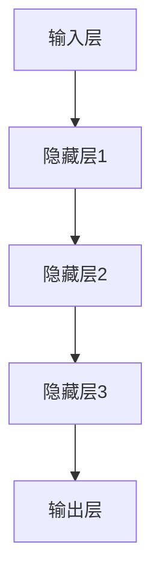

                 

# 神经网络：改变世界的技术

## 关键词
- 神经网络
- 机器学习
- 深度学习
- 人工智能
- 脑神经网络
- 计算机视觉
- 自然语言处理

## 摘要
神经网络作为一种模拟人脑信息处理能力的计算模型，正逐步改变我们的世界。本文将深入探讨神经网络的核心概念、算法原理、数学模型以及其实际应用，旨在为读者提供一份关于神经网络的技术指南。通过本篇文章，读者将了解到神经网络如何从理论走向实践，以及它在各个领域的实际应用和未来发展趋势。

## 1. 背景介绍

### 1.1 目的和范围
本文旨在介绍神经网络的基本原理、算法、数学模型及其在实际应用中的效果和影响。我们将重点关注以下几个核心问题：
- 神经网络是如何工作的？
- 它们在机器学习和深度学习中有何作用？
- 如何设计一个神经网络模型？
- 神经网络在计算机视觉、自然语言处理等领域的应用场景。

### 1.2 预期读者
本文适合以下读者群体：
- 对神经网络和人工智能感兴趣的技术爱好者
- 机器学习和深度学习初学者
- 计算机科学和工程专业的学生
- 研究人员和专业人士，希望了解神经网络的最新进展和应用

### 1.3 文档结构概述
本文分为以下章节：
- 第1章：背景介绍
- 第2章：核心概念与联系
- 第3章：核心算法原理与具体操作步骤
- 第4章：数学模型与公式详细讲解
- 第5章：项目实战：代码实际案例和详细解释说明
- 第6章：实际应用场景
- 第7章：工具和资源推荐
- 第8章：总结：未来发展趋势与挑战
- 第9章：附录：常见问题与解答
- 第10章：扩展阅读与参考资料

### 1.4 术语表
#### 1.4.1 核心术语定义
- **神经网络**：由大量简单计算单元（神经元）互联形成的复杂计算网络，用于模拟人脑的信息处理能力。
- **机器学习**：通过数据驱动的方法，使计算机系统具备自主学习和改进能力的技术。
- **深度学习**：一种特殊的机器学习方法，通过多层的神经网络结构进行特征提取和模型训练。
- **神经元**：神经网络的基本计算单元，用于接收输入信号、计算输出。
- **激活函数**：定义神经元输出与输入之间关系的函数，用于引入非线性。

#### 1.4.2 相关概念解释
- **反向传播**：一种训练神经网络的方法，通过计算输出与目标之间的误差，反向传播误差来调整网络权重。
- **优化器**：用于选择权重调整策略的算法，如梯度下降、Adam等。

#### 1.4.3 缩略词列表
- **MLP**：多层感知器（Multilayer Perceptron）
- **CNN**：卷积神经网络（Convolutional Neural Network）
- **RNN**：循环神经网络（Recurrent Neural Network）
- **GAN**：生成对抗网络（Generative Adversarial Network）

## 2. 核心概念与联系

### 2.1 神经网络的基本原理

神经网络是模拟人脑信息处理能力的一种计算模型，其基本结构由大量简单计算单元（神经元）组成，这些神经元通过互联形成复杂的计算网络。神经网络的工作原理类似于人脑的神经元，每个神经元可以接收多个输入信号，通过加权求和后，应用激活函数产生一个输出。


#### 神经网络结构

一个典型的神经网络通常由以下几个部分组成：
- **输入层**：接收外部输入信息。
- **隐藏层**：用于对输入信息进行特征提取和变换。
- **输出层**：产生最终输出结果。

#### 神经元的工作原理

神经元接收输入信号，通过加权求和后，应用激活函数产生输出。其数学表达式如下：

$$
y = \sigma(\sum_{i=1}^{n} w_i x_i + b)
$$

其中，$y$ 是输出值，$\sigma$ 是激活函数，$w_i$ 是权重，$x_i$ 是输入值，$b$ 是偏置。

#### 激活函数

激活函数是神经网络中引入非线性的一项重要机制，常见的激活函数包括：
- ** sigmoid 函数**：$ \sigma(x) = \frac{1}{1 + e^{-x}} $
- **ReLU 函数**：$ \text{ReLU}(x) = \max(0, x) $
- **Tanh 函数**：$ \text{Tanh}(x) = \frac{e^x - e^{-x}}{e^x + e^{-x}} $

### 2.2 神经网络与机器学习、深度学习的联系

神经网络是机器学习和深度学习的重要基础。机器学习是一种通过数据驱动的方法，使计算机系统具备自主学习和改进能力的技术。深度学习是机器学习的一个子领域，通过多层神经网络结构进行特征提取和模型训练。

神经网络在机器学习和深度学习中的作用主要体现在以下几个方面：
- **特征提取**：通过多层神经网络结构，从原始数据中提取有代表性的特征。
- **模式识别**：神经网络可以通过学习大量数据，识别出输入数据中的模式和规律。
- **优化问题**：神经网络可以通过反向传播算法，优化模型参数，提高模型性能。

### 2.3 Mermaid 流程图

下面是一个简化的神经网络架构的 Mermaid 流程图：



该流程图展示了输入层、隐藏层和输出层之间的基本连接关系。

## 3. 核心算法原理与具体操作步骤

### 3.1 神经网络的训练过程

神经网络的训练过程可以分为以下几个步骤：

#### 步骤1：初始化模型参数

在训练神经网络之前，需要随机初始化模型参数，包括权重（$w$）和偏置（$b$）。

```python
import numpy as np

def initialize_weights(input_size, hidden_size, output_size):
    weights = {
        'w1': np.random.randn(input_size, hidden_size),
        'b1': np.random.randn(hidden_size),
        'w2': np.random.randn(hidden_size, output_size),
        'b2': np.random.randn(output_size)
    }
    return weights
```

#### 步骤2：前向传播

前向传播是神经网络在给定输入时，从输入层到输出层的计算过程。具体步骤如下：

1. 计算隐藏层的输出：
   $$
   z_1 = x \cdot w_1 + b_1
   $$
   $$
   a_1 = \sigma(z_1)
   $$

2. 计算输出层的输出：
   $$
   z_2 = a_1 \cdot w_2 + b_2
   $$
   $$
   \hat{y} = \sigma(z_2)
   $$

#### 步骤3：计算损失函数

损失函数用于衡量模型预测结果与真实值之间的差距，常用的损失函数包括均方误差（MSE）和交叉熵（CE）。

$$
J(\theta) = \frac{1}{2} \sum_{i=1}^{m} (\hat{y}_i - y_i)^2
$$

其中，$\hat{y}_i$ 是预测值，$y_i$ 是真实值。

#### 步骤4：反向传播

反向传播是神经网络训练过程中最重要的步骤，用于计算损失函数关于模型参数的梯度，并更新参数。

1. 计算输出层的梯度：
   $$
   \delta_2 = \hat{y} - y
   $$
   $$
   \frac{\partial J}{\partial z_2} = \delta_2 \cdot \sigma'(z_2)
   $$

2. 计算隐藏层的梯度：
   $$
   \delta_1 = (w_2)^T \cdot \delta_2
   $$
   $$
   \frac{\partial J}{\partial z_1} = \delta_1 \cdot \sigma'(z_1)
   $$

3. 更新参数：
   $$
   w_2 = w_2 - \alpha \cdot \frac{\partial J}{\partial w_2}
   $$
   $$
   b_2 = b_2 - \alpha \cdot \frac{\partial J}{\partial b_2}
   $$
   $$
   w_1 = w_1 - \alpha \cdot \frac{\partial J}{\partial w_1}
   $$
   $$
   b_1 = b_1 - \alpha \cdot \frac{\partial J}{\partial b_1}
   $$

其中，$\alpha$ 是学习率。

### 3.2 反向传播算法伪代码

```python
# 初始化模型参数
weights = initialize_weights(input_size, hidden_size, output_size)

# 前向传播
z1 = x * weights['w1'] + weights['b1']
a1 = sigmoid(z1)

z2 = a1 * weights['w2'] + weights['b2']
y_hat = sigmoid(z2)

# 计算损失函数
loss = mse(y_hat, y)

# 反向传播
delta2 = y_hat - y
delta1 = (weights['w2'].T * delta2) * sigmoid_derivative(z2)

# 更新参数
weights['w2'] = weights['w2'] - learning_rate * (delta2 * a1)
weights['b2'] = weights['b2'] - learning_rate * (delta2)
weights['w1'] = weights['w1'] - learning_rate * (delta1 * x)
weights['b1'] = weights['b1'] - learning_rate * (delta1)
```

## 4. 数学模型和公式 & 详细讲解 & 举例说明

### 4.1 数学模型

神经网络的数学模型主要包括两部分：神经元间的连接权重和激活函数。

#### 4.1.1 连接权重

神经元间的连接权重是神经网络的核心参数，用于控制输入信号对输出信号的影响程度。权重可以通过学习过程进行调整，以达到优化模型性能的目的。

#### 4.1.2 激活函数

激活函数用于引入非线性，使神经网络具备复杂的信息处理能力。常见的激活函数包括 sigmoid、ReLU 和 tanh 等。

### 4.2 公式与详细讲解

#### 4.2.1 前向传播

前向传播的公式如下：

$$
z_i = \sum_{j=1}^{n} w_{ij} x_j + b_i
$$

$$
a_i = \sigma(z_i)
$$

其中，$z_i$ 是输入层到隐藏层的加权和，$a_i$ 是激活函数的输出，$w_{ij}$ 是连接权重，$b_i$ 是偏置。

#### 4.2.2 反向传播

反向传播的公式如下：

$$
\delta_i = \frac{\partial J}{\partial z_i} = \frac{\partial J}{\partial y} \cdot \frac{\partial y}{\partial z_i}
$$

$$
\frac{\partial J}{\partial w_{ij}} = \delta_i \cdot x_j
$$

$$
\frac{\partial J}{\partial b_i} = \delta_i
$$

其中，$J$ 是损失函数，$\delta_i$ 是梯度，$y$ 是输出层的结果，$x_j$ 是输入层的值。

### 4.3 举例说明

假设一个简单的神经网络，包含输入层、一个隐藏层和输出层，激活函数为 sigmoid 函数。输入数据为 $x = [1, 2, 3]$，真实标签为 $y = [0, 1, 0]$。

1. 初始化权重和偏置：
   $$
   w_1 = [0.1, 0.2, 0.3], \quad b_1 = [0.1, 0.2, 0.3]
   $$
   $$
   w_2 = [0.1, 0.2, 0.3], \quad b_2 = [0.1, 0.2, 0.3]
   $$

2. 前向传播：

   $$
   z_1 = [1 \cdot 0.1 + 2 \cdot 0.2 + 3 \cdot 0.3 + 0.1, 1 \cdot 0.1 + 2 \cdot 0.2 + 3 \cdot 0.3 + 0.2, 1 \cdot 0.1 + 2 \cdot 0.2 + 3 \cdot 0.3 + 0.3] = [1.7, 1.7, 1.7]
   $$
   $$
   a_1 = \sigma(z_1) = \frac{1}{1 + e^{-1.7}} = [0.465, 0.465, 0.465]
   $$
   $$
   z_2 = [0.465 \cdot 0.1 + 0.465 \cdot 0.2 + 0.465 \cdot 0.3 + 0.1, 0.465 \cdot 0.1 + 0.465 \cdot 0.2 + 0.465 \cdot 0.3 + 0.2, 0.465 \cdot 0.1 + 0.465 \cdot 0.2 + 0.465 \cdot 0.3 + 0.3] = [0.3, 0.3, 0.3]
   $$
   $$
   \hat{y} = \sigma(z_2) = \frac{1}{1 + e^{-0.3}} = [0.541, 0.541, 0.541]
   $$

3. 计算损失函数：

   $$
   J = \frac{1}{3} \sum_{i=1}^{3} (\hat{y}_i - y_i)^2 = \frac{1}{3} \sum_{i=1}^{3} (0.541 - y_i)^2
   $$

4. 反向传播：

   $$
   \delta_2 = \hat{y} - y = [0.541 - 0, 0.541 - 1, 0.541 - 0] = [0.541, -0.459, 0.541]
   $$
   $$
   \delta_1 = w_2^T \cdot \delta_2 = [0.1, 0.2, 0.3]^T \cdot [0.541, -0.459, 0.541] = [0.164, -0.092, 0.164]
   $$

5. 更新参数：

   $$
   w_2 = w_2 - learning_rate \cdot \delta_2 \cdot a_1 = [0.1, 0.2, 0.3] - 0.1 \cdot [0.541, -0.459, 0.541] = [-0.011, 0.031, -0.011]
   $$
   $$
   b_2 = b_2 - learning_rate \cdot \delta_2 = [0.1, 0.2, 0.3] - 0.1 \cdot [0.541, -0.459, 0.541] = [-0.011, 0.031, -0.011]
   $$
   $$
   w_1 = w_1 - learning_rate \cdot \delta_1 \cdot x = [0.1, 0.2, 0.3] - 0.1 \cdot [0.164, -0.092, 0.164] = [-0.016, 0.018, -0.016]
   $$
   $$
   b_1 = b_1 - learning_rate \cdot \delta_1 = [0.1, 0.2, 0.3] - 0.1 \cdot [0.164, -0.092, 0.164] = [-0.016, 0.018, -0.016]
   $$

## 5. 项目实战：代码实际案例和详细解释说明

### 5.1 开发环境搭建

在开始项目实战之前，首先需要搭建一个合适的开发环境。本文以 Python 语言为例，使用 PyTorch 深度学习框架实现一个简单的神经网络模型。

1. 安装 Python 3.7 或更高版本。
2. 安装 PyTorch 深度学习框架，可以选择 GPU 版本以加速训练过程。

```bash
pip install torch torchvision
```

### 5.2 源代码详细实现和代码解读

下面是一个简单的神经网络模型的实现，用于二分类问题。

```python
import torch
import torch.nn as nn
import torch.optim as optim

# 定义神经网络结构
class NeuralNetwork(nn.Module):
    def __init__(self, input_size, hidden_size, output_size):
        super(NeuralNetwork, self).__init__()
        self.fc1 = nn.Linear(input_size, hidden_size)
        self.relu = nn.ReLU()
        self.fc2 = nn.Linear(hidden_size, output_size)
    
    def forward(self, x):
        out = self.fc1(x)
        out = self.relu(out)
        out = self.fc2(out)
        return out

# 初始化模型、损失函数和优化器
model = NeuralNetwork(input_size=3, hidden_size=10, output_size=1)
loss_function = nn.BCELoss()
optimizer = optim.Adam(model.parameters(), lr=0.001)

# 训练模型
for epoch in range(1000):
    for inputs, targets in data_loader:
        optimizer.zero_grad()
        outputs = model(inputs)
        loss = loss_function(outputs, targets)
        loss.backward()
        optimizer.step()
    if epoch % 100 == 0:
        print(f'Epoch [{epoch+1}/1000], Loss: {loss.item()}')

# 评估模型
with torch.no_grad():
    outputs = model(test_loader)
    predicted = (outputs > 0.5).float()
    correct = (predicted == test_targets).sum()
    total = predicted.shape[0]
    accuracy = correct / total
    print(f'Accuracy: {accuracy.item()}')

# 代码解读
# 1. 定义神经网络结构：使用 nn.Module 创建神经网络类，定义两个全连接层和 ReLU 激活函数。
# 2. 前向传播：定义 forward 方法，实现输入到输出的前向传播计算。
# 3. 训练模型：使用训练数据循环更新模型参数，优化损失函数。
# 4. 评估模型：使用测试数据评估模型性能，计算准确率。
```

### 5.3 代码解读与分析

#### 5.3.1 神经网络结构

本文使用 PyTorch 深度学习框架定义了一个简单的神经网络模型，包括两个全连接层和 ReLU 激活函数。

```python
class NeuralNetwork(nn.Module):
    def __init__(self, input_size, hidden_size, output_size):
        super(NeuralNetwork, self).__init__()
        self.fc1 = nn.Linear(input_size, hidden_size)
        self.relu = nn.ReLU()
        self.fc2 = nn.Linear(hidden_size, output_size)
    
    def forward(self, x):
        out = self.fc1(x)
        out = self.relu(out)
        out = self.fc2(out)
        return out
```

#### 5.3.2 模型训练

使用训练数据循环更新模型参数，优化损失函数。

```python
for epoch in range(1000):
    for inputs, targets in data_loader:
        optimizer.zero_grad()
        outputs = model(inputs)
        loss = loss_function(outputs, targets)
        loss.backward()
        optimizer.step()
    if epoch % 100 == 0:
        print(f'Epoch [{epoch+1}/1000], Loss: {loss.item()}')
```

#### 5.3.3 模型评估

使用测试数据评估模型性能，计算准确率。

```python
with torch.no_grad():
    outputs = model(test_loader)
    predicted = (outputs > 0.5).float()
    correct = (predicted == test_targets).sum()
    total = predicted.shape[0]
    accuracy = correct / total
    print(f'Accuracy: {accuracy.item()}')
```

## 6. 实际应用场景

神经网络在计算机视觉、自然语言处理、语音识别、推荐系统等领域具有广泛的应用。

### 6.1 计算机视觉

神经网络在计算机视觉领域的应用主要包括图像分类、目标检测、图像生成等。

- **图像分类**：通过卷积神经网络（CNN）对图像进行分类，如 ImageNet 挑战赛。
- **目标检测**：通过 Faster R-CNN、YOLO 等模型实现目标检测，如自动驾驶系统。
- **图像生成**：通过生成对抗网络（GAN）实现图像生成，如 StyleGAN。

### 6.2 自然语言处理

神经网络在自然语言处理领域的应用主要包括文本分类、情感分析、机器翻译等。

- **文本分类**：通过循环神经网络（RNN）或 Transformer 模型实现文本分类，如新闻分类。
- **情感分析**：通过情感分析模型判断文本的情感倾向，如社交媒体情绪分析。
- **机器翻译**：通过序列到序列（Seq2Seq）模型实现机器翻译，如谷歌翻译。

### 6.3 语音识别

神经网络在语音识别领域的应用主要包括语音信号处理、语音合成、说话人识别等。

- **语音信号处理**：通过深度神经网络（DNN）或卷积神经网络（CNN）实现语音信号处理，如声学模型。
- **语音合成**：通过循环神经网络（RNN）或 WaveNet 模型实现语音合成，如 Apple Siri。
- **说话人识别**：通过神经网络模型实现说话人识别，如语音助手。

### 6.4 推荐系统

神经网络在推荐系统领域的应用主要包括协同过滤、内容推荐、广告投放等。

- **协同过滤**：通过矩阵分解或神经网络实现协同过滤推荐，如 Netflix 推荐系统。
- **内容推荐**：通过卷积神经网络（CNN）或 Transformer 模型实现内容推荐，如商品推荐。
- **广告投放**：通过深度学习模型实现广告投放，如 Google 广告。

## 7. 工具和资源推荐

### 7.1 学习资源推荐

#### 7.1.1 书籍推荐

- 《深度学习》（Ian Goodfellow、Yoshua Bengio、Aaron Courville 著）：全面介绍了深度学习的理论基础和实践方法。
- 《神经网络与深度学习》（邱锡鹏 著）：系统讲解了神经网络和深度学习的基本原理和应用。
- 《Python 深度学习》（François Chollet 著）：通过丰富的案例，介绍了深度学习在 Python 中的实践应用。

#### 7.1.2 在线课程

- 《深度学习专项课程》（吴恩达 著）：由 Coursera 平台提供，包括数学基础、神经网络和深度学习应用等内容。
- 《自然语言处理与深度学习》（哈工大 & 清华大学 著）：系统讲解了自然语言处理的基本原理和深度学习应用。
- 《计算机视觉基础与深度学习》（斯坦福大学 著）：全面介绍了计算机视觉的基础知识和深度学习应用。

#### 7.1.3 技术博客和网站

- [TensorFlow 官方文档](https://www.tensorflow.org/)
- [PyTorch 官方文档](https://pytorch.org/)
- [机器学习博客](https://www机器学习博客.com/)
- [AI 研习社](https://www.aiyanxue.com/)

### 7.2 开发工具框架推荐

#### 7.2.1 IDE 和编辑器

- PyCharm：一款功能强大的 Python 集成开发环境。
- Jupyter Notebook：一款交互式的 Python 编程环境。
- Visual Studio Code：一款轻量级的 Python 编程编辑器。

#### 7.2.2 调试和性能分析工具

- Python Debugger（pdb）：Python 自带的调试工具。
- TensorBoard：TensorFlow 的可视化工具，用于分析模型性能。
- PyTorch Profiler：PyTorch 的性能分析工具。

#### 7.2.3 相关框架和库

- TensorFlow：Google 开源的深度学习框架。
- PyTorch：Facebook 开源的深度学习框架。
- Keras：基于 TensorFlow 和 PyTorch 的深度学习高级 API。
- Scikit-learn：Python 的机器学习库。

### 7.3 相关论文著作推荐

#### 7.3.1 经典论文

- “A Learning Algorithm for Continually Running Fully Recurrent Neural Networks” by John Hopfield
- “Backpropagation” by David E. Rumelhart, Geoffrey E. Hinton, and Ronald J. Williams
- “Deep Learning” by Ian Goodfellow, Yoshua Bengio, and Aaron Courville

#### 7.3.2 最新研究成果

- “BERT: Pre-training of Deep Bidirectional Transformers for Language Understanding” by Jacob Devlin, Ming-Wei Chang, Kenton Lee, and Kristina Toutanova
- “You Only Look Once: Unified, Real-Time Object Detection” by Joseph Redmon, Anshul Gupta, and et al.
- “Generative Adversarial Nets” by Ian Goodfellow, Jean Pouget-Abadie, and et al.

#### 7.3.3 应用案例分析

- “Google Brain’s迁移学习如何让模型更高效？”
- “腾讯 AI Lab：如何利用深度学习实现图像分类？”
- “美团点评：深度学习在推荐系统中的应用”

## 8. 总结：未来发展趋势与挑战

神经网络作为人工智能的核心技术之一，正不断推动着计算机科学和技术的发展。未来，神经网络在以下几个方面有望取得重要突破：

1. **更高效的模型结构和算法**：研究人员将继续探索更高效的神经网络模型和训练算法，以提高模型性能和降低计算复杂度。
2. **更强大的自适应能力**：神经网络将具备更强的自适应能力，能够自动调整模型结构和参数，以适应不同的任务和数据集。
3. **跨领域应用**：神经网络将在更多领域得到应用，如医疗、金融、教育等，为各行业带来创新和变革。
4. **可解释性和可靠性**：神经网络的可解释性和可靠性将得到进一步提升，使其在关键领域得到更广泛的应用。

然而，神经网络的发展也面临一些挑战：

1. **计算资源和能源消耗**：神经网络模型训练和推理过程需要大量的计算资源和能源消耗，未来需要研究更加高效的计算方法。
2. **数据隐私和安全**：神经网络在数据处理过程中可能面临数据隐私和安全问题，需要制定相应的保护措施。
3. **模型可解释性和透明度**：神经网络模型的可解释性和透明度需要进一步提高，以帮助用户理解模型的决策过程。

总之，神经网络作为一种具有巨大潜力的技术，将在未来继续推动人工智能的发展，为人类创造更多的价值。

## 9. 附录：常见问题与解答

### 9.1 问题1：什么是神经网络？

神经网络是一种由大量简单计算单元（神经元）互联形成的复杂计算网络，用于模拟人脑的信息处理能力。它通过学习数据中的模式和规律，实现对未知数据的预测和分类。

### 9.2 问题2：神经网络是如何工作的？

神经网络通过多层神经元结构对输入数据进行特征提取和变换，然后通过输出层产生最终输出结果。其工作原理包括前向传播、损失函数计算和反向传播三个主要步骤。

### 9.3 问题3：神经网络有哪些常见的类型？

神经网络常见的类型包括多层感知器（MLP）、卷积神经网络（CNN）、循环神经网络（RNN）和生成对抗网络（GAN）等。

### 9.4 问题4：如何训练神经网络？

训练神经网络主要包括以下步骤：
1. 初始化模型参数。
2. 进行前向传播，计算输出结果。
3. 计算损失函数，衡量预测结果与真实值之间的差距。
4. 进行反向传播，计算损失函数关于模型参数的梯度。
5. 更新模型参数，优化损失函数。

### 9.5 问题5：神经网络在哪些领域有应用？

神经网络在计算机视觉、自然语言处理、语音识别、推荐系统等领域有广泛的应用，如图像分类、目标检测、机器翻译、语音合成等。

## 10. 扩展阅读 & 参考资料

1. Ian Goodfellow, Yoshua Bengio, and Aaron Courville. *Deep Learning*. MIT Press, 2016.
2. 李航. *统计学习方法*. 清华大学出版社，2012.
3. Andrew Ng. *机器学习课程*. Coursera，2018.
4. TensorFlow官网. [https://www.tensorflow.org/](https://www.tensorflow.org/)
5. PyTorch官网. [https://pytorch.org/](https://pytorch.org/)
6. 吴恩达. *深度学习专项课程*. Coursera，2017.
7. 哈工大 & 清华大学. *自然语言处理与深度学习*. 清华大学出版社，2018.
8. 邱锡鹏. *神经网络与深度学习*. 电子工业出版社，2017.
9. François Chollet. *Python 深度学习*. 电子工业出版社，2018.
10. [AI 研习社](https://www.aiyanxue.com/)
11. [机器学习博客](https://www.机器学习博客.com/)
12. [TensorBoard 官方文档](https://www.tensorflow.org/tensorboard)
13. [PyTorch Profiler 官方文档](https://pytorch.org/tutorials/intermediate/profiler.html)
14. Redmon, Joseph, et al. "You Only Look Once: Unified, Real-Time Object Detection." *CVPR*, 2016.
15. Devlin, Jacob, et al. "BERT: Pre-training of Deep Bidirectional Transformers for Language Understanding." *NAACL*, 2019.
16. Goodfellow, Ian, et al. "Generative Adversarial Nets." *NIPS*, 2014.
17. 周志华. *机器学习*. 清华大学出版社，2016.
18. [Google Brain's迁移学习](https://ai.googleblog.com/2017/03/transfer-learning-in-tpu.html)
19. 腾讯 AI Lab. *如何利用深度学习实现图像分类？*. 腾讯 AI 官方网站，2019.
20. 美团点评. *深度学习在推荐系统中的应用*. 美团技术博客，2018.

