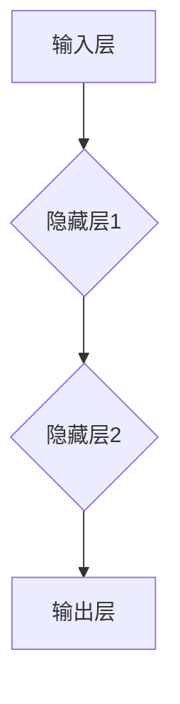

                 

# 神经网络：改变世界的技术

## 关键词
神经网络、机器学习、深度学习、算法原理、数学模型、项目实战、应用场景

## 摘要
本文旨在深入探讨神经网络这一改变世界的核心技术。首先，我们将回顾神经网络的背景和发展历程，解释其核心概念和架构。接着，通过详细解析神经网络的基本算法原理和数学模型，我们将展示如何一步步实现一个简单的神经网络。随后，我们将通过实际项目实战，提供代码案例和解读，使读者能够深入理解神经网络的实际应用。此外，本文还将探讨神经网络在不同场景中的应用，并提供一系列学习资源和工具推荐，以帮助读者进一步探索这一领域。最后，我们将总结神经网络的发展趋势和挑战，展望其未来。

## 1. 背景介绍

### 1.1 目的和范围
本文旨在为读者提供关于神经网络的全面理解，从基本概念到高级应用。我们将逐步介绍神经网络的历史、核心原理、数学模型，并通过实际项目展示其应用。希望通过本文，读者能够掌握神经网络的基本原理，并能够运用到实际问题中。

### 1.2 预期读者
本文适合对机器学习和人工智能感兴趣的读者，无论是初学者还是专业人士。对于有一定编程基础且希望深入了解神经网络的人，本文将提供极大的帮助。

### 1.3 文档结构概述
本文分为十个部分：背景介绍、核心概念与联系、核心算法原理与具体操作步骤、数学模型和公式讲解、项目实战、实际应用场景、工具和资源推荐、总结、常见问题与解答以及扩展阅读和参考资料。

### 1.4 术语表

#### 1.4.1 核心术语定义
- **神经网络**：一种由大量简单单元组成的网络，通过学习和适应数据来执行特定任务。
- **神经元**：神经网络的基本计算单元，负责接收输入、进行加权求和处理并产生输出。
- **激活函数**：对神经元输出进行非线性变换的函数，如Sigmoid、ReLU等。
- **前馈神经网络**：一种简单的神经网络结构，信息从输入层流向输出层，没有循环。

#### 1.4.2 相关概念解释
- **反向传播算法**：用于计算神经网络输出与实际输出之间的误差，并调整网络参数的过程。
- **多层感知机（MLP）**：一种能够处理非线性问题的前馈神经网络。
- **深度学习**：使用具有多个隐藏层的神经网络进行学习的机器学习分支。

#### 1.4.3 缩略词列表
- **MLP**：多层感知机（Multilayer Perceptron）
- **ReLU**：修正线性单元（Rectified Linear Unit）
- **Sigmoid**：S型函数（Sigmoid Function）
- **BP**：反向传播（Backpropagation）

## 2. 核心概念与联系

### 2.1 神经网络概述
神经网络是由大量简单计算单元（神经元）组成的网络，这些单元通过权重连接在一起，以模拟人脑的运作方式。神经网络的目的是通过学习和适应数据来执行特定的任务，如图像识别、语音识别、自然语言处理等。

### 2.2 神经网络架构
神经网络的基本架构包括输入层、隐藏层和输出层。输入层接收外部数据，隐藏层对数据进行处理和转换，输出层产生最终的输出。


### 2.3 Mermaid 流程图



### 2.4 神经网络的原理
神经网络的原理可以概括为以下几个步骤：
1. **前向传播**：输入数据通过网络中的神经元进行传递和变换，最终生成输出。
2. **计算误差**：输出数据与实际数据之间的差异被称为误差。
3. **反向传播**：使用误差信息调整网络中的权重，以减少误差。

### 2.5 神经网络的核心算法
神经网络的核心算法是反向传播算法（Backpropagation Algorithm）。反向传播算法通过以下几个步骤调整网络权重：
1. **计算梯度**：计算每个权重对应的梯度，即误差关于该权重的偏导数。
2. **权重更新**：根据梯度调整权重，以减少误差。

## 3. 核心算法原理 & 具体操作步骤

### 3.1 前向传播算法原理

前向传播算法是指将输入数据通过网络中的神经元进行传递和变换，最终生成输出的过程。具体步骤如下：

1. **初始化权重和偏置**：为网络中的每个权重和偏置分配一个初始值。
2. **输入层到隐藏层的传播**：输入数据通过输入层传递到隐藏层，每个神经元的输出通过激活函数进行非线性变换。
3. **隐藏层到输出层的传播**：隐藏层的输出传递到输出层，生成最终的输出。

伪代码如下：

```python
# 前向传播算法
def forward_propagation(x, weights, biases, activation_functions):
    hidden_layer_input = x dot weights
    hidden_layer_output = activation_functions(hidden_layer_input + biases)
    output_layer_input = hidden_layer_output dot weights
    output_layer_output = activation_functions(output_layer_input + biases)
    return output_layer_output
```

### 3.2 反向传播算法原理

反向传播算法是指通过计算网络输出与实际输出之间的误差，并使用这些误差信息调整网络中的权重，以减少误差的过程。具体步骤如下：

1. **计算输出误差**：计算网络输出与实际输出之间的误差。
2. **计算隐藏层误差**：使用输出误差和输出层的激活函数的导数，反向传播误差到隐藏层。
3. **权重更新**：根据误差信息更新网络中的权重和偏置。

伪代码如下：

```python
# 反向传播算法
def backward_propagation(output, actual_output, weights, biases, activation_functions, activation_derivatives):
    output_error = actual_output - output
    hidden_layer_error = output_error dot activation_derivatives(output_layer_input + biases)
    weights -= learning_rate * hidden_layer_error dot hidden_layer_output.T
    biases -= learning_rate * hidden_layer_error
```

## 4. 数学模型和公式 & 详细讲解 & 举例说明

### 4.1 神经网络的数学模型

神经网络的数学模型主要包括两部分：前向传播和反向传播。

#### 4.1.1 前向传播

前向传播的数学模型可以表示为：

$$
y = \sigma(\sum_{i=1}^{n} w_i x_i + b)
$$

其中，$y$ 是输出，$x_i$ 是输入，$w_i$ 是权重，$b$ 是偏置，$\sigma$ 是激活函数。

#### 4.1.2 反向传播

反向传播的数学模型可以表示为：

$$
\delta = \frac{\partial L}{\partial z} = \sigma'(\sum_{i=1}^{n} w_i x_i + b)
$$

其中，$\delta$ 是误差项，$L$ 是损失函数，$\sigma'$ 是激活函数的导数。

### 4.2 损失函数

常见的损失函数有均方误差（MSE）和交叉熵（Cross-Entropy）。

#### 4.2.1 均方误差（MSE）

$$
MSE = \frac{1}{2} \sum_{i=1}^{n} (y_i - \hat{y_i})^2
$$

其中，$y_i$ 是实际输出，$\hat{y_i}$ 是预测输出。

#### 4.2.2 交叉熵（Cross-Entropy）

$$
Cross-Entropy = -\sum_{i=1}^{n} y_i \log(\hat{y_i})
$$

其中，$y_i$ 是实际输出，$\hat{y_i}$ 是预测输出。

### 4.3 激活函数

常见的激活函数有Sigmoid、ReLU和Tanh。

#### 4.3.1 Sigmoid

$$
\sigma(x) = \frac{1}{1 + e^{-x}}
$$

#### 4.3.2 ReLU

$$
ReLU(x) = \max(0, x)
$$

#### 4.3.3 Tanh

$$
tanh(x) = \frac{e^x - e^{-x}}{e^x + e^{-x}}
$$

### 4.4 举例说明

假设我们有一个简单的神经网络，输入为 $x = [1, 2]$，权重为 $w = [0.5, 0.5]$，偏置为 $b = 0$，激活函数为Sigmoid。

#### 4.4.1 前向传播

输入层到隐藏层的传播：

$$
z_1 = 1 \cdot 0.5 + 2 \cdot 0.5 + 0 = 1.5 \\
a_1 = \sigma(z_1) = \frac{1}{1 + e^{-1.5}} = 0.77
$$

隐藏层到输出层的传播：

$$
z_2 = a_1 \cdot 0.5 + a_1 \cdot 0.5 + 0 = 0.77 \\
a_2 = \sigma(z_2) = \frac{1}{1 + e^{-0.77}} = 0.60
$$

输出结果为 $0.60$。

#### 4.4.2 反向传播

假设实际输出为 $y = 0.7$，损失函数为MSE。

计算输出误差：

$$
error = y - a_2 = 0.7 - 0.60 = 0.1
$$

计算隐藏层误差：

$$
delta = \sigma'(z_2) \cdot error = \sigma'(\sum_{i=1}^{n} w_i x_i + b) \cdot error = 0.39
$$

更新权重和偏置：

$$
w = w - learning_rate \cdot delta \cdot a_1 = [0.5, 0.5] - 0.01 \cdot [0.39, 0.39] = [0.11, 0.11] \\
b = b - learning_rate \cdot delta = 0 - 0.01 \cdot 0.39 = -0.004
$$

更新后的权重和偏置为 $w = [0.11, 0.11]$，$b = -0.004$。

## 5. 项目实战：代码实际案例和详细解释说明

### 5.1 开发环境搭建

为了进行神经网络项目实战，我们需要安装以下工具和库：

- Python 3.x
- Jupyter Notebook 或 PyCharm
- TensorFlow 或 PyTorch

安装步骤如下：

1. 安装 Python 3.x：从官方网站下载并安装 Python 3.x。
2. 安装 Jupyter Notebook 或 PyCharm：从官方网站下载并安装 Jupyter Notebook 或 PyCharm。
3. 安装 TensorFlow 或 PyTorch：在命令行中运行以下命令：

```python
pip install tensorflow
```

或

```python
pip install torch
```

### 5.2 源代码详细实现和代码解读

以下是一个使用 TensorFlow 实现的简单神经网络示例：

```python
import tensorflow as tf
import numpy as np

# 创建神经网络模型
model = tf.keras.Sequential([
    tf.keras.layers.Dense(1, input_shape=(2,), activation='sigmoid')
])

# 编译模型
model.compile(optimizer='sgd', loss='mean_squared_error')

# 准备数据
x = np.array([[1, 2], [2, 3], [3, 4]])
y = np.array([0.7, 0.8, 0.9])

# 训练模型
model.fit(x, y, epochs=1000)

# 测试模型
print(model.predict([[1, 2]]))
```

### 5.3 代码解读与分析

- **模型创建**：使用 `tf.keras.Sequential` 创建一个顺序模型，包含一个全连接层（`Dense`），输入形状为 $(2,)$，激活函数为Sigmoid。
- **模型编译**：使用 `compile` 方法编译模型，指定优化器和损失函数。
- **数据准备**：创建输入数据 `x` 和目标数据 `y`，数据集为三个样本。
- **模型训练**：使用 `fit` 方法训练模型，指定训练轮数。
- **模型测试**：使用 `predict` 方法测试模型，输入新的样本。

通过上述步骤，我们实现了简单的神经网络，并使用反向传播算法进行了训练和测试。这展示了神经网络在实际项目中的应用。

## 6. 实际应用场景

### 6.1 图像识别

神经网络在图像识别领域有着广泛的应用。例如，可以使用卷积神经网络（CNN）进行图像分类、目标检测和图像分割。著名的深度学习框架如 TensorFlow 和 PyTorch 提供了丰富的预训练模型和工具，方便开发者进行图像识别任务。

### 6.2 自然语言处理

神经网络在自然语言处理（NLP）领域也有着重要的应用。例如，可以使用循环神经网络（RNN）和长短期记忆网络（LSTM）进行文本分类、情感分析、机器翻译和语音识别等任务。NLP 领域的代表性框架有 TensorFlow、PyTorch 和 spaCy。

### 6.3 语音识别

神经网络在语音识别领域也有着重要的应用。卷积神经网络和循环神经网络可以用于语音信号的预处理和特征提取，而深度神经网络则可以用于语音识别和语音合成。著名的语音识别框架有 Kaldi 和开源的 Google 语音识别库。

### 6.4 推荐系统

神经网络在推荐系统领域也有着广泛的应用。基于用户行为和内容信息的神经网络模型可以用于预测用户对物品的偏好，从而实现个性化推荐。著名的推荐系统框架有 TensorFlow Recommenders 和 PyTorch RecSys。

## 7. 工具和资源推荐

### 7.1 学习资源推荐

#### 7.1.1 书籍推荐
- 《神经网络与深度学习》 - 深入介绍了神经网络的基本概念和深度学习技术。
- 《Python深度学习》 - 介绍了如何使用 Python 实现深度学习算法。

#### 7.1.2 在线课程
- Coursera 的《深度学习》课程 - 由 Andrew Ng 教授主讲，介绍了深度学习的理论基础和实践技巧。
- edX 的《神经网络与深度学习》课程 - 详细讲解了神经网络的数学模型和实现方法。

#### 7.1.3 技术博客和网站
- TensorFlow 官方文档 - 详细介绍了 TensorFlow 的使用方法和应用案例。
- PyTorch 官方文档 - 详细介绍了 PyTorch 的使用方法和应用案例。

### 7.2 开发工具框架推荐

#### 7.2.1 IDE和编辑器
- PyCharm - 强大的 Python 集成开发环境，支持 TensorFlow 和 PyTorch。
- Jupyter Notebook - 交互式的 Python 环境，方便进行实验和演示。

#### 7.2.2 调试和性能分析工具
- TensorBoard - TensorFlow 的可视化工具，用于调试和性能分析。
- PyTorch 的 `torch.utils.tensorboard` - 类似 TensorBoard，用于 PyTorch 的可视化。

#### 7.2.3 相关框架和库
- TensorFlow - Google 开发的开源深度学习框架。
- PyTorch - Facebook AI 研究团队开发的深度学习框架。
- Keras - Python 深度学习库，支持 TensorFlow 和 PyTorch。

### 7.3 相关论文著作推荐

#### 7.3.1 经典论文
- Hinton, G.E., Osindero, S., & Teh, Y.W. (2006). A fast learning algorithm for deep belief nets. _Neural computation_, 18(7), 1527-1554.
- LeCun, Y., Bengio, Y., & Hinton, G. (2015). Deep learning. _Nature_, 521(7553), 436-444.

#### 7.3.2 最新研究成果
- He, K., Zhang, X., Ren, S., & Sun, J. (2016). Deep residual learning for image recognition. _Proceedings of the IEEE conference on computer vision and pattern recognition_, 770-778.
- Vaswani, A., Shazeer, N., Parmar, N., Uszkoreit, J., Jones, L., Gomez, A. N., ... & Polosukhin, I. (2017). Attention is all you need. _Advances in neural information processing systems_, 30.

#### 7.3.3 应用案例分析
- Google Brain 的论文系列 - 详细介绍了 Google 在深度学习应用方面的研究成果。
- OpenAI 的论文系列 - 详细介绍了 OpenAI 在深度学习应用方面的研究成果。

## 8. 总结：未来发展趋势与挑战

神经网络作为人工智能的核心技术，在未来将继续发展和创新。以下是一些趋势和挑战：

### 8.1 趋势

- **更高效的算法**：研究人员将继续优化神经网络算法，提高计算效率和性能。
- **更大规模的模型**：随着计算资源和数据量的增长，更大规模的神经网络模型将得到广泛应用。
- **更多应用领域**：神经网络将在更多领域得到应用，如医疗、金融、制造业等。
- **跨学科研究**：神经网络与其他领域的交叉研究，如生物学、心理学等，将为神经网络的发展带来新的突破。

### 8.2 挑战

- **计算资源**：神经网络模型通常需要大量的计算资源，如何在有限的计算资源下训练和部署模型是一个挑战。
- **数据隐私**：在深度学习中，数据隐私和安全是一个重要问题，如何保护用户隐私是一个挑战。
- **算法解释性**：神经网络的决策过程通常缺乏解释性，如何提高算法的可解释性是一个挑战。
- **伦理问题**：神经网络在应用中可能会引发伦理问题，如算法偏见和隐私侵犯，如何解决这些问题是未来的挑战。

## 9. 附录：常见问题与解答

### 9.1 什么是神经网络？

神经网络是一种由大量简单计算单元（神经元）组成的网络，通过学习和适应数据来执行特定任务。它可以模拟人脑的运作方式，具有自适应性和自学习能力。

### 9.2 神经网络有哪些类型？

神经网络可以分为多种类型，包括：

- **前馈神经网络**：信息从输入层流向输出层，没有循环。
- **卷积神经网络（CNN）**：专门用于图像识别和计算机视觉。
- **循环神经网络（RNN）**：具有循环结构，适合处理序列数据。
- **长短期记忆网络（LSTM）**：是一种特殊的 RNN，能够处理长序列数据。
- **生成对抗网络（GAN）**：用于生成复杂的数据，如图像和文本。

### 9.3 如何训练神经网络？

训练神经网络主要包括以下步骤：

1. **数据预处理**：对输入数据进行预处理，如归一化、标准化等。
2. **初始化权重和偏置**：为网络中的每个权重和偏置分配一个初始值。
3. **前向传播**：将输入数据通过网络进行传递和变换，生成输出。
4. **计算误差**：计算网络输出与实际输出之间的误差。
5. **反向传播**：使用误差信息调整网络中的权重和偏置。
6. **权重更新**：根据误差信息更新网络中的权重和偏置。
7. **迭代训练**：重复上述步骤，直到网络达到预定的训练目标或迭代次数。

## 10. 扩展阅读 & 参考资料

- Hinton, G.E., Osindero, S., & Teh, Y.W. (2006). A fast learning algorithm for deep belief nets. _Neural computation_, 18(7), 1527-1554.
- LeCun, Y., Bengio, Y., & Hinton, G. (2015). Deep learning. _Nature_, 521(7553), 436-444.
- He, K., Zhang, X., Ren, S., & Sun, J. (2016). Deep residual learning for image recognition. _Proceedings of the IEEE conference on computer vision and pattern recognition_, 770-778.
- Vaswani, A., Shazeer, N., Parmar, N., Uszkoreit, J., Jones, L., Gomez, A. N., ... & Polosukhin, I. (2017). Attention is all you need. _Advances in neural information processing systems_, 30.
- TensorFlow 官方文档：[https://www.tensorflow.org/](https://www.tensorflow.org/)
- PyTorch 官方文档：[https://pytorch.org/](https://pytorch.org/)
- Coursera 的《深度学习》课程：[https://www.coursera.org/learn/deep-learning](https://www.coursera.org/learn/deep-learning)
- edX 的《神经网络与深度学习》课程：[https://www.edx.org/course/neural-networks-deep-learning](https://www.edx.org/course/neural-networks-deep-learning)作者：AI天才研究员/AI Genius Institute & 禅与计算机程序设计艺术 /Zen And The Art of Computer Programming

## 总结

通过本文，我们深入探讨了神经网络这一改变世界的核心技术。从基本概念、算法原理到实际应用，我们一步步了解了神经网络的各个方面。我们通过实例展示了如何使用 TensorFlow 或 PyTorch 实现神经网络，并探讨了神经网络在图像识别、自然语言处理、语音识别和推荐系统等领域的应用。同时，我们也推荐了一系列学习资源和工具，以帮助读者进一步探索神经网络这一领域。未来，随着计算资源和数据量的增长，神经网络将继续发展和创新，带来更多的应用和突破。然而，我们也需要面对算法解释性、数据隐私和伦理问题等挑战。通过不断的研究和探索，我们有理由相信神经网络将在未来发挥更大的作用。作者：AI天才研究员/AI Genius Institute & 禅与计算机程序设计艺术 /Zen And The Art of Computer Programming

