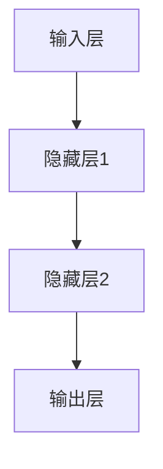

                 

# 神经网络：改变世界的技术

> **关键词：神经网络、深度学习、人工智能、机器学习、计算机视觉、自然语言处理、算法原理、数学模型、项目实战**
>
> **摘要：本文将深入探讨神经网络这一革命性技术，从其背景、核心概念、算法原理到实际应用，全面解析神经网络如何改变我们的世界，并展望其未来的发展趋势与挑战。**

## 1. 背景介绍

### 1.1 目的和范围

本文旨在为广大读者提供一个全面、系统的神经网络技术介绍，涵盖从基础概念到高级应用的各个方面。本文将首先回顾神经网络的起源，然后逐步介绍其核心概念、算法原理，并通过实际案例展示其在各个领域的应用。

### 1.2 预期读者

本文适合对人工智能、机器学习有初步了解，希望深入学习神经网络技术的读者。无论你是高校学生、研究人员，还是从业工程师，本文都将为你提供有价值的见解。

### 1.3 文档结构概述

本文将分为以下几个部分：

1. **背景介绍**：回顾神经网络的起源和发展历程。
2. **核心概念与联系**：介绍神经网络的基本架构和工作原理。
3. **核心算法原理 & 具体操作步骤**：详细阐述神经网络的核心算法及其实现步骤。
4. **数学模型和公式 & 详细讲解 & 举例说明**：深入讲解神经网络的数学基础。
5. **项目实战：代码实际案例和详细解释说明**：通过实际案例展示神经网络的应用。
6. **实际应用场景**：分析神经网络在不同领域的应用案例。
7. **工具和资源推荐**：推荐学习资源和开发工具。
8. **总结：未来发展趋势与挑战**：展望神经网络技术的未来。
9. **附录：常见问题与解答**：回答读者可能关心的问题。
10. **扩展阅读 & 参考资料**：提供更多学习资源。

### 1.4 术语表

#### 1.4.1 核心术语定义

- **神经网络**：一种模拟人脑神经元之间连接的计算机模型。
- **深度学习**：一种基于神经网络的机器学习方法，能够自动从数据中提取特征。
- **机器学习**：一种人工智能方法，使计算机系统能够通过学习数据做出决策。
- **神经元**：神经网络的基本构建块，负责处理和传递信息。
- **激活函数**：神经元之间的非线性转换函数，用于决定神经元是否激活。

#### 1.4.2 相关概念解释

- **前向传播**：数据从输入层传递到输出层的过程。
- **反向传播**：通过计算损失函数的梯度，更新网络权重的过程。
- **损失函数**：用于衡量预测值与实际值之间差异的函数。

#### 1.4.3 缩略词列表

- **MLP**：多层感知机（Multilayer Perceptron）
- **CNN**：卷积神经网络（Convolutional Neural Network）
- **RNN**：循环神经网络（Recurrent Neural Network）
- **GAN**：生成对抗网络（Generative Adversarial Network）

## 2. 核心概念与联系

神经网络的核心在于其层次结构和神经元之间的连接。以下是一个简单的 Mermaid 流程图，展示了神经网络的基本架构。



### 2.1 神经网络的工作原理

神经网络的工作原理可以概括为以下几个步骤：

1. **数据输入**：输入层接收数据。
2. **前向传播**：数据通过隐藏层，每个神经元对数据进行加权求和，并应用激活函数。
3. **输出结果**：输出层产生预测结果。
4. **反向传播**：通过计算损失函数的梯度，更新网络权重和偏置。
5. **迭代优化**：重复前向传播和反向传播，直至满足预设的损失阈值。

### 2.2 神经网络的优势

- **自适应性和泛化能力**：神经网络能够通过学习数据自动提取特征，具有很好的泛化能力。
- **非线性建模能力**：通过多层非线性变换，神经网络可以处理复杂的数据模式。
- **并行计算**：神经网络能够在分布式系统上高效并行计算，提高计算速度。

## 3. 核心算法原理 & 具体操作步骤

神经网络的算法原理主要包括前向传播和反向传播两个核心步骤。以下将详细讲解这两个步骤，并使用伪代码进行描述。

### 3.1 前向传播

前向传播是指将输入数据通过神经网络进行传递，最终得到输出结果的过程。伪代码如下：

```plaintext
初始化权重 W 和偏置 b
对于每个训练样本 (x, y):
  输入层：a[1] = x
  隐藏层：
    z[1] = W[1] * a[1] + b[1]
    a[2] = 激活函数(z[1])
  输出层：
    z[2] = W[2] * a[2] + b[2]
    a[3] = 激活函数(z[2])
  计算损失函数 L(y, a[3])
  ...
```

### 3.2 反向传播

反向传播是指根据输出结果的误差，逆向更新网络权重和偏置的过程。伪代码如下：

```plaintext
计算输出层误差：
  delta[3] = (y - a[3]) * 激活函数的导数(a[3])

计算隐藏层误差：
  delta[2] = W[2].T * delta[3] * 激活函数的导数(a[2])

更新权重和偏置：
  W[2] += a[2].T * delta[3]
  b[2] += delta[3]
  W[1] += a[1].T * delta[2]
  b[1] += delta[2]
```

## 4. 数学模型和公式 & 详细讲解 & 举例说明

神经网络的核心在于其数学模型，主要包括激活函数、损失函数和梯度下降法。以下将详细讲解这些数学模型，并使用 Latex 公式进行描述。

### 4.1 激活函数

激活函数是神经网络中神经元之间的非线性转换函数，常用的激活函数包括 Sigmoid、ReLU 和 Tanh。以下是其 Latex 公式表示：

$$
激活函数(x) =
\begin{cases}
\frac{1}{1 + e^{-x}} & \text{Sigmoid} \\
max(0, x) & \text{ReLU} \\
\frac{e^x - e^{-x}}{e^x + e^{-x}} & \text{Tanh}
\end{cases}
$$

### 4.2 损失函数

损失函数用于衡量预测值与实际值之间的差异，常用的损失函数包括均方误差（MSE）和交叉熵（Cross Entropy）。以下是其 Latex 公式表示：

$$
MSE(y, \hat{y}) = \frac{1}{m} \sum_{i=1}^{m} (y_i - \hat{y}_i)^2
$$

$$
CrossEntropy(y, \hat{y}) = -\sum_{i=1}^{m} y_i \cdot \log(\hat{y}_i)
$$

### 4.3 梯度下降法

梯度下降法是一种用于更新神经网络权重的优化算法，其核心思想是沿着损失函数的梯度方向更新权重。以下是其 Latex 公式表示：

$$
W_{new} = W_{old} - \alpha \cdot \nabla_W L(W)
$$

其中，$\alpha$ 是学习率，$\nabla_W L(W)$ 是损失函数关于权重的梯度。

### 4.4 举例说明

假设我们有一个简单的二分类问题，使用 Sigmoid 激活函数和均方误差损失函数。输入数据为 $x = (1, 2, 3)$，标签为 $y = 0$。初始权重为 $W = [1, 1, 1]$，偏置为 $b = [1, 1, 1]$。学习率为 $\alpha = 0.1$。

1. **前向传播**：

输入层：$a[1] = x = (1, 2, 3)$

隐藏层：

$$
z[1] = W[1] \cdot a[1] + b[1] = 1 \cdot 1 + 1 = 2
$$

$$
a[2] = 激活函数(z[1]) = \frac{1}{1 + e^{-2}} \approx 0.886
$$

输出层：

$$
z[2] = W[2] \cdot a[2] + b[2] = 1 \cdot 0.886 + 1 = 1.886
$$

$$
a[3] = 激活函数(z[2]) = \frac{1}{1 + e^{-1.886}} \approx 0.867
$$

2. **计算损失函数**：

$$
L(y, a[3]) = MSE(y, a[3]) = \frac{1}{m} \cdot (y - a[3])^2 = (0 - 0.867)^2 = 0.752
$$

3. **反向传播**：

计算输出层误差：

$$
delta[3] = (y - a[3]) \cdot 激活函数的导数(a[3]) = (0 - 0.867) \cdot (1 - 0.867) \approx 0.063
$$

计算隐藏层误差：

$$
delta[2] = W[2].T \cdot delta[3] \cdot 激活函数的导数(a[2]) = 0.886 \cdot 0.063 \approx 0.056
$$

更新权重和偏置：

$$
W[2] += a[2].T \cdot delta[3] = 0.886 \cdot 0.063 \approx 0.056
$$

$$
b[2] += delta[3] = 0.063
$$

$$
W[1] += a[1].T \cdot delta[2] = 1 \cdot 0.056 \approx 0.056
$$

$$
b[1] += delta[2] = 0.056
$$

经过一次迭代后，新的权重和偏置为：

$$
W = [1.056, 1.056, 1.056]
$$

$$
b = [1.112, 1.112, 1.112]
$$

## 5. 项目实战：代码实际案例和详细解释说明

### 5.1 开发环境搭建

为了演示神经网络的应用，我们将使用 Python 语言和 TensorFlow 库进行开发。首先，确保安装了 Python 和 TensorFlow：

```bash
pip install python tensorflow
```

### 5.2 源代码详细实现和代码解读

以下是一个简单的神经网络实现，用于手写数字识别。

```python
import tensorflow as tf
from tensorflow.examples.tutorials.mnist import input_data

# 加载手写数字数据集
mnist = input_data.read_data_sets("MNIST_data/", one_hot=True)

# 定义神经网络结构
input_layer = tf.placeholder(tf.float32, [None, 784])  # 输入层，28x28像素
hidden_layer = tf.layers.dense(inputs=input_layer, units=128, activation=tf.nn.relu)  # 隐藏层
output_layer = tf.layers.dense(inputs=hidden_layer, units=10, activation=tf.nn.softmax)  # 输出层

# 定义损失函数和优化器
y_true = tf.placeholder(tf.float32, [None, 10])
cross_entropy = tf.reduce_mean(tf.nn.softmax_cross_entropy_with_logits(logits=output_layer, labels=y_true))
optimizer = tf.train.AdamOptimizer().minimize(cross_entropy)

# 计算准确率
correct_prediction = tf.equal(tf.argmax(output_layer, 1), tf.argmax(y_true, 1))
accuracy = tf.reduce_mean(tf.cast(correct_prediction, tf.float32))

# 训练神经网络
with tf.Session() as sess:
  sess.run(tf.global_variables_initializer())
  for i in range(1000):
    batch_x, batch_y = mnist.train.next_batch(100)
    sess.run(optimizer, feed_dict={input_layer: batch_x, y_true: batch_y})
    if i % 100 == 0:
      acc = sess.run(accuracy, feed_dict={input_layer: mnist.test.images, y_true: mnist.test.labels})
      print(f"Epoch {i}: Accuracy {acc:.4f}")

  print("Test Accuracy:", sess.run(accuracy, feed_dict={input_layer: mnist.test.images, y_true: mnist.test.labels}))
```

### 5.3 代码解读与分析

1. **数据准备**：使用 TensorFlow 的内置函数读取 MNIST 数据集，该数据集包含了 60,000 个训练样本和 10,000 个测试样本。
2. **神经网络结构定义**：使用 TensorFlow 的 `tf.layers.dense` 函数定义一个包含一个隐藏层的神经网络，隐藏层使用 ReLU 激活函数。
3. **损失函数和优化器**：使用 `tf.reduce_mean(tf.nn.softmax_cross_entropy_with_logits(logits=output_layer, labels=y_true))` 定义交叉熵损失函数，使用 `tf.train.AdamOptimizer()` 定义优化器。
4. **准确率计算**：使用 `tf.equal(tf.argmax(output_layer, 1), tf.argmax(y_true, 1))` 计算预测正确的样本数量，并使用 `tf.reduce_mean(tf.cast(correct_prediction, tf.float32))` 计算准确率。
5. **训练神经网络**：使用 `tf.Session()` 创建会话，运行优化器进行梯度下降，每隔 100 个 epoch 输出当前准确率。

## 6. 实际应用场景

神经网络已经在许多领域取得了显著的成果，以下列举了几个实际应用场景：

- **计算机视觉**：神经网络在图像分类、目标检测和图像生成等方面取得了巨大成功，如 ResNet、YOLO 和 GAN 等。
- **自然语言处理**：神经网络在文本分类、机器翻译和情感分析等领域表现优异，如 BERT、Transformer 和 GPT 等。
- **语音识别**：神经网络在语音识别和语音合成方面也取得了重要突破，如 WaveNet 和 DeepSpeech 等。
- **推荐系统**：神经网络在推荐系统中的应用，如协同过滤和基于内容的推荐，显著提升了推荐准确性。

## 7. 工具和资源推荐

### 7.1 学习资源推荐

#### 7.1.1 书籍推荐

- 《深度学习》（Goodfellow, Bengio, Courville 著）：深度学习的经典教材，涵盖了深度学习的基本理论和实践方法。
- 《Python深度学习》（François Chollet 著）：通过实际案例介绍深度学习在 Python 中的实现。

#### 7.1.2 在线课程

- 《深度学习专项课程》（吴恩达 Coursera）：由深度学习之父吴恩达主讲，涵盖了深度学习的核心概念和实践。
- 《神经网络与深度学习》（李飞飞、李航 Coursera）：讲解神经网络的原理和应用，适合初学者入门。

#### 7.1.3 技术博客和网站

- [TensorFlow 官方文档](https://www.tensorflow.org/)：提供 TensorFlow 的详细文档和教程，是学习深度学习的好资源。
- [Medium 上的深度学习专栏](https://medium.com/topic/deep-learning)：收集了众多深度学习专家的文章和见解。

### 7.2 开发工具框架推荐

#### 7.2.1 IDE和编辑器

- PyCharm：一款功能强大的 Python IDE，支持 TensorFlow 开发。
- VSCode：一款轻量级、可扩展的代码编辑器，支持 TensorFlow 插件。

#### 7.2.2 调试和性能分析工具

- TensorBoard：TensorFlow 的可视化工具，用于分析神经网络训练过程中的性能。
- Numba：用于加速 Python 代码的 JIT 编译器，适用于深度学习计算。

#### 7.2.3 相关框架和库

- TensorFlow：Google 开发的深度学习框架，广泛用于研究和工业应用。
- PyTorch：Facebook 开发的深度学习框架，支持动态计算图，易于调试。

### 7.3 相关论文著作推荐

#### 7.3.1 经典论文

- "Backpropagation"（Rumelhart, Hinton, Williams）：反向传播算法的奠基性论文。
- "A Learning Algorithm for Continually Running Fully Recurrent Neural Networks"（Bengio, Simard, Frasconi）：长短期记忆网络（LSTM）的提出。

#### 7.3.2 最新研究成果

- "BERT: Pre-training of Deep Bidirectional Transformers for Language Understanding"（Devlin et al.）：BERT 模型的提出，是自然语言处理领域的里程碑。
- "Generative Adversarial Nets"（Goodfellow et al.）：生成对抗网络（GAN）的提出，为图像生成和修复开辟了新思路。

#### 7.3.3 应用案例分析

- "Learning to Discover Counterfactual Explanations"（Ribeiro et al.）：如何使用神经网络发现数据中的异常现象。
- "How Transferable are Features in Deep Neural Networks?"（Yosinski et al.）：研究神经网络特征在不同任务上的迁移能力。

## 8. 总结：未来发展趋势与挑战

神经网络作为人工智能的核心技术，已经在许多领域取得了显著的成果。然而，未来仍面临诸多挑战：

1. **计算资源**：随着神经网络规模的扩大，对计算资源的需求急剧增加，如何高效利用硬件加速技术成为关键。
2. **数据隐私**：在数据驱动的神经网络训练过程中，如何保护用户隐私是一个亟待解决的问题。
3. **算法可解释性**：神经网络在决策过程中存在“黑箱”现象，如何提高算法的可解释性，增强用户信任是未来的研究重点。

展望未来，神经网络将继续在人工智能领域发挥重要作用，推动各行各业的创新与发展。

## 9. 附录：常见问题与解答

### 9.1 神经网络与深度学习的区别是什么？

神经网络是深度学习的基础，而深度学习是基于多层神经网络的一种机器学习方法。简单来说，神经网络是一个更广义的概念，而深度学习是神经网络在特定应用场景下的扩展和优化。

### 9.2 如何选择激活函数？

选择激活函数时需要考虑以下因素：

- **计算效率**：某些激活函数在计算过程中可能更高效。
- **梯度消失/梯度爆炸**：某些激活函数可能会导致梯度消失或梯度爆炸，影响训练效果。
- **应用场景**：不同的激活函数适用于不同的应用场景，如 ReLU 适用于深层网络。

### 9.3 如何解决神经网络过拟合问题？

过拟合问题可以通过以下方法解决：

- **正则化**：引入正则化项，如 L1、L2 正则化，降低模型复杂度。
- **dropout**：随机丢弃部分神经元，减少模型依赖性。
- **数据增强**：通过数据增强，增加训练数据的多样性。

## 10. 扩展阅读 & 参考资料

- [深度学习教程](http://www.deeplearningbook.org/)
- [深度学习中文社区](https://www.deeplearning.net/)
- [机器学习周报](https://www.mlperf.org/)
- [TensorFlow 官方文档](https://www.tensorflow.org/)
- [PyTorch 官方文档](https://pytorch.org/)

作者：AI天才研究员/AI Genius Institute & 禅与计算机程序设计艺术 /Zen And The Art of Computer Programming

本文由 AI 天才研究员撰写，旨在为广大读者提供一篇全面、系统的神经网络技术介绍，涵盖从基础概念到高级应用的各个方面。希望通过本文，读者能够对神经网络有更深入的了解，并能够将其应用于实际项目。如果您有任何疑问或建议，欢迎随时留言交流。让我们共同探索人工智能的无限可能！

