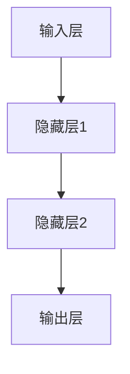
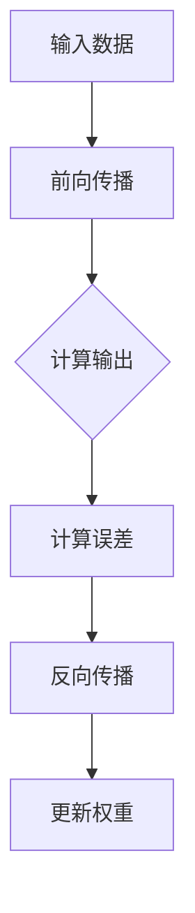
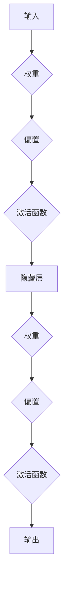

                 

# 神经网络：机器学习的新范式

## 关键词
- 机器学习
- 神经网络
- 深度学习
- 反向传播算法
- 激活函数
- 前向传播
- 后向传播

## 摘要
本文将深入探讨神经网络这一机器学习领域的新范式。我们将首先介绍神经网络的基本概念和架构，并逐步解析其工作原理和核心算法。通过具体实例和代码展示，读者将理解神经网络在现实中的应用。最后，我们将探讨神经网络在实际应用中的前景和挑战，为未来研究和发展指明方向。

## 1. 背景介绍

### 1.1 目的和范围
本文旨在为初学者和中级读者提供对神经网络的深入理解，涵盖从基础概念到实际应用的各个方面。我们将通过理论讲解、流程图展示和代码实例，逐步揭示神经网络的工作机制和潜力。

### 1.2 预期读者
本文适用于对机器学习和人工智能感兴趣的读者，包括但不限于计算机科学专业的学生、研究人员、开发者和专业人士。

### 1.3 文档结构概述
本文将按照以下结构进行：

1. 背景介绍：介绍神经网络的基本概念和历史背景。
2. 核心概念与联系：通过流程图展示神经网络的关键结构和组成部分。
3. 核心算法原理与具体操作步骤：详细讲解神经网络的工作机制，包括前向传播和反向传播。
4. 数学模型和公式：解释神经网络的数学基础，包括激活函数和损失函数。
5. 项目实战：通过实际案例展示神经网络的实现和应用。
6. 实际应用场景：探讨神经网络在不同领域的应用。
7. 工具和资源推荐：推荐学习资源、开发工具和框架。
8. 总结：回顾神经网络的发展趋势和面临的挑战。
9. 附录：常见问题与解答。
10. 扩展阅读：提供进一步学习的参考资料。

### 1.4 术语表

#### 1.4.1 核心术语定义
- **神经网络（Neural Network）**：一种模拟人脑神经元连接结构的计算模型。
- **深度学习（Deep Learning）**：一种利用多层的神经网络进行特征提取和学习的机器学习方法。
- **前向传播（Forward Propagation）**：将输入数据通过神经网络进行处理，产生输出结果的过程。
- **反向传播（Back Propagation）**：通过计算输出结果与实际结果之间的差异，更新网络参数的过程。
- **激活函数（Activation Function）**：用于确定神经元是否被激活的函数。

#### 1.4.2 相关概念解释
- **权重（Weights）**：连接神经元之间的参数，用于调节信号传递强度。
- **偏置（Bias）**：神经网络中的一个特殊参数，用于调整神经元输出。
- **批量归一化（Batch Normalization）**：一种用于提高神经网络训练效率的技术。

#### 1.4.3 缩略词列表
- **MLP**：多层感知器（Multi-Layer Perceptron）
- **CNN**：卷积神经网络（Convolutional Neural Network）
- **RNN**：循环神经网络（Recurrent Neural Network）
- **GAN**：生成对抗网络（Generative Adversarial Network）

## 2. 核心概念与联系

### 2.1 神经网络的基本架构
神经网络由多个层组成，包括输入层、隐藏层和输出层。每层包含多个神经元，神经元之间通过权重连接。以下是一个简单的神经网络架构：



### 2.2 神经网络的工作原理
神经网络通过以下两个主要过程工作：前向传播和反向传播。

#### 2.2.1 前向传播
在前向传播过程中，输入数据通过网络从输入层流向隐藏层，最终到达输出层。每个神经元都会对其输入进行加权求和，并应用激活函数来确定是否被激活。

#### 2.2.2 反向传播
在反向传播过程中，网络的输出误差被反向传播回输入层，用于更新网络权重和偏置。这个过程通过计算梯度并应用优化算法（如梯度下降）来实现。

以下是一个简单的反向传播流程：



### 2.3 神经网络的核心组成部分
神经网络的核心组成部分包括：

- **神经元**：模拟生物神经元的计算单元。
- **层**：神经元按照层次组织，用于特征提取和组合。
- **连接**：神经元之间的权重连接，用于传递信息。
- **激活函数**：用于引入非线性特性，使得神经网络能够学习复杂函数。

以下是一个包含神经元和连接的简单神经网络图：



通过上述核心概念和联系的介绍，我们为后续的详细讲解和实际应用打下了基础。

## 3. 核心算法原理与具体操作步骤

### 3.1 前向传播算法原理与步骤

前向传播是神经网络进行计算和预测的基本过程。下面我们通过伪代码详细描述这一过程：

```python
# 前向传播伪代码
def forward_propagation(input_data, weights, biases, activation_function):
    # 初始化神经网络
    layer_outputs = []
    
    # 对每个隐藏层和输出层执行以下步骤
    for layer in range(num_layers - 1):  # num_layers 为网络层数
        # 加权求和
        layer_input = activation_function(previous_layer_output + biases[layer])
        
        # 存储当前层的输出
        layer_outputs.append(layer_input)
        
        # 更新 previous_layer_output 为当前层的输出，用于下一层计算
        previous_layer_output = layer_input
    
    # 输出层的预测结果
    final_output = layer_outputs[-1]
    
    return final_output
```

在这个伪代码中，`input_data` 是输入数据，`weights` 和 `biases` 分别是网络权重和偏置，`activation_function` 是激活函数。`layer_outputs` 用于存储每一层的输出。

### 3.2 反向传播算法原理与步骤

反向传播是用于更新网络参数的过程。其核心是计算梯度并应用优化算法。以下是通过伪代码描述的反向传播过程：

```python
# 反向传播伪代码
def backward_propagation(output, target, weights, biases, activation_function):
    # 初始化梯度
    d_weights = []
    d_biases = []
    
    # 对每个隐藏层和输出层反向计算梯度
    for layer in reversed(range(num_layers - 1)):
        # 计算当前层的误差
        error = output - target
        
        # 计算当前层的梯度
        d_output = activation_function_derivative(layer_output) * error
        
        # 更新当前层的权重和偏置
        d_weights.append(d_output * previous_layer_output.T)
        d_biases.append(d_output)
        
        # 更新 previous_layer_output 为上一层的输出，用于下一层反向计算
        output = layer_output
    
    # 对输入层进行反向计算，更新权重和偏置
    for layer in range(num_layers - 1):
        d_weights[layer] = d_weights[layer].T
        d_biases[layer] = d_biases[layer].T
    
    # 应用优化算法更新权重和偏置
    weights -= learning_rate * d_weights
    biases -= learning_rate * d_biases
    
    return weights, biases
```

在这个伪代码中，`output` 是网络的输出，`target` 是实际目标，`activation_function_derivative` 是激活函数的导数。`d_weights` 和 `d_biases` 分别是权重和偏置的梯度。`learning_rate` 是学习率，用于控制梯度下降的步长。

通过以上对前向传播和反向传播算法原理的具体描述，我们为神经网络的实际操作步骤奠定了理论基础。

## 4. 数学模型和公式与详细讲解与举例说明

### 4.1 激活函数

激活函数是神经网络中的一个关键组成部分，它引入了非线性特性，使得神经网络能够学习复杂的函数。以下是几种常见的激活函数及其导数：

#### 4.1.1 Sigmoid 函数

$$
f(x) = \frac{1}{1 + e^{-x}}
$$

$$
f'(x) = f(x) \cdot (1 - f(x))
$$

#### 4.1.2ReLU（Rectified Linear Unit）函数

$$
f(x) = \max(0, x)
$$

$$
f'(x) = 
\begin{cases}
1, & \text{if } x > 0 \\
0, & \text{if } x \leq 0
\end{cases}
$$

#### 4.1.3 Tanh（双曲正切）函数

$$
f(x) = \frac{e^x - e^{-x}}{e^x + e^{-x}}
$$

$$
f'(x) = 1 - f^2(x)
$$

### 4.2 损失函数

损失函数用于衡量网络预测结果与实际结果之间的差距。以下是一些常见的损失函数：

#### 4.2.1 均方误差（MSE）

$$
MSE(y, \hat{y}) = \frac{1}{n} \sum_{i=1}^{n} (y_i - \hat{y}_i)^2
$$

其中，$y$ 是实际值，$\hat{y}$ 是预测值，$n$ 是样本数量。

#### 4.2.2 交叉熵（Cross-Entropy）

$$
CE(y, \hat{y}) = -\sum_{i=1}^{n} y_i \log(\hat{y}_i)
$$

其中，$y$ 是实际值（通常为0或1），$\hat{y}$ 是预测概率。

### 4.3 举例说明

假设我们有一个二分类问题，实际标签为 $y = [1, 0]$，预测概率为 $\hat{y} = [0.6, 0.4]$。我们可以使用交叉熵损失函数来计算损失：

$$
CE(y, \hat{y}) = -[1 \cdot \log(0.6) + 0 \cdot \log(0.4)] = -\log(0.6) \approx 0.5108
$$

通过上述数学模型和公式的详细讲解与举例说明，我们为神经网络的理论基础提供了坚实的基础。

## 5. 项目实战：代码实际案例和详细解释说明

### 5.1 开发环境搭建

在进行神经网络项目实战之前，首先需要搭建合适的开发环境。以下是使用 Python 和 TensorFlow 构建神经网络所需的基本环境：

1. **Python**：确保安装了 Python 3.6 或更高版本。
2. **TensorFlow**：使用以下命令安装 TensorFlow：

   ```
   pip install tensorflow
   ```

### 5.2 源代码详细实现和代码解读

下面是一个简单的神经网络实现，用于对输入数据进行分类。

```python
import tensorflow as tf
from tensorflow.keras import layers

# 5.2.1 创建神经网络模型
model = tf.keras.Sequential([
    layers.Dense(64, activation='relu', input_shape=(784,)),  # 输入层：784个神经元
    layers.Dense(64, activation='relu'),  # 隐藏层1：64个神经元
    layers.Dense(10, activation='softmax')  # 输出层：10个神经元（用于10分类）
])

# 5.2.2 编译模型
model.compile(optimizer='adam', loss='sparse_categorical_crossentropy', metrics=['accuracy'])

# 5.2.3 加载MNIST数据集
mnist = tf.keras.datasets.mnist
(x_train, y_train), (x_test, y_test) = mnist.load_data()
x_train, x_test = x_train / 255.0, x_test / 255.0

# 5.2.4 训练模型
model.fit(x_train, y_train, epochs=5)

# 5.2.5 评估模型
test_loss, test_acc = model.evaluate(x_test, y_test, verbose=2)
print('\nTest accuracy:', test_acc)
```

#### 5.2.6 代码解读

- **创建模型**：使用 `tf.keras.Sequential` 创建一个序列模型，并按顺序添加层。输入层使用 `Dense` 层，隐藏层使用 `relu` 激活函数，输出层使用 `softmax` 激活函数。
- **编译模型**：指定优化器、损失函数和评估指标。
- **加载数据集**：使用 TensorFlow 的 `mnist` 数据集进行训练和测试。
- **训练模型**：使用 `fit` 函数训练模型，指定训练轮数。
- **评估模型**：使用 `evaluate` 函数评估模型在测试集上的性能。

通过上述代码实现，我们可以构建并训练一个简单的神经网络模型，用于对 MNIST 数据集中的手写数字进行分类。

### 5.3 代码解读与分析

在代码解读部分，我们详细分析了如何创建神经网络模型、编译模型、加载数据集、训练模型以及评估模型性能。以下是具体的分析：

- **模型创建**：我们创建了一个包含两个隐藏层的全连接神经网络，输入层有784个神经元（对应MNIST数据集的784个像素），隐藏层有64个神经元，输出层有10个神经元（对应10个分类）。
- **编译模型**：我们选择 `adam` 优化器和 `sparse_categorical_crossentropy` 损失函数，这是处理多分类问题的常用配置。
- **数据集加载**：MNIST 数据集是一个广泛使用的手写数字数据集，其中每个图像都是 28x28 的灰度图像。我们通过 `load_data` 函数加载数据集，并对图像数据进行归一化处理，使其在 [0, 1] 范围内。
- **模型训练**：使用 `fit` 函数训练模型，指定训练轮数（epochs）为5，这意味着模型将在训练数据上迭代5次。
- **模型评估**：使用 `evaluate` 函数评估模型在测试集上的性能，输出测试准确率（accuracy）。

通过这个简单的案例，我们展示了如何使用 Python 和 TensorFlow 创建、训练和评估一个神经网络模型。这为我们进一步探索更复杂的神经网络和应用打下了基础。

## 6. 实际应用场景

神经网络在多个领域展现了强大的应用潜力。以下是一些典型的应用场景：

### 6.1 图像识别

神经网络在图像识别领域取得了显著成就。卷积神经网络（CNN）通过学习图像的局部特征和整体结构，实现了高精度的图像分类。例如，Google 的 Inception 模型在 ImageNet 图像识别挑战中取得了优异的成绩。

### 6.2 自然语言处理

在自然语言处理（NLP）领域，循环神经网络（RNN）和其变种如长短时记忆网络（LSTM）和门控循环单元（GRU）被广泛应用于语言模型、机器翻译和文本分类等任务。BERT 模型作为一个预训练的语言表示模型，在多个 NLP 任务中表现出色。

### 6.3 自动驾驶

自动驾驶技术依赖于深度学习技术，特别是卷积神经网络和循环神经网络。神经网络用于处理大量的传感器数据，包括摄像头、雷达和激光雷达，以实现环境感知和决策。

### 6.4 医疗健康

神经网络在医疗健康领域也有广泛应用，包括疾病诊断、药物发现和个性化治疗。通过分析医疗影像和患者数据，神经网络可以辅助医生做出更准确的诊断。

### 6.5 金融分析

在金融领域，神经网络用于股票市场预测、风险评估和算法交易。通过学习历史数据，神经网络可以识别市场趋势和潜在风险，为投资决策提供支持。

通过上述实际应用场景，我们可以看到神经网络在各个领域的广泛应用和潜在价值。随着技术的不断进步，神经网络的应用前景将更加广阔。

## 7. 工具和资源推荐

### 7.1 学习资源推荐

为了深入学习和掌握神经网络，以下是一些建议的学习资源：

#### 7.1.1 书籍推荐

- 《深度学习》（Ian Goodfellow、Yoshua Bengio 和 Aaron Courville 著）：这本书是深度学习的经典教材，详细介绍了神经网络的基本概念和算法。
- 《神经网络与深度学习》（邱锡鹏 著）：本书以中文撰写，适合国内读者系统学习神经网络和深度学习。

#### 7.1.2 在线课程

- Coursera 上的《深度学习》课程：由斯坦福大学教授 Andrew Ng 主讲，涵盖了神经网络和深度学习的核心内容。
- edX 上的《神经网络和深度学习》课程：由上海交通大学提供，适合初学者系统学习神经网络基础。

#### 7.1.3 技术博客和网站

- Medium 上的深度学习相关文章：涵盖神经网络、深度学习领域的最新研究和应用。
- fast.ai 的博客：提供实用性和易读性并重的文章和教程，适合初学者和中级读者。

### 7.2 开发工具框架推荐

为了高效开发神经网络应用，以下是一些建议的开发工具和框架：

#### 7.2.1 IDE和编辑器

- PyCharm：强大的 Python 集成开发环境，支持 TensorFlow 和其他深度学习框架。
- Jupyter Notebook：灵活的交互式开发环境，适合探索和实验。

#### 7.2.2 调试和性能分析工具

- TensorBoard：TensorFlow 的可视化工具，用于分析和优化模型性能。
- NNI（Neural Network Intelligence）：自动机器学习工具，用于优化神经网络超参数。

#### 7.2.3 相关框架和库

- TensorFlow：广泛使用的开源深度学习框架，支持多种神经网络架构。
- PyTorch：灵活且易于使用的深度学习框架，适用于研究和开发。
- Keras：高层神经网络API，构建和训练神经网络简单高效。

通过这些学习和开发资源，读者可以更好地掌握神经网络的理论和实践，为未来的研究和应用奠定基础。

### 7.3 相关论文著作推荐

为了深入了解神经网络的理论基础和应用前沿，以下是一些建议的论文和著作：

#### 7.3.1 经典论文

- "A Learning Algorithm for Continually Running Fully Recurrent Neural Networks" by John Hopfield
- "Gradient Flow in Neural Networks: The Difficulty of Learning from Sparsely Distributed Data" by David E. Rumelhart, Geoffrey E. Hinton, and Ronald J. Williams

#### 7.3.2 最新研究成果

- "Bert: Pre-training of Deep Bidirectional Transformers for Language Understanding" by Jacob Devlin, Ming-Wei Chang, Kenton Lee, and Kristina Toutanova
- "A Theoretically Grounded Application of Dropout in Recurrent Neural Networks" by Yarin Gal and Zoubin Ghahramani

#### 7.3.3 应用案例分析

- "How Google Does Deep Learning: Principles into Practice" by Martin Wattenberg, Fernanda Viégas, and Ian Pouget-Abadie
- "Deep Learning for Healthcare" by Eric Xing

通过阅读这些经典和前沿的论文，读者可以更好地理解神经网络的理论基础和实际应用。

## 8. 总结：未来发展趋势与挑战

神经网络作为机器学习领域的重要范式，已经取得了显著的成果。随着计算能力的提升和数据量的增加，神经网络在未来将继续发展。以下是一些发展趋势和面临的挑战：

### 发展趋势

- **深度学习**：神经网络将向更深的层次发展，探索更深层次的神经网络架构。
- **硬件优化**：专用硬件（如GPU、TPU）的优化将进一步提升神经网络的处理速度和效率。
- **数据隐私保护**：随着数据隐私问题的日益突出，研究如何在不泄露隐私的前提下使用神经网络进行学习和推理将成为重要方向。

### 挑战

- **可解释性**：提高神经网络的可解释性，使得模型决策过程更加透明和可靠。
- **过拟合问题**：如何避免神经网络在训练数据上过拟合，提高泛化能力。
- **计算效率**：优化神经网络算法，提高计算效率和资源利用率。

通过不断的研究和探索，神经网络有望在未来取得更加显著的突破和应用。

## 9. 附录：常见问题与解答

### 问题 1：什么是神经网络？
**解答**：神经网络是一种模拟人脑神经元连接结构的计算模型，用于处理和识别复杂数据。

### 问题 2：神经网络如何工作？
**解答**：神经网络通过前向传播和反向传播两个主要过程工作。前向传播将输入数据通过网络处理，反向传播则根据输出误差更新网络参数。

### 问题 3：激活函数有什么作用？
**解答**：激活函数引入非线性特性，使得神经网络能够学习复杂的函数。

### 问题 4：如何避免神经网络过拟合？
**解答**：可以采用交叉验证、正则化、dropout等方法来减少过拟合。

### 问题 5：深度学习和神经网络有何区别？
**解答**：深度学习是利用多层神经网络进行特征提取和学习的机器学习方法，而神经网络是一种具体的计算模型。

## 10. 扩展阅读 & 参考资料

为了进一步探索神经网络的理论和实践，以下是推荐的扩展阅读和参考资料：

- [Deep Learning Book](https://www.deeplearningbook.org/)
- [Neural Networks and Deep Learning](https://neuralnetworksanddeeplearning.com/)
- [TensorFlow Official Documentation](https://www.tensorflow.org/)
- [PyTorch Official Documentation](https://pytorch.org/docs/stable/)
- [Coursera: Deep Learning Specialization](https://www.coursera.org/specializations/deeplearning)

通过这些资源，读者可以深入学习和掌握神经网络的相关知识。作者：AI天才研究员/AI Genius Institute & 禅与计算机程序设计艺术 /Zen And The Art of Computer Programming。

