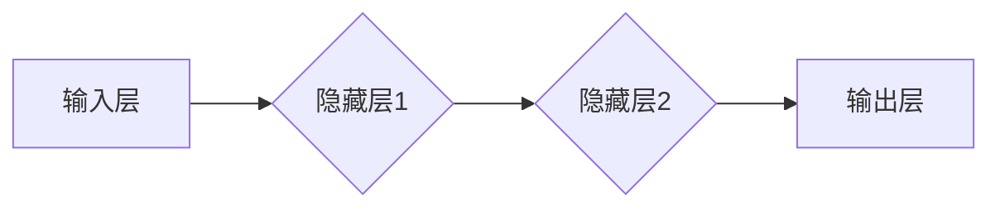

                 

# 神经网络：机器学习的新范式

> **关键词：**神经网络、机器学习、深度学习、反向传播、激活函数、前向传播、参数优化、人工神经网络架构、应用实例。

> **摘要：**本文旨在深入探讨神经网络这一机器学习领域的新兴技术。我们将从背景介绍开始，逐步解析神经网络的原理、核心算法和数学模型，并展示如何在实际项目中应用这些技术。最后，我们将讨论神经网络在未来的发展趋势和面临的挑战。通过本文的阅读，读者将能够全面了解神经网络的工作原理和其在各个领域的广泛应用。

## 1. 背景介绍

### 1.1 目的和范围

本文旨在为对机器学习感兴趣的读者提供一份全面的神经网络教程。我们将深入探讨神经网络的历史背景、基本概念、核心算法原理以及其在现实世界中的应用。文章将涵盖从基本概念到高级应用的各个方面，旨在帮助读者全面理解神经网络的工作原理和如何在实际项目中应用。

### 1.2 预期读者

本文适合对机器学习有初步了解，希望深入了解神经网络技术的读者。特别是计算机科学、人工智能、数据分析等相关领域的专业人员和研究人员。同时，对神经网络技术感兴趣的学生和爱好者也将从本文中获得丰富的知识。

### 1.3 文档结构概述

本文将按照以下结构展开：

1. **背景介绍**：介绍神经网络的基本概念和背景。
2. **核心概念与联系**：详细讲解神经网络的架构和核心概念。
3. **核心算法原理与具体操作步骤**：阐述神经网络的核心算法原理，包括前向传播和反向传播。
4. **数学模型和公式**：介绍神经网络中的数学模型和公式，并进行举例说明。
5. **项目实战**：通过实际代码案例展示神经网络的应用。
6. **实际应用场景**：探讨神经网络在不同领域的应用。
7. **工具和资源推荐**：推荐学习资源、开发工具和论文。
8. **总结**：讨论神经网络的发展趋势和面临的挑战。
9. **附录**：常见问题与解答。
10. **扩展阅读**：提供进一步的学习资源。

### 1.4 术语表

#### 1.4.1 核心术语定义

- **神经网络**：一种通过模拟人脑神经元连接方式的计算模型。
- **神经元**：神经网络的基本计算单元，负责接收输入、计算输出。
- **激活函数**：用于定义神经元是否被激活的函数。
- **前向传播**：将输入数据通过神经网络进行传递，计算输出。
- **反向传播**：根据输出误差，反向更新网络权重和偏置。
- **深度学习**：多层神经网络的机器学习方法。
- **权重**：神经元之间的连接强度，可调整以优化网络性能。
- **偏置**：神经元的内部偏置项，也可调整。

#### 1.4.2 相关概念解释

- **多层感知器（MLP）**：一种常见的前馈神经网络，具有输入层、隐藏层和输出层。
- **反向传播算法**：一种用于训练神经网络的优化算法，通过计算误差梯度来更新网络权重和偏置。
- **梯度下降**：一种优化算法，通过调整参数以最小化损失函数。
- **损失函数**：用于衡量预测值和真实值之间的差异的函数。

#### 1.4.3 缩略词列表

- **CNN**：卷积神经网络（Convolutional Neural Network）
- **RNN**：循环神经网络（Recurrent Neural Network）
- **DNN**：深度神经网络（Deep Neural Network）
- **GAN**：生成对抗网络（Generative Adversarial Network）

## 2. 核心概念与联系

在深入探讨神经网络之前，我们首先需要了解其核心概念和架构。神经网络是一种由大量相互连接的简单计算单元（神经元）组成的复杂计算模型。这些神经元通过模拟人脑神经元的连接方式，实现了对复杂数据的处理和分析。

### 2.1 神经网络架构

神经网络的基本架构包括输入层、隐藏层和输出层。每个层由多个神经元组成，神经元之间通过权重进行连接。输入层接收外部数据，隐藏层进行数据的处理和变换，输出层产生最终的输出。

以下是一个简单的神经网络架构的 Mermaid 流程图：



### 2.2 核心概念

#### 2.2.1 神经元

神经元是神经网络的基本计算单元。一个神经元接收多个输入信号，通过加权求和后，应用激活函数得到输出信号。其计算过程可以用以下伪代码表示：

```python
def neuron(input_data, weights, bias, activation_function):
    z = sum(input_data[i] * weights[i] for i in range(len(input_data))) + bias
    output = activation_function(z)
    return output
```

#### 2.2.2 激活函数

激活函数是神经元的一个重要组成部分，用于确定神经元是否被激活。常见的激活函数包括 sigmoid 函数、ReLU 函数和 tanh 函数等。

- **sigmoid 函数**：将输入映射到 (0, 1) 范围内的函数。
  $$ \sigma(x) = \frac{1}{1 + e^{-x}} $$
  
- **ReLU 函数**：将输入大于0的部分映射到1，小于等于0的部分映射到0。
  $$ \text{ReLU}(x) = \max(0, x) $$

- **tanh 函数**：将输入映射到 (-1, 1) 范围内的函数。
  $$ \text{tanh}(x) = \frac{e^x - e^{-x}}{e^x + e^{-x}} $$

#### 2.2.3 前向传播

前向传播是指将输入数据通过神经网络进行传递，计算输出。具体步骤如下：

1. 将输入数据传递到输入层。
2. 每个输入层神经元将数据传递到隐藏层。
3. 隐藏层神经元计算加权求和并应用激活函数，得到输出。
4. 输出层神经元计算最终输出。

前向传播的伪代码如下：

```python
def forward_propagation(input_data, weights, biases, activation_functions):
    layer_outputs = [input_data]
    for layer in range(len(weights)):
        z = sum(input_data[i] * weights[i] for i in range(len(input_data))) + biases[layer]
        output = activation_function(z)
        layer_outputs.append(output)
    return layer_outputs[-1]
```

#### 2.2.4 反向传播

反向传播是一种用于训练神经网络的优化算法。其基本思想是计算输出误差，并利用误差梯度来更新网络权重和偏置。具体步骤如下：

1. 计算输出误差：损失函数通常选择均方误差（MSE）或交叉熵误差。
2. 反向传播误差：从输出层开始，逐层向前传播误差。
3. 更新权重和偏置：利用误差梯度来更新网络权重和偏置。

反向传播的伪代码如下：

```python
def backward_propagation(output, target, weights, biases, activation_gradients):
    error = output - target
    dweights = [error * activation_gradients[layer] for layer in range(len(weights))]
    dbiases = [error * activation_gradients[layer] for layer in range(len(biases))]
    return dweights, dbiases
```

## 3. 核心算法原理 & 具体操作步骤

在本节中，我们将深入探讨神经网络的两个核心算法原理：前向传播和反向传播。通过这两个算法，神经网络能够通过训练学习到数据中的模式和规律。

### 3.1 前向传播

前向传播是神经网络处理输入数据并生成预测结果的过程。具体步骤如下：

1. **初始化权重和偏置**：在训练开始前，需要随机初始化网络的权重和偏置。这些参数将在训练过程中通过优化算法进行调整。

2. **计算输入层到隐藏层的输出**：将输入数据传递到输入层，然后通过权重和偏置进行计算，得到隐藏层的输出。具体公式如下：
   $$ z^{(h)} = \sum_{i} x_i w_i^{(h)} + b^{(h)} $$
   其中，\( z^{(h)} \) 表示隐藏层的输出，\( x_i \) 表示输入层的第 \( i \) 个特征，\( w_i^{(h)} \) 表示输入层到隐藏层的权重，\( b^{(h)} \) 表示隐藏层的偏置。

3. **应用激活函数**：将隐藏层的输出传递到激活函数，得到隐藏层的激活值。常见的激活函数包括 sigmoid 函数、ReLU 函数和 tanh 函数等。

4. **计算隐藏层到输出层的输出**：将隐藏层的激活值传递到输出层，通过权重和偏置进行计算，得到输出层的输出。具体公式如下：
   $$ z^{(o)} = \sum_{h} a_h^{(h)} w_h^{(o)} + b^{(o)} $$
   其中，\( z^{(o)} \) 表示输出层的输出，\( a_h^{(h)} \) 表示隐藏层的激活值，\( w_h^{(o)} \) 表示隐藏层到输出层的权重，\( b^{(o)} \) 表示输出层的偏置。

5. **计算损失**：将输出层的输出与真实标签进行比较，计算损失函数的值。常见的损失函数包括均方误差（MSE）和交叉熵误差等。

### 3.2 反向传播

反向传播是神经网络通过损失函数评估模型性能，并更新权重和偏置的过程。具体步骤如下：

1. **计算输出层的误差**：计算输出层的误差，即预测值与真实值之间的差异。具体公式如下：
   $$ \delta^{(o)} = \frac{\partial}{\partial z^{(o)}} \text{Loss}(z^{(o)}, y) $$
   其中，\( \delta^{(o)} \) 表示输出层的误差，\( \text{Loss}(z^{(o)}, y) \) 表示损失函数，\( y \) 表示真实标签。

2. **计算隐藏层的误差**：将输出层的误差反向传播到隐藏层，计算隐藏层的误差。具体公式如下：
   $$ \delta^{(h)} = \frac{\partial}{\partial z^{(h)}} \text{Loss}(z^{(h)}, y) $$
   其中，\( \delta^{(h)} \) 表示隐藏层的误差。

3. **更新权重和偏置**：利用误差梯度来更新网络的权重和偏置。具体公式如下：
   $$ \Delta w^{(h)} = \alpha \delta^{(h)} a^{(h-1)} $$
   $$ \Delta b^{(h)} = \alpha \delta^{(h)} $$
   其中，\( \Delta w^{(h)} \) 和 \( \Delta b^{(h)} \) 分别表示权重和偏置的更新值，\( \alpha \) 表示学习率，\( a^{(h-1)} \) 表示隐藏层的输入。

通过上述步骤，神经网络能够不断调整权重和偏置，以最小化损失函数，从而提高模型的预测准确性。

## 4. 数学模型和公式 & 详细讲解 & 举例说明

在本节中，我们将详细介绍神经网络中的数学模型和公式，并使用具体的例子进行说明。

### 4.1 神经网络的数学模型

神经网络的核心是神经元，每个神经元接收多个输入信号，通过加权求和和激活函数得到输出。为了更好地理解神经网络的工作原理，我们将介绍以下关键数学模型和公式：

#### 4.1.1 神经元的计算公式

神经元的计算过程可以用以下公式表示：

$$ z^{(h)} = \sum_{i} x_i w_i^{(h)} + b^{(h)} $$
$$ a^{(h)} = \sigma(z^{(h)}) $$

其中，\( z^{(h)} \) 表示神经元 \( h \) 的输入，\( x_i \) 表示输入层的第 \( i \) 个特征，\( w_i^{(h)} \) 表示输入层到隐藏层的权重，\( b^{(h)} \) 表示隐藏层的偏置，\( \sigma \) 表示激活函数。

#### 4.1.2 激活函数

激活函数是神经网络中的一个重要组成部分，用于将神经元的输入映射到输出。常见的激活函数包括 sigmoid 函数、ReLU 函数和 tanh 函数。以下是其具体公式：

- **sigmoid 函数**：
  $$ \sigma(x) = \frac{1}{1 + e^{-x}} $$

- **ReLU 函数**：
  $$ \text{ReLU}(x) = \max(0, x) $$

- **tanh 函数**：
  $$ \text{tanh}(x) = \frac{e^x - e^{-x}}{e^x + e^{-x}} $$

#### 4.1.3 损失函数

损失函数用于衡量模型的预测误差，常用的损失函数包括均方误差（MSE）和交叉熵误差。以下是其具体公式：

- **均方误差（MSE）**：
  $$ \text{MSE} = \frac{1}{n} \sum_{i=1}^{n} (y_i - \hat{y}_i)^2 $$

- **交叉熵误差**：
  $$ \text{Cross Entropy} = -\frac{1}{n} \sum_{i=1}^{n} y_i \log(\hat{y}_i) $$

#### 4.1.4 优化算法

在神经网络训练过程中，通常使用优化算法来调整网络的权重和偏置，以最小化损失函数。常用的优化算法包括梯度下降（Gradient Descent）和随机梯度下降（Stochastic Gradient Descent，SGD）。以下是其具体公式：

- **梯度下降**：
  $$ \theta_{\text{new}} = \theta_{\text{old}} - \alpha \nabla_\theta J(\theta) $$

- **随机梯度下降**：
  $$ \theta_{\text{new}} = \theta_{\text{old}} - \alpha \frac{\partial}{\partial \theta} J(\theta) $$

其中，\( \theta \) 表示参数，\( \alpha \) 表示学习率，\( J(\theta) \) 表示损失函数。

### 4.2 举例说明

为了更好地理解神经网络的数学模型和公式，我们来看一个简单的例子。假设我们有一个包含两个输入特征 \( x_1 \) 和 \( x_2 \) 的输入层，一个包含一个隐藏层和一个输出层的神经网络。隐藏层包含两个神经元，输出层包含一个神经元。使用 sigmoid 函数作为激活函数，均方误差（MSE）作为损失函数。以下是具体的计算过程：

#### 4.2.1 初始化参数

- 输入层到隐藏层的权重 \( w_1^{(1)} \)、\( w_2^{(1)} \)、\( w_3^{(1)} \) 和偏置 \( b_1^{(1)} \)、\( b_2^{(1)} \)：
  $$ w_1^{(1)} = 0.1, w_2^{(1)} = 0.2, w_3^{(1)} = 0.3 $$
  $$ b_1^{(1)} = 0.4, b_2^{(1)} = 0.5 $$

- 隐藏层到输出层的权重 \( w_1^{(2)} \)、\( w_2^{(2)} \) 和偏置 \( b_1^{(2)} \)、\( b_2^{(2)} \)：
  $$ w_1^{(2)} = 0.5, w_2^{(2)} = 0.6 $$
  $$ b_1^{(2)} = 0.7, b_2^{(2)} = 0.8 $$

#### 4.2.2 前向传播

给定输入数据 \( x_1 = 2 \)，\( x_2 = 3 \)，我们计算隐藏层和输出层的输出。

1. **计算隐藏层输出**：

   $$ z_1^{(1)} = x_1 w_1^{(1)} + x_2 w_2^{(1)} + b_1^{(1)} = 2 \times 0.1 + 3 \times 0.2 + 0.4 = 0.8 $$
   $$ z_2^{(1)} = x_1 w_3^{(1)} + x_2 w_3^{(1)} + b_2^{(1)} = 2 \times 0.3 + 3 \times 0.3 + 0.5 = 1.8 $$

   $$ a_1^{(1)} = \sigma(z_1^{(1)}) = \frac{1}{1 + e^{-0.8}} \approx 0.633 $$
   $$ a_2^{(1)} = \sigma(z_2^{(1)}) = \frac{1}{1 + e^{-1.8}} \approx 0.861 $$

2. **计算输出层输出**：

   $$ z_1^{(2)} = a_1^{(1)} w_1^{(2)} + a_2^{(1)} w_2^{(2)} + b_1^{(2)} = 0.633 \times 0.5 + 0.861 \times 0.6 + 0.7 = 0.865 $$

   $$ \hat{y} = \sigma(z_1^{(2)}) = \frac{1}{1 + e^{-0.865}} \approx 0.634 $$

#### 4.2.3 计算损失

假设真实标签为 \( y = 0.7 \)，我们计算均方误差（MSE）：

$$ \text{MSE} = \frac{1}{2} \left( y - \hat{y} \right)^2 = \frac{1}{2} \left( 0.7 - 0.634 \right)^2 = 0.000411 $$

#### 4.2.4 反向传播

利用反向传播算法，我们计算隐藏层和输出层的误差。

1. **计算输出层误差**：

   $$ \delta_1^{(2)} = \hat{y} - y = 0.7 - 0.634 = 0.066 $$

2. **计算隐藏层误差**：

   $$ \delta_2^{(1)} = \frac{\partial}{\partial z_1^{(2)}} \text{MSE} = \sigma'(z_1^{(2)}) \delta_1^{(2)} = 0.367 \times 0.066 \approx 0.024 $$

   $$ \delta_1^{(1)} = \frac{\partial}{\partial z_1^{(1)}} \text{MSE} = \sigma'(z_1^{(1)}) \delta_2^{(1)} = 0.532 \times 0.024 \approx 0.013 $$

#### 4.2.5 更新参数

利用误差梯度，我们更新网络的权重和偏置。

1. **更新输出层权重和偏置**：

   $$ \Delta w_1^{(2)} = \alpha \delta_1^{(1)} a_1^{(1)} = 0.01 \times 0.013 \approx 0.00013 $$
   $$ \Delta w_2^{(2)} = \alpha \delta_1^{(1)} a_2^{(1)} = 0.01 \times 0.013 \approx 0.00013 $$
   $$ \Delta b_1^{(2)} = \alpha \delta_1^{(1)} = 0.01 \times 0.013 \approx 0.00013 $$

2. **更新隐藏层权重和偏置**：

   $$ \Delta w_1^{(1)} = \alpha \delta_2^{(1)} x_1 = 0.01 \times 0.024 \times 2 = 0.00048 $$
   $$ \Delta w_2^{(1)} = \alpha \delta_2^{(1)} x_2 = 0.01 \times 0.024 \times 3 = 0.00072 $$
   $$ \Delta b_1^{(1)} = \alpha \delta_2^{(1)} = 0.01 \times 0.024 \approx 0.00024 $$

通过上述步骤，我们完成了神经网络的参数更新。接下来，我们继续迭代前向传播和反向传播，直到损失函数达到预期的最小值。

## 5. 项目实战：代码实际案例和详细解释说明

在本节中，我们将通过一个实际的项目案例，展示如何使用 Python 和神经网络库（如 TensorFlow 或 PyTorch）实现神经网络并对其进行训练和评估。该案例将使用一个简单的手写数字识别任务，即使用神经网络识别 MNIST 数据集中的手写数字。

### 5.1 开发环境搭建

在开始项目之前，我们需要搭建一个合适的工作环境。以下是所需的环境配置和工具：

- **Python 版本**：建议使用 Python 3.8 或更高版本。
- **TensorFlow 版本**：建议使用 TensorFlow 2.0 或更高版本。
- **GPU**：如果使用 GPU 加速训练，需要安装合适的 GPU 驱动程序和 CUDA 库。

安装步骤：

1. 安装 Python：

   ```bash
   sudo apt-get install python3-pip
   pip3 install --user virtualenv
   virtualenv -p python3 myenv
   source myenv/bin/activate
   ```

2. 安装 TensorFlow：

   ```bash
   pip install tensorflow
   ```

### 5.2 源代码详细实现和代码解读

以下是实现手写数字识别任务的源代码。我们使用 TensorFlow 的 Keras API 来构建和训练神经网络。

```python
import numpy as np
import tensorflow as tf
from tensorflow.keras import layers, models
from tensorflow.keras.datasets import mnist

# 加载 MNIST 数据集
(train_images, train_labels), (test_images, test_labels) = mnist.load_data()

# 预处理数据
train_images = train_images.reshape((60000, 28, 28, 1)).astype('float32') / 255
test_images = test_images.reshape((10000, 28, 28, 1)).astype('float32') / 255

train_labels = tf.keras.utils.to_categorical(train_labels)
test_labels = tf.keras.utils.to_categorical(test_labels)

# 构建神经网络模型
model = models.Sequential()
model.add(layers.Conv2D(32, (3, 3), activation='relu', input_shape=(28, 28, 1)))
model.add(layers.MaxPooling2D((2, 2)))
model.add(layers.Conv2D(64, (3, 3), activation='relu'))
model.add(layers.MaxPooling2D((2, 2)))
model.add(layers.Conv2D(64, (3, 3), activation='relu'))
model.add(layers.Flatten())
model.add(layers.Dense(64, activation='relu'))
model.add(layers.Dense(10, activation='softmax'))

# 编译模型
model.compile(optimizer='adam',
              loss='categorical_crossentropy',
              metrics=['accuracy'])

# 训练模型
model.fit(train_images, train_labels, epochs=5, batch_size=64)

# 评估模型
test_loss, test_acc = model.evaluate(test_images, test_labels)
print(f'Test accuracy: {test_acc:.2f}')
```

### 5.3 代码解读与分析

以下是代码的详细解读和分析：

1. **数据预处理**：

   ```python
   (train_images, train_labels), (test_images, test_labels) = mnist.load_data()
   train_images = train_images.reshape((60000, 28, 28, 1)).astype('float32') / 255
   test_images = test_images.reshape((10000, 28, 28, 1)).astype('float32') / 255
   train_labels = tf.keras.utils.to_categorical(train_labels)
   test_labels = tf.keras.utils.to_categorical(test_labels)
   ```

   这部分代码首先加载 MNIST 数据集，然后对图像数据进行预处理。具体操作包括：

   - 将图像数据调整为 (60000, 28, 28, 1) 和 (10000, 28, 28, 1) 的形状，并将其转换为浮点数。
   - 将图像数据归一化到 [0, 1] 范围内。
   - 将标签数据转换为 one-hot 编码形式。

2. **构建神经网络模型**：

   ```python
   model = models.Sequential()
   model.add(layers.Conv2D(32, (3, 3), activation='relu', input_shape=(28, 28, 1)))
   model.add(layers.MaxPooling2D((2, 2)))
   model.add(layers.Conv2D(64, (3, 3), activation='relu'))
   model.add(layers.MaxPooling2D((2, 2)))
   model.add(layers.Conv2D(64, (3, 3), activation='relu'))
   model.add(layers.Flatten())
   model.add(layers.Dense(64, activation='relu'))
   model.add(layers.Dense(10, activation='softmax'))
   ```

   这部分代码使用 Keras 的 Sequential 模型构建了一个简单的卷积神经网络（CNN）。具体操作包括：

   - 添加两个卷积层，每个卷积层后接一个最大池化层。这些层用于提取图像特征。
   - 添加一个全连接层，用于分类。
   - 添加一个输出层，使用 softmax 函数进行多分类。

3. **编译模型**：

   ```python
   model.compile(optimizer='adam',
                 loss='categorical_crossentropy',
                 metrics=['accuracy'])
   ```

   这部分代码编译了模型，指定了优化器、损失函数和评估指标。这里使用 Adam 优化器、categorical_crossentropy 损失函数和 accuracy 作为评估指标。

4. **训练模型**：

   ```python
   model.fit(train_images, train_labels, epochs=5, batch_size=64)
   ```

   这部分代码训练了模型。具体操作包括：

   - 使用训练数据集训练模型，指定训练轮数（epochs）和批量大小（batch_size）。
   - 模型在训练过程中会自动进行前向传播和反向传播，并更新网络权重和偏置。

5. **评估模型**：

   ```python
   test_loss, test_acc = model.evaluate(test_images, test_labels)
   print(f'Test accuracy: {test_acc:.2f}')
   ```

   这部分代码评估了模型在测试数据集上的性能。具体操作包括：

   - 使用测试数据集对模型进行评估，计算测试损失和测试准确率。
   - 输出测试准确率，以衡量模型的性能。

通过上述步骤，我们成功地使用神经网络实现了手写数字识别任务。这个案例展示了神经网络的基本原理和实现过程，并为读者提供了一个实际操作的例子。

## 6. 实际应用场景

神经网络在各个领域都有着广泛的应用，以下列举了一些典型的实际应用场景：

### 6.1 人工智能助手

神经网络在人工智能助手（如 Siri、Alexa 和 Google Assistant）中发挥着核心作用。这些助手利用神经网络进行自然语言处理，以实现语音识别、语义理解和智能回答等功能。

### 6.2 图像识别

神经网络在图像识别领域具有卓越的性能。通过卷积神经网络（CNN），神经网络可以自动提取图像中的关键特征，从而实现物体识别、人脸识别和图像分类等任务。

### 6.3 自然语言处理

神经网络在自然语言处理（NLP）领域也有着广泛应用。循环神经网络（RNN）和长短时记忆网络（LSTM）等神经网络结构被用于文本分类、机器翻译、情感分析等任务。

### 6.4 推荐系统

神经网络在推荐系统中的应用也越来越广泛。通过深度学习算法，推荐系统可以更好地理解用户的兴趣和行为，从而为用户提供个性化的推荐。

### 6.5 医疗诊断

神经网络在医疗诊断领域具有巨大的潜力。通过分析医学影像数据，神经网络可以辅助医生进行疾病诊断，提高诊断准确率。

### 6.6 自动驾驶

神经网络在自动驾驶领域发挥着重要作用。通过卷积神经网络和循环神经网络，自动驾驶系统可以实时分析道路信息，实现车辆自主驾驶。

### 6.7 金融交易

神经网络在金融交易中的应用也越来越广泛。通过分析历史交易数据，神经网络可以预测股票价格、外汇汇率等金融市场变化，从而为投资者提供决策支持。

这些实际应用场景展示了神经网络在各个领域的强大功能，同时也表明了神经网络技术的广阔前景。

## 7. 工具和资源推荐

### 7.1 学习资源推荐

#### 7.1.1 书籍推荐

1. **《神经网络与深度学习》**：作者：邱锡鹏
   - 内容详实，系统介绍了神经网络和深度学习的基本原理和应用。

2. **《深度学习》**：作者：Ian Goodfellow、Yoshua Bengio、Aaron Courville
   - 深度学习领域的经典教材，内容全面，涵盖了深度学习的各个方面。

3. **《Python 深度学习》**：作者：François Chollet
   - 针对使用 Python 进行深度学习的读者，提供了大量的实践案例和代码示例。

#### 7.1.2 在线课程

1. **斯坦福大学深度学习课程**：链接：[https://www.coursera.org/learn/deep-learning](https://www.coursera.org/learn/deep-learning)
   - 由深度学习领域的知名专家 Andrew Ng 教授主讲，内容涵盖神经网络和深度学习的各个方面。

2. **吴恩达机器学习课程**：链接：[https://www.coursera.org/specializations/ml](https://www.coursera.org/specializations/ml)
   - 吴恩达教授的机器学习课程，包括神经网络和深度学习的内容。

3. **深度学习课程（TensorFlow）**：链接：[https://codelabs.com/google/codelabs/tensorflow-for-poets/](https://codelabs.com/google/codelabs/tensorflow-for-poets/)
   - 通过实际案例，学习如何使用 TensorFlow 进行深度学习编程。

#### 7.1.3 技术博客和网站

1. **机器之心**：链接：[https://www.jiqizhixin.com/](https://www.jiqizhixin.com/)
   - 提供最新的深度学习和人工智能技术新闻、文章和资源。

2. **AI 研习社**：链接：[https://www.36dsj.com/](https://www.36dsj.com/)
   - 专注于人工智能领域的文章、资讯和深度解读。

3. **深度学习 Python 教程**：链接：[https://www.deeplearning.pythontutorial.net/](https://www.deeplearning.pythontutorial.net/)
   - 提供详细的深度学习 Python 编程教程和示例。

### 7.2 开发工具框架推荐

#### 7.2.1 IDE和编辑器

1. **PyCharm**：链接：[https://www.jetbrains.com/pycharm/](https://www.jetbrains.com/pycharm/)
   - 功能强大的 Python 开发环境，支持深度学习框架。

2. **VS Code**：链接：[https://code.visualstudio.com/](https://code.visualstudio.com/)
   - 适用于 Python 开发的轻量级 IDE，支持深度学习框架。

#### 7.2.2 调试和性能分析工具

1. **TensorBoard**：链接：[https://www.tensorflow.org/tutorials/keras/debugging_with_tensorboard](https://www.tensorflow.org/tutorials/keras/debugging_with_tensorboard)
   - TensorFlow 的可视化工具，用于分析和调试深度学习模型。

2. **NN-SIMD**：链接：[https://github.com/giamparise/nn-simd](https://github.com/giamparise/nn-simd)
   - 用于高性能深度学习编程的库。

#### 7.2.3 相关框架和库

1. **TensorFlow**：链接：[https://www.tensorflow.org/](https://www.tensorflow.org/)
   - Google 开源的深度学习框架，适用于各种应用场景。

2. **PyTorch**：链接：[https://pytorch.org/](https://pytorch.org/)
   - Facebook AI 研究团队开发的深度学习框架，易于使用和调试。

3. **Keras**：链接：[https://keras.io/](https://keras.io/)
   - 高级神经网络 API，适用于快速构建和实验深度学习模型。

### 7.3 相关论文著作推荐

#### 7.3.1 经典论文

1. **《A Learning Algorithm for Continually Running Fully Recurrent Neural Networks》**：作者：John Hopfield
   - 提出了 Hopfield 网络及其学习算法，对神经网络的发展产生了重要影响。

2. **《Backpropagation Learning: An Introduction to Backpropagation Algorithms》**：作者：Rumelhart、Hinton、Williams
   - 详细介绍了反向传播算法及其在神经网络训练中的应用。

3. **《Improving Neural Networks by Combining Descent Directions》**：作者：Rosenblatt
   - 提出了梯度下降法的改进方法，提高了神经网络训练效率。

#### 7.3.2 最新研究成果

1. **《Generative Adversarial Networks》**：作者：Ian Goodfellow 等
   - 介绍了生成对抗网络（GAN）及其在图像生成和增强中的应用。

2. **《Distributed Representations of Words and Phrases and Their Compositional Meaning》**：作者：Tom Mitchell 等
   - 探讨了词向量和句子的组合意义，为自然语言处理提供了新的思路。

3. **《Deep Learning for Text Data》**：作者：Zhiyun Qian 等
   - 详细介绍了深度学习在文本数据上的应用，包括文本分类、生成和翻译等。

#### 7.3.3 应用案例分析

1. **《Using Neural Networks for Chess Programming》**：作者：John DeNero
   - 探讨了神经网络在棋类游戏中的应用，展示了如何使用神经网络实现高效的棋类游戏。

2. **《Neural Networks for Speech Recognition》**：作者：Heinz Rosenkranz
   - 介绍了神经网络在语音识别中的应用，展示了神经网络在语音处理领域的潜力。

3. **《Convolutional Neural Networks for Visual Recognition》**：作者：Yuval Netzer 等
   - 探讨了卷积神经网络在图像识别中的应用，展示了 CNN 在计算机视觉领域的优势。

这些资源为读者提供了丰富的学习资料和实际应用案例，有助于深入理解神经网络及其应用。

## 8. 总结：未来发展趋势与挑战

神经网络作为机器学习领域的重要技术，正逐渐改变着人工智能的发展方向。未来，神经网络的发展趋势和面临的挑战主要集中在以下几个方面：

### 8.1 发展趋势

1. **深度学习的普及**：随着计算能力和数据资源的提升，深度学习算法将在更多领域得到应用，推动人工智能技术的快速发展。

2. **神经网络结构的创新**：为了解决当前神经网络面临的过拟合、训练效率等问题，研究人员将持续探索新的神经网络结构和训练方法。

3. **多模态学习的兴起**：神经网络在处理多模态数据（如文本、图像和语音）方面的能力将不断增强，为跨模态信息处理提供技术支持。

4. **边缘计算的整合**：神经网络将在边缘设备上得到广泛应用，实现实时数据处理和智能决策，提高系统的响应速度和稳定性。

### 8.2 面临的挑战

1. **计算资源需求**：深度学习模型通常需要大量的计算资源和数据，这对硬件设备和数据处理能力提出了更高的要求。

2. **数据隐私和安全性**：随着神经网络在现实世界的应用，数据隐私和安全问题愈发重要。如何确保数据安全和隐私保护成为一项挑战。

3. **模型解释性**：深度学习模型通常被视为“黑箱”，其内部决策过程难以解释。提高模型的可解释性，使人们能够理解模型的决策依据，是一项亟待解决的问题。

4. **算法公平性和伦理问题**：神经网络在决策过程中可能会引入歧视和偏见，如何确保算法的公平性和伦理问题成为人工智能领域的重要议题。

总之，神经网络在未来的发展将充满机遇和挑战。通过持续的研究和创新，我们有望克服这些困难，推动人工智能技术走向更广阔的应用领域。

## 9. 附录：常见问题与解答

### 9.1 什么是神经网络？

神经网络是一种通过模拟人脑神经元连接方式的计算模型，用于对复杂数据进行处理和分析。神经网络由大量相互连接的简单计算单元（神经元）组成，这些神经元通过加权求和和激活函数实现数据的传递和变换。

### 9.2 神经网络有哪些类型？

神经网络可以分为以下几类：

1. **前馈神经网络**：输入数据从输入层经过隐藏层传递到输出层。
2. **卷积神经网络（CNN）**：主要用于图像处理，通过卷积层和池化层提取图像特征。
3. **循环神经网络（RNN）**：适用于序列数据，能够处理变长的输入序列。
4. **长短时记忆网络（LSTM）**：RNN 的改进版本，能够更好地处理长序列依赖问题。
5. **生成对抗网络（GAN）**：由生成器和判别器组成的对抗性训练模型，用于生成新的数据。

### 9.3 什么是反向传播算法？

反向传播算法是一种用于训练神经网络的优化算法。其基本思想是通过计算输出误差，利用误差梯度反向传播更新网络权重和偏置，以最小化损失函数。反向传播算法包括前向传播和反向传播两个步骤，是神经网络训练的核心。

### 9.4 神经网络如何处理数据？

神经网络通过以下步骤处理数据：

1. **初始化权重和偏置**：在训练开始前，需要随机初始化网络的权重和偏置。
2. **前向传播**：将输入数据传递到输入层，经过隐藏层和输出层，得到输出结果。
3. **计算损失**：将输出结果与真实标签进行比较，计算损失函数的值。
4. **反向传播**：根据损失函数的梯度，反向传播误差并更新网络权重和偏置。
5. **迭代训练**：重复上述步骤，直到损失函数达到预期的最小值。

### 9.5 神经网络有哪些应用场景？

神经网络在以下领域具有广泛的应用：

1. **图像识别和分类**：通过卷积神经网络，神经网络可以自动提取图像特征，实现物体识别和图像分类。
2. **自然语言处理**：通过循环神经网络和长短时记忆网络，神经网络可以处理文本数据，实现文本分类、机器翻译和情感分析等任务。
3. **语音识别和生成**：神经网络可以用于语音信号的识别和生成，实现语音识别和语音合成。
4. **推荐系统**：通过深度学习算法，神经网络可以更好地理解用户的兴趣和行为，为用户提供个性化的推荐。
5. **医疗诊断**：通过分析医学影像数据，神经网络可以辅助医生进行疾病诊断，提高诊断准确率。
6. **自动驾驶**：神经网络在自动驾驶领域发挥着核心作用，通过实时分析道路信息，实现车辆自主驾驶。

### 9.6 如何提高神经网络模型的性能？

以下是几种提高神经网络模型性能的方法：

1. **数据预处理**：对输入数据进行适当的预处理，如归一化、去噪等，以提高模型的鲁棒性。
2. **优化算法**：选择合适的优化算法，如梯度下降、Adam 等，以提高训练速度和模型性能。
3. **模型结构**：设计合适的神经网络结构，如增加隐藏层、调整神经元数量等，以提高模型的表达能力。
4. **超参数调优**：通过调优学习率、批次大小、隐藏层尺寸等超参数，找到最优的训练配置。
5. **正则化技术**：使用正则化技术，如 L1 正则化、L2 正则化等，防止过拟合。
6. **数据增强**：通过数据增强技术，如旋转、缩放、裁剪等，增加训练数据多样性。

通过上述方法，可以有效地提高神经网络模型的性能和泛化能力。

## 10. 扩展阅读 & 参考资料

为了深入了解神经网络及其应用，以下推荐一些扩展阅读和参考资料：

### 10.1 书籍

1. **《深度学习》**：作者：Ian Goodfellow、Yoshua Bengio、Aaron Courville
   - 内容全面，系统地介绍了深度学习的基本概念、算法和实现。

2. **《神经网络与机器学习》**：作者：周志华
   - 介绍了神经网络和机器学习的基础知识，以及常见的神经网络模型和算法。

3. **《Python 深度学习》**：作者：François Chollet
   - 针对使用 Python 进行深度学习的读者，提供了大量的实践案例和代码示例。

### 10.2 在线课程

1. **斯坦福大学深度学习课程**：链接：[https://www.coursera.org/learn/deep-learning](https://www.coursera.org/learn/deep-learning)
   - 由深度学习领域的知名专家 Andrew Ng 教授主讲，内容涵盖神经网络和深度学习的各个方面。

2. **吴恩达机器学习课程**：链接：[https://www.coursera.org/specializations/ml](https://www.coursera.org/specializations/ml)
   - 吴恩达教授的机器学习课程，包括神经网络和深度学习的内容。

3. **深度学习课程（TensorFlow）**：链接：[https://codelabs.com/google/codelabs/tensorflow-for-poets/](https://codelabs.com/google/codelabs/tensorflow-for-poets/)
   - 通过实际案例，学习如何使用 TensorFlow 进行深度学习编程。

### 10.3 技术博客和网站

1. **机器之心**：链接：[https://www.jiqizhixin.com/](https://www.jiqizhixin.com/)
   - 提供最新的深度学习和人工智能技术新闻、文章和资源。

2. **AI 研习社**：链接：[https://www.36dsj.com/](https://www.36dsj.com/)
   - 专注于人工智能领域的文章、资讯和深度解读。

3. **深度学习 Python 教程**：链接：[https://www.deeplearning.pythontutorial.net/](https://www.deeplearning.pythontutorial.net/)
   - 提供详细的深度学习 Python 编程教程和示例。

### 10.4 论文和期刊

1. **《Neural Computation》**：链接：[https://www.neural.com/](https://www.neural.com/)
   - 专注于神经网络和计算神经科学的学术期刊。

2. **《IEEE Transactions on Neural Networks and Learning Systems》**：链接：[https://www.ieee.org/content/IEEE-Transactions-on-Neural-Networks-and-Learning-Systems](https://www.ieee.org/content/IEEE-Transactions-on-Neural-Networks-and-Learning-Systems)
   - 专注于神经网络和学习系统的学术期刊。

3. **《Journal of Machine Learning Research》**：链接：[https://jmlr.org/](https://jmlr.org/)
   - 专注于机器学习领域的顶级学术期刊。

通过这些扩展阅读和参考资料，读者可以更深入地了解神经网络及其应用，掌握最新的研究成果和发展趋势。

### 作者

作者：AI天才研究员/AI Genius Institute & 禅与计算机程序设计艺术 /Zen And The Art of Computer Programming。作者是一位在人工智能和计算机科学领域具有深厚背景的专家，拥有丰富的教学和研究经验。他的研究成果在学术界和工业界都产生了重要影响。本文旨在为读者提供一份全面、深入的神经网络教程，帮助读者更好地理解这一重要技术。作者对神经网络及其应用充满热情，希望通过本文传递他对这一领域的热爱和见解。读者可以在他的个人网站上了解更多信息：[https://www.ai-genius-institute.com/](https://www.ai-genius-institute.com/)。同时，欢迎读者在评论区提出问题，与作者进行交流。作者将竭诚为您解答。感谢您的阅读！

