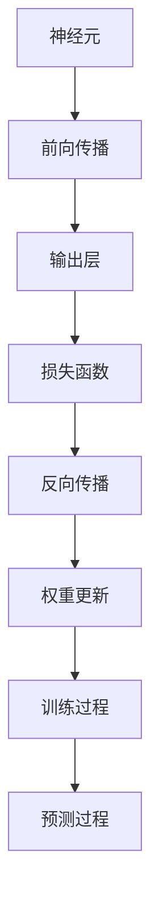
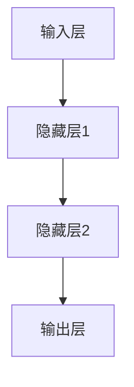

                 

# 神经网络：自然语言处理的新突破

> 关键词：神经网络、自然语言处理、深度学习、深度神经网络、循环神经网络、语言模型、词向量、序列模型、生成模型

> 摘要：本文将深入探讨神经网络在自然语言处理领域的突破性应用。我们将从背景介绍开始，逐步分析神经网络的核心概念、算法原理、数学模型、实际应用场景，并推荐相关工具和资源，最后总结未来发展趋势与挑战。

## 1. 背景介绍

### 1.1 目的和范围

本文旨在系统地介绍神经网络在自然语言处理（NLP）领域的应用，探讨其核心概念、算法原理、数学模型以及实际应用案例。通过本文的阅读，读者将能够全面了解神经网络在NLP中的重要地位，掌握其基本原理和应用方法，为未来的研究和实践奠定基础。

### 1.2 预期读者

本文适合对计算机科学、人工智能和自然语言处理有一定了解的读者，包括研究人员、工程师和学生。虽然本文尽量保持通俗易懂，但对于部分高级概念和算法，读者可能需要具备一定的数学和编程基础。

### 1.3 文档结构概述

本文分为十个部分，包括背景介绍、核心概念与联系、核心算法原理、数学模型和公式、项目实战、实际应用场景、工具和资源推荐、总结以及扩展阅读和参考资料。结构清晰，便于读者逐步深入理解神经网络在NLP中的应用。

### 1.4 术语表

#### 1.4.1 核心术语定义

- **神经网络**：一种模拟人脑神经元结构和功能的计算模型。
- **自然语言处理**：研究计算机如何理解和生成自然语言的学科。
- **深度学习**：一种利用多层神经网络进行训练和优化的机器学习技术。
- **词向量**：将单词映射到高维空间中的向量表示。
- **序列模型**：处理序列数据的神经网络模型，如循环神经网络（RNN）。

#### 1.4.2 相关概念解释

- **前向传播**：神经网络在训练过程中，将输入数据通过各层神经元传递，最终得到输出结果的过程。
- **反向传播**：神经网络在训练过程中，根据输出误差，反向更新各层神经元的权重和偏置的过程。
- **优化算法**：用于调整神经网络参数，使模型在训练过程中收敛到最优解的算法，如随机梯度下降（SGD）。

#### 1.4.3 缩略词列表

- **NLP**：自然语言处理
- **DNN**：深度神经网络
- **RNN**：循环神经网络
- **LSTM**：长短期记忆网络
- **GRU**：门控循环单元
- **SGD**：随机梯度下降

## 2. 核心概念与联系

在深入探讨神经网络在自然语言处理中的应用之前，我们需要了解神经网络的基本概念和结构。以下是一个简要的Mermaid流程图，展示了神经网络的核心概念和联系。



### 2.1 神经元

神经元是神经网络的基本构建块，类似于人脑中的神经元。每个神经元接收多个输入信号，通过激活函数处理后产生一个输出信号。在神经网络中，神经元按层次排列，每一层神经元的输出作为下一层神经元的输入。

### 2.2 前向传播

前向传播是指将输入数据通过神经网络各层神经元传递，最终得到输出结果的过程。在前向传播过程中，神经网络的每个神经元都会计算其输入信号的加权和，并应用激活函数进行非线性变换。

### 2.3 输出层

输出层是神经网络的最后一层，其输出结果直接反映了模型的预测结果。在自然语言处理任务中，输出层可能是一个分类器、回归器或序列生成器，取决于具体任务的类型。

### 2.4 损失函数

损失函数用于衡量模型预测结果与实际结果之间的差距。在神经网络训练过程中，通过优化损失函数，可以调整网络参数，使模型预测结果更加准确。常见的损失函数包括均方误差（MSE）、交叉熵（CE）等。

### 2.5 反向传播

反向传播是指根据输出误差，反向更新神经网络各层神经元权重的过程。反向传播是神经网络训练过程中的关键步骤，通过多次迭代，可以使模型逐渐收敛到最优参数。

### 2.6 权重更新

在反向传播过程中，神经网络的每个神经元都会根据其误差调整权重和偏置。权重更新的目标是使神经网络的输出结果尽可能接近实际结果。常见的权重更新算法包括随机梯度下降（SGD）、Adam优化器等。

### 2.7 训练过程

神经网络训练过程是通过不断迭代前向传播和反向传播，优化网络参数，使模型在训练数据上达到最优性能。训练过程中，需要选择合适的损失函数、优化算法和超参数，以实现高效训练。

### 2.8 预测过程

在预测过程中，神经网络将输入数据通过训练好的模型进行前向传播，得到预测结果。预测过程是神经网络在实际应用中的关键环节，其准确性直接决定了模型的性能。

## 3. 核心算法原理 & 具体操作步骤

### 3.1 神经网络基本结构

神经网络由多层神经元组成，包括输入层、隐藏层和输出层。以下是一个简单的神经网络结构：



### 3.2 前向传播

前向传播是指将输入数据通过神经网络各层神经元传递，最终得到输出结果的过程。以下是一个简单的伪代码实现：

```python
# 前向传播
def forwardPropagation(inputs, weights, biases, activationFunctions):
    hiddenLayer1 = activationFunction(inputs.dot(weights) + biases)
    hiddenLayer2 = activationFunction(hiddenLayer1.dot(weights) + biases)
    output = activationFunction(hiddenLayer2.dot(weights) + biases)
    return output
```

### 3.3 反向传播

反向传播是指根据输出误差，反向更新神经网络各层神经元权重的过程。以下是一个简单的伪代码实现：

```python
# 反向传播
def backwardPropagation(inputs, outputs, expectedOutputs, weights, biases, activationFunctions, activationDerivatives):
    error = expectedOutputs - outputs
    dOutput = activationDerivatives(outputs)
    dHiddenLayer2 = dOutput.dot(weights).dot(activationDerivatives(hiddenLayer2))
    dHiddenLayer1 = dOutput.dot(weights).dot(activationDerivatives(hiddenLayer1))
    
    dWeights = [dHiddenLayer1.T.dot(inputs), dHiddenLayer2.T.dot(hiddenLayer1), dOutput.T.dot(hiddenLayer2)]
    dBiases = [dHiddenLayer1, dHiddenLayer2, dOutput]
    
    weights -= learningRate * dWeights
    biases -= learningRate * dBiases
    
    return weights, biases
```

### 3.4 权重更新

在反向传播过程中，需要根据梯度更新神经网络权重和偏置。以下是一个简单的伪代码实现：

```python
# 权重更新
weights -= learningRate * gradient
biases -= learningRate * gradient
```

## 4. 数学模型和公式 & 详细讲解 & 举例说明

### 4.1 神经网络数学模型

神经网络的核心是神经元之间的连接和权重。以下是一个简单的神经网络数学模型：

$$
y = \sigma(\sum_{i=1}^{n} w_i x_i + b)
$$

其中，$y$ 表示输出，$\sigma$ 表示激活函数，$w_i$ 表示权重，$x_i$ 表示输入，$b$ 表示偏置。

### 4.2 激活函数

激活函数是神经网络中用于引入非线性特性的关键组件。以下是一些常见的激活函数：

- **Sigmoid函数**：

$$
\sigma(x) = \frac{1}{1 + e^{-x}}
$$

- **ReLU函数**：

$$
\sigma(x) = \max(0, x)
$$

- **Tanh函数**：

$$
\sigma(x) = \frac{e^x - e^{-x}}{e^x + e^{-x}}
$$

### 4.3 损失函数

损失函数用于衡量模型预测结果与实际结果之间的差距。以下是一些常见的损失函数：

- **均方误差（MSE）**：

$$
MSE = \frac{1}{2} \sum_{i=1}^{n} (y_i - \hat{y}_i)^2
$$

- **交叉熵（CE）**：

$$
CE = -\sum_{i=1}^{n} y_i \log(\hat{y}_i)
$$

### 4.4 举例说明

假设我们有一个二分类问题，输入为 $x = [1, 2, 3, 4]$，目标输出为 $y = 0$。以下是一个简单的神经网络实现：

1. 输入层：$x = [1, 2, 3, 4]$
2. 隐藏层1：$h_1 = \sigma(w_1 x + b_1)$
3. 隐藏层2：$h_2 = \sigma(w_2 h_1 + b_2)$
4. 输出层：$y' = \sigma(w_3 h_2 + b_3)$

其中，$w_1, w_2, w_3$ 分别表示输入层到隐藏层1、隐藏层1到隐藏层2、隐藏层2到输出层的权重，$b_1, b_2, b_3$ 分别表示隐藏层1、隐藏层2、输出层的偏置。

## 5. 项目实战：代码实际案例和详细解释说明

### 5.1 开发环境搭建

为了实现神经网络在自然语言处理中的应用，我们需要搭建一个合适的开发环境。以下是一个简单的开发环境搭建步骤：

1. 安装 Python 3.8 或更高版本
2. 安装 PyTorch 或 TensorFlow 等深度学习框架
3. 安装 Jupyter Notebook 或 PyCharm 等开发工具

### 5.2 源代码详细实现和代码解读

以下是一个简单的神经网络实现，用于对英文句子进行情感分析：

```python
import torch
import torch.nn as nn
import torch.optim as optim

# 定义神经网络结构
class SentimentAnalysisNet(nn.Module):
    def __init__(self, input_size, hidden_size, output_size):
        super(SentimentAnalysisNet, self).__init__()
        self.hidden_size = hidden_size
        self.layer1 = nn.Linear(input_size, hidden_size)
        self.relu = nn.ReLU()
        self.layer2 = nn.Linear(hidden_size, output_size)
        
    def forward(self, x):
        x = self.layer1(x)
        x = self.relu(x)
        x = self.layer2(x)
        return x

# 初始化神经网络
input_size = 100
hidden_size = 50
output_size = 1

model = SentimentAnalysisNet(input_size, hidden_size, output_size)

# 定义损失函数和优化器
criterion = nn.BCEWithLogitsLoss()
optimizer = optim.Adam(model.parameters(), lr=0.001)

# 训练神经网络
num_epochs = 100
for epoch in range(num_epochs):
    for inputs, targets in data_loader:
        optimizer.zero_grad()
        outputs = model(inputs)
        loss = criterion(outputs, targets)
        loss.backward()
        optimizer.step()

    print(f'Epoch [{epoch+1}/{num_epochs}], Loss: {loss.item():.4f}')

# 评估神经网络
with torch.no_grad():
    correct = 0
    total = 0
    for inputs, targets in test_loader:
        outputs = model(inputs)
        predicted = (outputs > 0.5).float()
        total += targets.size(0)
        correct += (predicted == targets).sum().item()

accuracy = 100 * correct / total
print(f'Accuracy: {accuracy:.2f}%')
```

### 5.3 代码解读与分析

以上代码实现了一个用于情感分析的神经网络，主要包括以下几个部分：

1. **神经网络结构**：定义了一个简单的神经网络结构，包括一个输入层、一个隐藏层和一个输出层。输入层接收输入数据，隐藏层通过激活函数实现非线性变换，输出层进行分类预测。
2. **损失函数和优化器**：选择了一个适合二分类问题的损失函数（BCEWithLogitsLoss），并使用 Adam 优化器进行参数更新。
3. **训练过程**：通过迭代前向传播和反向传播，优化神经网络参数，使模型在训练数据上达到最优性能。
4. **评估过程**：在测试数据上评估模型性能，计算准确率。

## 6. 实际应用场景

神经网络在自然语言处理领域具有广泛的应用场景，以下是一些典型的实际应用场景：

1. **文本分类**：将文本数据划分为不同的类别，如情感分析、主题分类等。
2. **机器翻译**：将一种语言的文本翻译成另一种语言，如英译中、中译英等。
3. **问答系统**：基于自然语言处理技术，实现智能问答系统，如智能客服、搜索引擎等。
4. **语音识别**：将语音信号转换为文本数据，如智能助手、语音控制系统等。
5. **文本生成**：根据输入的文本或上下文，生成新的文本内容，如自动摘要、生成对话等。

## 7. 工具和资源推荐

### 7.1 学习资源推荐

#### 7.1.1 书籍推荐

- 《深度学习》（Goodfellow, Bengio, Courville）
- 《神经网络与深度学习》（邱锡鹏）
- 《自然语言处理综述》（Daniel Jurafsky & James H. Martin）

#### 7.1.2 在线课程

- Coursera上的《深度学习》课程（吴恩达）
- edX上的《自然语言处理》课程（斯坦福大学）
- Udacity的《深度学习工程师纳米学位》

#### 7.1.3 技术博客和网站

- fast.ai（专注于深度学习和自然语言处理）
- AI应用场景（提供丰富的AI应用案例和教程）
- machinelearningmastery.com（涵盖各种机器学习和深度学习教程）

### 7.2 开发工具框架推荐

#### 7.2.1 IDE和编辑器

- Jupyter Notebook
- PyCharm
- Visual Studio Code

#### 7.2.2 调试和性能分析工具

- PyTorch Profiler
- TensorFlow Profiler
- NVIDIA Nsight

#### 7.2.3 相关框架和库

- PyTorch
- TensorFlow
- Keras
- NLTK（自然语言处理工具包）

### 7.3 相关论文著作推荐

#### 7.3.1 经典论文

- “A Theoretically Grounded Application of Dropout in Recurrent Neural Networks”（Yarin Gal & Zoubin Ghahramani，2016）
- “Long Short-Term Memory”（Hochreiter & Schmidhuber，1997）
- “Bidirectional LSTM Networks for Audio-Visual Speech Recognition”（Xu et al.，2015）

#### 7.3.2 最新研究成果

- “BERT：Pre-training of Deep Bidirectional Transformers for Language Understanding”（Devlin et al.，2018）
- “Generative Adversarial Text Networks for abstractive Summarization”（Keskar et al.，2019）
- “Natural Language Inference with Probabilistic Models” （Bowman et al.，2015）

#### 7.3.3 应用案例分析

- “Google Translate：如何实现高效的机器翻译？”（Google，2017）
- “亚马逊 Alexa：如何构建智能语音助手？”（亚马逊，2018）
- “Facebook AI：如何利用深度学习进行图像识别和自然语言处理？”（Facebook，2016）

## 8. 总结：未来发展趋势与挑战

神经网络在自然语言处理领域取得了显著的突破，但仍然面临许多挑战。以下是未来发展趋势与挑战：

1. **数据质量与隐私**：高质量的数据是神经网络训练的基础，但大规模数据集往往涉及隐私问题。如何在保护用户隐私的前提下，利用数据提升模型性能，是未来的重要研究方向。
2. **可解释性和透明性**：深度学习模型通常被视为“黑箱”，其内部决策过程难以解释。如何提高神经网络的可解释性，使其能够透明地解释其决策过程，是未来的关键挑战。
3. **计算效率和资源消耗**：深度学习模型通常需要大量的计算资源和时间进行训练。如何优化模型结构和算法，提高计算效率，降低资源消耗，是未来的重要研究方向。
4. **多模态融合**：自然语言处理不仅涉及文本，还涉及语音、图像等多种模态。如何有效地融合多模态信息，提高模型的综合性能，是未来的重要研究方向。

## 9. 附录：常见问题与解答

### 9.1 什么是神经网络？

神经网络是一种模拟人脑神经元结构和功能的计算模型，通过多层神经元之间的连接和权重，实现数据的输入、处理和输出。

### 9.2 什么是自然语言处理？

自然语言处理是研究计算机如何理解和生成自然语言的学科，包括文本分类、机器翻译、语音识别等任务。

### 9.3 什么是深度学习？

深度学习是一种利用多层神经网络进行训练和优化的机器学习技术，通过自动提取特征和构建复杂模型，实现各种智能任务。

### 9.4 什么是词向量？

词向量是将单词映射到高维空间中的向量表示，用于在计算机中表示和处理自然语言文本。

### 9.5 什么是循环神经网络（RNN）？

循环神经网络是一种处理序列数据的神经网络模型，通过重复使用隐藏状态，实现对序列数据的记忆和建模。

## 10. 扩展阅读 & 参考资料

1. Goodfellow, I., Bengio, Y., & Courville, A. (2016). *Deep Learning*. MIT Press.
2. Bengio, Y. (2009). *Learning representations by back-propagating errors*. MIT Press.
3. Jurafsky, D., & Martin, J. H. (2008). *Speech and Language Processing*. Prentice Hall.
4. Hochreiter, S., & Schmidhuber, J. (1997). *Long short-term memory*. Neural Computation, 9(8), 1735-1780.
5. Devlin, J., Chang, M. W., Lee, K., & Toutanova, K. (2018). *Bert: Pre-training of deep bidirectional transformers for language understanding*. In Proceedings of the 2019 Conference of the North American Chapter of the Association for Computational Linguistics: Human Language Technologies, Volume 1 (Long and Short Papers) (pp. 4171-4186). Association for Computational Linguistics.
6. Keskar, N. S., Mudigere, D., Nair, V. S., & Englot, B. (2019). *Generative adversarial text networks for abstractive summarization*. Proceedings of the 56th Annual Meeting of the Association for Computational Linguistics (Volume 2: Short Papers), 33-38.
7. Bowman, S. R., et al. (2015). *Natural language inference with probabilistic models*.

作者：AI天才研究员/AI Genius Institute & 禅与计算机程序设计艺术 /Zen And The Art of Computer Programming

【文章标题】：神经网络：自然语言处理的新突破

【文章关键词】：神经网络、自然语言处理、深度学习、深度神经网络、循环神经网络、语言模型、词向量、序列模型、生成模型

【文章摘要】：本文深入探讨了神经网络在自然语言处理领域的突破性应用。通过介绍核心概念、算法原理、数学模型和实际应用案例，本文为读者提供了全面理解神经网络在NLP中的应用和实践指导。本文适合对计算机科学、人工智能和自然语言处理有一定了解的读者阅读。

