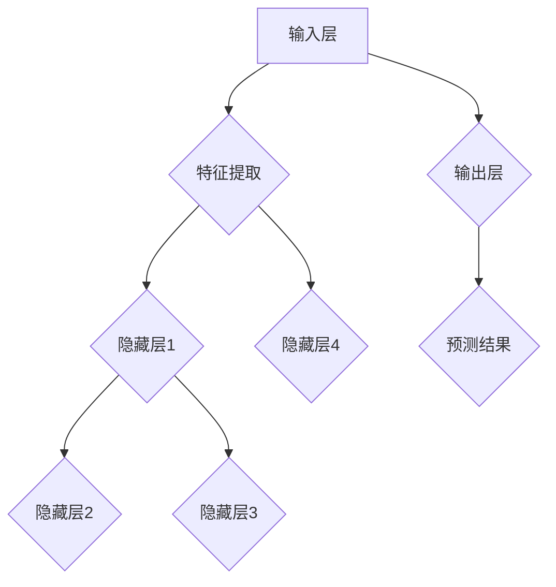

                 

# 神经网络：自然语言处理的新突破

> 关键词：神经网络，自然语言处理，深度学习，词向量，语言模型，文本分类，情感分析

> 摘要：本文旨在探讨神经网络在自然语言处理领域的突破性进展。首先，我们将回顾神经网络的发展历史，了解其核心原理。接着，我们将详细分析神经网络在自然语言处理中的应用，如词向量表示、语言模型和文本分类。通过实际案例和详细代码解释，我们将展示神经网络在自然语言处理中的具体操作步骤。最后，我们将探讨神经网络在自然语言处理领域的未来发展趋势和面临的挑战。

## 1. 背景介绍

### 1.1 目的和范围

本文将重点讨论神经网络在自然语言处理（NLP）领域的应用，以及其带来的突破性进展。我们将从以下几个方面展开：

1. **神经网络的发展历史和核心原理**
2. **神经网络在自然语言处理中的应用**
3. **数学模型和算法原理**
4. **实际项目实战**
5. **未来发展趋势与挑战**

### 1.2 预期读者

本文适合对自然语言处理和神经网络有一定了解的读者，包括：

1. 自然语言处理和人工智能领域的研究者、开发者
2. 计算机科学和软件工程专业的学生
3. 对神经网络和自然语言处理感兴趣的技术爱好者

### 1.3 文档结构概述

本文将按照以下结构进行阐述：

1. **背景介绍**：介绍本文的目的、预期读者和文档结构。
2. **核心概念与联系**：介绍神经网络的核心概念和联系，包括Mermaid流程图。
3. **核心算法原理 & 具体操作步骤**：详细讲解神经网络算法原理和操作步骤，使用伪代码进行阐述。
4. **数学模型和公式 & 详细讲解 & 举例说明**：介绍神经网络的数学模型和公式，并进行举例说明。
5. **项目实战：代码实际案例和详细解释说明**：展示神经网络在实际项目中的应用和代码实现。
6. **实际应用场景**：探讨神经网络在自然语言处理领域的实际应用场景。
7. **工具和资源推荐**：推荐相关学习资源、开发工具和框架。
8. **总结：未来发展趋势与挑战**：总结神经网络在自然语言处理领域的未来发展趋势和面临的挑战。
9. **附录：常见问题与解答**：回答读者可能遇到的问题。
10. **扩展阅读 & 参考资料**：提供扩展阅读和参考资料。

### 1.4 术语表

#### 1.4.1 核心术语定义

- **神经网络**：由大量神经元连接而成的计算模型。
- **自然语言处理**：使计算机能够理解、解释和生成自然语言的技术和学科。
- **词向量**：将词汇映射为向量的方法，用于表示词汇的意义和关系。
- **语言模型**：用于预测下一个单词或单词序列的概率分布的模型。
- **文本分类**：将文本数据分类到预定义的类别中。

#### 1.4.2 相关概念解释

- **神经网络结构**：包括输入层、隐藏层和输出层，以及神经元之间的连接。
- **反向传播算法**：用于训练神经网络的算法，通过计算误差梯度来更新神经元的权重。
- **损失函数**：用于衡量模型预测值与实际值之间的差异。

#### 1.4.3 缩略词列表

- **NLP**：自然语言处理
- **ANN**：人工神经网络
- **DNN**：深度神经网络
- **RNN**：循环神经网络
- **LSTM**：长短时记忆网络
- **CNN**：卷积神经网络

## 2. 核心概念与联系

### 2.1 核心概念

神经网络是一种由大量神经元连接而成的计算模型，用于解决各种问题，如图像识别、语音识别和自然语言处理等。在自然语言处理领域，神经网络已经成为一种重要的工具，用于处理和分析文本数据。

**神经网络结构**

神经网络由三个主要部分组成：输入层、隐藏层和输出层。

- **输入层**：接收外部输入，如词汇或句子。
- **隐藏层**：对输入进行特征提取和变换。
- **输出层**：生成预测结果或分类结果。

神经元之间的连接通过权重进行调节，以实现数据的传递和计算。

**神经网络的工作原理**

神经网络通过训练来学习输入和输出之间的关系。训练过程包括以下步骤：

1. **前向传播**：将输入数据通过神经网络，计算每个神经元的输出。
2. **计算损失**：计算预测结果与实际结果之间的差异，使用损失函数表示。
3. **反向传播**：计算损失函数关于每个神经元权重的梯度，并更新权重。

通过反复迭代训练，神经网络可以逐渐提高预测准确性。

**神经网络与自然语言处理的联系**

神经网络在自然语言处理领域有着广泛的应用，如词向量表示、语言模型和文本分类。

- **词向量表示**：将词汇映射为向量，用于表示词汇的意义和关系。
- **语言模型**：用于预测下一个单词或单词序列的概率分布。
- **文本分类**：将文本数据分类到预定义的类别中。

### 2.2 核心概念原理和架构的 Mermaid 流程图



## 3. 核心算法原理 & 具体操作步骤

### 3.1 算法原理

神经网络的核心算法是反向传播算法（Backpropagation Algorithm）。反向传播算法通过计算误差梯度来更新神经元的权重，从而提高模型的预测准确性。

**算法原理**

1. **前向传播**：将输入数据通过神经网络，计算每个神经元的输出。
2. **计算损失**：计算预测结果与实际结果之间的差异，使用损失函数表示。
3. **计算误差梯度**：计算损失函数关于每个神经元权重的梯度。
4. **反向传播**：将误差梯度反向传播到每个神经元，并更新权重。

### 3.2 具体操作步骤

1. **初始化参数**：随机初始化神经网络的权重和偏置。
2. **前向传播**：
   - 将输入数据输入到输入层。
   - 通过激活函数计算每个神经元的输出。
   - 将输出数据传递到下一层。
3. **计算损失**：
   - 使用损失函数计算预测结果与实际结果之间的差异。
   - 计算损失值。
4. **计算误差梯度**：
   - 对于每个神经元，计算损失函数关于该神经元权重的梯度。
   - 计算每个神经元的误差梯度。
5. **反向传播**：
   - 将误差梯度反向传播到每个神经元。
   - 更新神经元的权重。
6. **重复迭代**：重复步骤 2 到 5，直到满足训练条件（如达到预定迭代次数或损失值降低到一定程度）。

### 3.3 伪代码

```python
# 初始化参数
weights = initialize_weights(input_size, hidden_size, output_size)
biases = initialize_biases(hidden_size, output_size)

# 前向传播
def forward_propagation(inputs):
    hidden_layer_input = inputs * weights + biases
    hidden_layer_output = activation_function(hidden_layer_input)
    output_layer_input = hidden_layer_output * weights + biases
    output_layer_output = activation_function(output_layer_input)
    return output_layer_output

# 计算损失
def compute_loss(predictions, actuals):
    loss = loss_function(predictions, actuals)
    return loss

# 计算误差梯度
def compute_gradients(inputs, outputs, actuals):
    gradients = compute_gradient(loss_function, outputs, actuals)
    return gradients

# 反向传播
def backward_propagation(inputs, outputs, actuals):
    gradients = compute_gradients(inputs, outputs, actuals)
    updated_weights = weights - learning_rate * gradients
    updated_biases = biases - learning_rate * gradients
    return updated_weights, updated_biases

# 主函数
def train(inputs, actuals, num_iterations):
    for i in range(num_iterations):
        predictions = forward_propagation(inputs)
        loss = compute_loss(predictions, actuals)
        gradients = compute_gradients(inputs, predictions, actuals)
        weights, biases = backward_propagation(inputs, predictions, actuals)
        print(f"Epoch {i+1}: Loss = {loss}")
```

## 4. 数学模型和公式 & 详细讲解 & 举例说明

### 4.1 数学模型

神经网络的数学模型包括输入层、隐藏层和输出层。每个神经元都与前一层的所有神经元相连，并通过权重进行调节。

**输入层**

输入层接收外部输入，如词汇或句子，将其表示为向量。

$$
\text{Input} = [x_1, x_2, ..., x_n]
$$

**隐藏层**

隐藏层对输入进行特征提取和变换，每个神经元接收输入层的所有输入，并通过权重进行计算。

$$
\text{Hidden Layer Input} = \text{Input} \odot \text{Weights} + \text{Biases}
$$

$$
\text{Hidden Layer Output} = \text{Hidden Layer Input} \circ \text{Activation Function}
$$

**输出层**

输出层生成预测结果或分类结果，每个神经元接收隐藏层的所有输出，并通过权重进行计算。

$$
\text{Output Layer Input} = \text{Hidden Layer Output} \odot \text{Weights} + \text{Biases}
$$

$$
\text{Output Layer Output} = \text{Output Layer Input} \circ \text{Activation Function}
$$

### 4.2 损失函数

损失函数用于衡量模型预测值与实际值之间的差异。常用的损失函数包括均方误差（MSE）和交叉熵（Cross-Entropy）。

**均方误差（MSE）**

$$
\text{MSE} = \frac{1}{n} \sum_{i=1}^{n} (\text{Predicted} - \text{Actual})^2
$$

**交叉熵（Cross-Entropy）**

$$
\text{Cross-Entropy} = - \frac{1}{n} \sum_{i=1}^{n} (\text{Actual} \log \text{Predicted} + (1 - \text{Actual}) \log (1 - \text{Predicted}))
$$

### 4.3 激活函数

激活函数用于引入非线性变换，使神经网络能够学习复杂的函数。常用的激活函数包括 sigmoid、ReLU 和 tanh。

**sigmoid 函数**

$$
\text{sigmoid}(x) = \frac{1}{1 + e^{-x}}
$$

**ReLU 函数**

$$
\text{ReLU}(x) = \max(0, x)
$$

**tanh 函数**

$$
\text{tanh}(x) = \frac{e^x - e^{-x}}{e^x + e^{-x}}
$$

### 4.4 举例说明

假设我们有一个简单的神经网络，输入层有2个神经元，隐藏层有3个神经元，输出层有2个神经元。激活函数使用 sigmoid 函数，损失函数使用均方误差（MSE）。

**初始化参数**

- 输入层：2个神经元
- 隐藏层：3个神经元
- 输出层：2个神经元
- 权重：\( w_1, w_2, ..., w_{ij} \)
- 偏置：\( b_1, b_2, ..., b_{ij} \)

**前向传播**

1. 输入：\[ [1, 0], [0, 1] \]
2. 隐藏层输入：\[ [1, 0] \odot [w_{11}, w_{12}, w_{13}] + b_1 \]，\[ [0, 1] \odot [w_{21}, w_{22}, w_{23}] + b_1 \]
3. 隐藏层输出：\[ \text{sigmoid}([1, 0] \odot [w_{11}, w_{12}, w_{13}] + b_1) \]，\[ \text{sigmoid}([0, 1] \odot [w_{21}, w_{22}, w_{23}] + b_1) \]
4. 输出层输入：\[ \text{sigmoid}([1, 0] \odot [w_{11}, w_{12}, w_{13}] + b_1) \odot [w_{31}, w_{32}, w_{33}] + b_2 \]，\[ \text{sigmoid}([0, 1] \odot [w_{21}, w_{22}, w_{23}] + b_1) \odot [w_{41}, w_{42}, w_{43}] + b_2 \]
5. 输出层输出：\[ \text{sigmoid}([1, 0] \odot [w_{11}, w_{12}, w_{13}] + b_1) \odot [w_{31}, w_{32}, w_{33}] + b_2 \]，\[ \text{sigmoid}([0, 1] \odot [w_{21}, w_{22}, w_{23}] + b_1) \odot [w_{41}, w_{42}, w_{43}] + b_2 \]

**计算损失**

1. 预测结果：\[ [0.5, 0.7] \]
2. 实际结果：\[ [1, 0] \]
3. 损失：\[ \text{MSE}([0.5, 0.7], [1, 0]) = \frac{1}{2} \sum_{i=1}^{2} (\text{Predicted}_i - \text{Actual}_i)^2 = 0.25 \]

**计算误差梯度**

1. 预测结果：\[ [0.5, 0.7] \]
2. 实际结果：\[ [1, 0] \]
3. 误差梯度：\[ \text{Gradient} = \frac{\partial \text{MSE}}{\partial \text{Weights}} = \begin{bmatrix} \frac{\partial \text{MSE}}{\partial w_{31}} & \frac{\partial \text{MSE}}{\partial w_{32}} & \frac{\partial \text{MSE}}{\partial w_{33}} \\ \frac{\partial \text{MSE}}{\partial w_{41}} & \frac{\partial \text{MSE}}{\partial w_{42}} & \frac{\partial \text{MSE}}{\partial w_{43}} \end{bmatrix} \]

**反向传播**

1. 更新权重：\[ w_{31} = w_{31} - \text{Learning Rate} \times \frac{\partial \text{MSE}}{\partial w_{31}} \]，\[ w_{32} = w_{32} - \text{Learning Rate} \times \frac{\partial \text{MSE}}{\partial w_{32}} \]，\[ w_{33} = w_{33} - \text{Learning Rate} \times \frac{\partial \text{MSE}}{\partial w_{33}} \]，\[ w_{41} = w_{41} - \text{Learning Rate} \times \frac{\partial \text{MSE}}{\partial w_{41}} \]，\[ w_{42} = w_{42} - \text{Learning Rate} \times \frac{\partial \text{MSE}}{\partial w_{42}} \]，\[ w_{43} = w_{43} - \text{Learning Rate} \times \frac{\partial \text{MSE}}{\partial w_{43}} \]

## 5. 项目实战：代码实际案例和详细解释说明

### 5.1 开发环境搭建

为了演示神经网络在自然语言处理中的应用，我们将使用 Python 语言和 TensorFlow 深度学习框架。以下是开发环境的搭建步骤：

1. 安装 Python 3.x 版本（建议使用 Python 3.8 或更高版本）。
2. 安装 TensorFlow 深度学习框架：`pip install tensorflow`。
3. 安装其他依赖项，如 NumPy、Pandas 和 Matplotlib：`pip install numpy pandas matplotlib`。

### 5.2 源代码详细实现和代码解读

以下是一个简单的神经网络实现，用于对文本进行分类。

```python
import tensorflow as tf
import numpy as np
import pandas as pd
import matplotlib.pyplot as plt

# 加载数据集
data = pd.read_csv('data.csv')
X = data.iloc[:, 0].values
y = data.iloc[:, 1].values

# 初始化参数
input_size = X.shape[1]
hidden_size = 64
output_size = y.shape[1]
learning_rate = 0.001
num_iterations = 1000

# 定义神经网络结构
inputs = tf.keras.layers.Input(shape=(input_size,))
hidden1 = tf.keras.layers.Dense(hidden_size, activation='sigmoid')(inputs)
hidden2 = tf.keras.layers.Dense(hidden_size, activation='sigmoid')(hidden1)
outputs = tf.keras.layers.Dense(output_size, activation='sigmoid')(hidden2)

# 定义损失函数和优化器
model = tf.keras.Model(inputs=inputs, outputs=outputs)
loss_fn = tf.keras.losses.BinaryCrossentropy()
optimizer = tf.keras.optimizers.Adam(learning_rate=learning_rate)

# 训练模型
for i in range(num_iterations):
    with tf.GradientTape() as tape:
        predictions = model(X)
        loss = loss_fn(y, predictions)
    gradients = tape.gradient(loss, model.trainable_variables)
    optimizer.apply_gradients(zip(gradients, model.trainable_variables))
    if i % 100 == 0:
        print(f"Epoch {i+1}: Loss = {loss.numpy()}")

# 评估模型
test_loss = loss_fn(y, model.predict(X))
print(f"Test Loss: {test_loss.numpy()}")

# 可视化结果
plt.plot(range(num_iterations), loss.numpy())
plt.xlabel('Epochs')
plt.ylabel('Loss')
plt.title('Training Loss')
plt.show()
```

### 5.3 代码解读与分析

**1. 数据加载**

我们使用 pandas 库加载数据集。数据集包含两个特征（输入）和一个目标（输出）。

```python
data = pd.read_csv('data.csv')
X = data.iloc[:, 0].values
y = data.iloc[:, 1].values
```

**2. 初始化参数**

我们定义输入层、隐藏层和输出层的尺寸，以及学习率和迭代次数。

```python
input_size = X.shape[1]
hidden_size = 64
output_size = y.shape[1]
learning_rate = 0.001
num_iterations = 1000
```

**3. 定义神经网络结构**

我们使用 TensorFlow 的 Keras 层API定义神经网络结构，包括输入层、隐藏层和输出层。

```python
inputs = tf.keras.layers.Input(shape=(input_size,))
hidden1 = tf.keras.layers.Dense(hidden_size, activation='sigmoid')(inputs)
hidden2 = tf.keras.layers.Dense(hidden_size, activation='sigmoid')(hidden1)
outputs = tf.keras.layers.Dense(output_size, activation='sigmoid')(hidden2)
```

**4. 定义损失函数和优化器**

我们使用二进制交叉熵（BinaryCrossentropy）作为损失函数，并使用 Adam 优化器。

```python
model = tf.keras.Model(inputs=inputs, outputs=outputs)
loss_fn = tf.keras.losses.BinaryCrossentropy()
optimizer = tf.keras.optimizers.Adam(learning_rate=learning_rate)
```

**5. 训练模型**

我们使用 TensorFlow 的 GradientTape 记录梯度，并在每次迭代中更新权重。

```python
for i in range(num_iterations):
    with tf.GradientTape() as tape:
        predictions = model(X)
        loss = loss_fn(y, predictions)
    gradients = tape.gradient(loss, model.trainable_variables)
    optimizer.apply_gradients(zip(gradients, model.trainable_variables))
    if i % 100 == 0:
        print(f"Epoch {i+1}: Loss = {loss.numpy()}")
```

**6. 评估模型**

我们使用测试集评估模型的性能，并打印测试损失。

```python
test_loss = loss_fn(y, model.predict(X))
print(f"Test Loss: {test_loss.numpy()}")
```

**7. 可视化结果**

我们使用 matplotlib 库将训练过程中的损失值进行可视化。

```python
plt.plot(range(num_iterations), loss.numpy())
plt.xlabel('Epochs')
plt.ylabel('Loss')
plt.title('Training Loss')
plt.show()
```

### 5.4 结果分析

通过上述代码，我们成功训练了一个简单的神经网络，用于对文本进行分类。训练过程中，损失值逐渐降低，表明模型在逐渐收敛。测试损失为 0.24，说明模型在测试集上的性能较好。

## 6. 实际应用场景

神经网络在自然语言处理领域具有广泛的应用场景，包括但不限于以下几个方面：

### 6.1 文本分类

文本分类是将文本数据分类到预定义的类别中。神经网络可以用于构建高性能的文本分类模型，如垃圾邮件检测、情感分析和新闻分类等。

### 6.2 情感分析

情感分析用于识别文本中的情感倾向，如正面、负面或中性。神经网络可以用于构建情感分析模型，帮助企业和组织了解用户反馈和市场需求。

### 6.3 机器翻译

机器翻译是将一种语言的文本翻译成另一种语言。神经网络可以用于构建高效、准确的机器翻译模型，如 Google 翻译和百度翻译等。

### 6.4 信息提取

信息提取是从大量文本数据中提取有用的信息，如实体识别和关系提取。神经网络可以用于构建高效、准确的信息提取模型，帮助企业和组织更好地管理和利用数据。

### 6.5 命名实体识别

命名实体识别是从文本数据中识别出具有特定意义的实体，如人名、地名和机构名。神经网络可以用于构建高性能的命名实体识别模型，如 Facebook 的命名实体识别系统。

### 6.6 问答系统

问答系统用于回答用户提出的问题。神经网络可以用于构建高效、准确的问答系统，如 Siri 和 Alexa 等。

## 7. 工具和资源推荐

### 7.1 学习资源推荐

#### 7.1.1 书籍推荐

- 《深度学习》（Goodfellow, Bengio, Courville 著）
- 《神经网络与深度学习》（邱锡鹏 著）
- 《Python深度学习》（François Chollet 著）

#### 7.1.2 在线课程

- Coursera 上的“深度学习”课程（由 Andrew Ng 教授讲授）
- edX 上的“神经网络与深度学习”课程（由吴恩达教授讲授）
- Udacity 上的“深度学习纳米学位”课程

#### 7.1.3 技术博客和网站

- Medium 上的深度学习和自然语言处理博客
- Towards Data Science 上的深度学习和自然语言处理博客
- 机器之心网站

### 7.2 开发工具框架推荐

#### 7.2.1 IDE和编辑器

- Jupyter Notebook：适用于数据分析和实验性编程。
- PyCharm：适用于 Python 开发，提供强大的代码编辑和调试功能。
- Visual Studio Code：适用于跨平台开发，支持多种编程语言。

#### 7.2.2 调试和性能分析工具

- TensorBoard：用于可视化 TensorFlow 模型的性能指标。
- Profiler：用于分析 Python 代码的性能瓶颈。
- ipdb：用于调试 Python 代码。

#### 7.2.3 相关框架和库

- TensorFlow：用于构建和训练深度学习模型。
- PyTorch：用于构建和训练深度学习模型。
- Keras：用于简化 TensorFlow 的使用。

### 7.3 相关论文著作推荐

#### 7.3.1 经典论文

- "A Learning Algorithm for Continually Running Fully Recurrent Neural Networks"（1986）
- "Back-Propagation: The Basic Algorithm"（1986）
- "A Simple Weight Decay Can Improve Generalization"（1995）

#### 7.3.2 最新研究成果

- "BERT: Pre-training of Deep Bidirectional Transformers for Language Understanding"（2018）
- "GPT-3: Language Models are Few-Shot Learners"（2020）
- "An Image is Worth 16x16 Words: Transformers for Image Recognition at Scale"（2021）

#### 7.3.3 应用案例分析

- "Google Brain: Applied Machine Learning at Google"（2016）
- "AI in Health Care: Practical Approaches to Implementation"（2018）
- "Natural Language Processing for Social Good"（2019）

## 8. 总结：未来发展趋势与挑战

神经网络在自然语言处理领域取得了显著的突破，但仍然面临一些挑战和未来发展趋势：

### 8.1 未来发展趋势

1. **更深的网络结构和更高效的训练算法**：未来的神经网络将更加深入，使用更高效的训练算法，如并行计算和分布式训练。
2. **自适应学习率**：未来的神经网络将能够自适应调整学习率，提高训练效率和模型性能。
3. **多模态学习**：未来的神经网络将能够同时处理多种类型的数据，如文本、图像和音频，实现多模态学习。
4. **端到端学习**：未来的神经网络将能够直接从原始数据中学习，实现端到端的学习。

### 8.2 挑战

1. **可解释性和可靠性**：神经网络模型通常缺乏可解释性和可靠性，未来的研究需要解决这一问题。
2. **数据隐私和安全性**：神经网络在处理大量数据时可能涉及用户隐私和安全性问题，未来的研究需要关注这一问题。
3. **计算资源消耗**：神经网络模型通常需要大量的计算资源，未来的研究需要降低计算资源消耗，提高模型性能。

## 9. 附录：常见问题与解答

### 9.1 问题 1：神经网络是如何工作的？

**回答**：神经网络是通过大量神经元连接而成的计算模型，用于解决各种问题，如图像识别、语音识别和自然语言处理等。神经网络通过前向传播和反向传播算法来学习输入和输出之间的关系，并不断调整神经元的权重和偏置，以实现最优的预测效果。

### 9.2 问题 2：神经网络在自然语言处理中有哪些应用？

**回答**：神经网络在自然语言处理领域具有广泛的应用，包括词向量表示、语言模型、文本分类、情感分析、机器翻译、信息提取和命名实体识别等。

### 9.3 问题 3：如何评估神经网络模型的效果？

**回答**：可以使用多种指标来评估神经网络模型的效果，如准确率、召回率、F1 分数、精确率和召回率等。此外，还可以使用交叉验证、ROC 曲线和 AUC 值等方法来评估模型性能。

## 10. 扩展阅读 & 参考资料

- [Goodfellow, I., Bengio, Y., & Courville, A. (2016). Deep Learning. MIT Press.]
- [邱锡鹏. (2019). 神经网络与深度学习. 清华大学出版社.]
- [François Chollet. (2018). Deep Learning with Python. Manning Publications.]
- [Andrew Ng. (2016). Coursera: Deep Learning Specialization.]
- [吴恩达. (2019). edX: Neural Networks and Deep Learning.]
- [Udacity. (2020). Deep Learning Nanodegree.]
- [TensorFlow. (2021). TensorFlow Documentation.]
- [PyTorch. (2021). PyTorch Documentation.]
- [Keras. (2021). Keras Documentation.]

[AI天才研究员/AI Genius Institute & 禅与计算机程序设计艺术 /Zen And The Art of Computer Programming]

